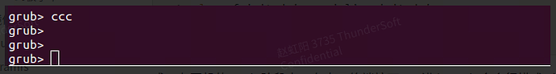

# RUBIK Pi 3 主线 Linux 运行方法

作者：赵虹阳

下面分享下我的 Linux 主线的调试方法。

## 1. 烧录基础版本

烧录 RUBIK Pi 的 Debian 或 Ubuntu 系统（支持 GRUB 引导，大概的启动流程为 PBL → XBL → UEFI → GRUB → KERNEL → 桌面系统）；

如果使用 QLI 版本， 需要将 efi.bin 中的 kernel 镜像替换 ，并将主线编译出的内核 ko 文件 push 到 /lib/firmware 目录下。

我选择烧录 Debian13 V1.1 镜像（镜像可访问 rubikpi.ai 下载），因为 Debian 系统默认使能了 ADB ，方便进行调试；
Ubuntu 系统的操作方法和 Debian 是一样的，选择任一即可。

烧录方法请访问 rubikpi.ai 中的用户手册相关章节获取。

## 2. 下载内核

使用下面命令下载主线内核，这可能会花费数个小时：

```
git clone git://git.kernel.org/pub/scm/linux/kernel/git/torvalds/linux.git
```

或者使用谷歌镜像，会比较快

```
git clone https://kernel.googlesource.com/pub/scm/linux/kernel/git/torvalds/linux.git
```

进行开发时，需要切换到 master-next 分支

```
git remote add linux-next https://git.kernel.org/pub/scm/linux/kernel/git/next/linux-next.git
git fetch linux-next
git fetch --tags linux-next
```

列出 next-* 的 tag

```
git tag -l "next-*" | tail
```

选择最新的 tag 创建开发分支

```
git checkout -b my_local_branch next-20251222
```

## 3. 编译内核

### 3.1 安装交叉编译工具链

我这里使用 `aarch64-linux-gnu-`, aarch64-linux-gnu-gcc 是由 Linaro 公司基于 GCC 推出的的 ARM 交叉编译工具：

```
sudo apt install gcc-aarch64-linux-gnu
```

### 3.2 修改 defconfig

将 CONFIG_SCSI_UFS_QCOM 的配置从 m 改为 y

```
CONFIG_SCSI_UFS_QCOM=y
```

### 3.3 编译所有

```
export ARCH=arm64
export CROSS_COMPILE=aarch64-linux-gnu-

make defconfig

make -j`nproc`
```

### 3.4 打包设备树和 ko

设备树，如下的 dtb.bin 来自步骤1 的 flat 包中

```
mkdir -p dtb_mnt
sudo mount dtb.bin dtb_mnt/
sudo cp arch/arm64/boot/dts/qcom/qcs6490-thundercomm-rubikpi3.dtb dtb_mnt/combined-dtb.dtb
sudo umount dtb_mnt
```

ko

```
mkdir modules
INSTALL_MOD_PATH=modules make modules_install
```

## 4. 准备主线内核运行条件

### 4.1 将 ko push 到板子中

```
adb push modules/lib/modules/6.17.0-rc6-g465ced7052f5/ /lib/modules
```

### 4.2 将镜像 push 到板子中

```
adb push arch/arm64/boot/Image /boot/vmlinuz-mainline
```

### 4.3 将固件 push 到板子中

* Push 上游固件

```
git clone https://git.kernel.org/pub/scm/linux/kernel/git/firmware/linux-frimware

cd linux-firmware
mkdir tmp
sudo make install DESTDIR=tmp
adb push tmp/lib/firmware /root

adb shell

rm /lib/firmware -r
cp /root/firmware /lib/
```

* Push 下游固件
  
  [点击下载固件](https://pan.thundersoft.com/web/share.html?hash=KchzIWzgSnU)

```
adb push renesas_usb_fw.mem /lib/firmware
adb push brcmfmac43456-sdio.* /lib/firmware/brcm/
adb push BCM4345C5.hcd /lib/firmware/brcm/
```
### 4.4 制作 initramfs

1. 将 [force-all-qcom-firmware](https://pan.thundersoft.com/web/share.html?hash=KchzIWzgSnU) 这个文件推送到 /etc/initramfs-tools/hooks 目录下，脚本中强制打包了 qcom 目录下的固件。

```
adb push force-all-qcom-firmware /etc/initramfs-tools/hooks
adb shell "chmod +x /etc/initramfs-tools/hooks/force-all-qcom-firmware"
```

2. 运行如下命令，其中的6.17.0-rc6-g465ced7052f5 按情况修改， 也可以从 4.1 中的 ko 路径获取

```
adb push .config /boot/config-6.17.0-rc6-g465ced7052f5
adb shell "mkinitramfs -o /boot/initrd.img-mainline -k 6.17.0-rc6-g465ced7052f5"
```

### 4.5 将主线内核作为启动内核

可以使用下面方法（改变默认加载的 内核和 initrd）

```
adb shell
cd /boot
ln -sf vmlinuz-mainline vmlinuz
ln -sf initrd.img-mainline initrd.img
update-grub
```

或，在开机的 grub 阶段中，在串口终端按下 c，进入 grub 命令行模式（本次开机中改变内核和 initrd）：

:::note
注意要烧录好设备树，如果想切换回去也要把设备树烧回去
root=UUID=… 是 cmd line ，可以按情况修改


:::

```
linux /boot/vmlinuz-mainline root=UUID=131450ff-95bc-4791-b611-70855201b0cd rw  console=ttyMSM0,115200n8 pcie_pme=nomsi earlycon ignore_loglevel quiet  splash vt.handoff=7


initrd /boot/initrd.img-mainline

boot
```

### 4.6 烧录设备树

dtb.bin 来自步骤 3.3。
如下进入 fastboot 模式烧录，或在设备终端中使用 dd 命令烧录（`sudo dd if=dtb.bin of=/dev/disk/by-partlabel/dtb_a bs=4M`）

```
reboot bootloader
fastboot flash dtb_a dtb.bin
fastboot reboot
```
## 5. 检查内核

开机后执行命令，查看运行的内核版本

```
uname -r
```


