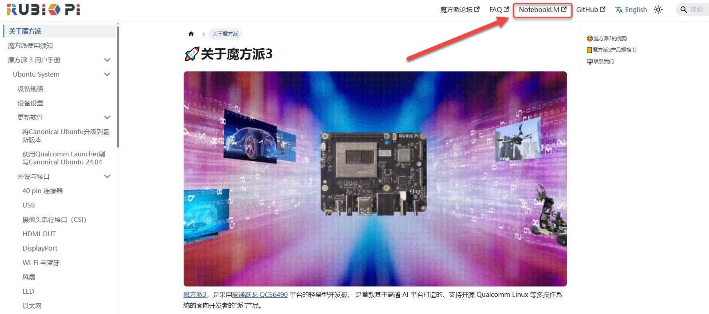
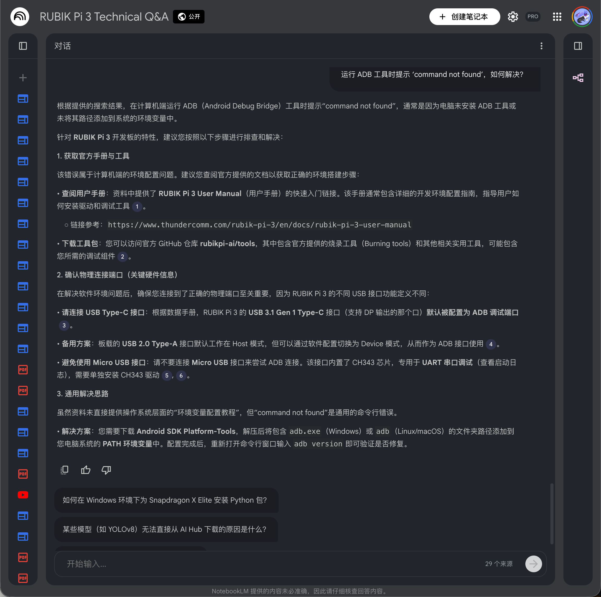

# 如何使用 AI 助手 (NotebookLM)

## 概述

为了提升开发者的查阅效率，魔方派 文档现已集成 **Google NotebookLM** 功能。该工具将我们静态的技术资料库（包括数据手册、SDK 指南和常见问题解答）转化为可交互的知识库。
您无需在海量文档中手动检索，只需使用自然语言提问，即可快速获取技术摘要、参数说明及代码片段。

## 使用步骤

第一步：进入界面
请点击当前页面 顶部导航栏中的 **NotebookLM** 按钮，即可在弹出的窗口中启动 AI 助手。

第二步：提交问题
在 NotebookLM 界面底部的对话框中输入您的技术问题。系统将自动分析 魔方派 的全套文档并生成回答。

## 提问技巧指南
为了获得更精准的回答，建议使用具体且包含充分背景信息的提问方式。

| 查询示例 | 推荐提问示例 |
|----------|--------------|
| 硬件资料 | 列出 魔方派 3 的 40-pin GPIO 引脚定义表。|
| 系统安装 | 如何将 Linux 镜像烧录到 魔方派 3？（支持 SD 卡启动吗？） |
| 调试排查 | 运行 ADB 工具时提示 ‘command not found’，如何解决？ |
| 刷机救砖 | 刷机时电脑无法识别设备 (9008/Fastboot)，如何修复 USB 驱动？ |

## 功能说明

- **答案溯源**： AI 生成的每一条回答均附带数字引用标签。点击标签即可跳转至原始文档页面，以便核对信息的准确性。
- **专属知识库**： 该助手基于 魔方派 官方软硬件手册训练，确保回答的针对性。
- **多语言支持**： 支持使用中文或英文提问，系统将根据您的输入语言进行反馈。