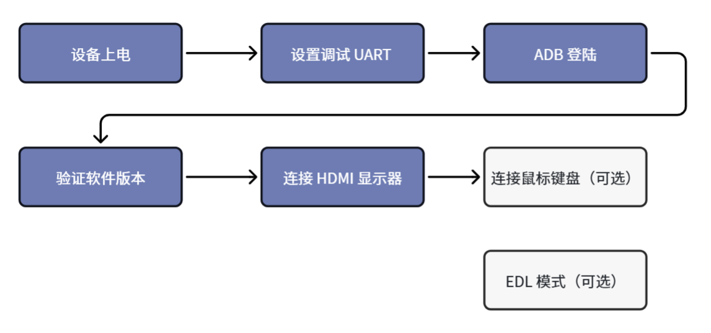
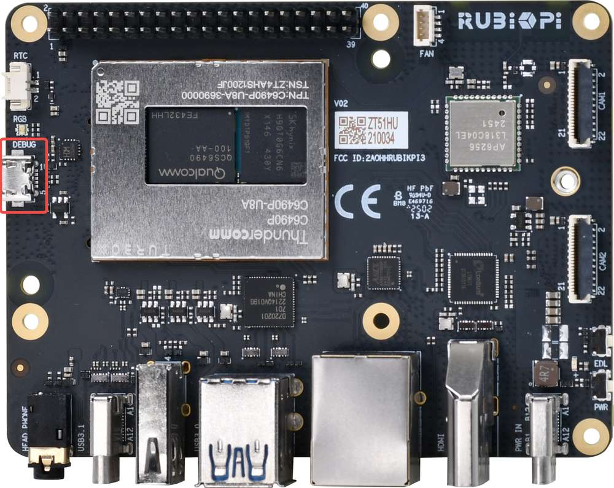
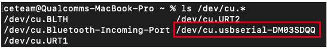
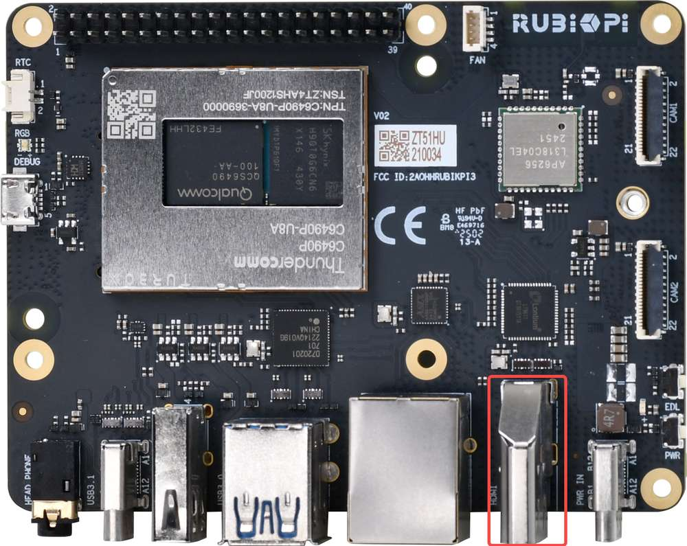
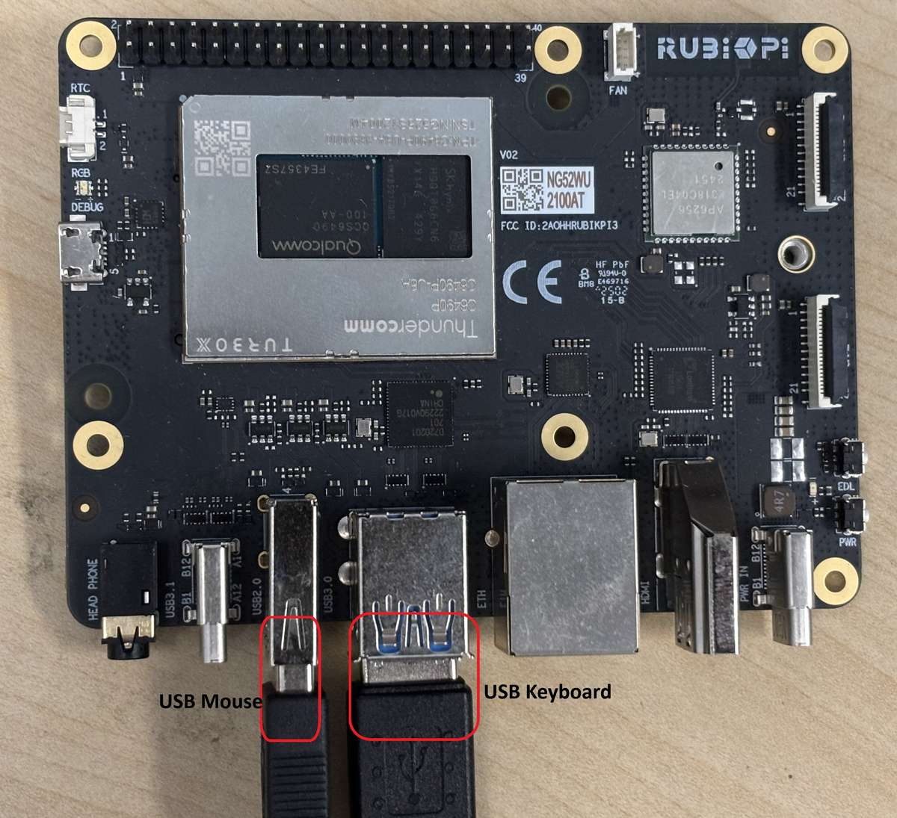
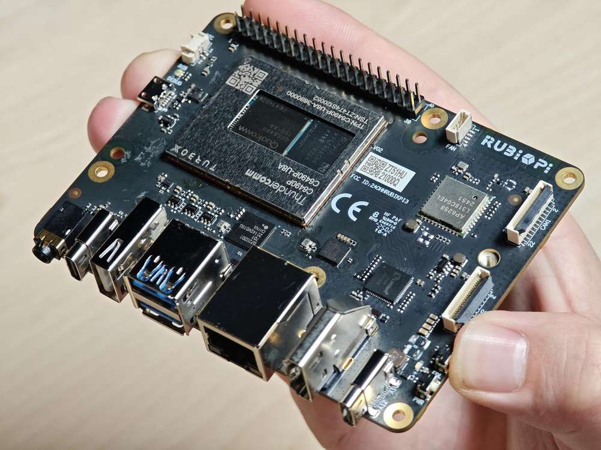
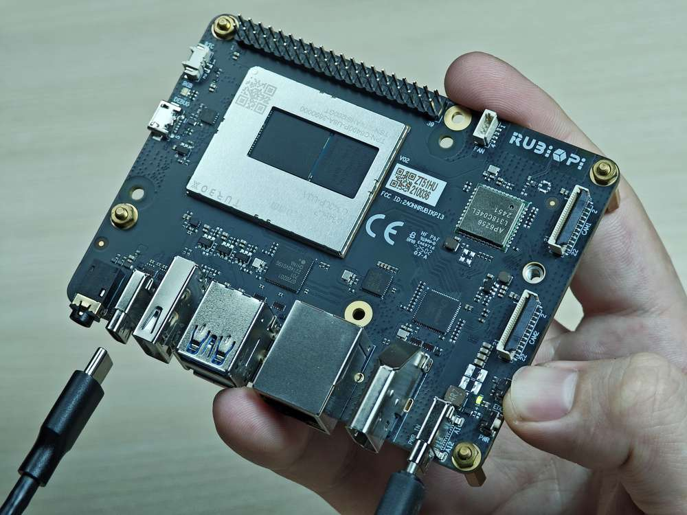

import Tabs from '@theme/Tabs';
import TabItem from '@theme/TabItem';

# 设备设置

本章介绍在 **Android 15** 系统中设置 **魔方派 3** 开发板的基本流程。请按以下顺序完成设备上电、调试串口设置、ADB 登录、软件版本验证、HDMI 显示器连接、鼠标键盘连接和 EDL 模式设置。

### 让我们开始吧！



<a id="poweron"></a>

## 设备上电

连接 12V、3A Type-C 电源适配器。

:::warning
魔方派 3 支持 Power Delivery (PD) 3.0 电源输入。**请使用支持 12V 3A PD 3.0 协议的 Type-C 接口电源适配器**。经验证的配件列表，请见[外设兼容列表](https://www.thundercomm.com/rubik-pi-3/cn/docs/peripheral-compatibility-list)。

如果电源适配器满足要求并且电源协商成功，电源端口附近的电源指示灯 LED 将亮起。如果适配器不符合要求，LED 将保持熄灭状态，并且设备将无法启动。
:::

:::note
插入 USB Type-C 转 USB Type-A 或 Type-C 线缆，可用于 ADB 调试和刷写操作。
:::

开发板 V02 及更新版本支持连接电源适配器后自动开机。您可以在开发板如下位置查看硬件版本号。在下面的示例中，硬件版本是 V02。


:::note
如果开发板上的蓝色 LED 持续亮起，则表示电源按钮按下的时间过长，并且开发板处于 fastboot 模式。请参阅 [FAQ](https://www.thundercomm.com/rubik-pi-3/en/docs/rubik-pi-3-user-manual/1.0.0-u/Troubleshooting/troubleshooting#how-do-i-exit-fastboot-mode-on-the-rubik-pi-3) 退出 fastboot 模式。
:::

<a id="setUART"></a>

## 设置调试 UART

调试 UART 显示诊断消息并通过串口 shell 提供对设备的访问。

1. 将 Micro-USB 电缆连接到魔方派 3 上的 Micro-USB 端口。

   

2. 将 Micro-USB 线的另一端连接到主机。根据主机操作系统，按照以下说明之一进行操作。

<Tabs>
<TabItem value="Ubuntuhost" label="Ubuntu 主机">

1. 运行以下命令安装用于访问 UART 控制台的 screen。

   ```shell
   sudo apt update
   sudo apt install screen
   ```

2. 运行以下命令检查 USB 串口：

   ```shell
   ls /dev/ttyACM*
   ```

   示例输出：

   ```shell
   /dev/ttyACM0
   ```

3. 运行以下命令打开调试 UART 会话：

   ```shell
   sudo screen <serial_port> 115200
   ```

   示例：

   ```shell
   sudo screen /dev/ttyACM0 115200
   ```

</TabItem>
<TabItem value="winhost" label="Windows 主机">

1. 为 Windows 主机下载并安装 [PuTTY](https://www.chiark.greenend.org.uk/~sgtatham/putty/)。
2. 从开始菜单打开 PuTTY。
3. 在 PuTTY 配置对话框中选择 **Serial**。
4. 根据 Windows 设备管理器中检测到的 UART 端口指定串行线。
5. 将波特率设置为 `115200`。
6. 单击 **Open** 启动 PuTTY 会话。

   

:::note
如果未检测到 UART 端口，请下载驱动程序并使用 Windows 设备管理器进行更新：

* x86 系统：[USB 转 UART 串行驱动程序](https://ftdichip.com/wp-content/uploads/2023/09/CDM-v2.12.36.4-WHQL-Certified.zip)。
* Arm® 系统：访问 https://oemdrivers.com/usb-ft232r-usb-uart-arm64 并下载 **FTDI CDM VCP Drivers**。
:::

</TabItem>
<TabItem value="machost" label="macOS 主机">

1. 运行以下命令检查连接到 macOS 主机的串口设备。

   ```shell
   ls /dev/cu.*
   ```

2. 在串口设备列表中找到您的设备。

   

3. 运行以下命令打开串口设备。

   ```shell
   screen <serial_device_node> 115200
   ```

   示例：

   ```shell
   screen /dev/cu.usbserial-DM03SDQQ 115200
   ```

</TabItem>
</Tabs>

:::tip
如果没有看到串口日志或 shell 提示符，请检查 Micro USB 连接，并断开后重新连接 Micro USB 线。
:::

<a id="adbLogin"></a>

## ADB 登录

ADB（Android Debug Bridge）用于在主机和魔方派 3 Android 15 系统之间建立调试连接。请先使用 USB Type-C 数据线将主机连接到魔方派 3 的 USB Type-C 接口。

:::note
以下命令适用于 Android userdebug 镜像。user 版本镜像可能不支持 `adb root`。
:::

<Tabs>
<TabItem value="winhost" label="Windows 主机">

### 准备

1. 访问 https://developer.android.google.cn/tools/releases/platform-tools 下载 ADB 和 Fastboot 安装包并解压。
2. 将 `platform-tools` 目录添加到 Windows 系统环境变量 `Path` 中。
3. 按 **Win** + **R**，输入 `cmd` 打开 Windows 终端。

### 登录

在终端输入如下命令登录到魔方派 3：

```shell
adb devices
adb root
adb shell
```

</TabItem>
<TabItem value="ubuntuhost" label="Ubuntu 主机">

### 准备

1. 输入如下命令安装 ADB 和 Fastboot 工具：

   ```shell
   sudo apt update
   sudo apt install git android-tools-adb android-tools-fastboot wget
   ```

2. 更新 udev rules 文件：

   ```shell
   sudo vi /etc/udev/rules.d/51-qcom-usb.rules
   ```

3. 将如下内容添加到文件中；若如下内容已经存在，可忽略这一步。

   ```shell
   SUBSYSTEMS=="usb", ATTRS{idVendor}=="05c6", ATTRS{idProduct}=="9008", MODE="0666", GROUP="plugdev"
   ```

4. 重启 `udev`。

   ```shell
   sudo systemctl restart udev
   ```

:::note
如果魔方派 3 已经通过 USB 连接到主机，请插拔 USB 线重新连接，使更新后的规则生效。
:::

### 登录

在终端输入如下命令登录到魔方派 3：

```shell
adb devices
adb root
adb shell
```

</TabItem>
</Tabs>

成功登录后，终端会进入 Android shell，可执行 `getprop`、`logcat`、`dmesg` 等调试命令。

## 验证软件版本

完成设置后，在主机上通过 ADB 运行以下命令验证 Android 版本：

```shell
adb shell getprop ro.product.model
adb shell getprop ro.build.version.release
adb shell getprop ro.build.id
adb shell getprop ro.build.display.id
adb shell getprop ro.build.fingerprint
```

示例输出：

```shell
Thundercomm Rubik Pi 3
15
AQ3A.250612.001
qssi-userdebug 15 AQ3A.250612.001 45468 test-keys
Thundercomm/rubikpi/rubikpi:15/AQ3A.250612.001/45468:userdebug/test-keys
```

也可以在 Android 图形界面中进入 **Settings** > **About phone** 查看设备信息。


:::note
示例输出来自 Android 15 userdebug 构建。不同发布包的 build number、fingerprint 或构建类型可能不同。
:::

<a id="conHDMI"></a>

## 连接 HDMI 显示器

要查看 Android 图形界面，请按照以下步骤连接 HDMI 显示器：

1. 将 HDMI 线的一端连接到魔方派 3 上的 HDMI OUT 端口。
2. 将 HDMI 线的另一端连接到显示器。

   

3. 打开设备电源，等待 Android 15 启动完成。
4. 如果显示器无画面，请确认显示器输入源已切换到对应 HDMI 端口，并检查电源适配器是否满足 12V 3A PD 3.0 要求。

## 连接鼠标键盘

将 USB 键盘和鼠标连接到 Type-A 端口。



连接后即可在 Android 图形界面中完成 Wi-Fi 配置、设置检查和应用操作。

## 基本端口连接详情


## 进入 EDL 模式

通过 QDL（Qualcomm Device Loader）向魔方派 3 刷入固件与系统镜像时，设备必须进入 **EDL 模式**。如果设备已预先刷写并可以正常启动，则可在初始设置阶段跳过本节。

<a id="enterEDL"></a>


<Tabs>
<TabItem value="method1" label="方法 1：按键进入">

1. 断开端口 10 的电源连接和端口 5 的 Type-C 连接线。
2. 按住上图 12 的 **EDL** 按钮。

   

3. 按住 **EDL** 按钮的同时，将电源线接到端口 10。

   

4. 按住 **EDL** 按钮的同时，将 Type-C 连接线接到端口 5，等待 3 秒进入 9008 模式。

   

5. 松开 **EDL** 按钮。

</TabItem>
<TabItem value="method2" label="方法 2：ADB 命令进入">

如果设备已运行 Android 15 并且 ADB 可用，请在主机上运行以下命令进入 EDL 模式：

```shell
adb shell reboot edl
```

:::note
运行该命令前，请确认设备已通过 USB Type-C 数据线连接主机，并且 `adb devices` 能够看到设备。
:::

</TabItem>
</Tabs>
