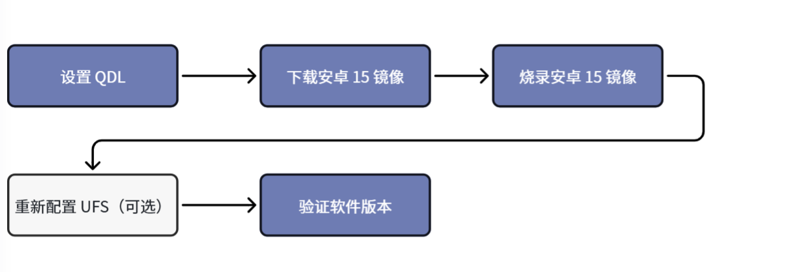
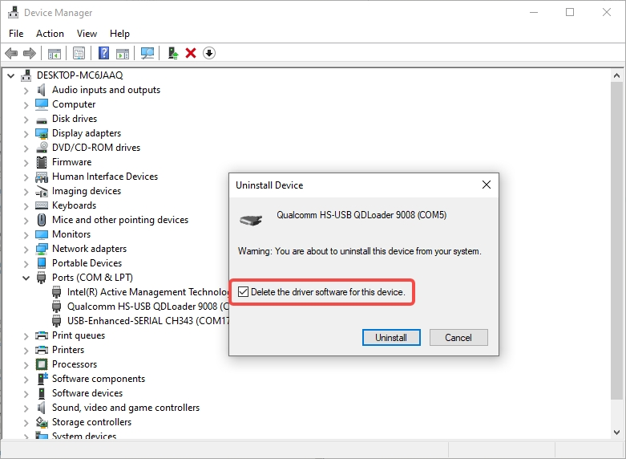
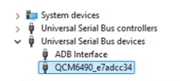
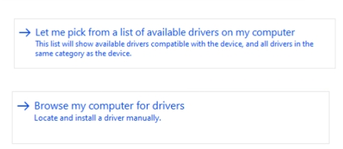
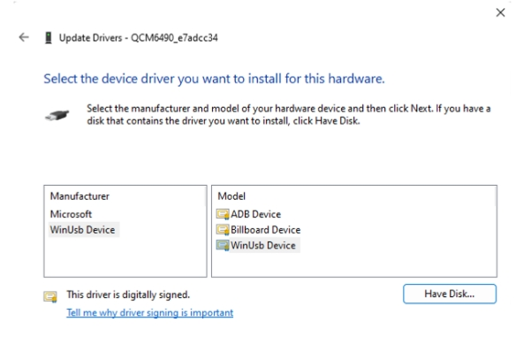
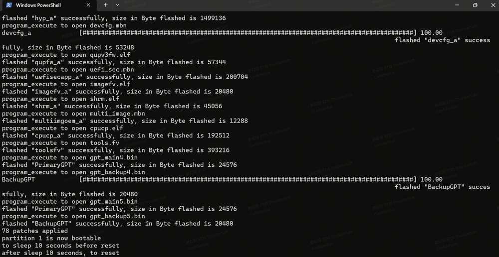
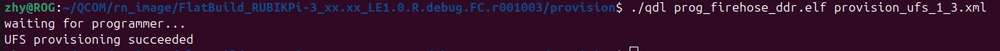
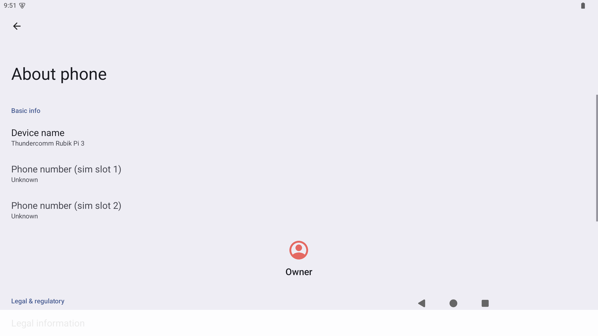

import Tabs from '@theme/Tabs';
import TabItem from '@theme/TabItem';

# 刷写镜像

本章介绍如何使用 **QDL（Qualcomm Device Loader）** 工具为魔方派 3 刷写 Android 15 镜像。

刷写前，请先确认当前系统版本。如果您的设备当前运行的是 Android、Qualcomm Linux (QLI)、Ubuntu 或其他系统，可参考本节内容使用 **QDL（Qualcomm Device Loader）** 将设备刷写为 Android 15。此操作需在 Ubuntu、Windows® 或 macOS® 主机上完成。

设备运行 Android 15 时，可在主机上执行以下命令：

```shell
adb shell getprop ro.build.version.release
adb shell getprop ro.build.display.id
adb shell getprop ro.build.fingerprint
```

示例输出：

```shell
15
qssi-userdebug 15 AQ3A.250612.001 45468 test-keys
Thundercomm/rubikpi/rubikpi:15/AQ3A.250612.001/45468:userdebug/test-keys
```

:::warning
刷写 Android 15 镜像会清除设备上的系统数据。请在继续操作之前备份重要文件，并确认镜像包与魔方派 3 硬件版本匹配。
:::

:::info
- 开始前，请完成[设备设置](./2.set-up-your-device.md#让我们开始吧)中的上电和线缆连接步骤。
- 刷写前需要让设备进入 [EDL 模式](2.set-up-your-device.md#进入-EDL-模式)。
- Android 15 镜像包通常以 FlatBuild 形式提供，刷写命令在镜像包的 *ufs* 目录中执行。
:::

### 现在开始吧！



## 1. 设置 QDL 工具

**Qualcomm Device Loader (QDL)** 是一个跨平台刷写工具，可在 **Windows**、**Ubuntu/Linux** 和 **macOS** 主机上向 Qualcomm® USB 设备加载 firehose 程序并刷写软件镜像。

1. 下载 QDL 工具：[QDL tool](https://softwarecenter.qualcomm.com/catalog/item/Qualcomm_Device_Loader)。
2. 解压 QDL 工具包。
3. 根据主机系统完成以下准备工作。


<a id="flashQDL"></a>

<Tabs>
<TabItem value="uhost" label="Ubuntu 主机">

执行以下命令安装 libusb 和 libxml2；如果已经安装，请跳过此步骤。

```shell
sudo apt-get install libxml2-dev libudev-dev libusb-1.0-0-dev
```

</TabItem>
<TabItem value="whost" label="Windows 主机">

安装 WinUSB 驱动程序。

1. 打开 **设备管理器**，确认未安装 Qualcomm USB Driver (QUD) 或其他冲突驱动。
2. 如果设备显示在 COM 端口下，请右键设备并选择删除设备。

   

3. 勾选 **删除此设备的驱动程序软件**。

   

4. 设备断电，重新进入 EDL 模式。
5. 在设备管理器中右键魔方派的 USB 端口，选择更新驱动程序。

   

6. 选择 **浏览我的电脑以查找驱动程序**。

   

7. 在通用串行总线设备中选择 **WinUsb Device**。

   

8. 点击 **是**，完成驱动更新。

   

:::note
如果 QDL 工具包中提供 `install_driver.bat`，也可以在 QDL 文件夹中运行该脚本安装驱动。
:::

</TabItem>
<TabItem value="mhost" label="macOS 主机">

使用以下方法安装 Homebrew；如果已经安装，请跳过此步骤。

```shell
/bin/bash -c "$(curl -fsSL https://raw.githubusercontent.com/Homebrew/install/HEAD/install.sh)"
```

运行以下命令安装 libusb 和 libxml2。

```shell
brew install libusb
brew install libxml2
```

</TabItem>
</Tabs>

## 2. 下载 Android 15 镜像

1. 访问[魔方派 3 系统镜像下载页面](https://www.thundercomm.com/rubik-pi-3/cn/docs/image/)下载 Android 15 镜像。
2. 解压 Android 15 FlatBuild 镜像包。
3. 进入镜像包中的 *ufs* 目录。
4. 将[步骤 1](#1-设置-qdl-工具) 中对应主机架构的 QDL 可执行文件复制到 *ufs* 目录。

:::note
- Windows 主机请将 QDL 可执行文件和相关 DLL 文件一起复制到 *ufs* 目录。
- Ubuntu 主机通常使用 *QDL_Linux_x64* 或 *QDL_Linux_ARM* 目录中的 `qdl`。
- macOS 主机通常使用 *QDL_Mac_x64* 或 *QDL_Mac_ARM* 目录中的 `qdl`。
:::

## 3. 刷写 Android 15 镜像

确认设备已进入 EDL/9008 模式后，在 Android 15 FlatBuild 镜像包的 *ufs* 目录中执行刷写命令。

<Tabs>
<TabItem value="uhost" label="Ubuntu 主机">

运行以下命令刷写 Android 15 镜像：

```shell
./qdl --storage ufs prog_firehose_ddr.elf rawprogram*.xml patch*.xml
```


</TabItem>
<TabItem value="whost" label="Windows 主机">

运行以下命令刷写 Android 15 镜像：

```shell
<pathToQDL>\QDL.exe prog_firehose_ddr.elf rawprogram_unsparse0.xml rawprogram1.xml rawprogram2.xml rawprogram3.xml rawprogram4.xml rawprogram5.xml patch0.xml patch1.xml patch2.xml patch3.xml patch4.xml patch5.xml
```



:::note
- 程序文件名不支持通配符。Windows 命令中必须列出每个镜像文件。
- 将 `<pathToQDL>` 替换为 *QDL_Win_x64* 或 *QDL_Win_ARM64* 目录的实际位置。
- 如果实际 Android 15 镜像包中的 `rawprogram*.xml` 或 `patch*.xml` 文件数量不同，请以镜像包中的文件为准。
:::

</TabItem>
<TabItem value="mhost" label="macOS 主机">

运行以下命令刷写 Android 15 镜像：

```shell
./qdl --storage ufs prog_firehose_ddr.elf rawprogram*.xml patch*.xml
```


</TabItem>
</Tabs>

:::tip
如果刷写失败，断开并重新连接电源和 USB 数据线，重新让设备进入 EDL 模式，然后再次执行刷写操作。
:::

## 4. 可选：重新配置 UFS

如果刷写后设备无法启动，可尝试进入 FlatBuild 包中的 *provision* 目录，重新对 UFS 进行配置。

:::warning
进行 provision 后，UFS 中存储的一些信息会丢失，如 SN 号、以太网 MAC 地址等。仅在刷写后无法启动或明确需要重新配置 UFS 时执行此步骤。
:::

<Tabs>
<TabItem value="uhost" label="Ubuntu 主机">

根据主机架构将 *QDL_Linux_x64* 或 *QDL_Linux_ARM* 目录下的 `qdl` 拷贝到 *provision* 目录，然后运行：

```shell
./qdl prog_firehose_ddr.elf provision_ufs_1_3.xml
```



</TabItem>
<TabItem value="whost" label="Windows 主机">

将 QDL 可执行文件和相关 DLL 文件复制到 *provision* 目录，然后运行：

```shell
<pathToQDL>\QDL.exe prog_firehose_ddr.elf provision_ufs_1_3.xml
```


</TabItem>
<TabItem value="mhost" label="macOS 主机">

根据主机架构将 *QDL_Mac_x64* 或 *QDL_Mac_ARM* 目录下的 `qdl` 拷贝到 *provision* 目录，然后运行：

```shell
./qdl prog_firehose_ddr.elf provision_ufs_1_3.xml
```


</TabItem>
</Tabs>

:::warning
Provision 刷写完成之后，需要手动插拔电源线和 USB 数据线重启设备，然后重新进行 Android 15 镜像刷写。
:::

## 5. 验证软件版本

刷写完成后，设备将自动重启。等待 Android 15 启动完成后，使用 USB Type-C 数据线连接主机，运行以下命令确认设备在线：

```shell
adb devices -l
```

运行以下命令确认 Android 版本：

```shell
adb shell getprop ro.build.version.release
adb shell getprop ro.build.display.id
adb shell getprop ro.build.fingerprint
```

示例输出：

```shell
15
qssi-userdebug 15 AQ3A.250612.001 45468 test-keys
Thundercomm/rubikpi/rubikpi:15/AQ3A.250612.001/45468:userdebug/test-keys
```

也可以通过 Android 图形界面确认软件版本。连接 HDMI 显示器、鼠标和键盘后，进入 **Settings** > **About phone**。在该页面可以查看设备名称、Android 版本、Build number 等系统信息；如果当前页面未显示版本字段，请向下滚动继续查看。



:::note
图形界面中的 **About phone** 页面用于快速确认当前系统已经启动到 Android 15；ADB 命令输出可用于记录更完整的 build ID 和 fingerprint。
:::

---

> **后续步骤**  
> 镜像刷写完成后，请参考[设备设置](2.set-up-your-device.md)继续完成 ADB 登录、软件版本验证、HDMI 显示器和鼠标键盘连接。
