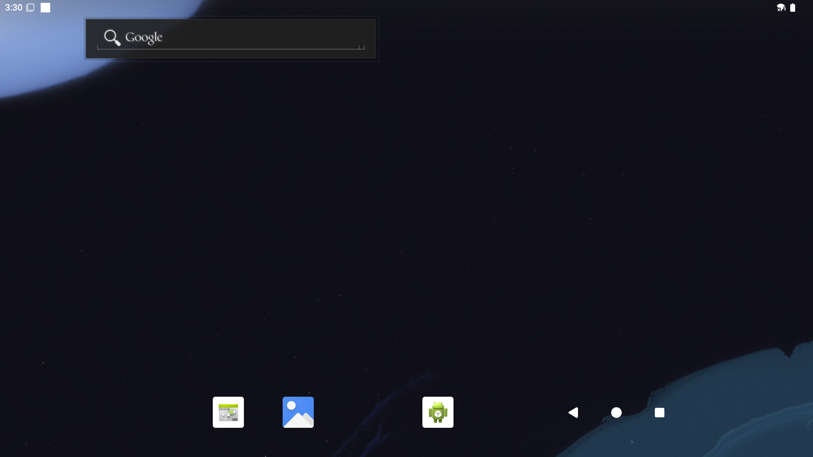

# 外设与接口

本章介绍 Android 15 系统下魔方派 3 常用外设与接口的功能验证方法。

:::note
运行命令前，请确认主机已通过 USB Type-C 数据线连接魔方派 3，并且 `adb devices` 可以看到设备。
:::

## 硬件资源图


| 序号 | 接口                           | 序号 | 接口                         |
|------|--------------------------------|------|------------------------------|
| 1    | RTC 电池接口                   | 10   | Type-C 电源接口              |
| 2    | Micro USB (UART 调试)          | 11   | PWR 按键                     |
| 3    | TurboX C6490P SOM              | 12   | EDL 按键                     |
| 4    | 3.5mm 耳机接口                 | 13   | 摄像头接口 2                 |
| 5    | USB Type-C with DP (USB 3.1)   | 14   | 摄像头接口 1                 |
| 6    | USB Type-A (USB 2.0)           | 15   | Wi-Fi/蓝牙模块               |
| 7    | 2 x USB Type-A (USB 3.0)       | 16   | 风扇接口                     |
| 8    | 1000M 以太网                   | 17   | 40-pin 连接器                |
| 9    | HDMI OUT                       | 18   | M.2 Key M 接口               |

## USB

魔方派 3 提供 2 个 USB 3.0 Type-A 接口、1 个 USB 2.0 Type-A 接口和 1 个 USB Type-C 接口。Android 15 下可验证 USB 存储设备、USB 音频设备和 ADB 连接。

### USB 存储设备

1. 将 U 盘插入 USB Type-A 接口。
2. 在 Android 图形界面中打开 **Files** 应用。
3. 如果左侧或设备列表中出现外接 USB 存储设备，并且可以浏览文件，则 USB 存储功能正常。

:::warning
当前 Android 15 镜像中，U 盘暂时无法在 **Files** 应用中显示。这是已知问题，后续版本会修复。验证 U 盘是否被系统识别时，请先使用下面的 ADB 命令查看。
:::

也可以通过 ADB 查看存储设备是否被系统识别：

```shell
adb shell sm list-volumes all
adb shell ls /mnt/media_rw
adb shell lsusb
adb shell cat /proc/partitions | grep -E "sd[a-z]|nvme"
```

当前版本中，U 盘已被 USB 和块设备识别，但未挂载为 Android public volume。示例输出如下：

```shell
private mounted null
emulated;0 mounted null
Bus 004 Device 005: ID 346d:5678
   8       96  122880000 sdg
   8       97  122879424 sdg1
```

如果后续版本修复该问题，连接 U 盘后，`sm list-volumes all` 应显示新增的 public volume，`/mnt/media_rw` 下应出现对应挂载目录。

### USB 音频设备

1. 将 USB 音频设备插入 USB Type-A 接口。
2. 在 Android 图形界面中播放一段音频或视频。
3. 如果声音可以从 USB 音频设备输出，则 USB Audio 播放功能正常。
4. 如果 USB 音频设备带麦克风，可打开录音类应用进行录音验证。

可通过以下命令查看 USB 设备枚举情况：

```shell
adb shell lsusb
adb shell cat /proc/asound/cards
adb shell cat /proc/asound/card1/stream0
```

示例输出：

```shell
Bus 002 Device 002: ID 1b3f:2008

 0 [lahainarubikpi3]: lahaina-rubikpi - lahaina-rubikpi3-snd-card
                      lahaina-rubikpi3-snd-card
 1 [Device         ]: USB-Audio - USB Audio Device
                      GeneralPlus USB Audio Device at usb-xhci-hcd.2.auto-1, full speed

GeneralPlus USB Audio Device at usb-xhci-hcd.2.auto-1, full speed : USB Audio

Playback:
  Status: Stop
  Interface 1
    Altset 1
    Format: S16_LE
    Channels: 2
    Endpoint: 5 OUT (NONE)
    Rates: 44100, 48000
    Bits: 16

Capture:
  Status: Stop
  Interface 2
    Altset 1
    Format: S16_LE
    Channels: 1
    Endpoint: 6 IN (NONE)
    Rates: 44100, 48000
    Bits: 16
```

连接 USB Audio 设备后，`lsusb` 会增加对应 USB 设备，`/proc/asound/cards` 会出现新增声卡；`/proc/asound/card1/stream0` 中可以看到 Playback 和 Capture 能力。

### ADB

使用 USB Type-C 数据线连接主机和魔方派 3，运行以下命令：

```shell
adb devices -l
```

如果返回设备序列号并显示 `device`，则 ADB 连接正常。

示例输出：

```shell
List of devices attached
d80af579               device usb:2-3 product:rubikpi model:Thundercomm_Rubik_Pi_3 device:rubikpi transport_id:2
```

## HDMI OUT

HDMI OUT 接口位于硬件资源图中的 9 号位置，支持外接 HDMI 显示器。

1. 将 HDMI 线连接到魔方派 3 的 HDMI OUT 接口。
2. 给显示器上电，并切换到对应 HDMI 输入源。
3. Android Launcher 可以正常显示，则 HDMI 输出功能正常。
4. 进入 **Settings** > **Display**，查看当前显示状态和分辨率相关设置。

示例显示画面：



如果需要通过命令确认显示服务状态，可运行：

```shell
adb shell dumpsys display | grep -i -E "DisplayDeviceInfo|mBaseDisplayInfo" | head -4
```

示例输出：

```shell
DisplayDeviceInfo{"Built-in Screen": uniqueId="local:4630946674560563842", 2560 x 1440, modeId 1, renderFrameRate 60.000004, ...}
mBaseDisplayInfo=DisplayInfo{"Built-in Screen", displayId 0, ... real 2560 x 1440, ...}
```

## DisplayPort

魔方派 3 的 USB Type-C 接口支持 DisplayPort 输出。

1. 使用支持 DP Alt Mode 的 Type-C 转 DP 或 Type-C 转 HDMI 转接线连接显示器。
2. 显示器切换到对应输入源。
3. Android 图形界面可以正常显示，则 DisplayPort 输出功能正常。
4. 可进入 **Settings** > **Display** 查看显示状态。

示例显示画面：


可通过以下命令查看显示信息：

```shell
adb shell dumpsys display | grep -i -E "DisplayDeviceInfo|mBaseDisplayInfo" | head -4
```

示例输出：

```shell
DisplayDeviceInfo{"Built-in Screen": uniqueId="local:4630946674560563842", 2560 x 1440, modeId 1, renderFrameRate 60.000004, ...}
mBaseDisplayInfo=DisplayInfo{"Built-in Screen", displayId 0, ... real 2560 x 1440, ...}
```

## Wi-Fi

Android 15 支持 Wi-Fi STA 模式和热点模式。

### 连接 Wi-Fi

1. 在 Android 图形界面中进入 **Settings** > **Network & internet** > **Internet**。
2. 打开 Wi-Fi。
3. 选择目标 Wi-Fi 网络并输入密码。
4. 页面显示已连接后，说明 Wi-Fi 连接正常。

连接 Wi-Fi 示例：


可通过以下命令确认连接状态：

```shell
adb shell cmd wifi status
adb shell ip addr show wlan0
adb shell ping -c 4 8.8.8.8
```

连接 Wi-Fi 后，示例输出如下：

```shell
Wifi is enabled
Wifi scanning is only available when wifi is enabled
Wifi is connected to "RUBIKPi_Wi-Fi"
WifiInfo: SSID: "RUBIKPi_Wi-Fi", IP: /192.168.31.207, Wi-Fi standard: 11ac, RSSI: -7, Link speed: 390Mbps
12: wlan0: <BROADCAST,MULTICAST,UP,LOWER_UP> mtu 1500 qdisc pfifo_fast state UP group default qlen 1000
    link/ether 32:d1:ef:f2:56:cc brd ff:ff:ff:ff:ff:ff
    inet 192.168.31.207/24 brd 192.168.31.255 scope global wlan0
```

`cmd wifi status` 会显示当前 SSID 和连接状态，`ip addr show wlan0` 会显示 `inet` 地址。

### 热点模式

1. 进入 **Settings** > **Network & internet** > **Hotspot & tethering**。
2. 打开 **Wi-Fi hotspot**。
3. 使用其他设备搜索并连接该热点。
4. 其他设备可以成功连接热点，则热点模式功能正常。

## 蓝牙

1. 在 Android 图形界面中进入 **Settings** > **Connected devices**。
2. 打开蓝牙，并选择 **Pair new device**。
3. 选择目标蓝牙设备并完成配对。
4. 蓝牙耳机、音箱或其他蓝牙设备可以正常连接和使用，则蓝牙功能正常。

可通过以下命令查看蓝牙服务状态：

```shell
adb shell dumpsys bluetooth_manager | grep -i enabled
```

示例输出：

```shell
enabled: true
time since enabled: 00:09:57.099
A2dpOffloadEnabled: false
Enabled Profile Services:
```

## 以太网

以太网接口位于硬件资源图中的 8 号位置，支持千兆以太网。

1. 将网线连接到魔方派 3 的以太网接口。
2. 进入 **Settings** > **Network & internet**，查看以太网连接状态。
3. 如果系统显示以太网已连接，则以太网功能正常。

也可以通过 ADB 验证 IP 地址和连通性：

```shell
adb shell ip addr show eth0
adb shell ping -c 4 8.8.8.8
```

未连接网线时，示例输出如下：

```shell
16: eth0: <NO-CARRIER,BROADCAST,MULTICAST,UP> mtu 1500 qdisc pfifo_fast state DOWN group default qlen 1000
    link/ether f0:74:e4:7f:57:45 brd ff:ff:ff:ff:ff:ff
```

连接网线并获取地址后，`eth0` 会显示 `state UP` 和 `inet` 地址。

## 摄像头

魔方派 3 提供两个 CSI 摄像头接口，Android 15 当前支持 IMX477 和 IMX219 摄像头模块。

1. 断电后连接 CSI 摄像头模块。
2. 重新上电启动 Android。
3. 打开 Android 图形界面中的 **Camera** 应用，确认可以预览画面并拍照。
4. 打开 **Snapdragon Camera** 应用，确认可以预览画面并拍照。
5. 两个应用均可正常预览和拍照，则摄像头功能正常。

如果需要通过命令确认摄像头服务状态，可运行：

```shell
adb shell dumpsys media.camera | grep -E "Number of camera devices|Device [0-9] maps"
adb shell ls /dev/video*
```

示例输出：

```shell
Number of camera devices: 2
    Device 0 maps to "0"
    Device 1 maps to "1"
/dev/video0
/dev/video1
/dev/video32
/dev/video33
```

## 音频

Android 15 下可验证 3.5 mm 耳机、HDMI 音频、蓝牙音频和 USB 音频。

### 3.5 mm 耳机

1. 将耳机插入 3.5 mm 耳机接口。
2. 在 Android 图形界面中播放一段音频或视频。
3. 耳机可以正常输出声音，则 3.5 mm 音频播放功能正常。

### HDMI 音频

1. 连接 HDMI 显示器或带音频输出的 HDMI 设备。
2. 在 Android 图形界面中播放一段音频或视频。
3. HDMI 设备可以正常输出声音，则 HDMI 音频功能正常。

### 蓝牙音频

1. 通过 **Settings** > **Connected devices** 配对蓝牙耳机或音箱。
2. 播放一段音频或视频。
3. 蓝牙设备可以正常输出声音，则蓝牙音频功能正常。

### USB 音频

1. 将 UAC 设备插入 USB Type-A 接口。
2. 在 Android 图形界面中播放一段音频或视频。
3. 如果声音可以从 USB 音频设备输出，则 USB 音频播放功能正常。
4. 如果 UAC 设备带麦克风，可打开录音类应用确认录音功能。

可通过以下命令查看音频设备状态：

```shell
adb shell dumpsys audio | sed -n "/Connected devices:/,/APM Connected device/p"
```

示例输出：

```shell
Connected devices:
  [DeviceInfo: type:0x4000000 (usb_headset) name:USB-Audio - USB Audio Device addr:card=1;device=0 identity addr:card=1;device=0 codec: 0 group:-1 peer addr: peer identity addr: disabled modes: {}]
  [DeviceInfo: type:0x82000000 (usb_headset) name:USB-Audio - USB Audio Device addr:card=1;device=0 identity addr:card=1;device=0 codec: 0 group:-1 peer addr: peer identity addr: disabled modes: {}]

APM Connected device (A2DP sink only):
```

其中 `type:0x4000000` 表示 USB 音频输出设备，`type:0x82000000` 表示 USB 音频输入设备。

## M.2 Key M

M.2 Key M 接口位于硬件资源图中的 18 号位置，可连接 M.2 SSD。

1. 断电后安装 M.2 SSD。
2. 重新上电启动 Android。
3. 通过 ADB 查看 NVMe 块设备：

```shell
adb shell ls /dev/block/nvme*
adb shell cat /proc/partitions
```

如果 `/dev/block/` 下可以看到 `nvme0n1` 等设备节点，则 M.2 SSD 已被系统识别。

:::warning
当前 Android 15 镜像中，M.2 SSD 暂时无法在 **Files** 应用中显示。这是已知问题，后续版本会修复。验证 SSD 是否被系统识别时，请先使用 ADB 查看块设备节点。
:::

示例输出：

```shell
/dev/block/nvme0n1
major minor  #blocks  name
   8        0  121724928 sda
   8        1       8192 sda1
```

## RTC

安装 RTC 电池后，可通过以下命令验证系统时间：

```shell
adb shell date
```

断电重启后，如果系统时间可以保持或在启动后恢复到正确时间，则 RTC 功能正常。

示例输出：

```shell
Tue Jun  2 14:10:59 GMT 2026
```

## LED

可通过 `/sys/class/leds/` 控制红色、绿色、蓝色 LED 的亮度和功能。

查看 LED 节点：

```shell
adb shell ls /sys/class/leds
```

示例输出：

```shell
blue
green
red
mmc1::
```

查看最大亮度、当前亮度和支持的 trigger：

```shell
adb shell "cat /sys/class/leds/red/max_brightness"
adb shell "cat /sys/class/leds/red/brightness"
adb shell "cat /sys/class/leds/red/trigger"
```

示例输出：

```shell
255
0
[none] rfkill-any rfkill-none timer heartbeat mmc1 rfkill0 rfkill1 rfkill2 battery-charging-or-full battery-charging battery-full battery-charging-blink-full-solid usb-online wireless-online
```

手动控制 LED 亮度：

```shell
adb root
adb shell "echo none > /sys/class/leds/red/trigger"
adb shell "echo 32 > /sys/class/leds/red/brightness"
adb shell "cat /sys/class/leds/red/brightness"
adb shell "echo 0 > /sys/class/leds/red/brightness"
```

示例输出：

```shell
32
```

将红色 LED 设置为 heartbeat 功能：

```shell
adb shell "echo heartbeat > /sys/class/leds/red/trigger"
adb shell "cat /sys/class/leds/red/trigger"
```

示例输出：

```shell
none rfkill-any rfkill-none timer [heartbeat] mmc1 rfkill0 rfkill1 rfkill2 battery-charging-or-full battery-charging battery-full battery-charging-blink-full-solid usb-online wireless-online
```

恢复为手动控制并关闭 LED：

```shell
adb shell "echo none > /sys/class/leds/red/trigger"
adb shell "echo 0 > /sys/class/leds/red/brightness"
```

## 风扇

1. 将风扇连接到开发板风扇接口。
2. 给开发板上电。
3. 使用以下命令查看风扇控制节点：

```shell
adb root
adb shell "cat /sys/class/hwmon/hwmon0/name"
adb shell "cat /sys/class/hwmon/hwmon0/pwm1"
adb shell "cat /sys/class/thermal/cooling_device22/type"
adb shell "cat /sys/class/thermal/cooling_device22/cur_state"
adb shell "cat /sys/class/thermal/cooling_device22/max_state"
```

示例输出：

```shell
pwmfan
0
pwm-fan
0
3
```

`cooling_device22` 是 thermal 使用的风扇 cooling device，`cur_state` 取值范围为 0 到 3。手动控制风扇前，可先把 thermal cooling state 设为 0：

```shell
adb shell "echo 0 > /sys/class/thermal/cooling_device22/cur_state"
adb shell "cat /sys/class/thermal/cooling_device22/cur_state"
```

示例输出：

```shell
0
```

手动设置 PWM 占空比：

```shell
adb shell "echo 64 > /sys/class/hwmon/hwmon0/pwm1"
adb shell "cat /sys/class/hwmon/hwmon0/pwm1"
adb shell "echo 128 > /sys/class/hwmon/hwmon0/pwm1"
adb shell "cat /sys/class/hwmon/hwmon0/pwm1"
adb shell "echo 0 > /sys/class/hwmon/hwmon0/pwm1"
```

示例输出：

```shell
64
128
```

:::note
当前 Android 15 镜像中，风扇节点提供 `pwm1` 控制项，未提供 `fan*_input` 转速反馈节点。因此可读取当前 PWM 值，但不能通过 sysfs 直接读取 RPM。
:::

可通过以下命令查看有效温度值：

```shell
adb shell 'for f in /sys/class/thermal/thermal_zone*/temp; do v=$(cat "$f" 2>/dev/null) || continue; echo "$f=$v"; done | head'
```

示例输出：

```shell
/sys/class/thermal/thermal_zone20/temp=37700
/sys/class/thermal/thermal_zone21/temp=37700
/sys/class/thermal/thermal_zone22/temp=44400
/sys/class/thermal/thermal_zone23/temp=45500
```
