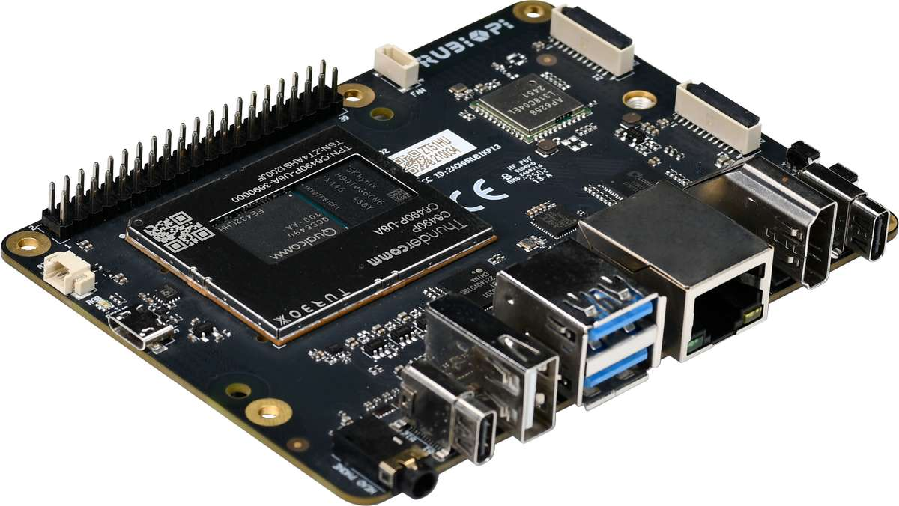
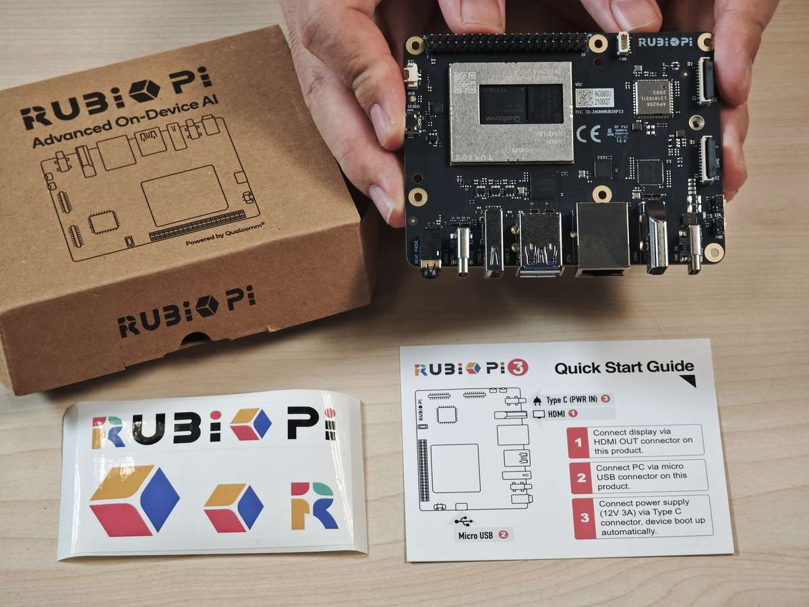
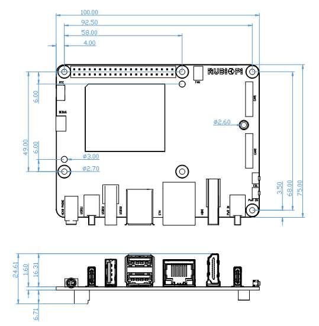

import Tabs from '@theme/Tabs';
import TabItem from '@theme/TabItem';

# 设备规格

**魔方派 3** 采用 **高通® QCS6490** SoC，专为高性能计算和现代开发工作流的无缝集成而设计。本指南介绍如何使用 **Canonical Ubuntu** 设置您的开发板，以便您进行端到端 AI 和多媒体应用的开发与原型验证。  
魔方派 3 的核心特性如下：  
\-- **Qualcomm® Kryo™ 670**  
-- **Qualcomm® Hexagon™ 处理器** 采用融合 AI 加速器架构  
-- 提供 **12 TOPS** 的 AI 性能，支持实时推理和机器学习工作负载

魔方派 3 在设计时充分考虑了多样性，配备了丰富的接口：  
\-- **USB, 摄像头, DisplayPort, HDMI**  
-- **以太网, 3.5mm** 耳机插孔  
-- **Wi-Fi, 蓝牙**
-- **M.2 接口, 风扇, 实时时钟（RTC）**  
-- **40-pin LS 连接器**  
这些特性支持多种开发场景，助力快速原型设计与高效调试。

-----------

### 包装

* 魔方派 3 
* 魔方派 3 贴纸
* 快速入门指南

### 结构尺寸

\*以上标注单位均为mm。

### 开发板简介

| 编号 | 接口                     | 编号 | 接口                  |
|------|--------------------------|------|-----------------------|
| 1    | RTC 电池接口             | 10   | Type-C电源接口        |
| 2    | Micro USB (UART 调试)    | 11   | PWR 按键             |
| 3    | TurboX C6490P SOM        | 12   | EDL 按键             |
| 4    | 3.5mm 耳机接口           | 13   | 摄像头接口 2         |
| 5    | USB Type-C with DP (USB 3.1) | 14 | 摄像头接口 1         |
| 6    | USB Type-A (USB 2.0)     | 15   | Wi-Fi/蓝牙模块       |
| 7    | 2 x USB Type-A (USB 3.0) | 16   | 风扇接口             |
| 8    | 1000M 以太网            | 17   | 40-pin 连接器        |
| 9    | HDMI OUT                 | 18   | M.2 Key M 接口       |

### 设置魔方派 3 所需的部件

| 部件| 是否必须
|----------|----------
| 电源（12V，3A）| Yes
| USB Type-C 转 USB Type-A 或 Type-C 数据线| 是（用于刷写）
| Micro USB 数据线| 是（用于串口访问）
| HDMI 数据线| 是（用于显示输出）
| USB 鼠标和键盘| 可选（适用于单板计算机）
| IMX219 和 IMX477 摄像头模块| 可选（用于测试 CSI 摄像头功能）
| USB 摄像头| 可选（用于测试 USB 摄像头功能）

