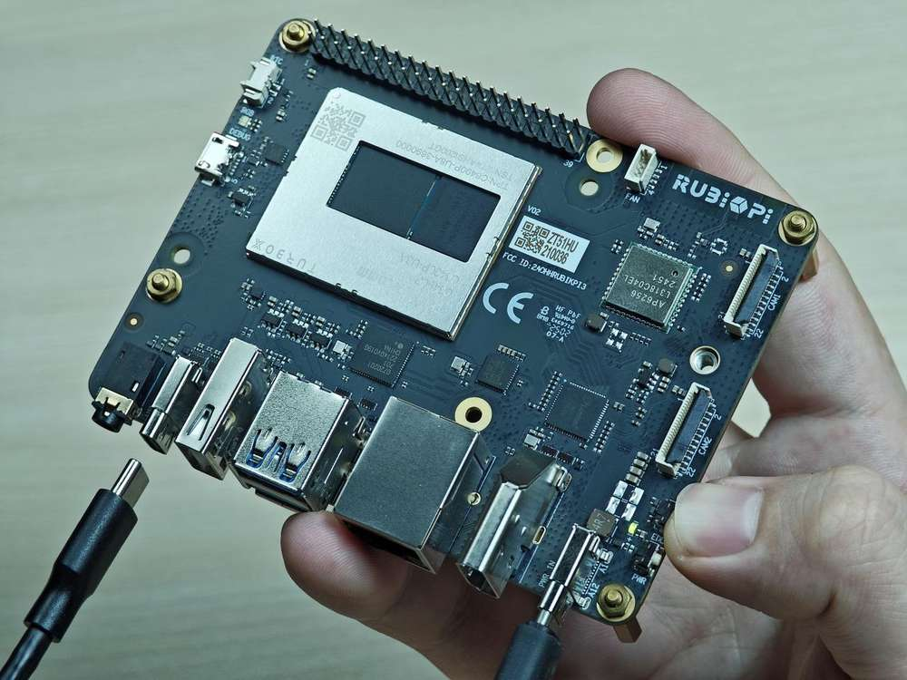
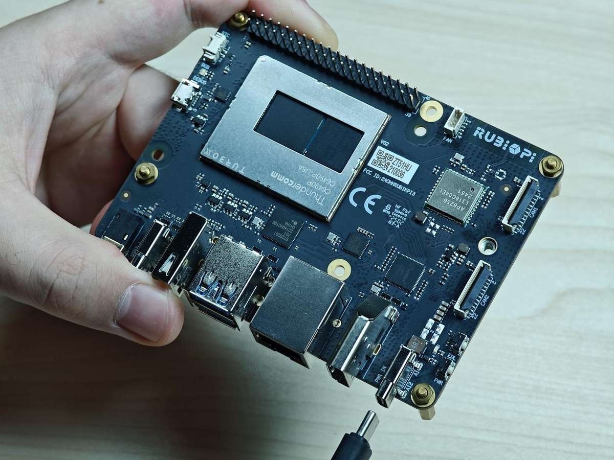
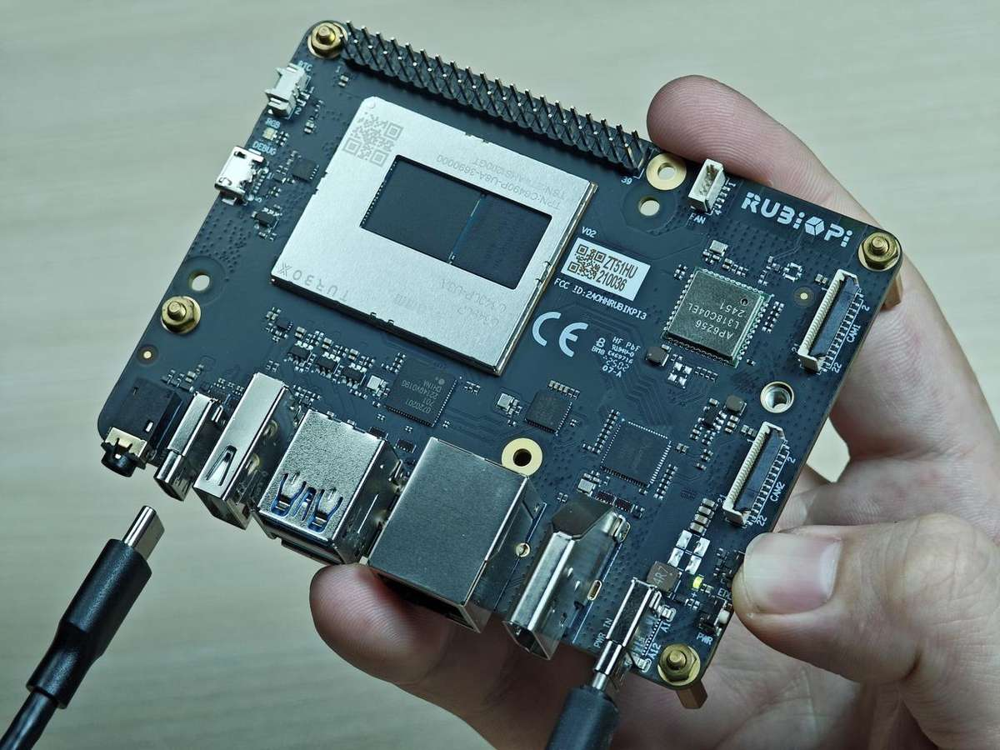
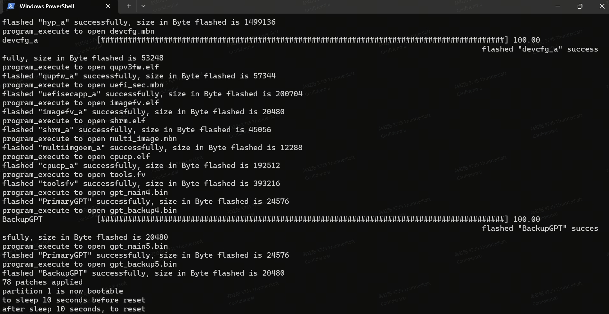
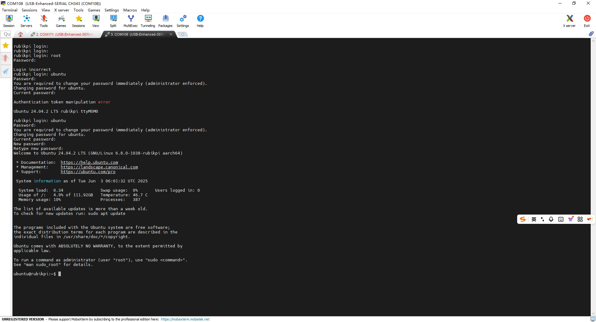
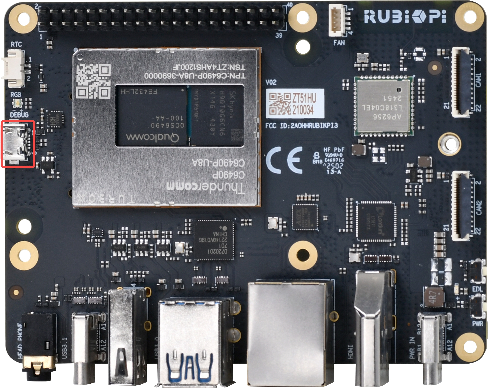
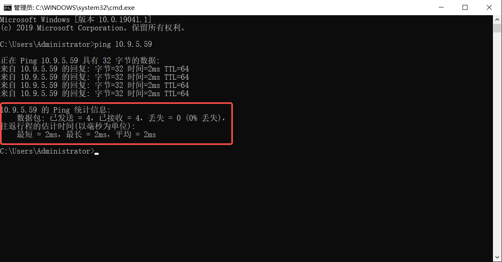
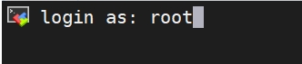
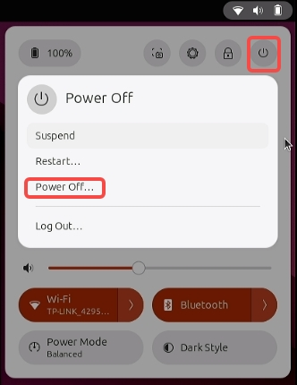
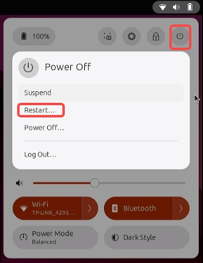

---
# Display h2 to h5 headings
toc_min_heading_level: 2
toc_max_heading_level: 4
---
# 快速开始

## 介绍

魔方派 3（RUBIK Pi 3）基于高通 QCS6490 芯片，采用  Qualcomm® Kryo™ 670 CPU 和融合 AI 加速器架构的 Qualcomm® Hexagon™ 处理器，具备 12 TOPS 的卓越 AI 性能，适用于各种机器学习和人工智能应用场景。

RUBIK Pi 3 具有丰富的接口和功能设计，支持 USB、Camera、DP、HDMI、ETH、3.5mm 耳机、Wi-Fi、蓝牙、M.2 连接器、Fan、RTC、40 pin 排针连接器等，满足多样化的开发需求，方便开发者快速开发和调试。

RUBIK Pi 3 同样也支持多种系统，如 Qualcomm Linux、Debian 13、Canonical Ubuntu for Qualcomm Platforms、Android 13 等，灵活满足开发者特定应用要求。


## 参数


|              | **RUBIK Pi 3**                                                                                     |
| -------------- | ---------------------------------------------------------------------------------------------------- |
| 芯片         | QCS6490                                                                                            |
| 处理器       | <p>1 x Cortex-A78 2.7GHz</p><p>3 x Cortex-A78 2.4GHz</p><p>4 x Cortex-A55 1.9GHz</p>               |
| GPU          | Adreno 643 GPU @ Up to 812 MHz                                                                     |
| VPU          | Adreno 633 VPU                                                                                     |
| NPU          | 12 TOPS                                                                                            |
| ISP          | Spectra ISP，可以做端侧的机器学习和机器处理                                                        |
| 内存         | 8 GB LPDDR4x                                                                                       |
| ROM          | 128 GB UFS 2.2                                                                                     |
| Wi-Fi & 蓝牙 | Wi-Fi 5 和蓝牙 5.2                                                                                 |
| 摄像头接口   | 2 x 4-lane MIPI CSI D-PHY                                                                          |
| USB          | <p>1 x USB Type-C (USB 3.1 Gen1)</p><p>2 x USB Type-A (USB 3.0)</p><p>1 x USB Type-A (USB 2.0)</p> |
| GPIO         | 28个 GPIO 引脚                                                                                     |
| 网口         | 1000M                                                                                              |
| M.2 接口     | M.2 Key M  2280（2-lane PCIe 3.0）                                                                 |
| 音频接口     | 3.5mm 耳机接口                                                                                     |

## 准备

* 装有 Windows 10 以上 或 Ubuntu20 - Ubuntu24 系统的电脑
* RUBIK Pi 3
* USB Type-A to Type-C 数据线
* USB Type-A to Micro USB 数据线
* 电源（12V 3A Type-C）

### 镜像下载

RUBIK Pi 3 出厂预装
Linux 镜像供您快速进行开箱操作体验（非最新版本），如需体验最新版本的 Linux 镜像，或其他操作系统镜像，请访问 [RUBIK Pi 3 官方网站](https://www.thundercomm.com/rubik-pi-3/cn/docs/image/) 进行下载。

如您需要 Linux 源码，请访问 [GitHub](https://github.com/rubikpi-ai) 进行下载。

* Qualcomm Linux ：基于weston的桌面系统，系统较为精简，适合具备 Linux 开发经验，追求深度开发体验的开发者。

  
* Debian 13：基于GNOME 48 桌面系统，系统功能完善，丰富的软件包资源，有更多的桌面应用，更好的使用体验，较多的开发资料，适合追求开发便捷的开发者。

  
* Ubuntu24.04: 系统功能完善，丰富的软件包资源，有更多的桌面应用，更好的使用体验，较多的开发资料，适合追求开发便捷的开发者。

  
* 安卓 13：基于谷歌 AOSP，系统完善，有更好的使用体验，适合想做安卓应用的开发者。

  

### 下载 QDL

QDL 是一款烧录工具，通过 QDL 可向魔方派中烧录镜像。

[点击此处下载](https://softwarecenter.qualcomm.com/api/download/software/tools/Qualcomm_Device_Loader/All/2.3.4/Qualcomm_Device_Loader.Core.2.3.4.All-AnyCPU-qdl_2.3.4.zip)
QDL，下载完成后解压，文件内容如下所示，QDL 支持多平台多架构，可通过查看 *QDL_User_Guide.pdf* 了解 QDL 的使用方法。


### 镜像烧录


镜像烧录前，首先进入烧录模式（9008模式）：

:::warning

> * 请勿徒手接触 PCB 板载元件及金属触点
> * 操作前需通过接地设备（如防静电工作台/腕带）释放静电
> * 禁止将电路板直接置于导电表面（金属台面/未接地机箱等）
:::

方法1：

1. 按住上图 12 的 EDL 按钮。

   
2. 将供电线接入到上图 10。

   
3. Type-C 数据线插入上图 5 等待 3 秒，进入 9008 模式。

   

方法2：

1. 将供电线接入到上图 10。

   
2. Type-C 数据线插入上图 5。

   
3. 在 RUBIK Pi 3 开机后，输入如下命令，进入 9008 模式。

   ```shell
   adb shell reboot edl
   ```

#### Windows 烧录方法

<a id="flashwin"></a>

1. 安装 WinUSB 驱动（若已经安装可忽略该步骤）

   1. 卸载该设备的其他驱动程序。确保未安装 Qualcomm USB 驱动程序等驱动程序。

      * 您不应该在设备管理器的 COM 端口下看到魔方派设备，如下所示，如果您在 COM 端口下看到该设备，请右键该设备，选择删除设备。

      

      * 确保已选中“删除此设备的驱动程序软件”。

      
   2. 设备断电，重新进入烧录模式，使用以下说明/屏幕截图安装 Microsoft WinUSB。

      * 在设备管理器中右键 RUBIK Pi 的 USB 端口，选择更新驱动程序。

      

      * 在弹出的窗口中选择下方的，浏览我的电脑以查找驱动程序。

      

      * 在通用串行总线设备中，选择 "WinUsb Device"。

      

      * 点 “是”，完成驱动更新。

      
2. 在终端中使用以下命令根据主机架构运行 *QDL_Win_x64* 或 *QDL_Win_ARM64* 目录中的 QDL 可执行文件, 进行镜像烧录,
   烧录完成后会自动重启。

:::note

> 程序文件名不支持通配符。命令中必须列出每个镜像文件。
>
> 将 `<pathToQDL>` 更换为 *QDL_Win_x64* 或 *QDL_Win_ARM64* 目录的实际位置。
:::

```shell
<pathToQDL>\QDL.exe prog_firehose_ddr.elf rawprogram0.xml rawprogram1.xml rawprogram2.xml rawprogram3.xml rawprogram4.xml rawprogram5.xml patch1.xml patch2.xml patch3.xml patch4.xml patch5.xml
```



3. 或烧录后无法启动，可尝试进入 FlatBuild 包中的 provision 目录执行下面命令重新对 UFS 进行配置（provision）。

:::warning

> 进行 provision 后，UFS 中存储的一些信息会丢失，如 SN号、以太网MAC地址等。
>
> 将 `<pathToQDL>` 更换为 *QDL_Win_ARM64* 或 *QDL_Win_x64* 目录的实际位置。
:::

```shell
<pathToQDL>\QDL.exe prog_firehose_ddr.elf provision_ufs_1_3.xml
```


:::warning

> Provison 刷机完成之后，需要手动插拔电源线和 USB 线重启设备重新进行镜像烧录。
:::

#### Ubuntu 烧录方法

1. 执行下面命令安装 libusb 和 libxml2（若已经安装，可忽略该步骤）。

```shell
sudo apt-get install libxml2-dev libudev-dev libusb-1.0-0-dev
```

2. 进入 FlatBuild 包的 *ufs* 目录。
3. 根据主机架构将 *QDL_Linux_x64* 或 *QDL_Linux_ARM* 目录下的 qdl 拷贝到 *ufs* 目录。
4. 执行下面命令进行烧录。

```shell
./qdl --storage ufs prog_firehose_ddr.elf rawprogram*.xml patch*.xml
```


5. 或烧录后无法启动，可尝试进入 FlatBuild 包中的 provision 目录执行下面命令重新对 UFS 进行配置（provision）。
:::warning

> 进行 provision 后，UFS 中存储的一些信息会丢失，如 SN号、以太网MAC地址等。
>
> 配置前，根据主机架构将 *QDL_Linux_x64* 或 *QDL_Linux_ARM* 目录下的 qdl 拷贝到 *provision* 目录
:::

```shell
./qdl prog_firehose_ddr.elf provision_ufs_1_3.xml
```


:::warning

> Provison 刷机完成之后，需要手动插拔电源线和 USB 线重启设备重新进行镜像烧录。
:::

#### Mac 烧录方法

1. 使用以下方式安装 homebrew (若已经安装，可忽略该步骤)。

```shell
/bin/bash -c "$(curl -fsSL https://raw.githubusercontent.com/Homebrew/install/HEAD/install.sh)"
```

2. 执行下面命令安装 libusb 和 libxml2。

```shell
brew install libusb
brew install libxml2
```

3. 进入 FlatBuild 包的 *ufs* 目录。
4. 根据主机的架构将 *QDL_Mac_x64* 或 *QDL_Mac_ARM* 目录下的内容拷贝到 *ufs* 目录。
5. 执行下面命令进行烧录。

```shell
./qdl --storage ufs prog_firehose_ddr.elf rawprogram*.xml patch*.xml
```


6. 或烧录后无法启动，可尝试进入 FlatBuild 包中的 provision 目录执行下面命令重新对 UFS 进行配置（provision）。
:::warning

> 进行 provision 后，UFS 中存储的一些信息会丢失，如 SN 号、以太网 MAC 地址等。
>
> 配置前，根据主机架构将 *QDL_Mac_x64* 或 *QDL_Mac_ARM* 目录下的 qdl 拷贝到 *provision* 目录
:::

```shell
./qdl prog_firehose_ddr.elf provision_ufs_1_3.xml
```


:::warning

> Provison 刷机完成之后，需要手动插拔电源线和 USB 线重启设备重新进行镜像烧录。
:::

## 开机

对于旧版本的 RUBIK Pi 3 开发板，接入电源并按下 PWR 按键开机。对于 V02 及后续版本的开发板，接入电源后自动触发开机。


## 登录

<a id="login"></a>

### 串口登录

#### Windows 串口登录

1. 将下图 2 号接口使用串口线连接到电脑。

   
2. 打开电脑设置，查看设备管理器对应的 COM 口并记录下来。

   
3. 访问 https://mobaxterm.mobatek.net/ 下载 MobaXterm ，解压后即可使用。

   
4. 打开 MobaXterm ，选择 **Session&#x20;**> **Serial**，设置串口的波特率为 115200。

   

   
5. 点击 **OK**，按下回车。

使用 **`ubuntu`** 作为用户名和密码登录魔方派 3 Ubuntu UART 控制台。然后，在终端中根据提示重置密码。



#### Ubutnu 串口登录

按照以下步骤设置调试 UART。此阶段请勿登录控制台。

1. 将 Micro-USB 电缆的一端连接到魔方派 3 设备上的 Micro-USB 端口。

   
2. 将 Micro-USB 线的另一端连接到主机。
3. 执行命令安装 minicom。

   ```shell
   sudo apt update
   sudo apt install minicom
   ```
4. 输入以下命令检查 USB 端口。

   ```shell
   ls /dev/ttyACM*
   ```

   
5. 输入下面命令打开 minicom.

```shell
sudo minicom -D /dev/ttyACM0 -b 115200
```

使用 **`ubuntu`** 作为用户名和密码登录魔方派 3 Ubuntu UART 控制台。然后，在终端中根据提示重置密码。


### SSH 登录

#### Windows SSH 登录

1. 获取 IP 地址。

   1. 登录路由器后台或使用其他 IP 扫描软件获取 RUBIK Pi 3 的 IP 地址。
   2. ADB 登录到 RUBIK Pi 3 ，使用 `ifconfig` 命令获取 IP 地址。

   :::info

   > IP 地址会随网络环境变化而改变，RUBIK Pi 3 设备名称为 rubikpi。
   :::
   >

   3. 按下 **Win**+**R** 按键，在弹出的窗口中输入 cmd，点击 **确定。**

   

   4. 在终端中输入 `ping <IP>` 命令，若 RUBIK Pi 3 的 IP 为 10.9.5.59 ，如下所示，查看执行结果。

   ```
   ping 10.9.5.59
   ```

   
2. 进行 SSH 登录。

   1. 打开 MobaXterm 软件。

   

   2. 点击 Session ，在弹出的界面中选择 SSH。

   

   3. 输入要登录 RUBIK Pi 3 的 IP，点击 OK。

   

   4. 输入要登录的用户名回车后，再输入密码，再次回车登录 RUBIK Pi 3。

   

   5. 成功登录。

   

   :::note

   > 若首次开机时使用 SSH 登陆，使用 `ubuntu` 作为用户名和密码登录魔方派 3 Ubuntu SSH 控制台。
   >
   > 然后，在终端中根据提示重置密码，并重新进行 SSH 登陆。
   :::
   >

#### Ubutnu SSH 登录

1. 确定连接状态

   1. 登录路由器后台或使用其他 IP 扫描软件获取 RUBIK Pi 3 的 IP 地址。

      :::warning

      > IP 地址会随网络环境变化而改变，RUBIK Pi 3 设备名称为 rubikpi。
      >
      > IP 地址也可以 ADB 登录到 RUBIK Pi 3 ，使用 `ifconfig` 命令获取。
      :::
      >
   2. 在 Ubuntu 终端中输入 `ping <IP>` 命令，若 RUBIK Pi 3 的 IP 为 10.9.5.59，执行如下命令，查看执行结果。

      ```shell
      ping 10.9.5.59
      ```

      
2. 进行 SSH 登录

   1. 在 Ubuntu 终端中输入`ssh <user>@<IP>`命令后回车，如下所示，其中 root 表示要登录的用户，10.9.5.59 表示 RUBIK Pi 3 的 IP。

   ```shell
   ssh root@10.9.5.59
   ```

   2. 输入密码后回车，成功登录。

   

   :::note

   > 若首次开机时使用 SSH 登陆，使用 **`ubuntu`** 作为用户名和密码登录魔方派 3 Ubuntu SSH 控制台。
   >
   > 然后，在终端中根据提示重置密码，并重新进行 SSH 登陆。
   :::
   >

### 桌面登录

在使用串口或 SSH 重置完密码后，可连接 HDMI 显示器开机, 连接 HDMI 显示器开机，并接入鼠标键盘，输入重置后的密码进行登陆，如下所示成功登陆到 Ubuntu 桌面。


## 关机

* 点击桌面右上角图标后，点击下图位置关机。



* 或在终端中输入 `poweroff` 命令关机。

## 重启

选择如下一种方法重启：

* 点击桌面右上角图标后，点击下图位置重启。

  
* 或在终端中输入 `sudo reboot` 命令重启。
* 或长按 12 秒电源 PWR 按键重启。

  

## 文件传输

### SCP

SCP 传输需要 RUBIK Pi 3 正常联网，若 RUBIK Pi 3 的 IP 为 10.9.5.59， 在终端可输入下面命令：

:::note

> RUBIK Pi 3 的 IP 可通过在 RUBIK Pi 3 中输入`ifconfig`命令获取。
:::


* 在 PC 终端中使用下面命令，上传文&#x4EF6;*&#x20;test.txt* 到 /opt目录。

  ```shell
  scp test.txt root@10.9.5.59:/opt
  ```
* 在 PC 终端中使用下面命令，下载文件到 PC 当前目录。

  ```shell
  scp root@10.9.5.59:/opt/test.txt ./
  ```

## Linux kernel

推荐在 Ubuntu24 系统下进行 Linux kernel 相关的开发。

:::note
> 可 [点击此处下载](https://thundercomm.s3.dualstack.ap-northeast-1.amazonaws.com/uploads/web/rubik-pi-3/tools/ubuntu-24.04.tar) Ubuntu24.04 的 Docker，并运行如下命令创建 Ubuntu24.04 的 Docker, 在 Docker 中进行代码编译。
> ```shell
> sudo docker load -i ubuntu-24.04.tar
> sudo docker run --name  ubuntu24.04 --privileged -it -v /home/zhy/QCOM:/home/ubuntu/prj dokken/ubuntu-24.04 /bin/bash
> sudo passwd root
> sudo passwd ubuntu
> su ubuntu
> ```
:::

### 代码下载

```shell
git clone https://github.com/rubikpi-ai/linux-ubuntu
```

### 编译环境准备

运行下面的步骤，搭建编译环境

```shell
sudo apt update
sudo apt install -y debhelper gcc-13-aarch64-linux-gnu/noble-updates gcc-11-aarch64-linux-gnu g++-11-aarch64-linux-gnu cpio dwarfdump/noble zstd llvm clang libclang-dev make gawk flex bison git libssl-dev bc dwarves libelf-dev dkms zip
sudo ln -s /usr/bin/aarch64-linux-gnu-gcc-13 /usr/bin/aarch64-linux-gnu-gcc
curl --proto '=https' --tlsv1.2 -sSf https://sh.rustup.rs | sh
source ~/.cargo/env
cargo install --git https://github.com/rust-lang/rust-bindgen --tag v0.65.1 bindgen-cli
sudo cp ~/.cargo/bin/bindgen /usr/bin/bindgen
sudo cp /usr/bin/bindgen /usr/bin/bindgen-0.65
cd linux-ubuntu
rustup override set $(scripts/min-tool-version.sh rustc)
rustup component add rust-src
make LLVM=1 rustavailable
```

### 代码编译

使用下面命令进行源码编译，编译完成后，在源码目录的上级会生成 .deb 格式的软件包，将 .deb 格式的软件包传输到魔方派 3 中，使用 `sudo  dpkg -i *.deb` 命令安装。
```shell
cd linux-ubuntu

export ARCH=arm64
export $(dpkg-architecture -aarm64)
export CROSS_COMPILE=aarch64-linux-gnu-
export HOSTCC=clang

fakeroot debian/rules clean
fakeroot debian/rules build
fakeroot debian/rules binary
```

