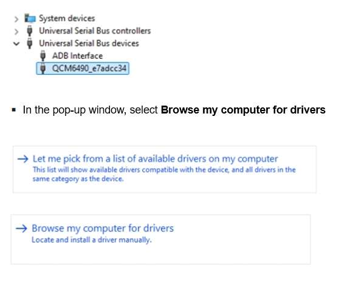

import Tabs from '@theme/Tabs';
import TabItem from '@theme/TabItem';


# 更新软件
<a id="updateSW"></a>

本节介绍如何在运行 Ubuntu、Windows 或 mac 操作系统的不同主机上，将预编译镜像下载并刷写到魔方派 3 设备上。


:::warning

使用预编译镜像更新软件会擦除设备上的所有数据并安装新的镜像。请确保在开始之前备份重要数据。

:::

## 下载 Ubuntu Server OS 镜像和启动固件

要下载预构建的 Ubuntu Server OS 镜像和启动固件，请执行以下操作：

1. 访问 Canonical® [Ubuntu on Qualcomm Iot](https://ubuntu.com/download/qualcomm-iot) 页面。

2. 选择 *RUBIK Pi 3 Development Board (QCS6490)*，点击 **Ubuntu Server** 的下载按钮下载操作系统和启动固件。

    确保已将以下文件下载到主机上的同一目录。

    |  文件名   | 描述  |
    |  ----  | ----  |
    | ubuntu-24.04-preinstalled-server-arm64+rubikpi3-20250912-127.img.xz  | Ubuntu server 原始镜像 |
    | QLI.1.4-ubuntu-rubikpi3-nhlos-bins-20250912-127.tar.gz  | 启动镜像 |
    | rawprogram0.xml  | Ubuntu Server 分区文件 |
    | dtb.bin  | 设备树二进制 |

## 集成可刷写的镜像

1. 为要集成的镜像创建一个文件夹。例如，在 Ubuntu 个人电脑系统上，以下命令创建 *rubikpi3_ubuntu_images* 目录。
    ```shell
    cd <workspace_dir>
    mkdir rubikpi3_ubuntu_images
    ```

    :::note
    `<workspace_dir>` 表示下载Ubuntu OS镜像、启动固件和相关文件的目录。
    :::

2. 下载 [启动固件](https://thundercomm.s3.dualstack.ap-northeast-1.amazonaws.com/uploads/web/rubik-pi-3/nhlos-bins/QLI.1.4-ubuntu-rubikpi3-nhlos-bins-20250912-127.tar.gz) 并将解压后的启动固件复制到 *rubikpi3_ubuntu_images* 文件夹中。
    :::note
    如果有 *patch0.xml* 文件，请从启动固件文件夹中删除它。
    :::

3. 从 [Canonical 网站](https://people.canonical.com/~platform/images/qualcomm-iot/rubikpi3/ubuntu-server-24.04/x00/) 下载 *dtb.bin* 并复制到 *rb3_ubuntu_images* 文件夹中。

4. 从 [Canonical 网站](https://people.canonical.com/~platform/images/qualcomm-iot/rubikpi3/ubuntu-server-24.04/x00/) 下载 *ubuntu-24.04-preinstalled-server-arm64+rubikpi3-20250912-127.img.xz*，解压缩包以获得原始镜像文件。

    ```shell
    unxz ubuntu-24.04-preinstalled-server-arm64+rubikpi3-20250912-127.img.xz
    ```

5. 将 Ubuntu原始映像 *ubuntu-24.04-preinstalled-server-arm64+rubikpi3-20250912-127.img* 文件复制到 *rubikpi3_Ubuntu_images* 文件夹。

    ```shell
    cp ubuntu-24.04-preinstalled-server-arm64+rubikpi3-20250912-127.img ./rubikpi3_ubuntu_images
    ```
6. 从 [Canonical 网站](https://people.canonical.com/~platform/images/qualcomm-iot/rubikpi3/ubuntu-server-24.04/x00/) 下载 *rawprogram0.xml* 并复制到 *rubikpi3_ubuntu_images* 文件夹中。

<a id="enterEDL"></a>
## 进入 EDL 模式


<Tabs>
<TabItem value="method1" label="方法 1">

1. 按住上图 12 的 EDL 按钮。

   

2. 将供电线接入到上图 10。

   

3. Type-C 数据线插入上图 5 等待 3 秒，进入 9008 模式。

   
</TabItem>
<TabItem value="method2" label="方法 2">

1. 将供电线接入到上图 10。

   

2. Type-C 数据线插入上图 5。

   

3. 在 RUBIK Pi 3 开机后，输入如下命令，进入 9008 模式。

   ```shell
   adb shell reboot edl
   ```
</TabItem>
</Tabs>

<a id="flashQDL"></a>
## 使用 QDL 工具进行烧录

QDL 是一款烧录工具，通过 QDL 可向魔方派中烧录镜像。

[点击此处下载](https://softwarecenter.qualcomm.com/api/download/software/tools/Qualcomm_Device_Loader/All/2.3.4/Qualcomm_Device_Loader.Core.2.3.4.All-AnyCPU-qdl_2.3.4.zip)
QDL，下载完成后解压，文件内容如下所示，QDL 支持多平台多架构，可通过查看 *QDL_User_Guide.pdf* 了解 QDL 的使用方法。


<Tabs>
<TabItem value="uhost" label="Ubuntu 主机">

1. 执行下面命令安装 libusb 和 libxml2（若已经安装，可忽略该步骤）。

```shell
sudo apt-get install libxml2-dev libudev-dev libusb-1.0-0-dev
```

2. 进入 *rubikpi3_ubuntu_images* 目录。
3. 根据主机架构将 *QDL_Linux_x64* 或 *QDL_Linux_ARM* 目录下的 qdl 拷贝到 *rubikpi3_ubuntu_images* 目录。
4. 执行下面命令进行烧录。

```shell
./qdl --storage ufs prog_firehose_ddr.elf rawprogram*.xml patch*.xml
```


5. 若烧录后无法启动，您可以点击 [此处](https://thundercomm.s3.dualstack.ap-northeast-1.amazonaws.com/uploads/web/rubik-pi-3/firmware/provision.zip) 下载 provision 文件重新对 UFS 进行配置。

:::warning
* 进行 provision 后，UFS 中存储的一些信息会丢失，如 SN号、以太网MAC地址等。
* 配置前，根据主机架构将 *QDL_Linux_x64* 或 *QDL_Linux_ARM* 目录下的 qdl 拷贝到 *provision* 目录
:::

进入到下载的 provison 文件夹，执行下面命令重新对 UFS 进行配置。

```shell
./qdl prog_firehose_ddr.elf provision_ufs_1_3.xml
```


:::note
 Provison 刷机完成之后，需要手动插拔电源线和 USB 线重启设备重新进行镜像烧录。
:::
</TabItem>
<TabItem value="whost" label="Windows 主机">

1. 安装 WinUSB 驱动（若已经安装可忽略该步骤）

   1. 卸载该设备的其他驱动程序。确保未安装 Qualcomm USB 驱动程序等驱动程序。

      * 您不应该在设备管理器的 COM 端口下看到魔方派设备，如下所示，如果您在 COM 端口下看到该设备，请右键该设备，选择删除设备。

      

      * 确保已选中“删除此设备的驱动程序软件”。

      

   2. 设备断电，重新进入烧录模式，使用以下说明/屏幕截图安装 Microsoft WinUSB。

      * 在设备管理器中右键 RUBIK Pi 的 USB 端口，选择更新驱动程序。

      

      * 在通用串行总线设备中，选择 "WinUsb Device"。

      

      * 点 “是”，完成驱动更新。

      

2. 在终端中使用以下命令根据主机架构运行 *QDL_Win_x64* 或 *QDL_Win_ARM64* 目录中的 QDL 可执行文件, 进行镜像烧录。烧录完成后设备自动启动。请确保位于 `rubikpi3_ubuntu_images` 目录。
:::note
 程序文件名不支持通配符。命令中必须列出每个镜像文件。

 将 `<pathToQDL>` 更换为 *QDL_Win_x64* 或 *QDL_Win_ARM64* 目录的实际位置。
:::

```shell
<pathToQDL>\QDL.exe prog_firehose_ddr.elf rawprogram0.xml rawprogram1.xml rawprogram2.xml rawprogram3.xml rawprogram4.xml rawprogram5.xml rawprogram6.xml patch1.xml patch2.xml patch3.xml patch4.xml patch5.xml patch6.xml
```


3. 若烧录后无法启动，您可以点击 [此处](https://thundercomm.s3.dualstack.ap-northeast-1.amazonaws.com/uploads/web/rubik-pi-3/firmware/provision.zip) 下载 provision 文件重新对 UFS 进行配置。

:::warning
 进行 provision 后，UFS 中存储的一些信息会丢失，如 SN号、以太网MAC地址等。

 将 `<pathToQDL>` 更换为 *QDL_Win_ARM64* 或 *QDL_Win_x64* 目录的实际位置。

:::

```shell
<pathToQDL>\QDL.exe prog_firehose_ddr.elf provision_ufs_1_3.xml
```


:::note
 Provison 刷机完成之后，需要手动插拔电源线和 USB 线重启设备重新进行镜像烧录。
:::
</TabItem>
<TabItem value="mhost" label="macOS 主机">

1. 使用以下方式安装 homebrew (若已经安装，可忽略该步骤)。

```shell
/bin/bash -c "$(curl -fsSL https://raw.githubusercontent.com/Homebrew/install/HEAD/install.sh)"
```

2. 执行下面命令安装 libusb 和 libxml2。

```shell
brew install libusb
brew install libxml2
```

3. 确保位于 *rubikpi3_ubuntu_images* 目录。
4. 根据主机的架构将 *QDL_Mac_x64* 或 *QDL_Mac_ARM* 目录下的内容拷贝到 *rubikpi3_ubuntu_images* 目录。
5. 执行下面命令进行烧录。

```shell
./qdl --storage ufs prog_firehose_ddr.elf rawprogram*.xml patch*.xml
```


6. 若烧录后无法启动，您可以点击 [此处](https://thundercomm.s3.dualstack.ap-northeast-1.amazonaws.com/uploads/web/rubik-pi-3/firmware/provision.zip) 下载 provision 文件重新对 UFS 进行配置。

:::note
 进行 provision 后，UFS 中存储的一些信息会丢失，如 SN 号、以太网 MAC 地址等。

 配置前，根据主机架构将 *QDL_Mac_x64* 或 *QDL_Mac_ARM* 目录下的 qdl 拷贝到 *provision* 目录
:::

```shell
./qdl prog_firehose_ddr.elf provision_ufs_1_3.xml
```


:::note
 Provison 刷机完成之后，需要手动插拔电源线和 USB 线重启设备重新进行镜像烧录。
:::
</TabItem>
</Tabs>

## 后续步骤

1. [设置设备](2.set-up-your-device.md)
2. [运行示例应用程序](../3.run-sample-applications.md)
