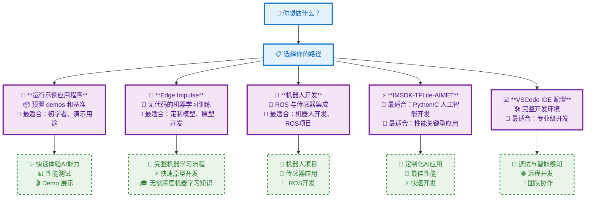

# 深入研究

## 选择开发路径

根据目标和经验，选择最适合你的 RUBIK Pi 开发路径：

## 路径描述

### 🚀 **运行示例应用程序**
专为希望快速体验设备AI实际能力的用户打造。该路径提供预置演示程序与性能基准测试。

**最适合：** 初学者，演示场景，性能测试需求

### 🧠 **Edge Impulse**
专为希望训练自有机器学习模型、但不具备深度 AI 专业知识的用户设计。该平台提供完整的 ML 工作流程。

**最适合：** 定制模型训练，无代码机器学习，快速原型开发

### 🤖 **机器人开发**
专为机器人爱好者和从事 ROS（机器人操作系统）及传感器集成的开发者打造。

**最适合：** 机器人项目，ROS开发，传感器应用

### ⚡ **IMSDK-TFLite-AIMET**
面向开发者的高效 AI 开发方案：基于 Python/C 语言，结合 TensorFlow Lite 实现高性能 AI 应用快速构建。

**最适合：** 定制化AI应用，性能关键型项目，快速开发

### 💻 **VSCode IDE 配置**
专为开发者打造的全功能 IDE 环境：集成调试、智能感知（IntelliSense）及远程开发能力。

**最适合：** 专业开发，调试支持，团队协作

