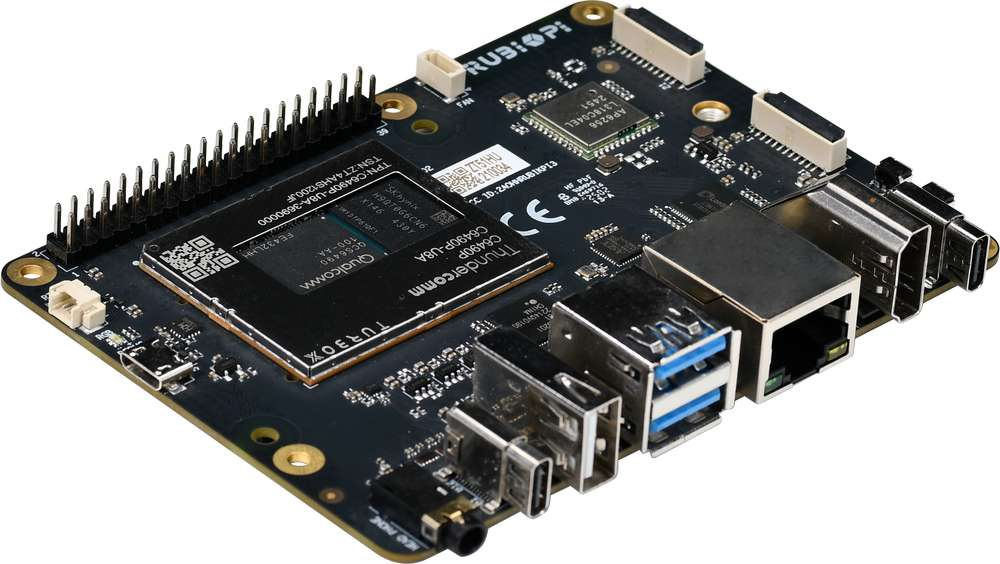

import Tabs from '@theme/Tabs';
import TabItem from '@theme/TabItem';

# 开始使用魔方派 3

本快速入门指南可帮助您设置魔方派 3，用于在基于 Ubuntu24.04 的环境中探索和试用端到端的多媒体和 AI 应用程序。此外，本指南还提供了关于如何与运行 Linux、Windows(®) 和 macOS(®) 的主机建立基本通信的说明。

魔方派 3 基于高通 QCS6490 芯片，采用  Qualcomm® Kryo™ 670 CPU 和融合 AI 加速器架构的 Qualcomm® Hexagon™ 处理器，具备 12 TOPS 的卓越 AI 性能，适用于各种机器学习和人工智能应用场景。

魔方派 3 具有丰富的接口和功能设计，支持 USB、Camera、DP、HDMI、ETH、3.5mm 耳机、Wi-Fi、BT、M.2 连接器、FAN、RTC、40 pin 排针连接器等，满足多样化的开发需求，方便开发者快速开发和调试。

魔方派 3 同样也支持多种系统，如 Qualcomm Linux、Debian 13、Canonical Ubuntu for Qualcomm Platforms、Android 13 等，灵活满足开发者特定应用要求。

## 包装内容

* 魔方派 3

* 魔方派贴纸

* 快速开始卡片

## 熟悉板卡

## 常规工作流

| Task                | Operation                                                                 |
|---------------------|--------------------------------------------------------------------------|
| 更新软件     | 
1. 下载镜像。

2. 使设备进入紧急下载（EDL）模式。

3. 配置通用闪存存储 (UFS)，并刷写配置数据表。（CDT）

4. 使用 Qualcomm Download (QDL) 工具进行刷写。
 |
| 设置设备   | 
1. 设置调试串口。

2. 验证 Ubuntu 24.04 版本。

3. 连接到网络，连接到 SSH 和 HDMI 显示器。
 |
| 运行示例应用程序 | 运行多媒体和 AI 示例应用程序。                                |
