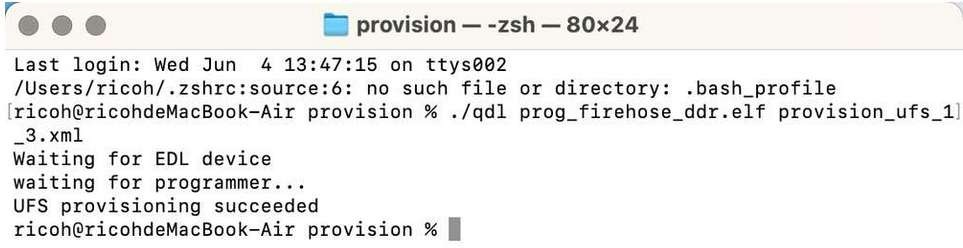
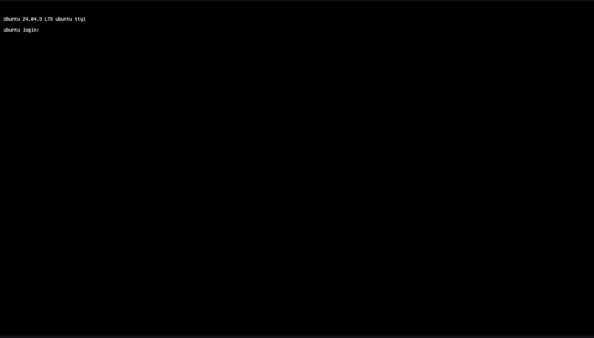

import Tabs from '@theme/Tabs';
import TabItem from '@theme/TabItem';

# 刷写 Canonical Ubuntu 24.04 覆盖 Android/QLI 系统

如果您的设备当前运行的是 Android 或 Qualcomm Linux (QLI)，可参考本节内容将现有操作系统替换为经过认证的 Canonical Ubuntu 24.04 Server 镜像。此操作需在Ubuntu、Windows® 或 macOS® 主机上完成。

   **推荐**转向 Ubuntu 进行 **AI 和多媒体开发的开发者**参考本章操作。
    
    :::warning
    刷写预构建的 Ubuntu 镜像会清除设备上的所有数据。请在继续操作之前备份重要文件。
    ::: 
    
    :::info 
    	- 如果 QLI 版本是 1.3 或更高版本，请忽略更新 UFS 配置步骤。  
    	- **开始前** - 完成 [**🔗设置**](../2.set-up-your-device.md#让我们开始吧) 步骤。 
    :::

###  现在开始吧！


### 1️⃣ 设置 QDL 工具

**Qualcomm 设备加载程序 (QDL)** 是一个跨平台工具。可以使用该工具在**Windows**、**Linux**和**macOS** 系统上传闪存加载程序，将软件镜像刷入 Qualcomm® USB 设备。  
**a**. 从提供的链接下载适合主机的（**Windows**、**Linux**或**macOS**）QDL 工具版本。  [**QDL tool** (包含可执行文件)](https://softwarecenter.qualcomm.com/catalog/item/Qualcomm_Device_Loader)  
**b**. 查看官方设置指南，了解完整的刷机过程。 

<a id="flashQDL"></a> 
<Tabs>
<TabItem value="uhost" label="Ubuntu 主机">
执行以下命令安装 libusb 和 libxml2。（如果已经安装，请跳过此步骤。）

```shell
sudo apt-get install libxml2-dev libudev-dev libusb-1.0-0-dev
```

</TabItem>
<TabItem value="whost" label="Windows 主机">
安装 winUSB 驱动程序：  
设备准备刷机前，按照以下步骤安装**winUSB 驱动程序**：

* 卸载现有驱动程序  
确保**未安装 Qualcomm USB 驱动程序(QUD)**或任何其他冲突的驱动程序。打开**设备管理器**，找到您的设备，然后卸载所有现有的驱动程序。  
在卸载对话框中，**选中**下图所示的框：
  
          
      
         * 确保选中 **删除此设备的驱动程序软件**。
      
         

* 在 QDL 文件夹中 - 运行**install\_driver.bat。**

</TabItem>
<TabItem value="mhost" label="macOS 主机">
* 使用以下方法安装 Homebrew。（如果已经安装，请跳过此步骤。）

```shell
/bin/bash -c "$(curl -fsSL https://raw.githubusercontent.com/Homebrew/install/HEAD/install.sh)"
```

* 运行以下命令安装libusb和 libxml2。

```shell
brew install libusb
brew install libxml2
```

</TabItem>
</Tabs>
### 2️⃣ UFS 配置

配置 UFS 可确保正确初始化和分区，以支持新的操作系统镜像。

**a**. 点击链接下载 provision.zip 文件[ **UFS**](https://artifacts.codelinaro.org/ui/native/codelinaro-le/Qualcomm_Linux/QCS6490/)。  
**b**. 解压并将 [**步骤1**](#1️⃣-设置-qdl-工具) 中的 QDL 可执行文件 复制到 UFS 配置文件夹。  
:::note 
- 对于 Windows 主机，请确保将DLL文件与可执行文件一起复制。
::: 
**c**. 进入[ **EDL 模式。**](../2.set-up-your-device.md#进入edl模式)  
**d**. 进入配置文件夹执行UFS配置操作。  
<Tabs> 
<TabItem value="uhost" label="Ubuntu 主机"> 
运行以下命令重新配置 UFS。

```shell
./qdl prog_firehose_ddr.elf provision_1_3.xml
```

 
</TabItem> 
<TabItem value="whost" label="Windows 主机"> 
运行以下命令重新配置UFS。

```shell
<pathToQDL>\QDL.exe prog_firehose_ddr.elf provision_1_3.xml
```

 
</TabItem> 
<TabItem value="mhost" label="macOS 主机"> 
运行以下命令重新配置UFS。

```shell
qdl prog_firehose_ddr.elf provision_1_3.xml
```

 
</TabItem> 
</Tabs>

### 3️⃣ 刷写瑞萨固件。

瑞萨固件更新可确保开发板中嵌入的瑞萨 MCU 组件的正确初始化和兼容性。此步骤对于在 Ubuntu 下实现设备的安全启动、稳定通信和完整功能至关重要。

**a**. 点击链接下载 [**瑞萨固件升级包。**](https://thundercomm.s3.dualstack.ap-northeast-1.amazonaws.com/uploads/web/rubik-pi-3/firmware/Flat_usb_fw.zip)  
**b**. 解压并将 [**步骤1**](#1️⃣-设置-qdl-工具) 中的 QDL 可执行文件复制到瑞萨固件文件夹。  
:::note 
- 对于 Windows 主机，请确保将dll文件与可执行文件一起复制。
::: 
**c**. 进入[ **EDL 模式**](../2.set-up-your-device.md#进入edl模式)。  
**d**. 使用 QDL 命令刷写驱动。
<Tabs> 
<TabItem value="uhost" label="Ubuntu 主机"> 
运行以下命令。

```shell
qdl --storage ufs prog_firehose_ddr.elf rawprogram*.xml patch*.xml
```

</TabItem>
<TabItem value="whost" label="Windows 主机">
运行以下命令。
```shell
QDL.exe prog_firehose_ddr.elf rawprogram0.xml rawprogram1.xml rawprogram2.xml rawprogram3.xml rawprogram4.xml rawprogram5.xml patch1.xml patch2.xml patch3.xml patch4.xml patch5.xml  
```
</TabItem>
<TabItem value="mhost" label="macOS 主机">
运行以下命令。
```shell
qdl prog_firehose_ddr.elf rawprogram*.xml patch*.xml
```
</TabItem>
</Tabs>
:::note
 若操作失败，断开并重新连接电源和 USB 数据线，重启魔方派 3 ，然后再次执行刷写操作。
:::
### 4️⃣下载并刷写 Canonical Ubuntu。

**a**. 从 Canonical Ubuntu 网站下载魔方派 3 的系统镜像。[**Server 24.04 image**](https://people.canonical.com/~platform/images/qualcomm-iot/rubikpi3/ubuntu-server-24.04/x00/ubuntu-24.04-preinstalled-server-arm64+rubikpi3-20250912-127.img.xz)。根据主机配置提取系统镜像XZ文件。  
**b**. 下载 dtb.bin 文件 [**Devicetree blob**](https://people.canonical.com/~platform/images/qualcomm-iot/rubikpi3/ubuntu-server-24.04/x00/dtb.bin)  
**c**. 下载 rawprogram0.xml 文件 [**rawprogram0.xml**](https://people.canonical.com/~platform/images/qualcomm-iot/rubikpi3/ubuntu-server-24.04/x00/rawprogram0.xml)  
**d**. 下载启动固件镜像。[**Boot firmware**](https://thundercomm.s3.dualstack.ap-northeast-1.amazonaws.com/uploads/web/rubik-pi-3/nhlos-bins/QLI.1.4-ubuntu-rubikpi3-nhlos-bins-20250912-127.tar.gz)  
**e**. 解压启动固件镜像的压缩文件，并将系统镜像（步骤a）、dtb.bin（步骤b）和rawprogram0.xml（步骤c）复制到该文件夹位置。  
**f**.解压并将 [**步骤1**](#1️⃣-设置-qdl-工具) 获取的可执行文件复制到启动固件文件夹。  
:::note 
- 对于 Windows 主机，请确保将dll文件与可执行文件一起复制。
:::
**g**. 进入 [ **EDL 模式。**](../2.set-up-your-device.md#进入edl模式)  
**h**. 按照以下步骤使用主机电脑刷写设备：  
<Tabs>
<TabItem value="uhost" label="Ubuntu 主机"> 
运行以下命令。

```shell
qdl --storage ufs prog_firehose_ddr.elf rawprogram*.xml patch*.xml
```

</TabItem>
<TabItem value="whost" label="Windows 主机">
运行以下命令。
```shell
QDL.exe prog_firehose_ddr.elf rawprogram0.xml rawprogram1.xml rawprogram2.xml rawprogram3.xml rawprogram4.xml rawprogram5.xml rawprogram6.xml patch1.xml patch2.xml patch3.xml patch4.xml patch5.xml patch6.xml
```
</TabItem>
<TabItem value="mhost" label="macOS 主机">
运行以下命令。
```shell
qdl prog_firehose_ddr.elf rawprogram*.xml patch*.xml
```
</TabItem>
</Tabs>
:::tip
 如果操作失败，断开并重新连接电源和 USB 数据线，重启魔方派 3 ，然后再次执行刷写操作。
:::
:::info
 默认情况下，刷写平台构建版本时，CDT 也会被刷写到指定的名为 "cdt" 的位置。这个过程是在 rawprogram3.xml 文件中定义的。  
:::

**i**. 刷写完成后，设备将自动启动，并在连接的 HDMI 显示器上显示启动屏幕。  


### 5️⃣登录和Wi-Fi连接

**a**. 在显示器UART控制台/SBC终端上登录并更改密码。  
**b**. 设置 Wi-Fi 连接。[**Wi-Fi 设置指南**](../2.set-up-your-device.md#连接到网络)

### 6️⃣ 安装预构建的软件包

运行以下命令在设备上安装预构建的包。

```shell
git clone -b ubuntu_setup --single-branch https://github.com/rubikpi-ai/rubikpi-script.git
cd rubikpi-script
./install_ppa_pkgs.sh 
```

<details>
该脚本将安装以下内容：      
* 安装 AI 示例应用程序包。  
* 安装魔方派 3 摄像头、wiringrp 及 wiringrp_python 软件包。
* 安装通用开发工具相关软件包。
</details>
>  **说明**: 如果遇到包安装失败，请运行以下命令：`apt --fix-broken install`

成功运行 install\_ppa\_pkgs.sh 后，可以在显示器上看到以下屏幕。   


### 7️⃣ 验证软件版本

在设备 shell 中运行以下命令来验证版本：
	```shell
	cat /etc/os-release 
	```
输出: 
	```json
NAME="Ubuntu"
VERSION_ID="24.04"
VERSION="24.04.2 LTS (Noble Numbat)"
VERSION_CODENAME=noble
ID=ubuntu
ID_LIKE=debian
HOME_URL="https://www.ubuntu.com/"
SUPPORT_URL="https://help.ubuntu.com/"
BUG_REPORT_URL="https://bugs.launchpad.net/ubuntu/"
PRIVACY_POLICY_URL="https://www.ubuntu.com/legal/terms-and-policies/privacy-policy"
UBUNTU_CODENAME=noble
LOGO=ubuntu-logo
```
运行以下命令查看Linux版本：
	
```shell
uname -a	
```
输出：
	```json
	Linux ubuntu 6.8.0-1055-qcom #55-Ubuntu SMP PREEMPT_DYNAMIC Wed Sep 17 02:03:34 UTC 2025 aarch64 aarch64 aarch64 GNU/Linux  
	```
---
> **🧭 后续步骤**
> 镜像刷写后，请参考 [**应用开发与执行指南**](../7.Application%20Development%20and%20Execution%20Guide/index.md).
---
```