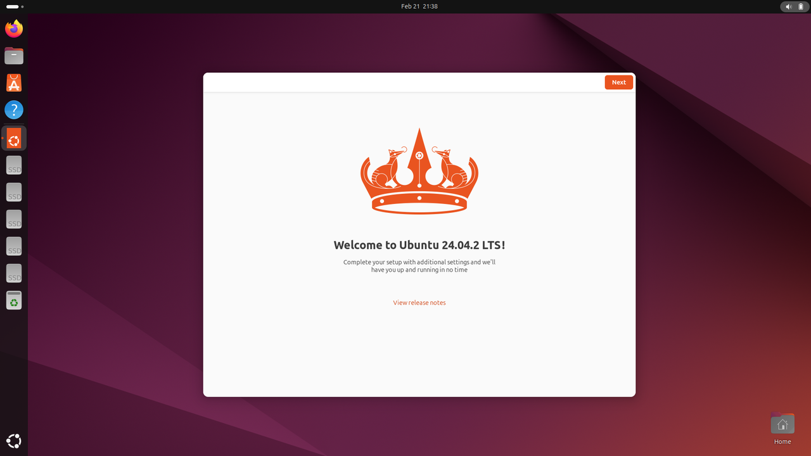

---
# Display h2 to h4 headings
toc_min_heading_level: 2
toc_max_heading_level: 4
---

import Tabs from '@theme/Tabs';
import TabItem from '@theme/TabItem';

# Ubuntu 桌面版与服务器版

**Ubuntu 桌面版需要开源的 Freedreno 图形驱动，而非高通专有的 Adreno 驱动**。虽然 Adreno 驱动支持硬件加速的预处理和后处理，但它与标准 Ubuntu 桌面环境不兼容。Freedreno 可确保在 Ubuntu 24.04 中实现更广泛的桌面功能及图形应用兼容性。
:::note 
Ubuntu 服务器版仍然可以用作**SBC**（单板计算机），无主机要求。
:::

Ubuntu 桌面版和服务器版是 Ubuntu 操作系统的两个主要版本，每个版本都针对不同的使用场景和要求进行定制。它们之间的主要区别如下：

| 维度| 桌面版| 服务器版
|----------|----------|----------
| 设计目标| 互动体验，多任务处理| 服务稳定性、资源效率
| 用户界面| 图形界面（GNOME）| Wayland 显示
| 内存使用| 相对较高（GUI 常驻）| 相对较低
| Qualcomm AI 支持| 支持非图形AI| 支持
| GPU驱动程序| 使用 freedreno| 使用 adreno
| CSI摄像头| 支持| 支持

### 从 Ubuntu 桌面版切换到服务器版

1. 参考 [连接到网络](../2.set-up-your-device.md#连接到网络) 确保网络连接正常。
2. 执行以下命令从桌面版切换到服务器版：
:::warning
此过程花费时间较长。请不要中断。
:::

```shell
sudo apt-get install qcom-adreno1
sudo apt-get remove ubuntu-desktop
sudo apt remove gdm3
sudo reboot
```

3. 系统启动后，出现如下界面，表示切换成功：  

4. 运行以下命令在设备上安装预构建的包。

```shell
git clone -b ubuntu_setup --single-branch https://github.com/rubikpi-ai/rubikpi-script.git
cd rubikpi-script
./install_ppa_pkgs.sh 
```

5. 检查 HDMI 显示器并确认按预期显示。  


### 从 Ubuntu 服务器版切换到桌面版

1. 参考 [连接到网络](../2.set-up-your-device.md#连接到网络) 确保网络连接正常。
2. 执行以下命令从服务器版切换到桌面版：
:::warning
此过程花费时间较长。请不要中断。
:::

```shell
sudo apt install qcom-adreno1- libgbm-msm1- libegl-mesa0 libegl1 libgles2 libglvnd0 libvulkan1 weston-
sudo apt install ubuntu-desktop
sudo reboot
```

3. 系统启动后，出现如下界面，表示切换成功： 