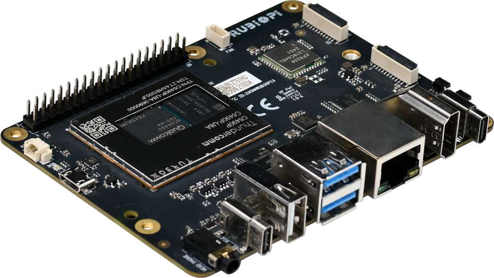
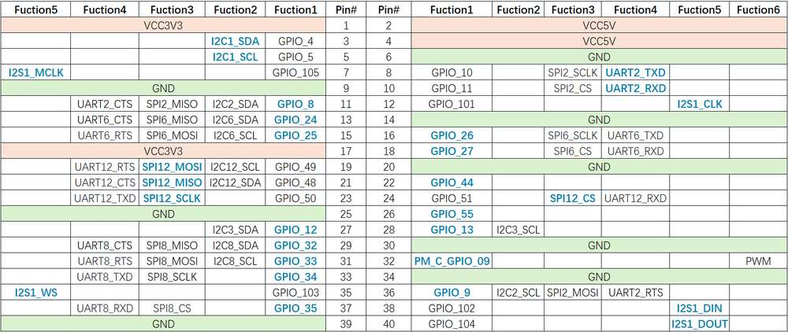
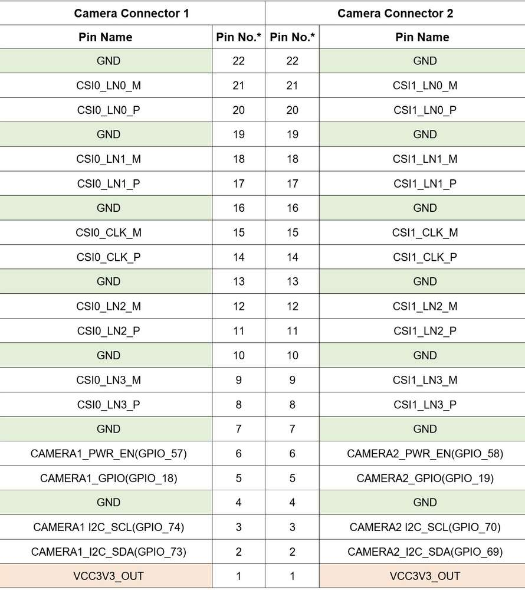
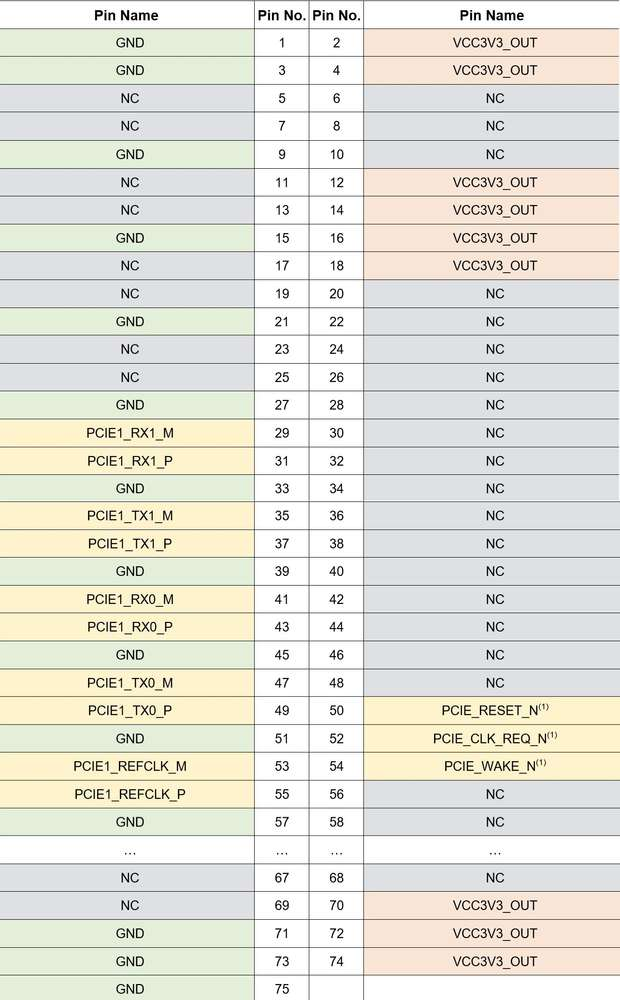

# 数据手册

## 产品概述

| 类别| 魔方派 3 特性
|----------|----------
| 平台信息| Qualcomm® QCS6490
| 内存| 
RAM 8 GB LPDDR4x

ROM 128 GB UFS 2.2

| 视频接口| 
1路HDMI 1.4 输出 (最高 4K 30 Hz)

1路DP over USB Type-C (最高 4K 60 Hz)

2路摄像头接口 (4-lane MIPI CSI D-PHY)

| 音频| 1路3.5mm 耳机接口
| 功能接口| 
1路USB Type-C (USB 3.1 Gen 1)

2路USB Type-A (USB 3.0)

1路USB Type-A (USB 2.0)

1路以太网（1000/100/10 Mbps 全双工自协商）

1路UART调试 (通过Micro USB)

1路M.2 Key M 接口 (PCIe 3.0 x 2)

40-pin 连接器支持多种接口选项：

- 多达 28 个 GPIO

- 多达 2 路 I2C

- 多达 3 路 UART

- 多达 3 路 SPI

- 1 路 I2S (PCM)
- 1 路 PWM |
| 其他| 
1 个 PWR 按键

1 个 EDL 按键

1 个 RGB LED

2-pin RTC 电池接口
4-pin PWM 风扇接口
| 无线连接| 
无线网：IEEE 802.11 a/b/g/n/ac Wi-Fi

蓝牙: BT 5.2
板载 PCB 天线
| 供电| Type-C电源接口, 12V 3A
| 工作环境| 工作温度：0°C – 50°C
| 尺寸| 100mm x 75mm x 25mm
| 操作系统| 
Android 13

Qualcomm Linux

Debian 13
Canonical Ubuntu for Qualcomm platforms

## 特性简介

### 系统框图

### 功能分布

| 编号| 接口| 编号| 接口
|----------|----------|----------|----------
| 1| RTC 电池接口| 10| Type-C电源接口
| 2| Micro USB (UART 调试)| 11| PWR 按键
| 3| TurboX C6490P SOM| 12| EDL 按键
| 4| 3.5mm 耳机接口| 13| 摄像头接口 2
| 5| USB Type-C with DP (USB 3.1)| 14| 摄像头接口 1
| 6| USB Type-A (USB 2.0)| 15| Wi-Fi/蓝牙模块
| 7| 2 x USB Type-A (USB 3.0)| 16| 风扇接口
| 8| 1000M 以太网| 17| 40-pin 连接器
| 9| HDMI OUT| 18| M.2 Key M 接口

### 电气特性

#### 输入电源要求

魔方派 3 集成了Power Delivery协议的协商IC，最高支持PD 3.0。请使用支持12V 3A PD 3.0协议的Type-C接口电源适配器。经验证的配件列表，请参见[外设兼容列表](https://www.thundercomm.com/rubik-pi-3/cn/docs/peripheral-compatibility-list)。

当电源适配器符合规格并成功协商后，电源指示灯将亮起（黄绿色）。如果适配器不符合要求，LED 将保持熄灭状态，并且设备将无法启动。

#### 电源输出要求

魔方派 3 在接入支持12V 3A PD协议的电源适配器后，每个接口对外输出的最大电流如下表。

| 接口类型| 输出电压| 最大输出电流| 备注
|----------|----------|----------|----------
| USB 3.0 Type-A - 1| 5V| 1.5A| 
| USB 3.0 Type-A - 2| 5V| 1.5A| 3个USB口同时输出的总电流不要超过3A。
| USB 2.0 Type-A| 5V| 1.5A| 
| 40 Pin GPIO| 5V| 1A| 
| 40 Pin GPIO| 3.3V| 1A| 
| HDMI| 5V| 100mA| 
| M.2 Key M| 3.3V| 1A| 
| 摄像头接口 1| 3.3V| 300mA| 
| 摄像头接口 2| 3.3V| 300mA| 

当超过最大输出电流时，会触发输出电源保护或系统重启。

建议不要使用魔方派 3的USB 口给消耗电流较大的USB外设，如USB 风扇、音箱或显示屏等供电。

### 结构尺寸

\*以上标注单位均为mm。

## 接口特性

### 40-pin 连接器

40-pin 连接器的默认功能如下所示：

下表罗列了40-pin 连接器的引脚定义：

蓝色加粗标注的是默认功能。

魔方派 3 共引出28个GPIO。默认配置为2 路 I2C、1 路 UART、 1 路 SPI、 1 路 I2S、1 路 PWM IO 及9个GPIO。

所有GPIO电平都为3.3V。其中 I2C 的 GPIO（4、5、12、13）为带上拉电阻的开漏输出模式，上拉电阻为4.7 kΩ。其他GPIO为推挽输出模式，受板内电平转换IC限制，外部连接信号的外部上拉或下拉电阻不能小于50 kΩ。

相同QUP的GPIO可灵活配置为UART或SPI，具体请参照用户手册。

连接器为2.54mm间距，兼容绝大部分开源生态开发板的扩展板。

### HDMI 接口

魔方派 3配有标准尺寸HDMI接口，兼容HDMI1.4协议。HDMI接口输出分辨率最高可达4K 30Hz，支持CEC（Consumer Electronics Control）功能及5V DDC 和HPD接口。

### Ethernet 接口

魔方派 3提供标准RJ45接口，带Link及Active 指示灯，最高支持1000 Mbps全双工，同时向下兼容100/10 Mbps，可自动协商。

Ethernet 接口的Link及Active 指示灯如下所示：

### USB 接口

#### USB 3.1 Gen 1 Type-C

魔方派 3带有一个 USB 3.1 Gen 1 Type-C接口，最高支持5 Gbps读写速率，支持Type-C with DisplayPort v1.4，可通过Type-C to DP 转接线输出，最高分辨率为4K 60Hz。

默认该口作为 ADB 调试接口。

#### USB 3.0 Type-A

魔方派 3有两个标准USB 3.0 Type-A接口，单路USB 3.0 最大4 Gbps读写速率。

USB 3.0 Type-A接口只能在Host模式下工作。单口最大对外输出能力为5V 1.5A，可单独控制电源输出。

#### USB 2.0 Type-A

魔方派 3有一个标准USB 2.0 Type-A接口，最高支持480 Mbps 读写速率。该接口默认为Host模式，可通过软件配置此口为Device模式作为ADB接口。单口最大对外输出能力为5V 1.5A（3个USB Type-A 共3A），可单独控制电源输出。

### 3.5mm 音频接口

3.5mm 音频接口按照CTIA耳机接口标准（国际标准）设计，支持左右声道和麦克风输入。

耳机接口信号如下图所示，从右至左分别为：1-左声道、2-右声道、3-地线、4-麦克风。

下表罗列了3.5mm 音频接口的引脚定义：

| 引脚编号| 引脚名称
|----------|----------
| 1| 左声道
| 2| 右声道
| 3| 地线
| 4| 麦克风

### 摄像头接口

魔方派 3 共有2个22-pin的摄像头接口。每个接口均支持4-lane MIPI CSI D-PHY，并带有1路I2C及2个控制GPIO。GPIO电平为3.3V，其中I2C信号为带有上拉电阻的开漏输出模式。连接器为0.5mm间距，与主流开发板摄像头接口引脚兼容。具体型号请参考[外设兼容列表](https://www.thundercomm.com/rubik-pi-3/cn/docs/peripheral-compatibility-list)。

下表罗列了摄像头接口的引脚定义：

本手册对应更换后的新版摄像头接口。新版摄像头接口仅为方便用户操作，并无性能差异。若使用体验版（丝印为V01）硬件，请参考《魔方派 3 V01（体验版）数据手册》。

### M.2 接口

魔方派 3 提供一个标准M.2插槽，用于连接NVMe存储，可安装2280规格（22mm x 80mm）M.2 SSD硬盘。M.2 插槽最大支持PCIe 3.0 x2。M.2接口最大对外输出能力为3.3V 2A，可单独控制开关。

下表罗列了M.2 接口的引脚定义：

(1). PCIe 控制IO 电平为3.3V。

### Wi-Fi

魔方派 3 板载的无线通讯模块，支持IEEE 802.11 a/b/g/n/ac Wi-Fi。板载PCB天线，无需外接天线。

### 蓝牙

魔方派 3 板载的无线通讯模块，支持BT 5.2，支持蓝牙数据传输，蓝牙音频等应用。蓝牙与Wi-Fi共用PCB天线，无需外接天线。

### 风扇接口

风扇接口使用1mm间距4-pin连接器。支持5V 供电风扇，使用风扇的最大额定电流不超过200mA。接口支持PWM调速。关于引脚定义和主板安装孔兼容的风扇，请参考[外设兼容列表](https://www.thundercomm.com/rubik-pi-3/cn/docs/peripheral-compatibility-list)。

下表罗列了风扇接口的引脚定义：

| 引脚编号| 引脚名称
|----------|----------
| 1| NC
| 2| 地线
| 3| PWM\_OUT(1)
| 4| VCC5V\_OUT

(1). PWM IO 为5V电平。

### RTC 电池接口

RTC电池接口使用1.25mm间距2-pin连接器。仅限3V纽扣电池接入，正常工作时支持的电压范围为2V – 3.25V。

下表罗列了RTC 电池接口的引脚定义：

| 引脚编号| 引脚名称
|----------|----------
| 1| VCC3V\_IN
| 2| 地线

### Micro USB转UART调试接口

魔方派 3 板上集成了WCH CH343，USB转串口TTL IC，可使用Micro USB 线通过上位机直接访问主控的串口log。

串口波特率默认为115200，8个数据位，1停止位，无校验位。

CH343驱动官方下载链接：[Driver](https://www.wch.cn/downloads/category/67.html?feature=USB%E8%BD%AC%E4%B8%B2%E5%8F%A3&product_name=CH343)。

### 按键

#### PWR 按键

插入电源线后，短按PWR开机键，指示灯闪烁一次，表明开机成功，设备开始正常工作。

#### EDL 按键

强制下载按键。插入电源后，与 PWR 按键同时按住3s以上，设备进入强制下载模式（9008）。

### LED

#### 电源指示LED

当插入符合要求（支持12V 3A PD协议）电源时，黄绿色指示灯常亮，表示设备可以正常工作。

#### RGB LED

魔方派 3 板载一颗RGB 三合一 LED，支持PWM 调光。

## 注意事项

### 工作环境

魔方派 3 可在0°C – 50°C的环境温度下工作，使用过程中请密切关注CPU的温度并进行相应的散热处理，确保CPU的工作温度不超过85°C，避免出现CPU降频或性能下降。若设备长期处于高温情况下使用，有可能对硬件产生不可逆损坏。

### 静电防护

请注意静电防护，任何情况下，不要用手直接触碰板上元器件！

### 警告

魔方派 3 使用的任何外置电源应符合所在国家的相关法规和标准。电源应提供12V DC和3A最小额定电流。

### 安全使用说明

- 此产品不可超频。
- 请勿将本产品暴露在水或潮湿环境中进行操作。
- 请勿将其置于导电表面上。
- 请勿将此产品靠近任何热源；此产品仅适合在正常室温中使用，以确保可靠运行。
- 请勿将电路板暴露于高强度光源下使用（例如氙气闪光灯或激光）。
- 在通风良好的环境中运行此产品，在使用过程中请勿将其覆盖。
- 使用时，请将本产品放在稳定、平坦、绝缘的表面上，请勿让它接触导电物品。
- 拿放本产品时请小心，以免对印刷电路板和连接器造成机械或电气损坏。
- 本产品通电时避免接触、拿放。拿放时应只接触产品边缘，以最大限度降低静电放电损坏的风险。魔方派 3 使用的任何外设或设备应符合使用国家的相关标准，并进行相应标记，以确保满足安全和性能要求。