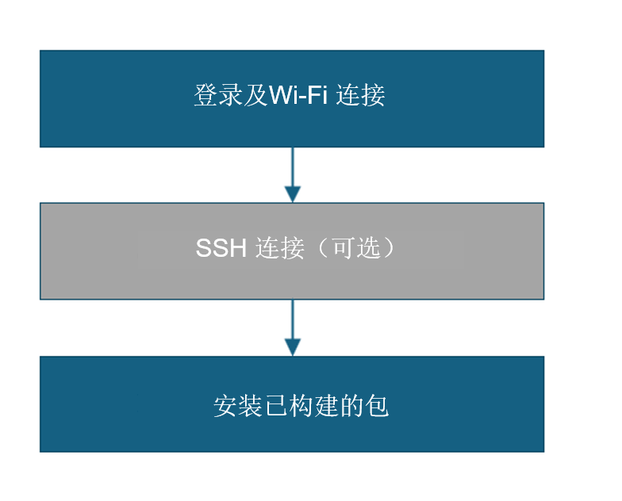
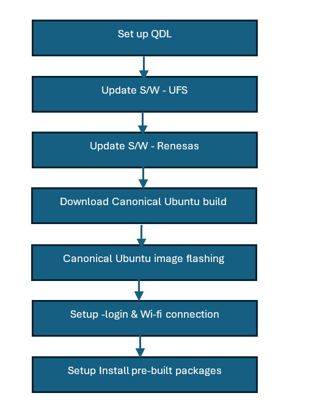
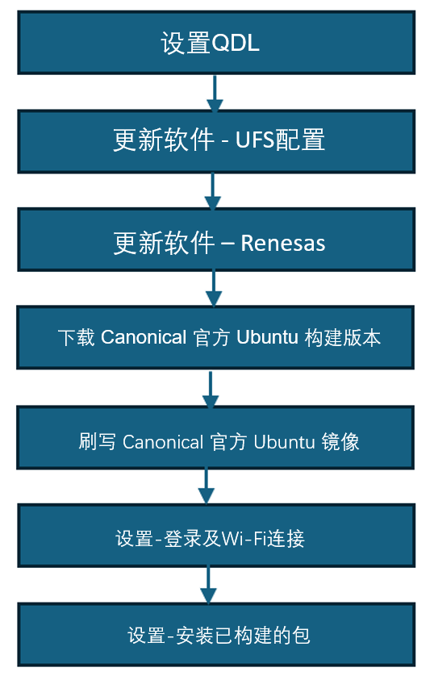
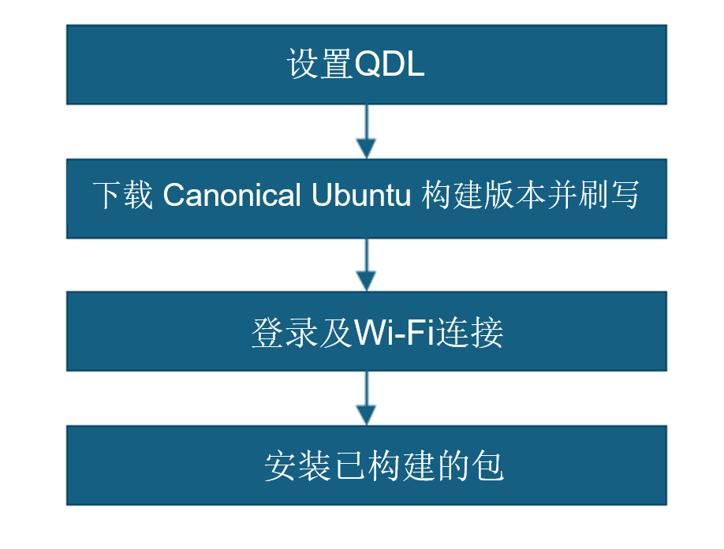

import Tabs from '@theme/Tabs';
import TabItem from '@theme/TabItem';

# 👋 RUBIK Pi 内部测试指南
感谢加入RUBIK Pi内部测试团队！本指南将带您了解我们的自用测试，您的反馈将帮助我们发现问题并在正式发布前使RUBIK Pi变得更好。

***本指南包含：***  
 如何开始进行自用测试  
 报告错误和分享反馈的步骤  
 在哪里找到支持和资源  

我们鼓励您深入探索，尝试各种功能，并让我们知道哪些方面运行良好，哪些方面需要改进。
您的反馈是让 RUBIK Pi 臻于完善的关键！

# 工作流程比较

<details>

| **项目**               |  [🖥️ 工作流程1-预装认证Ubuntu版本](#wfl1) |  [🖥️工作流程2 – 预装QLI版本 (9/30前)](#wfl2) | [🖥️工作流程3 – QLI/Android到认证Ubuntu (9/30后)](#wfl3) |  [🖥️工作流程4 – 重置系统镜像或更新qcom固件](#wfl4) |
|--------------------------|---------------------------------------------------------------|--------------------------------------------------|---------------------------------------------------------------|--------------------------------------------------------------|
| **设备状态**         | 设备预装认证Ubuntu和Renesas固件   | 设备预装QLI版本            | 设备预装QLI/Android版本，需要更新到Ubuntu      | 设备需要重置系统镜像或固件更新          |
| **设置复杂度**     | 最小设置：登录，Wi-Fi，安装软件包                 | 完整刷机：QDL，UFS，Renesas，Ubuntu镜像   | 完整刷机：QDL，UFS，Renesas，Canonical Ubuntu            | 刷入Canonical Ubuntu和qcom固件                 |
| **使用工具**           | SSH（可选），Wi-Fi设置，安装脚本                   | QDL，UFS配置，Renesas固件更新，Canonical刷机 | QDL，UFS配置，Renesas固件更新，Canonical刷机 | QDL，Canonical刷机                                     |
| **步骤**       | 1. 登录和Wi-Fi  2. 可选SSH  3. 安装软件包       | 1. QDL设置  2. UFS更新  3. Renesas更新  4. Ubuntu下载和刷机  5. 登录和Wi-Fi  6. 安装软件包 | 1. QDL设置  2. UFS更新  3. Renesas更新  4. Canonical下载  5. 刷入镜像  6. 登录和Wi-Fi  7. 安装软件包 | 1. QDL设置  2. Canonical下载  3. 刷入镜像  4. 登录和Wi-Fi  5. 安装软件包 |
| **用户工作量**          | 较低 – 设备基本可以直接使用                         | 较高 – 需要完整重刷和配置   | 较高 – 需要完整重刷和配置                | 中等 – 专注于重置或固件更新              |
| **使用场景时间**      | 9月30日之后                                          | 9月30日之前                            | 9月30日之后                                          | 任何需要重置或固件更新的时候                  |

</details>

<Tabs>
<TabItem value="Workflow1" label="工作流程1-预装认证版本(9/30后)">

		---
		<a id="wfl1"></a>
		## 工作流程1 – 预装认证Ubuntu版本的设备 (9/30后)
		---
		#### 📝 您需要首先了解
		:::info
		- 确保您的设备已经加载了认证的Ubuntu版本和Renesas固件。    
		- **开始前** - 完成 [**🔗设置**](./1.setup.md) 步骤。  

	
		:::

		---


	### 🏁 让我们开始设置！
	 

	#### 1️⃣ 登录和Wi-Fi连接 
	1: 在显示器UART控制台/SBC终端上登录并更改密码。     
	2: 设置Wi-Fi连接。 [🔗 Wi-Fi设置指南](../1.quick-start/2.set-up-your-device.md#连接到网络)  

	#### 2️⃣ （可选）SSH连接 
	1: 获取RUBIK Pi 3的IP地址。  
	2: 在您的主机上，使用SSH连接到设备。  
	###### 命令：  
	```shell
	ssh ubuntu@<IP address>
	```

	#### 3️⃣ 安装预构建软件包 
	在设备上安装预构建软件包。  
	###### 命令：  
	```shell
	git clone -b ubuntu_setup --single-branch https://github.com/rubikpi-ai/rubikpi-script.git 
	cd rubikpi-script  
	./install_ppa_pkgs.sh 
	```
	> 📌 **注意：** 如果安装包失败，请运行此命令 'apt --fix-broken install' 

	#### 4️⃣ 验证软件版本 
	在设备shell中运行以下命令来验证版本：
	###### 命令：  
	```shell
		cat /etc/os-release 
	```
    ---
	> **🧭 后续步骤**
	> 镜像刷入后，请参考 [**运行示例应用**](3.run-sample-applications.md)。
	---
</TabItem>
<TabItem value="Workflow2" label="工作流程2-预装QLI版本–(9/30前)">

	---
	<a id="wfl2"></a>
	## 工作流程2 – 用户获得预装QLI版本的设备 – (9/30前)
	---
	#### 📝 您需要首先了解
	:::info 
		- 如果QLI版本是1.3或以上，请忽略更新UFS配置步骤。  
		- 如果访问高通网络外的链接，请创建qcom用户ID以下载UFS配置（设置正确的分区和大小）。  
		- **开始前** - 完成 [**🔗设置**](./1.setup.md) 步骤。  


	:::

	---

### 🏁 让我们开始设置！
 

#### 1️⃣ 设置QDL   
1: 首先查看官方设置指南以了解完整流程。 [**🔗使用QDL工具刷机**](https://softwarecenter.qualcomm.com/catalog/item/Qualcomm_Device_Loader)   
2: 根据您的主机（**Windows/Linux/MAC**），从上面的链接下载正确版本的QDL工具。 

#### 2️⃣ 更新软件 - UFS 
1: 访问链接 [**🔗 UFS**](https://artifacts.codelinaro.org/ui/native/codelinaro-le/Qualcomm_Linux/QCS6490/)    
2: 解压**步骤1**中的文件夹，并将文件复制到UFS配置文件夹。  
3: 将设备置于EDL模式。   
4: 运行命令执行UFS配置操作。   
###### 命令：  
> 📌 **注意：** 此命令适用于Windows。
  ```shell
  <pathToQDL>\QDL.exe prog_firehose_ddr.elf provision_1_3.xml
``` 

#### 3️⃣ 更新软件 - Renesas
1: 下载文件  [**🔗Renesas固件更新**](https://thundercomm.s3.dualstack.ap-northeast-1.amazonaws.com/uploads/web/rubik-pi-3/firmware/Flat_usb_fw.zip)  
2: 解压**步骤1**中的文件夹，并将文件复制到Renesas位置。    
3: 将设备置于EDL模式  
4: 使用QDL命令刷入驱动程序 
###### 命令：
> 📌 **注意：** 此命令适用于Windows    
```shell
QDL.exe prog_firehose_ddr.elf rawprogram0.xml rawprogram1.xml rawprogram2.xml rawprogram3.xml rawprogram4.xml rawprogram5.xml patch1.xml patch2.xml patch3.xml patch4.xml patch5.xml  
```
#### 4️⃣ 下载Canonical Ubuntu版本 
1: 下载tangshan ubuntu服务器版本压缩文件 [**🔗Canonical链接**](https://oem-share.canonical.com/partners/tangshan/share/ubuntu-server-24.04/20250912-127/tangshan-ubuntu-server-24.04-20250912-127.tar.xz) 或 [\lab9101\Dropbox\UBUNTU\Rubik-Pi\ ]  
2: 解压文件夹 

#### 5️⃣ Canonical Ubuntu镜像刷入
1: 解压**步骤1**中的文件夹，并将文件复制到构建位置（canonical/tangshan文件夹）。  
2: 将设备置于EDL模式  
3: 使用命令刷写设备  
###### 命令：  
> 📌 **注意：** 此命令适用于Windows  
  ```shell
  QDL.exe prog_firehose_ddr.elf rawprogram0.xml rawprogram1.xml rawprogram2.xml rawprogram3.xml rawprogram4.xml rawprogram5.xml rawprogram6.xml patch1.xml patch2.xml patch3.xml patch4.xml patch5.xml patch6.xml
  ```  
4: 设备自动启动

#### 6️⃣ 登录和Wi-Fi连接 
1: 在显示器UART控制台/SBC终端上登录并更改密码。    
2: 设置Wi-Fi连接。  [🔗 Wi-Fi设置指南](../1.quick-start/2.set-up-your-device.md#连接到网络)

#### 7️⃣ 安装预构建软件包 
在设备上安装预构建软件包。  
###### 命令：  
```shell
git clone -b ubuntu_setup --single-branch https://github.com/rubikpi-ai/rubikpi-script.git 
cd rubikpi-script  
./install_ppa_pkgs.sh 
```
> 📌 **注意：** 如果您遇到安装包失败，请运行此命令 'apt --fix-broken install' 

#### 8️⃣ 验证软件版本
在设备shell中运行以下命令来验证版本：
###### 命令：  
```shell
	cat /etc/os-release 
```
---
> **🧭 后续步骤**
> 镜像刷入后，请参考 [**运行示例应用**](./3.run-sample-applications.md)。
---
</TabItem>
<TabItem value="Workflow3" label="工作流程3-预装QLI/Android版本更新到认证Canonical ubuntu版本(9/30后)">
	---
	<a id="wfl3"></a>
	## 工作流程3– 用户设备预装QLI/Android版本并更新到认证Canonical Ubuntu版本(9/30后) 
	---
	#### 📝 您需要首先了解
	:::info 
		- 如果QLI版本是1.3或以上，请忽略更新UFS配置步骤。  
		- 如果访问高通网络外的链接，请创建qcom用户ID以下载UFS配置（设置正确的分区和大小）。  
		- **开始前** - 完成 [**🔗设置**](./1.setup.md) 步骤。  


	:::

	---

### 🏁 让我们开始设置！
 

#### 1️⃣ 设置QDL   
1: 首先查看官方设置指南以了解完整流程。 [**🔗使用QDL工具刷机**](https://softwarecenter.qualcomm.com/catalog/item/Qualcomm_Device_Loader)   
2: 根据您的主机（**Windows/Linux/MAC**），从上面的链接下载正确版本的QDL工具。 

#### 2️⃣ 更新软件 - UFS 
1: 访问链接 [**🔗 UFS**](https://artifacts.codelinaro.org/ui/native/codelinaro-le/Qualcomm_Linux/QCS6490/)    
2: 解压**步骤1**中的文件夹，并将文件复制到UFS配置文件夹。  
3: 将设备置于EDL模式   
4: 运行命令执行UFS配置操作   
###### 命令：  
> 📌 **注意：** 此命令适用于Windows  
  ```shell
  <pathToQDL>\QDL.exe prog_firehose_ddr.elf provision_1_3.xml
``` 

#### 3️⃣ 更新软件 - Renesas
1: 下载文件  [**🔗Renesas固件更新**](https://thundercomm.s3.dualstack.ap-northeast-1.amazonaws.com/uploads/web/rubik-pi-3/firmware/Flat_usb_fw.zip)  
2: 解压**步骤1**中的文件夹，并将文件复制到Renesas位置。    
3: 将设备置于EDL模式  
4: 使用QDL命令刷入驱动程序 
###### 命令：
> 📌 **注意：** 此命令适用于Windows    
```shell
QDL.exe prog_firehose_ddr.elf rawprogram0.xml rawprogram1.xml rawprogram2.xml rawprogram3.xml rawprogram4.xml rawprogram5.xml patch1.xml patch2.xml patch3.xml patch4.xml patch5.xml  
```

#### 4️⃣ 下载Canonical Ubuntu版本 
1: 从Canonical ubuntu网站下载RUBIK Pi 3的系统镜像。 [**🔗Canonical链接**](https://ubuntu.com/download/qualcomm-iot)  
2: 下载dtb.bin文件（设备树）  
3: 下载rawprogram0.xml文件  
4: 下载qcom固件镜像  
5: 解压qcom固件镜像压缩文件，并将dtb.bin、rawprogram0.xml和系统镜像复制到文件夹位置。 

#### 5️⃣ Canonical Ubuntu镜像刷入
1: 解压**步骤1**中的文件夹，并将文件复制到构建位置（canonical/tangshan文件夹）。  
2: 将设备置于EDL模式  
3: 使用命令刷写设备  
###### 命令：  
> 📌 **注意：** 此命令适用于Windows  
  ```shell
  QDL.exe prog_firehose_ddr.elf rawprogram0.xml rawprogram1.xml rawprogram2.xml rawprogram3.xml rawprogram4.xml rawprogram5.xml rawprogram6.xml patch1.xml patch2.xml patch3.xml patch4.xml patch5.xml patch6.xml
  ```  
4: 设备自动启动

#### 6️⃣ 登录和Wi-Fi连接 
1: 在显示器UART控制台/SBC终端上登录并更改密码。    
2: 设置Wi-Fi连接。  [🔗 Wi-Fi设置指南](../1.quick-start/2.set-up-your-device.md#连接到网络/)

#### 7️⃣ 安装预构建软件包 
在设备上安装预构建软件包。  
###### 命令：  
```shell
git clone -b ubuntu_setup --single-branch https://github.com/rubikpi-ai/rubikpi-script.git
cd rubikpi-script
./install_ppa_pkgs.sh 
```
> 📌 **注意：** 如果您遇到安装包失败，请运行此命令 'apt --fix-broken install' 

#### 8️⃣ 验证软件版本
在设备shell中运行以下命令来验证版本：
###### 命令：  
```shell
	cat /etc/os-release 
```
---
> **🧭 后续步骤**
> 镜像刷入后，请参考 [**运行示例应用**](./3.run-sample-applications.md)。
---

</TabItem>
<TabItem value="Workflow4" label="工作流程4-重置系统镜像/更新qcom固件 ">
	---
	<a id="wfl4"></a>
	## 工作流程4– 用户想要重置系统镜像或更新qcom固件 
	---
	#### 📝 您需要首先了解
	:::info 
		- **开始前** - 完成 [**🔗设置**](1.setup.md) 步骤。  


	:::

	---

### 🏁 让我们开始设置！
 

#### 1️⃣ 设置QDL   
1: 首先查看官方设置指南以了解完整流程。 [**🔗使用QDL工具刷机**](https://softwarecenter.qualcomm.com/catalog/item/Qualcomm_Device_Loader)   
2: 根据您的主机（**Windows/Linux/MAC**），从上面的链接下载正确版本的QDL工具。 

#### 2️⃣ 下载Canonical Ubuntu版本 
1: 从Canonical ubuntu网站下载RUBIK Pi 3的系统镜像。 [**🔗Canonical链接**](https://ubuntu.com/download/qualcomm-iot)  
2: 下载dtb.bin文件（设备树）  
3: 下载rawprogram0.xml文件  
4: 下载qcom固件镜像  
5: 解压qcom固件镜像压缩文件，并将dtb.bin、rawprogram0.xml和系统镜像复制到文件夹位置。 

#### 3️⃣ Canonical Ubuntu镜像刷入
1: 解压**步骤1**中的文件夹，并将文件复制到构建位置（canonical/tangshan文件夹）。  
2: 将设备置于EDL模式  
3: 使用命令刷写设备  
###### 命令：  
> 📌 **注意：** 此命令适用于Windows  
  ```shell
  QDL.exe prog_firehose_ddr.elf rawprogram0.xml rawprogram1.xml rawprogram2.xml rawprogram3.xml rawprogram4.xml rawprogram5.xml rawprogram6.xml patch1.xml patch2.xml patch3.xml patch4.xml patch5.xml patch6.xml
  ```  
4: 设备自动启动

#### 4️⃣ 登录和Wi-Fi连接 
1: 在显示器UART控制台/SBC终端上登录并更改密码。   
2: 设置Wi-Fi连接。  [🔗 Wi-Fi设置指南](../1.quick-start/2.set-up-your-device.md#连接到网络)

#### 5️⃣ 安装预构建软件包 
在设备上安装预构建软件包。  
###### 命令：  
```shell
git clone -b ubuntu_setup --single-branch https://github.com/rubikpi-ai/rubikpi-script.git 
cd rubikpi-script  
./install_ppa_pkgs.sh 
```
> 📌 **注意：** 如果您遇到安装包失败，请运行此命令 'apt --fix-broken install' 

#### 6️⃣ 验证软件版本  
在设备shell中运行以下命令来验证版本：
###### 命令：  
```shell
	cat /etc/os-release 
```
---
> **🧭 后续步骤**
> 镜像刷入后，请参考 [**运行示例应用**](3.run-sample-applications.md)。
---
</TabItem>
</Tabs>