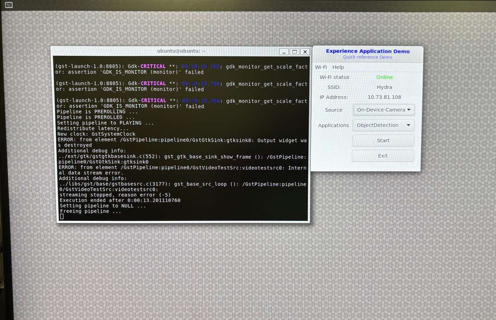

import Tabs from '@theme/Tabs';
import TabItem from '@theme/TabItem';

# 🧪 运行示例应用

本指南面向探索AI和多媒体功能的开发人员和工程师设计，概述了前提条件、设置步骤和故障排除提示，以确保顺利执行和最佳性能。
下面的每个标签页都提供了针对特定用例的详细说明。

<Tabs>
    <TabItem value="OOB Experience" label="开箱即用体验">
<Tabs>
<TabItem value="Prebuilt" label="预构建示例应用">
---
### 🎯 开发者目标
- 通过各种用例和设备功能获得**快速的开箱即用体验**  
- 在Ubuntu上使用**高Qualcomm® 智能多媒体产品(QIMP) SDK**运行**示例应用程序**  
---

### 👤 适用人群
- 探索多媒体功能的AI开发者和应用工程师。
---

### ✅ 前提条件
#### 在目标设备上
- **已刷入Ubuntu操作系统** 
- 具有适当权限的**终端访问**。
- **运行install_ppa_pkgs.sh脚本**以安装必要的软件包 

---

> 💡 **提示：** 在启动示例应用之前，确保您的系统满足所有前提条件。  
---
### 分步说明

### 步骤1：下载并运行工件脚本

此脚本将自动获取运行示例应用程序所需的所有组件，包括：
- 模型  
- 标签  
- 媒体文件

#### 📦 脚本详情
您可以在SSH终端/SBC终端上运行以下命令
```shell
cd /home/ubuntu 
curl -L -O https://raw.githubusercontent.com/quic/sample-apps-for-qualcomm-linux/refs/heads/main/download_artifacts.sh
sudo chmod +x download_artifacts.sh 
sudo ./download_artifacts.sh -v GA1.5-rel -c QCS6490
```
---
#### 📘 说明
- 使用`-v`参数定义您要使用的**版本**（例如，GA1.5-rel）。
- 使用`-c`参数定义您的设备使用的**芯片组**（例如，QCS6490）。

### 步骤2：验证模型/标签/媒体文件  
在启动任何示例应用程序之前，确保所需文件已就位。
#### ✅ 检查以下目录：
- **模型文件** → `/etc/models/`
- **标签文件** → `/etc/labels/`
- **媒体文件** → `/etc/media/`
> 📌 **注意：** 这些文件对于AI和多媒体应用程序的正常运行至关重要。如果缺失，请重新运行工件下载脚本。 
---

### 步骤3：示例应用程序 
##### 输入源 – 媒体文件；输出源 - Waylandsink
##### 模型精度 - 量化模型；运行时 - TFLite；使用的脚本 - JSON
####  对于多媒体示例应用程序，请确保已连摄像头（前提条件）


| 示例应用名称           |  详情   | AI Hub模型（默认）         |
|------------------------------|------------|--------------------------------|
| gst-ai-classification     |  [图像分类](https://docs.qualcomm.com/bundle/publicresource/topics/80-70020-50/gst-ai-classification.html)  | Inception_v3                   
| gst-ai-pose-detection     |  [姿态检测](https://docs.qualcomm.com/bundle/publicresource/topics/80-70020-50/gst-ai-pose-detection.html)  | hrnet_pose                
| gst-ai-segmentation       |  [图像分割](https://docs.qualcomm.com/bundle/publicresource/topics/80-70020-50/gst-ai-segmentation.html)  | Deeplabv3_plus_mobilenet 
| gst-ai-monodepth          |  [视频单目深度](https://docs.qualcomm.com/bundle/publicresource/topics/80-70020-50/mono-depth-from-video.html) | midas                   
| gst-ai-face-detection     |  [人脸检测](https://docs.qualcomm.com/bundle/publicresource/topics/80-70020-50/gst-ai-face-detection.html) | face_det_lite                
| gst-camera-single-stream-example     |  [单摄像头流](https://docs.qualcomm.com/bundle/publicresource/topics/80-70020-50/gst-camera-single-stream-example.html) | NA                
| gst-multi-camera-example    |  [多摄像头流](https://docs.qualcomm.com/bundle/publicresource/topics/80-70020-50/gst-multi-camera-stream-example.html) | NA         
| gst-activate-deactivate-streams-runtime-example     |  [在运行中激活-停用流](https://docs.qualcomm.com/bundle/publicresource/topics/80-70020-50/gst-activate-deactivate-streams-runtime.html) | NA                


使用SSH/SBC终端启动您的示例应用程序。
> 📌 **注意：** 如果终端是root用户，则需要设置以下环境。否则对于Ubuntu用户则不需要。
export XDG_RUNTIME_DIR=/run/user/$(id -u ubuntu)
#### 示例
```bash
gst-ai-classification
```
要显示可用的帮助选项，请在SSH shell中运行以下命令：
```bash
gst-ai-classification -h
```
### 步骤5: 
按**CTRL** + **C**停止用例。

---
### 参考文档：   
要进一步探索示例应用程序，请参阅高通智能多媒体SDK（IM SDK）参考指南。[高通智能多媒体SDK（IM SDK）参考](https://docs.qualcomm.com/bundle/publicresource/topics/80-70020-50/example-applications.html)  
---
</TabItem>

<TabItem value="QDemo" label="QDemo">
---
### 🎯 开发者目标
- 使用图形用户界面（GUI）应用程序运行多媒体和AI示例应用程序。
- 使用QDemo应用程序帮助，用户只需点击几下即可体验Ubuntu上的**高通智能多媒体产品(QIMP) SDK**。
---
### 👤 适用人群
- 探索多媒体功能的AI开发者和应用工程师。
---

### ✅ 前提条件
#### 在目标设备上
- **已刷入Ubuntu操作系统** 
- 具有适当权限的**终端访问**。
- **SBC模式** - 必须连接鼠标、键盘、HDMI显示器和HDMI线缆。 
- **运行install_ppa_pkgs.sh脚本**以安装必要的软件包。
-----
### 分步说明

### 步骤1: 

从SBC打开终端并安装以下软件包：  
#### 📦 脚本详情
```shell
sudo apt-get install libgstreamer1.0-dev gstreamer1.0-plugins-ugly gstreamer1.0-libav gstreamer1.0-alsa gstreamer1.0-gtk3
sudo apt-get install python3-gi-cairo gir1.2-gtk-3.0
# 更改media/labels/models的权限
sudo chmod 777 /etc/media
sudo chmod 777 /etc/labels
sudo chmod 777 /etc/models
sudo chmod 777 /etc/media/video.mp4
```
---
### 步骤2: 复制文件 
使用SSH复制Qdemo.png和Qdemo.gif  


运行以下命令将文件移动到/etc/media。
```shell
sudo mv Qdemo.* /etc/media
````

### 步骤3: 运行QDemo

在SBC终端上运行以下命令
```shell
gst-gui-launcher-app.py
```
 

### 步骤4: Wi-Fi设置
选择连接到Wi-Fi网络。

### 步骤5: 运行QDemo应用 
| 示例应用           |  详情              |
|---------------------- |---------------------- |
| Record live video     | 录制视频并保存最多30秒的视频。|
| DashCamera            | 多摄像头流 |
| VideoWall             | 对MP4 AVC（H.264）视频执行并发视频播放，并在视频墙显示上执行合成 |
| ObjectDetection       | 对象检测 |
| Parallel-AI-Fusion    | 并行推理 |

</TabItem>
</Tabs>
</TabItem>


<TabItem value="Recipes" label="操作示例">
<Tabs>
<TabItem value="Recipes" label="更新配置JSON以运行应用">
---
### 🎯 开发者目标
- 使用**高通智能多媒体产品(QIMP) SDK**在Ubuntu上配置和运行高级多媒体和AI示例应用程序。
- 使用JSON文件自定义管道，定义输入/输出源、运行时选项、精度和模型类型。
- 使用来自**AI Hub**的模型，评估CPU、GPU和DSP的性能，支持**TFLite、QNN和SNPE**等框架。
---

### 👤 适用人群
- 在AI、多媒体或嵌入式系统方面具有中级到高级经验的开发人员或工程师。
- 需要灵活调整应用配置，并在不同运行环境中优化性能的用户。
---

### ✅ 前提条件
#### 在目标设备上
- **已刷入Ubuntu操作系统** 
- 具有适当权限的**终端访问**。
- **运行install_ppa_pkgs.sh脚本**以安装必要的软件包
- **对JSON配置文件**和运行时环境变量有**基本了解**。
- **访问AI Hub**进行模型选择和导出。 [**创建AI Hub账户**](https://aihub.qualcomm.com/)
-----
### 分步说明

### 步骤1: 下载并运行脚本

此脚本将自动获取运行示例应用程序所需的所有软件包，包括：
- 模型  
- 标签  
- 媒体文件

#### 📦 脚本详情
```shell
cd /home/ubuntu 
curl -L -O https://raw.githubusercontent.com/quic/sample-apps-for-qualcomm-linux/refs/heads/main/download_artifacts.sh
sudo chmod +x download_artifacts.sh 
sudo ./download_artifacts.sh -v GA1.5-rel -c QCS6490
```
---
#### 📘 说明
- 使用`-v`参数定义您要使用的**版本**（例如，GA1.5-rel）。
- 使用`-c`参数定义您的设备使用的**芯片组**（例如，QCS6490）。

### 步骤2: 验证模型/标签/媒体文件  
在启动任何示例应用程序之前，确保所需文件已就位。
#### ✅ 检查以下目录：
- **模型文件** → `/etc/models/`
- **标签文件** → `/etc/labels/`
- **媒体文件** → `/etc/media/`
> 📌 **注意：** 这些文件对于AI和多媒体应用程序的正常运行至关重要。如果缺失，请重新运行工件下载脚本。 
---

### 步骤3: 更新JSON配置文件  
要使用特定功能运行示例应用程序，需要正确配置JSON文件。  
#### 🔍 需要做什么
- 根据您的**模型**和**配置要求**更新所需的JSON配置文件。
- 编辑例如` - /etc/configs/config_classification.json`的文件以匹配您的用例：
#### 🔧 配置参数
<details>

使用以下关键参数更新您的JSON配置文件：
- **输入源**  
  - 摄像头  
  - 文件（Filesrc）  
  - RTSP流  
- **输出源**  
  - Waylandsink  
  - Filesink  
  - RTSP流  
- **运行时选项**  
  - CPU  
  - GPU  
  - DSP  
- **精度**  
  - INT8 / INT16  
  - W8A8 / W8A16  
  - FP32  
- **模型类型**  
  - 从**AI Hub**中选择可用的模型
</details>

### 📊 示例应用程序配置矩阵
| 示例应用名称                        | 详情   | AI Hub模型类型                                                                                                      | 运行时       | 使用的脚本                                                                 |
|----------------------------------------|-----------|------------------------------------------------------------------------------------------------------------------------|---------------|--------------------------------------------------------------------------------|
| gst-ai-classification                  | [图像分类](https://docs.qualcomm.com/bundle/publicresource/topics/80-70020-50/gst-ai-classification.html)    | MobileNet-v2, ResNet101, GoogLeNet, MobileNet-v3-Large, ResNet18, ResNeXt50, ResNeXt101, SqueezeNet, WideResNet50, Shufflenet | CPU, GPU, DSP | [更新JSON](https://git.codelinaro.org/clo/le/platform/vendor/qcom-opensource/gst-plugins-qti-oss/-/blob/imsdk.lnx.2.0.0.r2-rel/gst-sample-apps/gst-ai-classification/config_classification.json?ref_type=heads)    |
| gst-ai-object-detection                | [对象检测](https://docs.qualcomm.com/bundle/publicresource/topics/80-70020-50/gst-ai-object-detection.html)  | Yolox, Yolov7, Yolov8-Detection (手动导出)                                                                       | CPU, GPU, DSP  | 从AI Hub导出模型；为Yolox/Yolov7更新脚本 – [更新JSON](https://git.codelinaro.org/clo/le/platform/vendor/qcom-opensource/gst-plugins-qti-oss/-/blob/imsdk.lnx.2.0.0.r2-rel/gst-sample-apps/gst-ai-classification/config_classification.json?ref_type=heads)      |
| gst-ai-pose-detection                  | [姿态检测](https://docs.qualcomm.com/bundle/publicresource/topics/80-70020-50/gst-ai-pose-detection.html)  | hrnet_pose                                                                                                                | CPU, GPU, DSP  | TFLite默认工作；更新脚本以设置精度/运行时 – [更新JSON](https://git.codelinaro.org/clo/le/platform/vendor/qcom-opensource/gst-plugins-qti-oss/-/blob/imsdk.lnx.2.0.0.r2-rel/gst-sample-apps/gst-ai-classification/config_classification.json?ref_type=heads)   |
| gst-ai-segmentation                    | [图像分割](https://docs.qualcomm.com/bundle/publicresource/topics/80-70020-50/gst-ai-segmentation.html)      | FFNet-40S, FFNet-54S, FFNet-78S                                                                                     | CPU, GPU, DSP  | [更新JSON](https://git.codelinaro.org/clo/le/platform/vendor/qcom-opensource/gst-plugins-qti-oss/-/blob/imsdk.lnx.2.0.0.r2-rel/gst-sample-apps/gst-ai-classification/config_classification.json?ref_type=heads)                                                 |
| gst-ai-superresolution                 | [视频超分辨率](https://docs.qualcomm.com/bundle/publicresource/topics/80-70020-50/video-super-resolution.html)       | quicksrnetsmall, QuickSRNetMedium, QuickSRNetLarge, XLSR                                                    | CPU, GPU, DSP  | [更新JSON](https://git.codelinaro.org/clo/le/platform/vendor/qcom-opensource/gst-plugins-qti-oss/-/blob/imsdk.lnx.2.0.0.r2-rel/gst-sample-apps/gst-ai-classification/config_classification.json?ref_type=heads)                                                    |
| gst-ai-multistream-batch-inference     | [多流批量推理](https://docs.qualcomm.com/bundle/publicresource/topics/80-70020-50/multistream-batch-inference.html)        | YoloV8-Detection (batch 4), DeeplabV3 (batch 4)                                                  | CPU, GPU, DSP  | 从AI Hub导出模型；更新脚本 – [更新JSON](https://git.codelinaro.org/clo/le/platform/vendor/qcom-opensource/gst-plugins-qti-oss/-/blob/imsdk.lnx.2.0.0.r2-rel/gst-sample-apps/gst-ai-classification/config_classification.json?ref_type=heads)                         |
| gst-ai-face-detection                  | [人脸检测](https://docs.qualcomm.com/bundle/publicresource/topics/80-70020-50/gst-ai-face-detection.html)      | face_det_lite                                                                                                         | CPU, GPU, DSP  |  [更新JSON](https://git.codelinaro.org/clo/le/platform/vendor/qcom-opensource/gst-plugins-qti-oss/-/blob/imsdk.lnx.2.0.0.r2-rel/gst-sample-apps/gst-ai-classification/config_classification.json?ref_type=heads)                                                   |
| gst-ai-face-recognition                | [人脸识别](https://docs.qualcomm.com/bundle/publicresource/topics/80-70020-50/gst-ai-face-recognition.html)      | face_det_lite, face_attrib_net, facemap_3dmm                                                                      | CPU, GPU, DSP  | 需要人脸注册；否则输出为"识别到未知人脸"    |
| gst-ai-metadata-parser-example         | [元数据解析](https://docs.qualcomm.com/bundle/publicresource/topics/80-70020-50/gst-ai-metadata-parser.html)         | Yolov8-Detection                                                                                                | CPU, GPU, DSP  | 从AI Hub导出模型                                                      |
| gst-ai-usb-camera-app                  | [AI USB摄像头](https://docs.qualcomm.com/bundle/publicresource/topics/80-70020-50/gst-ai-metadata-parser.html)         | Yolov8-Detection                                                                                                   | CPU, GPU, DSP  | 从AI Hub导出模型                                                      |
| gst-ai-parallel-inference              | [并行推理](https://docs.qualcomm.com/bundle/publicresource/topics/80-70020-50/gst-ai-parallel-inference.html)          | Yolov8-Detection, Deeplab, Hrnet, Inceptionv3                                                           | CPU, GPU, DSP  | 从AI Hub导出模型；为其他模型[更新JSON](https://git.codelinaro.org/clo/le/platform/vendor/qcom-opensource/gst-plugins-qti-oss/-/blob/imsdk.lnx.2.0.0.r2-rel/gst-sample-apps/gst-ai-classification/config_classification.json?ref_type=heads)                        |
| gst-ai-daisychain-detection-classification |[菊花链检测和分类](https://docs.qualcomm.com/bundle/publicresource/topics/80-70020-50/daisy-chain-detection-and-classification.html)        | Inceptionv3 + YoloV8                                                | CPU, GPU, DSP  | 从AI Hub导出模型；为其他模型[更新JSON](https://git.codelinaro.org/clo/le/platform/vendor/qcom-opensource/gst-plugins-qti-oss/-/blob/imsdk.lnx.2.0.0.r2-rel/gst-sample-apps/gst-ai-classification/config_classification.json?ref_type=heads)                        |
| gst-ai-audio-classification |[音频分类](https://docs.qualcomm.com/bundle/publicresource/topics/80-70020-50/audio-classification.html)        | Inceptionv3 + YoloV8                                                                                                       | CPU, GPU, DSP  | 从AI Hub导出模型；为其他模型[更新JSON](https://git.codelinaro.org/clo/le/platform/vendor/qcom-opensource/gst-plugins-qti-oss/-/blob/imsdk.lnx.2.0.0.r2-rel/gst-sample-apps/gst-ai-classification/config_classification.json?ref_type=heads)                        |
| gst-ai-smartcodec-example  |[AI智能codec](https://docs.qualcomm.com/bundle/publicresource/topics/80-70020-50/ai-smart-codec.html)       | Inceptionv3 + YoloV8                                                                                                                    | CPU, GPU, DSP  | 从AI Hub导出模型；为其他模型[更新JSON](https://git.codelinaro.org/clo/le/platform/vendor/qcom-opensource/gst-plugins-qti-oss/-/blob/imsdk.lnx.2.0.0.r2-rel/gst-sample-apps/gst-ai-classification/config_classification.json?ref_type=heads)                        |
| setup_hw_benchmarking_app |[硬件基准测试应用程序](https://docs.qualcomm.com/bundle/publicresource/topics/80-70020-50/vision_ai_demo_app.html)        | Inceptionv3,fcn_resnet50,hrnet_pose,midas.yolox                                                                   | CPU, GPU, DSP  | 从AI Hub导出模型；为其他模型[更新JSON](https://git.codelinaro.org/clo/le/platform/vendor/qcom-opensource/gst-plugins-qti-oss/-/blob/imsdk.lnx.2.0.0.r2-rel/gst-sample-apps/gst-ai-classification/config_classification.json?ref_type=heads)                        |


使用SSH/SBC终端启动您的示例应用程序。
> 📌 **注意：** 如果终端是root用户，则需要设置以下环境。否则对于ubuntu用户则不需要。
export XDG_RUNTIME_DIR=/run/user/$(id -u ubuntu) 
#### 示例
```bash
gst-ai-classification
```
要显示可用的帮助选项，请在SSH shell中运行以下命令：
```bash
gst-ai-classification -h
```
### 步骤4: 
按下**CTRL** + **C**停止用例。

---
### 参考文档：
要进一步探索示例应用程序，请参阅高通智能多媒体SDK（IM SDK）参考指南。 [高通智能多媒体SDK（IM SDK）参考](https://docs.qualcomm.com/bundle/publicresource/topics/80-70020-50/example-applications.html)  
---
</TabItem>

<TabItem value="LiteRT" label="LiteRT应用">
---
### 🎯 开发者目标
- 使用**LiteRT运行时**在Ubuntu上运行从AI Hub下载的模型。
- 使用量化的TFLite模型比较**CPU和NPU（通过QNN代理）**的推理性能。
---

### 👤 适用人群
- 在AI模型部署、边缘计算或嵌入式系统方面具有中级经验的开发人员或工程师。
- 对评估硬件加速（NPU与CPU）和优化边缘设备推理流程感兴趣的用户。
---

### ✅ 前提条件
#### 在目标设备上
- **已刷入Ubuntu操作系统** 
- 具有适当权限的**终端访问**。
- **运行install_ppa_pkgs.sh脚本**以安装必要的软件包
- **访问AI Hub**进行模型选择和导出。 [**创建AI Hub账户**](https://aihub.qualcomm.com/)
-----
### 分步说明
### 步骤1: 安装软件包
安装以下软件包以运行LiteRT示例应用程序。
```shell
sudo apt install python3-gi python3-gi-cairo gir1.2-gtk-3.0
sudo apt install python3-venv python3-full
python3 -m venv .venv-litert-demo
source .venv-litert-demo/bin/activate
pip3 install ai-edge-litert==1.3.0 Pillow
pip3 install opencv-python
sudo apt install -y pkg-config cmake libcairo2-dev
sudo apt install libgirepository1.0-dev gir1.2-glib-2.0
sudo apt install build-essential python3-dev python3-pip pkg-config meson
```
### 步骤2: 运行LiteRT应用  
请参考此链接，在终端中运行 Vision Transformer，并在图形界面（GUI）中进行图像分类。 
(**链接待添加**)
</TabItem>

<TabItem value="OpenCL" label="OpenCL应用">
---
### 🎯 开发者目标
- 在Ubuntu桌面上使用Edge Impulse运行OpenCL应用程序来训练您的模型。
---

### 👤 适用人群
- 在AI模型部署、边缘计算或嵌入式系统方面具有中级经验的开发人员或工程师。
---

### ✅ 前提条件
#### 在目标设备上
- **已刷入Ubuntu操作系统** 
- 具有适当权限的**终端访问**
- **运行install_ppa_pkgs.sh脚本**以安装必要的软件包
-----
### 分步说明
### 步骤1: 从服务器版本转到桌面版本
运行以下命令从服务器版本转到SBC的桌面版本
```shell
sudo apt install qcom-adreno1- libgbm-msm1- libegl-mesa0 libegl1 libgles2 libglvnd0 libvulkan1
sudo apt install ubuntu-desktop
sudo reboot
```
### 步骤2: 安装软件包
运行命令安装所需的软件包  
```shell
sudo apt-get install qcom-adreno-cl1
sudo apt install clinfo
```
### 步骤3: 运行OpenCL应用程序
（步骤待补充）
</TabItem>
</Tabs>
</TabItem>
    <TabItem value="Compile" label="在目标设备上编译现有应用">
---
### 🎯 开发者目标
- 为开发人员提供一个平台，以根据用户需求**修改现有示例应用**。 
- 在Ubuntu上使用**高通智能多媒体产品(QIMP) SDK**运行**示例应用程序**。
---

### 👤 适用人群
- 在AI、多媒体或嵌入式系统方面具有高级经验的开发人员或工程师。
- 需要灵活调整应用配置，并在不同运行环境中优化性能的用户。
---
### ✅ 前提条件
#### 在目标设备上
- **已刷入Ubuntu操作系统** 
- 具有适当权限的**终端访问**。
- **运行install_ppa_pkgs.sh脚本**以安装必要的软件包
-----
### 分步说明

### 步骤1: 配置Ubuntu软件包管理器下载源代码
安装以下软件包下载源代码。 
```shell
sudo apt-get install adreno-dev
sudo apt-get install gstreamer1.0-qcom-sample-apps-utils-dev
```
### 步骤2: 构建依赖项
运行命令获取源代码编译所需的插件
```shell
sudo apt build-dep gst-plugins-qti-oss
```
### 步骤3: 下载源代码
下载GA1.5示例应用程序源代码
```shell
cd /home/ubuntu
git clone https://git.codelinaro.org/clo/le/platform/vendor/qcom-opensource/gst-plugins-qti-oss.git -b imsdk.lnx.2.0.0.r2-rel
git checkout 3982836c1733c709d3a1dbe6a7f7caf033a08301
```
### 步骤4: 编译示例应用工具
编译示例应用工具来获取最新的头文件。
```shell
cd gst-plugins-qti-oss/gst-sample-apps/gst-sample-apps-utils
mkdir build; cd build
cmake \
   -DGST_VERSION_REQUIRED=1.20.1 \
   -DSYSROOT_INCDIR=/usr/include \
   -DSYSROOT_LIBDIR=/usr/lib \
   -DGST_PLUGINS_QTI_OSS_INSTALL_BINDIR=/usr/bin \
   -DGST_PLUGINS_QTI_OSS_INSTALL_CONFIG=/etc/configs \
   -DENABLE_CAMERA=TRUE \
   -DENABLE_VIDEO_ENCODE=TRUE \
   -DENABLE_VIDEO_DECODE=TRUE \
   -DENABLE_DISPLAY=TRUE \
   -DENABLE_ML=TRUE \
   -DENABLE_AUDIO=TRUE \
   -DCAMERA_SERVICE=LECAM \
   -DGST_PLUGINS_QTI_OSS_INSTALL_INCDIR=/usr/include \
   ..
make
make install
```
### 步骤5: 编译示例应用源代码
根据您的需求修改示例应用，并运行以下命令进行编译。
```shell
cd gst-plugins-qti-oss/gst-sample-apps/gst-ai-object-detection
mkdir build; cd build
cmake \
   -DGST_VERSION_REQUIRED=1.20.1 \
   -DSYSROOT_INCDIR=/usr/include \
   -DSYSROOT_LIBDIR=/usr/lib \
   -DGST_PLUGINS_QTI_OSS_INSTALL_BINDIR=/usr/bin \
   -DGST_PLUGINS_QTI_OSS_INSTALL_CONFIG=/etc/configs \
   -DENABLE_CAMERA=TRUE \
   -DENABLE_VIDEO_ENCODE=TRUE \
   -DENABLE_VIDEO_DECODE=TRUE \
   -DENABLE_DISPLAY=TRUE \
   -DENABLE_ML=TRUE \
   -DENABLE_AUDIO=TRUE \
   -DCAMERA_SERVICE=LECAM \
   -DGST_PLUGINS_QTI_OSS_INSTALL_INCDIR=/usr/include \
   ..
make
make install
```

> 📌 **注意：** 每个示例应用都需要单独编译。
---

### 步骤6: 运行编译好的示例应用
#### 示例
```bash
gst-ai-object-detection
```
要显示可用的帮助选项，请在SSH shell中运行以下命令：
```bash
gst-ai-object-detection -h
```
### 步骤7: 
按下**CTRL** + **C**停止用例。

### 参考文档：
[AI开发者工作流程 - Ubuntu on Qualcomm® IoT Platforms Documentation](https://docs.qualcomm.com/bundle/publicresource/topics/80-90441-15/compile-qim-sample-app.html?product=1601111740057201&facet=AI%20developer%20workflow)
</TabItem>
</Tabs>