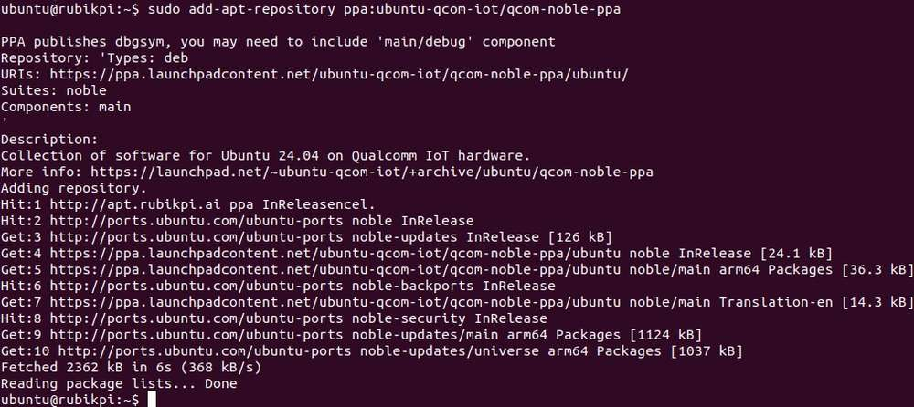
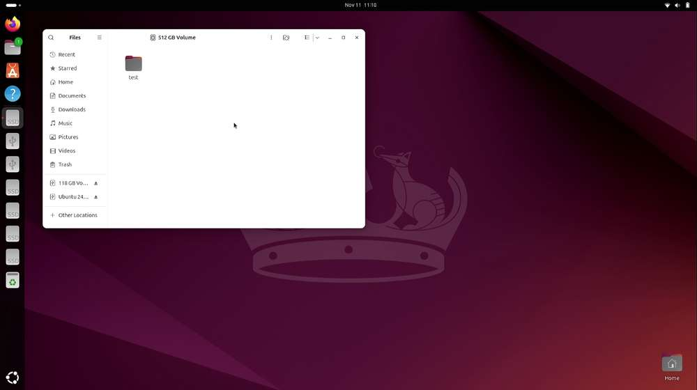

---
# Display h2 to h5 headings
toc_min_heading_level: 2
toc_max_heading_level: 4
---

# 外设与接口

## 硬件资源图


| 序号 | 接口                           | 序号 | 接口                         |
|------|--------------------------------|------|------------------------------|
| 1    | RTC 电池接口                   | 10   | Type-C 电源接口              |
| 2    | Micro USB (UART 调试)          | 11   | PWR 按键                     |
| 3    | TurboX C6490P SOM              | 12   | EDL 按键                     |
| 4    | 3.5mm 耳机接口                 | 13   | 摄像头接口 2                 |
| 5    | USB Type-C with DP (USB 3.1)   | 14   | 摄像头接口 1                 |
| 6    | USB Type-A (USB 2.0)           | 15   | Wi-Fi/蓝牙模块               |
| 7    | 2 x USB Type-A (USB 3.0)       | 16   | 风扇接口                     |
| 8    | 1000M 以太网                   | 17   | 40-pin 连接器                |
| 9    | HDMI OUT                       | 18   | M.2 Key M 接口               |

## 40 pin 连接器

### GPIO

RUBIK Pi 3 适配了 WiringRP（基于高性能 GPIO 编程库 WiringPi），推荐使用 WiringRP 来控制 GPIO，和对 GPIO 编程。关于 WiringRP 详细信息可访问 https://github.com/rubikpi-ai/WiringRP 查看。

#### 引脚分布

下图是 RUBIK Pi 3 40-pin 连接器的引脚默认功能，其中大部分引脚和树梅派 40-pin 连接器引脚的默认功能兼容。


下表是 40-pin连接器支持的所有功能，图中蓝色字体表明默认功能。


#### 使用 shell 命令控制

在 RUBIK Pi 3 中执行下面的步骤控制 GPIO。

:::note
下面命令需要使用 root 权限：
>
> * 执行 `sudo passwd root` 命令根据提示修改 root 帐号密码，使用 `su root` 命令切换到 root 用户。
>
> * 或在普通用户下，在命令前加入 `sudo` ，如 `sudo gpio readall`，根据提示输入用户的登录密码。
:::

* 使用 WiringRP 相关命令
    :::note
    >
    > 1. 需将 `deb http://apt.rubikpi.ai ppa main` 追加到 */etc/apt/sources.list* 文件中。
    > 2. 执行 `apt update` 命令更新软件源。
    > 3. 执行 `apt install wiringrp` 命令安装 WiringRP.
    :::

  * 查看 GPIO 状态

    ```shell
    gpio readall
    ```

  


  * 设置 GPIO 模式

    ```shell
    gpio mode 15 in             # 将15号引脚模式置为输入
    gpio pins                   # 查看更改之后的状态
    gpio mode 15 out            # 将15号引脚模式置为输出
    gpio pins                   # 查看更改之后的状态
    ```

  * 设置引脚电平

    ```shell
    gpio write 15 1             # 将15号引脚置为高电平
    gpio read 15                # 读取更改后引脚状态
    gpio write 15 0             # 将15号引脚置为低电平
    gpio read 15                # 读取更改后引脚状态
    ```

* 操作 */sys/class/gpio* 下相关节点

  GPIO 子系统的编号如下表。


- 进入 */sys/class/gpio* 目录：

```
cd /sys/class/gpio
```

- 将要控制的 GPIO 导出，如控制 13 号引脚 GPIO_24：
```
echo 571 > export
```

- 进入到 gpio571 目录设置 GPIO 属性：

```
cd gpio571
ls
```


  - direction（方向）：

      - 输入：in
      - 输出：out

  - value（值）：
      - 低电平：0
      - 高电平：1
  - edge （中断边沿）：
      - 上升沿触发：rising
      - 下降沿触发：falling
      - 双边沿触发：both
      - 禁用中断：none

    如设置 13 号引脚输出高电平：

    ```
    echo out > direction
    echo 1 > value
    ```
    取消导出 13 号引脚到用户空间：

    ```
    echo 571 > unexport
    ```

#### 使用 WiringRP (C) 控制
:::note
>
> 1. 需将 `deb http://apt.rubikpi.ai ppa main` 追加到 */etc/apt/sources.list* 文件中。
> 2. 执行 `apt update` 命令更新软件源。
> 3. 执行 `apt install wiringrp` 命令安装 WiringRP.
:::

WiringRP 库中提供了一系列的 API 函数，用更少的逻辑实现控制。

* 以下代码示例，代码将 13 号引脚设置为输出， 15 号引脚设置为输入，循环检测 15 号引脚的电平状态：

```c
#include <stdio.h>
#include <wiringPi.h>

int main (void)
{
  wiringPiSetup () ;
  pinMode (13, OUTPUT) ;
  pinMode (15, INPUT) ;

  for (;;)
  {
    digitalWrite (13, HIGH) ;        // On
    printf("%d\n", digitalRead (15));        // On
    delay (1000) ;                // mS
    digitalWrite (13, LOW) ;        // Off
    printf("%d\n", digitalRead (15));        // On
    delay (1900) ;
  }

  return 0 ;
}
```

* 编译程序

  * 在 RUBIK Pi 3 中编译

  ```shell
  scp 192.168.1.100@ubuntu ./gpio.c /opt  # IP 和用户名需根据情况修改
  adb shell
  su
  cd /opt
  gcc gpio.c -o gpio -lwiringPi
  ```

   :::note
   若无 gcc 命令，可执行 `apt install gcc` 命令进行安装。
   :::

* 将 13 和 15 号引脚使用杜邦线短接，测试 GPIO 电平控制和电平读取情况，如下图所示：

  :::warning
  >
  > 注意引脚顺序，请勿将电源和地引脚短接，否则可能会造成板子损坏。
  :::

  

  运行如下命令：

  ```shell
  cd /opt
  ./gpio
  ```

  程序运行结果如下：

   

#### 使用 WiringRP-Python 控制
:::note
>
> 1. 需将 `deb http://apt.rubikpi.ai ppa main` 追加到 */etc/apt/sources.list* 文件中。
> 2. 执行 `apt update` 命令更新软件源。
> 3. 执行 `apt install wiringrp-python` 命令安装 WiringRP-Python.
:::

WiringRP 库中提供了一系列的 API 函数，用更少的逻辑实现控制。

* 下方截取代码是使用 WiringRP 库操作 GPIO 的示例，其中将 13 号引脚设置为输出，15 号引脚设置为输入，循环检测 15 号引脚的电平状态。

  ```python
  import wiringpi
  import time

  wiringpi.wiringPiSetup()
  wiringpi.pinMode(13, 1)
  wiringpi.pinMode(15, 0)
  wiringpi.digitalRead(15)

  while True:
      wiringpi.digitalWrite(13,1)
      pin_level = wiringpi.digitalRead(15)
      print(f"in_gpio level: {pin_level}")

      time.sleep(1)

      wiringpi.digitalWrite(13,0)
      pin_level = wiringpi.digitalRead(15)
      print(f"in_gpio level: {pin_level}")

      time.sleep(1)
  ```

* 将 *gpio.py&#x20;*&#x4F20;输到 RUBIK Pi 3 中，如使用 SCP 传输。

  ```shell
  scp 192.168.1.100@ubuntu ./gpio.py /opt  # IP 和用户名需根据情况修改
  ```

* 将 13 和 15 号引脚使用杜邦线短接，测试 GPIO 电平控制和电平读取情况，如下图所示

  :::warning
  >
  > 注意引脚顺序，请勿将电源和地引脚短接，否则可能会造成板子损坏。
  :::

  

  运行如下命令：

  ```shell
  cd /opt
  python3 gpio.py
  ```

  程序运行结果如下：

   


#### 使用 Python 程序控制

* 可使用 Python 的 periphery 库控制 GPIO，可在 RUBIK Pi 3 中使用下面命令进行安装：

  ```shell
  apt install python3-periphery
  ```

* 下方截取代码是使用 periphery 库操作 GPIO 的示例，其中将 13 号引脚设置为输出，15 号引脚设置为输入，循环检测 15 号引脚的电平状态。

  ```python
  from periphery import GPIO
  import time

  out_gpio = GPIO(571, "out")
  in_gpio = GPIO(572, "in")

  try:
      while True:
          try:
              out_gpio.write(True)
              pin_level = in_gpio.read()
              print(f"in_gpio level: {pin_level}")

              out_gpio.write(False)
              pin_level = in_gpio.read()
              print(f"in_gpio level: {pin_level}")

              time.sleep(1)

          except KeyboardInterrupt:
              out_gpio.write(False)
              break

  except IOError:
      print("Error")

  finally:
      out_gpio.close()
      in_gpio.close()
  ```

* 将 *gpio.py&#x20;*&#x4F20;输到 RUBIK Pi 3 中，如使用 SCP 传输。

  ```shell
  scp 192.168.1.100@ubuntu ./gpio.py /opt  # IP 和用户名需根据情况修改
  ```

* 将 13 和 15 号引脚使用杜邦线短接测试 GPIO 电平控制和电平读取情况，如下图所示：

  :::warning
  >
  > 注意引脚顺序，请勿将电源和地引脚短接，否则可能会造成板子损坏。
  :::

  

  运行如下命令：

  ```shell
  cd /opt
  python3 gpio.py
  ```

  程序运行结果如下：

   


#### 使用 C 语言程序控制

* 以下代码示例，代码将 13 号引脚设置为输出， 15 号引脚设置为输入，循环检测 15 号引脚的电平状态：

  ```c
  #include <stdio.h>
  #include <stdlib.h>
  #include <unistd.h>

  int out_gpio = 571;
  int in_gpio = 572;

  int main() {
      char export_path[50] = {};
      char export_command[100] = {};
      snprintf(export_path, sizeof(export_path), "/sys/class/gpio/export");
      snprintf(export_command, sizeof(export_command), "echo %d > %s ", out_gpio, export_path);
      system(export_command);
      snprintf(export_command, sizeof(export_command), "echo %d > %s ", in_gpio, export_path);
      system(export_command);

      char direction_path[50] = {};
      snprintf(direction_path, sizeof(direction_path), "/sys/class/gpio/gpio%d/direction", out_gpio);
      FILE *direction_file = fopen(direction_path, "w");
      if (direction_file == NULL) {
          perror("Failed to open GPIO direction file");
          return -1;
      }
      fprintf(direction_file, "out");
      fclose(direction_file);

      snprintf(direction_path, sizeof(direction_path), "/sys/class/gpio/gpio%d/direction", in_gpio);
      direction_file = fopen(direction_path, "w");
      if (direction_file == NULL) {
          perror("Failed to open GPIO direction file");
          return -1;
      }
      fprintf(direction_file, "in");
      fclose(direction_file);

      char value_in_path[50] = {};
      char value_out_path[50] = {};
      char cat_command[100] = {};
      snprintf(value_out_path, sizeof(value_out_path), "/sys/class/gpio/gpio%d/value", out_gpio);
      snprintf(value_in_path, sizeof(value_in_path), "/sys/class/gpio/gpio%d/value", in_gpio);
      snprintf(cat_command, sizeof(cat_command), "cat %s", value_in_path);

      FILE *value_out_file = fopen(value_out_path, "w");
      if (value_out_file == NULL) {
          perror("Failed to open GPIO value file");
          return -1;
      }

      for (int i = 0; i < 5; i++) {
          fprintf(value_out_file, "1");
          fflush(value_out_file);

          system(cat_command);
          sleep(1);

          fprintf(value_out_file, "0");
          fflush(value_out_file);

          system(cat_command);
          sleep(1);
      }

      fclose(value_out_file);

      char unexport_path[50] = {};
      char unexport_command[100] = {};
      snprintf(unexport_path, sizeof(unexport_path), "/sys/class/gpio/unexport");
      snprintf(unexport_command, sizeof(unexport_command), "echo %d > %s ", out_gpio, unexport_path);
      system(unexport_command);
      snprintf(unexport_command, sizeof(unexport_command), "echo %d > %s ", in_gpio, unexport_path);
      system(unexport_command);

      return 0;
  }

  ```

* 编译程序：

  * 交叉编译。

    ```shell
    aarch64-qcom-linux-gcc gpio.c -o gpio --sysroot=/home/zhy/qcom_sdk_meta/sysroots/armv8-2a-qcom-linux/
    ```

  * 在 RUBIK Pi 3 中编译：

    ```shell
    scp 192.168.1.100@ubuntu ./gpio.c /opt  # IP 和用户名需根据情况修改
    adb shell
    su
    cd /opt
    gcc gpio.c -o gpio
    ```

    :::note
    若无 gcc 命令，可执行 `apt install gcc` 命令进行安装。
    :::

    若使用了交叉编译，需将 gpio 传输到 RUBIK Pi 3 中，如使用 ADB 传输：

    ```shell
    adb push gpio /opt
    ```

* 将 13 和 15 号引脚使用杜邦线短接，测试 GPIO 电平控制和电平读取情况，如下图所示：

  :::warning
  >
  > 注意引脚顺序，请勿将电源和地引脚短接，否则可能会造成板子损坏。
  :::

  

  运行如下命令：

  ```shell
  cd /opt
  ./gpio
  ```

  程序运行结果如下：

  


### I2C

I2C 是飞利浦公司在 20 世纪 80 年代开发的一种双向 2 线制总线，用于实现高效的 IC 间控制总线。总线上的每个设备都有其唯一的地址（由飞利浦公司领导的 I2C 总机构注册）。I2C 核心支持多控制器模式，以及 10 位目标地址和 10 位可扩展地址。关于 I2C 的更多信息，请参阅 https://www.i2c-bus.org/fileadmin/ftp/i2c_bus_specification_1995.pdf


RUBIK Pi 3 适配了 WiringRP（基于高性能 GPIO 编程库 WiringPi ） ，推荐使用 WiringRP 来控制 I2C，和对 I2C 编程。关于 WiringRP 详细信息可访问 https://github.com/rubikpi-ai/WiringRP 查看。

#### 引脚分布

下图是 RUBIK Pi 3 40-pin 连接器的引脚默认功能，其中大部分引脚和树梅派 40-pin 连接器引脚的默认功能兼容。


:::note
>
> 3 号引脚和 5 号引脚默认已设置配为 I2C1。
:::

下表是 40-pin 连接器支持的所有功能，图中蓝色字体表明默认功能。


#### 使用 shell 命令测试

在 RUBIK Pi 3 中执行下面步骤控制 I2C 总线。

* 使用 WiringRP 相关命令：

  ```shell
  ./gpio -x ads1115:100:10 aread 100     #通过 I2C 总线读取 ADS1115 设备的模拟信号值
  ```

* 使用 i2cdetect 工具

  * 查看 I2C1 接口上的设备：

    ```shell
    i2cdetect -a -y -r 1
    ```

  * 读取地址为 0x38 设备的全部寄存器：

    ```shell
    i2cdump -f -y 1 0x38
    ```

  * 向地址为 0x38 设备的 0x01 寄存器地址写入 0xaa：

    ```shell
    i2cset -f -y 1 0x38 0x01 0xaa
    ```

  * 读取地址为 0x38 的设备，寄存器地址为0x01处的数值：

    ```shell
    i2cget -f -y 1 0x38 0x01
    ```

:::note
若无 `i2cdetect` 等命令，可执行 `apt install i2c-tools` 命令进行安装。
:::

#### 使用 WiringRP (C) I2C 通信

:::note
>
> 1. 需将 `deb http://apt.rubikpi.ai ppa main` 追加到 */etc/apt/sources.list* 文件中。
> 2. 执行 `apt update` 命令更新软件源。
> 3. 执行 `apt install wiringrp` 命令安装 WiringRP.
:::

WiringRP 库中提供了一系列的 API函数，用更少的逻辑实现控制。

* 以下代码示例，I2C1总线和地址为0x38的设备进行通信，向设备0x01地址处写入0xaa：

  ```c
  #include <wiringPi.h>
  #include <wiringPiI2C.h>
  #include <stdio.h>
  #include <stdlib.h>
  #include <unistd.h>

  #define I2C_ADDRESS 0x38

  int main(void)
  {
      int fd;

      if (wiringPiSetup() == -1) {
          exit(1);
      }

      fd = wiringPiI2CSetup(1, I2C_ADDRESS);
      if (fd == -1) {
          exit(1);
      }

      unsigned char data[2];
      if (read(fd, data, 2) != 2) {
          exit(1);
      }

      wiringPiI2CWriteReg8(fd, 0x01, 0xaa) ;

      close(fd);
      return 0;
  }


  ```

* 编译程序

  * 在 RUBIK Pi 3 中编译

    ```shell
    adb push gpio.c /opt
    adb shell
    su
    cd /opt
    gcc i2c.c -o i2c -lwiringPi
    ```

     :::note
     若无 gcc 命令，可执行 `apt install gcc` 命令进行安装。
     :::

* 将 3 和 5 号引脚连接 I2C 传感器，验证 I2C 总线通信，如下图所示

  :::warning
  >
  > 注意引脚顺序，请勿将电源和地引脚短接，否则可能会造成板子损坏。
  :::

  

  运行如下命令运行程序：

  ```shell
  cd /opt
  ./i2c
  ```

#### 使用 WiringRP-Python I2C 通信

:::note
>
> 1. 需将 `deb http://apt.rubikpi.ai ppa main` 追加到 */etc/apt/sources.list* 文件中。
> 2. 执行 `apt update` 命令更新软件源。
> 3. 执行 `apt install wiringrp-python` 命令安装 WiringRP-Python.
:::

WiringRP 库中提供了一系列的 API 函数，用更少的逻辑实现控制。

* 以下代码示例，使用 I2C1 总线和地址为 0x38 的设备进行通信，向设备 0x01 地址处写入 0xaa：

  ```bash
  import wiringpi as wpi

  wpi.wiringPiSetup()
  fd=wpi.wiringPiI2CSetup(0x38, 1)
  wpi.wiringPiI2CWriteReg8 (fd, 0x01, 0xaa)

  ```

* &#x5C06;*&#x20;i2c.py&#x20;*&#x4F20;输到 RUBIK Pi 3 中，如使用 ADB 传输。

  ```shell
  adb push i2c.py /opt
  ```

* 将 3 和 5 号引脚连接 I2C 传感器，验证 I2C 总线通信，如下图所示：

  :::warning
  >
  > 注意引脚顺序，请勿将电源和地引脚短接，否则可能会造成板子损坏。
  :::

  

  运行如下命令：

  ```shell
  cd /opt
  python3 i2c.py 
  ```

#### 使用 Python 程序 I2C 通信

* 可使用 Python 的 smbus 库控制 I2C，可在 RUBIK Pi 3 中使用下面命令进行安装：

  ```shell
  apt install python3-smbus
  ```

* 以下代码示例，使用 I2C1 总线和地址为 0x38 的设备进行通信，向设备 0x01 地址处写入 0xaa：

  ```python
  import smbus

  def main():
      data = [0x01, 0xaa]

      try:
          i2c_bus = smbus.SMBus(1)

          print("i2cdetect addr : ", end="")
          for address in range(0x7F):
              try:
                  i2c_bus.write_i2c_block_data(address, 0, data)
                  print("0x{:02X},".format(address), end="")
              except OSError:
                  pass

          print()

      except Exception as e:
          print(f"An error occurred: {e}")

      finally:
          if i2c_bus:
              i2c_bus.close()

  if __name__ == "__main__":
      main()

  ```

* 将 *i2c.py&#x20;*&#x4F20;输到 RUBIK Pi 3中，如果使用 ADB 传输，命令如下：

  ```shell
  adb push i2c.py /opt
  ```

* 将 3 和 5 号引脚连接 I2C 传感器，验证 I2C 总线通信，如下图所示：

  :::warning
  >
  > 注意引脚顺序，请勿将电源和地引脚短接，否则可能会造成板子损坏。
  :::

  

  运行如下命令：

  ```shell
  cd /opt
  python3 i2c.py
  ```

  程序运行结果如下：

   

#### 使用 C 语言程序 I2C 通信

* 以下代码示例，I2C1 总线和地址为 0x38 的设备进行通信，向设备 0x01 地址处写入 0xaa：

  ```c
  #include <stdio.h>
  #include <stdlib.h>
  #include <stdint.h>
  #include <fcntl.h>
  #include <unistd.h>
  #include <linux/i2c-dev.h>
  #include <sys/ioctl.h>

  #define I2C_DEVICE_PATH "/dev/i2c-1"

  int main() {
      uint8_t data[2] = {0x01,0xaa};

      const char *i2c_device = I2C_DEVICE_PATH;
      int i2c_file;

      if ((i2c_file = open(i2c_device, O_RDWR)) < 0) {
          perror("Failed to open I2C device");
          return -1;
      }

      ioctl(i2c_file, I2C_TENBIT, 0);
      ioctl(i2c_file, I2C_RETRIES, 5);

      printf("i2cdetect addr : ");
      for (int x = 0; x < 0x7f; x++)
      {
          if (ioctl(i2c_file, I2C_SLAVE, x) < 0) {
              perror("Failed to set I2C slave address");
              close(i2c_file);
              return -1;
          }

          if (write(i2c_file, data, 2) == 2)
          {
              printf("0x%x,", x);
          }
      }

      close(i2c_file);
      printf("\r\n");

      return 0;
  }
  ```

* 编译程序：

  * 交叉编译。

    ```shell
    aarch64-qcom-linux-gcc i2c.c -o i2c --sysroot=/home/zhy/qcom_sdk_meta/sysroots/armv8-2a-qcom-linux/
    ```

  * 在 RUBIK Pi 3 中编译

    ```shell
    adb push i2c.c /opt
    adb shell
    su
    cd /opt
    gcc i2c.c -o i2c
    ```

    :::note
    若无 gcc 命令，可执行 `apt install gcc` 命令进行安装。
    :::

    若使用的交叉编译，需要将 *i2c&#x20;*&#x4F20;输到 RUBIK Pi 3 中，如果使用 ADB 传输，命令如下：

    ```shell
    adb push i2c /opt
    ```

* 将 3 和 5 号引脚连接 I2C 传感器，验证 I2C 总线通信，如下图所示：

  :::warning
  >
  > 注意引脚顺序，请勿将电源和地引脚短接，否则可能会造成板子损坏。
  :::

  

  运行如下命令：

  ```shell
  cd /opt
  ./i2c
  ```

  程序运行结果如下：

   


### SPI

串行外设接口 (SPI) 是在全双工模式下工作的同步串行数据链路。SPI 又称为 4 线制串行总线。

RUBIK Pi 3 适配了 WiringRP（基于高性能 GPIO 编程库 WiringPi），推荐使用 WiringRP 来控制 SPI，和对 SPI 编程。关于 WiringRP 详细信息可访问 https://github.com/rubikpi-ai/WiringRP 查看。

#### 引脚分布

下图是 RUBIK Pi 3 40-pin 连接器的引脚默认功能，其中大部分引脚和树梅派 40-pin 连接器引脚的默认功能兼容。


:::note
>
> 19 号、21 号、23 号、24 号引脚默认已设置配为 SPI。
:::

下表是 40-pin 连接器支持的所有功能，图中蓝色字体表明默认功能。


#### 使用 WiringRP (C) SPI 通信

:::note
>
> 1. 需将 `deb http://apt.rubikpi.ai ppa main` 追加到 */etc/apt/sources.list* 文件中。
> 2. 执行 `apt update` 命令更新软件源。
> 3. 执行 `apt install wiringrp` 命令安装 WiringRP.
:::

WiringRP 库中提供了一系列的 API 函数，用更少的逻辑实现控制。

* 以下代码示例，代码使用 SPI 总线进行数据收发通信：

  ```c
  #include <wiringPi.h>
  #include <wiringPiSPI.h>
  #include <stdio.h>
  #include <stdlib.h>

  int main(void)
  {
      int fd;
      unsigned char send_data[64] =  "hello world!";
      unsigned char read_data[64];

      if(wiringPiSetup() == -1)
          exit(1);

      fd = wiringPiSPISetup(0, 1000000);
      if(fd < 0)
          exit(2);

          printf("\rtx_buffer: \n %s\n ", send_data);
      // Send and receive data
      if(wiringPiSPIDataRW(0, send_data, sizeof(send_data)) < 0)
          exit(3);
          printf("\rtx_buffer: \n %s\n ", send_data);


      return 0;
  }
  ```

* 编译程序

  * 在 RUBIK Pi 3 中编译

    ```shell
    adb push spi.c /opt
    adb shell
    su
    cd /opt
    gcc spi.c -o spi -lwiringPi
    ```

     :::note
     若无 gcc 命令，可执行 `apt install gcc` 命令进行安装。
     :::

* 将 19 号引脚和 21 号引脚使用杜邦线短接，验证 SPI 总线通信，如下图所示：

  :::warning
  >
  > 注意引脚顺序，请勿将电源和地引脚短接，否则可能会造成板子损坏。
  :::

  

  运行如下命令：

  ```shell
  cd /opt
  ./spi
  ```

  程序执行结果如下：

    

#### 使用 WiringRP-Python SPI通信

:::note
>
> 1. 需将 `deb http://apt.rubikpi.ai ppa main` 追加到 */etc/apt/sources.list* 文件中。
> 2. 执行 `apt update` 命令更新软件源。
> 3. 执行 `apt install wiringrp-python` 命令安装 WiringRP-Python.
:::

WiringRP 库中提供了一系列的 API 函数，用更少的逻辑实现控制。

* 以下代码示例，代码使用 SPI 总线进行数据收发通信：

  ```bash
  import wiringpi as wpi

  wpi.wiringPiSetup()

  wpi.wiringPiSPISetup(0, 8000000)

  tx_buffer = bytes([72, 101, 108, 108, 111])
  print("tx_buffer:\n\r ", tx_buffer)
  retlen, rx_buffer = wpi.wiringPiSPIDataRW(0, tx_buffer)
  print("rx_buffer:\n\r ", rx_buffer)
  ```

* &#x5C06;*&#x20;spi.py&#x20;*&#x4F20;输到 RUBIK Pi 3 中，如使用 ADB 传输。

  ```shell
  adb push spi.py /opt
  ```

* 将 19 号引脚和 21 号引脚使用杜邦线短接，验证 SPI 总线通信，如下图所示：

  :::warning
  >
  > 注意引脚顺序，请勿将电源和地引脚短接，否则可能会造成板子损坏。
  :::

  

  运行如下命令：

  ```shell
   python3 spi.py
  ```

  程序执行结果如下：

   

#### 使用 Python 程序 SPI 通信

* 可使用 Python 的 spidev 库进行 SPI 通信，spidev 库可在 RUBIK Pi 3 中使用下面命令进行安装：

  ```shell
  apt install python3-spidev
  ```

* 以下代码示例，代码使用 SPI 总线进行数据收发通信：

  ```python
  import spidev

  def main():
      tx_buffer = [ord(char) for char in "hello world!"]
      rx_buffer = [0] * len(tx_buffer)

      try:
          spi = spidev.SpiDev()
          spi.open(12, 0)
          spi.max_speed_hz = 1000000

          rx_buffer = spi.xfer2(tx_buffer[:])
          print("tx_buffer:\n\r", ''.join(map(chr, tx_buffer)))
          print("rx_buffer:\n\r", ''.join(map(chr, rx_buffer)))

      except Exception as e:
          print(f"An error occurred: {e}")

      finally:
          if spi:
              spi.close()

  if __name__ == "__main__":
      main()
  ```

* 将 *spi.py&#x20;*&#x4F20;输到 RUBIK Pi 3 中，如果使用 ADB 传输，命令如下：

  ```shell
  adb push spi.py /opt
  ```

* 将 19 号引脚和 21 号引脚使用杜邦线短接，验证 SPI 总线通信，如下图所示：

  :::warning
  >
  > 注意引脚顺序，请勿将电源和地引脚短接，否则可能会造成板子损坏。
  :::

  

  运行如下命令：

  ```shell
   python3 spi.py
  ```

  程序执行结果如下：

   

#### 使用 C 语言程序 SPI 通信

* 以下代码示例，代码使用 SPI 总线进行数据收发通信：

  ```c
  #include <stdio.h>
  #include <stdlib.h>
  #include <stdint.h>
  #include <fcntl.h>
  #include <unistd.h>
  #include <linux/spi/spidev.h>
  #include <sys/ioctl.h>

  #define SPI_DEVICE_PATH "/dev/spidev12.0"

  int main() {
      int spi_file;
      uint8_t tx_buffer[50] = "hello world!";
      uint8_t rx_buffer[50];

      // Open the SPI device
      if ((spi_file = open(SPI_DEVICE_PATH, O_RDWR)) < 0) {
          perror("Failed to open SPI device");
          return -1;
      }

      // Configure SPI mode and bits per word
      uint8_t mode = SPI_MODE_0;
      uint8_t bits = 8;
      if (ioctl(spi_file, SPI_IOC_WR_MODE, &mode) < 0) {
          perror("Failed to set SPI mode");
          close(spi_file);
          return -1;
      }
      if (ioctl(spi_file, SPI_IOC_WR_BITS_PER_WORD, &bits) < 0) {
          perror("Failed to set SPI bits per word");
          close(spi_file);
          return -1;
      }

      // Perform SPI transfer
      struct spi_ioc_transfer transfer = {
          .tx_buf = (unsigned long)tx_buffer,
          .rx_buf = (unsigned long)rx_buffer,
          .len = sizeof(tx_buffer),
          .delay_usecs = 0,
          .speed_hz = 1000000,  // SPI speed in Hz
          .bits_per_word = 8,
      };

      if (ioctl(spi_file, SPI_IOC_MESSAGE(1), &transfer) < 0) {
          perror("Failed to perform SPI transfer");
          close(spi_file);
          return -1;
      }

       /* Print tx_buffer and rx_buffer*/
      printf("\rtx_buffer: \n %s\n ", tx_buffer);
      printf("\rrx_buffer: \n %s\n ", rx_buffer);

      // Close the SPI device
      close(spi_file);

      return 0;
  }
  ```

* 编译程序：

  * 交叉编译。

    ```shell
    aarch64-qcom-linux-gcc spi.c -o spi --sysroot=/home/zhy/qcom_sdk_meta/sysroots/armv8-2a-qcom-linux/
    ```

  * 在 RUBIK Pi 3 中编译

    ```c
    adb push spi.c /opt
    adb shell
    SU
    cd /opt
    gcc spi.c -o spi
    ```

     :::note
     若无 gcc 命令，可执行 `apt install gcc` 命令进行安装。
     :::

  * 若使用的交叉编译，需要将 spi 传输到 RUBIK Pi 3 中，如果使用 ADB 传输，命令如下：

    ```shell
    adb push spi /opt
    ```

* 将 19 号引脚和 21 号引脚使用杜邦线短接，验证 SPI 总线通信，如下图所示：

  :::warning
  >
  > 注意引脚顺序，请勿将电源和地引脚短接，否则可能会造成板子损坏。
  :::

  

  运行如下命令：

  ```shell
  cd /opt
  ./spi
  ```

   程序执行结果如下：

   

### UART
<a id="UART"></a>

RUBIK Pi 3 适配了 WiringRP（基于高性能 GPIO 编程库 WiringPi），推荐使用 WiringRP 来控制 UART，和对 UART 编程。关于 WiringRP 详细信息可访问 https://github.com/rubikpi-ai/WiringRP 查看。

#### 引脚分布

下图是 RUBIK Pi 3 40-pin 连接器的引脚默认功能，其中大部分引脚和树梅派 40-pin 连接器引脚的默认功能兼容。


:::note
>
> 8 号和 10 号引脚默认已设置配为 UART，设备节点为 */dev/ttyHS2*。
:::

下表是 40-pin 连接器支持的所有功能，图中蓝色字体表明默认功能。


#### 使用 shell 命令测试

在 RUBIK Pi 3 中 使用下面命令控制串口通信

* 使用 stty 工具配置串口，如下将串口的输入速率和输出速率都设置为 115200，并关闭回显：

  ```shell
  stty -F /dev/ttyHS2 ispeed 115200 ospeed 115200
  stty -F /dev/ttyHS2 -echo
  ```

* 在 RUBIK Pi 3 上开启两个终端，将 8 号引脚和 10 号引脚使用杜邦线短接，分别执行下面命令，接收端会回显发送端的内容：

  :::warning
  >
  > 注意引脚顺序，请勿将电源和地引脚短接，否则可能会造成板子损坏。
  :::

  ```shell
  echo "hello world!" > /dev/ttyHS2  # 发送端
  cat /dev/ttyHS2 # 接收端
  ```

  

#### 使用 WiringRP (C) UART通信

:::note
>
> 1. 需将 `deb http://apt.rubikpi.ai ppa main` 追加到 */etc/apt/sources.list* 文件中。
> 2. 执行 `apt update` 命令更新软件源。
> 3. 执行 `apt install wiringrp` 命令安装 WiringRP.
:::

WiringRP 库中提供了一系列的 API 函数，用更少的逻辑实现控制。

* 以下代码示例，使用UART进行数据收发通信：

  ```c
  #include <stdio.h>
  #include <string.h>
  #include <errno.h>

  #include <wiringPi.h>
  #include <wiringSerial.h>

  int main ()
  {
    int fd ;
    int count ;
    unsigned int nextTime ;

    if ((fd = serialOpen ("/dev/ttyHS2", 115200)) < 0)
    {
      fprintf (stderr, "Unable to open serial device: %s\n", strerror (errno)) ;
      return 1 ;
    }

    if (wiringPiSetup () == -1)
    {
      fprintf (stdout, "Unable to start wiringPi: %s\n", strerror (errno)) ;
      return 1 ;
    }


    char tx_buffer[] = "hello world!\n";
    for (count = 0 ; count < sizeof(tx_buffer) ; count++)
    {
      serialPutchar (fd, tx_buffer[count]) ;
      delay (3) ;
      printf ("%c", serialGetchar (fd)) ;
    }
    printf ("\n") ;

    return 0 ;
  }
  ```

* 编译程序：

  * 在 RUBIK Pi 3 中编译

    ```shell
    adb push uart.c /opt
    adb shell
    su
    cd /opt
    gcc uart.c -o uart -lwiringPi
    ```

     :::note
     若无 gcc 命令，可执行 `apt install gcc` 命令进行安装。
     :::

* 将 8 号引脚和 10 号引脚使用杜邦线短接，验证串口通信，如下图所示：

  :::warning
  >
  > 注意引脚顺序，请勿将电源和地引脚短接，否则可能会造成板子损坏。
  :::

  

  运行如下命令：

  ```shell
  cd /opt
  ./uart
  ```

     程序执行结果如下：

     

#### 使用 WiringRP-Python UART 通信

:::note
>
> 1. 需将 `deb http://apt.rubikpi.ai ppa main` 追加到 */etc/apt/sources.list* 文件中。
> 2. 执行 `apt update` 命令更新软件源。
> 3. 执行 `apt install wiringrp-python` 命令安装 WiringRP-Python.
:::

WiringRP 库中提供了一系列的 API 函数，用更少的逻辑实现控制。

* 以下代码示例，使用 UART 进行数据收发通信：

  ```bash
  import wiringpi

  serial = wiringpi.serialOpen('/dev/ttyHS2', 115200)

  wiringpi.serialPuts(serial, "hello world")

  received_data = []
  c = wiringpi.serialGetchar(serial);
  received_data.append(chr(c))

  cnt = wiringpi.serialDataAvail(serial);
  for i in range(cnt):
      c = wiringpi.serialGetchar(serial);
      received_data.append(chr(c))

  print("Received:", received_data)

  wiringpi.serialClose(serial)

  ```

* 将 *uart.py&#x20;*&#x4F20;输到 RUBIK Pi 3 中，如果使用 ADB 传输，命令如下：

  ```shell
  adb push uart.py /opt
  ```

* 将 8 号引脚和 10 号引脚使用杜邦线短接，验证串口通信，如下图所示：

  :::warning
  >
  > 注意引脚顺序，请勿将电源和地引脚短接，否则可能会造成板子损坏。
  :::

  

运行如下命令：

```shell
cd /opt
python3 uart.py
```

程序执行结果如下：


#### 使用 Python 程序 UART 通信

* 可使用 Python 的 serial 库进行 UART 通信，可在 RUBIK Pi 3 中使用下面命令进行安装：

  ```shell
  apt install python3-serial
  ```

* 以下代码示例，使用 UART 进行数据收发通信：

  ```python
  import serial
  import time

  with serial.Serial(
      "/dev/ttyHS2",
      baudrate=115200,
      bytesize=serial.EIGHTBITS,
      stopbits=serial.STOPBITS_ONE,
      parity=serial.PARITY_NONE,
      timeout=1,

  ) as uart3:
      uart3.write(b"Hello World!\n")
      buf = uart3.read(128)
      print("Raw data:\n", buf)
      data_strings = buf.decode("utf-8")
      print("Read {:d} bytes, printed as string:\n {:s}".format(len(buf), data_strings))
  ```

* 将 *uart.py&#x20;*&#x4F20;输到  RUBIK Pi 3 中，如果使用 ADB 传输，命令如下：

  ```shell
  adb push uart.py /opt
  ```

* 将 8 号引脚和 10 号引脚使用杜邦线短接，验证串口通信，如下图所示：

  :::warning
  >
  > 注意引脚顺序，请勿将电源和地引脚短接，否则可能会造成板子损坏。
  :::

  

运行如下命令：

```shell
python3 uart.py
```

程序执行结果如下：


#### 使用 C 语言程序 UART 通信

* 以下代码示例，使用 UART 进行数据收发通信：

  ```c
  #include <stdio.h>
  #include <stdlib.h>
  #include <string.h>
  #include <fcntl.h>
  #include <termios.h>
  #include <unistd.h>

  int main() {
      int serial_port_num = 2;
      char serial_port[15];

      sprintf(serial_port,"/dev/ttyHS%d",serial_port_num);
      int serial_fd;

      serial_fd = open(serial_port, O_RDWR | O_NOCTTY);
      if (serial_fd == -1) {
          perror("Failed to open serial port");
          return 1;
      }

      struct termios tty;
      memset(&tty, 0, sizeof(tty));

      if (tcgetattr(serial_fd, &tty) != 0) {
          perror("Error from tcgetattr");
          return 1;
      }

      cfsetospeed(&tty, B9600);
      cfsetispeed(&tty, B9600);

      tty.c_cflag &= ~PARENB;
      tty.c_cflag &= ~CSTOPB;
      tty.c_cflag &= ~CSIZE;
      tty.c_cflag |= CS8;

      if (tcsetattr(serial_fd, TCSANOW, &tty) != 0) {
          perror("Error from tcsetattr");
          return 1;
      }

      char tx_buffer[] = "hello world!\n";
      ssize_t bytes_written = write(serial_fd, tx_buffer, sizeof(tx_buffer));
      if (bytes_written < 0) {
          perror("Error writing to serial port");
          close(serial_fd);
          return 1;
      }
      printf("\rtx_buffer: \n %s ", tx_buffer);

      char rx_buffer[256];
      int bytes_read = read(serial_fd, rx_buffer, sizeof(rx_buffer));
      if (bytes_read > 0) {
          rx_buffer[bytes_read] = '\0';
          printf("\rrx_buffer: \n %s ", rx_buffer);
      } else {
          printf("No data received.\n");
      }

      close(serial_fd);

      return 0;
  }

  ```

* 编译程序：

  * 交叉编译。

    ```shell
    aarch64-qcom-linux-gcc uart.c -o uart --sysroot=/home/zhy/qcom_sdk_meta/sysroots/armv8-2a-qcom-linux/
    ```

  * 在 RUBIK Pi 3 中编译

    ```shell
    adb push uart.c /opt
    adb shell
    su
    cd /opt
    gcc uart.c -o uart
    ```

     :::note
     若无 gcc 命令，可执行 `apt install gcc` 命令进行安装。
     :::

    若使用交叉编译，需要将 *uart&#x20;*&#x4F20;输到 RUBIK Pi 3 中，如果使用 ADB 传输，命令如下：

    ```shell
    adb push uart /opt
    ```

* 将 8 号引脚和 10 号引脚使用杜邦线短接，验证串口通信，如下图所示：

  :::warning
  >
  > 注意引脚顺序，请勿将电源和地引脚短接，否则可能会造成板子损坏。
  :::

  

  运行如下命令：

  ```shell
  cd /opt
  ./uart
  ```

  程序执行结果如下：

   

## USB

RUBIK Pi 3 拥有 4 个 USB 口：

* 两个 USB 3.0 口，只能作为主机模式使用，如下图 7。

* 一个 USB 2.0 口，可以作为主机或设备模式使用，如下图 6。

* 一个 USB 3.1 Gen 1 口，可以作为主机或设备模式（ADB），以及 DP 显示使用，如下图 5。


### USB 2.0 Type-A 接口

:::note
>
> 执行 `sudo passwd root` 命令根据提示修改 root 帐号密码，使用 `su root` 命令切换到 root 用户。
:::

USB 2.0 接口默认为 host 模式，host 模式下将 U 盘插入，点击左侧文件浏览器图标，打开文件浏览器。

在文件浏览器中，点击左侧的 U 盘设备，即可显示 U 盘中的文件内容，并可对 U 盘中的文件进行拷贝写入等操作。


作为设备模式时需要手动执行命令切换，如下为一种切换方式，在 RUBIK Pi 3 终端中输入下面命令，将 RUBIK Pi 3 模拟为 U 盘：

```shell
cd /sys/kernel/config/usb_gadget/  #在串口终端登录或在 Terminal 应用中，执行下面命令
mkdir g1
cd g1
mkdir functions/mass_storage.0
dd if=/dev/zero of=/tmp/test.iso bs=1M count=2048  #创建大小为2G的U盘空间
mkfs.ext4 /tmp/test.iso
echo "/tmp/test.iso" > functions/mass_storage.0/lun.0/file
mkdir configs/c.1
ln -s functions/mass_storage.0/ configs/c.1/f3
mount -t debugfs none /sys/kernel/debug/

echo device > /sys/kernel/debug/usb/8c00000.usb/qcom_usb2_0_mode  #将USB切换为device模式
echo 8c00000.usb > UDC #连接USB线，U盘被识别 可在U盘内写入和写出文件


echo host > /sys/kernel/debug/usb/8c00000.usb/qcom_usb2_0_mode  #拔掉USB线，切换为主机模式
```

### USB 3.1 Type-C 接口

Type-C 接口默认为主机模式。

### USB 调试

本节提供有关获取调试日志的各种方法的信息。调试方式有 `regdumps` 、调试 `ftraces` 、 `configfs` 节点等。在调试与进入/退出低功耗模式、SMMU 故障、无时钟访问相关的问题时，可通过上述日志查看事件和控制器状态的详细信息。

:::note
下面命令需切换到 root 用户：
>
> 执行 `sudo passwd root` 命令根据提示修改 root 帐号密码，使用 `su root` 命令切换到 root 用户。
:::

* USB 2.0 Type-A 设备路径：*&#x20;/sys/devices/platform/soc@0/**8c00000**.usb/xhci-hcd.1.auto/usb3/*

* USB 3.0 Type-A 设备路径：

  * */sys/devices/platform/soc@0/**1c00000**.pci/pci0000:00/0000:00:00.0/0000:**01:00.0**/usb1*

  * */sys/devices/platform/soc@0/**1c00000**.pci/pci0000:00/0000:00:00.0/0000:**01:00.0**/usb2*

* USB 3.1 Type-C 设备路径：*/sys/devices/platform/soc@0/**a600000**.usb*&#x20;

#### USB 跟踪

使用 `debugfs` 跟踪可以更加深入地了解 USB 线上发生的每一个事务。如需查看跟踪列表，可运行以下命令。

:::warning
>
> 确保已挂载 `debugfs`。如果尚未挂载，可运行以下命令来挂载 `debugfs`:
>
> `mount -t debugfs none /sys/kernel/debug`
:::

```shell
ls /sys/kernel/debug/tracing/events/dwc3
```

以下是可用于验证 xHCI/gadget 协议栈/USB Type-C 连接器系统软件接口 (UCSI) 中的数据传输的跟踪。

```shell
dwc3_alloc_request  dwc3_event              dwc3_gadget_generic_cmd  enable
dwc3_complete_trb   dwc3_free_request       dwc3_gadget_giveback     filter
dwc3_ctrl_req       dwc3_gadget_ep_cmd      dwc3_prepare_trb
dwc3_ep_dequeue     dwc3_gadget_ep_disable  dwc3_readl
dwc3_ep_queue       dwc3_gadget_ep_enable   dwc3_writel
```

要列出 xHCI/主机控制器驱动程序 (HCD) 中的跟踪数据，请运行以下命令。

```shell
ls /sys/kernel/debug/tracing/events/xhci-hcd
```

以下是可用于验证 xHCI/HCD 中数据传输的跟踪。

```shell
enable                            xhci_handle_cmd_config_ep
filter                            xhci_handle_cmd_disable_slot
  xhci_add_endpoint                 xhci_handle_cmd_reset_dev
  xhci_address_ctrl_ctx             xhci_handle_cmd_reset_ep
  xhci_address_ctx                  xhci_handle_cmd_set_deq
  xhci_alloc_dev                    xhci_handle_cmd_set_deq_ep
  xhci_alloc_virt_device            xhci_handle_cmd_stop_ep
  xhci_configure_endpoint           xhci_handle_command
  xhci_configure_endpoint_ctrl_ctx  xhci_handle_event
  xhci_dbc_alloc_request            xhci_handle_port_status
  xhci_dbc_free_request             xhci_handle_transfer
  xhci_dbc_gadget_ep_queue          xhci_hub_status_data
  xhci_dbc_giveback_request         xhci_inc_deq
  xhci_dbc_handle_event             xhci_inc_enq
  xhci_dbc_handle_transfer          xhci_queue_trb
  xhci_dbc_queue_request            xhci_ring_alloc
  xhci_dbg_address                  xhci_ring_ep_doorbell
  xhci_dbg_cancel_urb               xhci_ring_expansion
  xhci_dbg_context_change           xhci_ring_free
  xhci_dbg_init                     xhci_ring_host_doorbell
  xhci_dbg_quirks                   xhci_setup_addressable_virt_device
  xhci_dbg_reset_ep                 xhci_setup_device
  xhci_dbg_ring_expansion           xhci_setup_device_slot
  xhci_discover_or_reset_device     xhci_stop_device
  xhci_free_dev                     xhci_urb_dequeue
  xhci_free_virt_device             xhci_urb_enqueue
  xhci_get_port_status              xhci_urb_giveback
  xhci_handle_cmd_addr_dev
```

请运行以下命令，以便列出 USB 视频类 (UVC) gadget 驱动程序的可用事件。

```shell
ls /sys/kernel/debug/tracing/events/gadget
```

随即显示以下输出。

```shell
enable                      usb_gadget_activate
  filter                      usb_gadget_clear_selfpowered
  usb_ep_alloc_request        usb_gadget_connect
  usb_ep_clear_halt           usb_gadget_deactivate
  usb_ep_dequeue              usb_gadget_disconnect
  usb_ep_disable              usb_gadget_frame_number
  usb_ep_enable               usb_gadget_giveback_request
  usb_ep_fifo_flush           usb_gadget_set_remote_wakeup
  usb_ep_fifo_status          usb_gadget_set_selfpowered
  usb_ep_free_request         usb_gadget_vbus_connect
  usb_ep_queue                usb_gadget_vbus_disconnect
  usb_ep_set_halt             usb_gadget_vbus_draw
  usb_ep_set_maxpacket_limit  usb_gadget_wakeup
  usb_ep_set_wedge
```

如需列出 UCSI 驱动程序中的可用事件，可运行以下命令。

```shell
ls /sys/kernel/debug/tracing/events/ucsi
```

随即显示以下输出。

```shell
enable  ucsi_connector_change  ucsi_register_port  ucsi_run_command
filter  ucsi_register_altmode  ucsi_reset_ppm
```

#### USB 寄存器打印

USB `debugfs` 提供以下信息，下面以 Type-C 接口为例。

* 工作模式

  ```shell
  cat /sys/kernel/debug/usb/a600000.usb/mode # Type-C 接口
  ```

  :::note
  >
  > USB 2.0 Type-A 的工作模式`cat /sys/kernel/debug/usb/8c00000.usb/qcom_usb2_0_mode`
  :::

  示例输出：

  ```shell
  device
  ```

* 设备模式下所有端点的状态和传输环形缓冲区 (TRB) 队列。

* 当前链路状态。

  ```shell
  cat /sys/kernel/debug/usb/a600000.usb/link_state
  ```

  示例输出&#x20;

  ```shell
  Sleep
  ```

* 列出处理器 (LSP) dump。

  ```shell
  cat /sys/kernel/debug/usb/a600000.usb/lsp_dump
  ```

  示例输出：

  ```shell
  GDBGLSP[0] = 0x40000000
  GDBGLSP[1] = 0x00003a80
  GDBGLSP[2] = 0x38200000
  GDBGLSP[3] = 0x00802000
  GDBGLSP[4] = 0x126f1000
  GDBGLSP[5] = 0x3a800018
  GDBGLSP[6] = 0x00000a80
  GDBGLSP[7] = 0xfc03f14a
  GDBGLSP[8] = 0x0b803fff
  GDBGLSP[9] = 0x00000000
  GDBGLSP[10] = 0x000000f8
  GDBGLSP[11] = 0x000000f8
  GDBGLSP[12] = 0x000000f8
  GDBGLSP[13] = 0x000000f8
  GDBGLSP[14] = 0x000000f8
  GDBGLSP[15] = 0x000000f8
  ```

```shell
ls /sys/kernel/debug/usb/a600000.usb
```

示例输出：

```shell
ep0in    ep11out  ep14in   ep1out  ep4in   ep6out  ep9in       regdump
ep0out   ep12in   ep14out  ep2in   ep4out  ep7in   ep9out      testmode
ep10in   ep12out  ep15in   ep2out  ep5in   ep7out  link_state
ep10out  ep13in   ep15out  ep3in   ep5out  ep8in   lsp_dump
ep11in   ep13out  ep1in    ep3out  ep6in   ep8out  mode
```

`regdump` 命令提供以下寄存器的寄存器空间的当前状态：&#x20;

* 设备模式的寄存器，例如 DCTL、DSTS 和 DCFG

* 全局寄存器，例如 GCTL 和 GSTS

```shell
cd /sys/kernel/debug/usb/a600000.usb
cat regdump
```

示例输出：

```shell
GSBUSCFG0 = 0x2222000e
GSBUSCFG1 = 0x00001700
GTXTHRCFG = 0x00000000
GRXTHRCFG = 0x00000000
GCTL = 0x00102000
GEVTEN = 0x00000000
GSTS = 0x7e800000
GUCTL1 = 0x810c1802
GSNPSID = 0x5533330a
GGPIO = 0x00000000
GUID = 0x00060500
GUCTL = 0x0d00c010
GBUSERRADDR0 = 0x00000000
GBUSERRADDR1 = 0x00000000
GPRTBIMAP0 = 0x00000000
GPRTBIMAP1 = 0x00000000
GHWPARAMS0 = 0x4020400a
GDBGFIFOSPACE = 0x00420000
GDBGLTSSM = 0x41090658
GDBGBMU = 0x20300000
GPRTBIMAP_HS0 = 0x00000000
GPRTBIMAP_HS1 = 0x00000000
GPRTBIMAP_FS0 = 0x00000000
GPRTBIMAP_FS1 = 0x00000000
GUCTL2 = 0x0198440d
VER_NUMBER = 0x00000000
VER_TYPE = 0x00000000
GUSB2PHYCFG(0) = 0x00002400
GUSB2I2CCTL(0) = 0x00000000
GUSB2PHYACC(0) = 0x00000000
GUSB3PIPECTL(0) = 0x030e0002
GTXFIFOSIZ(0) = 0x00000042
GRXFIFOSIZ(0) = 0x00000305
GEVNTADRLO(0) = 0xfffff000
GEVNTADRHI(0) = 0x0000000f
GEVNTSIZ(0) = 0x00001000
GEVNTCOUNT(0) = 0x00000000
GHWPARAMS8 = 0x000007ea
GUCTL3 = 0x00010000
GFLADJ = 0x8c80c8a0
DCFG = 0x00cc08b4
DCTL = 0x8cf00a00
DEVTEN = 0x00000257
DSTS = 0x008a5200
DGCMDPAR = 0x00000000
DGCMD = 0x00000000
DALEPENA = 0x0000000f
DEPCMDPAR2(0) = 0x00000000
DEPCMDPAR1(0) = 0xffffe000
DEPCMDPAR0(0) = 0x0000000f
DEPCMD(0) = 0x00000006
OCFG = 0x00000000
OCTL = 0x00000000
OEVT = 0x00000000
OEVTEN = 0x00000000
OSTS = 0x00000000
```

#### 主机 sysfs 查询

要查看总线详细信息，请运行以下命令。

```shell
lsusb
```

示例输出：

```shell
Bus 002 Device 001: ID 1d6b:0003 Linux Foundation 3.0 root hub
Bus 001 Device 002: ID 03f0:134a HP, Inc Optical Mouse
Bus 001 Device 001: ID 1d6b:0002 Linux Foundation 2.0 root hub
```

请运行以下命令，以便列出当前目录的内容。

```shell
cd /sys/bus/usb/devices/
ls
```

示例输出：

```shell
1-0:1.0  1-1  1-1:1.0  2-0:1.0  usb1  usb2
```

要查看有关 USB 设备的详细信息，请运行以下命令。

```shell
cat /sys/kernel/debug/usb/devices
```

示例输出：

```shell
T:  Bus=01 Lev=00 Prnt=00 Port=00 Cnt=00 Dev#=  1 Spd=480  MxCh= 1
B:  Alloc=  0/800 us ( 0%), #Int=  0, #Iso=  0
D:  Ver= 2.00 Cls=09(hub  ) Sub=00 Prot=01 MxPS=64 #Cfgs=  1
P:  Vendor=1d6b ProdID=0002 Rev= 6.05
S:  Manufacturer=Linux 6.5.0-rc4 xhci-hcd
S:  Product=xHCI Host Controller
S:  SerialNumber=xhci-hcd.0.auto
C:* #Ifs= 1 Cfg#= 1 Atr=e0 MxPwr=  0mA
I:* If#= 0 Alt= 0 #EPs= 1 Cls=09(hub  ) Sub=00 Prot=00 Driver=hub
E:  Ad=81(I) Atr=03(Int.) MxPS=   4 Ivl=256ms

T:  Bus=01 Lev=01 Prnt=01 Port=00 Cnt=01 Dev#=  2 Spd=1.5  MxCh= 0
D:  Ver= 2.00 Cls=00(>ifc ) Sub=00 Prot=00 MxPS= 8 #Cfgs=  1
P:  Vendor=03f0 ProdID=134a Rev= 1.00
S:  Manufacturer=PixArt
S:  Product=HP USB Optical Mouse
C:* #Ifs= 1 Cfg#= 1 Atr=a0 MxPwr=100mA
I:* If#= 0 Alt= 0 #EPs= 1 Cls=03(HID  ) Sub=01 Prot=02 Driver=usbhid
E:  Ad=81(I) Atr=03(Int.) MxPS=   4 Ivl=10ms

T:  Bus=02 Lev=00 Prnt=00 Port=00 Cnt=00 Dev#=  1 Spd=5000 MxCh= 1
B:  Alloc=  0/800 us ( 0%), #Int=  0, #Iso=  0
D:  Ver= 3.00 Cls=09(hub  ) Sub=00 Prot=03 MxPS= 9 #Cfgs=  1
P:  Vendor=1d6b ProdID=0003 Rev= 6.05
S:  Manufacturer=Linux 6.5.0-rc4 xhci-hcd
S:  Product=xHCI Host Controller
S:  SerialNumber=xhci-hcd.0.auto
C:* #Ifs= 1 Cfg#= 1 Atr=e0 MxPwr=  0mA
I:* If#= 0 Alt= 0 #EPs= 1 Cls=09(hub  ) Sub=00 Prot=00 Driver=hub
E:  Ad=81(I) Atr=03(Int.) MxPS=   4 Ivl=256ms
```

## 相机串行接口（CSI）

目前 RUBIK Pi 3 已经兼容树莓派官方的三款摄像头。下表显示了每个摄像头模块支持的分辨率：

| 分辨率         | 宽高比  | IMX477 | IMX708 | IMX219 |
| ----------- | ---- | ------ | ------ | ------ |
| 4056 x 3040 | 4:3  | 是      | 否      | 否      |
| 4608 x 2592 | 16:9 | 否      | 是      | 否      |
| 3280 x 2464 | 4:3  | 否      | 否      | 是      |
| 1920 x 1080 | 16:9 | 是      | 否      | 否      |
| 1632 x 1224 | 4:3  | 否      | 否      | 是      |

* Raspberry Pi High Quality Camera（IMX477/M12 Mount）[购买链接](https://www.raspberrypi.com/products/raspberry-pi-high-quality-camera/)

  

* Raspberry Pi Camera Module 2 (IMX219) [购买链接](https://www.raspberrypi.com/products/camera-module-v2/)

  :::note
  >
  > 目前 RUBIK Pi 3 暂时只支持标准版 Module 2 摄像头，不支持广角（Wide）、夜光（NoIR）版本。
  :::

* Raspberry Pi Camera Module 3 (IMX708) [购买链接](https://www.raspberrypi.com/products/camera-module-3/)

  :::note
  >
  > 目前 RUBIK Pi 3 暂时只支持标准版 Module 3 摄像头，不支持广角（Wide）、夜光（NoIR）版本。当前软件版本暂不支持 Module 3 摄像头的 AF 自动对焦功能。
  :::

### 摄像头排线安装
<a id="cameracable"></a>

RUBIK Pi 3 支持的摄像头 FPC 为 22 pin，0.5mm 间距，厚度 0.3±0.05mm。可以兼容 [树莓派 5 同规格摄像头FPC](https://www.raspberrypi.com/products/camera-cable/)。

:::warning
>
> 严禁在板子未断电的情况下插拔摄像头，否则非常容易烧坏摄像头模组。
:::


1. 向上拉开连接器的锁扣部分：

   

2. 插入 FPC，注意接触面朝向板内：

   

3. 按下锁扣，确认 FPC 稳定没有松动：

   

### 摄像头使用方法

将摄像头插入，下图 13 和 14 处


如下为实物连接图：


:::note
>
> 暂时无法支持两个 IMX708 在4608x2592 分辨率下同时运行。
:::

* 前提准备
    1. 将 Qualcomm 和魔方派公共个人软件包档案 (PPA) 添加到您的魔方派 3 Ubuntu 软件源。
        ```shell
        sudo add-apt-repository ppa:ubuntu-qcom-iot/qcom-noble-ppa
        su root
        echo "deb http://apt.rubikpi.ai ppa main" >> /etc/apt/sources.list
        exit
        ```
        

    2. 更新并安装依赖项。
        ```shell
        sudo apt update && sudo apt upgrade
        sudo apt-get install qcom-ib2c
        sudo apt-get install qcom-camera-server
        sudo apt-get install qcom-camx
        ```
    3. 重启。
        ```shell
        sudo reboot
        ```
    4. 安装 gstreamer.
        ```shell
        sudo apt install  gstreamer1.0-qcom-sample-apps
        ```
    5. 重启。
        ```shell
        sudo reboot
        ```
    6. 执行如下命令，安装 rubikpi3-cameras.
        ```shell
        sudo chmod -R 755 /usr/bin/camera
        sudo apt install rubikpi3-cameras
        ```
* 拍照测试
    ```shell
    sudo chmod -R 777 /opt
    sudo -i
    echo enableNCSService=FALSE >> /var/cache/camera/camxoverridesettings.txt

    # CAM1, 生成物为 /opt/img0_123.jpg
    gst-launch-1.0 -e qtiqmmfsrc camera=0 ! video/x-raw,format=NV12,width=1280,height=720,framerate=30/1 ! queue ! jpegenc ! queue ! multifilesink location=/opt/img0_%d.jpg max-files=5

    # CAM2, 生成物为 /opt/img1_123.jpg
    gst-launch-1.0 -e qtiqmmfsrc camera=1 ! video/x-raw,format=NV12,width=1280,height=720,framerate=30/1 ! queue ! jpegenc ! queue ! multifilesink location=/opt/img1_%d.jpg max-files=5
    ```


### 摄像头故障排除

如果摄像头无法显示或捕捉图像，请检查以下内容：

1. 检查摄像头模块连接

   请参阅 [摄像头排线安装](#cameracable)。

2. &#x20;使用以下命令收集日志

   ```shell
   journalctl -f > /opt/log.txt
   ```

   在日志中搜索 "probe success" 。Probe success 意味着摄像头模块已通电并响应 I2C 控制。如果特定传感器没有 "probe success" 日志，则可能是柔性电缆连接或摄像头模块的问题。

   以下日志指示探测到一个 IMX477：

   ```shell
   [   80.645992] CAM_INFO: CAM-SENSOR: cam_sensor_driver_cmd: 939: Probe success,slot:7,slave_addr:0x34,sensor_id:0x477, is always on: 0
   ```

3. 检查摄像头传感器驱动程序命令

   使用 `journalctl -f > /opt/log.txt`命令收集日志并搜索 "cam\_sensor\_driver\_cmd" 。"CAM\_START\_DEV Success" 表示摄像头传感器流式传输开始。"CAM\_STOP\_DEV Success" 表示摄像头传感器流式传输停止。例如：

   ```shell

   start:
   [   81.172814] CAM_INFO: CAM-SENSOR: cam_sensor_driver_cmd: 1129: CAM_START_DEV Success, sensor_id:0x477,sensor_slave_addr:0x34
   stop:
   [   88.905241] CAM_INFO: CAM-SENSOR: cam_sensor_driver_cmd: 1157: CAM_STOP_DEV Success, sensor_id:0x477,sensor_slave_addr:0x34
   ```

4. 检查传感器流式传输

   启用 CSID SOF/EOF IRQ 日志，随后执行摄像头出流命令

   ```shell
   mount -o rw,remount /usr
   mount -t debugfs none /sys/kernel/debug/
   echo 0x8 > /sys/module/camera/parameters/debug_mdl
   echo 3 >/sys/kernel/debug/camera_ife/ife_csid_debug
   echo 1 > /sys/kernel/tracing/tracing_on
   echo 1 > /sys/kernel/tracing/events/camera/cam_log_debug/enable
   echo 2 > /sys/module/camera/parameters/debug_type
   cat /sys/kernel/tracing/trace_pipe > trace.txt

   ```

   捕获的日志有助于提供有关 SOF 和 EOF 的详细信息。在日志 "trace.txt" 中搜索 "irq\_status\_ipp"。

   * BIT12(0x1000)表示 SOF 数据包

   * BIT9(0x200)表示 EOF 数据包。

   日志如下所示：

   ```shell
   <idle>-0       [000] d.h1. 19287.546764: cam_log_debug:
   CAM_DBG: CAM-ISP: cam_ife_csid_irq: 4996: irq_status_ipp = 0x1110 cam-server-25604     [000] dNH.. 19287.561705: cam_log_debug:
   CAM_DBG: CAM-ISP: cam_ife_csid_irq: 4996: irq_status_ipp = 0xee8
   ```

## HDMI OUT

RUBIK Pi 3 的 HDMI 接口为下图 9。

RUBIK Pi 3 HDMI 参数信息：

* HDMI 1.4

* 最高 3840 x 2160 分辨率 @ 30 fps

* DSI 0 to HDMI (LT9611)

* 支持 CEC

* 支持分辨率自适应

* 支持热插拔


### CEC

HDMI CEC（Consumer Electronics  Control，消费者电子控制）是 HDMI 标准中的一项功能，旨在通过单一的 HDMI 连接线实现多设备之间的互联与统一控制。具体来说，CEC 允许连接的设备通过专用的 CEC 引脚进行通信，从而实现例如通过一个遥控器控制多台设备的功能。

使用下面命令 安装 cec-client 工具。

```shell
sudo apt install cec-utils
```

将 HDMI 线连接到电视后，可使用下面命令查看电视是否支持 CEC：

```shell
echo 'scan' | cec-client -s -d 1
```

若支持 CEC 将会有如下输出:

```plain&#x20;text
opening a connection to the CEC adapter...
requesting CEC bus information ...
CEC bus information
===================
device #0: TV
address:       0.0.0.0
active source: no
vendor:        Sony
osd string:    TV
CEC version:   1.4
power status:  standby
language:      eng


device #1: Recorder 1
address:       1.0.0.0
active source: no
vendor:        Pulse Eight
osd string:    CECTester
CEC version:   1.4
power status:  on
language:      eng


device #4: Playback 1
address:       3.0.0.0
active source: no
vendor:        Sony
osd string:    PlayStation 4
CEC version:   1.3a
power status:  standby
language:      ???
```

若电视支持 CEC 功能，可在 RUBIK Pi 3 中使用下面命令控制电视音量的加减：

```shell
echo 'volup' | cec-client -t p -s
echo 'voldown' | cec-client -t p -s
```

更多 cec-client 使用方法，可使用 `-h` 参数进行查看：


### HDMI OUT 触摸屏

RUBIK Pi 3 默认支持 1024\*600P 分辨率的 HDMI OUT 触摸屏，如下图所示：


:::note
>
> 上图中使用的屏幕为 [7 寸 IPS 高清触摸屏幕](https://detail.tmall.com/item.htm?abbucket=12\&id=683025543197\&rn=92499216a472de3107f9541a1b160dc3\&spm=a1z10.5-b-s.w4011-25285306736.152.50aa1c712FMfOS\&skuId=5055110246880)。
:::

### HDMI OUT 调试

RUBIK Pi 3 使用的是 LT9611 这款 DSI-to-HDMI 桥接芯片。

下表列 HDMI 桥接芯片所需的配置。

| 说明                                             | DTSI 节点                                                                                                                                             |
|--------------------------------------------------|------------------------------------------------------------------------------------------------------------------------------------------------------|
| 将 DSI-to-HDMI 桥接面板设置为 Primary             | `&sde_dsi { qcom, dsi-default-panel = <&dsi_ext_bridge_1080p>;`                                                                                   |
| 为桥接芯片配置基准电源条目                       | `&sde_dsi { vddio-supply = <&vreg_18c_ip62>; vdda-9p9-supply = <&vreg_11oc_9p88>; vdda-9p9-supply = <&vreg_11oc_9p88>;`                          |
| 为桥接芯片配置面板复位 GPIO                     | `lt9611: lt,lt9611 { reset-options = <&tlmm 21 0>;}`                                                                                               |
| 在外部桥接模式下配置 DSI 主机驱动程序以使用第三方 DSI-to-HDMI 桥接芯片 | `qcom,mdss-dsi-ext-bridge-mode;`                                                                                                                   |

:::note
>
> 执行 `sudo passwd root` 命令根据提示修改 root 帐号密码，使用 `su root` 命令切换到 root 用户。
>
:::

#### 获取 lt9611 日志

要获取 LT9611 日志，请运行以下命令：

```bash
dmesg | grep lt9611
```

查看 log，出现下面的字样代表 HDMI OUT 可以正常运行。

这段日志记录了 LT9611 芯片的初始化和 HDMI 连接过程，从固件版本检测到 CEC 初始化，芯片启动正常。

1. 芯片的固件版本是 0xe2.17.02。这表示芯片初始化时，驱动成功读取了版本信息。

2. LT9611 的 CEC（消费电子控制）功能适配器成功注册。

3. CEC 初始化完成，表明 LT9611 的 CEC 模块已经可以正常工作。

4. 芯片成功读取了 HPD（热插拔检测）状态，并且会有返回值，表示确认 HDMI 设备接入。

5. 芯片检测到视频信号参数：水平分辨率 1920（像素），垂直分辨率 1080（像素），像素时钟频率 148500 kHz（148.5 MHz）。这对应的是 1080p 分辨率（全高清），60Hz 刷新率的典型配置。

```bash
[    5.492765] lt9611 9-0039: LT9611 revision: 0xe2.17.02
[    5.570258] lt9611 9-0039: CEC adapter registered
[    5.582944] lt9611 9-0039: CEC init success

[    8.233028] lt9611 9-0039: success to read hpd status: 13
[    8.233044] lt9611_device_connect_status_notify: send msg[Hdmi Connection] ret[32]
[    8.345015] lt9611 9-0039: hdisplay=1920, vdisplay=1080, clock=148500 
[    8.836662] lt9611 9-0039: video check: hactive_a=1920, hactive_b=1920, vactive=1080, v_total=1125, h_total_sysclk=401, mipi_video_format=170
```

#### 获取 DSI 日志

我们也可以通过输出的 DSI 信息进行调试，DSI 指的是 Display Serial Interface（显示串行接口），通常与移动设备或嵌入式系统的显示驱动（如 MIPI DSI）相关。

这个命令用来查看与显示接口（DSI）相关的内核日志，通常用于调试显示驱动或硬件问题。

```bash
dmesg | grep dsi
```

输出结果示例：

```shell
[    6.831249] i2c 9-0039: Fixed dependency cycle(s) with /soc@0/display-subsystem@ae00000/dsi@ae9400
[   15.070444] lt9611 9-0039: failed to find dsi host
[   17.855362] lt9611 9-0039: failed to find dsi host
[   18.007167] platform ae01000.display-controller: Fixed dependency cycle(s) with /soc@0/display-su0
[   18.014168] platform ae01000.display-controller: Fixed dependency cycle(s) with /soc@0/display-su0
[   18.014317] lt9611 9-0039: Fixed dependency cycle(s) with /soc@0/display-subsystem@ae00000/dsi@ae0
[   18.014460] platform ae94000.dsi: Fixed dependency cycle(s) with /soc@0/geniqup@ac0000/i2c@a840009
[   18.014514] platform ae94000.dsi: Fixed dependency cycle(s) with /soc@0/display-subsystem@ae000000
[   18.372993] lt9611 9-0039: failed to find dsi host
[   18.803189] msm_dpu ae01000.display-controller: bound ae94000.dsi (ops dsi_ops [msm])
```

#### 获取调压器信息

要检查调压器状态和电压，请运行以下命令：

```shell
cat /sys/kernel/debug/regulator/regulator_summary
```

#### 获取接口信息

要检索调试 dump 输出（显示接口编号、VSync 计数、欠载计数和接口模式），请运行以下命令：

```shell
cat /sys/kernel/debug/dri/0/encoder*/status
```

示例输出

```shell
intf:1  wb:-1  vsync:    2580     underrun:       0    frame_done_cnt:0mode: INTF_MODE_VIDEO
intf:-1  wb:2  vsync:       0     underrun:       0    frame_done_cnt:0mode: INTF_MODE_WB_LINE
```

#### 获取常规 DPU 调试信息

常见的 DPU 调试信息说明如下：

要检查 DPU 时钟速率，请运行以下命令：

```shell
cat /sys/kernel/debug/clk/clk_summary | grep disp_cc
```

将 DPU 设置为性能模式

```shell
cd /sys/kernel/debug/dri/0/debug/core_perf/
echo 1 > perf_mode
```

## DisplayPort

RUBIK Pi 3 拥有 1 个 USB Type-C 接口的 DisplayPort，如下图 5。

DP 的参数如下：

* 3840 × 2160 分辨率 @ 60 fps

* 单流传输 (Single stream transport)

* DisplayPort 和 USB 3.0 的并发功能


:::note
>
> 在 Ubuntu24.04 V1.0.0 版本中，暂不支持 DP 功能，DP 功能将在后续的版本中支持。
:::

### Wi-Fi

Wi-Fi 是一种使用 IEEE 802.11 协议的无线网络技术。它允许智能手机、可穿戴设备、笔记本电脑、台式机和其他消费电子产品等电子设备在没有物理电缆的情况下连接到互联网。

#### 工作频段

&#x20;AP6256 Wi-Fi 模块支持 2.4 GHz、5 GHz 工作频段。

#### 工作模式

Wi-Fi 是一种使用 IEEE 802.11 协议的无线网络技术。它允许智能手机、可穿戴设备、笔记本电脑、台式机和其他消费电子产品等电子设备在没有物理电缆的情况下连接到互联网。

Wi-Fi 软件在以下模式下运行：

| 模式       | 说明                                                                                                                                             |
|------------|--------------------------------------------------------------------------------------------------------------------------------------------------|
| STA 模式   | 在 STA 模式下，设备连接到 Wi-Fi 网络中的接入点，并与网络中的其他设备进行通信。此模式是 Wi-Fi 连接中的无线设备的标准模式。                |
| 热点模式   | 热点模式使设备能够使用蜂窝链路 (LTE) 向 Wi-Fi 客户端提供回程 (Internet) 连接。该设备通过其轻量级热点接口建立此连接。在热点模式下，设备可以：与连接到同一热点的其他 Wi-Fi 客户端通信。与热点设备通信。共享设备的 WAN 连接。 |

##### STA 模式

在 STA 模式（Station）下，设备可连接到一个已经存在的无线网络，以便访问网络资源或互联网。

* 在用户界面连接

在 RUBIK Pi 中，连接显示器，点击桌面右上角的图标，在弹出的窗口中点 Wi-Fi 图标，按照提示连接对应的 Wi-Fi。 Wi-Fi 连接成功后，会在右上角显示 Wi-Fi 图标，如下所示。


* 使用命令行连接

1. 使用命令扫描 Wi-Fi

```shell
nmcli dev wifi list 2>&1 | less
```


:::note
>
> 按下 `q` 退出
:::

2. 使用命令连接 Wi-Fi

```shell
sudo nmcli dev wifi connect <WiFi-SSID> password <WiFi-password>
```

例如，运行命令

```shell
sudo nmcli dev wifi connect rubikpiwifi password 123456789
```

其中，Wi-Fi SSID 为 `rubikpiwifi`，Wi-Fi 密码为 `123456789`。&#x20;

示例输出

```shell
Device 'wlan0' successfully activated with 'e8b98f24-3f23-4742-8aa3-0d37c5ee6564'.
```

:::note
>
> 如果您在运行命令时看到网络错误消息，请运行以下命令之一来触发 Wi-Fi 扫描并验证目标 AP。&#x20;
>
> * `nmcli dev wifi list`
>
> * `iw dev wlan0 scan `       &#x20;
:::

3. 要查看连接状态，请运行以下命令：

```shell
nmcli general status
```

示例输出

```shell
STATE  CONNECTIVITY  WIFI-HW  WIFI    WWAN-HW  WWAN
connected  full     enabled  enabled  enabled  enabled
```

4. 要验证连接状态，请执行以下步骤：

   1. 要查看设备状态，请运行以下命令：

   ```shell
   nmcli dev status
   ```

   示例输出

   ```
   DEVICE  TYPE      STATE        CONNECTION
   wlan0   wifi      connected    RUbikpiWiFi
   eth0    ethernet  unavailable  --
   eth1    ethernet  unavailable  --
   can0    can       unmanaged    --
   lo      loopback  unmanaged    --
   ```
   2. 要查看附加连接信息，请运行以下命令：

   ```
   nmcli device show wlan0
   ```

   示例输出

   ```
   GENERAL.DEVICE:                         wlan0
   GENERAL.TYPE:                           wifi
   GENERAL.HWADDR:                         00:03:7F:12:F7:F7
   GENERAL.MTU:                            1500
   GENERAL.STATE:                          100 (connected)
   GENERAL.CONNECTION:                     QualcommWiFi
   GENERAL.CON-PATH:                       /org/freedesktop/NetworkManager/ActiveConnection/5
   IP4.ADDRESS[1]:                         192.168.117.130/24
   IP4.ADDRESS[2]:                         192.168.117.131/24
   IP4.GATEWAY:                            192.168.117.126
   ```

   3. 通过在 UART 控制台中运行 ifconfig wlan0 命令来验证是否在 wlan0 接口上分配了 IP 地址

   ```
   ifconfig wlan0
   ```
   :::note
   >
   > 可输入命令 `sudo apt install net-tools` 安装 ifconfig 命令。
   :::

   4. 通过 ping 以下公共 DNS IP：验证 AP 或路由器是否已连接至 Internet

   ```
   ping 8.8.8.8
   ```


:::note
>
> * &#x20;如果您已连接至一个网络，但想要使用另一连接，则可以通过指定 SSID `nmcli con down  ssid/uuid` 将连接切换为关闭来断开连接。或者，如果您有多个具有相同 SSID 的连接，请使用 UUID。
>
> * 要连接到另一个已保存的连接，只需运行以下命令来传递 `nmcli` 命令行工具中的 up 选项即可。`nmcli con up ssid/uuid`
:::


:::note
>
> 要退出标准输入 shell，请按 CTRL+C。
:::

有关 `nmcli` 的更多信息，请参阅 https://www.linux.org/docs/man1/nmcli.html 和 https://networkmanager.dev/docs/api/latest/nmcli.html


##### 热点模式

AP 模式（Access Point）即无线接入热点模式，是一个无线网络的创建者，是网络的中心节点，一般家庭或办公室使用的无线网络路由器就是一个 AP，下面是 AP 的创建步骤：

* 开启 AP

  * 创建或修改 */opt/hostapd.conf&#x20;*&#x20;文件：

    ```plain&#x20;text
    ctrl_interface=/var/run/hostapd
    driver=nl80211
    ieee80211n=1
    interface=wlan1
    hw_mode=a
    channel=36
    beacon_int=100
    dtim_period=1
    ssid=RUBIKPi
    auth_algs=1
    ap_isolate=0
    ignore_broadcast_ssid=0
    wpa=2
    wpa_key_mgmt=WPA-PSK
    rsn_pairwise=CCMP
    wpa_passphrase=123456789
    ```

  * 执行下面命令开启 AP：

    ```shell
    hostapd -B /opt/hostapd.conf # 设置软件AP
    # 启动动态主机配置协议（DHCP）服务器
    brctl addbr br0
    brctl addif br0 wlan1
    ifconfig br0 192.168.225.1 netmask 255.255.255.0 up
    killall dnsmasq
    dnsmasq --conf-file=/etc/dnsmasq.conf --dhcp-leasefile=/var/run/dnsmasq.leases --addn-hosts=/data/hosts --pid-file=/var/run/dnsmasq.pid -i br0 -I lo -z --dhcp-range=br0,192.168.225.20,192.168.225.60,255.255.255.0,43200 --dhcp-hostsfile=/data/dhcp_hosts --dhcp-option-force=6,192.168.225.1 --dhcp-script=/bin/dnsmasq_script.sh
    ```

  * 若要与 hostapd\_cli 建立连接，可使用下面命令

    ```shell
    hostapd_cli -i wlan1 -p /var/run/hostapd
    ```

  在 `hostapd_cli` 控制台中监视 Wi-Fi STA 连接通知，例如 `AP-STA-CONNECTED`、 `EAPOL-4WAY-HS-COMPLETED`

  示例输出

  ```shell
  root@rubikpi:~# hostapd_cli -i wlanl -p /var/run/hostapd
  hostapd_cli v2.11-devel
  Copyright (c) 2004-2022, Jouni Malinen <j@wl.fi> and contributors
  This software may be distributed under the terms of the BSD License. 
  See README for more details.

  Interactive mode
  > <3>AP-STA-CONNECTED aa: a4: fd: 8b: ec: 90
  <3>EAPOL-4WAY-HS-COMPLETED aa: a4: fd: 8b:ec:90

  > list_sta
  aa: a4: fd: 8b:ec:90
  ```


 若开启 AP 5G 模式前，未使用 STA 连接过 5G Wi-Fi，则需使用如下命令，查看环境中 5G channel 的配置

 ```
 iw dev wlan0 scan
 ```
 在命令执行结果中通过，primary channel 字段确定当前已被激活 channel，如下所示，channel 字段为 36，将36 写入 */opt/hostapd.conf* 文件中的 channel 字段即可

 ```
 HT operation:
                 * primary channel: 36
                 * secondary channel offset: above
                 * STA channel width: any
                 * RIFS: 0
                 * HT protection: nonmember
                 * non-GF present: 0
                 * OBSS non-GF present: 0
                 * dual beacon: 0
                 * dual CTS protection: 0
                 * STBC beacon: 0
                 * L-SIG TXOP Prot: 0
                 * PCO active: 0
                 * PCO phase: 0
```

* 验证 AP

  要验证连接状态，请从其他设备连接到 AP。&#x20;

  例如，通过执行以下步骤从移动设备连接到 AP：

  1. 在移动设备上，转到 Wi-Fi settings。

  2. 等待 Wi-Fi STA 检测到 AP。

  3. 选择 AP 并输入在 RUBIK Pi 3 设备上为 AP 配置的相应 `wpa_passphrase`，然后进行连接。&#x20;

  ```shell
  > status
  state=ENABLED
  phy=phyR freq=2412
  num_sta_non_erp=0
  num_sta_no_short_slot_time=0
  num_sta_no_short_preamble=0
  olbc=0
  num_sta_ht_no_gf=0 num_sta_no_ht=0
  num_sta_ht_20_mhz=0
  num_sta_ht40_intolerant=0
  olbc_ht=0
  ht_op_mode=0x0
  hw_mode=g
  country_code=US
  country3=0x20
  cac_time_seconds=0
  cac_time_left_seconds=N/A
  channel=1
  edmg_enable=0 edmg_channel=0
  secondary_channel=0
  ieee80211n=1
  ieee80211ac=0
  ieee80211ax=0
  ieee80211be=0
  beacon_int=100
  dtim_period=2
  ht_caps_info=000c
  ht_mcs_bitmask=ffff0000000000000000
  supported_rates-02 04 0b 16 Oc 12 18 24 30 48 60 6c
  max_txpower=30
  bss[0]=wlan1
  bssid[0]=00:03:7f:95:8e:8e
  ssid [0]=QSoftAP
  num_sta[0]=1
  > |
  ```

  要验证连接，在 RUBIK Pi 3 设备的 `ssh shell` 中 ping 移动设备的 IP 地址。

  以下输出表示 Wi-Fi 连接已成功建立，数据传输已开始：&#x20;

  ```shell
  sh-5.1# ping 192.168.1.42
  PING 192.168.1.42 (192.168.1.42): 56 data bytes
  64 bytes from 192.168.1.42: seq=0 ttl=64 time-11.175 ms
  64 bytes from 192.168.1.42: seq=1 ttl=64 time=14.528 ms
  64 bytes from 192.168.1.42: seq=2 ttl=64 time=29.735 ms
  64 bytes from 192.168.1.42: seq=3 ttl=64 time=223.822 ms
  64 bytes from 192.168.1.42: seq-4 ttl=64 time-23.675 ms
  ^C
  192.168.1.42 ping statistics ---
  7 packets transmitted, 5 packets received, 28% packet loss
  round-trip min/avg/max = 11.175/60.587/223.822 ms
  sh-5.1#
  ```

  也可以在连接设备的 Settings 中验证 Wi-Fi 连接状态。例如，要获取连接到 RUBIK Pi 3 AP 的移动设备的 IP 地址，执行以下步骤：

1. 导航至 Settings > Wi-Fi。

2. 验证 AP 的 SSID。

* 关闭 AP：

要停止 AP，在 SSH 中执行以下操作：

1. 通过执行以下步骤停止 hostapd：

   1. 要停止 hostapd 过程，可运行以下命令：

      ```plain&#x20;text
      killall hostapd
      ```

   2. 要禁用接口，可运行以下命令：

      ```plain&#x20;text
      ifconfig wlan1 down
      ```

2. 请运行以下命令，以便删除 `ctrl_interface`：

   ```plain&#x20;text
   rm -rf /var/run/hostapd/wlan1
   ```

Wi-Fi 热点成功停止。

### 蓝牙

蓝牙® 无线技术是一种短距离通信系统，可实现设备之间的无线数据交换。蓝牙技术的主要优势如下：

* 替代便携式和固定式电子设备的线缆

* 提供稳健、节能且经济高效的解决方案

* 促进解决方案及其应用的灵活性。

在 RUBIK Pi 中，连接显示器，点击桌面右上角的图标，在弹出的窗口中点 Bluetooth 图标，点击 Bluetooth Settings 按照提示连接对应的 设备。 蓝牙连接成功后，会在右上角显示蓝牙图标，如下所示。


&#x20;

## 音频

RUBIK Pi 3 目前支持的音接口为：

* 3.5mm 耳机，下图4。

* HDMI OUT， 下图9。

* 蓝牙


:::note
>
> 1. 需将 `deb http://apt.rubikpi.ai ppa main` 追加到 */etc/apt/sources.list* 文件中。
> 2. 执行 `apt update` 命令更新软件源。
:::

使用如下命令安装音频相关的软件包, 安装完成后, 重启设备，使能音频。

```shell
sudo apt install rubikpi3-tinyalsa rubikpi3-tinycompress rubikpi3-qcom-agm rubikpi3-qcom-args rubikpi3-qcom-pal \
rubikpi3-qcom-audio-ftm rubikpi3-qcom-audioroute rubikpi3-qcom-acdbdata rubikpi3-qcom-audio-node \
rubikpi3-qcom-kvh2xml rubikpi3-qcom-pa-bt-audio rubikpi3-qcom-sva-capi-uv-wrapper rubikpi3-qcom-sva-cnn \
rubikpi3-qcom-sva-listen-sound-model rubikpi3-qcom-sva-eai rubikpi3-qcom-pa-pal-voiceui rubikpi3-qcom-pa-pal-acd \
rubikpi3-qcom-audio-plugin-headers rubikpi3-qcom-dac-mer-testapp rubikpi3-qcom-dac-plugin rubikpi3-qcom-mercury-plugin \
rubikpi3-pulseaudio rubikpi3-diag rubikpi3-dsp rubikpi3-libdmabufheap rubikpi3-qcom-vui-interface rubikpi3-qcom-vui-interface-header \
rubikpi3-time-genoff rubikpi3-fastrpc rubikpi3-pa-pal-plugins

sudo usermod -aG audio,pulse,plugdev,video,render ubuntu  # ubuntu 表示用户名，可按实际情况修改
```


## 风扇

RUBIK Pi 3 兼容[树莓派 5 的散热套件](https://www.raspberrypi.com/products/active-cooler/):

:::warning
>
> 使用 RUBIK Pi 3 在运行一些高负载或高性能的场景下，需要使用散热措施来保证设备性能稳定，否则会因为 CPU 温度过高而带来降频等性能影响。
:::

### 风扇安装

1. **将散热器背面所有导热硅脂移除**，将下图标记的两块硅脂按 RUBIK Pi 3 的 SoC 及 uMCP 的形状裁下。


两块的表面尺寸约为14\*12mm和13\*11.5mm。


2. 将裁剪好的两块导热硅脂贴在 RUBIK Pi 3 上对应位置。


3. 安装散热器，连接风扇排线。

  

  :::warning
  >
  > 建议将风扇安装到 RUBIK Pi 3 上后不要将其取下。拆卸会导致风扇的推针和散热垫退化，并可能导致产品损坏。如果推针损坏或变形，或无法牢固夹住，请停止使用风扇。
  :::

### 风扇控制方法

RUBIK Pi 3 风扇会根据当前的 CPU 温度自动调整转速，同时也可在 RUBIK Pi 3 中使用下面命令进行手动控制转速，0 和 255 分别表示风扇的最高和最低速度。

```shell
echo 100 >  /sys/devices/platform/pwm-fan/hwmon/hwmon*/pwm1
echo 255 >  /sys/devices/platform/pwm-fan/hwmon/hwmon*/pwm1
echo 0 >  /sys/devices/platform/pwm-fan/hwmon/hwmon*/pwm1
```

:::note
在将风扇转速设置为一个固定值前时，需要使用 `systemctl stop rubikpi-thermal` 命令将 CPU 热管理关掉。
:::

## LED

RUBIK Pi 3 上有一个由 PMIC 驱动的 RGB 的三色灯，默认情况下其中的绿色灯被设置为了心跳灯用来反馈系统的运行情况和 CPU 负载情况（CPU 负载大时，心跳灯闪烁频率也跟着变大）。

如下是 LED 灯不同状态时，所指示的状态：

* 蓝灯长亮：fastboot 模式

* 绿色心跳：正常工作

* 红色心跳：低功耗电源插入（小于 12V  2.25A）

* 快速心跳： CPU 高负荷工作

* 停止心跳：

  * 系统死机

  * 进入睡眠

  * 正在开机中

可使用如下命令，操作 LED 灯：

* 关闭心跳灯

  ```shell
  echo none > /sys/class/leds/green/trigger
  ```

* 开启心跳灯

  ```shell
  echo heartbeat > /sys/class/leds/green/trigger
  ```

* 设置绿灯的亮度（亮度 0 - 511，如下为设置亮度为100）

  ```shell
  echo 100 >  /sys/class/leds/green/brightness
  ```

* 设置红灯的亮度（亮度 0 - 511，如下为设置亮度为100）

  ```shell
  echo 100 >  /sys/class/leds/red/brightness
  ```

* 设置蓝灯的亮度（亮度 0 - 511，如下为设置亮度为100）

  ```shell
  echo 100 >  /sys/class/leds/blue/brightness
  ```

## 以太网

以太网技术旨在使用有线技术以不同的链路速度传输数据。它使用线缆在网络模型（例如局域网 (LAN) 和广域网 (WAN)）中传输数据，实现可靠、安全和更出色的网络连接。

以太网连接集成到 IoT 设备和传感器，使它们能够将数据传输到网络。它根据 IEEE 802.3 标准定义，可为这些设备提供用于与网关通信的标准化接口。

以太网接口为下图 8， RUBIK Pi 3 支持千兆以太网：


接入网线，如下图所示：


可在 RUBIK Pi 3 中使用 `ifconfig` 命令查看网络连接情况，如下图所示，已经成功分配 IP，说明网络连接成功：


:::note
>
> 可输入命令 `sudo apt install net-tools` 安装 ifconfig 命令。
:::

### 调试以太网

可以使用以下日志类型来记录和调试与以太网有关的问题。

* `dmesg`：调试与内核驱动程序相关的问题

* `tcpdump`： 验证数据包传输

要调试在以太网调通期间可能出现的问题，请执行以下操作：

1. 要收集 `dmesg` 日志并调试与内核驱动程序有关的问题，请运行以下命令：

   ```shell
   dmesg > /var/log/dmesg_logs.txt
   ```

2. 要收集 `tcpdump` 日志并验证数据包传输，请运行以下命令。

   ```shell
   tcpdump -i any -s 0 -w /var/log/tcpdump.pcap
   ```

3. 收集来自 `ethtool`、`ifconfig`、`netstat` 和 IP 路由表的输出以进行调试。

## RTC 电池接口

RTC (Real\_Time Clock) 电池接口为下图 1。


接入 RTC 电池， 如下图所示，并将时间写入 RUBIK Pi 3 的系统硬件时钟，可在 RUBIK Pi 3 完全断电后，仍对 RUBIK Pi 3 的系统时间进行保存。


在 RUBIK Pi 3 中将系统时间写入系统硬件时钟方法如下：

```shell
sudo timedatectl set-time "2025-06-03 21:12:11"
sudo timedatectl set-local-rtc true
```

## M.2 Key M 接口

RUBIK Pi 3 提供一个标准 M.2 插槽，用于连接 NVMe 存储，可安装 2280 规格（22\*80mm）M.2 SSD 硬盘。M.2 插槽最大支持 PCIe Gen 3 x 2。M.2 接口最大对外输出能力为 3.3V 2A，可单独控制开关。

M.2 Key M 接口使用了 QCS6490 的 PCIe1 总线，设备路径为：*/sys/bus/pci/devices/0001:00:00.0*

M.2 Key M 接口为下图 18：


M.2 Key M 接口可以接入规格为2280的固态硬盘，如下图所示：


接入显示器，开机后在桌面左侧会显示固态硬盘的图标


双击后显示固态硬盘中的内容



### PCIe 功耗优化

PCIe 定义了两种功耗管理方法。

* 功耗管理软件，用于确定每个设备的功耗管理功能并分别对各个设备进行管理

* 不需要软件干预的系统，例如主动状态功耗管理 (ASPM)

当链路上未传输任何数据包时，设备会将链路置于节能状态。

#### PCIe L0 链路状态

PCIe 功耗管理定义下了 L0 链路状态：

* L0：工作状态

* L0s：具有低恢复延迟的 ASPM 状态（节能待机状态）

#### PCIe 设备状态

PCIe 功耗管理定义了以下设备状态：

* D0（必选）: 设备处于完全 ON 状态，此时存在两个子状态

  * D0(uninitialized)：当设备退出复位状态后等待枚举和配置时，该功能处于 D0(uninitialized) 状态

  * D0(active)

    * 当完成枚举和配置过程后，该功能处于 D0(active) 状态

    * 当系统软件启用一个或多个（任意组合）功能参数（如内存空间启用、I/O 空间启用、总线主启用（BME）位）时，该功能进入 D0(active) 状态

* D1（可选）：轻度休眠状态

  * 该功能只能发出 PME 消息，无法发出其他 TLP

  * 该功能只能充当配置事务的目标，无法充当其他事务的目标

  * 该功能通过发出设定 PM 控制和状态寄存器的软件命令来进入 D1 状态

* D2（可选）：深度休眠状态

  * 该功能只能发出 PME 消息，无法发出其他 TLP

  * 该功能只能充当配置事务的目标，无法充当其他事务的目标

  * 该功能通过发出设定 PM 控制和状态寄存器的软件命令来进入 D2 状态

* D3（必选）：设备处于最低功耗状态，此时该功能必须支持两种 D3 状态

* D3(hot)

  * 该功能只能发出 PME 消息，无法发出其他 TLP

  * 该功能只能充当配置事务的目标，无法充当其他事务的目标

  * 该功能通过设定功耗状态位域发出软件命令来进入 D3(hot) 状态

* D3(cold)：设备进入 D3(cold) 状态并断电；当恢复供电时，设备进入 D0(uninitialized) 状态

### PCIe 调试

M.2 Key M 接口使用了 QCS6490 的 PCIe1 总线，设备路径为：*/sys/bus/pci/devices/0001:00:00.0*

`lspci` 和 `setpci` 命令为 Linux 发行版的本机命令。这两条命令提供多种级别的输出，并且还可用于在某个时间点查看 PCI 总线上训练的不同组件的功能和状态。这些功能大多反映的是 PCIe 基本规范所需的配置空间寄存器。更多详细信息，可访问 https://pcisig.com/specifications
如需查看使用说明，可运行以下命令。

```shell
lspci --help
```

以下功能有助于解决 PCIe 问题。

* 显示设备信息

  ```shell
  lspci
  ```

  示例输出

  ```shell
  0000:00:00.0 PCI bridge: Qualcomm Device 010b
  0000:01:00.0 USB controller: Renesas Technology Corp. uPD720201 USB 3.0 Host Controller (rev 03)
  0001:00:00.0 PCI bridge: Qualcomm Device 010b
  ```

* 显示设备控制寄存器中的 PCIe 设备和厂商 ID。

  ```shell
  lspci -nvmm
  ```

  示例输出

  ```shell
  Slot:        00:00.0
  Class:        0604
  Vendor:        17cb
  Device:        010b
  IOMMUGroup:        6

  Slot:        01:00.0
  Class:        0c03
  Vendor:        1912
  Device:        0014
  Rev:        03
  ProgIf:        30
  IOMMUGroup:        6

  Slot:        0001:00:00.0
  Class:        0604
  Vendor:        17cb
  Device:        010b
  DTNode:        /sys/firmware/devicetree/base/soc@0/pci@1c08000/pcie@1
  IOMMUGroup:        7

  ```
