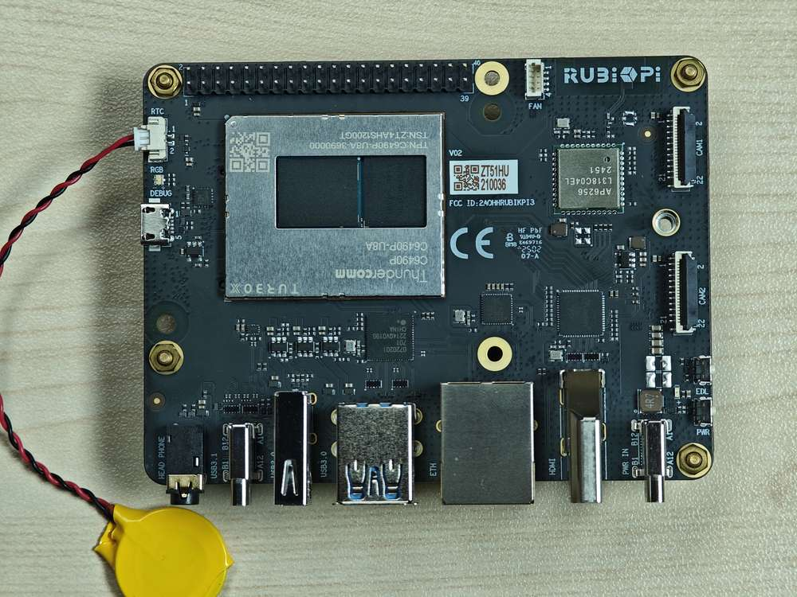

# RTC battery connector

The real-time clock (RTC) battery connector is port 1 in the following figure.


Connect the RTC battery as shown in the following figure and write the time into the system hardware clock of RUBIK Pi 3. This way, the system time of RUBIK Pi 3 can be saved even if it is completely powered off.



Write the system time to the system hardware clock on RUBIK Pi 3 as follows:

```shell
sudo timedatectl set-time "2025-06-03 21:12:11"
sudo timedatectl set-local-rtc true
```
