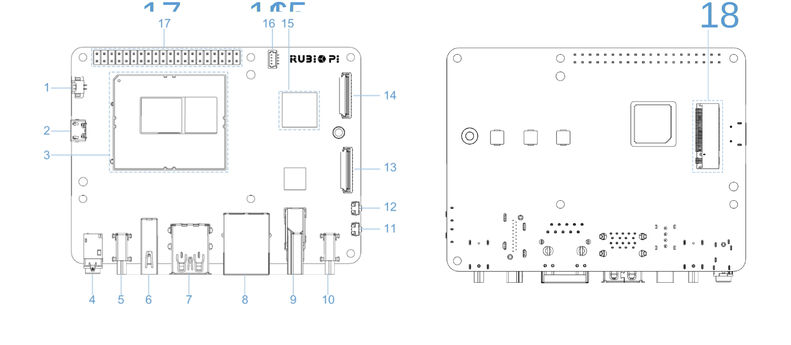
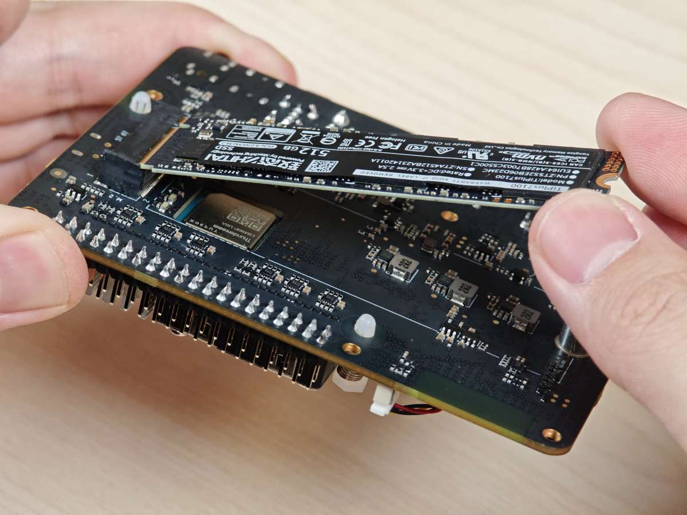
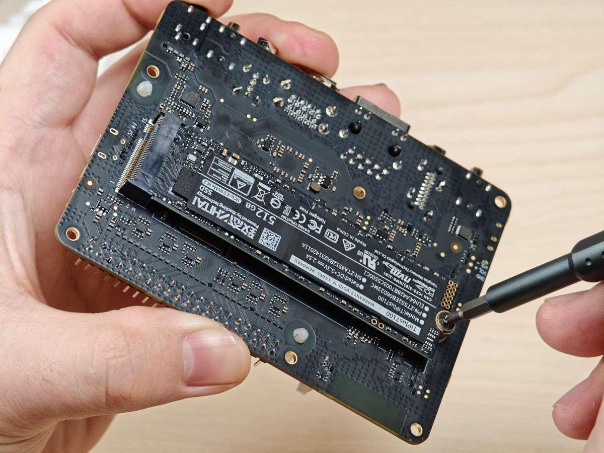

# M.2 Key M connector

RUBIK Pi 3 provides an M.2 slot for NVMe storage, which can be used to install a 2280 (22 x 80mm) SSD hard drive. The M.2 Key M slot supports PCIe Gen3 x 2 and can deliver an output of up to 3.3V 2A. The switch of the M.2 connector can be individually controlled.

The M.2 Key M connector uses the PCIe1 bus of the QCS6490. The device path is: */sys/bus/pci/devices/0001:00:00.0*

The M.2 Key M connector is connector 18 in the following figure:



The M.2 Key M connector is compatible with the 2280 SSD, as shown in the following figures:





## Verify the PCIe bus functionality
After connecting the 2280 form factor SSD, the device node generated is `/dev/nvme*`.

Use a command similar to the following to mount the SSD. Verify the PCIe bus interface by accessing the contents of the */opt* directory:

```shell
sudo mount /dev/nvme0n1p1 /opt/
```

## PCIe power management

PCIe defines two types of power management methods:

* Software power management, which determines the power management features for each device and manages them individually.

* Systems that do not require software intervention, such as Active State Power Management (ASPM).

When no data packets are being transmitted on the PCIe link, the device puts the PCIe link into a low-power state.

### PCIe L0 link states

PCIe power management defines the following L0 link states:

* L0: working state

* L0s: ASPM state with low-resume latency (energy saving standby state) 

### PCIe device states

PCIe power management defines the following device states:

* D0 (mandatory): The device is fully ON. There are two sub-states.

  * D0 (uninitialized): The function is in D0 (uninitialized) state when waiting for enumeration and configuration after exiting the reset state.

  * D0 (active)

    * The function enters the D0 (active) state once the enumeration and configuration process is completed.

    * The function enters the D0 (active) state when the system software enables one or more (in any combination) function parameters, such as memory space enable, I/O space enable, or BME bits.

* D1 (optional): light sleep state

  * The function can only initiate the PME message and cannot initiate other TLPs.

  * The function can only serve as the target for configuration transactions, not for other transactions.

  * The function enters the D1 state via a software command that sets the PM control and status registers.

* D2 (optional): deep sleep state

  * The function can only issue PME messages and cannot issue other TLPs.

  * The function can only serve as the target for configuration transactions, not for other transactions.

  * The function enters the D2 state via software commands that set the PM control and status registers.

* D3 (mandatory): The device is in the lowest power state, and this function must support two types of D3 states:

* D3 (hot)

  * The function can only issue PME messages and cannot issue other TLPs.

  * The function can only serve as the target for configuration transactions, not for other transactions.

  * The function enters D3 (hot) state by issuing a software command that sets the power state field.

* D3(cold): The device enters the D3 (cold) state and is powered off. When power is restored, the device enters the D0 (uninitialized) state.

## PCIe debugging

The M.2 Key M connector uses the PCIe1 bus of the QCS6490. The device path is: */sys/bus/pci/devices/0001:00:00.0*

The `lspci` and `setpci` commands are native to Linux distributions. These two commands provide multiple levels of output and can also be used to view the capabilities and states of different components trained on the PCI bus at a given time. Most of these capabilities reflect the configuration space registers required by the PCIe basic specification. For more detailed information, visit https://pcisig.com/specifications. To view the usage instructions, run the following command:

```shell
lspci --help
```

The following features help in debugging PCIe issues:

* Display device information.

  ```shell
  lspci
  ```

  Sample output

  ```shell
  0000:00:00.0 PCI bridge: Qualcomm Device 010b
  0000:01:00.0 USB controller: Renesas Technology Corp. uPD720201 USB 3.0 Host Controller (rev 03)
  0001:00:00.0 PCI bridge: Qualcomm Device 010b
  ```

* Show PCIe device and vendor IDs in the device control registers.

  ```shell
  lspci -nvmm
  ```

  Sample output

  ```shell
  Slot:        00:00.0
  Class:        0604
  Vendor:        17cb
  Device:        010b
  IOMMUGroup:        6

  Slot:        01:00.0
  Class:        0c03
  Vendor:        1912
  Device:        0014
  Rev:        03
  ProgIf:        30
  IOMMUGroup:        6

  Slot:        0001:00:00.0
  Class:        0604
  Vendor:        17cb
  Device:        010b
  DTNode:        /sys/firmware/devicetree/base/soc@0/pci@1c08000/pcie@1
  IOMMUGroup:        7

  ```
