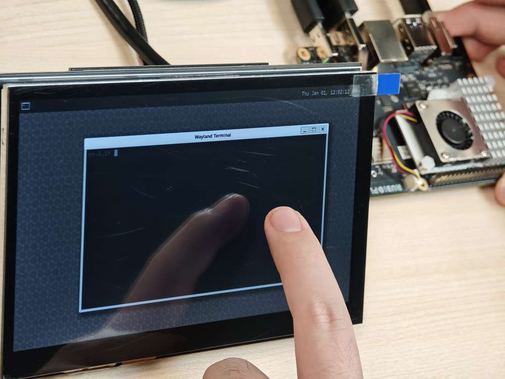

# HDMI OUT

RUBIK Pi 3 的 HDMI 接口为下图 9。

RUBIK Pi 3 HDMI 参数信息：

* HDMI 1.4

* 最高 3840 x 2160 分辨率 @ 30 fps

* DSI 0 to HDMI (LT9611)

* 支持 CEC

* 支持分辨率自适应

* 支持热插拔


## CEC

HDMI CEC（Consumer Electronics  Control，消费者电子控制）是 HDMI 标准中的一项功能，旨在通过单一的 HDMI 连接线实现多设备之间的互联与统一控制。具体来说，CEC 允许连接的设备通过专用的 CEC 引脚进行通信，从而实现例如通过一个遥控器控制多台设备的功能。

使用下面命令 安装 cec-client 工具。

```shell
sudo apt install cec-utils
```

将 HDMI 线连接到电视后，可使用下面命令查看电视是否支持 CEC：

```shell
echo 'scan' | cec-client -s -d 1
```

若支持 CEC 将会有如下输出:

```plain&#x20;text
opening a connection to the CEC adapter...
requesting CEC bus information ...
CEC bus information
===================
device #0: TV
address:       0.0.0.0
active source: no
vendor:        Sony
osd string:    TV
CEC version:   1.4
power status:  standby
language:      eng


device #1: Recorder 1
address:       1.0.0.0
active source: no
vendor:        Pulse Eight
osd string:    CECTester
CEC version:   1.4
power status:  on
language:      eng


device #4: Playback 1
address:       3.0.0.0
active source: no
vendor:        Sony
osd string:    PlayStation 4
CEC version:   1.3a
power status:  standby
language:      ???
```

若电视支持 CEC 功能，可在 RUBIK Pi 3 中使用下面命令控制电视音量的加减：

```shell
echo 'volup' | cec-client -t p -s
echo 'voldown' | cec-client -t p -s
```

更多 cec-client 使用方法，可使用 `-h` 参数进行查看：


## HDMI OUT 触摸屏

RUBIK Pi 3 默认支持 1024\*600P 分辨率的 HDMI OUT 触摸屏，如下图所示：



:::note
>
> 上图中使用的屏幕为 [7 寸 IPS 高清触摸屏幕](https://detail.tmall.com/item.htm?abbucket=12\&id=683025543197\&rn=92499216a472de3107f9541a1b160dc3\&spm=a1z10.5-b-s.w4011-25285306736.152.50aa1c712FMfOS\&skuId=5055110246880)。
:::

## HDMI OUT 调试

RUBIK Pi 3 使用的是 LT9611 这款 DSI-to-HDMI 桥接芯片。

下表列 HDMI 桥接芯片所需的配置。

| 说明                                             | DTSI 节点                                                                                                                                             |
|--------------------------------------------------|------------------------------------------------------------------------------------------------------------------------------------------------------|
| 将 DSI-to-HDMI 桥接面板设置为 Primary             | `&sde_dsi { qcom, dsi-default-panel = <&dsi_ext_bridge_1080p>;`                                                                                   |
| 为桥接芯片配置基准电源条目                       | `&sde_dsi { vddio-supply = <&vreg_18c_ip62>; vdda-9p9-supply = <&vreg_11oc_9p88>; vdda-9p9-supply = <&vreg_11oc_9p88>;`                          |
| 为桥接芯片配置面板复位 GPIO                     | `lt9611: lt,lt9611 { reset-options = <&tlmm 21 0>;}`                                                                                               |
| 在外部桥接模式下配置 DSI 主机驱动程序以使用第三方 DSI-to-HDMI 桥接芯片 | `qcom,mdss-dsi-ext-bridge-mode;`                                                                                                                   |

:::note
使用 `sudo -i` 命令切换到 root 用户。
:::

### 获取 lt9611 日志

要获取 LT9611 日志，请运行以下命令：

```bash
dmesg | grep lt9611
```

查看 log，出现下面的字样代表 HDMI OUT 可以正常运行。

这段日志记录了 LT9611 芯片的初始化和 HDMI 连接过程，从固件版本检测到 CEC 初始化，芯片启动正常。

1. 芯片的固件版本是 0xe2.17.02。这表示芯片初始化时，驱动成功读取了版本信息。

2. LT9611 的 CEC（消费电子控制）功能适配器成功注册。

3. CEC 初始化完成，表明 LT9611 的 CEC 模块已经可以正常工作。

4. 芯片成功读取了 HPD（热插拔检测）状态，并且会有返回值，表示确认 HDMI 设备接入。

5. 芯片检测到视频信号参数：水平分辨率 1920（像素），垂直分辨率 1080（像素），像素时钟频率 148500 kHz（148.5 MHz）。这对应的是 1080p 分辨率（全高清），60Hz 刷新率的典型配置。

```bash
[    5.492765] lt9611 9-0039: LT9611 revision: 0xe2.17.02
[    5.570258] lt9611 9-0039: CEC adapter registered
[    5.582944] lt9611 9-0039: CEC init success

[    8.233028] lt9611 9-0039: success to read hpd status: 13
[    8.233044] lt9611_device_connect_status_notify: send msg[Hdmi Connection] ret[32]
[    8.345015] lt9611 9-0039: hdisplay=1920, vdisplay=1080, clock=148500 
[    8.836662] lt9611 9-0039: video check: hactive_a=1920, hactive_b=1920, vactive=1080, v_total=1125, h_total_sysclk=401, mipi_video_format=170
```

### 获取 DSI 日志

我们也可以通过输出的 DSI 信息进行调试，DSI 指的是 Display Serial Interface（显示串行接口），通常与移动设备或嵌入式系统的显示驱动（如 MIPI DSI）相关。

这个命令用来查看与显示接口（DSI）相关的内核日志，通常用于调试显示驱动或硬件问题。

```bash
dmesg | grep dsi
```

输出结果示例：

```shell
[    6.831249] i2c 9-0039: Fixed dependency cycle(s) with /soc@0/display-subsystem@ae00000/dsi@ae9400
[   15.070444] lt9611 9-0039: failed to find dsi host
[   17.855362] lt9611 9-0039: failed to find dsi host
[   18.007167] platform ae01000.display-controller: Fixed dependency cycle(s) with /soc@0/display-su0
[   18.014168] platform ae01000.display-controller: Fixed dependency cycle(s) with /soc@0/display-su0
[   18.014317] lt9611 9-0039: Fixed dependency cycle(s) with /soc@0/display-subsystem@ae00000/dsi@ae0
[   18.014460] platform ae94000.dsi: Fixed dependency cycle(s) with /soc@0/geniqup@ac0000/i2c@a840009
[   18.014514] platform ae94000.dsi: Fixed dependency cycle(s) with /soc@0/display-subsystem@ae000000
[   18.372993] lt9611 9-0039: failed to find dsi host
[   18.803189] msm_dpu ae01000.display-controller: bound ae94000.dsi (ops dsi_ops [msm])
```

### 获取调压器信息

要检查调压器状态和电压，请运行以下命令：

```shell
cat /sys/kernel/debug/regulator/regulator_summary
```

### 获取接口信息

要检索调试 dump 输出（显示接口编号、VSync 计数、欠载计数和接口模式），请运行以下命令：

```shell
cat /sys/kernel/debug/dri/0/encoder*/status
```

示例输出

```shell
intf:1  wb:-1  vsync:    2580     underrun:       0    frame_done_cnt:0mode: INTF_MODE_VIDEO
intf:-1  wb:2  vsync:       0     underrun:       0    frame_done_cnt:0mode: INTF_MODE_WB_LINE
```

### 获取常规 DPU 调试信息

常见的 DPU 调试信息说明如下：

要检查 DPU 时钟速率，请运行以下命令：

```shell
cat /sys/kernel/debug/clk/clk_summary | grep disp_cc
```

将 DPU 设置为性能模式

```shell
cd /sys/kernel/debug/dri/0/debug/core_perf/
echo 1 > perf_mode
```