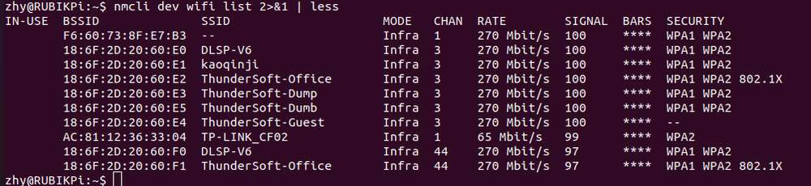
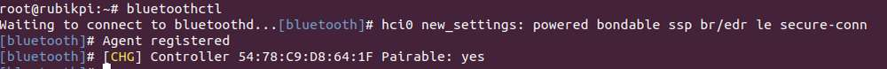

import Tabs from '@theme/Tabs';
import TabItem from '@theme/TabItem';

# Wi-Fi 与蓝牙

## Wi-Fi
Wi-Fi 是一种使用 IEEE 802.11 协议的无线网络技术。它允许智能手机、可穿戴设备、笔记本电脑、台式机和其他消费电子产品等电子设备在没有物理电缆的情况下连接到互联网。

### 工作频段

&#x20;AP6256 Wi-Fi 模块支持 2.4 GHz、5 GHz 工作频段。

### 工作模式

Wi-Fi 软件在以下模式下运行：

| 模式       | 说明                                                                                                                                             |
|------------|--------------------------------------------------------------------------------------------------------------------------------------------------|
| STA 模式   | 在 STA 模式下，设备连接到 Wi-Fi 网络中的接入点，并与网络中的其他设备进行通信。此模式是 Wi-Fi 连接中的无线设备的标准模式。                |
| 热点模式   | 热点模式使设备能够使用蜂窝链路 (LTE) 向 Wi-Fi 客户端提供回程 (Internet) 连接。该设备通过其轻量级热点接口建立此连接。在热点模式下，设备可以：与连接到同一热点的其他 Wi-Fi 客户端通信。与热点设备通信。共享设备的 WAN 连接。 |


<Tabs>
    <TabItem value="Wi-Fi STA" label="STA 模式" default>
    在 STA 模式（Station）下，设备可连接到一个已经存在的无线网络，以便访问网络资源或互联网。

    1. 使用命令扫描 Wi-Fi

    ```shell
    nmcli dev wifi list 2>&1 | less
    ```
    

    :::note
    按下 `q` 退出
    :::
    2. 使用命令连接 Wi-Fi
    ```shell
    sudo nmcli dev wifi connect <WiFi-SSID> password <WiFi-password>
    ```

    例如，运行命令

    ```shell
    sudo nmcli dev wifi connect rubikpiwifi password 123456789
    ```

    其中，Wi-Fi SSID 为 `rubikpiwifi`，Wi-Fi 密码为 `123456789`。&#x20;

    示例输出

    ```shell
    Device 'wlan0' successfully activated with 'e8b98f24-3f23-4742-8aa3-0d37c5ee6564'.
    ```

    :::note
    如果您在运行命令时看到网络错误消息，请运行以下命令之一来触发 Wi-Fi 扫描并验证目标 AP。&#x20;

    * `nmcli dev wifi list`

    * `iw dev wlan0 scan `       &#x20;
    :::
    3. 要查看连接状态，请运行以下命令：

    ```shell
    nmcli general status
    ```

    示例输出

    ```shell
    STATE  CONNECTIVITY  WIFI-HW  WIFI    WWAN-HW  WWAN
    connected  full     enabled  enabled  enabled  enabled
    ```
    4. 要验证连接状态，请执行以下步骤：
        1. 要查看设备状态，请运行以下命令：

        ```shell
        nmcli dev status
        ```

        示例输出

        ```
        DEVICE  TYPE      STATE        CONNECTION
        wlan0   wifi      connected    RUbikpiWiFi
        eth0    ethernet  unavailable  --
        eth1    ethernet  unavailable  --
        can0    can       unmanaged    --
        lo      loopback  unmanaged    --
        ```
        2. 要查看附加连接信息，请运行以下命令：

        ```
        nmcli device show wlan0
        ```

        示例输出

        ```
        GENERAL.DEVICE:                         wlan0
        GENERAL.TYPE:                           wifi
        GENERAL.HWADDR:                         00:03:7F:12:F7:F7
        GENERAL.MTU:                            1500
        GENERAL.STATE:                          100 (connected)
        GENERAL.CONNECTION:                     QualcommWiFi
        GENERAL.CON-PATH:                       /org/freedesktop/NetworkManager/ActiveConnection/5
        IP4.ADDRESS[1]:                         192.168.117.130/24
        IP4.ADDRESS[2]:                         192.168.117.131/24
        IP4.GATEWAY:                            192.168.117.126
        ```
        3. 通过在 UART 控制台中运行 ifconfig wlan0 命令来验证是否在 wlan0 接口上分配了 IP 地址

        ```
        ifconfig wlan0
        ```
        :::note
        >
        > 可输入命令 `sudo apt install net-tools` 安装 ifconfig 命令。
        :::

        4. 通过 ping 以下公共 DNS IP：验证 AP 或路由器是否已连接至 Internet

        ```
        ping 8.8.8.8
        ```
    :::note
     * 如果您已连接至一个网络，但想要使用另一连接，则可以通过指定 SSID `nmcli con down  ssid/uuid` 将连接切换为关闭来断开连接。或者，如果您有多个具有相同 SSID 的连接，请使用 UUID。

    * 要连接到另一个已保存的连接，只需运行以下命令来传递 `nmcli` 命令行工具中的 up 选项即可。`nmcli con up ssid/uuid`
    :::

    :::note
    要退出标准输入 shell，请按 CTRL+C。
    :::

    有关 `nmcli` 的更多信息，请参阅 https://www.linux.org/docs/man1/nmcli.html 和 https://networkmanager.dev/docs/api/latest/nmcli.html
    </TabItem>

    <TabItem value="Wi-Fi AP" label="AP 模式" default>

    AP 模式（Access Point）即无线接入热点模式，是一个无线网络的创建者，是网络的中心节点，一般家庭或办公室使用的无线网络路由器就是一个 AP，下面是 AP 的创建步骤：

    * 开启 AP
        * 创建或修改 */opt/hostapd.conf&#x20;*&#x20;文件：

          ```plain&#x20;text
          ctrl_interface=/var/run/hostapd
          driver=nl80211
          ieee80211n=1
          interface=wlan1
          hw_mode=a
          channel=36
          beacon_int=100
          dtim_period=1
          ssid=RUBIKPi
          auth_algs=1
          ap_isolate=0
          ignore_broadcast_ssid=0
          wpa=2
          wpa_key_mgmt=WPA-PSK
          rsn_pairwise=CCMP
          wpa_passphrase=123456789
          ```

        * 执行下面命令开启 AP：

          ```shell
          hostapd -B /opt/hostapd.conf # 设置软件AP
          # 启动动态主机配置协议（DHCP）服务器
          brctl addbr br0
          brctl addif br0 wlan1
          ifconfig br0 192.168.225.1 netmask 255.255.255.0 up
          killall dnsmasq
          dnsmasq --conf-file=/etc/dnsmasq.conf --dhcp-leasefile=/var/run/dnsmasq.leases --addn-hosts=/data/hosts --pid-file=/var/run/dnsmasq.pid -i br0 -I lo -z --dhcp-range=br0,192.168.225.20,192.168.225.60,255.255.255.0,43200 --dhcp-hostsfile=/data/dhcp_hosts --dhcp-option-force=6,192.168.225.1 --dhcp-script=/bin/dnsmasq_script.sh
          ```

  * 若要与 hostapd\_cli 建立连接，可使用下面命令

    ```shell
    hostapd_cli -i wlan1 -p /var/run/hostapd
    ```

  在 `hostapd_cli` 控制台中监视 Wi-Fi STA 连接通知，例如 `AP-STA-CONNECTED`、 `EAPOL-4WAY-HS-COMPLETED`

  示例输出
  ```shell
  root@rubikpi:~# hostapd_cli -i wlanl -p /var/run/hostapd
  hostapd_cli v2.11-devel
  Copyright (c) 2004-2022, Jouni Malinen <j@wl.fi> and contributors
  This software may be distributed under the terms of the BSD License. 
  See README for more details.

  Interactive mode
  > <3>AP-STA-CONNECTED aa: a4: fd: 8b: ec: 90
  <3>EAPOL-4WAY-HS-COMPLETED aa: a4: fd: 8b:ec:90

  > list_sta
  aa: a4: fd: 8b:ec:90
  ```
 若开启 AP 5G 模式前，未使用 STA 连接过 5G Wi-Fi，则需使用如下命令，查看环境中 5G channel 的配置
  ```shll
  iw dev wlan0 scan
  ```
 在命令执行结果中通过，primary channel 字段确定当前已被激活 channel，如下所示，channel 字段为 36，将36 写入 */opt/hostapd.conf* 文件中的 channel 字段即可


 ```
 HT operation:
                 * primary channel: 36
                 * secondary channel offset: above
                 * STA channel width: any
                 * RIFS: 0
                 * HT protection: nonmember
                 * non-GF present: 0
                 * OBSS non-GF present: 0
                 * dual beacon: 0
                 * dual CTS protection: 0
                 * STBC beacon: 0
                 * L-SIG TXOP Prot: 0
                 * PCO active: 0
                 * PCO phase: 0
```
    * 验证 AP

        要验证连接状态，请从其他设备连接到 AP。&#x20;

        例如，通过执行以下步骤从移动设备连接到 AP：

        1. 在移动设备上，转到 Wi-Fi settings。

        2. 等待 Wi-Fi STA 检测到 AP。

        3. 选择 AP 并输入在 RUBIK Pi 3 设备上为 AP 配置的相应 `wpa_passphrase`，然后进行连接。&#x20;
        ```shell
        > status
        state=ENABLED
        phy=phyR freq=2412
        num_sta_non_erp=0
        num_sta_no_short_slot_time=0
        num_sta_no_short_preamble=0
        olbc=0
        num_sta_ht_no_gf=0 num_sta_no_ht=0
        num_sta_ht_20_mhz=0
        num_sta_ht40_intolerant=0
        olbc_ht=0
        ht_op_mode=0x0
        hw_mode=g
        country_code=US
        country3=0x20
        cac_time_seconds=0
        cac_time_left_seconds=N/A
        channel=1
        edmg_enable=0 edmg_channel=0
        secondary_channel=0
        ieee80211n=1
        ieee80211ac=0
        ieee80211ax=0
        ieee80211be=0
        beacon_int=100
        dtim_period=2
        ht_caps_info=000c
        ht_mcs_bitmask=ffff0000000000000000
        supported_rates-02 04 0b 16 Oc 12 18 24 30 48 60 6c
        max_txpower=30
        bss[0]=wlan1
        bssid[0]=00:03:7f:95:8e:8e
        ssid [0]=QSoftAP
        num_sta[0]=1
        > |
        ```
    要验证连接，在 RUBIK Pi 3 设备的 `ssh shell` 中 ping 移动设备的 IP 地址。

    以下输出表示 Wi-Fi 连接已成功建立，数据传输已开始：&#x20;

    ```shell
    sh-5.1# ping 192.168.1.42
    PING 192.168.1.42 (192.168.1.42): 56 data bytes
    64 bytes from 192.168.1.42: seq=0 ttl=64 time-11.175 ms
    64 bytes from 192.168.1.42: seq=1 ttl=64 time=14.528 ms
    64 bytes from 192.168.1.42: seq=2 ttl=64 time=29.735 ms
    64 bytes from 192.168.1.42: seq=3 ttl=64 time=223.822 ms
    64 bytes from 192.168.1.42: seq-4 ttl=64 time-23.675 ms
    ^C
    192.168.1.42 ping statistics ---
    7 packets transmitted, 5 packets received, 28% packet loss
    round-trip min/avg/max = 11.175/60.587/223.822 ms
    sh-5.1#
    ```

    也可以在连接设备的 Settings 中验证 Wi-Fi 连接状态。例如，要获取连接到 RUBIK Pi 3 AP 的移动设备的 IP 地址，执行以下步骤：
        1. 导航至 Settings > Wi-Fi。

        2. 验证 AP 的 SSID。

    * 关闭 AP：

    要停止 AP，在 SSH 中执行以下操作：

    1. 通过执行以下步骤停止 hostapd：

       1. 要停止 hostapd 过程，可运行以下命令：

          ```plain&#x20;text
          killall hostapd
          ```

       2. 要禁用接口，可运行以下命令：

          ```plain&#x20;text
          ifconfig wlan1 down
          ```

    2. 请运行以下命令，以便删除 `ctrl_interface`：

       ```plain&#x20;text
       rm -rf /var/run/hostapd/wlan1
       ```

    Wi-Fi 热点成功停止。

    </TabItem>
</Tabs>


<a id="blue"></a>
## 蓝牙

蓝牙® 无线技术是一种短距离通信系统，可实现设备之间的无线数据交换。蓝牙技术的主要优势如下：

* 替代便携式和固定式电子设备的线缆

* 提供稳健、节能且经济高效的解决方案

* 促进解决方案及其应用的灵活性。

### 打开蓝牙测试应用程序

* 通过运行以下命令打开蓝牙测试应用程序，所有蓝牙配置命令都在此应用程序中执行：

```shell
bluetoothctl
```
示例输出


### 启用蓝牙
* 要启用设备蓝牙，可运行以下命令：
```shell
power on
```
示例输出


<a id="blue_scan"></a>
### 运行蓝牙查询扫描
* 要启动对附近设备的查询，运行以下命令：
```shell
scan on
```
示例输出


### 停止蓝牙扫描
* 请运行以下命令，以便停止正在进行的查询：
```shell
scan off
```
示例输出


### 与远程蓝牙设备配对

在配对远程设备之前，[运行蓝牙查询](#blue_scan) 扫描以确保远程设备可用。
* 要与远程蓝牙设备配对，请运行以下命令：
```shell
pair <bt_address>
```
要接受主动/被动配对，输入 `yes`。要拒绝主动/被动配对，输入 `no`。
参数 `<bt_address>` 是远程设备的蓝牙地址。

示例

  要使用 `<bt_address> 00:25:02:02:7B:A4` 与远程设备配对，请运行以下命令：
  ```shell
  pair 00:25:02:02:7B:A4
  ```
示例输出
```
[bluetooth] pair 00:25:02:02:7B:A4
Attempting to pair with 00:25:02:02:7B:A4
[bluetooth]# hci0 device_flags_changed: 00:25:02:02:7B:A4 (BR/EDR)
[bluetooth]#      supp: 0x00000001  curr: 0x00000000
[bluetooth]# hci0 00:25:02:02:7B:A4 type BR/EDR connected eir_len 20
[CHG] Device 00:25:02:02:7B:A4 Connected: yes
[OPPO Enco W31]# hci0 new_link_key 00:25:02:02:7B:A4 type 0x04 pin_len 0 store_hint 1
[OPPO Enco W31]# [CHG] Device 00:25:02:02:7B:A4 Bonded: yes
[OPPO Enco W31]# [CHG] Device 00:25:02:02:7B:A4 UUIDs: 00000001-0000-1000-8000-00805f9b34fb
[OPPO Enco W31]# [CHG] Device 00:25:02:02:7B:A4 UUIDs: 00001107-d102-11e1-9b23-00025b00a5a5
[OPPO Enco W31]# [CHG] Device 00:25:02:02:7B:A4 UUIDs: 0000110b-0000-1000-8000-00805f9b34fb
[OPPO Enco W31]# [CHG] Device 00:25:02:02:7B:A4 UUIDs: 0000110e-0000-1000-8000-00805f9b34fb
[OPPO Enco W31]# [CHG] Device 00:25:02:02:7B:A4 UUIDs: 0000110f-0000-1000-8000-00805f9b34fb
[OPPO Enco W31]# [CHG] Device 00:25:02:02:7B:A4 UUIDs: 0000111e-0000-1000-8000-00805f9b34fb
[OPPO Enco W31]# [CHG] Device 00:25:02:02:7B:A4 UUIDs: 00001203-0000-1000-8000-00805f9b34fb
[OPPO Enco W31]# [CHG] Device 00:25:02:02:7B:A4 ServicesResolved: yes
[OPPO Enco W31]# [CHG] Device 00:25:02:02:7B:A4 Paired: yes
[OPPO Enco W31]# Pairing successful
[OPPO Enco W31]# hci0 00:25:02:02:7B:A4 type BR/EDR disconnected with reason 2
[OPPO Enco W31]# [CHG] Device 00:25:02:02:7B:A4 ServicesResolved: no
[CHG] Device 00:25:02:02:7B:A4 Connected: no
[bluetooth]# hci0 00:25:02:02:7B:A4 type BR/EDR connected eir_len 20
[CHG] Device 00:25:02:02:7B:A4 Connected: yes
[OPPO Enco W31]# Authorize service
[agent] Authorize service 0000110d-0000-1000-8000-00805f9b34fb (yes/no): yes
[OPPO Enco W31]# Authorize service
[OPPO Enco W31]#   1;39m[agent] Authorize service 0000111f-0000-1000-8000-00805f9b34fb (yes/no): [CHG] Device 00:25:02:02:7B:A4 UUIDs: 00000001-0000-1000-8000-00805f9b34fb
[agent] Authorize service 0000111f-0000-1000-8000-00805f9b34fb (yes/no): [CHG] Device 00:25:02:02:7B:A4 UUIDs: 00001107-d102-11e1-9b23-00025b00a5a5
[agent] Authorize service 0000111f-0000-1000-8000-00805f9b34fb (yes/no): [CHG] Device 00:25:02:02:7B:A4 UUIDs: 0000110b-0000-1000-8000-00805f9b34fb
[agent] Authorize service 0000111f-0000-1000-8000-00805f9b34fb (yes/no): [CHG] Device 00:25:02:02:7B:A4 UUIDs: 0000110d-0000-1000-8000-00805f9b34fb
[agent] Authorize service 0000111f-0000-1000-8000-00805f9b34fb (yes/no): [CHG] Device 00:25:02:02:7B:A4 UUIDs: 0000110e-0000-1000-8000-00805f9b34fb
[agent] Authorize service 0000111f-0000-1000-8000-00805f9b34fb (yes/no): [CHG] Device 00:25:02:02:7B:A4 UUIDs: 0000110f-0000-1000-8000-00805f9b34fb
[agent] Authorize service 0000111f-0000-1000-8000-00805f9b34fb (yes/no): [CHG] Device 00:25:02:02:7B:A4 UUIDs: 0000111e-0000-1000-8000-00805f9b34fb
[agent] Authorize service 0000111f-0000-1000-8000-00805f9b34fb (yes/no): [CHG] Device 00:25:02:02:7B:A4 UUIDs: 00001203-0000-1000-8000-00805f9b34fb
[agent] Authorize service 0000111f-0000-1000-8000-00805f9b34fb (yes/no): [NEW] Endpoint /org/bluez/hci0/dev_00_25_02_02_7B_A4/sep1 
[agent] Authorize service 0000111f-0000-1000-8000-00805f9b34fb (yes/no): [NEW] Endpoint /org/bluez/hci0/dev_00_25_02_02_7B_A4/sep2       
[agent] Authorize service 0000111f-0000-1000-8000-00805f9b34fb (yes/no): yes
[OPPO Enco W31]#
```

### 获取绑定/配对设备列表

* 要获取已验证的配对设备列表，运行以下命令：

```shell
devices
```

示例输出


### 连接远程设备
* 要连接远程设备，请运行以下命令：
```shell
connect <bt_address>
```
参数 `<bt_address>` 是远程设备的蓝牙地址。

示例

  要使用 `<bt_address> 00:25:02:02:7B:A4` 连接到已配对的远程设备，请运行以下命令：

```shell
connect 00:25:02:02:7B:A4
```
示例输出
```
[bluetooth]# connect 00:25:02:02:7B:A4
Attempting to connect to 00:25:02:02:7B:A4
[bluetooth]# [CHG] Device 66:90:8B:13:9F:50 RSSI: 0xffffffb2 (-78)
[bluetooth]# [CHG] Device 00:25:02:02:7B:A4 AddressType: public
[bluetooth]# [CHG] Device 3F:5B:7D:73:30:9E ServiceData.0000fe95-0000-1000-8000-00805f9b34fb:
[bluetooth]#   70 20 5b 04 5e 9e 30 73 7d 5b 3f 09 04 10 02 ff  p [.^.0s}[?.....
[bluetooth]#   00                                               .               
[bluetooth]# [CHG] Device 47:6E:17:4C:2A:3C RSSI: 0xffffffb8 (-72)
[bluetooth]# [NEW] Device 54:38:90:28:DE:0A 54-38-90-28-DE-0A
[bluetooth]# [DEL] Device 28:6B:35:B5:C3:D0 CN8900578W2
[bluetooth]# hci0 00:25:02:02:7B:A4 type BR/EDR connected eir_len 15
[CHG] Device 00:25:02:02:7B:A4 Connected: yes
[OPPO Enco W31]# [NEW] Endpoint /org/bluez/hci0/dev_00_25_02_02_7B_A4/sep1 
[OPPO Enco W31]# [NEW] Endpoint /org/bluez/hci0/dev_00_25_02_02_7B_A4/sep2 
[OPPO Enco W31]# [NEW] Transport /org/bluez/hci0/dev_00_25_02_02_7B_A4/sep1/fd4 
[OPPO Enco W31]# Connection successful
[OPPO Enco W31]# [CHG] Device 00:25:02:02:7B:A4 ServicesResolved: yes
[OPPO Enco W31]# [CHG] Transport /org/bluez/hci0/dev_00_25_02_02_7B_A4/sep1/fd4 State: active
```

### 取消设备配对
* 要取消配对设备，请运行以下命令：
```Shell
remove <bt_address>
```
示例输出


### 启用设备发现

* 要在 DUT 中启用发现模式，请运行以下命令：
```shell
discoverable on
```
示例输出


### 关闭蓝牙

* 请运行以下命令，以便在设备上禁用蓝牙：
```shell
power off
```
示例输出


