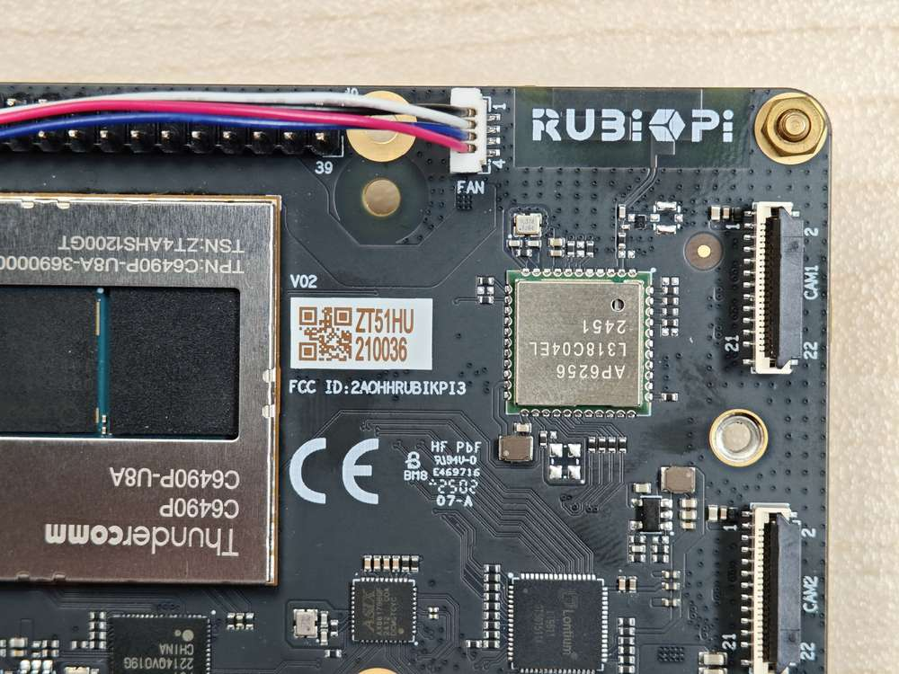

# 风扇

RUBIK Pi 3 兼容的散热套件，请见[外设兼容列表](/peripheral-compatibility-list.md)。

:::warning
>
> 使用 RUBIK Pi 3 在运行一些高负载或高性能的场景下，需要使用散热措施来保证设备性能稳定，否则会因为 CPU 温度过高而带来降频等性能影响。
:::

## 风扇安装

1. 将裁剪好的两块导热硅脂贴在 RUBIK Pi 3 上对应位置。


2. 安装散热器，连接风扇排线。

  

  :::warning
  >
  > 建议将风扇安装到 RUBIK Pi 3 上后不要将其取下。拆卸会导致风扇的推针和散热垫退化，并可能导致产品损坏。如果推针损坏或变形，或无法牢固夹住，请停止使用风扇。
  :::

## 风扇控制方法

RUBIK Pi 3 风扇会根据当前的 CPU 温度自动调整转速，同时也可在 RUBIK Pi 3 中使用下面命令进行手动控制转速，0 和 255 分别表示风扇的最高和最低速度。

```shell
echo 100 >  /sys/devices/platform/pwm-fan/hwmon/hwmon*/pwm1
echo 255 >  /sys/devices/platform/pwm-fan/hwmon/hwmon*/pwm1
echo 0 >  /sys/devices/platform/pwm-fan/hwmon/hwmon*/pwm1
```

:::note
在将风扇转速设置为一个固定值前时，需要使用 `systemctl stop rubikpi-thermal` 命令将风扇热管理服务关掉。
:::
