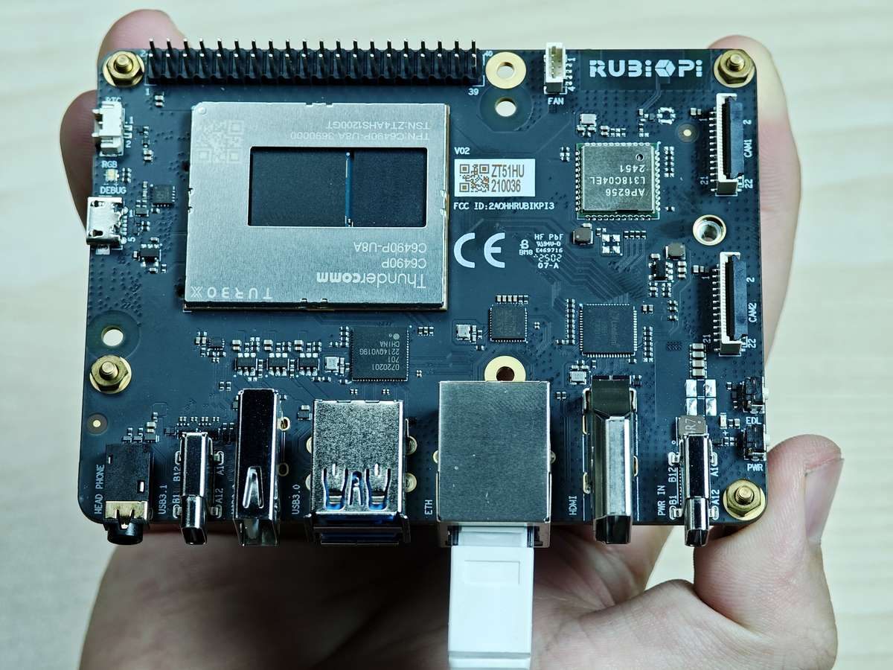

# Ethernet

Ethernet technology is designed to transmit data over a channel using wired technology at different link speeds. Examples such as Local Area Network (LAN) and Wide Area Network (WAN) provide reliable, secure, and better network connectivity.

Ethernet connectivity is integrated into IoT devices and sensors, enabling them to transmit data to the network. It is defined under IEEE 802.3 standards and provides a standardized interface for these devices to communicate with gateways.

The Ethernet interface is port 8 in the following figure. RUBIK Pi 3 supports Gigabit Ethernet.


Connect the network cable, as shown in the following figure:



Run the `ifconfig` command on RUBIK Pi 3 to check the network connection. As shown in the following figure, the IP address has been successfully assigned, indicating that the network connection is successful:


:::note

To install the ifconfig command, run the `sudo apt install net-tools` command.
:::

## Ethernet debugging

Use the following types of logs to record and debug Ethernet-related issues.

* `dmesg`: Debug issues related to kernel drivers.

* `tcpdump`: Verify packet transmission.

To debug potential issues that may occur during Ethernet setup, perform the following steps:

1. To collect `dmesg`  logs and debug issues related to the kernel driver, run the following command:

   ```shell
   dmesg > /var/log/dmesg_logs.txt
   ```

2. To collect `tcpdump` logs and verify packet transmission, run the following command:

   ```shell
   tcpdump -i any -s 0 -w /var/log/tcpdump.pcap
   ```

3. Collect the output from the `ethtool`, `ifconfig`, `netstat`, and IP routing table for debugging.
