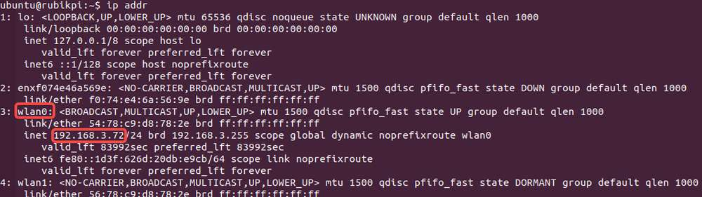
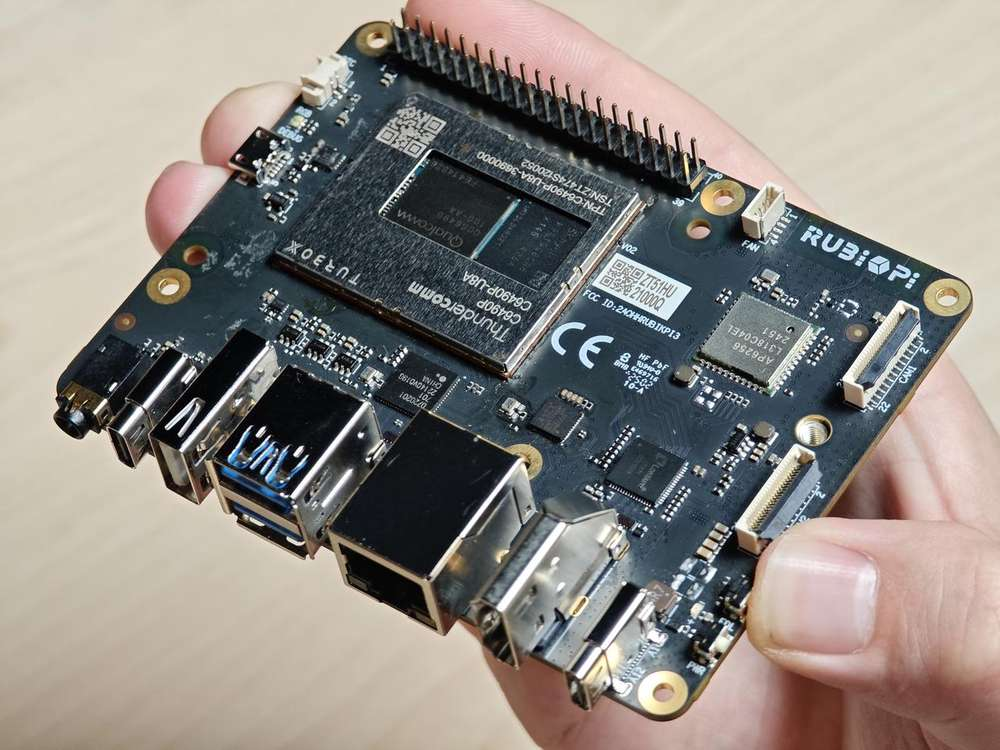

import Tabs from '@theme/Tabs';
import TabItem from '@theme/TabItem';

# 设备设置

本章是在**Ubuntu**、**Windows®**和**macOS®**环境中设置**魔方派 3**开发板的简化指南。无论您是第一次打开设备电源、配置调试串口进行访问，还是建立网络和 SSH 连接，本章确保顺畅可靠的入门体验。  
此外本章还涵盖了一些关键步骤，例如进入**EDL 模式** 进行固件刷新和验证您的**Ubuntu 24.04** 安装，这是 AI、多媒体和嵌入式开发工作流程的基础。

###  让我们开始吧！


<a id="poweron"></a>

## 设备上电

连接 12V、3A Type-C 电源适配器。  
:::warning 
魔方派 3 支持 Power Delivery (PD) 3.0 电源输入。**请使用支持12V 3A PD 3.0协议的Type-C 接口电源适配器**。经验证的配件列表，请见[外设兼容列表](https://www.thundercomm.com/rubik-pi-3/cn/docs/peripheral-compatibility-list)。

如果电源适配器满足要求并且电源协商成功，电源端口附近的电源指示灯 LED 将亮起。如果适配器不符合要求，LED 将保持熄灭状态，并且设备将无法启动。
::: 

:::note 
插入 USB Type-C 转 USB Type-A 或 Type-C 线缆以建立连接进行刷机操作。  
:::

开发板V02及更新版本支持连接电源适配器后自动开机。您可以在开发板如下位置查看硬件版本号。在下面的示例中，硬件版本是 V02。


:::note 
如果开发板上的蓝色 LED 持续亮起，则表示电源按钮按下的时间过长，并且开发板处于fastboot模式。请参阅[**FAQ**](./11.Troubleshooting/4.troubleshooting.md#如何在魔方派-3-上退出fastboot模式)退出fastboot模式。
:::

<a id="setUART"></a>

## 设置调试 UART

调试 UART 显示诊断消息并通过 UART shell 提供对设备的访问。

1️⃣将 Micro-USB 电缆连接到魔方派 3 上的 Micro-USB 端口。


2️⃣将Micro-USB线的另一端连接到主机。根据主机操作系统，按照以下说明之一进行操作。

<Tabs>
<TabItem value="Ubuntuhost" label="Ubuntu 主机">
1️⃣运行以下命令来安装用于访问 UART 控制台的屏幕。

```shell
sudo apt update
sudo apt install screen
```

2️⃣运行以下命令检查USB端口：

```shell
ls /dev/ttyACM*
```

示例输出

```shell
/dev/ttyACM0
```

3️⃣运行以下命令打开调试 UART 会话。

```shell
sudo screen <serial_port> <baud_rate>
```

示例：`sudo screen /dev/ttyACM0 115200`  
4️⃣打开调试UART接口，按Enter键显示身份验证提示。  
5️⃣如果设备上已经刷入了 Canonical Ubuntu，请通过 UART 控制台登录并继续重置用户密码。  
- 帐户：`ubuntu`
- 密码： `ubuntu`

:::tip 
- 如果无法正常登录，请检查您的魔方派 3 是否已升级到 Ubuntu 24.04。详细升级步骤请参考[更新软件](./3.Update-Software/index.md)。
- 如果您没有按预期看到身份验证控制台，请检查 USB 连接。如有必要，请断开并重新连接 Micro USB 线。
:::

</TabItem>
 <TabItem value="winhost" label="Windows 主机">

1️⃣为您的 Windows 主机下载[PuTTY](https://www.chiark.greenend.org.uk/~sgtatham/putty/)。确保选择正确的版本（32 位或 64 位）。  
2️⃣运行安装向导并按照提示进行操作。  
3️⃣安装后，从**开始**中已安装程序列表中打开PuTTY应用程序，或者在任务栏上的搜索栏中搜索。  
4️⃣在PuTTY配置对话框中，执行以下操作：

1. 选择Serial。
2. 根据 Windows 设备管理器中检测到的 UART 端口指定串行线。

:::note 
如果未检测到 UART 端口，请下载驱动程序并使用 Windows 设备管理器进行更新：

* x86 系统：[USB 转 UART 串行驱动程序](https://ftdichip.com/wp-content/uploads/2023/09/CDM-v2.12.36.4-WHQL-Certified.zip)。
* Arm(®) 系统：访问 https://oemdrivers.com/usb-ft232r-usb-uart-arm64。单击 **Drivers** 下面的 **FTDI CDM VCP Drivers**。
:::

3. 将波特率设置为115200。
4. 单击**Open**启动PuTTY会话。

    

5️⃣打开串口设备并按**Enter**弹出身份验证提示。  
6️⃣登录UART控制台，按照提示重置密码。

    - Account: `ubuntu`    
    - Password: `ubuntu`  

:::tip 
- 如果无法正常登录，请检查您的魔方派 3 是否已升级到 Ubuntu 24.04。详细升级步骤请参考[更新软件](./3.Update-Software/index.md)。
- 如果您没有按预期看到身份验证控制台，请检查 USB 连接。如有必要，请断开并重新连接 Micro USB 线。
:::
 
</TabItem> 
<TabItem value="machost" label="macOS 主机">

1️⃣运行以下命令检查连接到 macOS 主机的串口设备。

```shell
ls /dev/cu.*
```

2️⃣在串口设备列表中找到您的设备。

    

3️⃣运行以下命令打开串口设备。
```shell 
screen <serial_device_node> <baud_rate>
```
:::note 
将 `<serial_device_node>`替换为设备节点名称。  
将 `<baud_rate>` 替换为适当的波特率。
:::

示例命令： `ceteam@Qualcomms-MacBook-Pro ~ % screen /dev/cu.usbserial-DM03SDQQ 115200`

4️⃣打开串口设备并按**Enter**弹出身份验证提示。  
5️⃣登录UART控制台，按照提示重置密码。  
- 帐户：`ubuntu`  
- 密码：  `ubuntu`

:::tip 
- 如果无法正常登录，请检查您的魔方派 3 是否已升级到 Ubuntu 24.04。详细升级步骤请参考[更新软件](./3.Update-Software/index.md)。
- 如果您没有按预期看到身份验证控制台，请检查 USB 连接。如有必要，请断开并重新连接 Micro USB 线。
:::

</TabItem> 
</Tabs>

<a id="conNET"></a>

## 连接到网络

使用以下方法之一建立互联网连接并获取设备的 IP 地址。

<Tabs>
<TabItem value="WiFi" label="Wi-Fi 连接">
设备在 Wi-Fi 站点模式下运行。设备启动时，初始化Wi-Fi主机驱动程序并执行网络管理认证。用户可以使用nmcli命令行工具建立无线连接。

1️⃣运行以下命令连接到无线接入点（Wi-Fi路由器）：

```shell
sudo nmcli dev wifi connect <WiFi-SSID> password <WiFi-password>
```

    示例
    
    ```
    sudo nmcli dev wifi connect RUBIKPiWiFi password 1234567890
    ```
    ```
    Device 'wlan0' successfully activated with 'd7b990bd-3b77-4b13-b239-b706553abaf8'.
    ```

2️⃣运行以下命令来验证连接和设备状态：

      ```shell
      sudo nmcli -p device
      ```
    
    

3️⃣运行以下命令来验证WLAN连接状态和IP地址。

    ```shell
    ip addr
     ```
    
     

4️⃣为确保连接处于活动状态，请对魔方派 等网站执行 ping 操作：

     ```shell
    ping yahoo.com
     ```

 </TabItem>
   <TabItem value="ETH" label="Ethernet 连接">
1️⃣将以太网电线缆的一端连接到魔方派 3 上的以太网端口（RJ45），另一端连接到网络路由器。


2️⃣建立连接后，在UART串口控制台上运行以下命令获取IP地址：

    ```shell
    ip addr
    ```
    
    

  </TabItem>
</Tabs>
## 建立 SSH 连接

安全外壳协议 (SSH) 用于主机和魔方派 3 之间的安全文件传输。

在连接到 SSH 之前，请确保网络连接已建立。

1️⃣要根据网络连接类型查找 IP 地址，请在 UART 控制台中运行以下命令：

```shell
ip addr
```

2️⃣从主机运行以下命令与设备建立 SSH 连接。使用步骤 1 中获得的 IP 地址。

```shell
ssh <user name>@ip-address
```

    示例
    ```
    ssh ubuntu@192.168.0.222
    ```

3️⃣要连接到 SSH，请在提示时输入用户密码。

:::note 
确保主机与设备连接到同一网络。
:::

<a id="conHDMI"></a>

## 验证软件版本

完成设置后，一旦设备成功启动，在设备 shell 中运行以下命令来验证操作系统版本：

        ```shell
        cat /etc/os-release 
        ```
    输出： 
        ```json
    NAME="Ubuntu"
    VERSION_ID="24.04"
    VERSION="24.04.2 LTS (Noble Numbat)"
    VERSION_CODENAME=noble
    ID=ubuntu
    ID_LIKE=debian
    HOME_URL="https://www.ubuntu.com/"
    SUPPORT_URL="https://help.ubuntu.com/"
    BUG_REPORT_URL="https://bugs.launchpad.net/ubuntu/"
    PRIVACY_POLICY_URL="https://www.ubuntu.com/legal/terms-and-policies/privacy-policy"
    UBUNTU_CODENAME=noble
    LOGO=ubuntu-logo
    ```

:::note 
根据您当前的软件版本选择[**合适的软件升级**](./3.Update-Software/index.md) 。
:::

## 连接 HDMI 显示器

要连接 HDMI 显示器并查看 Wayland 输出和示例应用程序的输出，请按照以下步骤操作：  
1️⃣将 HDMI 线的一端连接到魔方派 3 上的 HDMI 端口。  
2️⃣将HDMI 线的另一端连接到显示器。


3️⃣打开设备电源并检查 HDMI 显示。在应用任何包更新之前，应该看到默认的 Canonical Ubuntu 屏幕。


## 连接到 SBC 的键盘和鼠标

将 USB 键盘和鼠标连接到 Type-A 端口： 


## 基本端口连接详情


## 进入EDL模式

通过高通QDL工具向魔方派 3 刷入固件与系统镜像，必须进入**EDL 模式。**  
如果设备已预先刷写并完全配置，则可以在初始设置期间跳过 EDL 模式。

    <a id="enterEDL"></a>
    
    
    
    
    <Tabs>
    <TabItem value="method1" label="方法 1">
    
    1️⃣ 断开端口10的电源连接和端口5的Type-C连接线。
    
    2️⃣ 按住上图 12 的 **[EDL]** 按钮。
    
    
    
    3️⃣ 按住 **[EDL]** 按钮的同时，将电源线接到端口 10，如下图。
    
    
    
    4️⃣ 按住 **[EDL]** 按钮的同时，将Type-C连接线接到端口 5，等待 3 秒进入 9008 模式。
    
    
    
    5️⃣ 松开 **[EDL]** 按钮。
    
    </TabItem>
    <TabItem value="method2" label="方法 2">
    如果您的设备已运行 Canonical Ubuntu 官方镜像，请按以下步骤进入紧急下载（EDL）模式。
    <details>
    <summary>🔧 通过 UART</summary>
        1. 从 UART 终端登录  
        2. 运行以下命令
        ```shell
        sudo reboot edl
        ```
    </details>
    
    <details>
    <summary>🌐 通过 SSH</summary>
        1. 通过 IP 地址远程连接到设备  
        2. 使用 SSH 进行登录  
        ```shell
        sudo reboot edl
        ```
    </details>
    
    <details>
    <summary>🖥️ 通过 SBC</summary>
        1. 在 Weston 显示界面中，打开终端
        2. 登录系统
        ```shell
        sudo reboot edl
        ```
    </details>
    </TabItem>
    </Tabs>