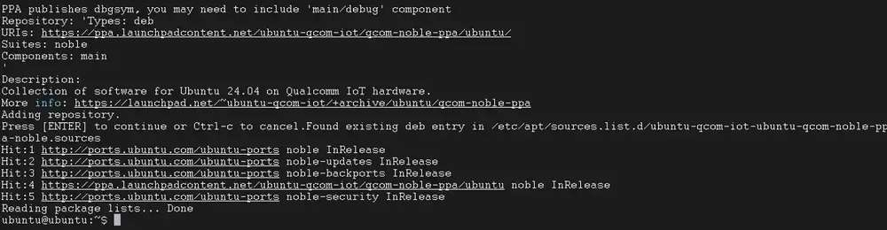
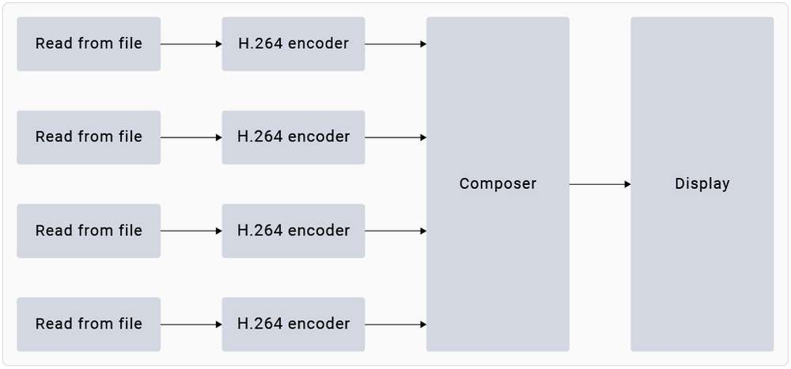
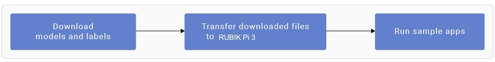
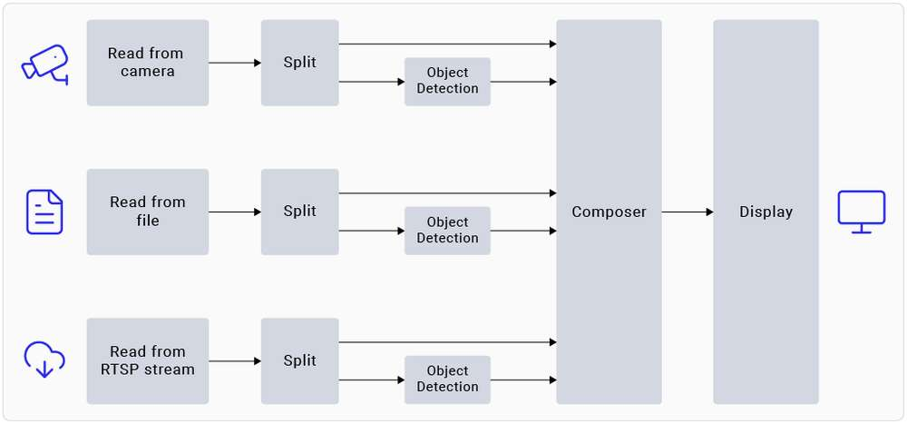
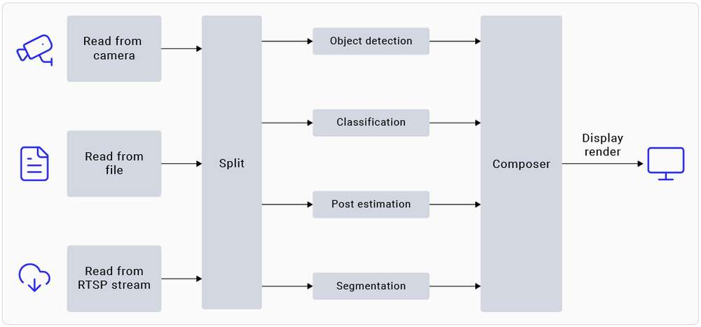

import Tabs from '@theme/Tabs';
import TabItem from '@theme/TabItem';

# 运行示例应用程序

魔方派 Ubuntu24.04 包括各种示例应用程序。相关详细信息，请参见 人工智能、摄像头软件、机器人开发章节。

您可以运行这些应用程序：


  * [运行多媒体示例程序](#runmediaapp)

  * [运行 AI 示例程序](#runsampleapp)

:::note

  * 运行应用程序可能会带来高负载运算，为了您更好的体验，请加装风扇。
  * 要运行多媒体和 AI 应用程序，请设置 Wi-Fi 并建立 SSH 连接。
  * 要查看显示输出，请将 HDMI 显示屏连接到魔方派 3  HDMI 端口（参见 [连接 HDMI 显示器](./1.quick-start/2.set-up-your-device.md#conHDMI)）。
  * 要启用音频，请参见魔方派 音频 章节。

:::

<a id="prererunsample"></a>
## 示例程序运行前提条件

在运行示例程序前，需要使能 Weston 显示，用来启用完整的摄像头和 AI 功能，使能步骤如下：

1. 将 Qualcomm PPA 添加到 Ubuntu 源

    1. 将 Qualcomm 公共个人软件包档案 (PPA) 添加到您的魔方派 3 Ubuntu 软件源。

   ```shell
   sudo add-apt-repository ppa:ubuntu-qcom-iot/qcom-noble-ppa
   ```

   

    2. 更新并安装依赖项。

   ```shell
   sudo apt update && sudo apt upgrade
   ```

2. 安装 Weston 并测试基本显示功能。

    1. 安装 Weston 和相关软件包。

   ```shell
   sudo apt install weston-autostart gstreamer1.0-qcom-sample-apps gstreamer1.0-tools qcom-fastcv-binaries-dev qcom-video-firmware weston-autostart libgbm-msm1 qcom-adreno1
   sudo reboot
   ```

   2. 以root用户身份设置显示环境。

   ```shell
   sudo -i
   export XDG_RUNTIME_DIR=/run/user/$(id -u ubuntu)
   ```

3. 插上HDMI屏幕，稍等片刻，Weston 桌面就会显示在屏幕上。

   :::note

   如果 Weston 桌面未正常显示，请尝试在魔方派终端中输入 `sudo dpkg-reconfigure weston-autostart` 命令。
   :::

4. 要测试图形，请运行示例应用。以下示例运行 Weston-simple-egl 示例。

   ```shell
   weston-simple-egl
   ```

   

<a id="runmediaapp"></a>
## 运行多媒体示例应用程序

多媒体示例应用程序展示了魔方派设备上的摄像头、显示器和视频流的用例。

<Tabs>
   <TabItem value="dashcam" label="多摄像头流传输或编码（行车记录仪）">

`gst-multi-camera-example` 命令行应用程序展示了从魔方派 3 设备上的两个摄像头传感器同时进行流传输。该应用程序将摄像头传输的流进行并排合成并显示在显示器上，或将视频流进行编码并存储到文件中。


**使用示例**

运行前请 [使能 Weston 显示](#prererunsample)，要启动应用程序，请从 SSH 终端运行以下用例：

1. 安装摄像头相关软件

    1. 将魔方派 PPA 添加到 Ubuntu 源，并更新软件包列表

       ```shell
       sudo sed -i '$a deb http://apt.rubikpi.ai ppa main' /etc/apt/sources.list
       sudo apt update
       ```

    2. 安装摄像头软件

       ```shell
       sudo apt install -y qcom-ib2c qcom-camera-server qcom-camx
       sudo apt install -y rubikpi3-cameras
       sudo chmod -R 755 /opt
       sudo mkdir -p /var/cache/camera/
       sudo touch /var/cache/camera/camxoverridesettings.txt
       sudo sh -c 'echo enableNCSService=FALSE >> /var/cache/camera/camxoverridesettings.txt'
       ```

2. 要在 HDMI 显示器上查看示例应用程序，请运行以下 export 命令：

    ```shell
    export XDG_RUNTIME_DIR=/run/user/$(id -u ubuntu)/ && export WAYLAND_DISPLAY=wayland-1
    ```

   :::note

    如果 Weston 未自动启用，请启动两个安全 shell 实例：一个用于启用 Weston，另一个用于运行应用程序。

    1. 要启用 Weston，请在第一个 shell 中运行以下命令：

        `export GBM_BACKEND=msm && export XDG_RUNTIME_DIR=/run/user/$(id -u ubuntu)/ && mkdir -p $XDG_RUNTIME_DIR && weston --continue-without-input --idle-time=0`

    2. 要设置 Wayland Display 环境，请在第二个 shell 中运行以下命令：

        `export XDG_RUNTIME_DIR=/run/user/$(id -u ubuntu)/ && export WAYLAND_DISPLAY=wayland-1`

   :::

3. 要查看 `waylandsink` 输出，请运行以下命令：

   ```shell
   gst-multi-camera-example -o 0
   ```

4. 要存储编码器输出，请执行以下操作：

    1. 运行以下命令：

       ```shell
       gst-multi-camera-example -o 1
       ```

       设备将编码后的文件分别存储在 `/opt/cam1_vid.mp4` 和 `/opt/cam2_vid.mp4` 中，分别用于摄像头 1 和摄像头 2。

    2. 要从主机提取文件，请运行以下命令：

        ```shell
        scp ubuntu@<IP address of target device>:/opt/cam1_vid.mp4 <destination directory>
        ```

    3. 要播放编码器输出，可以使用任何支持 MP4 文件的媒体播放器。

* 要停止用例，请按 **CTRL** + **C**。

* 要显示可用的帮助选项，可运行以下命令：

    ```shell
    gst-multi-camera-example --help
    ```

* `GST_DEBUG` 环境变量控制 GStreamer 调试输出。设置所需级别以允许日志记录。例如，要记录所有警告，可运行以下命令：

    ```shell
    export GST_DEBUG=2
    ```
</TabItem>
<TabItem value="wall" label="多通道视频解码与合成（视频墙）">

gst-concurrent-videoplay-composition 命令行应用程序允许对 AVC 编码的视频进行并发视频解码和播放，并将它们组合在显示器上用于视频墙应用。该应用程序至少需要一个输入视频文件，该文件应为 AVC codec 编码的 MP4 文件。



运行前请 [使能 Weston 显示](#prererunsample)，要启动应用程序，请从 SSH 终端运行以下用例：
1. 安装摄像头相关软件

    1. 将魔方派 PPA 添加到 Ubuntu 源，并更新软件包列表。

       ```shell
       sudo sed -i '$a deb http://apt.rubikpi.ai ppa main' /etc/apt/sources.list
       sudo apt update
       ```

    2. 安装摄像头软件。

       ```shell
       sudo apt install -y qcom-ib2c qcom-camera-server qcom-camx
       sudo apt install -y rubikpi3-cameras
       sudo chmod -R 755 /opt
       sudo mkdir -p /var/cache/camera/
       sudo touch /var/cache/camera/camxoverridesettings.txt
       sudo sh -c 'echo enableNCSService=FALSE >> /var/cache/camera/camxoverridesettings.txt'
      ```

2. 要将 AVC 编码的 MP4 (H.264) 格式的预先录制或测试视频（文件名为 `<file_name>`）传输到您的设备，可在主机上运行以下命令：

    ```shell
    scp <file_name> ubuntu@[DEVICE IP-ADDR]:/opt/
    ```

3. 要在 HDMI 显示器上查看示例应用程序，请从 SSH 终端运行以下 export 命令：

    ```shell
    export XDG_RUNTIME_DIR=/run/user/$(id -u ubuntu)/ && export WAYLAND_DISPLAY=wayland-1
    ```

:::note
如果 Weston 未自动启用，请启动两个安全 shell 实例：一个用于启用 Weston，另一个用于运行应用程序。

    1. 要启用 Weston，请在第一个 shell 中运行以下命令：
   
        `export GBM_BACKEND=msm && export XDG_RUNTIME_DIR=/run/user/$(id -u ubuntu)/ && mkdir -p $XDG_RUNTIME_DIR && weston --continue-without-input --idle-time=0`

    2. 要设置 Wayland Display 环境，请在第二个 shell 中运行以下命令：
   
        `export XDG_RUNTIME_DIR=/run/user/$(id -u ubuntu)/ && export WAYLAND_DISPLAY=wayland-1`

:::

1. 要启动四通道并发播放，请运行以下命令：

```shell
gst-concurrent-videoplay-composition -c 4 -i /opt/<file_name1>.mp4 -i /opt/<file_name2>.mp4 -i /opt/<file_name3>.mp4 -i /opt/<file_name4>.mp4
```

:::note

 * `-c`：指定要解码并合成的流的数量，可以是 2、4 或 8。

 * `-i`：指定输入视频文件的绝对路径。
:::

* 要停止用例，请按 &#x73;**&#x20;Ctrl** + **C**。
* 要显示可用的帮助选项，请运行以下命令：

```shell
gst-concurrent-videoplay-composition --help
```

* `GST_DEBUG` 环境变量控制 GStreamer 调试输出。设置所需级别以允许记录日志。例如，要记录所有警告，可运行以下命令：

```shell
export GST_DEBUG=2
```
</TabItem>
</Tabs>

<a id="runsampleapp"></a>
## 运行 AI 示例应用程序

AI 示例应用程序展示了在魔方派 3 设备上对来自摄像头、视频文件或实时流传输协议 (RTSP) 流的输入流进行对象检测和并行推理的用例。要运行这些示例应用程序，您必须从 [Qualcomm® AI Hub](https://aihub.qualcomm.com/iot/models) 获取 AI 模型并从 GitHub 获取标签。该过程包括下载模型和标签、将它们传输到魔方派 3 设备以及运行示例应用程序。



**前提条件**

设备上需要有模型和标签文件才能运行 AI 示例应用程序。

<a id="proced"></a>
**步骤**

运行前请 [使能 Weston 显示](#prererunsample)，要启动应用程序，请从 SSH 终端运行以下用例：

1. 安装摄像头相关软件

    1. 将魔方派 PPA 添加到 Ubuntu 源，并更新软件包列表。

       ```shell
       sudo sed -i '$a deb http://apt.rubikpi.ai ppa main' /etc/apt/sources.list
       sudo apt update
       ```

    2. 安装摄像头软件。

       ```shell
       sudo apt install -y qcom-ib2c qcom-camera-server qcom-camx
       sudo apt install -y rubikpi3-cameras
       sudo chmod -R 755 /opt
       sudo mkdir -p /var/cache/camera/
       sudo touch /var/cache/camera/camxoverridesettings.txt
       sudo sh -c 'echo enableNCSService=FALSE >> /var/cache/camera/camxoverridesettings.txt' 
       ```

2. 您需要以下用于 AI 示例应用程序的模型：

    | Sample Application         | Required Model                          | Required label file          |
    |----------------------------|-----------------------------------------|------------------------------|
    | AI object detection        | yolov8_det_quantized.tflite             | yolonas.labels               |
    | Parallel AI inference      | yolov8_det_quantized.tflite             | yolov8.labels                |
    | Parallel AI inference      | inception_v3_quantized.tflite           | classification.labels        |
    | Parallel AI inference      | hrnet_pose_quantized.tflite             | hrnet_pose.labels            |
    | Parallel AI inference      | deeplabv3_plus_mobilenet_quantized.tflite | deeplabv3_resnet50.labels    |

3. 下载并运行自动化脚本以获取设备上的模型和标签文件：

    ```shell
    curl -L -O https://raw.githubusercontent.com/quic/sample-apps-for-qualcomm-linux/refs/heads/main/download_artifacts.sh
    ```

    ```shell
    chmod +x download_artifacts.sh
    ```

    ```shell
    ./download_artifacts.sh -v GA1.4-rel -c QCS6490
    ```

:::note

 YOLOv8 模型不是脚本的一部分。您需要使用 Qualcomm AI Hub API 导出这些模型。

:::

4. 从 Qualcomm AI Hub 导出 YOLOv8。


     按照这些说明，将模型导出到您的主机上。您还可以通过 Windows Subsystem for Linux (WSL) 在 Windows 上运行这些指令，或在 macOS 上设置 Ubuntu 22.04 虚拟机。有关更多详细信息，请参阅虚拟机搭建指南。&#x20;

       1. 获取用于导出模型的 shell 脚本：

          ```shell
          wget https://raw.githubusercontent.com/quic/sample-apps-for-qualcomm-linux/refs/heads/main/scripts/export_model.sh
          ```

        2. 更新脚本权限以使其可执行：

           ```shell
           chmod +x export_model.sh
           ```

       3. 使用您的 Qualcomm AI Hub API 令牌作为 --api-token 参数的值运行 export 脚本：

          ```shell
          ./export_model.sh --api-token=<Your AI Hub API Token>
          ```

       :::note

       您可以在 [account settings](https://app.aihub.qualcomm.com/account/) 中找到您的 Qualcomm AI Hub API 令牌。

       :::

        4. 该脚本会将模型下载到 build 目录。使用以下命令将这些模型复制到设备的 */etc/models/* 目录：

             ```shell
             scp <working directory>/build/yolonas_quantized/yolonas_quantized.tflite ubuntu@<IP address of target device>:/etc/models/
             ```

             ```shell
             scp <working directory>/build/yolov8_det_quantized/yolov8_det_quantized.tflite ubuntu@<IP address of target device>:/etc/models/
             ```


5. 更新 JSON 文件中量化 LiteRT 模型的 `q_offset` 和 `q_scale` 常量。有关说明，请参阅获取模型常量。

6. 使用以下命令将下载的模型文件推送到设备上：

    ```shell
    scp <model filename> ubuntu@<IP addr of the target device>:/etc/models
    ```

    示例：

      ```shell
      wget https://thundercomm.s3.dualstack.ap-northeast-1.amazonaws.com/uploads/web/rubik-pi-3/tools/rubikpi3_ai_sample_apps_models_labels.zip
      unzip rubikpi3_ai_sample_apps_models_labels.zip
      cd rubikpi3_ai_sample_apps_models_labels
      scp inception_v3_quantized.tflite ubuntu@<IP addr of the target device>:/etc/models/
      scp yolonas.labels ubuntu@<IP addr of the target device>:/etc/labels/
      ```

7. 使用以下命令为测试视频创建目录：

    ```shell
    ssh ubuntu@<ip-addr of the target device>
    ```

    ```shell
    mount -o remount, rw /usr
    ```

    ```shell
    mkdir /etc/media/
    ```

8. 从主机将测试视频文件推送到设备：

    ```shell
    scp <filename>.mp4 ubuntu@<IP address of target device>:/etc/media/
    ```


<Tabs>
<TabItem value="AIobject" label="AI 目标检测">

gst-ai-object-detection 示例应用程序展示了对来自摄像头、视频文件或 RTSP 流的输入流执行目标检测的硬件能力。该 pipeline 接收输入流，对其进行预处理，在 AI 硬件上运行推理，并在屏幕上显示结果。




**使用示例**

必须将模型和标签文件推送到设备才能运行示例应用程序。有关详细信息，请参阅 [过程](#proced)。

1. 开始新的 SSH 会话并启动 HDMI 显示器（如果尚未启动）：

    ```xml
    ssh ubuntu@<ip-addr of the target device>
    ```

2. 要在 HDMI 显示器上查看示例应用程序，请从 SSH 终端运行以下 export 命令：

    ```typescript
    export XDG_RUNTIME_DIR=/run/user/$(id -u ubuntu)/ && export WAYLAND_ DISPLAY=wayland-1
    ```

:::note

如果 Weston 未自动启用，请启动两个安全 shell 实例：一个用于启用 Weston，另一个用于运行应用程序。

    1. 要启用 Weston，请在第一个 shell 中运行以下命令：
   
        `export GBM_BACKEND=msm && export XDG_RUNTIME_DIR=/run/user/$(id -u ubuntu)/ && mkdir -p $XDG_RUNTIME_DIR && weston --continue-without-input --idle-time=0`

    2. 要设置 Wayland Display 环境，请在第二个 shell 中运行以下命令：
   
        `export XDG_RUNTIME_DIR=/run/user/$(id -u ubuntu)/ && export WAYLAND_DISPLAY=wayland-1`
:::

3. 编辑您设备上的 `/etc/configs/config_detection.json` 文件。

```json
{
   "file-path": "/etc/media/video.mp4",
   "ml-framework": "tflite",
   "yolo-model-type": "yolov8",
   "model": "/etc/models/yolov8_det_quantized.tflite",
   "labels": "/etc/labels/yolonas.labels",
   "constants": "YOLOv8,q-offsets=<21.0, 0.0, 0.0>,q-scales=<3.0546178817749023, 0.003793874057009816, 1.0>;",
   "threshold": 40,
   "runtime": "dsp"
}
```
| 字段           | 值/描述             |
|-----------------|--------------------|
| **ml-framework** | |
| snpe           | 使用 Qualcomm® Neural Processing SDK 模型 |
| tflite         | 使用 LiteRT 模型 |
| qnn            | 使用 Qualcomm® AI Engine direct 模型 |
| **yolo-model-type** | |
| yolov5 yolov8 yolonas | 分别运行 YOLOv5、YOLOv8 和 YOLO-NAS 模型。参见示例模型和标签文件。 |
| **runtime** | |
| cpu            | 在 CPU 上运行 |
| gpu            | 在 GPU 上运行 |
| dsp            | 在数字信号处理器 (DSP) 上运行 |
| **Input source** | |
| camera         | <p>0 – 主摄像头</p><p>1 – 辅助摄像头</p> |
| file-path      | 视频文件的目录路径。 |
| rtsp-ip-port   | RTSP 流的地址，格式为 `rtsp://<ip>:/<stream>` |

4. 要启动应用程序，请运行以下命令：

    ```python
    gst-ai-object-detection
    ```

* 要停止用例，请按&#x73;**&#x20;Ctrl** + **C**.

* 要显示可用的帮助选项，请运行以下命令：

    ```python
    gst-ai-object-detection -h
    ```

* `GST_DEBUG` 环境变量控制 GStreamer 调试输出。设置所需级别以允许记录日志。例如，要记录所有警告，可运行以下命令：

    ```c++
    export GST_DEBUG=2
    ```
</TabItem>

<TabItem value="parallelAI" label="并行 AI 推理">

gst-ai-parallel-inference 命令行应用程序演示了对来自摄像头、视频文件或 RTSP 流的输入流执行四个并行 AI 推理的硬件功能。该 pipeline 检测目标、对目标进行分类、检测姿态、并在输入流上分割图像。屏幕并排显示结果。




**使用示例**

必须将模型和标签文件推送到设备才能运行示例应用程序。有关详细信息，请参阅 [程序](#proced).

1. 开始新的 SSH 会话并启动 HDMI 显示器（如果尚未启动）：

```xml
ssh ubuntu@<ip-addr of the target device>
```

2. 要在 HDMI 显示器上查看示例应用程序，请从 SSH 终端运行以下 export 命令：

```typescript
export XDG_RUNTIME_DIR=/run/user/$(id -u ubuntu)/ && export WAYLAND_ DISPLAY=wayland-1
```

:::note

如果 Weston 未自动启用，请启动两个安全 shell 实例：一个用于启用 Weston，另一个用于运行应用程序。

    1. 要启用 Weston，请在第一个 shell 中运行以下命令：
        `export GBM_BACKEND=msm && export XDG_RUNTIME_DIR=/run/user/$(id -u ubuntu)/ && mkdir -p $XDG_RUNTIME_DIR && weston --continue-without-input --idle-time=0`

    2. 要设置 Wayland Display 环境，请在第二个 shell 中运行以下命令：
        `export XDG_RUNTIME_DIR=/run/user/$(id -u ubuntu)/ && export WAYLAND_DISPLAY=wayland-1`

:::

3. 使用以下命令将下载的模型文件推送到设备上：

```shell
scp <model filename> ubuntu@<IP addr of the target device>:/etc/models
```

示例

```shell
wget https://thundercomm.s3.dualstack.ap-northeast-1.amazonaws.com/uploads/web/rubik-pi-3/tools/rubikpi3_ai_sample_apps_models_labels.zip
unzip rubikpi3_ai_sample_apps_models_labels.zip
cd rubikpi3_ai_sample_apps_models_labels
scp yolov8_det_quantized.tflite ubuntu@<IP addr of the target device>:/etc/models/
scp yolov8.labels ubuntu@<IP addr of the target device>:/etc/labels/

scp inception_v3_quantized.tflite ubuntu@<IP addr of the target device>:/etc/models/
scp classification.labels ubuntu@<IP addr of the target device>:/etc/labels/

scp hrnet_pose_quantized.tflite ubuntu@<IP addr of the target device>:/etc/models/
scp hrnet_pose.labels ubuntu@<IP addr of the target device>:/etc/labels/

scp deeplabv3_plus_mobilenet_quantized.tflite ubuntu@<IP addr of the target device>:/etc/models/
scp deeplabv3_resnet50.labels ubuntu@<IP addr of the target device>:/etc/labels/
```

4. 要启动应用程序，请运行以下命令：

```plain&#x20;text
gst-ai-parallel-inference
```

* 要停止用例，请按&#x73;**&#x20;Ctrl** + **C**.

* 要显示可用的帮助选项，请运行以下命令：

```plain&#x20;text
gst-ai-parallel-inference -h
```

* Qualcomm AI Hub 经常使用最新的 SDK 版本更新模型。使用错误的模型常量可能会导致结果不准确。如果您遇到此类问题，请更新模型常量。可以使用以下命令为示例应用程序提供模型常量：

```python
gst-ai-parallel-inference -s /etc/media/video.mp4 \
--object-detection-constants="YOLOv8,q-offsets=<21.0, 0.0, 0.0>,q-scales=<3.0546178817749023, 0.003793874057009816, 1.0>;" \
--pose-detection-constants="Posenet,q-offsets=<8.0>,q-scales=<0.0040499246679246426>;" \
--segmentation-constants="deeplab,q-offsets=<0.0>,q-scales=<1.0>;" \
--classification-constants="Inceptionv3,q-offsets=<38.0>,q-scales=<0.17039915919303894>;"
```

* `GST_DEBUG` 环境变量控制 GStreamer 调试输出。设置所需级别以允许记录日志。例如，要记录所有警告，可运行以下命令：

```c++
export GST_DEBUG=2
```

已知问题

在姿态检测中，即使帧中有多个人，模型也只检测一个人。

:::note

使用 Inception v3 模型的图像分类是在 ImageNet 数据集上进行训练的。因此，由于该类不包含在数据集中，因此模型无法检测到人。

:::
</TabItem>
</Tabs>

## 更多应用程序

发布版本提供了各种示例应用程序。要了解更多信息，请参阅 人工智能、摄像头软件、机器人开发章节。
