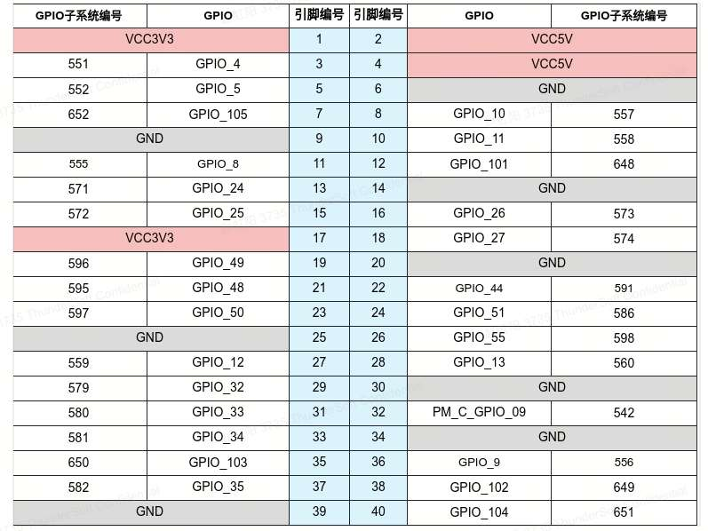
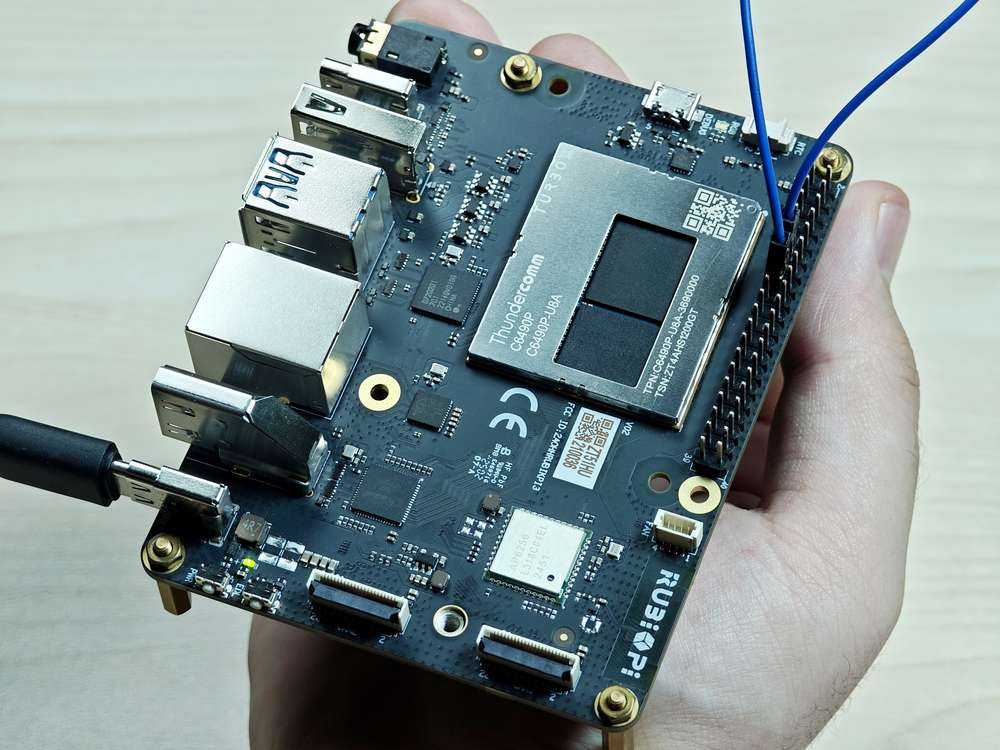
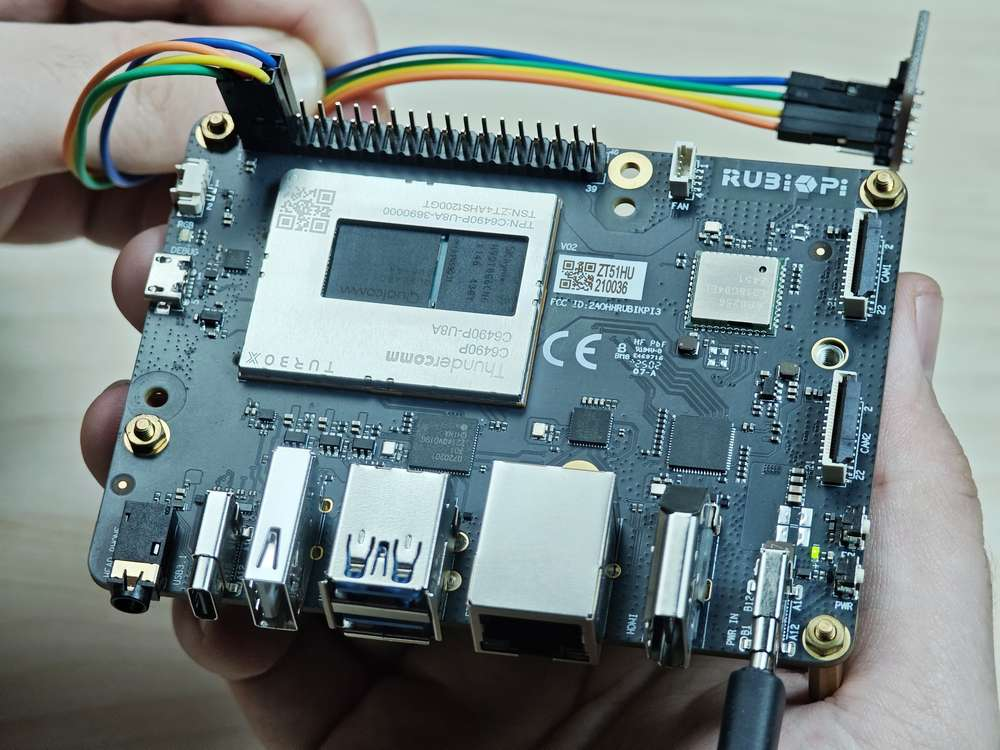
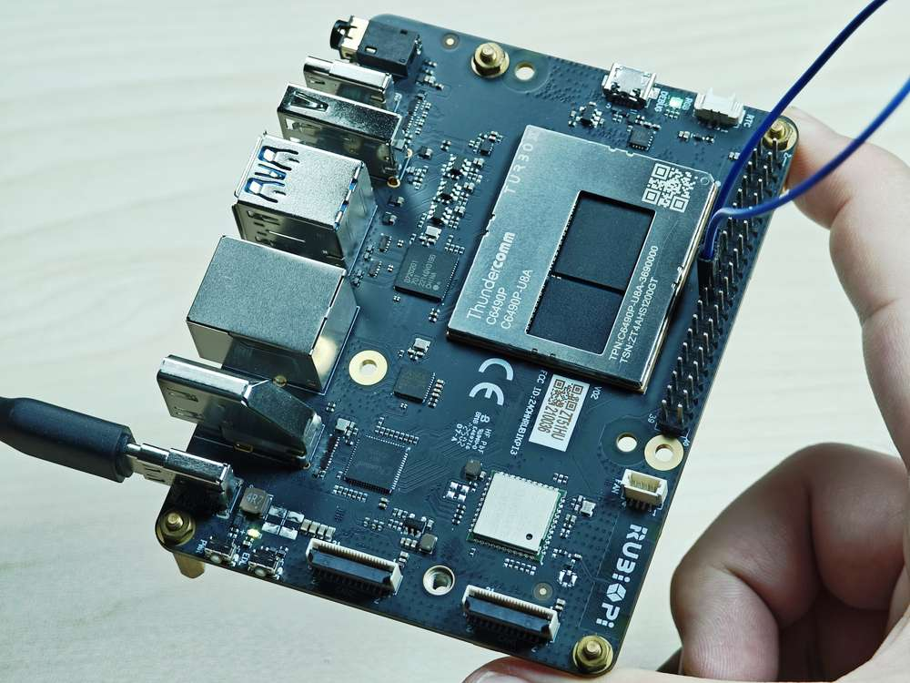
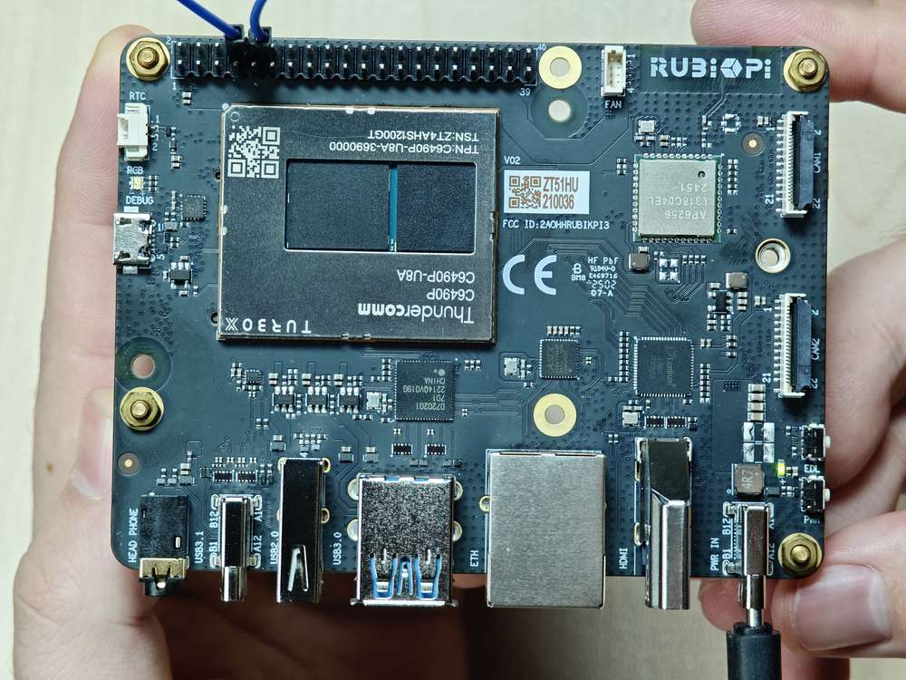

import Tabs from '@theme/Tabs';
import TabItem from '@theme/TabItem';


# 40 pin 连接器

## GPIO

魔方派 3 适配了 WiringRP（基于高性能 GPIO 编程库 WiringPi），推荐使用 WiringRP 来控制 GPIO，和对 GPIO 编程。关于 WiringRP 详细信息可访问 https://github.com/rubikpi-ai/WiringRP 查看。

### 引脚分布

下图是魔方派 3 40-pin 连接器的引脚默认功能，其中大部分引脚和开源开发板 40-pin 连接器引脚的默认功能兼容。


下表是 40-pin连接器支持的所有功能，图中蓝色字体表明默认功能。


### 使用 GPIO

在魔方派 3 中可以使用 shell 命令，或使用编程语言来控制 GPIO。

<Tabs>
    <TabItem value="GPIO Shell" label="Shell 命令" default>
    在魔方派 3 中执行下面的步骤控制 GPIO。
    :::note
    下面的命令需要 root 权限。

    * 使用 `sudo su` 命令切换到 root 权限用户。
    :::
    
    * 使用 WiringRP 相关命令

        使用前需按下面方法安装 WiringRP：

        1. 将魔方派公共个人软件档案（PPA）添加到您的魔方派 3 Ubuntu 软件源。
        ```shell
         REPO_ENTRY="deb http://apt.thundercomm.com/rubik-pi-3/noble ppa main"
         if ! grep -q "^[^#]*$REPO_ENTRY" /etc/apt/sources.list; then
            sudo sed -i '$a deb http://apt.thundercomm.com/rubik-pi-3/noble ppa main' /etc/apt/sources.list
         fi
         sudo apt update
         ```
        2. 执行下面命令安装 WiringRP.
        ```shell
        sudo apt install wiringrp
        ```

        安装完成后可以使用下面命令操作 GPIO：

        * 查看 GPIO 状态

        ```shell
        gpio readall
        ```

        
        * 设置 GPIO 模式

        ```shell
        gpio mode 15 in             # 将15号引脚模式置为输入
        gpio pins                   # 查看更改之后的状态
        gpio mode 15 out            # 将15号引脚模式置为输出
        gpio pins                   # 查看更改之后的状态
        ```

        * 设置引脚电平

        ```shell
        gpio write 15 1             # 将15号引脚置为高电平
        gpio read 15                # 读取更改后引脚状态
        gpio write 15 0             # 将15号引脚置为低电平
        gpio read 15                # 读取更改后引脚状态
        ```

    * 操作 */sys/class/gpio* 下相关节点
        GPIO 子系统的编号如下表。

        

        1. 进入 */sys/class/gpio* 目录：

        ```
        cd /sys/class/gpio
        ```

        2. 将要控制的 GPIO 导出，如控制 13 号引脚 GPIO_24：
        ```
        echo 571 > export
        ```

        3. 进入到 gpio571 目录设置 GPIO 属性：

        ```
        cd gpio571
        ls
        ```
        

        - direction（方向）：

            - 输入：in
            - 输出：out
        - value（值）：
            - 低电平：0
            - 高电平：1
        - edge （中断边沿）：
            - 上升沿触发：rising
            - 下降沿触发：falling
            - 双边沿触发：both
            - 禁用中断：none

        4. 如设置 13 号引脚输出高电平：

        ```
        echo out > direction
        echo 1 > value
        ```
        5. 取消导出 13 号引脚到用户空间：

        ```
        cd ..
        echo 571 > unexport
        ```

    </TabItem>
    <TabItem value="GPIO WiringRP-c" label="WiringRP" default>
        WiringRP 库中提供了一系列的 API 函数，用更少的逻辑实现控制。

        使用前需按下面方法安装 WiringRP：

        1. 将魔方派公共个人软件档案（PPA）添加到您的魔方派 3 Ubuntu 软件源。
        ```shell
         REPO_ENTRY="deb http://apt.thundercomm.com/rubik-pi-3/noble ppa main"
         if ! grep -q "^[^#]*$REPO_ENTRY" /etc/apt/sources.list; then
         sudo sed -i '$a deb http://apt.thundercomm.com/rubik-pi-3/noble ppa main' /etc/apt/sources.list
         fi
         sudo apt update
        ```
        2. 执行下面命令安装 WiringRP.
        ```shell
        sudo apt install wiringrp
        ```

        以下代码示例，代码将 13 号引脚设置为输出， 15 号引脚设置为输入，循环检测 15 号引脚的电平状态：

        ```c
        #include <stdio.h>
        #include <wiringPi.h>

        int main (void)
        {
          wiringPiSetup () ;
          pinMode (13, OUTPUT) ;
          pinMode (15, INPUT) ;

          for (;;)
          {
            digitalWrite (13, HIGH) ;        // On
            printf("%d\n", digitalRead (15));        // On
            delay (1000) ;                // mS
            digitalWrite (13, LOW) ;        // Off
            printf("%d\n", digitalRead (15));        // On
            delay (1900) ;
          }

          return 0 ;
        }

        ```
        在魔方派 3 中编译程序

          ```shell
          gcc gpio.c -o gpio -lwiringPi
          ```

          :::note
          若无 gcc 命令，可执行 `apt install gcc` 命令进行安装。
          :::

        将 13 和 15 号引脚使用杜邦线短接，测试 GPIO 电平控制和电平读取情况，如下图所示：
        :::warning
        注意引脚顺序，请勿将电源和地引脚短接，否则可能会造成板子损坏。
        :::

        

        运行如下命令：

        ```shell
        ./gpio
        ```

        程序运行结果如下：

        

    </TabItem>

    <TabItem value="GPIO C" label="C" default>
        以下代码示例，代码将 13 号引脚设置为输出， 15 号引脚设置为输入，循环检测 15 号引脚的电平状态：
        ```c
        #include <stdio.h>
        #include <stdlib.h>
        #include <unistd.h>

        int out_gpio = 571;
        int in_gpio = 572;

        int main() {
            char export_path[50] = {};
            char export_command[100] = {};
            snprintf(export_path, sizeof(export_path), "/sys/class/gpio/export");
            snprintf(export_command, sizeof(export_command), "echo %d > %s ", out_gpio, export_path);
            system(export_command);
            snprintf(export_command, sizeof(export_command), "echo %d > %s ", in_gpio, export_path);
            system(export_command);

            char direction_path[50] = {};
            snprintf(direction_path, sizeof(direction_path), "/sys/class/gpio/gpio%d/direction", out_gpio);
            FILE *direction_file = fopen(direction_path, "w");
            if (direction_file == NULL) {
                perror("Failed to open GPIO direction file");
                return -1;
            }
            fprintf(direction_file, "out");
            fclose(direction_file);

            snprintf(direction_path, sizeof(direction_path), "/sys/class/gpio/gpio%d/direction", in_gpio);
            direction_file = fopen(direction_path, "w");
            if (direction_file == NULL) {
                perror("Failed to open GPIO direction file");
                return -1;
            }
            fprintf(direction_file, "in");
            fclose(direction_file);

            char value_in_path[50] = {};
            char value_out_path[50] = {};
            char cat_command[100] = {};
            snprintf(value_out_path, sizeof(value_out_path), "/sys/class/gpio/gpio%d/value", out_gpio);
            snprintf(value_in_path, sizeof(value_in_path), "/sys/class/gpio/gpio%d/value", in_gpio);
            snprintf(cat_command, sizeof(cat_command), "cat %s", value_in_path);

            FILE *value_out_file = fopen(value_out_path, "w");
            if (value_out_file == NULL) {
                perror("Failed to open GPIO value file");
                return -1;
            }

            for (int i = 0; i < 5; i++) {
                fprintf(value_out_file, "1");
                fflush(value_out_file);

                system(cat_command);
                sleep(1);

                fprintf(value_out_file, "0");
                fflush(value_out_file);

                system(cat_command);
                sleep(1);
            }

            fclose(value_out_file);

            char unexport_path[50] = {};
            char unexport_command[100] = {};
            snprintf(unexport_path, sizeof(unexport_path), "/sys/class/gpio/unexport");
            snprintf(unexport_command, sizeof(unexport_command), "echo %d > %s ", out_gpio, unexport_path);
            system(unexport_command);
            snprintf(unexport_command, sizeof(unexport_command), "echo %d > %s ", in_gpio, unexport_path);
            system(unexport_command);

            return 0;
        }

        ```
        在魔方派 3 中编译程序：


        ```shell
        gcc gpio.c -o gpio
        ```
        :::note
        若无 gcc 命令，可执行 `apt install gcc` 命令进行安装。
        :::

        将 13 和 15 号引脚使用杜邦线短接，测试 GPIO 电平控制和电平读取情况，如下图所示：

        :::warning
        注意引脚顺序，请勿将电源和地引脚短接，否则可能会造成板子损坏。
        :::

        

        运行如下命令：

        ```shell
        ./gpio
        ```

        程序运行结果如下：

        

    </TabItem>
    <TabItem value="GPIO python" label="Python" default>
        可使用 Python 的 periphery 库控制 GPIO，可在魔方派 3 中使用下面命令进行安装：

        ```shell
        apt install python3-pip
        apt install python3-periphery
        ```

        下方截取代码是使用 periphery 库操作 GPIO 的示例，其中将 13 号引脚设置为输出，15 号引脚设置为输入，循环检测 15 号引脚的电平状态。
        ```python
        from periphery import GPIO
        import time

        out_gpio = GPIO(571, "out")
        in_gpio = GPIO(572, "in")

        try:
            while True:
                try:
                    out_gpio.write(True)
                    pin_level = in_gpio.read()
                    print(f"in_gpio level: {pin_level}")

                    out_gpio.write(False)
                    pin_level = in_gpio.read()
                    print(f"in_gpio level: {pin_level}")

                    time.sleep(1)

                except KeyboardInterrupt:
                    out_gpio.write(False)
                    break

        except IOError:
            print("Error")

        finally:
            out_gpio.close()
            in_gpio.close()
        ```
        将 13 和 15 号引脚使用杜邦线短接测试 GPIO 电平控制和电平读取情况，如下图所示：

        :::warning
        >
        > 注意引脚顺序，请勿将电源和地引脚短接，否则可能会造成板子损坏。
        :::

        

        运行如下命令：

        ```shell
        python3 gpio.py
         ```
        程序运行结果如下：
        
        

    </TabItem>
</Tabs>


## I2C

I2C 是飞利浦公司在 20 世纪 80 年代开发的一种双向 2 线制总线，用于实现高效的 IC 间控制总线。总线上的每个设备都有其唯一的地址（由飞利浦公司领导的 I2C 总机构注册）。I2C 核心支持多控制器模式，以及 10 位目标地址和 10 位可扩展地址。关于 I2C 的更多信息，请参阅 https://www.i2c-bus.org/fileadmin/ftp/i2c_bus_specification_1995.pdf


魔方派 3 适配了 WiringRP（基于高性能 GPIO 编程库 WiringPi ） ，推荐使用 WiringRP 来控制 I2C，和对 I2C 编程。关于 WiringRP 详细信息可访问 https://github.com/rubikpi-ai/WiringRP 查看。

### 引脚分布

下图是魔方派 3 40-pin 连接器的引脚默认功能，其中大部分引脚和开源开发板 40-pin 连接器引脚的默认功能兼容。


:::note
3 号引脚和 5 号引脚默认已设置配为 I2C1。
:::

下表是 40-pin 连接器支持的所有功能，图中蓝色字体表明默认功能。


### 使用 I2C

在魔方派 3 中可以使用 shell 命令，或使用编程语言来控制 I2C 总线。

<Tabs>
    <TabItem value="I2C Shell" label="Shell 命令" default>
        在魔方派 3 中执行下面步骤控制 I2C 总线。
        使用 WiringRP 相关命令前使用下面方法安装：

        1. 将魔方派公共个人软件档案（PPA）添加到您的魔方派 3 Ubuntu 软件源。
        ```shell
        REPO_ENTRY="deb http://apt.thundercomm.com/rubik-pi-3/noble ppa main"
        if ! grep -q "^[^#]*$REPO_ENTRY" /etc/apt/sources.list; then
            sudo sed -i '$a deb http://apt.thundercomm.com/rubik-pi-3/noble ppa main' /etc/apt/sources.list
        fi
        sudo apt update
        ```
        2. 执行下面命令安装 WiringRP库。
        ```shell
        sudo apt install wiringrp
        ```

        * 使用 WiringRP 相关命令：

            ```shell
            ./gpio -x ads1115:100:10 aread 100     #通过 I2C 总线读取 ADS1115 设备的模拟信号值
            ```
        * 使用 i2cdetect 工具

            * 查看 I2C1 接口上的设备：

              ```shell
              i2cdetect -a -y -r 1
              ```

            * 读取地址为 0x38 设备的全部寄存器：

              ```shell
              i2cdump -f -y 1 0x38
              ```

            * 向地址为 0x38 设备的 0x01 寄存器地址写入 0xaa：

              ```shell
              i2cset -f -y 1 0x38 0x01 0xaa
              ```

            * 读取地址为 0x38 的设备，寄存器地址为0x01处的数值：

              ```shell
              i2cget -f -y 1 0x38 0x01
              ```

        :::note
        若无 `i2cdetect` 等命令，可执行 `apt install i2c-tools` 命令进行安装。
        :::


    </TabItem>
    <TabItem value="I2C WiringRP-c" label="WiringRP" default>
        WiringRP 库中提供了一系列的 API函数，用更少的逻辑实现控制。

        使用前需按下面方法安装 WiringRP：

        1. 将魔方派公共个人软件档案（PPA）添加到您的魔方派 3 Ubuntu 软件源。
        ```shell
         REPO_ENTRY="deb http://apt.thundercomm.com/rubik-pi-3/noble ppa main"
         if ! grep -q "^[^#]*$REPO_ENTRY" /etc/apt/sources.list; then
         sudo sed -i '$a deb http://apt.thundercomm.com/rubik-pi-3/noble ppa main' /etc/apt/sources.list
         fi
         sudo apt update
        ```
        2. 执行下面命令安装 WiringRP.
        ```shell
        sudo apt install wiringrp
        ```

        以下代码示例，I2C1总线和地址为0x38的设备进行通信，向设备0x01地址处写入0xaa：

        ```c
        #include <wiringPi.h>
        #include <wiringPiI2C.h>
        #include <stdio.h>
        #include <stdlib.h>
        #include <unistd.h>

        #define I2C_ADDRESS 0x38

        int main(void)
        {
            int fd;

            if (wiringPiSetup() == -1) {
                exit(1);
            }

            fd = wiringPiI2CSetup(1, I2C_ADDRESS);
            if (fd == -1) {
                exit(1);
            }

            unsigned char data[2];
            if (read(fd, data, 2) != 2) {
                exit(1);
            }

            wiringPiI2CWriteReg8(fd, 0x01, 0xaa) ;

            close(fd);
            return 0;
        }
        ```
        魔方派 3 中编译程序：

        ```shell
        gcc i2c.c -o i2c -lwiringPi
        ```

        :::note
        若无 gcc 命令，可执行 `apt install gcc` 命令进行安装。
        :::

        将 3 和 5 号引脚连接 I2C 传感器，验证 I2C 总线通信，如下图所示

        :::warning
        注意引脚顺序，请勿将电源和地引脚短接，否则可能会造成板子损坏。
        :::

        

        运行如下命令运行程序：

        ```shell
        ./i2c
        ```
    </TabItem>
    
    <TabItem value="I2C C" label="C" default>
        以下代码示例，I2C1 总线和地址为 0x38 的设备进行通信，向设备 0x01 地址处写入 0xaa：
        ```c
        #include <stdio.h>
        #include <stdlib.h>
        #include <stdint.h>
        #include <fcntl.h>
        #include <unistd.h>
        #include <linux/i2c-dev.h>
        #include <sys/ioctl.h>

        #define I2C_DEVICE_PATH "/dev/i2c-1"

        int main() {
            uint8_t data[2] = {0x01,0xaa};

            const char *i2c_device = I2C_DEVICE_PATH;
            int i2c_file;

            if ((i2c_file = open(i2c_device, O_RDWR)) < 0) {
                perror("Failed to open I2C device");
                return -1;
            }

            ioctl(i2c_file, I2C_TENBIT, 0);
            ioctl(i2c_file, I2C_RETRIES, 5);
            printf("i2cdetect addr : ");
            for (int x = 0; x < 0x7f; x++)
            {
                if (ioctl(i2c_file, I2C_SLAVE, x) < 0) {
                    perror("Failed to set I2C slave address");
                    close(i2c_file);
                    return -1;
                }

                if (write(i2c_file, data, 2) == 2)
                {
                    printf("0x%x,", x);
                }
            }

            close(i2c_file);
            printf("\r\n");

            return 0;
        }
        ```

        在魔方派 3 中编译

        ```shell
        gcc i2c.c -o i2c
        ```

        :::note
        若无 gcc 命令，可执行 `apt install gcc` 命令进行安装。
        :::


        将 3 和 5 号引脚连接 I2C 传感器，验证 I2C 总线通信，如下图所示：

        :::warning
        注意引脚顺序，请勿将电源和地引脚短接，否则可能会造成板子损坏。
        :::

        

        运行如下命令：

        ```shell
        ./i2c
        ```

        程序运行结果如下：

        

    </TabItem>
    <TabItem value="I2C python" label="Python" default>
        可使用 Python 的 smbus 库控制 I2C，可在魔方派 3 中使用下面命令进行安装：

        ```shell
        apt install python3-smbus
        ```
        以下代码示例，使用 I2C1 总线和地址为 0x38 的设备进行通信，向设备 0x01 地址处写入 0xaa：

        ```python
        import smbus

        def main():
            data = [0x01, 0xaa]

            try:
                i2c_bus = smbus.SMBus(1)

                print("i2cdetect addr : ", end="")
                for address in range(0x7F):
                    try:
                        i2c_bus.write_i2c_block_data(address, 0, data)
                        print("0x{:02X},".format(address), end="")
                    except OSError:
                        pass

                print()

            except Exception as e:
                print(f"An error occurred: {e}")

            finally:
                if i2c_bus:
                    i2c_bus.close()

        if __name__ == "__main__":
            main()

        ```

        将 3 和 5 号引脚连接 I2C 传感器，验证 I2C 总线通信，如下图所示：
        :::warning
        注意引脚顺序，请勿将电源和地引脚短接，否则可能会造成板子损坏。
        :::

        

        运行如下命令：

        ```shell
        python3 i2c.py
        ```

        程序运行结果如下：

         

    </TabItem>
</Tabs>


## SPI

串行外设接口 (SPI) 是在全双工模式下工作的同步串行数据链路。SPI 又称为 4 线制串行总线。

魔方派 3 适配了 WiringRP（基于高性能 GPIO 编程库 WiringPi），推荐使用 WiringRP 来控制 SPI，和对 SPI 编程。关于 WiringRP 详细信息可访问 https://github.com/rubikpi-ai/WiringRP 查看。

### 引脚分布

下图是魔方派 3 40-pin 连接器的引脚默认功能，其中大部分引脚和开源开发板 40-pin 连接器引脚的默认功能兼容。


:::note
 19 号、21 号、23 号、24 号引脚默认已设置配为 SPI。
:::

下表是 40-pin 连接器支持的所有功能，图中蓝色字体表明默认功能。


### 使用 SPI

<Tabs>
    <TabItem value="SPI WiringRP-c" label="WiringRP" default>
        WiringRP 库中提供了一系列的 API 函数，用更少的逻辑实现控制。

        使用前需按下面方法安装 WiringRP：

        1. 将魔方派公共个人软件档案（PPA）添加到您的魔方派 3 Ubuntu 软件源。
        ```shell
         REPO_ENTRY="deb http://apt.thundercomm.com/rubik-pi-3/noble ppa main"
         if ! grep -q "^[^#]*$REPO_ENTRY" /etc/apt/sources.list; then
         sudo sed -i '$a deb http://apt.thundercomm.com/rubik-pi-3/noble ppa main' /etc/apt/sources.list
         fi
         sudo apt update
        ```
        2. 执行下面命令安装 WiringRP.
        ```shell
        sudo apt install wiringrp
        ```
        以下代码示例，代码使用 SPI 总线进行数据收发通信：
        ```c
        #include <wiringPi.h>
        #include <wiringPiSPI.h>
        #include <stdio.h>
        #include <stdlib.h>

        int main(void)
        {
            int fd;
            unsigned char send_data[64] =  "hello world!";
            unsigned char read_data[64];

            if(wiringPiSetup() == -1)
                exit(1);

            fd = wiringPiSPISetup(0, 1000000);
            if(fd < 0)
                exit(2);

                printf("\rtx_buffer: \n %s\n ", send_data);
            // Send and receive data
            if(wiringPiSPIDataRW(0, send_data, sizeof(send_data)) < 0)
                exit(3);
                printf("\rtx_buffer: \n %s\n ", send_data);


            return 0;
        }
        ```

        编译程序

        在魔方派 3 中编译

        ```shell
        gcc spi.c -o spi -lwiringPi
        ```

        :::note
        若无 gcc 命令，可执行 `apt install gcc` 命令进行安装。
        :::

        将 19 号引脚和 21 号引脚使用杜邦线短接，验证 SPI 总线通信，如下图所示：

        :::warning

        > 注意引脚顺序，请勿将电源和地引脚短接，否则可能会造成板子损坏。
        :::

        

        运行如下命令：

        ```shell
        ./spi
        ```

        程序执行结果如下：

        

    </TabItem>
    
    <TabItem value="SPI C" label="C" default>
    以下代码示例，代码使用 SPI 总线进行数据收发通信：
    ```c
    #include <stdio.h>
    #include <stdlib.h>
    #include <stdint.h>
    #include <fcntl.h>
    #include <unistd.h>
    #include <linux/spi/spidev.h>
    #include <sys/ioctl.h>

    #define SPI_DEVICE_PATH "/dev/spidev12.0"

    int main() {
        int spi_file;
        uint8_t tx_buffer[50] = "hello world!";
        uint8_t rx_buffer[50];

        // Open the SPI device
        if ((spi_file = open(SPI_DEVICE_PATH, O_RDWR)) < 0) {
            perror("Failed to open SPI device");
            return -1;
        }

        // Configure SPI mode and bits per word
        uint8_t mode = SPI_MODE_0;
        uint8_t bits = 8;

        if (ioctl(spi_file, SPI_IOC_WR_MODE, &mode) < 0) {
            perror("Failed to set SPI mode");
            close(spi_file);
            return -1;
        }
        if (ioctl(spi_file, SPI_IOC_WR_BITS_PER_WORD, &bits) < 0) {
            perror("Failed to set SPI bits per word");
            close(spi_file);
            return -1;
        }

        // Perform SPI transfer
        struct spi_ioc_transfer transfer = {
            .tx_buf = (unsigned long)tx_buffer,
            .rx_buf = (unsigned long)rx_buffer,
            .len = sizeof(tx_buffer),
            .delay_usecs = 0,
            .speed_hz = 1000000,  // SPI speed in Hz
            .bits_per_word = 8,
        };

        if (ioctl(spi_file, SPI_IOC_MESSAGE(1), &transfer) < 0) {
            perror("Failed to perform SPI transfer");
            close(spi_file);
            return -1;
        }

         /* Print tx_buffer and rx_buffer*/
        printf("\rtx_buffer: \n %s\n ", tx_buffer);
        printf("\rrx_buffer: \n %s\n ", rx_buffer);

        // Close the SPI device
        close(spi_file);

        return 0;
    }
  ```

    在魔方派 3 中编译

    ```c
    gcc spi.c -o spi
    ```

    :::note
    若无 gcc 命令，可执行 `apt install gcc` 命令进行安装。
    :::

    将 19 号引脚和 21 号引脚使用杜邦线短接，验证 SPI 总线通信，如下图所示：

    :::warning
    注意引脚顺序，请勿将电源和地引脚短接，否则可能会造成板子损坏。
    :::

    

    运行如下命令：

    ```shell
    ./spi
    ```

   程序执行结果如下：

   

    </TabItem>
    <TabItem value="SPI python" label="Python" default>
        可使用 Python 的 spidev 库进行 SPI 通信，spidev 库可在魔方派 3 中使用下面命令进行安装：
        ```shell
        apt install python3-spidev
        ```
        以下代码示例，代码使用 SPI 总线进行数据收发通信：

        ```python
        import spidev

        def main():
            tx_buffer = [ord(char) for char in "hello world!"]
            rx_buffer = [0] * len(tx_buffer)

            try:
                spi = spidev.SpiDev()
                spi.open(12, 0)
                spi.max_speed_hz = 1000000

                rx_buffer = spi.xfer2(tx_buffer[:])
                print("tx_buffer:\n\r", ''.join(map(chr, tx_buffer)))
                print("rx_buffer:\n\r", ''.join(map(chr, rx_buffer)))

            except Exception as e:
                print(f"An error occurred: {e}")

            finally:
                if spi:
                    spi.close()

        if __name__ == "__main__":
            main()
        ```


        将 19 号引脚和 21 号引脚使用杜邦线短接，验证 SPI 总线通信，如下图所示：

        :::warning
        注意引脚顺序，请勿将电源和地引脚短接，否则可能会造成板子损坏。
        :::

        

        在魔方派 3 中运行如下命令：

        ```shell
         python3 spi.py
        ```

        程序执行结果如下：

        

    </TabItem>
</Tabs>


## UART
<a id="UART"></a>

魔方派 3 适配了 WiringRP（基于高性能 GPIO 编程库 WiringPi），推荐使用 WiringRP 来控制 UART，和对 UART 编程。关于 WiringRP 详细信息可访问 https://github.com/rubikpi-ai/WiringRP 查看。

### 引脚分布

下图是魔方派 3 40-pin 连接器的引脚默认功能，其中大部分引脚和开源开发板 40-pin 连接器引脚的默认功能兼容。


:::note
>
> 8 号和 10 号引脚默认已设置配为 UART，设备节点为 */dev/ttyHS2*。
:::

下表是 40-pin 连接器支持的所有功能，图中蓝色字体表明默认功能。


### 使用 UART

<Tabs>
    <TabItem value="UART Shell" label="Shell 命令" default>
        在魔方派 3 中 使用下面命令控制串口通信

        使用 stty 工具配置串口，如下将串口的输入速率和输出速率都设置为 115200，并关闭回显：

        ```shell
        stty -F /dev/ttyHS2 ispeed 115200 ospeed 115200
        stty -F /dev/ttyHS2 -echo
        ```

        在魔方派 3 上开启两个终端，将 8 号引脚和 10 号引脚使用杜邦线短接，分别执行下面命令，接收端会回显发送端的内容：

        :::warning
        注意引脚顺序，请勿将电源和地引脚短接，否则可能会造成板子损坏。
        :::

        ```shell
        echo "hello world!" > /dev/ttyHS2  # 发送端
        cat /dev/ttyHS2 # 接收端
        ```

        

    </TabItem>
    <TabItem value="UART WiringRP-c" label="WiringRP" default>
        WiringRP 库中提供了一系列的 API 函数，用更少的逻辑实现控制。

        使用前需按下面方法安装 WiringRP：

        1. 将魔方派公共个人软件档案（PPA）添加到您的魔方派 3 Ubuntu 软件源。
        ```shell
         REPO_ENTRY="deb http://apt.thundercomm.com/rubik-pi-3/noble ppa main"
         if ! grep -q "^[^#]*$REPO_ENTRY" /etc/apt/sources.list; then
         sudo sed -i '$a deb http://apt.thundercomm.com/rubik-pi-3/noble ppa main' /etc/apt/sources.list
         fi
         sudo apt update
        ```
        2. 执行下面命令安装 WiringRP.
        ```shell
        sudo apt install wiringrp
        ```

        以下代码示例，使用UART进行数据收发通信：
        ```c
        #include <stdio.h>
        #include <string.h>
        #include <errno.h>

        #include <wiringPi.h>
        #include <wiringSerial.h>

        int main ()
        {
          int fd ;
          int count ;
          unsigned int nextTime ;

          if ((fd = serialOpen ("/dev/ttyHS2", 115200)) < 0)
          {
            fprintf (stderr, "Unable to open serial device: %s\n", strerror (errno)) ;
            return 1 ;
          }

          if (wiringPiSetup () == -1)
          {
            fprintf (stdout, "Unable to start wiringPi: %s\n", strerror (errno)) ;
            return 1 ;
          }


          char tx_buffer[] = "hello world!\n";
          for (count = 0 ; count < sizeof(tx_buffer) ; count++)
          {
            serialPutchar (fd, tx_buffer[count]) ;
            delay (3) ;
            printf ("%c", serialGetchar (fd)) ;
          }
          printf ("\n") ;

          return 0 ;
        }
        ```

    在魔方派 3 中编译程序

    ```shell
    gcc uart.c -o uart -lwiringPi
    ```

     :::note
     若无 gcc 命令，可执行 `apt install gcc` 命令进行安装。
     :::

    将 8 号引脚和 10 号引脚使用杜邦线短接，验证串口通信，如下图所示：

    :::warning
    注意引脚顺序，请勿将电源和地引脚短接，否则可能会造成板子损坏。
    :::

    

    运行如下命令：

    ```shell
    ./uart
    ```

     程序执行结果如下：

     


    </TabItem>
    
    <TabItem value="UART C" label="C" default>
        以下代码示例，使用 UART 进行数据收发通信：

          ```c
          #include <stdio.h>
          #include <stdlib.h>
          #include <string.h>
          #include <fcntl.h>
          #include <termios.h>
          #include <unistd.h>

          int main() {
              int serial_port_num = 2;
              char serial_port[15];

              sprintf(serial_port,"/dev/ttyHS%d",serial_port_num);
              int serial_fd;

              serial_fd = open(serial_port, O_RDWR | O_NOCTTY);
              if (serial_fd == -1) {
                  perror("Failed to open serial port");
                  return 1;
              }

              struct termios tty;
              memset(&tty, 0, sizeof(tty));

              if (tcgetattr(serial_fd, &tty) != 0) {
                  perror("Error from tcgetattr");
                  return 1;
              }

              cfsetospeed(&tty, B9600);
              cfsetispeed(&tty, B9600);

              tty.c_cflag &= ~PARENB;
              tty.c_cflag &= ~CSTOPB;
              tty.c_cflag &= ~CSIZE;
              tty.c_cflag |= CS8;

              if (tcsetattr(serial_fd, TCSANOW, &tty) != 0) {
                  perror("Error from tcsetattr");
                  return 1;
              }

              char tx_buffer[] = "hello world!\n";
              ssize_t bytes_written = write(serial_fd, tx_buffer, sizeof(tx_buffer));

              if (bytes_written < 0) {
                  perror("Error writing to serial port");
                  close(serial_fd);
                  return 1;
              }
              printf("\rtx_buffer: \n %s ", tx_buffer);

              char rx_buffer[256];
              int bytes_read = read(serial_fd, rx_buffer, sizeof(rx_buffer));
              if (bytes_read > 0) {
                  rx_buffer[bytes_read] = '\0';
                  printf("\rrx_buffer: \n %s ", rx_buffer);
              } else {
                  printf("No data received.\n");
              }

              close(serial_fd);

              return 0;
            }

            ```

            在魔方派 3 中编译程序

            ```shell
            gcc uart.c -o uart
            ```

            :::note
            若无 gcc 命令，可执行 `apt install gcc` 命令进行安装。
            :::

            将 8 号引脚和 10 号引脚使用杜邦线短接，验证串口通信，如下图所示：

            :::warning
            注意引脚顺序，请勿将电源和地引脚短接，否则可能会造成板子损坏。
            :::

            

            运行如下命令：

            ```shell
            ./uart
            ```

            程序执行结果如下：

            
    </TabItem>
    <TabItem value="UART python" label="Python" default>
        可使用 Python 的 serial 库进行 UART 通信，可在魔方派 3 中使用下面命令进行安装：

        ```shell
        apt install python3-serial
        ```

        以下代码示例，使用 UART 进行数据收发通信：

        ```python
        import serial
        import time

        with serial.Serial(
            "/dev/ttyHS2",
            baudrate=115200,
            bytesize=serial.EIGHTBITS,
            stopbits=serial.STOPBITS_ONE,
            parity=serial.PARITY_NONE,
            timeout=1,

        ) as uart3:
            uart3.write(b"Hello World!\n")
            buf = uart3.read(128)
            print("Raw data:\n", buf)
            data_strings = buf.decode("utf-8")
            print("Read {:d} bytes, printed as string:\n {:s}".format(len(buf), data_strings))
        ```

        将 *uart.py&#x20;*&#x4F20;输到魔方派 3 中，如果使用 ADB 传输，命令如下：

        ```shell
        adb push uart.py /opt
        ```

        将 8 号引脚和 10 号引脚使用杜邦线短接，验证串口通信，如下图所示：

        :::warning
        注意引脚顺序，请勿将电源和地引脚短接，否则可能会造成板子损坏。
        :::

        

        运行如下命令：

        ```shell
        python3 uart.py
        ```

        程序执行结果如下：

        

    </TabItem>
</Tabs>
