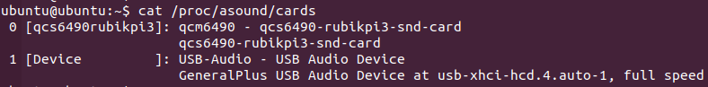

import Tabs from '@theme/Tabs';
import TabItem from '@theme/TabItem';

# 音频

魔方派 3 目前支持的音频接口为：
* 3.5mm 耳机， 下图 4 位置。
* HDMI OUT， 下图 9 位置。
* USB Audio, 下图 5，6，7 位置。


下文将在外接了 UAC 设备的情况下，介绍 Audio 播放、录音、切换输入输出接口的方式。

## 声卡

- 板载声卡与 UAC 设备声卡的挂载顺序，主要与以下因素有关：
  1. UAC 设备的接入接口。
  2. 设备启动前后，UAC 设备是否接入。
- 在魔方派 3 中输入下面命令，查看声卡挂载情况：
    ```shell
    cat /proc/asound/cards
    ```

    

    :::warning
    1. 下文将以板载声卡挂载为 card 0，UAC 设备挂载为 card 1 进行介绍。
    2. 不同的 UAC 设备挂载的具体名称、支持的格式存在差异，请根据实际状态调整相关命令。
    :::
- 在魔方派 3 中输入下面命令，查看已分配的 PCM 流列表：

    

## ALSA

- 在魔方派 3 中输入下面命令，安装 ALSA 工具包。

    ```shell
    sudo apt update
    sudo apt install alsa-utils
    ```

### 播放
    :::warning
    1. 执行以下命令，确保 */opt* 路径存在可读写权限。
    2. 运行命令前，务必将 `WAV` 测试文件 (`<FileName>.wav`) 推送到 */opt* 目录下。
    :::

    ```shell
    sudo chmod 777 -R /opt
    paplay /opt/<FileName>.mp3
    ```
- 3.5mm 耳机播放
    ```shell
    amixer -c 0 cset "name=DAC Playback Volume" 192
    amixer -c 0 cset "name=PRIMARY_MI2S_RX Audio Mixer MultiMedia1" 1
    aplay -Dplughw:0,0 /opt/<FileName>.wav
    ```
- HDMI OUT 播放
    ```shell
    amixer -c 0 cset "name=QUATERNARY_MI2S_RX Audio Mixer MultiMedia2" 1
    aplay -Dplughw:0,1 /opt/<FileName>.wav
    ```
- UAC 播放
    ```shell
    aplay -Dplughw:1,0 /opt/<FileName>.wav
    ```
### 录音
    :::warning
    执行以下命令，确保 */opt* 路径存在可读写权限。
    :::

    ```shell
    sudo chmod 777 -R /opt
    ```
* 3.5mm 耳机录音
    ```shell
    amixer -c 0 cset "name=MultiMedia3 Mixer PRIMARY_MI2S_TX" 1
    arecord -Dplughw:0,2 -f S16_LE -r 48000 -c 1 -d 10 -t wav /opt/<FileName>.wav
    ```

* UAC 录音
    :::warning
    请根据 UAC 设备的实际支持的格式调整命令参数。
    :::

    ```shell
    arecord -Dplughw:1,0 -f S16_LE -r 48000 -c 1 -d 10 -t wav /opt/<FileName>.wav
    ```

## PulseAudio
- 在魔方派 3 中输入下面命令，安装 pulseaudio 工具包。

    ```shell
    sudo apt update
    sudo apt install pulseaudio pulseaudio-utils
    ```

:::note
请在非 root 用户下运行 PulseAudio 命令。例如，使用`su ubuntu`命令切换到 ubuntu 用户。
:::

### 设置音频输出接口
    :::warning
    1. Pulseaudio 会根据各 Sink 的优先级自动切换音频输出接口。优先级如下：UAC > 3.5mm 耳机 > HDMI OUT。
    2. 用户可手动执行`set-default-sink`命令进行切换，一旦手动切换，自动策略就会被覆盖，直到再次手动切换为优先级最高的接口）。
    :::

- 在魔方派 3 中输入下面命令，查看各接口的名称和优先级：
    ```shell
    pactl list sinks | grep -A5 -B1 -E 'Sink #|priority'
    ```
### 切换音频输出接口
    ```shell
    pactl set-default-sink <Sink-Name>
    ```
    示例
    - 切换音频输出接口为 3.5mm 耳机
    ```shell
    pactl set-default-sink alsa_output.platform-sound.HiFi__hw_qcs6490rubikpi3_0__sink
    ```
    - 切换音频输出接口为 HDMI OUT
    ```shell
    pactl set-default-sink alsa_output.platform-sound.HiFi__hw_qcs6490rubikpi3_1__sink
    ```
    - 切换音频输出接口为 UAC
    :::warning
    请根据 UAC 设备 Sink 的实际名称调整命令。
    :::
    ```shell
    pactl set-default-sink alsa_output.usb-GeneralPlus_USB_Audio_Device-00.analog-stereo
    ```
### 设置音频输入接口
:::warning
1. Pulseaudio 会根据各 Source 的优先级自动切换音频输入接口。优先级如下：UAC > 3.5mm 耳机。
2. 用户可手动执行 `set-default-source` 命令进行切换，一旦手动切换，自动策略就会被覆盖，直到再次手动切换为优先级最高的接口）。
:::

- 在魔方派 3 中输入下面命令，查看各接口的名称和优先级：
    ```shell
    pactl list sources | grep -A5 -B1 -E 'Source #|priority'
    ```
### 切换音频输入接口
```shell
pactl set-default-source <Source-Name>
```
示例
    - 切换音频输入接口为 3.5mm 耳机
    ```shell
    pactl set-default-source alsa_input.platform-sound.HiFi__hw_qcs6490rubikpi3_2__source
    ```
    - 切换音频输入接口为 UAC
    :::warning
    请根据 UAC 设备 Source 的实际名称调整命令。
    :::
    ```shell
    pactl set-default-source alsa_input.usb-GeneralPlus_USB_Audio_Device-00.mono-fallback
    ```
### 播放
    :::warning
    1. 执行以下命令，确保 */opt* 路径存在可读写权限。
    2. 运行命令前，务必将 `MP3` 测试文件 (`<FileName>.wav`) 推送到 */opt* 目录下。
    :::

    ```shell
    sudo chmod 777 -R /opt
    ```

### 录音
    :::waring
    1. 执行以下命令，确保 */opt* 路径存在可读写权限。
    :::
    ```shell
    sudo chmod 777 -R /opt
    ```
    - 在魔方派 3 中执行以下命令进行录音：
    ```shell
    parecord /opt/<FileName>.mp3
    ```

