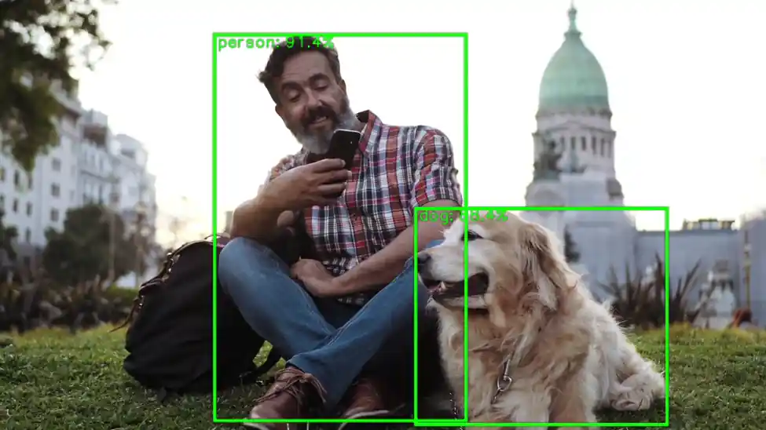

# 预构建示例应用程序

**Qualcomm 智能多媒体 SDK (IMSDK)** 包含一组预先构建的示例应用程序，旨在帮助开发人员快速评估 Qualcomm® 硬件上的多媒体和 AI 功能。这些应用程序是使用**GStreamer 管道** 和**IMSDK 插件**构建的，并作为常见用例（如摄像头捕捉、视频播放、对象检测、姿势估计等）的参考实现。

预构建的示例应用程序提供了一种快速可靠的方法：  
* **验证硬件功能**: 确认摄像头、显示器、音频和 AI 加速器在您的开发板上正常工作。  
* **了解管道结构**: 怎样使用`qtivtransform`、`qtimltflite`和`qtivcomposer`等 IMSDK 插件构建 GStreamer 管道。  
* **基准性能**：使用优化的管道测量实时多媒体和 AI 任务的吞吐量和延迟。  
* **加速开发**：以可运行的示例作为起点，来开发您的定制应用程序。每个示例均展示了零拷贝数据流、硬件卸载与插件配置的最佳实践。

## 开始使用预构建的应用程序

要开始在目标设备上探索预构建的示例应用程序，请按照这些分步说明安装所需的依赖项并配置系统。

#### 1️⃣在启动示例应用程序之前，请确保目标设备满足以下所有先决条件

    * 已刷写**Ubuntu OS**  
    * 具有适当权限的**终端访问**    
    * 如果您之前没有安装过 PPA 包，请按照以下步骤进行安装。   
    ```shell
    git clone -b ubuntu_setup --single-branch https://github.com/rubikpi-ai/rubikpi-script.git 
    cd rubikpi-script  
    ./install_ppa_pkgs.sh 
    ```

:::tip 
缺少依赖项

* 确保 install\_ppa\_pkgs.sh 脚本已成功执行。
* 运行 `sudo apt update \&\& sudo apt install -f` 来修复损坏的依赖关系。
* 验证是否安装了所需的 GStreamer 插件（例如 qtivtransform、qtimltflite）。  
:::

#### 2️⃣下载并运行构建产物脚本

在运行任何示例应用程序之前，您需要下载所需的模型、标签和媒体资产。下载构建产物脚本将自动获取运行示例应用程序所需的所有组件，包括：  
* 模型  
* 标签  
* 媒体文件

可以在 SSH 或 SBC 终端上运行以下命令。

```shell
cd /home/ubuntu 
curl -L -O https://raw.githubusercontent.com/quic/sample-apps-for-qualcomm-linux/refs/heads/main/download_artifacts.sh
sudo chmod +x download_artifacts.sh 
sudo ./download_artifacts.sh -v GA1.5-rel -c QCS6490
```

**说明**

* 使用`-v`参数来定义您想要使用的版本（例如，GA1.5-rel）。
* 使用`-c`参数来定义您的设备正在使用的芯片组（例如，QCS6490）。

#### 3️⃣验证型号/标签/媒体文件

在启动任何示例应用程序之前，请确保所需的文件已到位。

检查以下目录：  
**模型文件**→  `/etc/models/`  
**标签文件**→  `/etc/labels/`  
**媒体文件**→  `/etc/media/`

:::note 
这些文件对于 AI 应用程序正常运行至关重要。如果缺失，请重新运行构建产物下载脚本。
:::

#### 4️⃣预构建示例应用程序列表

***输入源***– 媒体文件；输出源 - Waylandsink   
***模型精度***– 量化模型；运行时 - TFLite；所用脚本 - JSON

对于**多媒体示例应用程序**，请确保 **CSI摄像头** 已连接。

| 示例应用程序名称| 详情| AI Hub 模型（默认）
|----------|----------|----------
| gst-ai-object-detection| [物体检测](https://docs.qualcomm.com/bundle/publicresource/topics/80-70020-50/gst-ai-object-detection.html?vproduct=1601111740013072&version=1.5&facet=Intelligent_Multimedia_SDK.SDK.2.0)| yolox\_quantized
| gst-ai-daisychain-detection-pose| [菊花链姿态检测](https://docs.qualcomm.com/bundle/publicresource/topics/80-70020-50/daisy-chain-detection-and-pose-detection.html?vproduct=1601111740013072&version=1.5&facet=Intelligent_Multimedia_SDK.SDK.2.0)| Yolo-X\_w8a8, HRNetPose\_w8a8
| gst-ai-face-detection| [人脸检测](https://docs.qualcomm.com/bundle/publicresource/topics/80-70020-50/gst-ai-face-detection.html)| face\_det\_lite
| gst-ai-segmentation| [图像分割](https://docs.qualcomm.com/bundle/publicresource/topics/80-70020-50/gst-ai-segmentation.html)| Deeplabv3\_plus\_mobilenet
| gst-ai-pose-detection| [姿态检测](https://docs.qualcomm.com/bundle/publicresource/topics/80-70020-50/gst-ai-pose-detection.html)| hrnet\_pose
| gst-ai-monodepth| [视频单目深度估计](https://docs.qualcomm.com/bundle/publicresource/topics/80-70020-50/mono-depth-from-video.html)| midas
| gst-camera-single-stream-example| [单路摄像头流传输](https://docs.qualcomm.com/bundle/publicresource/topics/80-70020-50/gst-camera-single-stream-example.html)| NA
| gst-multi-camera-example| [多摄像机流传输](https://docs.qualcomm.com/bundle/publicresource/topics/80-70020-50/gst-multi-camera-stream-example.html)| NA
| gst-activate-deactivate-streams-runtime-example| [在运行中激活/停用流](https://docs.qualcomm.com/bundle/publicresource/topics/80-70020-50/gst-activate-deactivate-streams-runtime.html)| NA

#### 5️⃣运行对象检测示例应用程序

gst-ai-object-detection应用程序可检测图像和视频中的对象。用例展示了使用Qualcomm Neural Processing SDK 运行时执行 YOLOv5、YOLOv8 和 YOLOX、使用 Qualcomm AI Engine direct 执行 YOLOv8 以及使用 LiteRT 执行 YOLOv5 和 YOLOv8。

使用 SSH 或 SBC 终端启动您的示例应用程序。  
:::note 
如果终端处于root状态，则需要设置以下环境。但对于 ubuntu 用户来说无需此操作。

```shell
export `XDG_RUNTIME_DIR=/run/user/$(id -u ubuntu)`
```
:::

使用以下命令运行gst -ai-object-detection 应用程序。

```shell
gst-ai-object-detection
```



要显示可用的帮助选项，请在 SSH shell 中运行以下命令：

```shell
gst-ai-object-detection -h
```

按**CTRL + C**可停止用例。

### 参考文档

* [**运行 AI/ML 示例应用程序**](https://docs.qualcomm.com/bundle/publicresource/topics/80-70020-50/ai-ml-sample-applications.html)
* [**Qualcomm IM SDK 快速入门文档**](https://docs.qualcomm.com/bundle/publicresource/topics/80-70020-51/install-sdk.html#panel-0-VWJ1bnR1)