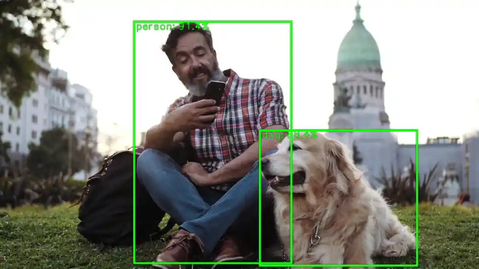

import Tabs from '@theme/Tabs';
import TabItem from '@theme/TabItem';

# LiteRT / TFLite

LiteRT（前身为TensorFlow Lite），是谷歌专为设备端AI打造的高性能推理运行时。通过集成在AI Engine Direct中的LiteRT委托，您只需一行代码即可在Dragonwing设备的NPU上运行现有的量化LiteRT模型（支持Python与C++）。

## 量化模型

NPU仅支持uint8/int8量化模型。不支持的模型或不支持的层将自动移回 CPU。可以使用 [quantization-aware training](https://www.tensorflow.org/model_optimization/guide/quantization/training_comprehensive_guide) 或 [post-training quantization](https://ai.google.dev/edge/litert/models/post_training_quantization) 来量化 LiteRT 模型。请确保遵循“完全整型量化”的操作步骤。

:::info 
**不想自己量化模型？** 可以从 [Qualcomm AI Hub](https://aihub.qualcomm.com) 下载一系列的量化模型，或使用 [Edge Impulse](https://qc-ai-test.gitbook.io/qc-ai-test-docs/running-building-ai-models/edge-impulse) 来量化已有的或全新的模型。
:::

## 在 NPU 上运行模型（Python）

要将模型卸载到 NPU，只需加载 LiteRT 委托，并将其传递到解释器中。例如：

```py
from ai_edge_litert.interpreter import Interpreter, load_delegate

qnn_delegate = load_delegate("libQnnTFLiteDelegate.so", options={"backend_type": "htp"})
interpreter = Interpreter(
    model_path=...,
    experimental_delegates=[qnn_delegate]
)
```

## 在 NPU 上运行模型（C++）

要将模型卸载到 NPU，首先需要添加以下编译标志：

```makefile
CFLAGS += -I${QNN_SDK_ROOT}/include
LDFLAGS += -L${QNN_SDK_ROOT}/lib/aarch64-ubuntu-gcc9.4 -lQnnTFLiteDelegate
```

然后，实例化 LiteRT 委托并将其传递给 LiteRT 解释器：

```c
// == Includes ==
#include "QNN/TFLiteDelegate/QnnTFLiteDelegate.h"

// == Application code ==

// Get your interpreter...
tflite::Interpreter *interpreter = ...;

// Create QNN Delegate options structure.
TfLiteQnnDelegateOptions options = TfLiteQnnDelegateOptionsDefault();

// Set the mandatory backend_type option. All other options have default values.
options.backend_type = kHtpBackend;

// Instantiate delegate. Must not be freed until interpreter is freed.
TfLiteDelegate* delegate = TfLiteQnnDelegateCreate(&options);

TfLiteStatus status = interpreter->ModifyGraphWithDelegate(delegate);
// Check that status == kTfLiteOk
```

### Python 示例

**前提条件**

* **Ubuntu 操作系统** 已刷入。
* 具有适当权限的**终端访问**。
* 如果您之前没有安装过 PPA 包，请按照以下步骤进行安装。
  ```shell
    git clone -b ubuntu_setup --single-branch https://github.com/rubikpi-ai/rubikpi-script.git 
    cd rubikpi-script  
    ./install_ppa_pkgs.sh  
  ```
* 在开发板上打开终端，或建立 SSH 会话，然后执行以下操作：  
创建一个新的虚拟环境（venv），并安装 LiteRT 运行时和 Pillow：
  ```python
  python3 -m venv .venv-litert-demo --system-site-packages
  source .venv-litert-demo/bin/activate
  pip3 install ai-edge-litert==1.3.0 Pillow
  pip3 install opencv-python
  ```
* 安装必要的 python3 和 gtk 包。
  ```python
  sudo apt install python3-gi python3-gi-cairo gir1.2-gtk-3.0
  sudo apt install python3-venv python3-full
  sudo apt install -y pkg-config cmake libcairo2-dev
  sudo apt install libgirepository1.0-dev gir1.2-glib-2.0
  sudo apt install build-essential python3-dev python3-pip pkg-config meson
  ```

<Tabs>
<TabItem value="Example1" label="视觉 Transformers">
### 视觉 Transformers  
以下说明如何使用 LiteRT 委托在 CPU 和 NPU 上运行 Vision Transformer 模型（从 [AI Hub](https://aihub.qualcomm.com/models/vit) 下载)。

1️⃣ 创建 `inference_vit.py` 并添加以下参考代码：

```py
import numpy as np
from ai_edge_litert.interpreter import Interpreter, load_delegate
from PIL import Image
import os, time, sys
import urllib.request

def curr_ms():
    return round(time.time() * 1000)

use_npu = True if len(sys.argv) >= 2 and sys.argv[1] == '--use-npu' else False

# Path to your quantized TFLite model and test image (will be download automatically)
MODEL_PATH = "vit-vit-w8a8.tflite"
IMAGE_PATH = "boa-constrictor.jpg"
LABELS_PATH = "vit-vit-labels.txt"

if not os.path.exists(MODEL_PATH):
    print("Downloading model...")
    model_url = 'https://cdn.edgeimpulse.com/qc-ai-docs/models/vit-vit-w8a8.tflite'
    urllib.request.urlretrieve(model_url, MODEL_PATH)

if not os.path.exists(LABELS_PATH):
    print("Downloading labels...")
    labels_url = 'https://cdn.edgeimpulse.com/qc-ai-docs/models/vit-vit-labels.txt'
    urllib.request.urlretrieve(labels_url, LABELS_PATH)

if not os.path.exists(IMAGE_PATH):
    print("Downloading image...")
    image_url = 'https://cdn.edgeimpulse.com/qc-ai-docs/examples/boa-constrictor.jpg'
    urllib.request.urlretrieve(image_url, IMAGE_PATH)

with open(LABELS_PATH, 'r') as f:
    labels = [line for line in f.read().splitlines() if line.strip()]

experimental_delegates = []
if use_npu:
    experimental_delegates = [load_delegate("libQnnTFLiteDelegate.so", options={"backend_type": "htp"})]

# Load TFLite model and allocate tensors
interpreter = Interpreter(
    model_path=MODEL_PATH,
    experimental_delegates=experimental_delegates
)
interpreter.allocate_tensors()

# Get input and output tensor details
input_details = interpreter.get_input_details()
output_details = interpreter.get_output_details()

# Load and preprocess image
def load_image(path, input_shape):
    # Expected input shape: [1, height, width, channels]
    _, height, width, channels = input_shape

    img = Image.open(path).convert("RGB").resize((width, height))
    img_np = np.array(img, dtype=np.uint8)  # quantized models expect uint8
    img_np = np.expand_dims(img_np, axis=0)
    return img_np

input_shape = input_details[0]['shape']
input_data = load_image(IMAGE_PATH, input_shape)

# Set tensor and run inference
interpreter.set_tensor(input_details[0]['index'], input_data)

# Run once to warmup
interpreter.invoke()

# Then run 10x
start = curr_ms()
for i in range(0, 10):
    interpreter.invoke()
end = curr_ms()

# Get prediction
q_output = interpreter.get_tensor(output_details[0]['index'])
scale, zero_point = output_details[0]['quantization']
f_output = (q_output.astype(np.float32) - zero_point) * scale

# Image classification models in AI Hub miss a Softmax() layer at the end of the model, so add it manually
def softmax(x, axis=-1):
    # subtract max for numerical stability
    x_max = np.max(x, axis=axis, keepdims=True)
    e_x = np.exp(x - x_max)
    return e_x / np.sum(e_x, axis=axis, keepdims=True)

# show top-5 predictions
scores = softmax(f_output[0])
top_k = scores.argsort()[-5:][::-1]
print("\nTop-5 predictions:")
for i in top_k:
    print(f"Class {labels[i]}: score={scores[i]}")

print('')
print(f'Inference took (on average): {(end - start) / 10}ms. per image')
```

2️⃣ 在 CPU 上运行模型：

```bash
python3 inference_vit.py

# INFO: Created TensorFlow Lite XNNPACK delegate for CPU.
#
# Top-5 predictions:
# Class boa constrictor: score=0.6264431476593018
# Class rock python: score=0.047579940408468246
# Class night snake: score=0.006721484009176493
# Class mouse: score=0.0022421202156692743
# Class pick: score=0.001942973816767335
#
# Inference took (on average): 391.1ms. per image
```

3️⃣ 在 NPU 上运行模型：

```bash
python3 inference_vit.py --use-npu

# INFO: TfLiteQnnDelegate delegate: 1382 nodes delegated out of 1633 nodes with 27 partitions.
#
# INFO: Created TensorFlow Lite XNNPACK delegate for CPU.
#
# Top-5 predictions:
# Class boa constrictor: score=0.6113042235374451
# Class rock python: score=0.038359832018613815
# Class night snake: score=0.011630792170763016
# Class mouse: score=0.002294909441843629
# Class lens cap: score=0.0018960189772769809
#
# Inference took (on average): 132.7ms. per image
```

正如所见，该模型在 NPU 上运行速度明显更快，但模型的输出略有变化。此外，此模型并非所有层都可以在 NPU 上运行（“1633 个节点中委托了 1382 个节点，共 27 个分区”）。

</TabItem>

<TabItem value="Example2" label="图像分类">
### 基于GTK的图像分类应用
以下介绍如何通过基于GTK的桌面应用程序，运用AI Engine Direct的LiteRT委托，在CPU和NPU上运行从AI Hub下载的图像分类模型。

GoogLeNet\_w8a8.tflite模型来自AI-Hub，利用了TensorFlow Lite与QNN委托加速技术，实现高效的设备端推理。

请按以下步骤创建图像分类应用程序。  
概述  
- 类型：桌面 GUI 应用程序  
- 功能：使用 TFLite 进行图像分类  
- 模式：CPU 和 QNN 委托  
- 接口：基于 GTK 的 GUI  
- 输出：带有置信度条的最佳预测

**环境设置和导入**  
在此步骤中，脚本设置与显示相关的环境变量（针对 Linux 系统）并导入必要的库，如 OpenCV、NumPy、GTK 和 TensorFlow Lite。

```python
import cv2, numpy as np, os, time
from gi.repository import Gtk, GLib, GdkPixbuf
import ai_edge_litert.interpreter as tflite
```

:::note
GTK 用于 GUI，OpenCV 用于图像处理，TensorFlow Lite 用于推理。
:::

**配置常量**  
这些常量定义了模型、标签文件和委托库的路径。

```python
TF_MODEL = "/home/ubuntu/GoogLeNet_w8a8.tflite"
LABELS = "/etc/labels/imagenet_labels.txt"
DELEGATE_PATH = "libQnnTFLiteDelegate.so"
DEVICE_OS = "Ubuntu"
```

### 下载 TFlite 模型

该脚本检查本地是否存在 TensorFlow Lite 模型文件，如果不存在，则从指定的 Hugging Face URL 下载。

```python
import urllib.request
if not os.path.exists(TF_MODEL):
   print("Downloading model...")
   model_url = 'https://huggingface.co/qualcomm/GoogLeNet/resolve/main/GoogLeNet_w8a8.tflite'
   urllib.request.urlretrieve(model_url, TF_MODEL)
```

### 辅助函数

此步骤使用 LiteRT 和 GTK 设置图像分类的核心逻辑和界面。

**Softmax 计算**   
在将 logits 转换为概率时，确保数值的稳定性。

```python
Pythondef stable_softmax(logits):    
logits = logits.astype(np.float32)    
shifted_logits = np.clip(logits - np.max(logits), -500, 500)    
exp_scores = np.exp(shifted_logits)    
return exp_scores / np.sum(exp_scores)
```

**标签加载器**  
从文本文件加载类标签。

```python
Pythondef load_labels(label_path):    
with open(label_path, 'r') as f: 
       return [line.strip() for line in f.readlines()]
```

**图像预处理**  
为模型输入准备图像：调整大小、颜色转换和重塑。

```python
Pythondef preprocess_image(image_path, input_shape, input_dtype):   
img = cv2.imread(image_path)    
img = cv2.cvtColor(img, cv2.COLOR_BGR2RGB)    
img = cv2.resize(img, (input_shape[2], input_shape[1]))    
img = img.astype(input_dtype)    
return np.expand_dims(img, axis=0)
```

**推理执行**  
该函数将：  
•	加载模型（带或不带委托）   
•	准备输入  
•	运行推理  
•	应用 softmax   
•	返回具有置信度分数的前 4 个预测

```python
def runInference(image, use_delegate):
    if use_delegate:
        try:
            delegate = tflite.load_delegate(DELEGATE_PATH, {'backend_type': 'htp'})
            model = tflite.Interpreter(model_path=TF_MODEL, experimental_delegates=[delegate])
        except:
            model = tflite.Interpreter(model_path=TF_MODEL)
    else:
        model = tflite.Interpreter(model_path=TF_MODEL)
    model.allocate_tensors()
    input_details = model.get_input_details()
    input_data = preprocess_image(image, input_details[0]['shape'], input_details[0]['dtype'])
    model.set_tensor(input_details[0]['index'], input_data)
    start_time = time.time()
    model.invoke()
    inference_time = time.time() - start_time
    output_data = model.get_tensor(model.get_output_details()[0]['index'])
    probabilities = stable_softmax(output_data[0])
    labels = load_labels(LABELS)
    top_indices = np.argsort(probabilities)[::-1][:4]
    results = [(labels[i], probabilities[i] * 100) for i in top_indices]
    return results, inference_time
```

**GTK GUI 组件**

**文件浏览器对话框**  
允许用户选择图像文件。

```python
class FileBrowser(Gtk.FileChooserDialog):
    def __init__(self):
        super().__init__(title="Choose an image", action=Gtk.FileChooserAction.OPEN)
        self.add_buttons(Gtk.STOCK_CANCEL, Gtk.ResponseType.CANCEL, Gtk.STOCK_OPEN, Gtk.ResponseType.OK)
    def run_and_get_file(self):
        if self.run() == Gtk.ResponseType.OK:
            return self.get_filename()
        self.destroy()
```

**主窗口**  
GUI 包括：  
•	图像显示区域  
•	用于选择 CPU 或委托的单选按钮  
•	用于选择和重新处理图像的按钮  
•	带有标签和进度条的结果显示

```python
class MainWindow(Gtk.Window):
    def __init__(self):
        super().__init__(title="Image Classification")
        self.set_default_size(800, 600)
        self.imageFilepath = ""
        ...
```

**图像处理与显示**  
此方法：  
•	调整大小并显示图像  
•	运行推理  
•	显示带有进度条和推理时间的结果

```python
def process_file(self, filepath):
    pixbuf = GdkPixbuf.Pixbuf.new_from_file(filepath)
    new_width, new_height = resizeImage(pixbuf)
    scaled_pixbuf = pixbuf.scale_simple(new_width, new_height, GdkPixbuf.InterpType.BILINEAR)
    self.image.set_from_pixbuf(scaled_pixbuf)

    results, inference_time = runInference(filepath, self.use_delegate())
    ...
```

**应用程序入口点**  
初始化并启动 GTK 应用程序。

```python
def main():
    app = MainWindow()
    app.connect("destroy", Gtk.main_quit)
    app.show_all()
    Gtk.main()
if __name__ == "__main__":
    success, _ = Gtk.init_check()
    if not success:
        print("GTK could not be initialized.")
        exit(1)
    main()
```

### 参考代码

```python
# -----------------------------------------------------------------------------
#
# Copyright (c) Qualcomm Technologies, Inc. and/or its subsidiaries.
# SPDX-License-Identifier: BSD-3-Clause
#
# -----------------------------------------------------------------------------
import cv2
import gi
import numpy as np
import os
os.environ['xDG_RUNTIME_DIR'] = '/run/user/1000/'
os.environ['WAYLAND_DISPLAY'] = 'wayland-1'
os.environ['DISPLAY'] = ':0'
import time
import urllib.request
gi.require_version("Gtk", "3.0")
from gi.repository import Gtk, GLib, GdkPixbuf

# ========= Constants =========
TF_MODEL = "/home/ubuntu/GoogLeNet_w8a8.tflite"
LABELS = "/etc/labels/imagenet_labels.txt"
DELEGATE_PATH = "libQnnTFLiteDelegate.so"
DEVICE_OS="Ubuntu"
UNAME = os.uname().nodename

import ai_edge_litert.interpreter as tflite

if not os.path.exists(TF_MODEL):
    print("Downloading model...")
    model_url = 'https://huggingface.co/qualcomm/GoogLeNet/resolve/main/GoogLeNet_w8a8.tflite'
    urllib.request.urlretrieve(model_url, TF_MODEL)

# ========= Helper Functions =========
def stable_softmax(logits):
    # Convert logits to float64 for higher precision
    logits = logits.astype(np.float32)
    
    # Subtract the maximum logit to prevent overflow
    shifted_logits = logits - np.max(logits)
    
    # Clip the shifted logits to a safe range to prevent overflow in exp
    shifted_logits = np.clip(shifted_logits, -500, 500)
    
    # Calculate the exponentials and normalize
    exp_scores = np.exp(shifted_logits)
    probabilities = exp_scores / np.sum(exp_scores)
    
    return probabilities

# Load labels from file
def load_labels(label_path):
    with open(label_path, 'r') as f:
        return [line.strip() for line in f.readlines()]

def resizeImage(pixbuf):
    original_width = pixbuf.get_width()
    original_height = pixbuf.get_height()

    # Target display size
    max_width = 800
    max_height = 600

    # Calculate new size preserving aspect ratio
    scale = min(max_width / original_width, max_height / original_height)
    new_width = int(original_width * scale)
    new_height = int(original_height * scale)

    return new_width, new_height

# Load and preprocess input image
def preprocess_image(image_path, input_shape, input_dtype):
    # Read the image using OpenCV
    img = cv2.imread(image_path)
    if img is None:
        raise ValueError(f"Failed to load image at {image_path}")
    # Convert BGR to RGB
    img = cv2.cvtColor(img, cv2.COLOR_BGR2RGB)
    # Resize the image to the desired input shape
    img = cv2.resize(img, (input_shape[2], input_shape[1]))
    # Convert to the desired data type
    img = img.astype(input_dtype)
    # Add batch dimension
    img = np.expand_dims(img, axis=0)
    
    return img

# ====== Inference Function ======
def runInference(image, use_delegate):
    results = []    
    print(f"Running on {DEVICE_OS} using Delegate:{use_delegate}")
    if use_delegate:
        try:
            # Load the QNN delegate library
            delegate_options = { 'backend_type': 'htp' }
            delegate = tflite.load_delegate(DELEGATE_PATH, delegate_options)
            
            # Load the TFLite model
            model = tflite.Interpreter(model_path=TF_MODEL, experimental_delegates=[delegate])
            print("INFO: Loaded QNN delegate with HTP backend")
        except Exception as e:
            print(f"WARNING: Failed to load QNN delegate: {e}")
            print("INFO: Continuing without QNN delegate")
            model = tflite.Interpreter(model_path=TF_MODEL)   
    else:
        model = tflite.Interpreter(model_path=TF_MODEL)  
   
    model.allocate_tensors()

    # Get and Prepare input 
    input_details = model.get_input_details()
    input_shape = input_details[0]['shape']
    input_dtype = input_details[0]['dtype']
    input_data = preprocess_image(image, input_shape, input_dtype)
    
    # Load input data to input tensor
    model.set_tensor(input_details[0]['index'], input_data)
    model.get_signature_list()
    
    # Run inference
    try:
        start_time = time.time()
        model.invoke()
        end_time = time.time()
        print("Interpreter invoked successfully.")
    except Exception as e:
        print(f"Error during model invocation: {e}")
        return []

    # Calculate and print duration
    inference_time = end_time - start_time

    # Prepare output tensor details
    output_details = model.get_output_details()

    # Load output data to output tensor
    output_data = model.get_tensor(output_details[0]['index'])

    # Load labels and get prediction
    labels = load_labels(LABELS)
    predicted_index = np.argmax(output_data)
    predicted_label = labels[predicted_index]
    print("Predicted index:", predicted_index)
    print("Predicted label:", predicted_label)
    
    # Add Softmax function
    logits = output_data[0]
    probabilities = stable_softmax(logits)

    # Get top 4 predictions
    top_k = 4
    top_indices = np.argsort(probabilities)[::-1][:top_k]
    for i in top_indices:
        result = (labels[i], probabilities[i] * 100)
        results.append(result)

    return results, inference_time

# ====== GTK GUI Classes ======
class FileBrowser(Gtk.FileChooserDialog):
    def __init__(self):
        super().__init__(title="Choose an image", action=Gtk.FileChooserAction.OPEN)
        self.add_buttons(Gtk.STOCK_CANCEL, Gtk.ResponseType.CANCEL, Gtk.STOCK_OPEN, Gtk.ResponseType.OK)

    def run_and_get_file(self):
        response = super().run()
        if response == Gtk.ResponseType.OK:
            print("Selected file:", self.get_filename())
            self.selected_file = self.get_filename()            
        self.destroy()
        return self.selected_file

class MainWindow(Gtk.Window):
    def __init__(self):
        super().__init__(title="Image Classification")
        self.set_default_size(800, 600)
        self.imageFilepath = ""
        # Main layout
        self.mainBox = Gtk.Box(orientation=Gtk.Orientation.HORIZONTAL, spacing=10)
        self.mainBox.set_margin_top(10)
        self.mainBox.set_margin_bottom(10)
        self.mainBox.set_margin_start(10)
        self.mainBox.set_margin_end(10)
        self.add(self.mainBox)
        
        # Main Window Image setup with fallback
        self.image = Gtk.Image()
        try:
            MAIN_IMAGE = "MainWindowPic.jpg"
            self.image.set_from_file(MAIN_IMAGE)         
        except Exception as e:
            print("Error loading main image:", e)
            self.image.set_from_icon_name("image-missing", Gtk.IconSize.DIALOG)

        self.mainBox.pack_start(self.image, True, True, 0)

        # Set up a new box to add results and and file button
        self.infoBox = Gtk.Box(orientation=Gtk.Orientation.VERTICAL, spacing=10)
        
        # Radio button to select Delegate
        delegate_label = Gtk.Label(label="Select Inference Mode:")
        self.infoBox.pack_start(delegate_label, False, False, 10)

        self.cpu_radio = Gtk.RadioButton.new_with_label_from_widget(None, "CPU")
        self.delegate_radio = Gtk.RadioButton.new_with_label_from_widget(self.cpu_radio, "Delegate")

        self.infoBox.pack_start(self.cpu_radio, False, False, 0)
        self.infoBox.pack_start(self.delegate_radio, False, False, 0)
        
        # Radio button signal
        self.cpu_radio.connect("toggled", self.on_radio_toggled)
        self.delegate_radio.connect("toggled", self.on_radio_toggled)

        # Open file button
        open_button = Gtk.Button(label="Select Image")
        open_button.connect("clicked", self.on_open_file_clicked)
        self.infoBox.pack_start(open_button, False, True, 10)

        # Reprocess Image
        reprocess_button = Gtk.Button(label="Reprocess Image")
        reprocess_button.connect("clicked", self.on_reprocess_image_clicked)
        self.infoBox.pack_start(reprocess_button, False, True, 10)

        # Classification results
        self.results = Gtk.Box(orientation=Gtk.Orientation.VERTICAL, spacing=10)
        self.infoBox.pack_start(self.results, True, True, 0)
        self.mainBox.pack_start(self.infoBox, True, True, 0)

    def use_delegate(self):
        return self.delegate_radio.get_active()

    def on_radio_toggled(self, button):
        if button.get_active():
            print(f"Selected option: {button.get_label()}")

    def process_file(self, filepath): 
        try:
            # Resize Image
            pixbuf = GdkPixbuf.Pixbuf.new_from_file(filepath)
            new_width, new_height = resizeImage(pixbuf)
            scaled_pixbuf = pixbuf.scale_simple(new_width, new_height, GdkPixbuf.InterpType.BILINEAR)
            
            # Replace the image with new image
            self.image.set_from_pixbuf(scaled_pixbuf)
           
            # Run Inference
            use_delegate = self.use_delegate()
            print("delegate: " , use_delegate)
            options, inference_time = runInference(filepath, use_delegate)

            # Clear result box
            for child in self.results.get_children():
                self.results.remove(child)
            
            # Set up predictions
            for label, percent in options:
                textBox = Gtk.Box(orientation=Gtk.Orientation.HORIZONTAL, spacing=10)
                barBox = Gtk.Box(orientation=Gtk.Orientation.HORIZONTAL, spacing=10)
                text = Gtk.Label(label=label, xalign=0)
                text.set_size_request(100, -1) 
                
                bar = Gtk.ProgressBar()
                bar.set_fraction(percent / 100.0)
                bar.set_text(f"{percent:.2f}%")
                bar.set_show_text(True)
                
                textBox.pack_start(text, False, False, 0)
                barBox.pack_start(bar, True, True, 0)
            
                self.results.pack_start(textBox, False, False, 0)
                self.results.pack_start(barBox, False, False, 0)
                self.results.show_all()
            
            # Add inference time label
            time_label = Gtk.Label(label=f"Inference Time : {inference_time * 1000:.2f} ms")
            self.results.pack_start(time_label, False, False, 50)
            self.results.show_all()
        except Exception as e:
            print("Error reading file:", e)

    def on_open_file_clicked(self, widget):
        dialog = FileBrowser()
        selected_file = dialog.run_and_get_file()
        self.imageFilepath = selected_file
        if selected_file:
            self.process_file(selected_file)
 
    def on_reprocess_image_clicked(self, widget):
        self.process_file(self.imageFilepath)

    def on_destroy(self, widget):
        Gtk.main_quit()

# === Main Entry Point ===
def main():
    app = MainWindow()
    app.connect("destroy", Gtk.main_quit)
    app.show_all()
    Gtk.main()

if __name__ == "__main__":
    success, _ = Gtk.init_check()
    if not success:
        print("GTK could not be initialized. Check environmental variables")
        exit(1)

    main() 

```

现在，您可以使用以下命令在 CPU/委托上运行该应用程序：

```shell
python3 classification.py
```


从互联网上下载任一图片。该示例使用了消防车图片。通过 scp 命令将图像复制到设备上。

```shell
scp xxx.jpg ubuntu@IP_address:/home/ubuntu/
```

在 GUI 上选择 CPU 作为运行时选项：


在 GUI 上选择 Delegate 作为运行时选项：


</TabItem>

<TabItem value="Example3" label="目标检测">
### 使用 OpenCV 和 Wayland 显示的目标检测  
这个 Python 脚本使用量化的 **YOLOv8 TensorFlow Lite** 模型对视频文件进行**实时目标检测**，并通过**GStreamer 在 Wayland 显示器上**显示带注释的帧。它针对**边缘 AI 场景**进行了优化，通过**QNN TFLite 委托**实现硬件加速。
:::note
YOLOv8 模型默认不可用。请按照 [**Qualcomm Intelligent Multimedia SDK**](https://docs.qualcomm.com/bundle/publicresource/topics/80-70020-50/download-model-and-label-files.html?vproduct=1601111740013072&version=1.5&facet=Intelligent_Multimedia_SDK.SDK.2.0) **步骤-6** 导出 YOLOv8 量化模型。 
:::
下一步是将模型推送到目标设备上，通过 scp 命令将模型复制到设备上。

```shell
scp xxxx.tflite ubuntu@IP_address:/home/ubuntu/
```

**初始化和配置**  
•	定义模型、标签、输入视频和委托的路径。  
•	为预处理和后处理设置帧尺寸、FPS、置信度阈值和缩放因子等常量。

    **MODEL_PATH** = "yolov8_det_quantized.tflite"  
    **LABEL_PATH** = "coco_labels.txt"  
    **VIDEO_IN** = "video.mp4"  
    **DELEGATE_PATH** = "libQnnTFLiteDelegate.so"  

:::note 
使用与对象检测模型配合良好的视频文件。  
为了获得最佳效果，请选择主题清晰、光线充足且运动模糊最少的视频。

**例如：**  
• 有车辆和行人的街道场景  
• 有可见物体的仓库或工厂车间  
• 人物或产品的静态摄像机画面  
:::

**模型加载和委托设置**  
•	加载硬件委托以加速推理。  
•	使用量化的 YOLOv8 模型初始化 TensorFlow Lite 解释器。

```python
delegate_options = { 'backend_type': 'htp' }
delegate = tflite.load_delegate(DELEGATE_PATH, delegate_options)
interpreter = tflite.Interpreter(model_path=MODEL_PATH, experimental_delegates=[delegate])
interpreter.allocate_tensors()
```

**标签加载**  
•	加载 COCO 数据集标签以进行对象注释。

```python
labels = [l.strip() for l in open(LABEL_PATH)]
```

**GStreamer 管道设置**   
•	使用 appsrc 创建 GStreamer 管道，将帧流式传输到 Wayland 接收器。•	能够实时显示已处理的帧。

```shell
pipeline = Gst.parse_launch(
    'appsrc name=src is-live=true block=true format=time caps=video/x-raw,format=BGR,width=1600,height=900,framerate=30/1 ! videoconvert ! waylandsink')
```

**视频捕获和帧处理**  
•	使用 OpenCV 打开视频文件。  
•	每个帧都经过调整大小和预处理，以匹配模型的输入尺寸。

```python
cap = cv2.VideoCapture(VIDEO_IN)
```

**推理和后处理**  
•	对每一帧进行推理。  
•	使用预定义的缩放因子和零点对模型输出进行去量化。

```python
interpreter.set_tensor(in_det[0]['index'], input_tensor)
interpreter.invoke()
boxes_q = interpreter.get_tensor(out_det[0]['index'])[0]
scores_q = interpreter.get_tensor(out_det[1]['index'])[0]
classes_q = interpreter.get_tensor(out_det[2]['index'])[0]
```

•	应用置信度阈值来过滤低概率检测。•	使用非极大抑制（NMS）来消除重叠的框。

```python
mask = scores >= CONF_THRES
boxes_f = boxes[mask]
scores_f = scores[mask]
classes_f = classes[mask]
```

**注释与显示**

•	使用 OpenCV 在画面上绘制边界框和标签。•	每 100 帧记录一次最高检测分数。

```python
cv2.rectangle(frame_rs, (x1i, y1i), (x2i, y2i), (0,255,0), 2)
cv2.putText(frame_rs, f"{lab} {sc:.2f}", (x1i, max(10,y1i-5)), cv2.FONT_HERSHEY_SIMPLEX, 0.5, (0,255,0), 2)
```

**流式传输至 Wayland 显示器**

将帧转换为 GStreamer 缓冲区，并将它们带着时间戳推送到管道以实现流畅播放。

```python
buf = Gst.Buffer.new_allocate(None, len(data), None)
buf.fill(0, data)
buf.duration = Gst.util_uint64_scale_int(1, Gst.SECOND, FPS_OUT)
timestamp = cap.get(cv2.CAP_PROP_POS_MSEC) * Gst.MSECOND
buf.pts = buf.dts = int(timestamp)
appsrc.emit('push-buffer', buf)
```

**完成**  
处理完所有帧后正常关闭管道。

```python
appsrc.emit('end-of-stream')
pipeline.set_state(Gst.State.NULL)
cap.release()
```

**用例**  
此脚本适用于：  
•	智能相机  
•	机器人技术  
•	基于 Wayland GUI 的嵌入式系统  
•	边缘 AI 部署中的实时监控

### 参考代码

```python
# -----------------------------------------------------------------------------
#
# Copyright (c) Qualcomm Technologies, Inc. and/or its subsidiaries.
# SPDX-License-Identifier: BSD-3-Clause
#
# -----------------------------------------------------------------------------

#!/usr/bin/env python3

# Import necessary libraries
import cv2
import numpy as np
import gi
gi.require_version('Gst', '1.0')
from gi.repository import Gst
import ai_edge_litert.interpreter as tflite

# Initialize GStreamer
Gst.init(None)

# -------------------- Parameters --------------------
MODEL_PATH = "/home/ubuntu/yolov8_det_quantized.tflite"  # Path to TFLite model
LABEL_PATH = "/etc/labels/coco_labels.txt"              # Path to label file            # Path to label file
VIDEO_IN = "/etc/media/video.mp4"                        # Input video file
DELEGATE_PATH = "libQnnTFLiteDelegate.so"                # Delegate for hardware acceleration

# Frame and model parameters
FRAME_W, FRAME_H = 1600, 900
FPS_OUT = 30
CONF_THRES = 0.25
NMS_IOU_THRES = 0.50
BOX_SCALE = 3.2108588218688965
BOX_ZP = 31.0
SCORE_SCALE = 0.0038042240776121616
# -------------------- Load Model --------------------
# Load delegate for hardware acceleration
delegate_options = { 'backend_type': 'htp' }
delegate = tflite.load_delegate(DELEGATE_PATH, delegate_options)

# Load and allocate TFLite interpreter
interpreter = tflite.Interpreter(model_path=MODEL_PATH, experimental_delegates=[delegate])
interpreter.allocate_tensors()

# Get input/output tensor details
in_det = interpreter.get_input_details()
out_det = interpreter.get_output_details()
in_h, in_w = in_det[0]["shape"][1:3]

# -------------------- Load Labels --------------------
labels = [l.strip() for l in open(LABEL_PATH)]

# -------------------- GStreamer Pipeline --------------------
# Create GStreamer pipeline to display video via Wayland
pipeline = Gst.parse_launch(
    'appsrc name=src is-live=true block=true format=time caps=video/x-raw,format=BGR,width=1600,height=900,framerate=30/1 ! videoconvert ! waylandsink'
)
appsrc = pipeline.get_by_name('src')
pipeline.set_state(Gst.State.PLAYING)

# -------------------- Video Input --------------------
cap = cv2.VideoCapture(VIDEO_IN)

# Scaling factors for bounding box adjustment
sx, sy = FRAME_W / in_w, FRAME_H / in_h

# Preallocate frame buffers
frame_rs = np.empty((FRAME_H, FRAME_W, 3), np.uint8)
input_tensor = np.empty((1, in_h, in_w, 3), np.uint8)

frame_cnt = 0

# -------------------- Main Loop --------------------
while True:
    ok, frame = cap.read()
    if not ok:
        break
    frame_cnt += 1

    # ---------- Preprocessing ----------
    # Resize frame to display resolution
    cv2.resize(frame, (FRAME_W, FRAME_H), dst=frame_rs)

    # Resize again to model input resolution
    cv2.resize(frame_rs, (in_w, in_h), dst=input_tensor[0])

    # ---------- Inference ----------
    # Set input tensor and run inference
    interpreter.set_tensor(in_det[0]['index'], input_tensor)
    interpreter.invoke()

    # ---------- Postprocessing ----------
    # Get raw output tensors
    boxes_q = interpreter.get_tensor(out_det[0]['index'])[0]
    scores_q = interpreter.get_tensor(out_det[1]['index'])[0]
    classes_q = interpreter.get_tensor(out_det[2]['index'])[0]

    # Dequantize outputs
    boxes = BOX_SCALE * (boxes_q.astype(np.float32) - BOX_ZP)
    scores = SCORE_SCALE * scores_q.astype(np.float32)
    classes = classes_q.astype(np.int32)

    # Filter by confidence threshold
    mask = scores >= CONF_THRES
    if np.any(mask):
        boxes_f = boxes[mask]
        scores_f = scores[mask]
        classes_f = classes[mask]

        # Convert boxes to OpenCV format
        x1, y1, x2, y2 = boxes_f.T
        boxes_cv2 = np.column_stack((x1, y1, x2 - x1, y2 - y1))

        # Apply Non-Maximum Suppression
        idx_cv2 = cv2.dnn.NMSBoxes(
            bboxes=boxes_cv2.tolist(),
            scores=scores_f.tolist(),
            score_threshold=CONF_THRES,
            nms_threshold=NMS_IOU_THRES
        )

        if len(idx_cv2):
            idx = idx_cv2.flatten()
            sel_boxes = boxes_f[idx]
            sel_scores = scores_f[idx]
            sel_classes = classes_f[idx]

            # Debug print every 100 frames
            if frame_cnt % 100 == 0:
                print(f"[{frame_cnt:4d}] max score = {sel_scores.max():.3f}")

            # Rescale boxes to display resolution
            sel_boxes[:, [0,2]] *= sx
            sel_boxes[:, [1,3]] *= sy
            sel_boxes = sel_boxes.astype(np.int32)

            # Clip boxes to frame boundaries
            sel_boxes[:, [0,2]] = np.clip(sel_boxes[:, [0,2]], 0, FRAME_W-1)
            sel_boxes[:, [1,3]] = np.clip(sel_boxes[:, [1,3]], 0, FRAME_H-1)

            # Draw boxes and labels
            for (x1i, y1i, x2i, y2i), sc, cl in zip(sel_boxes, sel_scores, sel_classes):
                cv2.rectangle(frame_rs, (x1i, y1i), (x2i, y2i), (0,255,0), 2)
                lab = labels[cl] if cl < len(labels) else str(cl)
                cv2.putText(frame_rs, f"{lab} {sc:.2f}", (x1i, max(10,y1i-5)),
                            cv2.FONT_HERSHEY_SIMPLEX, 0.5, (0,255,0), 2)

    # ---------- Video Output ----------
    # Convert frame to bytes and push to GStreamer pipeline
    data = frame_rs.tobytes()
    buf = Gst.Buffer.new_allocate(None, len(data), None)
    buf.fill(0, data)
    buf.duration = Gst.util_uint64_scale_int(1, Gst.SECOND, FPS_OUT)
    timestamp = cap.get(cv2.CAP_PROP_POS_MSEC) * Gst.MSECOND
    buf.pts = buf.dts = int(timestamp)
    appsrc.emit('push-buffer', buf)

# -------------------- Finish --------------------
appsrc.emit('end-of-stream')
pipeline.set_state(Gst.State.NULL)
cap.release()
print("Done – video streamed to Wayland sink")
```

现在，您可以使用以下命令在 NPU（委托）上运行该应用程序：

```python
python3 ObjectDetection.py
```



</TabItem>
</Tabs>
