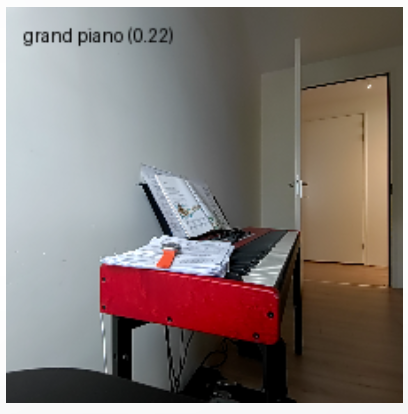
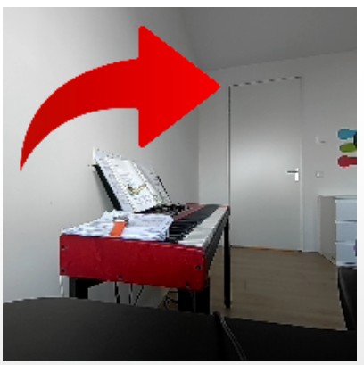
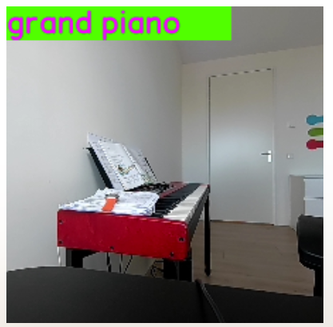

# 开发你的第一个应用程序

Qualcomm® 智能多媒体 SDK (IM SDK) 是一组 GStreamer 插件，可让您在 Dragonwing 开发板的 GPU 上运行计算机视觉操作，并且可以创建完全在 GPU 和 NPU 上运行的 AI 管道，而无需回到 CPU（零拷贝）。比起在 OpenCV + TFLite 中实现 AI CV 管道，这样可以实现更高的吞吐率。

## 集成 IM SDK 的 GStreamer 管道

智能多媒体 SDK (IM SDK) 建立在强大的多媒体框架 GStreamer 之上。开发人员能够将视频和音频处理工作流定义为管道。使用 GStreamer，您可以在一个管道字符串中定义整个处理流程，而不需要手动编写捕获帧、尺寸调整、画面裁剪、运行推理和渲染输出等步骤。框架会自动处理执行、同步和数据流。  
在 Qualcomm® 硬件上，IM SDK 通过全管道的无缝加速来进一步优化这种体验。图像尺寸调整、画面裁剪和叠加渲染等任务由 GPU 承担，而推理操作则在 NPU 上执行。这种零拷贝架构确保数据流经在整个处理过程中无需CPU介入，从而实现实时性能并降低系统负载。  
为实现这一目标，IM SDK 提供了专门的 GStreamer 插件：

`qtivtransform`：使用 GPU 加速色彩转换、画面裁剪和尺寸调整。  
`qtimltflite`：在 NPU 上执行 TensorFlow Lite 模型。

通过集成这些插件，开发人员可以使用熟悉的 GStreamer 语法构建高性能多媒体应用程序，同时享受底层的硬件加速的性能。

## 设置 GStreamer 和 IM SDK

现在我们一起来使用 IM SDK 构建一些应用程序。

1️⃣安装 GStreamer、IM SDK 以及本例中需要的一些额外依赖项。在开发板上打开终端，或建立 SSH 会话，然后执行以下操作：

```python
# Add the Qualcomm IoT PPA
sudo apt-add-repository -y ppa:ubuntu-qcom-iot/qcom-ppa

# Install GStreamer / IM SDK
sudo apt update
sudo apt install -y gstreamer1.0-tools gstreamer1.0-tools gstreamer1.0-plugins-good gstreamer1.0-plugins-base gstreamer1.0-plugins-base-apps gstreamer1.0-plugins-qcom-good gstreamer1.0-qcom-sample-apps

# Install Python bindings for GStreamer, and some build dependencies
sudo apt install -y v4l-utils libcairo2-dev pkg-config python3-dev libgirepository1.0-dev gir1.2-gstreamer-1.0
```

2️⃣克隆示例 repo，创建虚拟环境（venv），并安装其依赖项：

```python
# Clone repo
git clone https://github.com/edgeimpulse/qc-ai-docs-examples-imsdk.git
cd qc-ai-docs-examples-imsdk/tutorial

# Create a new venv
python3 -m venv .venv
source .venv/bin/activate

# Install Python dependencies
pip3 install -r requirements.txt
```

3️⃣需要准备一个摄像头（RUBIK Pi 3内置）或一个 USB 网络摄像头。

如果您想使用 USB 网络摄像头：

查看设备 ID：

```python
v4l2-ctl --list-devices
# msm_vidc_media (platform:aa00000.video-codec):
#         /dev/media0
#
# msm_vidc_decoder (platform:msm_vidc_bus):
#         /dev/video32
#         /dev/video33
#
# C922 Pro Stream Webcam (usb-0000:01:00.0-2):
#         /dev/video2     <-- So /dev/video2
#         /dev/video3
#         /dev/media3
```

4️⃣设置环境变量（我们将在示例中使用）：

```python
export IMSDK_VIDEO_SOURCE="v4l2src device=/dev/video2"
```

如果您使用的是 RUBIK Pi 3，并且想要使用内置摄像头：

```python
export IMSDK_VIDEO_SOURCE="qtiqmmfsrc name=camsrc camera=0"
```

### 示例 1：在GPU 和 CPU 上进行尺寸调整和画面裁剪

本节会展示GPU在处理速度上相较于CPU的优势。如果神经网络要求输入 224x224 RGB 的图像，则需要预处理数据：首先，从网络摄像头抓取帧（例如原始分辨率为 1980x1080）；将其裁剪为 1/1 的宽高比（例如，裁剪为 1080x1080）；调整大小为所需的分辨率（224x224）；从像素数据创建一个 Numpy 数组。

1️⃣ 创建一个新的 `ex1.py` 文件并写入以下代码：

```python
from gst_helper import gst_grouped_frames, atomic_save_image, timing_marks_to_str
import time, argparse

parser = argparse.ArgumentParser(description='GStreamer -> Python RGB frames')
parser.add_argument('--video-source', type=str, required=True, help='GStreamer video source (e.g. "v4l2src device=/dev/video2" or "qtiqmmfsrc name=camsrc camera=0")')
args, unknown = parser.parse_known_args()

PIPELINE = (
    # Video source
    f"{args.video_source} ! "
    # Properties for the video source
    "video/x-raw,width=1920,height=1080 ! "
    # An identity element so we can track when a new frame is ready (so we can calc. processing time)
    "identity name=frame_ready_webcam silent=false ! "
    # Crop to square
    "videoconvert ! aspectratiocrop aspect-ratio=1/1 ! "
    # Scale to 224x224 and RGB
    "videoscale ! video/x-raw,format=RGB,width=224,height=224 ! "
    # Event when the crop/scale are done
    "identity name=transform_done silent=false ! "
    # Send out the resulting frame to an appsink (where we can pick it up from Python)
    "queue max-size-buffers=2 leaky=downstream ! "
    "appsink name=frame drop=true sync=false max-buffers=1 emit-signals=true"
)

for frames_by_sink, marks in gst_grouped_frames(PIPELINE):
    print(f"Frame ready")
    print('    Data:', end='')
    for key in list(frames_by_sink):
        print(f' name={key} {frames_by_sink[key].shape}', end='')
    print('')
    print('    Timings:', timing_marks_to_str(marks))

    # Save image to disk, frames_by_sink has all the
    frame = frames_by_sink['frame']
    atomic_save_image(frame=frame, path='out/gstreamer.png')
```

2️⃣运行这段代码。该管道使用标准 GStreamer 组件在 CPU 上运行：

```
python
python3 ex1.py --video-source "$IMSDK_VIDEO_SOURCE"

# Frame ready
#     Data: name=frame (224, 224, 3)
#     Timings: frame_ready_webcam→transform_done: 17.89ms, transform_done→pipeline_finished: 1.89ms (total 19.78ms)
# Frame ready
#     Data: name=frame (224, 224, 3)
#     Timings: frame_ready_webcam→transform_done: 18.01ms, transform_done→pipeline_finished: 1.42ms (total 19.44ms)
```

如上，尺寸调整/画面裁剪需要 18 毫秒，总共每帧处理时间约为 20 毫秒（使用 RB3 内置摄像头测量）。

再在 GPU 上运行。将：

```python
    # Crop to square
    "videoconvert ! aspectratiocrop aspect-ratio=1/1 ! "
    # Scale to 224x224 and RGB
    "videoscale ! video/x-raw,format=RGB,width=224,height=224 ! "
```

替换为：

```python
    # Crop (square), the crop syntax is (`<X, Y, WIDTH, HEIGHT >`).
    # So here we use 1920x1080 input, then center crop to 1080x1080 ((1920-1080)/2 = 420 = x crop)
    f'qtivtransform crop="<420, 0, 1080, 1080>" ! '
    # then resize to 224x224
    "video/x-raw,format=RGB,width=224,height=224 ! "
```

再次运行：

```python
python3 ex1.py --video-source "$IMSDK_VIDEO_SOURCE"

# Frame ready
#     Data: name=frame (224, 224, 3)
#     Timings: frame_ready_webcam→transform_done: 2.48ms, transform_done→pipeline_finished: 1.64ms (total 4.13ms)
# Frame ready
#     Data: name=frame (224, 224, 3)
#     Timings: frame_ready_webcam→transform_done: 1.93ms, transform_done→pipeline_finished: 1.26ms (total 3.19ms)
```

 现在，只需两行代码就将画面裁剪/尺寸调整操作的速度提高了 9 倍。

### 示例 2：流分发与多路输出

上面的管道中已经使用了几个与自定义代码交互时会使用的元素：

标识元素（例如 `identity name=frame_ready_webcam silent=false`)。可用于调试管道中的时序。它们触发时的时间戳被保存，然后在管道末尾的“marks”元素中以键值对形式返回（键表示元素名称，值是时间戳）。

Appsink 元素（例如 `appsink name=frame`）。用于将数据从 GStreamer 管道发送到你的应用程序。这里 appsink 之前的元素是 `video/x-raw,format=RGB,width=224,height=224`，因此将向 Python 发送一个 224x224 RGB 数组。这些数据通过 `frames_by_sink` 元素以键值对形式接收（键为appsink名称，值为实际数据）。

每个管道可以有多个 appsink。比如你还想获取原始的 1920x1080 图像，那就可以在 `identity name=frame_ready_webcam` 之后将管道分成两部分，并将一部分发送到新的 appsink，另一部分通过尺寸调整/画面裁剪管道发送。

1️⃣ 创建一个新的 `ex2.py` 文件并写入如下代码：

```python
from gst_helper import gst_grouped_frames, atomic_save_image, timing_marks_to_str
import time, argparse

parser = argparse.ArgumentParser(description=`GStreamer -> Python RGB frames`)
parser.add_argument(`--video-source`, type=str, required=True, help=`GStreamer video source (e.g. "v4l2src device=/dev/video2" or "qtiqmmfsrc name=camsrc camera=0")`)
args, unknown = parser.parse_known_args()

PIPELINE = (
    # Video source
    f"{args.video_source} ! "
    # Properties for the video source
    "video/x-raw,width=1920,height=1080 ! "
    # An identity element so we can track when a new frame is ready (so we can calc. processing time)
    "identity name=frame_ready_webcam silent=false ! "

    # Split the stream
    "tee name=t "

    # Branch A) convert to RGB and send to original appsink
        "t. ! queue max-size-buffers=1 leaky=downstream ! "
        "qtivtransform ! video/x-raw,format=RGB ! "
        "appsink name=original drop=true sync=false max-buffers=1 emit-signals=true "

    # Branch B) resize/crop to 224x224 -> send to another appsink
        "t. ! queue max-size-buffers=1 leaky=downstream ! "
        # Crop (square), the crop syntax is ('<X, Y, WIDTH, HEIGHT >').
        # So here we use 1920x1080 input, then center crop to 1080x1080 ((1920-1080)/2 = 420 = x crop)
        f'qtivtransform crop="<420, 0, 1080, 1080>" ! '
        # then resize to 224x224
        "video/x-raw,format=RGB,width=224,height=224 ! "
        # Event when the crop/scale are done
        "identity name=transform_done silent=false ! "
        # Send out the resulting frame to an appsink (where we can pick it up from Python)
        "queue max-size-buffers=2 leaky=downstream ! "
        "appsink name=frame drop=true sync=false max-buffers=1 emit-signals=true "
)

for frames_by_sink, marks in gst_grouped_frames(PIPELINE):
    print(f"Frame ready")
    print('    Data:', end='')
    for key in list(frames_by_sink):
        print(f' name={key} {frames_by_sink[key].shape}', end='')
    print('')
    print('    Timings:', timing_marks_to_str(marks))

    # Save image to disk
    frame = frames_by_sink['frame']
    atomic_save_image(frame=frame, path='out/imsdk.png')
    original = frames_by_sink['original']
    atomic_save_image(frame=original, path='out/imsdk_original.png')
    ```
    
2️⃣ 运行
```Python
python3 ex2.py --video-source "$IMSDK_VIDEO_SOURCE"

# Frame ready
#     Data: name=frame (224, 224, 3) name=original (1080, 1920, 3)
#     Timings: frame_ready_webcam→transform_done: 1.79ms, transform_done→pipeline_finished: 4.75ms (total 6.54ms)
# Frame ready
#     Data: name=frame (224, 224, 3) name=original (1080, 1920, 3)
#     Timings: frame_ready_webcam→transform_done: 3.63ms, transform_done→pipeline_finished: 3.59ms (total 7.22ms)
```

（`out/` 目录包含原始分辨率和调整大小后的最后处理的帧）

好的，现在已成功通过单条流水线实现双路输出，可以在单一管道中构建更复杂的应用程序。

### 示例 3：运行神经网络

现在已经能够从网络摄像头获取正确分辨率的图像流，接下来添加神经网络。

#### 3.1：Python 中的神经网络与合成

1️⃣ 首先我们要做一个 `normal` 实现，从 IM SDK 管道中获取已调整大小的帧，然后使用 [LiteRT](https://qc-ai-test.gitbook.io/qc-ai-test-docs/running-building-ai-models/lite-rt) 在 NPU 上运行模型。之后，我们将对图像得出最终结论并将其写入磁盘。创建一个新文件 `ex3_from_python.py` 并写入以下代码：

```python
from gst_helper import gst_grouped_frames, atomic_save_pillow_image, timing_marks_to_str, download_file_if_needed, softmax
import time, argparse, numpy as np
from ai_edge_litert.interpreter import Interpreter, load_delegate
from PIL import ImageDraw, Image

parser = argparse.ArgumentParser(description='GStreamer -> SqueezeNet')
parser.add_argument('--video-source', type=str, required=True, help='GStreamer video source (e.g. "v4l2src device=/dev/video2" or "qtiqmmfsrc name=camsrc camera=0")')
args, unknown = parser.parse_known_args()

MODEL_PATH = download_file_if_needed('models/squeezenet1_1-squeezenet-1.1-w8a8.tflite', 'https://cdn.edgeimpulse.com/qc-ai-docs/models/squeezenet1_1-squeezenet-1.1-w8a8.tflite')
LABELS_PATH = download_file_if_needed('models/SqueezeNet-1.1_labels.txt', 'https://cdn.edgeimpulse.com/qc-ai-docs/models/SqueezeNet-1.1_labels.txt')

# Parse labels
with open(LABELS_PATH, 'r') as f:
    labels = [line for line in f.read().splitlines() if line.strip()]

# Load TFLite model and allocate tensors, note: this is a 224x224 model with uint8 input!
# If your models are different, then you'll need to update the pipeline below.
interpreter = Interpreter(
    model_path=MODEL_PATH,
    experimental_delegates=[load_delegate("libQnnTFLiteDelegate.so", options={"backend_type": "htp"})]     # Use NPU
)
interpreter.allocate_tensors()
input_details = interpreter.get_input_details()
output_details = interpreter.get_output_details()

PIPELINE = (
    # Video source
    f"{args.video_source} ! "
    # Properties for the video source
    "video/x-raw,width=1920,height=1080 ! "
    # An identity element so we can track when a new frame is ready (so we can calc. processing time)
    "identity name=frame_ready_webcam silent=false ! "
    # Crop (square), the crop syntax is ('<X, Y, WIDTH, HEIGHT >').
    # So here we use 1920x1080 input, then center crop to 1080x1080 ((1920-1080)/2 = 420 = x crop)
    f'qtivtransform crop="<420, 0, 1080, 1080>" ! '
    # then resize to 224x224
    "video/x-raw,format=RGB,width=224,height=224 ! "
    # Event when the crop/scale are done
    "identity name=transform_done silent=false ! "
    # Send out the resulting frame to an appsink (where we can pick it up from Python)
    "queue max-size-buffers=2 leaky=downstream ! "
    "appsink name=frame drop=true sync=false max-buffers=1 emit-signals=true "
)

for frames_by_sink, marks in gst_grouped_frames(PIPELINE):
    print(f"Frame ready")
    print('    Data:', end='')
    for key in list(frames_by_sink):
        print(f' name={key} {frames_by_sink[key].shape}', end='')
    print('')

    # Begin inference timer
    inference_start = time.perf_counter()

    # Set tensor with the image received in "frames_by_sink['frame']", add batch dim, and run inference
    interpreter.set_tensor(input_details[0]['index'], frames_by_sink['frame'].reshape((1, 224, 224, 3)))
    interpreter.invoke()

    # Get prediction (dequantized)
    q_output = interpreter.get_tensor(output_details[0]['index'])
    scale, zero_point = output_details[0]['quantization']
    f_output = (q_output.astype(np.float32) - zero_point) * scale

    # Image classification models in AI Hub miss a Softmax() layer at the end of the model, so add it manually
    scores = softmax(f_output[0])

    # End inference timer
    inference_end = time.perf_counter()

    # Add an extra mark, so we have timing info for the complete pipeline
    marks['inference_done'] = list(marks.items())[-1][1] + (inference_end - inference_start)

    # Print top-5 predictions
    top_k = scores.argsort()[-5:][::-1]
    print(f"    Top-5 predictions:")
    for i in top_k:
        print(f"        Class {labels[i]}: score={scores[i]}")

    # Image composition timer
    image_composition_start = time.perf_counter()

    # Add the top 5 scores to the image, and save image to disk (for debug purposes)
    frame = frames_by_sink['frame']
    img = Image.fromarray(frame)
    img_draw = ImageDraw.Draw(img)
    img_draw.text((10, 10), f"{labels[top_k[0]]} ({scores[top_k[0]]:.2f})", fill="black")
    atomic_save_pillow_image(img=img, path='out/imsdk_with_prediction.png')

    image_composition_end = time.perf_counter()

    # Add an extra mark, so we have timing info for the complete pipeline
    marks['image_composition_end'] = list(marks.items())[-1][1] + (image_composition_end - image_composition_start)

    print('    Timings:', timing_marks_to_str(marks))

```

2️⃣现在运行此应用程序：

```python
# We use '| grep -v "<W>"' to filter out some warnings - you can omit it if you want.
python3 ex3_from_python.py --video-source "$IMSDK_VIDEO_SOURCE" | grep -v "<W>"

# Frame ready
# Data: name=frame (224, 224, 3)
# Top-5 predictions:
#     Class grand piano: score=0.236373171210289
#     Class studio couch: score=0.06304315477609634
#     Class dining table: score=0.04321642965078354
#     Class umbrella: score=0.04321642965078354
#     Class quilt: score=0.035781171172857285
# Timings: frame_ready_webcam→transform_done: 2.59ms, transform_done→pipeline_finished: 1.52ms, pipeline_finished→inference_done: 1.14ms, inference_done→image_composition_end: 24.84ms (total 30.09ms)
```



效果不错。再看看是否可以做得更好。

#### 3.2：使用 IM SDK 运行神经网络

将神经网络推理转移到 IM SDK。可以通过三个插件来实现：  
`qtimlvconverter` - 将帧转换为输入张量。

`qtimltflite` - 运行神经网络（LiteRT 格式）。如果通过 appsink 发送这些结果，将获得与之前完全相同的张量（只是不需要通过 CPU 来调用推理引擎）。

像 `qtimlvclassification` 这样的元素来解释输出。这个插件专为图像分类用例（例如我们使用的 SqueezeNet 模型）设计，输出形状为 (1, n)。这个插件可以输出文本（包含预测结果），或者输出覆盖层（用于绘制到原始图像上）。

* 该元素具有特定的标签格式（见下文）。  
1️⃣ 创建一个新的 `ex3_nn_imsdk.py` 文件并写入如下代码：

```python
from gst_helper import gst_grouped_frames, atomic_save_pillow_image, timing_marks_to_str, download_file_if_needed, softmax
import time, argparse, numpy as np
from ai_edge_litert.interpreter import Interpreter, load_delegate
from PIL import ImageDraw, Image

parser = argparse.ArgumentParser(description='GStreamer -> SqueezeNet')
parser.add_argument('--video-source', type=str, required=True, help='GStreamer video source (e.g. "v4l2src device=/dev/video2" or "qtiqmmfsrc name=camsrc camera=0")')
args, unknown = parser.parse_known_args()

MODEL_PATH = download_file_if_needed('models/squeezenet1_1-squeezenet-1.1-w8a8.tflite', 'https://cdn.edgeimpulse.com/qc-ai-docs/models/squeezenet1_1-squeezenet-1.1-w8a8.tflite')
LABELS_PATH = download_file_if_needed('models/SqueezeNet-1.1_labels.txt', 'https://cdn.edgeimpulse.com/qc-ai-docs/models/SqueezeNet-1.1_labels.txt')

# Parse labels
with open(LABELS_PATH, 'r') as f:
    labels = [line for line in f.read().splitlines() if line.strip()]

# IM SDK expects labels in this format
# (structure)"white-shark,id=(guint)0x3,color=(guint)0x00FF00FF;" (so no spaces in the name)
IMSDK_LABELS_PATH = 'models/SqueezeNet-1.1_imsdk_labels.txt'
with open(IMSDK_LABELS_PATH, 'w') as f:
    imsdk_labels_content = []
    for i in range(0, len(labels)):
        label = labels[i]
        label = label.replace(' ', '-') # no space allowed
        label = label.replace("'", '') # no ' allowed
        imsdk_labels_content.append(f'(structure)"{label},id=(guint){hex(i)},color=(guint)0x00FF00FF;"')
    f.write('\n'.join(imsdk_labels_content))

# Load TFLite model and allocate tensors, note: this is a 224x224 model with uint8 input!
# If your models are different, then you'll need to update the pipeline below.
interpreter = Interpreter(
    model_path=MODEL_PATH,
    experimental_delegates=[load_delegate("libQnnTFLiteDelegate.so", options={"backend_type": "htp"})]     # Use NPU
)
interpreter.allocate_tensors()
input_details = interpreter.get_input_details()
output_details = interpreter.get_output_details()
scale, zero_point = output_details[0]['quantization']

PIPELINE = (
    # Video source
    f"{args.video_source} ! "
    # Properties for the video source
    "video/x-raw,width=1920,height=1080 ! "
    # An identity element so we can track when a new frame is ready (so we can calc. processing time)
    "identity name=frame_ready_webcam silent=false ! "
    # Crop (square), the crop syntax is ('<X, Y, WIDTH, HEIGHT >').
    # So here we use 1920x1080 input, then center crop to 1080x1080 ((1920-1080)/2 = 420 = x crop)
    f'qtivtransform crop="<420, 0, 1080, 1080>" ! '
    # then resize to 224x224, (!! NOTE: here you need to use format=NV12 to get a tightly packed buffer - if you use RGB this won't work !!)
    "video/x-raw,width=224,height=224,format=NV12 ! "
    # Event when the crop/scale are done
    "identity name=transform_done silent=false ! "

    # turn into right format (UINT8 data type) and add batch dimension
    'qtimlvconverter ! neural-network/tensors,type=UINT8,dimensions=<<1,224,224,3>> ! '
    # Event when conversion is done
    "identity name=conversion_done silent=false ! "
    # run inference (using the QNN delegates to run on NPU)
    f'qtimltflite delegate=external external-delegate-path=libQnnTFLiteDelegate.so external-delegate-options="QNNExternalDelegate,backend_type=htp;" model="{MODEL_PATH}" ! '
    # Event when inference is done
    "identity name=inference_done silent=false ! "

    # Run the classifier (add softmax, as AI Hub models miss it), this will return the top n labels (above threshold, min. threshold is 10)
    # note that you also need to pass the quantization params (see below under the "gst_grouped_frames" call).
    f'qtimlvclassification name=cls module=mobilenet extra-operation=softmax threshold=10 results=1 labels="{IMSDK_LABELS_PATH}" ! '
    "identity name=classification_done silent=false ! "

    # The qtimlvclassification can either output a video/x-raw,format=BGRA,width=224,height=224 element (overlay),
    # or a text/x-raw element (raw text) - here we want the text
    "text/x-raw,format=utf8 ! "

    # Send to application
    "queue max-size-buffers=2 leaky=downstream ! "
    'appsink name=qtimlvclassification_text drop=true sync=false max-buffers=1 emit-signals=true '
)

for frames_by_sink, marks in gst_grouped_frames(PIPELINE, element_properties={
    # the qtimlvclassification element does not like these variables passed in as a string in the pipeline, so set them like this
    'cls': { 'constants': f'Mobilenet,q-offsets=<{zero_point}>,q-scales=<{scale}>' }
}):
    print(f"Frame ready")
    print('    Data:', end='')
    for key in list(frames_by_sink):
        print(f' name={key} {frames_by_sink[key].shape} ({frames_by_sink[key].dtype})', end='')
    print('')

    # Grab the qtimlvclassification_text (utf8 text) with predictions from IM SDK
    qtimlvclassification_text = frames_by_sink['qtimlvclassification_text'].tobytes().decode("utf-8")
    print('    qtimlvclassification_text:', qtimlvclassification_text)

    print('    Timings:', timing_marks_to_str(marks))
    ```
    :::warning
    NV12: 我们将格式从 `RGB` 切换为 `NV12` (在 `qtivtransform`之后)，因为 `qtimltflite` 要求缓冲区为紧凑排列，而 RGB 输出使用了行步进填充。 这类问题通常极难调试。 在命令前添加 `GST_DEBUG=3`（ 例如 `GST_DEBUG=3 python3 ex3_nn_imsdk.py`) 然后将管道的详细日志与报错信息提交给像 ChatGPT 这样的大语言模型，有时能获得帮助。 
    :::

    2️⃣ 现在请运行此应用程序： 
    ```python 
    # We use '| grep -v "<W>"' to filter out some warnings - you can omit it if you want.
    python3 ex3_nn_imsdk.py --video-source "$IMSDK_VIDEO_SOURCE" | grep -v "<W>"

# Frame ready
#     Data: name=qtimlvclassification_text (337,) (uint8)
#     qtimlvclassification_text: { (structure)"ImageClassification\,\ batch-index\=\(uint\)0\,\ labels\=\(structure\)\<\ \"grand.piano\\\,\\\ id\\\=\\\(uint\\\)256\\\,\\\ confidence\\\=\\\(double\\\)52.870616912841797\\\,\\\ color\\\=\\\(uint\\\)16711935\\\;\"\ \>\,\ timestamp\=\(guint64\)1471167589\,\ sequence-index\=\(uint\)1\,\ sequence-num-entries\=\(uint\)1\;" }
#     Timings: frame_ready_webcam→transform_done: 3.86ms, transform_done→inference_done: 4.04ms, inference_done→pipeline_finished: 0.74ms (total 8.65ms)
```

好的，该模型现在在 IM SDK 管道内的 NPU 上运行。如果你更想获得前 5 个输出（如 3.1），可以在qtimltflite元素之后分流，并将原始输出张量发送回应用程序。

:::note
叠加图像：如果想查看覆盖图像而非文本，请参考 `tutorial/_ex3_nn_imsdk_show_overlay.py`。
:::

#### 3.3: 叠加层

为了效仿 3.1 中的输出，我们还要绘制一个叠加层。让我们首先用静态叠加图像来演示。  
1️⃣ 下载半透明图像 [源](https://commons.wikimedia.org/wiki/File:PNG_transparency_demonstration_2.png)：

```python
mkdir -p images
wget -O images/imsdk-transparent-static.png https://cdn.edgeimpulse.com/qc-ai-docs/example-images/imsdk-transparent-static.png
```

2️⃣ 创建一个新的 `ex3_overlay.py` 文件并写入如下代码：

```python
from gst_helper import gst_grouped_frames, atomic_save_image, timing_marks_to_str, download_file_if_needed, softmax
import time, argparse, numpy as np
from ai_edge_litert.interpreter import Interpreter, load_delegate
from PIL import ImageDraw, Image

parser = argparse.ArgumentParser(description='GStreamer -> SqueezeNet')
parser.add_argument('--video-source', type=str, required=True, help='GStreamer video source (e.g. "v4l2src device=/dev/video2" or "qtiqmmfsrc name=camsrc camera=0")')
args, unknown = parser.parse_known_args()

if args.video_source.strip() == '':
    raise Exception('--video-source is empty, did you not set the IMSDK_VIDEO_SOURCE env variable? E.g.:\n' +
    '    export IMSDK_VIDEO_SOURCE="v4l2src device=/dev/video2"')

# Source: https://commons.wikimedia.org/wiki/File:Arrow_png_image.png
OVERLAY_IMAGE = download_file_if_needed('images/imsdk-transparent-static.png', 'https://cdn.edgeimpulse.com/qc-ai-docs/example-images/imsdk-transparent-static.png')
OVERLAY_WIDTH = 128
OVERLAY_HEIGHT = 96

PIPELINE = (
    # Part 1: Create a qtivcomposer with two sinks (we'll write webcam to sink 0, overlay to sink 1)
    "qtivcomposer name=comp sink_0::zorder=0 "
        # Sink 1 (the overlay) will be at x=10, y=10; and sized 128x96
        f"sink_1::zorder=1 sink_1::alpha=1.0 sink_1::position=<10,10> sink_1::dimensions=<{OVERLAY_WIDTH},{OVERLAY_HEIGHT}> ! "
    "videoconvert ! "
    "video/x-raw,format=RGBA,width=224,height=224 ! "
    # Write frames to appsink
    "appsink name=overlay_raw drop=true sync=false max-buffers=1 emit-signals=true "

    # Part 2: Grab image from webcam and write the composer
        # Video source
        f"{args.video_source} ! "
        # Properties for the video source
        "video/x-raw,width=1920,height=1080 ! "
        # An identity element so we can track when a new frame is ready (so we can calc. processing time)
        "identity name=frame_ready_webcam silent=false ! "
        # Crop (square), the crop syntax is ('<X, Y, WIDTH, HEIGHT >').
        # So here we use 1920x1080 input, then center crop to 1080x1080 ((1920-1080)/2 = 420 = x crop)
        f'qtivtransform crop="<420, 0, 1080, 1080>" ! '
        # then resize to 224x224
        "video/x-raw,width=224,height=224,format=NV12 ! "
        # Event when the crop/scale are done
        "identity name=transform_done silent=false ! "
        # Write to sink 0 on the composer
        "comp.sink_0 "

    # Part 3: Load overlay from disk and write to composer (sink 1)
        # Image (statically from disk)
        f'filesrc location="{OVERLAY_IMAGE}" ! '
        # Decode PNG
        "pngdec ! "
        # Turn into a video (scaled to 128x96, RGBA format so we keep transparency, requires a framerate)
        "imagefreeze ! "
        "videoscale ! "
        "videoconvert ! "
        f"video/x-raw,format=RGBA,width={OVERLAY_WIDTH},height={OVERLAY_HEIGHT},framerate=30/1 ! "
        # Write to sink 1 on the composer
        "comp.sink_1 "
)

for frames_by_sink, marks in gst_grouped_frames(PIPELINE):
    print(f"Frame ready")
    print('    Data:', end='')
    for key in list(frames_by_sink):
        print(f' name={key} {frames_by_sink[key].shape} ({frames_by_sink[key].dtype})', end='')
    print('')

    # Save image to disk
    save_image_start = time.perf_counter()
    frame = frames_by_sink['overlay_raw']
    atomic_save_image(frame=frame, path='out/webcam_with_overlay.png')
    save_image_end = time.perf_counter()

    # Add an extra mark, so we have timing info for the complete pipeline
    marks['save_image_end'] = list(marks.items())[-1][1] + (save_image_end - save_image_start)

    print('    Timings:', timing_marks_to_str(marks))
    ```
3️⃣ 运行此应用程序：  
```python 
# We use '| grep -v "<W>"' to filter out some warnings - you can omit it if you want.
python3 ex3_overlay.py --video-source "$IMSDK_VIDEO_SOURCE" | grep -v "<W>"

# Frame ready
#     Data: name=overlay_raw (224, 224, 4) (uint8)
#     Timings: frame_ready_webcam→transform_done: 2.22ms, transform_done→pipeline_finished: 5.17ms, pipeline_finished→save_image_end: 21.51ms (total 28.89ms)
```



#### 3.4：将神经网络与叠加层相结合

现在你已经了解了如何将神经网络作为 IM SDK 管道的一部分运行，并且已经了解如何绘制叠加图。下面将它们组合成一个管道，将预测叠加到图像上。所有操作不涉及 CPU。

1️⃣ 创建一个新的 `ex3_from_imsdk.py` 文件并写入如下代码：

```python

from gst_helper import gst_grouped_frames, atomic_save_numpy_buffer, timing_marks_to_str, download_file_if_needed, softmax
import time, argparse, numpy as np
from ai_edge_litert.interpreter import Interpreter, load_delegate
from PIL import ImageDraw, Image

parser = argparse.ArgumentParser(description='GStreamer -> SqueezeNet')
parser.add_argument('--video-source', type=str, required=True, help='GStreamer video source (e.g. "v4l2src device=/dev/video2" or "qtiqmmfsrc name=camsrc camera=0")')
args, unknown = parser.parse_known_args()

if args.video_source.strip() == '':
    raise Exception('--video-source is empty, did you not set the IMSDK_VIDEO_SOURCE env variable? E.g.:\n' +
    '    export IMSDK_VIDEO_SOURCE="v4l2src device=/dev/video2"')

MODEL_PATH = download_file_if_needed('models/squeezenet1_1-squeezenet-1.1-w8a8.tflite', 'https://cdn.edgeimpulse.com/qc-ai-docs/models/squeezenet1_1-squeezenet-1.1-w8a8.tflite')
LABELS_PATH = download_file_if_needed('models/SqueezeNet-1.1_labels.txt', 'https://cdn.edgeimpulse.com/qc-ai-docs/models/SqueezeNet-1.1_labels.txt')

# Parse labels
with open(LABELS_PATH, 'r') as f:
    labels = [line for line in f.read().splitlines() if line.strip()]

# IM SDK expects labels in this format
# (structure)"white-shark,id=(guint)0x3,color=(guint)0x00FF00FF;" (so no spaces in the name)
IMSDK_LABELS_PATH = 'models/SqueezeNet-1.1_imsdk_labels.txt'
with open(IMSDK_LABELS_PATH, 'w') as f:
    imsdk_labels_content = []
    for i in range(0, len(labels)):
        label = labels[i]
        label = label.replace(' ', '-') # no space allowed
        label = label.replace("'", '') # no ' allowed
        imsdk_labels_content.append(f'(structure)"{label},id=(guint){hex(i)},color=(guint)0x00FF00FF;"')
    f.write('\n'.join(imsdk_labels_content))

# Load TFLite model and allocate tensors, note: this is a 224x224 model with uint8 input!
# If your models are different, then you'll need to update the pipeline below.
interpreter = Interpreter(
    model_path=MODEL_PATH,
    experimental_delegates=[load_delegate("libQnnTFLiteDelegate.so", options={"backend_type": "htp"})]     # Use NPU
)
interpreter.allocate_tensors()
input_details = interpreter.get_input_details()
output_details = interpreter.get_output_details()
scale, zero_point = output_details[0]['quantization']

PIPELINE = (
    # Part 1: Create a qtivcomposer with two sinks (we'll write webcam to sink 0, overlay to sink 1)
    "qtivcomposer name=comp sink_0::zorder=0 "
        # Sink 1 (the overlay). We don't need to pass in a position/size as the overlay will already be the right size.
        f"sink_1::zorder=1 sink_1::alpha=1.0 ! "
    "videoconvert ! "
    "video/x-raw,format=RGBA,width=224,height=224 ! "
    # Convert to PNG
    "identity name=pngenc_begin silent=false ! "
    "pngenc ! "
    "identity name=pngenc_done silent=false ! "
    # Write frames to appsink
    "appsink name=image_with_overlay drop=true sync=false max-buffers=1 emit-signals=true "

    # Video source
    f"{args.video_source} ! "
    # Properties for the video source
    "video/x-raw,width=1920,height=1080 ! "
    # An identity element so we can track when a new frame is ready (so we can calc. processing time)
    "identity name=frame_ready_webcam silent=false ! "
    # Crop (square), the crop syntax is ('<X, Y, WIDTH, HEIGHT >').
    # So here we use 1920x1080 input, then center crop to 1080x1080 ((1920-1080)/2 = 420 = x crop)
    f'qtivtransform crop="<420, 0, 1080, 1080>" ! '
    # then resize to 224x224, (!! NOTE: here you need to use format=NV12 to get a tightly packed buffer - if you use RGB this won't work !!)
    "video/x-raw,width=224,height=224,format=NV12 ! "
    # Event when the crop/scale are done
    "identity name=transform_done silent=false ! "

    # Tee the stream
    "tee name=v "

    # Branch A) send the image to the composer (sink 0)
        "v. ! queue max-size-buffers=1 leaky=downstream ! "
        "comp.sink_0 "

    # Branch B) run inference over the image
        "v. ! queue max-size-buffers=1 leaky=downstream ! "
        # turn into right format (UINT8 data type) and add batch dimension
        'qtimlvconverter ! neural-network/tensors,type=UINT8,dimensions=<<1,224,224,3>> ! '
        # run inference (using the QNN delegates to run on NPU)
        f'qtimltflite delegate=external external-delegate-path=libQnnTFLiteDelegate.so external-delegate-options="QNNExternalDelegate,backend_type=htp;" model="{MODEL_PATH}" ! '

        # Split the stream
        "tee name=t "

        # Branch B1) send raw results to the appsink (note that these are still quantized!)
            "t. ! queue max-size-buffers=1 leaky=downstream ! "
            "queue max-size-buffers=2 leaky=downstream ! "
            "appsink name=qtimltflite_output drop=true sync=false max-buffers=1 emit-signals=true "

        # Branch B2) parse the output tensor in IM SDK
            "t. ! queue max-size-buffers=1 leaky=downstream ! "
            # Run the classifier (add softmax, as AI Hub models miss it), this will return the top n labels (above threshold, min. threshold is 10)
            # note that you also need to pass the quantization params (see below under the "gst_grouped_frames" call).
            f'qtimlvclassification name=cls module=mobilenet extra-operation=softmax threshold=10 results=1 labels="{IMSDK_LABELS_PATH}" ! '
            # Event when inference is done
            "identity name=inference_done silent=false ! "

            # create an RGBA overlay
            "video/x-raw,format=BGRA,width=224,height=224 ! "

            # And send to the composer
            "comp.sink_1 "
)

for frames_by_sink, marks in gst_grouped_frames(PIPELINE, element_properties={
    # the qtimlvclassification element does not like these variables passed in as a string in the pipeline, so set them like this
    'cls': { 'constants': f'Mobilenet,q-offsets=<{zero_point}>,q-scales=<{scale}>' }
}):
    print(f"Frame ready")
    print('    Data:', end='')
    for key in list(frames_by_sink):
        print(f' name={key} {frames_by_sink[key].shape} ({frames_by_sink[key].dtype})', end='')
    print('')

    # Get prediction (these come in quantized, so dequantize first)
    q_output = frames_by_sink['qtimltflite_output']
    f_output = (q_output.astype(np.float32) - zero_point) * scale

    # Image classification models in AI Hub miss a Softmax() layer at the end of the model, so add it manually
    scores = softmax(f_output)
    top_k = scores.argsort()[-5:][::-1]
    print(f"    Top-5 predictions:")
    for i in top_k:
        print(f"        Class {labels[i]}: score={scores[i]}")

    # Save image to disk
    save_image_start = time.perf_counter()
    png_file = frames_by_sink['image_with_overlay']
    atomic_save_numpy_buffer(png_file, path='out/webcam_with_overlay_imsdk.png')
    save_image_end = time.perf_counter()

    # Add an extra mark, so we have timing info for the complete pipeline
    marks['save_image_end'] = list(marks.items())[-1][1] + (save_image_end - save_image_start)

    print('    Timings:', timing_marks_to_str(marks))
```

2️⃣ 运行此应用程序：

```python
# We use '| grep -v "<W>"' to filter out some warnings - you can omit it if you want.
python3 ex3_from_imsdk.py --video-source "$IMSDK_VIDEO_SOURCE" | grep -v "<W>"

# Frame ready
#     Data: name=image_with_overlay (49550,) (uint8) name=qtimltflite_output (1000,) (uint8)
#     Top-5 predictions:
#         Class grand piano: score=0.2539741098880768
#         Class spotlight: score=0.056083470582962036
#         Class punching bag: score=0.03183111920952797
#         Class accordion: score=0.03183111920952797
#         Class projector: score=0.0218204278498888
#   Timings: frame_ready_webcam→transform_done: 1.69ms, transform_done→inference_done: 6.93ms, inference_done→pngenc_begin: 1.50ms, pngenc_begin→pngenc_done: 15.96ms, pngenc_done→pipeline_finished: 0.76ms, pipeline_finished→save_image_end: 1.10ms (total 27.95ms)
```

很棒，整个管道现在在 IM SDK 中运行。输出图像在 *out/webcam_with_overlay_imsdk.png*：



## 故障排除

#### 管道无输出

如果管道没有任何输出，请添加 `GST_DEBUG=3` 查看调试详情。

```python
GST_DEBUG=3 python3 ex1.py
```

#### QMMF Recorder StartCamera Failed / 无法打开摄像头

若在使用 RUBIK Pi 3 内置摄像头时看到此类报错：

```python
0:00:00.058915726  7329     0x1faf28a0 ERROR             qtiqmmfsrc qmmf_source_context.cc:1426:gst_qmmf_context_open: QMMF Recorder StartCamera Failed!
0:00:00.058955986  7329     0x1faf28a0 WARN              qtiqmmfsrc qmmf_source.c:1206:qmmfsrc_change_state:<camsrc> error: Failed to Open Camera!
```

运行：

```python
sudo killall cam-server
```