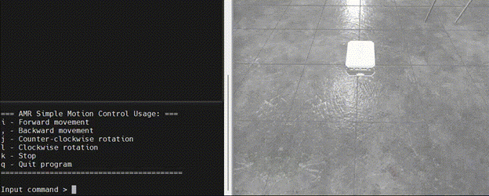
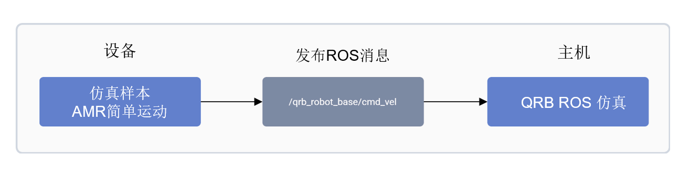

# 机器人示例应用程序

基于 Ubuntu 的 Qualcomm® 智能机器人 (QIR) SDK，为您在 Qualcomm 平台上开发机器人应用提供了所需的核心组件。

## QIR SDK 的主要功包括：

• 	**参考 ROS 软件包**：提供机器人操作系统 (ROS) 软件包，支持机器人应用程序开发。  
• 	**端到端场景示例**：包含示例场景来帮助评估机器人平台。  
• 	**QRB ROS 传输**：在高通机器人平台上实现 ROS 消息的零拷贝传输。

:::note 
QRB ROS Transport 基于 [REP 2007](https://www.ros.org/reps/rep-2007.html)实现，该标准定义了序列化自定义类型的接口，支持无需转换的进程内通信。
:::

**前提条件**

* **Ubuntu 操作系统** 已刷入。
* 具有适当权限的**终端访问**。
* 如果您之前没有安装过 PPA 包，请按照以下步骤进行安装。
  ```shell
    git clone -b ubuntu_setup --single-branch https://github.com/rubikpi-ai/rubikpi-script.git 
    cd rubikpi-script  
    ./install_ppa_pkgs.sh 
  ```

## 在 Ubuntu 上开始使用 QIR SDK

本指南将指导您在运行 Ubuntu 的开发套件上使用 QIR 示例应用程序。

## 设置说明：

1. 使用脚本获取 ROS2 和 QIR SDK。
2. 安装 QIR SDK。
3. 根据 [ROS2 documentation](https://github.com/ros2/ros2_documentation/blob/jazzy/source/Installation/_Apt-Repositories.rst) 将 ROS 源添加到设备。
4. 将 Qualcomm 公共 PPA 档案添加到您的 Ubuntu 软件源：

```shell
sudo add-apt-repository ppa:ubuntu-qcom-iot/qcom-ppa
sudo add-apt-repository ppa:ubuntu-qcom-iot/qirp
```

5. 安装并配置 QIR SDK：

```shell
sudo apt install qirp-sdk
source /usr/share/qirp-setup.sh
```

## 示例应用程序

QIR SDK 包含各种示例应用程序，分类如下：  
• 	**平台示例应用程序**：展示平台级能力。  
• 	**机器人示例应用程序**：实现机器人功能，例如 CPU 负载监控和基于 ROS2 的机器人仿真。

## 仿真示例 – 自主移动机器人简单运动

**自主移动机器人（AMR）简单运动**是一个模拟示例应用程序，它使用基于 Python 的 ROS 节点来控制 QRB 自主移动机器人 (AMR) 在仿真环境的的运动。

[qrb-ros-simulation](https://github.com/qualcomm-qrb-ros/qrb_ros_simulation) 软件包提供了一个仿真环境。您可以通过向 /qrb\_robot\_base/cmd\_vel 主题发布ROS消息来控制QRB AMR的运动。  


## QRB AMR简单运动的管道流

下图展示了QRB AMR 简单运动的的管道流程：  


## AMR简单运动管道中使用的ROS节点

AMR简单运动管道中使用的ROS节点如下：  
|ROS 节点	           |描述|
|----------------------|-------------|
|Qrb_ros-simulation    |qrb_ros_simulation 是一个专用于搭建高通机器人仿真环境的ROS功能包。|

## 参考文档

有关运行示例应用程序的详细说明，请参阅 [Qualcomm Intelligent Robotics SDK for Ubuntu](https://docs.qualcomm.com/bundle/publicresource/topics/80-90441-2/robotics-platform-samples_3_1.html?state=preview)。