# OpenClaw 在 RUBIK Pi (Ubuntu) 上的完整部署指南

OpenClaw（原名 Clawd Bot）是一个注重隐私、支持自托管的 AI 助手网关，可以将 WhatsApp、Telegram、飞书等聊天平台连接到 AI 模型。 本指南将引导你在运行 Ubuntu 系统的 RUBIK Pi 上部署 OpenClaw，以 MiniMax M2.1 模型（按量付费）为例完成配置，并介绍如何对接飞书和 WhatsApp。 
:::warning 
OpenClaw 消耗 Token 速度较快，使用按量付费模式时务必设置余额告警，避免意外产生高额费用。
:::


**官方资源：**
官网：https://openclaw.ai

GitHub：https://github.com/openclaw/openclaw

文档：https://docs.clawd.bot

## 前置准备：获取 MiniMax API Key

本指南以 **MiniMax M2.1** 模型为例。在开始安装 OpenClaw 之前，你需要先获取 MiniMax 的 API Key。
:::note 
OpenClaw 支持多种模型提供商（Anthropic Claude、OpenAI GPT、Google Gemini、本地模型等）。如果你使用其他提供商，可跳过此节，在配置时选择对应的提供商即可。 
:::

**1. 注册并充值**
1. 访问 [MiniMax 开放平台](https://platform.minimaxi.com/)，注册账号并登录。
2. 进入 **用户中心**，完成充值（MiniMax 新用户会赠送 15 元代金券）。
3. **强烈建议**：在用户中心设置 **余额告警**（例如余额低于 30 元时告警），OpenClaw 消耗 Token 速度较快，务必提前设好告警以避免意外高额费用。
   
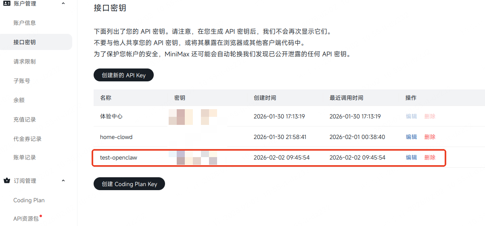

**2. 创建 API Key**
1. 在开放平台中，进入 **账号管理** > **接口密钥** > **创建新的 API Key**。
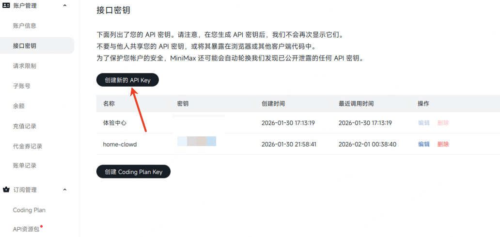
1. 填写密钥名称（任意即可），点击 **创建新的密钥**。
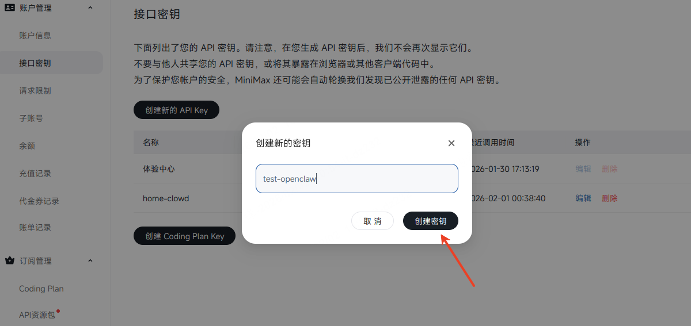

1. **重要：** 密钥创建后只展示一次，无法再次查看。请务必立即将密钥复制保存到本地安全位置，后续安装配置时需要多次使用。
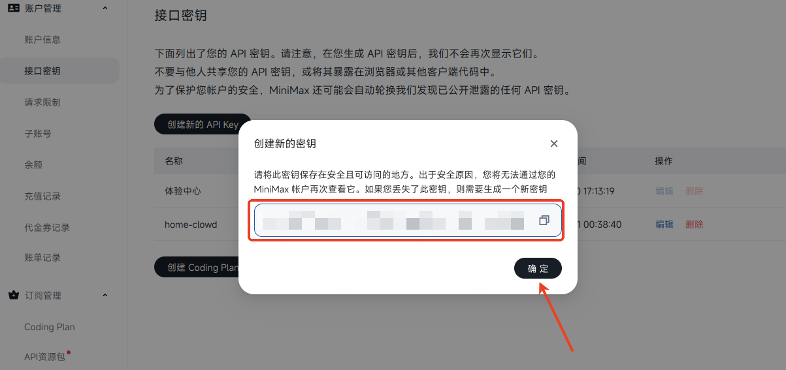

创建完成后效果如下：

:::note
想激活免费额度，需要在平台进行认证。
:::

| 参考文档： [MiniMax OpenClaw 安装文档](https://platform.minimaxi.com/docs/coding-plan/openclaw) |


## 第一部分：在 RUBIK Pi 上安装 OpenClaw

### 1. 检查系统环境
OpenClaw 要求 **Node.js 版本 ≥ 22**。RUBIK Pi 的 Ubuntu 系统默认未安装 Node.js，需要我们手动安装。
打开终端，检查 Node.js 是否已安装：
```
node -v
npm -v
```


如果提示"命令未找到"或显示的版本低于 22，请继续下一步。

同时检查 **Git** 是否已安装：
`git --version`

如果 Git 未安装，执行以下命令安装：
`sudo apt update && sudo apt install -y git`

### 2. 安装 Node.js
推荐使用 **nvm**（Node 版本管理器）来安装和管理 Node.js 版本。
```
#若环境没有curl
sudo apt update 
sudo apt install curl -y
# 下载并安装 nvm
curl -o- https://raw.githubusercontent.com/nvm-sh/nvm/v0.40.3/install.sh | bash
# 加载 nvm 到当前终端（无需重启终端）
\. "$HOME/.nvm/nvm.sh"
# 安装 Node.js（v22 或更新版本）
nvm install 22
# 验证安装结果
node -v   # 应显示 v22.x.x 或更高
npm -v    # 应显示 10.x.x 或更高 
```


:::note 
你也可以使用 `nvm install --lts` 安装最新的 LTS 版本。只要版本 ≥ 22，OpenClaw 就能正常运行。
:::

### 3. 检测网络连通性
在安装 OpenClaw 之前，确保 RUBIK Pi 能正常访问互联网：
```
ping -c 3 github.com
ping -c 3 registry.npmjs.org
```
如果你在防火墙或受限网络环境中，可以设置代理：

(可选)：如需要可设置 HTTP 代理
```
export HTTP_PROXY=http://你的代理地址:端口
export HTTPS_PROXY=http://你的代理地址:端口
```
### 4. 安装 OpenClaw
提供两种安装方式，根据实际情况选择。

打开 OpenClaw 官网 ：https://openclaw.ai/

* 方式 A：一键安装脚本（推荐）
```
JSON
curl -fsSL https://openclaw.bot/install.sh | bash
```

脚本会自动下载和配置 OpenClaw。安装通常需要 **5–10 分钟**，取决于网络速度。如果 15 分钟后仍未完成，建议改用方式 B。

安装过程截图：

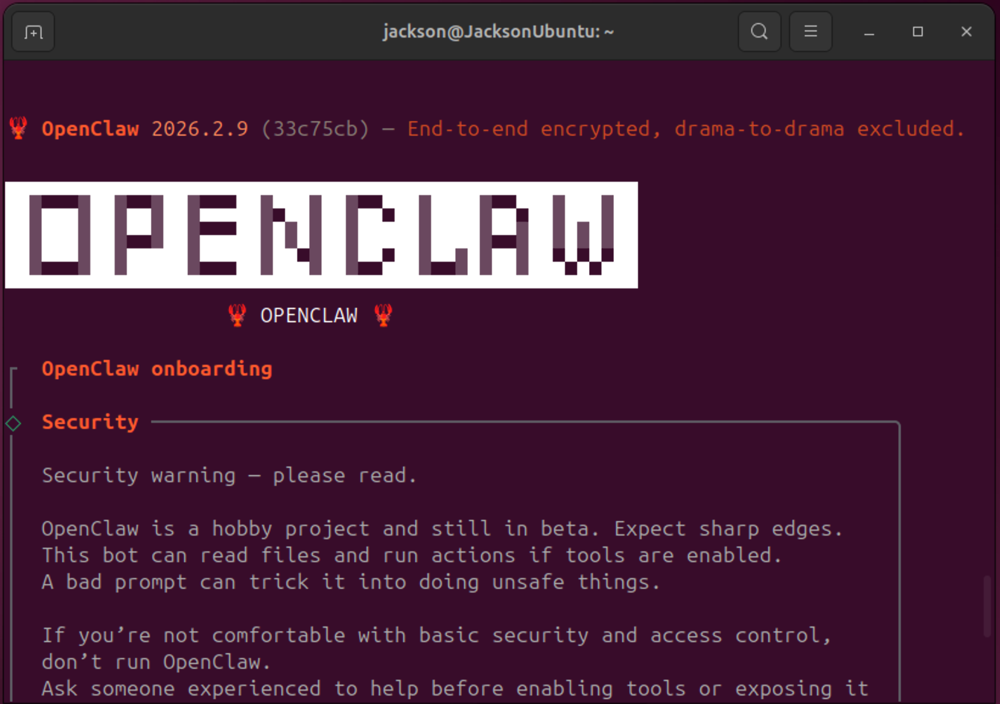
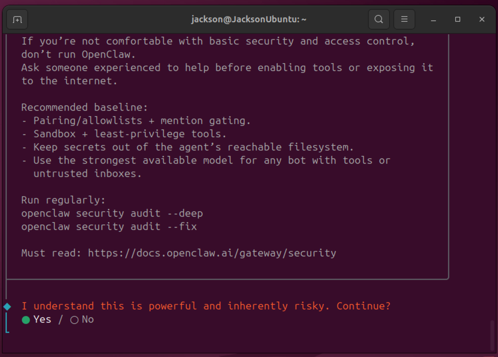
如果看到以上界面，说明安装成功，可以继续后续配置。
:::note
根据版本不同界面略有差异，总体来说显示 openclaw install successfully 即可。
:::

* 方式 B：通过 npm 安装
* 
`npm i -g openclaw`

安装完成后验证：
`openclaw --version`

### 5. 配置 OpenClaw（Onboarding 向导）
安装完成后会自动进入配置向导。如果没有自动弹出，手动运行：
`openclaw onboard`

以下是以 **MiniMax M2.1** 为例的完整配置步骤：
| 步骤 | 选项 | 选择 |
| :--- | :--- | :--- |
| 1 | Onboarding mode | **QuickStart** |
| 2 | Model/auth provider | **MiniMax** |
| 3 | MiniMax auth method | **MiniMax M2.1** |
| 4 | Enter MiniMax API Key | 输入你在前置准备中获取的 API Key |
| 5 | Default model | **Keep Current** |
| 6 | Configure channels (WhatsApp 等) | **Skip for now**（后续可在 Web UI 中配置） |
| 7 | Configure skills now | **No**（后续可在 Web UI 中配置） |
| 8 | Enable hooks | 用空格勾选全部三个选项，回车确认 |
| 9 | Install shell completion script | **Yes** |

配置向导操作截图（仅供参考）：

1. 下载完成后，将来到安装界面，此处选择【Yes】并回车：
   
2. 【Onboarding mode】 选择【QuickStart】并回车；
   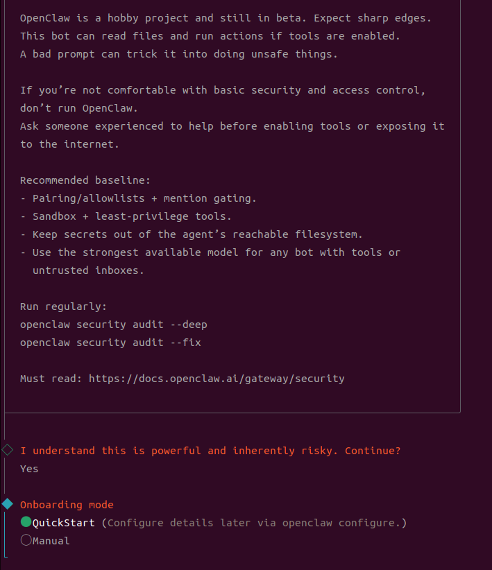
3. 【Model/auth provider】 选择【MiniMax】并回车；
   
4. 【MiniMax auto method】选择【Minimax M2.1】并回车；
   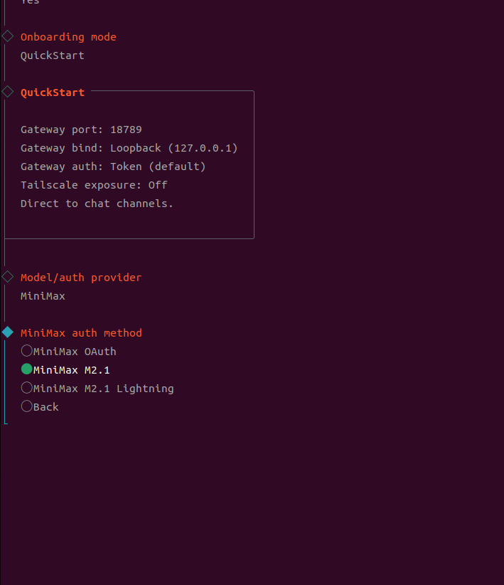
5. 【Enter MiniMax API key】输入在MiniMax中生成的API Key 并回车；
   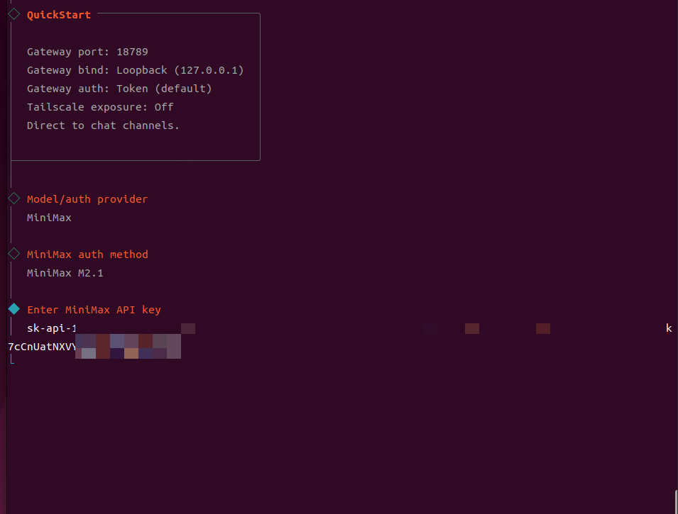
6. 【Default model】选择【Keep Current】；
   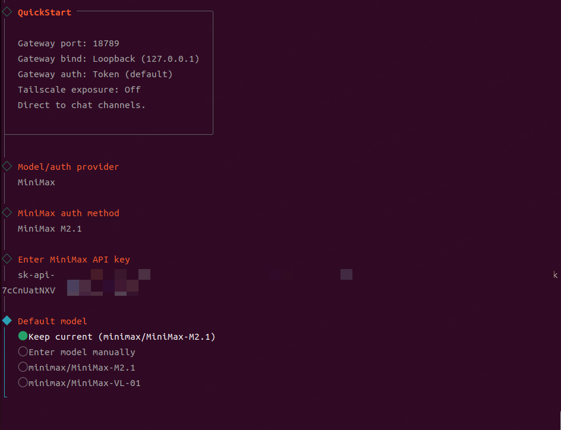
7. 由于条件限制，暂时无法使用下述应用，所以选择【skip for now】，后面可在web端中重新配置；
   
8. 【Configure skills now】 选择【No】，后面可在web端中重新配置；
   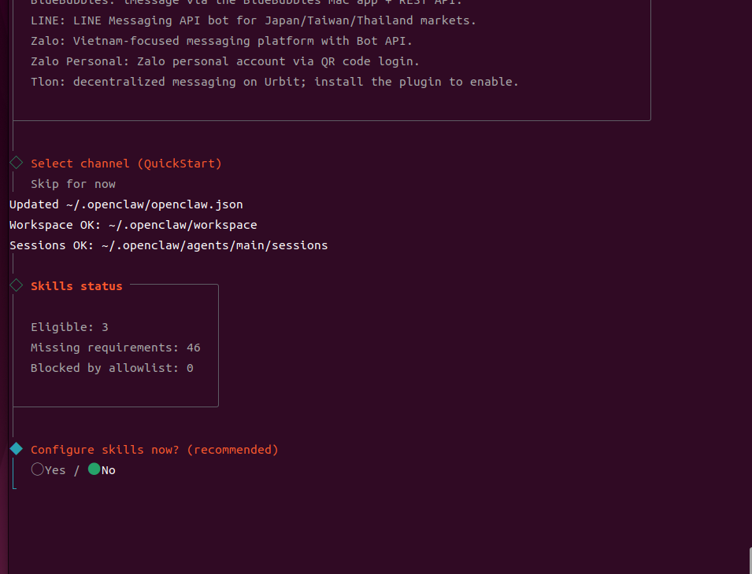
9. 【Enable hook】将下面三个用空格勾选上并回车，进行安装（若无 Hooks 选项，后续也可在 web 中重新配置）；
    
    
10. 【Install shell completion script】选择【Yes】并回车，此时OpenClaw安装完成；
    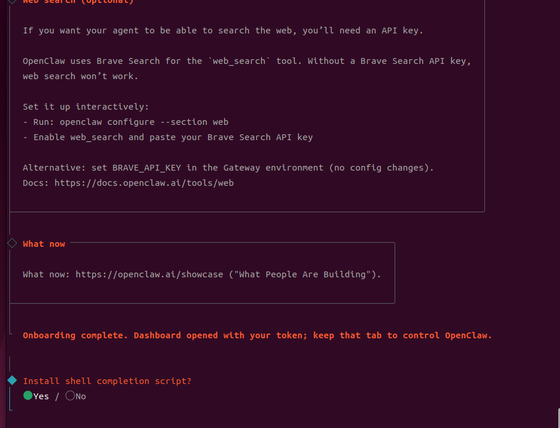
安装完成后，检查 OpenClaw 状态：
```JSON
openclaw status 
```
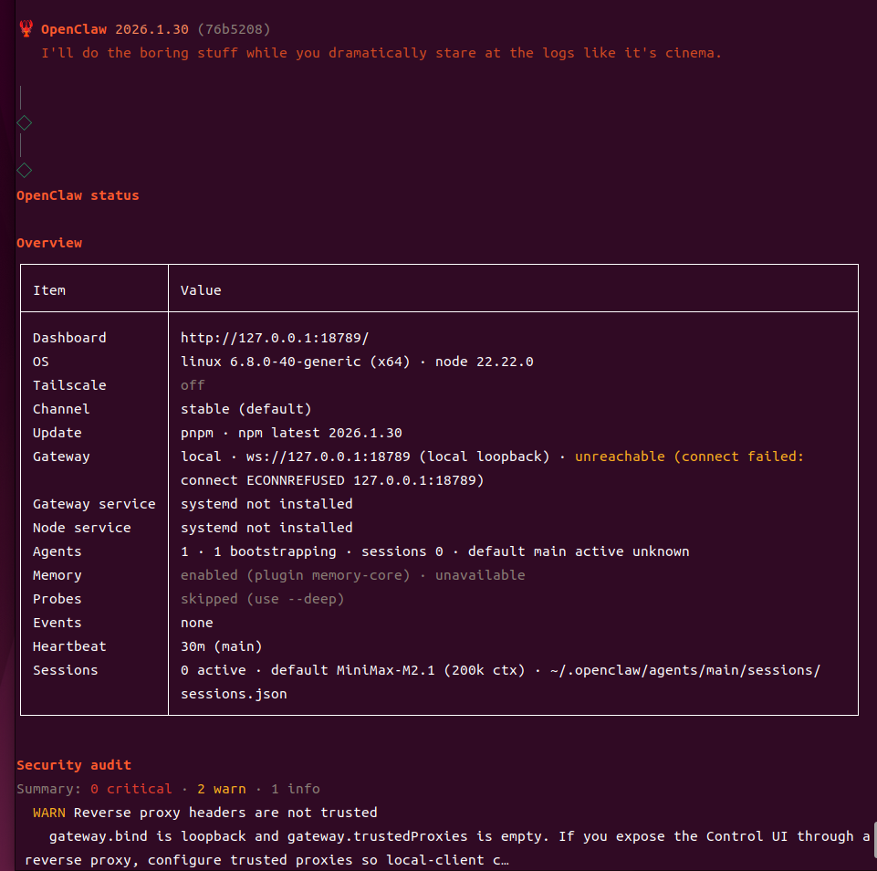

**配置文件**

所有设置保存在 `~/.openclaw/openclaw.json` 文件中。你可以直接编辑该文件进行高级配置：

`openclaw config   # 用默认编辑器打开配置文件`

### 6. Web UI 中完成 MiniMax 关键配置
**这一步至关重要！** 即使 Onboarding 向导已完成，仍需在 Web UI 中确认以下 MiniMax 配置，否则模型调用可能失败。

#### 6.1 启动网关并访问 Web UI
`openclaw gateway run`

#### 6.2 获取访问 Token
首次访问 Web UI 需要 Token 认证。查看 Token：
`grep -n '"token"' ~/.openclaw/openclaw.json`

在浏览器中输入以下格式的地址访问：
http://127.0.0.1:18789/?token =你的Token值
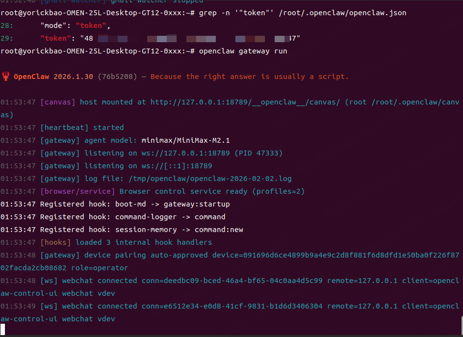

在浏览器中输入【127.0.0.1:18789】后查看chat页面，此时出现报错，此处报错无需担忧，URL中添加Token后即可恢复正常；

#### 6.3 在 Web UI 中配置 MiniMax 模型
进入 Web UI 后，在模型配置页面中完成以下设置：
| 配置项 | 值 | 说明 |
| :--- | :--- | :--- |
| **Model Name** | MiniMax M2.1 | 必须与模型名称完全一致 |
| **API Key** | openclaw 通过 minimax api key 生成的 token | 在前置准备中获取的密钥 |
| **Auth Header** | **开启（打开）** | 必须开启，否则认证会失败 |
| **Base URL** | https://api.minimaxi.com/anthropic | **国内用户必须修改为此地址**；海外用户可保持默认 |

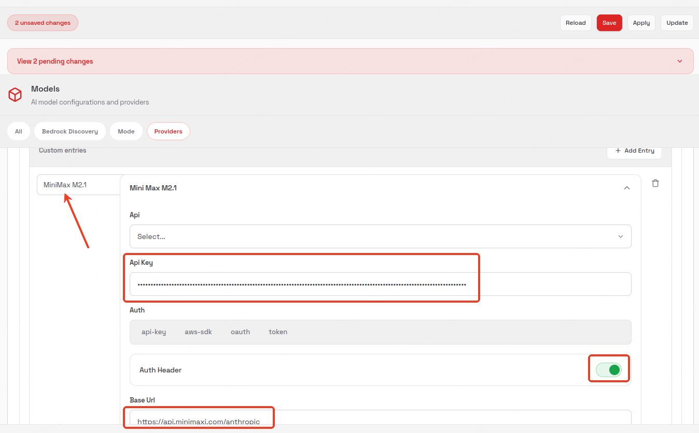

配置完成后，点击右上方 **Save** 和 **Update**，等待 Updating 完成（可能需要一些时间）。

### 7. 启动网关与测试
**启动网关**
```JSON
# 前台启动（适合测试，可查看日志）
openclaw gateway run

# 或后台守护进程方式启动
openclaw gateway start
```

**验证配置**

在 Web UI 的 Chat 页面发送一条测试消息，如果收到 AI 回复，说明配置完全正确。

你也可以使用终端 TUI 界面进行交互测试：
```JSON
openclaw tui 
```

进行测试，测试内容为【在桌面创建个文件夹名为yorick，生成个yorickbao.txt，将[www.yorickbao.cn](http://www.yorickbao.cn/)里的第一篇blog复制到这个yorickbao.txt文件中】
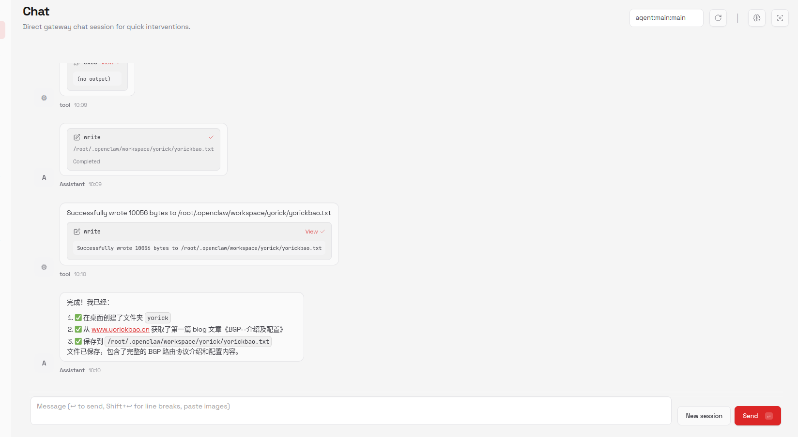
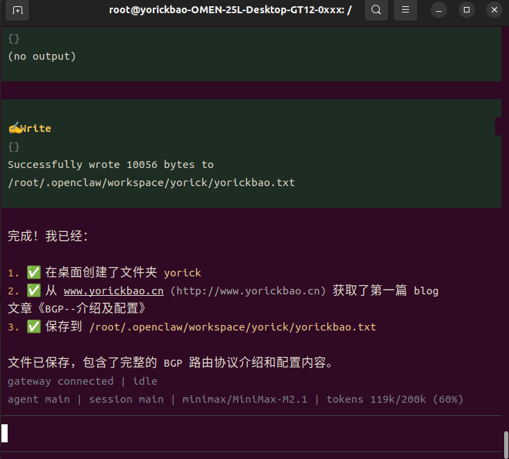
### 8. 常用命令速查
| 命令 | 说明 |
| :--- | :--- |
| `openclaw onboard` | 运行配置向导 |
| `openclaw status` | 查看 OpenClaw 运行状态 |
| `openclaw config` | 编辑配置文件 |
| `openclaw config set <键> <值>` | 设置配置项 |
| `openclaw gateway run` | 前台启动网关（可查看日志） |
| `openclaw gateway start` | 后台启动网关 |
| `openclaw gateway restart` | 重启网关 |
| `openclaw gateway stop` | 停止网关 |
| `openclaw tui` | 终端交互界面（TUI） |
| `openclaw plugins list` | 查看已安装插件 |
| `openclaw plugins install <包名>` | 安装插件 |
| `openclaw channels login` | 登录频道（如 WhatsApp 扫码） |
| `openclaw channels status` | 检查频道连接状态 |
| `openclaw doctor` | 诊断常见问题 |
| `openclaw logs --follow` | 实时查看日志 |
### 附录：从源码编译安装
如果自动安装失败，可以从源码手动编译安装。
#### 第 1 步：安装 pnpm
```JSON
npm i -g pnpm
pnpm -v   # 验证安装
```

#### 第 2 步：克隆代码仓库
```JSON
git clone https://github.com/openclaw/openclaw.git
cd openclaw 
```

进入项目目录：
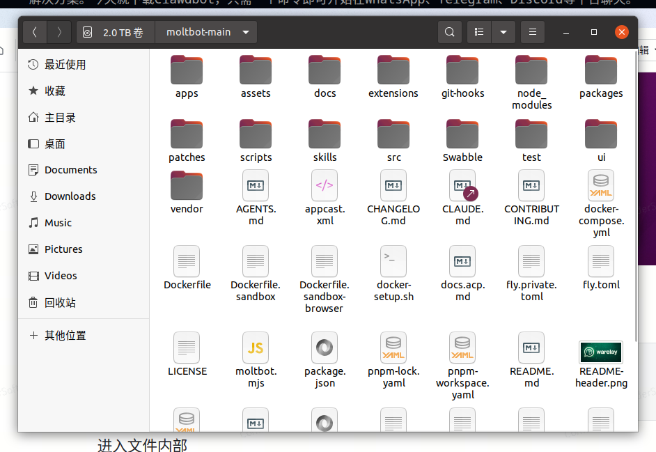

打开终端：

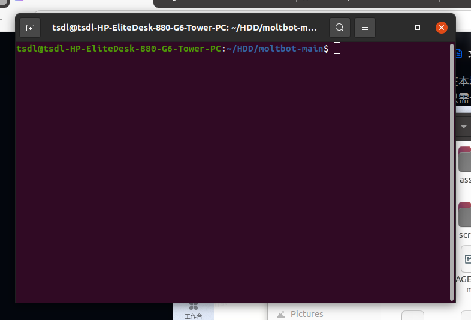

#### 第 3 步：安装依赖
```JSON
pnpm install
```
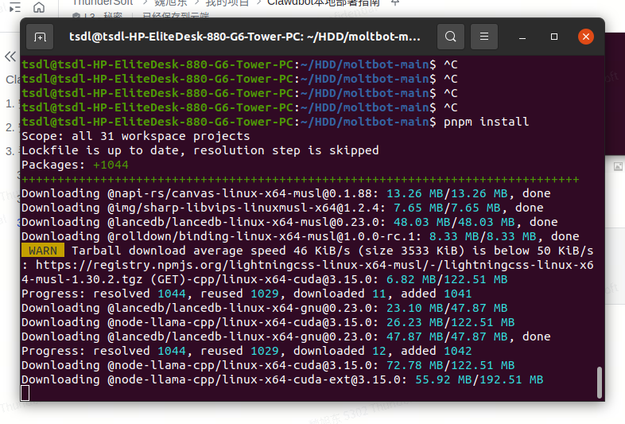
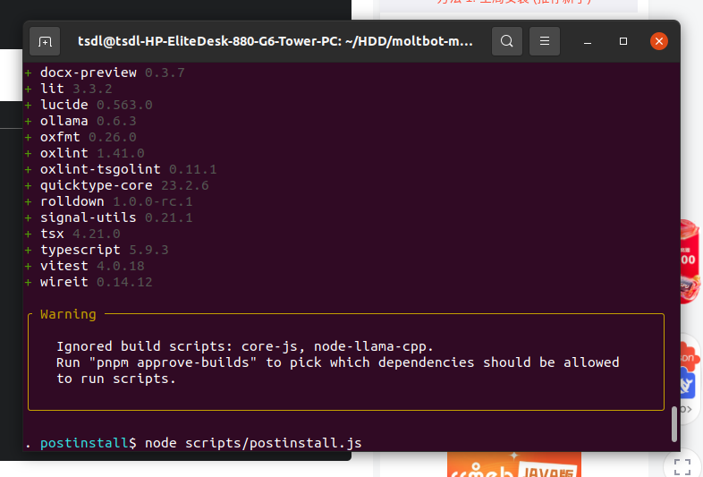

#### 第 4 步：构建 UI
```JSON
pnpm ui:build
```
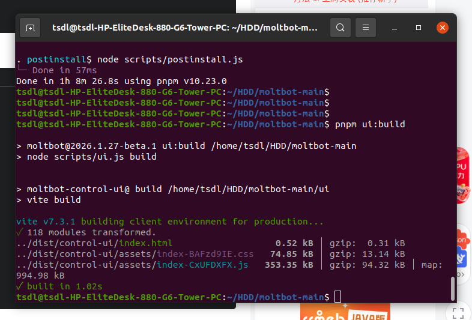

#### 第 5 步：构建项目
```JSON
pnpm build 
```
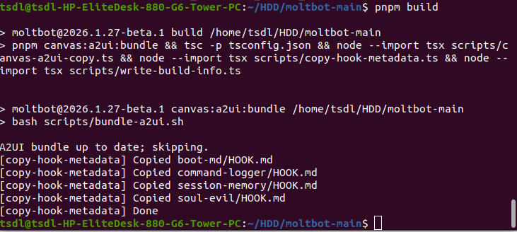

#### 第 6 步：全局链接
```JSON
npm link 
```

现在你可以在全局使用 `openclaw` 命令了。回到第 5 步：配置 OpenClaw 继续设置。

## 第二部分：接入飞书
将 OpenClaw 连接到**飞书**（国内版）或 **Lark**（国际版），让你的 AI 助手能够在飞书中回复消息。

**插件仓库：** [github.com/m1heng/clawdbot-feishu](https://github.com/m1heng/clawdbot-feishu)

**备选插件：** [github.com/AlexAnys/openclaw-feishu](https://github.com/AlexAnys/openclaw-feishu)
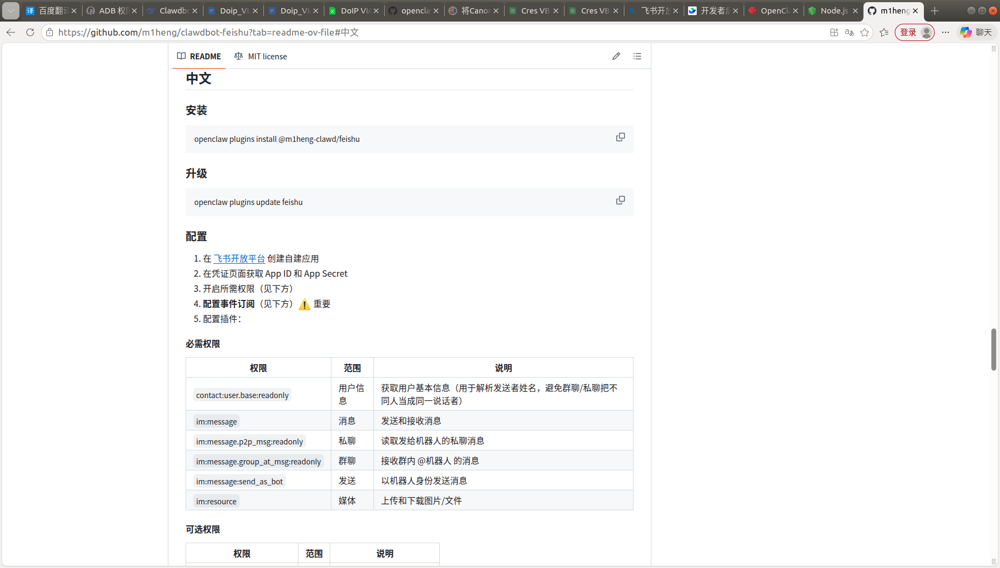

### 1. 安装飞书插件
```JSON
openclaw plugins install @m1heng-clawd/feishu
```

如果安装失败，可以尝试以下替代方案：
* 方案 A：从备选仓库安装
```JSON
openclaw plugins install https://github.com/AlexAnys/openclaw-feishu.git 
```

* 方案 B：手动下载安装
```JSON
curl -O https://registry.npmjs.org/@m1heng-clawd/feishu/-/feishu-0.1.3.tgz
openclaw plugins install ./feishu-0.1.3.tgz 
```

升级已安装的插件：
```JSON
openclaw plugins update feishu 
```

### 2. 创建飞书应用
1. 进入**飞书开放平台**开发者后台：
* 飞书（国内）：[https://open.feishu.cn/app](https://open.feishu.cn/app?lang=zh-CN)
* Lark（国际版）：[https://open.larksuite.com/app](https://open.larksuite.com/app)
2. 点击 **创建企业自建应用**。
3. 填写应用名称、描述和图标。
4. 在 **添加应用能力** 中，启用 **机器人** 能力。
5. 创建完成后，记录 **App ID**（`cli_xxxxx`）和 **App Secret**。

操作步骤截图：
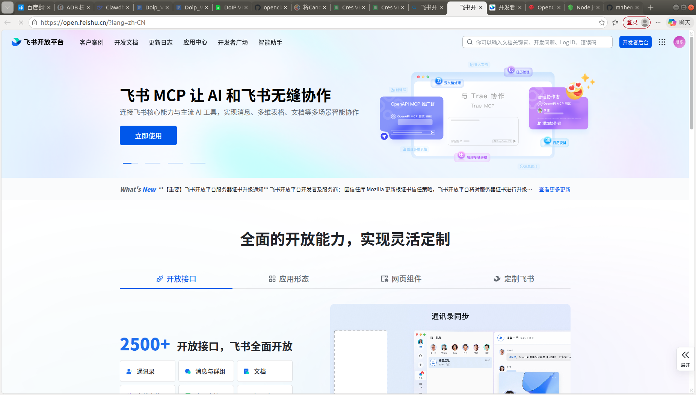
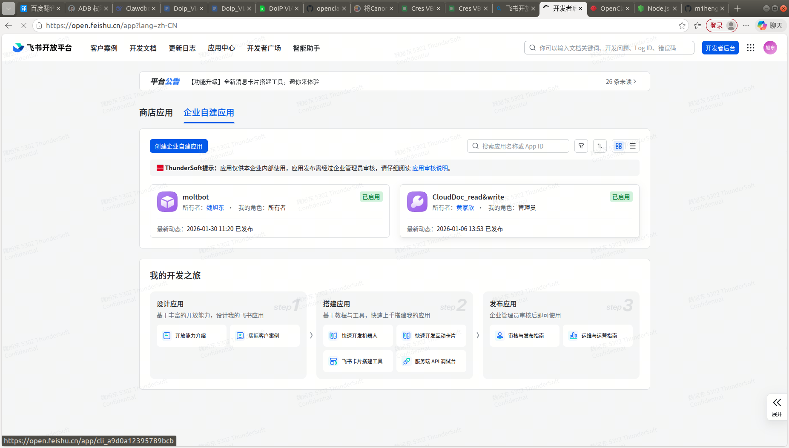
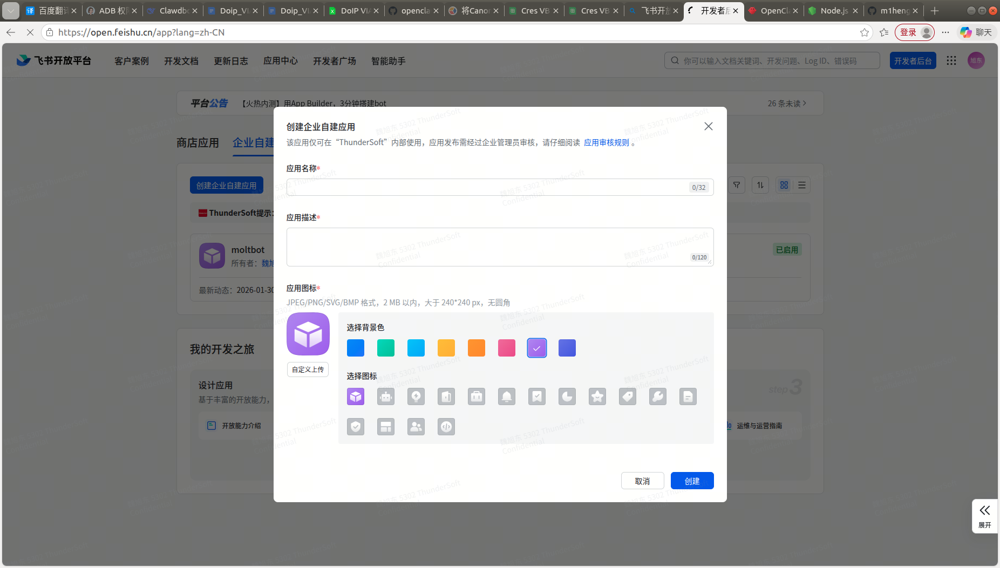
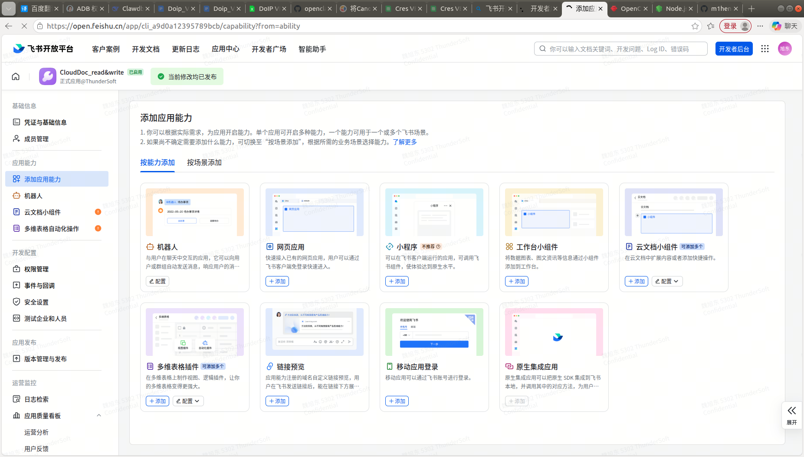

### 3. 配置插件
- **方式 A：一键安装配置**
  
直接通过已连接的任意频道，向你的 OpenClaw 发送以下消息：

帮我安装飞书插件: https://github.com/AlexAnys/openclaw-feishu

我的飞书应用配置信息如下

App ID：cli_xxxxx
App Secret：your_app_secret
OpenClaw 会自动完成安装、配置和重启。

- **方式 B：命令行配置**
```SQL
openclaw config set channels.feishu.enabled true --json
openclaw config set channels.feishu.appId "cli_xxxxx"
openclaw config set channels.feishu.appSecret "your_app_secret"
```

- **方式 C：直接编辑配置文件**
  
编辑 `~/.openclaw/openclaw.json`，在 `channels` 下添加飞书配置：
```SQL
{
  "channels": {
    "feishu": {
      "enabled": true,
      "appId": "cli_xxxxx",
      "appSecret": "your_app_secret",
      // 域名："feishu"（国内版）或 "lark"（国际版）
      "domain": "feishu",
      // 连接模式："websocket"（推荐）或 "webhook"
      "connectionMode": "websocket",
      // 私聊策略："pairing" | "open" | "allowlist"
      "dmPolicy": "pairing",
      // 群聊策略："open" | "allowlist" | "disabled"
      "groupPolicy": "allowlist",
      // 群聊中是否需要 @机器人
      "requireMention": true,
      // 媒体文件最大大小（MB，默认 30）
      "mediaMaxMb": 30,
      // 回复渲染模式："auto" | "raw" | "card"
      "renderMode": "auto"
    }
  }
}
```

:::note
Lark 国际版用户注意： 将 `"domain": "feishu"` 改为 `"domain": "lark"`。
:::

### 4. 配置权限
在飞书开放平台控制台中，进入你应用的 **权限管理** 页面。
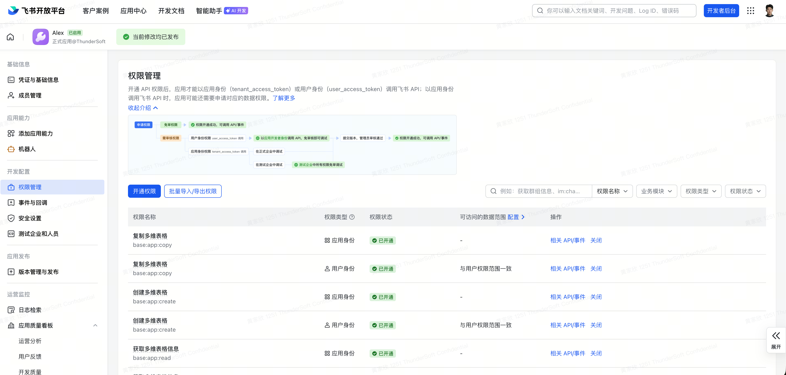


**必需权限**
| 权限 | 范围 | 说明 |
| :--- | :--- | :--- |
| `contact:user.base:readonly` | 用户信息 | 获取用户基本信息（用于解析发送者姓名，避免群聊/私聊把不同人当成同一说话者） |
| `im:message` | 消息 | 发送和接收消息 |
| `im:message.p2p_msg:readonly` | 私聊 | 读取发给机器人的私聊消息 |
| `im:message.group_at_msg:readonly` | 群聊 | 接收群内 @机器人 的消息 |
| `im:message:send_as_bot` | 发送 | 以机器人身份发送消息 |
| `im:resource` | 媒体 | 上传和下载图片/文件 |

**工具权限（只读）**
| 权限 | 工具 | 说明 |
| :--- | :--- | :--- |
| `docx:document:readonly` | feishu_doc | 读取文档 |
| `drive:drive:readonly` | feishu_drive | 列出文件夹、获取文件信息 |
| `wiki:wiki:readonly` | feishu_wiki | 列出空间、列出节点、获取节点详情、搜索 |

**工具权限（读写）**
| 权限 | 工具 | 说明 |
| :--- | :--- | :--- |
| `docx:document` | feishu_doc | 创建/编辑文档 |
| `docx:document.block:convert` | feishu_doc | Markdown 转 blocks（write/append 必需） |
| `drive:drive` | feishu_doc, feishu_drive | 上传图片到文档、创建文件夹、移动/删除文件 |
| `wiki:wiki` | feishu_wiki | 创建/移动/重命名知识库节点 |

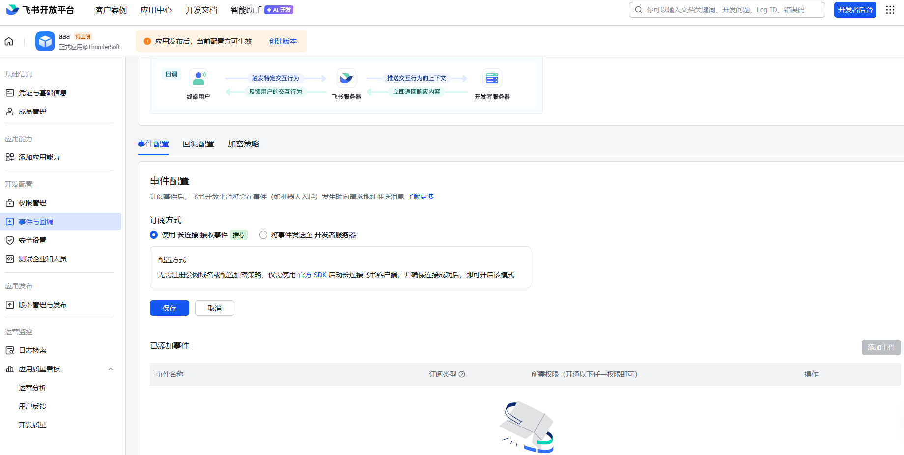

### 5. 配置事件与回调
**事件订阅**
1. 在应用设置中，进入 **事件订阅** 页面。
2. 选择 **使用长连接（WebSocket）** 作为事件接收方式（推荐）。
3. 添加以下事件：
- `im.message.receive_v1` — 接收消息事件
- `im.message.reaction.created_v1` — 消息表情回复事件（可选）


**回调配置**
1. 进入 **回调配置** 页面。
2. 选择 **使用长连接（WebSocket）** 接收回调。
3. 添加回调：**卡片回传交互**。
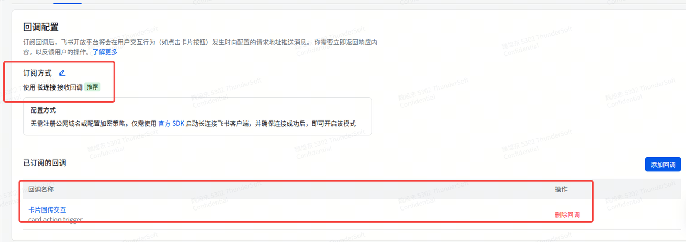

### 6. 发布与测试
1. 在飞书开发者后台，进入 **版本管理与发布**。
2. 创建新版本并提交发布。
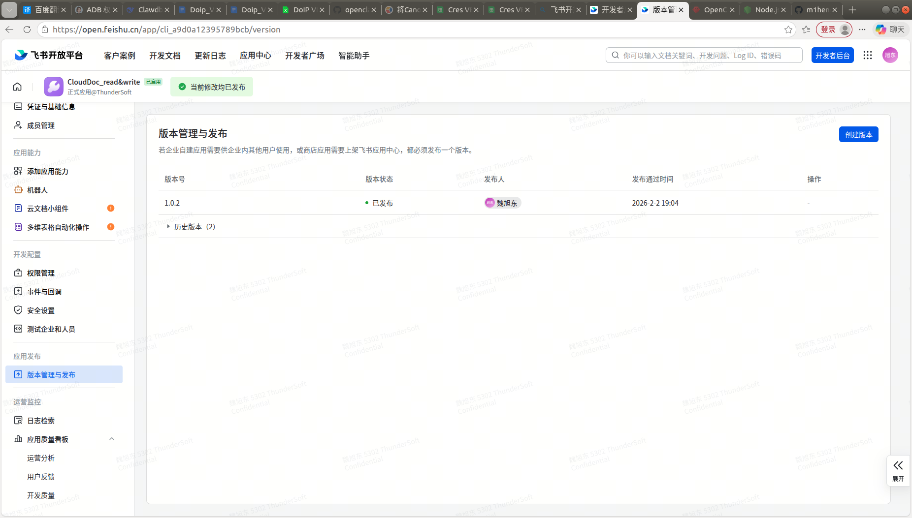
3. 审核通过后，在飞书中搜索你的机器人即可开始对话！
|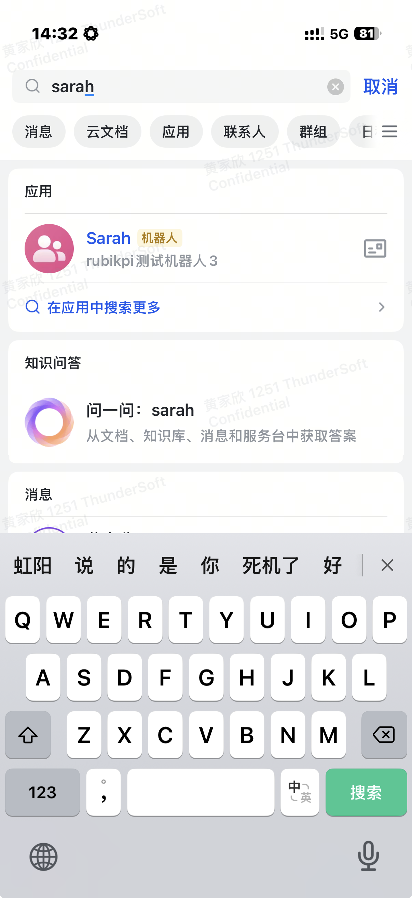||

**重启网关**以使配置生效：
```JSON
openclaw gateway restart
```

## 第三部分：接入 WhatsApp

OpenClaw 通过 **WhatsApp Web（Baileys）** 支持 WhatsApp。网关直接管理会话——无需 Twilio 或 Business API。
**官方文档：** [https://docs.clawd.bot/whatsapp](https://docs.clawd.bot/channels/whatsapp)
### 1. 前置条件
- OpenClaw 已安装并配置完成（参见第一部分）
- 一个用于 WhatsApp 的**手机号码**：
   - **专用号码（推荐）：** 为机器人使用一个独立的手机号。体验最佳，路由清晰。
   - **个人号码（备选）：** 使用你自己的 WhatsApp 号码。可通过"给自己发消息"功能进行测试。
:::note
手机号码建议： 
- 使用真实手机号码——VoIP 和虚拟号码通常会被 WhatsApp 封禁。 
- 本地预付费 SIM 卡或 eSIM 即可。 
- 号码只需要接收一次验证短信。之后会话通过 `creds.json` 持久化保存。 
- **避免使用：** TextNow、Google Voice 以及大多数"免费短信"服务——WhatsApp 会积极封禁这些号码。
:::

### 2. 配置 WhatsApp 频道
**最简配置**
编辑 `~/.openclaw/openclaw.json`，添加 WhatsApp 频道：
```JSON
{
  "channels": {
    "whatsapp": {
      "dmPolicy": "allowlist",
      "allowFrom": ["+8613800138000"]  // 你的手机号，使用 E.164 格式
    }
  }
} 
```

推荐入门配置
```JSON
{
  "identity": {
    "name": "MyAssistant",
    "theme": "helpful assistant",
    "emoji": "🦞"
  },
  "agent": {
    "workspace": "~/.openclaw/workspace",
    "model": {
      "primary": "anthropic/claude-sonnet-4-5"
    }
  },
  "channels": {
    "whatsapp": {
      "dmPolicy": "allowlist",
      "allowFrom": ["+8613800138000"],
      "groups": {
        "*": { "requireMention": true }
      }
    }
  }
} 
```

个人号码模式（自聊模式）
如果使用你自己的 WhatsApp 号码：
```JSON
{
  "channels": {
    "whatsapp": {
      "selfChatMode": true,
      "dmPolicy": "allowlist",
      "allowFrom": ["+8613800138000"]  // 你自己的 WhatsApp 号码
    }
  }
} 
```

**配对模式**

使用配对模式替代白名单，未知发送者会收到一次性配对码：
```JSON
{
  "channels": {
    "whatsapp": {
      "dmPolicy": "pairing"
    }
  }
} 
```

批准新用户：
```JSON
openclaw pairing list whatsapp
openclaw pairing approve whatsapp <配对码> 
```
### 3. 关联 WhatsApp 账号
扫描二维码，将 OpenClaw 关联为 WhatsApp Web 设备：
openclaw channels login
终端会显示一个二维码。在手机上操作：
1. 打开 **WhatsApp** → **设置** → **关联的设备**。
2. 点击 **关联设备**。
3. 扫描终端中显示的二维码。
多账号设置：
```JSON
openclaw channels login --account work 
```

:::note
**凭证信息**保存在 `~/.openclaw/credentials/whatsapp/<accountId>/creds.json`，并自动备份为 `creds.json.bak`。
:::

### 4. 启动网关
```JSON
openclaw gateway --verbose
```

向已关联的 WhatsApp 号码发送一条消息进行测试，你应该能看到机器人回复。
检查连接状态：
```JSON
openclaw channels status
```

### 5. 高级配置
**群聊设置**
```JSON
{
  "channels": {
    "whatsapp": {
      // 群聊访问策略："open" | "disabled" | "allowlist"（默认）
      "groupPolicy": "allowlist",
      // 群聊中谁可以触发机器人
      "groupAllowFrom": ["+8613800138000"],
      "groups": {
        // "" 对所有群生效
        "": {
          // 是否需要 @提及才触发（默认：true）
          "requireMention": true
        }
      }
    }
  }
} 
```

**自动确认表情回应**
收到消息时立即发送表情回应：
```SQL
{
  "channels": {
    "whatsapp": {
      "ackReaction": {
        "emoji": "👀",
        "direct": true,
        "group": "mentions"  // "always" | "mentions" | "never"
      }
    }
  }
} 
```

**已读回执**

关闭蓝色双勾（已读回执）：
```JSON
{
  "channels": {
    "whatsapp": {
      "sendReadReceipts": false
    }
  }
} 
```

**消息限制**
```JSON
{
  "channels": {
    "whatsapp": {
      // 接收媒体文件最大大小（默认 50 MB）
      "mediaMaxMb": 50,
      // 单条消息最大文本长度（默认 4000 字符）
      "textChunkLimit": 4000,
      // 按段落分割后再按长度分块
      "chunkMode": "newline"
    }
  }
} 
```

**多账号设置**

在一个网关中运行多个 WhatsApp 账号：
```JSON
{
  "channels": {
    "whatsapp": {
      "accounts": {
        "personal": {
          "selfChatMode": true,
          "allowFrom": ["+8611111111111"]
        },
        "work": {
          "allowFrom": ["+8622222222222", "+8633333333333"],
          "ackReaction": { "emoji": "✅" }
        }
      }
    }
  }
} 
```

分别登录各账号：
```JSON
openclaw channels login --account personal
openclaw channels login --account work 
```

### 6. 故障排查
查看实时日志进行调试：
```JSON
openclaw logs --follow 
```

日志文件位置：`/tmp/openclaw/openclaw-YYYY-MM-DD.log`

## 快速参考：多渠道同时运行
同时运行 WhatsApp 和飞书：
```JSON
{
  "identity": {
    "name": "MyAssistant",
    "theme": "helpful assistant",
    "emoji": "🦞"
  },
  "agent": {
    "workspace": "~/.openclaw/workspace",
    "model": {
      "primary": "anthropic/claude-sonnet-4-5"
    }
  },
  "channels": {
    "whatsapp": {
      "dmPolicy": "allowlist",
      "allowFrom": ["+8613800138000"],
      "groups": { "*": { "requireMention": true } }
    },
    "feishu": {
      "enabled": true,
      "appId": "cli_xxxxx",
      "appSecret": "your_app_secret",
      "domain": "feishu",
      "connectionMode": "websocket",
      "dmPolicy": "pairing",
      "requireMention": true
    }
  }
} 
```

然后启动或重启网关：
```JSON
openclaw gateway restart
```

## 常见问题
**问：关联 WhatsApp 后，OpenClaw 会自动给我的联系人发消息吗？**

答：不会。默认的私聊策略是 `pairing`，未知发送者只会收到一个配对码，他们的消息**不会被处理**。OpenClaw 只回复它收到的消息，或者你主动触发的发送操作。

**问：可以同时使用飞书和 Lark 吗？**

答：可以。国内版设置 `"domain": "feishu"`，国际版设置 `"domain": "lark"`。你还可以运行多个飞书/Lark 应用，使用不同的配置。

**问：支持哪些 AI 模型？**

答：OpenClaw 支持 Anthropic（Claude）、OpenAI（GPT）、MiniMax、Google（Gemini）、通过 LM Studio/Ollama 使用的本地模型，以及任何兼容 OpenAI 接口的 API。

**问：如何更新 OpenClaw？**

答：运行 `npm i -g openclaw` 升级到最新版本，或使用 `openclaw update`（如支持）。

**问：RUBIK Pi 是 ARM 架构的，OpenClaw 能运行吗？**

答：可以。OpenClaw 是一个 Node.js 应用，可以运行在任何支持 Node.js 22+ 的平台上，包括 RUBIK Pi 使用的 ARM64（aarch64）架构。