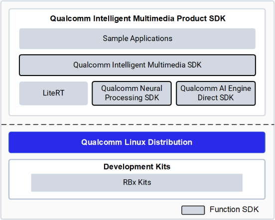
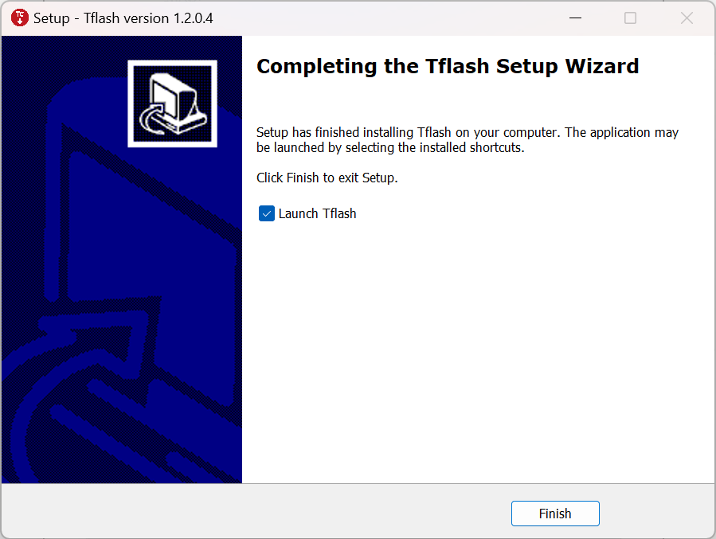
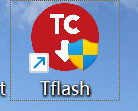
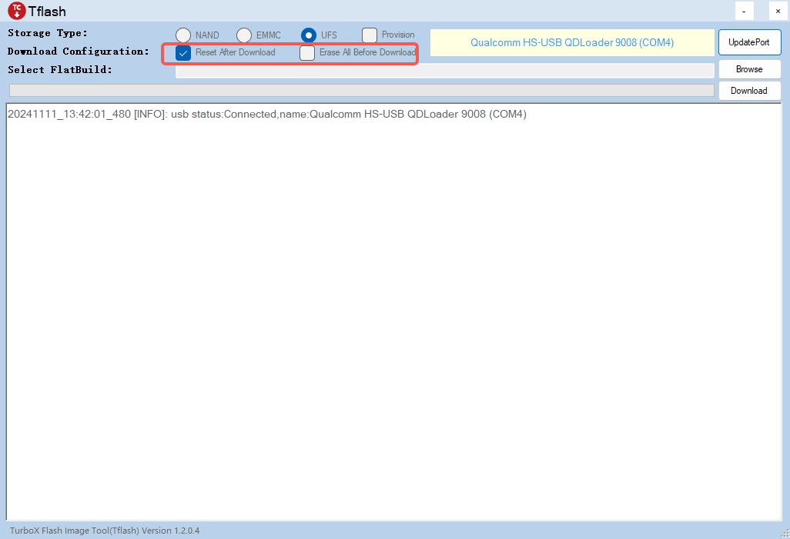
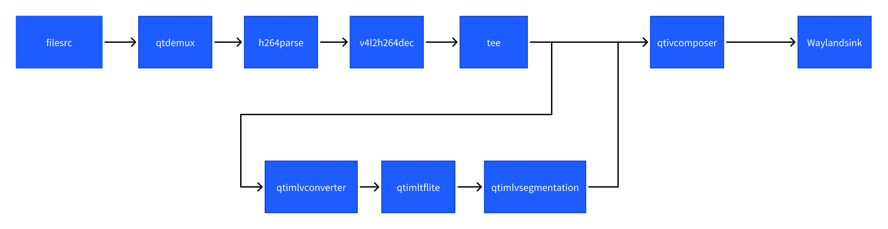

---
# Display h2 to h2 headings
toc_min_heading_level: 2
toc_max_heading_level: 2
---
import Tabs from '@theme/Tabs';
import TabItem from '@theme/TabItem';

# 人工智能

本章节将介绍Qualcomm AI Runtime SDK的使用流程，Qualcomm AI Runtime SDK可以帮助AI开发者便捷地使用高通的高性能机器学习推理硬件。它支持TensorFlow、PyTorch、ONNX和LiteRT等框架已经训练好的神经网络模型直接或是经过转换在RUBIK Pi 3上快速高效地运行。

## 概述

RUBIK Pi 3 Ubuntu  AI/ML 开发流程如下流程图所示：


上面的AI/ML 开发流程大致分为两个步骤：

步骤 1

编译并优化来自第三方 AI 框架的模型,以便在 RUBIK Pi 3上高效运行。例如,可以将 TensorFlow 模型导出为 TFLite 模型。可以对模型文件针对推理硬件来做量化、细调性能和精确度等特殊的定制操作。

步骤 2

编译应用程序,使用优化后的模型在设备上运行推理&#x20;

* 将 AI 模型集成到用例 pipeline 中。
* 交叉编译应用程序,生成使用依赖库的可执行二进制文件。

## 软件和硬件架构

### AI整体框架


开发人员可以从ONNX、PyTorch、TensorFlow或TFLite中引入模型，使用Qualcomm AI Runtime SDK将这些模型高效地运行在RUBIK Pi 3的人工智能硬件-HTP（NPU）、GPU、CPU上。

### AI硬件

* Qualcomm Kryo™ CPU- 一流的 CPU ,具有高性能和卓越的能效。
* Qualcomm Adreno GPU- 适合在需要平衡功耗与性能的情况下执行 AI 工作负载。 AI 工作负载可以通过 OpenCL 内核进行加速。 GPU 还可用于加速模型预处理 / 后处理。
* Qualcomm Hexagon 张量处理器 (HTP)- 又称 NPU/DSP/HMX ,适合低功耗、高性地能执行AI 工作负载。为优化性能,需要对预训练模型进行量化,使其达到支持的任一种精度。

### AI 软件

AI软件堆栈包含多种 SDK ,帮助AI开发者方便地利用RUBIK Pi 3的AI 硬件加速器的强大功能。开发人员可以自己选择的一种 SDK 来部署 AI 工作负载。预训练模型在运行之前需要将其转换为所选 SDK 所支持的可执行格式( TFLite 模型除外)。 TFLite 模型可以使用 TFLite Delegate 直接运行。

* **LiteRT**

LiteRT 模型可以使用以下 Delegate在 RUBIK Pi 3 的硬件上本地执行。


| Delegate                                 | 硬件加速器        |
| ------------------------------------------ | ------------------- |
| AI Engine Direct Delegate (QNN Delegate) | CPU 、 GPU 和 HTP |
| XNNPACK Delegate                         | CPU               |
| GPU Delegate                             | GPU               |

* **Qualcomm 神经网络处理引擎**

Qualcomm 神经网络处理引擎 (Qualcomm Neural Processing Engine SDK ，也称为SNPE) 是一种用于执行深度神经网络的软件加速 运行时 。SNPE SDK提供相关工具来对神经网络进行转换、量化,并在 CPU 、 GPU 和 HTP 等硬件加速器上对其进行加速。

* **Qualcomm AI Engine Direct (QNN)**

Qualcomm AI Engine Direct是为 AI/ML 场景用例使用Rubik Pi 3的AI加速器硬件而设计的一种软件架构。

该架构旨在提供统一的 API ,模块和可扩展的预加速库,从而基于这种可重用的结构打造全栈 AI 解决方案。它可为Qualcomm 神经网络处理 SDK(SNPE) 、 TFLite AI Engine Direct Delegate 等运行时提供支持。

* **AI Model Efficiency Toolkit (AIMET)**

这是一个用于优化（压缩和量化）训练好的神经网络模型的开源库。并且该库是一个复杂的SDK旨在生成优化的量化模型，适用于高阶开发者。

## 编译和优化模型


开发者可以使用以下两种方式中的任意一种方式来编译和优化自己的模型。


| 项目        | 描述                                                                                                                  |
| :------------ | :---------------------------------------------------------------------------------------------------------------------- |
| AI Hub      | 开发者可以引入自己的模型,在云设备（Snapdragon 设备）上试用预优化模型。                                                |
| AI 软件堆栈 | - 使用LiteRT优化模型<p> 直接移植LiteRT AI的模型到RUBIK Pi 3设备上。</p>- 使用 Qualcomm AI Runtime SDK 来优化AI模型<p>使用一体化、易于定制的Qualcomm AI Runtime（QAIRT）SDK移植您的模型。</p> |

### AI Hub

AI Hub 提供了帮助开发人员针对视觉、音频和语音用例的机器学习模型在设备上进行优化、验证和部署的方法和途径。


#### 环境配置

1. 在您的计算机上安装miniconda和配置Python环境。

      1. 安装miniconda。

      从[miniconda](https://www.anaconda.com/download)官网下载miniconda并安装。
      
      2. 打开命令命令行窗口。

      <Tabs>
      <TabItem value="Windows" label="Windows" default>

      安装完成后,通过 Start 菜单打开 [Anaconda ](https://docs.conda.io/projects/miniconda/en/latest/miniconda-install.html)提示符窗口。
      </TabItem>

      <TabItem value="macOS/Linux" label="macOS/Linux">

      安装完成后,打开一个新的 shell 窗口。
      </TabItem>
      </Tabs>
      3. 为AI Hub配置一个Python的虚拟环境

      在打开的命令行窗口中输入如下命令：

       ```bash
       conda activate
       conda create python=3.10 -n qai_hub
       conda activate qai_hub
       ```

2. 安装 AI Hub Python 客户端。

      ```bash
      pip3 install qai-hub
      pip3 install "qai-hub[torch]"
      ```

3. 登录 AI Hub 。

      前往 [AI Hub](https://aihub.qualcomm.com/) 并使用 Qualcomm ID 登录,查看所创建作业的相关信息。

      登录后，导航至 Account > Settings > API Token 。此时应提供一个可用于配置客户端的 API 令牌。

4. 在终端，使用以下命令通过 API 令牌配置客户端。

      ```bash
      qai-hub configure --api_token <INSERT_API_TOKEN>
      ```

      然后使用下面命令查看支持设备列表来验证 AI Hub Python 客户端是否安装成功：

      ```bash
      qai-hub list-devices
      ```

      出现如下结果说明 AI Hub Python 客户端安装成功：

      

#### AI Hub 工作流程

* 使用预优化模型。

1. 导航到[ AI Hub Model Zoo](https://aihub.qualcomm.com/iot/models) ,访问适用于 RUBIK Pi 3的预优化模型。
2. 从左侧窗格中选择 Qualcomm QCS6490 作为芯片组,筛选适用于 RUBIK Pi 3的模型。
3. 从筛选结果视图中选择一个模型以导航到模型页面。
4. 在模型页面上,从下拉列表中选择 Qualcomm QCS6490 ,然后选择 TorchScript > TFLite 路径。
5. 点击下载按钮后开始模型下载。下载的模型已经过预先优化,可直接开发用户自己的应用程序。

* 引入用户自己的模型

1. 选择 PyTorch 或 Onnx 格式的预训练模型。
2. 使用 Python API 将模型提交至 AI Hub 以进行编译或优化。提交编译作业时,必须选择设备或芯片组以及目标 runtime 才能编译模型。 RUBIK Pi 3支持TFLite runtime 。


   | **芯片组** | **Runtime** | **CPU**         | **GPU**   | **HTP**   |
   | ------------ | ------------- | ----------------- | ----------- | ----------- |
   | QCS6490    | TFLite      | INT8,FP16, FP32 | FP16,FP32 | NT8,INT16 |

   提交后, AI Hub 会为该作业生成一个唯一的 ID 。用户可以使用此作业 ID 查看作业详情。
3. AI Hub 会根据选择的设备和 runtime 对模型进行优化。或者,也可以提交作业在源自云设备集群且已经过配置的实际设备上对优化模型进行分析或推理(使用 Python API )。

   – 性能分析:在已配置的设备上对模型进行基准测试并提供统计数据,包括层级的平均推理时间、 runtime 配置等。

   – 推理:在推理作业执行过程中,使用优化模型基于提交的数据进行推理,即在已配置的云设备上运行该模型。
4. 提交的每项作业都可以在 AI Hub 门户中进行重新回顾。提交编译作业时,将会提供优化模型的可用下载链接。然后,该优化模型可以部署在 RUBIK Pi 3本地开发设备上。

### LiteRT


LiteRT是一个用于在设备上进行AI推理的开源深度学习框架。 LiteRT 可优化模型的延迟、模型尺寸、功耗等,帮助开发人员在移动、嵌入式和边缘平台上运行自己的模型。RUBIK Pi 3支持通过下方列出的 TFLite Delegate 在本地执行 TFLite 模型。


| Delegate                                 | 加速器            |
| ------------------------------------------ | ------------------- |
| AI Engine Direct Delegate (QNN Delegate) | CPU 、 GPU 和 HTP |
| XNNPack Delegate                         | CPU               |
| GPU Delegate                             | GPU               |

### Qualcomm(®) Intelligent Multimedia SDK

#### Qualcomm(®) Intelligent Multimedia SDK概览

Qualcomm IM SDK 为开发环境提供了上游和 Qualcomm [GStreamer](https://gstreamer.freedesktop.org/) 插件作为 API。您可以使用这些 API 来开发和优化应用程序、创建 pipeline 以及定制插件。

下图概括展示了 Qualcomm IM SDK 的框架：



#### Qualcomm IM SDK 中常用 Qualcomm [GStreamer](https://gstreamer.freedesktop.org/) 插件的功能


| 插件名               | 功能                                                                                                                                                                                               |
| ---------------------- | ---------------------------------------------------------------------------------------------------------------------------------------------------------------------------------------------------- |
| qtiqmmfsrc           | qtiqmmfsrc 插件通过 Qualcomm Camera Service 采集视频帧                                                                                                                                             |
| qtimlsnpe            | 负责snpe的dlc模型文件的加载和执行。它的输入接收来自预处理插件（qtimlvconverter）输出的张量，它的输出是传递给如qtimlvclassification/ qtimlvdetection/qtimlvsegmentation/  qtimlvpose插件的张量。    |
| qtimltflite          | 负责LiteRt的tflite模型文件的加载和执行。它的输入接收来自预处理插件（qtimlvconverter）输出的张量，它的输出是传递给如qtimlvclassification/ qtimlvdetection/qtimlvsegmentation/qtimlvpose插件的张量。 |
| qtimlvconverter      | 将传入视频缓冲区中的数据转换为神经网络张量,同时执行所需的格式转换和大小调整。                                                                                                                      |
| qtimlvclassification | 对分类用例的输出张量进行后处理。                                                                                                                                                                   |
| qtimlvdetection      | 对检测用例的输出张量进行后处理。                                                                                                                                                                   |
| qtimlvsegmentation   | 对像素类用例的输出张量进行后处理,例如图像分割、深度图处理等。                                                                                                                                      |
| qtimlvpose           | 对姿势估计用例的输出张量进行后处理。                                                                                                                                                               |

## AI/ML 示例程序运行

### 前提准备

1. 软件包的安装

   参见[运行示例应用程序](3.run-sample-applications.md)中内容，确保里面的的示例程序可以正常运行。
2. AI/ML 示例程序所需要的model文件，label文件和json配置文件的压缩包下载

   * 在设备上使用下面命令下载包含AI/ML 示例程序所需要的模型文件，label文件和json配置文件的压缩包ai\_sample\_app\_models\_labels\_configs.zip。

     ```bash
     wget https://thundercomm.s3.dualstack.ap-northeast-1.amazonaws.com/uploads/web/rubik-pi-3/tools/ai_sample_app_models_labels_configs.zip
     ```
   * 使用下面命令将压缩包解压到/etc目录下

     ```bash
     unzip ./ai_sample_app_model_label.zip -d /etc/
     ```
   * 压缩包内文件列表


| 模型文件                                            | label文件                         | json配置文件                                               |
| ----------------------------------------------------- | ----------------------------------- | ------------------------------------------------------------ |
| models/deeplabv3\_plus\_mobilenet\_quantized.tflite | labels/classification\_0.labels   | configs/config\_classification.json                        |
| models/midas\_quantized.tflite                      | labels/hrnet\_pose.labels         | configs/config\_monodepth.json                             |
| models/hrnet\_pose\_quantized.tflite                | labels/yolov5.labels              | configs/config\_daisychain\_detection\_classification.json |
| models/yolov5.tflite                                | labels/deeplabv3\_resnet50.labels | configs/config\_pose.json                                  |
| models/inception\_v3\_quantized.tflite              | labels/monodepth.labels           | configs/config\_detection.json                             |
| models/yolov8\_det\_quantized.tflite                | labels/yolov8.labels              | configs/config\_segmentation.json                          |

### 图像分类示例程序：gst-ai-classification

gst-ai-classification示例程序使用snpe、LiteRT或QNN实现识别图像中的主体。

下图显示了从摄像头、文件源或实时流协议（RTSP）获取图像数据，对其进行预处理，然后在人工智能硬件上运行推理，并在屏幕上显示识别结果的流程。


* 示例程序使用的json配置文件：/etc/configs/config\_classification.json

**可以采用如下参数进行测试：**

1. 使用摄像头作为输入源：

:::note
需要插上摄像头。
:::

```json
{
  "camera": 0,
  "ml-framework": "tflite",
  "model": "/etc/models/inception_v3_quantized.tflite",
  "labels": "/etc/labels/classification_0.labels",
  "constants": "Inceptionv3,q-offsets=<38.0>,q-scales=<0.17039915919303894>;",
  "threshold": 40,
  "runtime": "dsp"
}
```

或使用MP4视频文件作为输入源：

:::note
请根据您准备好的MP4视频文件的具体路径配置好下面的file-path属性值。
:::

```json
{
 "file-path": "/etc/media/video.mp4",
  "ml-framework": "tflite",
  "model": "/etc/models/inception_v3_quantized.tflite",
  "labels": "/etc/labels/classification_0.labels",
  "constants": "Inceptionv3,q-offsets=<38.0>,q-scales=<0.17039915919303894>;",
  "threshold": 40,
  "runtime": "dsp"
}
```

2. 执行下面命令运行该示例程序

```bash
sudo -i
gst-ai-classification --config-file=/etc/configs/config_classification.json
```

* 效果图如下：


### 目标检测示例程序：gst-ai-object-detection

gst-ai-object-detection示例程序允许您在图像和视频中检测物体。

下图显示了从实时摄像头、视频文件或RTSP输入数据流，执行预处理，在AI硬件上运行推理，并在显示器上上显示检测结果的流程。



* 示例程序使用的json配置文件：/etc/configs/config\_detection.json

**可以采用如下参数进行测试：**

1. 使用摄像头作为输入源：

:::note
需要插上摄像头。
:::

```json
{
  "camera": "0",
  "ml-framework": "tflite",
  "yolo-model-type": "yolov8",
  "model": "/etc/models/yolov8_det_quantized.tflite",
  "labels": "/etc/labels/yolov8.labels",
  "constants": "YOLOv8,q-offsets=<21.0, 0.0, 0.0>,q-scales=<3.0546178817749023, 0.003793874057009816, 1.0>;",
  "threshold": 40,
  "runtime": "dsp"
}
```

或使用MP4视频文件作为输入源：

:::note
请根据您准备好的MP4视频文件的具体路径配置好下面的file-path属性值。
:::

```json
{
  "file-path": "/etc/media/video.mp4",
  "ml-framework": "tflite",
  "yolo-model-type": "yolov8",
  "model": "/etc/models/yolov8_det_quantized.tflite",
  "labels": "/etc/labels/yolov8.labels",
  "constants": "YOLOv8,q-offsets=<21.0, 0.0, 0.0>,q-scales=<3.0546178817749023, 0.003793874057009816, 1.0>;",
  "threshold": 40,
  "runtime": "dsp"
}
```

2. 执行下面命令运行该示例程序

```bash
sudo -i
gst-ai-object-detection --config-file=/etc/configs/config_detection.json
```

* 效果图如下：


### 姿态识别示例程序：gst-ai-pose-detection

gst-ai-pose-detection示例程序允许您检测图像或视频中主体的身体姿势。

下图显示了从来自摄像头、文件或RTSP源的输入流，执行预处理，在AI硬件上进行推理，并将人体姿态检测结果可视化显示在屏幕上的流程。


* 示例程序使用的json配置文件：/etc/configs/config\_pose.json

**可以采用如下参数进行测试：**

1. 使用摄像头作为输入源：

:::note
需要插上摄像头。
:::

```json
{
  "camera": "0",
  "ml-framework": "tflite",
  "model": "/etc/models/hrnet_pose_quantized.tflite",
  "labels": "/etc/labels/hrnet_pose.labels",
  "constants": "hrnet,q-offsets=<8.0>,q-scales=<0.0040499246679246426>;",
  "threshold": 51,
  "runtime": "dsp"
}

```

或使用MP4视频文件作为输入源：

:::note
请根据您准备好的MP4视频文件的具体路径配置好下面的file-path属性值。
:::

```json
{
  "file-path": "/etc/media/video.mp4",
  "ml-framework": "tflite",
  "model": "/etc/models/hrnet_pose_quantized.tflite",
  "labels": "/etc/labels/hrnet_pose.labels",
  "constants": "hrnet,q-offsets=<8.0>,q-scales=<0.0040499246679246426>;",
  "threshold": 51,
  "runtime": "dsp"
}

```

2. 执行下面命令运行该示例程序

```bash
sudo -i
gst-ai-pose-detection  --config-file=/etc/configs/config_pose.json
```

* 效果图如下：


### 语义分割示例程序：gst-ai-segmentation

gst-ai-segmentation应用程序允许您将图像划分为不同且有意义的部分或者将数据分割成若干段。

下图显示了从摄像头、文件源或实时流协议（RTSP）获取图像数据，对其进行预处理，然后在人工智能硬件上运行推理，并显示分割结果在屏幕上的流程。


* 示例程序使用的json配置文件：/etc/configs/config\_segmentation.json

**可以采用如下参数进行测试：**

1. 使用摄像头作为输入源：

:::note
需要插上摄像头。
:::

```json
{
  "camera": 0,
  "ml-framework": "tflite",
  "model": "/etc/models/deeplabv3_plus_mobilenet_quantized.tflite",
  "labels": "/etc/labels/deeplabv3_resnet50.labels",
  "constants": "deeplab,q-offsets=<0.0>,q-scales=<1.0>;",
  "runtime": "dsp"
}
```

或使用MP4视频文件作为输入源：

:::note
请根据您准备好的MP4视频文件的具体路径配置好下面的file-path属性值。
:::

```json
{
  "file-path": "/etc/media/video.mp4",
  "ml-framework": "tflite",
  "model": "/etc/models/deeplabv3_plus_mobilenet_quantized.tflite",
  "labels": "/etc/labels/deeplabv3_resnet50.labels",
  "constants": "deeplab,q-offsets=<0.0>,q-scales=<1.0>;",
  "runtime": "dsp"
}
```

2. 执行下面命令运行该示例程序

```bash
sudo -i
gst-ai-segmentation  --config-file=/etc/configs/config_segmentation.json
```

* 效果图如下：


### 多输入/输出目标检测示例程序：gst-ai-multi-input-output-object-detection

gst-ai-multi-input-output-object-detection应用程序允许您同时处理来自多个源（如两个摄像头、两个视频文件文件或RTSP等网络协议）的视频流执行目标检测。

下图显示了从摄像头、文件源或实时流协议（RTSP）获取图像数据，对其进行预处理，然后在人工智能硬件上运行推理，并在屏幕上显示结果的流程。


* 执行下面命令运行该示例程序

:::note
需要插上两个摄像头。
:::

```bash
sudo -i
gst-ai-multi-input-output-object-detection --num-camera=2 --out-file=/opt/H.mp4 -d --model=/etc/models/yolov5.tflite --labels=/etc/labels/yolov5.labels
```

当前命令参数实现了同时从两个摄像头输入视频流，然后进行目标检测并将推理结果保存在MP4文件中和在显示设备上显示的用例。

* 效果图如下：


### 目标检测和图像分类级联示例程序：gst-ai-daisychain-detection-classification

gst-ai-daisychain-detection-classification 示例程序可以使用摄像头、文件源或 RTSP 流执行级联目标检测和分类。

这些图显示了 pipeline 工作流，该工作流从摄像头或文件等来源采集视频流，对视频进行预处理，使用 AI 硬件运行推理，并在屏幕上显示目标检测和分类结果。

*图: gst-ai-daisychain-detection-classification 发送 pipeline*


*图: gst-ai-daisychain-detection-classification 推理 pipeline*


* 示例程序使用的json配置文件：/etc/configs/config\_daisychain\_detection\_classification.json

**可以采用如下参数进行测试：**

1. 使用摄像头作为输入源：

:::note
需要插上摄像头。
:::

```json
{
  "camera": 0,
  "detection-model": "/etc/models/yolov8_det_quantized.tflite",
  "detection-labels": "/etc/labels/yolov8.labels",
  "classification-model": "/etc/models/inception_v3_quantized.tflite",
  "classification-labels": "/etc/labels/classification_0.labels",
  "detection-constants": "YOLOv8,q-offsets=<21.0, 0.0, 0.0>,q-scales=<3.0546178817749023, 0.003793874057009816, 1.0>;",
  "classification-constants": "Inceptionv3,q-offsets=<38.0>,q-scales=<0.17039915919303894>;"
}
```

或使用MP4视频文件作为输入源：

:::note
请根据您准备好的MP4视频文件的具体路径配置好下面的file-path属性值。
:::

```json
{
  "file-path": "/etc/media/video.mp4",
  "detection-model": "/etc/models/yolov8_det_quantized.tflite",
  "detection-labels": "/etc/labels/yolov8.labels",
  "classification-model": "/etc/models/inception_v3_quantized.tflite",
  "classification-labels": "/etc/labels/classification_0.labels",
  "detection-constants": "YOLOv8,q-offsets=<21.0, 0.0, 0.0>,q-scales=<3.0546178817749023, 0.003793874057009816, 1.0>;",
  "classification-constants": "Inceptionv3,q-offsets=<38.0>,q-scales=<0.17039915919303894>;"
}
```

2. 执行下面命令运行该示例程序

   ```bash
   sudo -i
   gst-ai-daisychain-detection-classification   --config-file=/etc/configs/config_daisychain_detection_classification.json
   ```

* 效果图如下：


### 图像深度估计示例程序：gst-ai-monodepth

gst-ai-monodepth示例程序可以从实时摄像头画面、本地视频文件 或 网络RTSP流 这三类输入源中获取视觉数据，利用单目深度估计算法（无需双目摄像头），自动分析并“推断”出画面中每个物体的深度信息（即它们距离摄像头或观察者的远近）。

下图展示该示例程序的流程。


* 示例程序使用的json配置文件：/etc/configs/config\_monodepth.json

**可以采用如下参数进行测试：**

1. 使用摄像头作为输入源：

:::note
需要插上摄像头。
:::

```json
{
  "camera": 0,
  "ml-framework": "tflite",
  "model": "/etc/models/midas_quantized.tflite",
  "labels": "/etc/labels/monodepth.labels",
  "constants": "Midas,q-offsets=<0.0>,q-scales=<6.846843242645264>;",
  "runtime": "dsp"
}

```

或使用MP4视频文件作为输入源：

:::note
请根据您准备好的MP4视频文件的具体路径配置好下面的file-path属性值。
:::

```json
{
  "file-path": "/etc/media/video.mp4",
  "ml-framework": "tflite",
  "model": "/etc/models/midas_quantized.tflite",
  "labels": "/etc/labels/monodepth.labels",
  "constants": "Midas,q-offsets=<0.0>,q-scales=<6.846843242645264>;",
  "runtime": "dsp"
}

```

2. 执行下面命令运行该示例程序

   ```bash
   sudo -i
   gst-ai-classification --config-file=/etc/configs/config_monodepth.json
   ```

* 效果图如下：


## AI/ML gstreamer命令行用例运行

AI/ML  gstreamer命令行用例展示了在 RUBIK Pi 3设备上使用QIM中的gstreamer插件实现从实时摄像头或是本地视频文件馈送数据然后运行模型的实际场景。下文将详述运行示例程序的步骤。

### 前提准备

##### 软件包的安装

参见[运行示例应用程序](3.run-sample-applications.md)中内容，确保里面的的示例程序可以正常运行。

##### 模型文件和label文件下载

* 在设备上使用下面命令下载包含AI/ML  gstreamer命令行用例所需要的模型文件，label文件的压缩包ai\_gstreamer\_command\_line\_models\_labels.zip。

  ```bash
  wget https://thundercomm.s3.dualstack.ap-northeast-1.amazonaws.com/uploads/web/rubik-pi-3/tools/ai_gstreamer_command_line_models_labels.zip
  ```
* 使用下面命令将压缩包解压到/etc目录下

  ```bash
  unzip ./ai_gstreamer_command_line_models_labels.zip -d /opt/
  ```

**使用LiteRt的gstreamer命令行用例名称和对应的模型文件，label文件列表：**


| gstreamer命令行用例                          | 所需模型                                  | 所需label文件             |
| :--------------------------------------------- | :------------------------------------------ | :-------------------------- |
| image-classification-LiteRT-from-camera/file | resnet101-resnet101-w8a8.tflite           | classification_0.labels   |
| object-detection-LiteRT-from-camera/file     | yolov8_det_quantized.tflite               | yolov8.labels             |
| image-segmentation-LiteRT-from-camera/file   | deeplabv3_plus_mobilenet_quantized.tflite | deeplabv3_resnet50.labels |
| pose-detection-LiteRT-from-camera/file       | hrnet_pose_quantized.tflite               | hrnet_pose.labels         |

**使用SNPE的gstreamer命令行用例名称和对应的模型文件，label文件列表：**


| gstreamer命令行用例                          | 所需模型        | 所需label文件         |
| :--------------------------------------------- | :---------------- | :---------------------- |
| image-classification-LiteRT-from-camera/file | inceptionv3.dlc | classification.labels |
| object-detection-LiteRT-from-camera/file     | yolonas.dlc     | yolonas.labels        |

### 使用 LiteRt 的 gstreamer 命令行用例:

#### 通过摄像头获取图像数据实现ai功能的gstreamer命令行用例

##### 图像分类 (image-classification-LiteRT-from-camera)

该示例程序使用camera实时获取图像并传送给LiteRt使用HTP推理resnet101-resnet101-w8a8.tflite模型，然后将分类结果和图像信息通过weston显示在显示器上。具体pipeline参见下面框图。


* 执行下面命令运行该示例程序

```bash
sudo -i
export XDG_RUNTIME_DIR=/run/user/$(id -u ubuntu)/ && export WAYLAND_DISPLAY=wayland-1
gst-launch-1.0 -e --gst-debug=1 qtiqmmfsrc name=camsrc camera=0  ! video/x-raw,format=NV12 ! tee name=split ! queue ! qtivcomposer name=mixer ! queue ! fpsdisplaysink sync=true signal-fps-measurements=true text-overlay=true video-sink="waylandsink fullscreen=true" split. ! queue ! qtimlvconverter ! queue ! qtimltflite name=tf_3 delegate=external external-delegate-path=libQnnTFLiteDelegate.so external-delegate-options="QNNExternalDelegate,backend_type=htp,htp_device_id=(string)0,htp_performance_mode=(string)2,htp_precision=(string)1;"  model=/opt/resnet101-resnet101-w8a8.tflite ! queue ! qtimlvclassification threshold=51.0 results=5 module=mobilenet labels=/opt/classification_0.labels extra-operation=softmax constants="Inception,q-offsets=<-38.0>,q-scales=<0.17039915919303894>;" ! video/x-raw,format=BGRA,width=640,height=360 ! queue ! mixer. 
```

* 效果图如下：


##### 目标检测 (object-detection-LiteRT-from-camera)

该示例程序使用camera实时获取图像并传送给LiteRt使用HTP推理yolov8\_det\_quantized.tflite模型，然后将目标检测结果和图像信息通过weston显示在显示器上。具体pipeline参见下面框图。



* 执行下面命令运行该示例程序

```bash
sudo -i
export XDG_RUNTIME_DIR=/run/user/$(id -u ubuntu)/ && export WAYLAND_DISPLAY=wayland-1
gst-launch-1.0 -e --gst-debug=1 qtiqmmfsrc name=camsrc camera=0 ! video/x-raw,format=NV12 ! tee name=split ! queue ! qtivcomposer name=mixer ! queue ! fpsdisplaysink sync=true signal-fps-measurements=true text-overlay=true video-sink="waylandsink fullscreen=true" split. ! queue ! qtimlvconverter ! queue ! qtimltflite delegate=external external-delegate-path=libQnnTFLiteDelegate.so external-delegate-options="QNNExternalDelegate,backend_type=htp;" model=/opt/yolov8_det_quantized.tflite ! queue ! qtimlvdetection threshold=75.0 results=10 module=yolov8 labels=/opt/yolov8.labels constants="YOLOv8,q-offsets=<21.0, 0.0, 0.0>,    q-scales=<3.0546178817749023, 0.003793874057009816, 1.0>;" ! video/x-raw,format=BGRA,width=640,height=360 ! queue ! mixer.
```

* 效果图如下：


##### 语义分割 (image-segmentation-LiteRT-from-camera)

该示例程序使用camera实时获取图像并传送给LiteRt使用HTP推理deeplabv3\_plus\_mobilenet\_quantized.tflite模型，然后将语义分割结果和图像信息通过weston显示在显示器上。具体pipeline参见下面框图。


* 执行下面命令运行该示例程序

```bash
sudo -i
export XDG_RUNTIME_DIR=/run/user/$(id -u ubuntu)/ && export WAYLAND_DISPLAY=wayland-1
gst-launch-1.0 -e --gst-debug=1 qtiqmmfsrc name=camsrc camera=0 ! video/x-raw,format=NV12 ! tee name=split ! queue ! qtivcomposer name=mixer sink_1::alpha=0.5 ! queue ! fpsdisplaysink sync=true signal-fps-measurements=true text-overlay=true video-sink="waylandsink fullscreen=true" split. ! queue ! qtimlvconverter ! queue ! qtimltflite delegate=external external-delegate-path=libQnnTFLiteDelegate.so external-delegate-options="QNNExternalDelegate,backend_type=htp;" model=/opt/deeplabv3_plus_mobilenet_quantized.tflite ! queue ! qtimlvsegmentation module=deeplab-argmax labels=/opt/deeplabv3_resnet50.labels constants="deeplab,q-offsets=<-61.0>,q-scales=<0.06232302635908127>;" ! video/x-raw,format=BGRA,width=256,height=144 ! queue ! mixer.
```

* 效果图如下：


##### 姿态识别 (pose-detection-LiteRT-from-camera)

该示例程序使用camera实时获取图像并传送给LiteRt使用HTP推理hrnet\_pose\_quantized.tflite模型，然后将人体姿态识别结果和图像信息通过weston显示在显示器上。具体pipeline参见下面框图。


* 执行下面命令运行该示例程序

```bash
sudo -i
export XDG_RUNTIME_DIR=/run/user/$(id -u ubuntu)/ && export WAYLAND_DISPLAY=wayland-1
gst-launch-1.0 -e --gst-debug=1 qtiqmmfsrc name=camsrc camera=0 ! video/x-raw,format=NV12 ! tee name=split ! queue ! qtivcomposer name=mixer sink_1::alpha=0.5 ! queue ! fpsdisplaysink sync=true signal-fps-measurements=true text-overlay=true video-sink="waylandsink fullscreen=true" split. ! queue ! qtimlvconverter ! queue ! qtimltflite delegate=external external-delegate-path=libQnnTFLiteDelegate.so external-delegate-options="QNNExternalDelegate,backend_type=htp;" model=/opt/hrnet_pose_quantized.tflite ! queue ! qtimlvpose threshold=51.0 results=2 module=hrnet labels=/opt/hrnet_pose.labels constants="hrnet,q-offsets=<8.0>,q-scales=<0.0040499246679246426>;" ! video/x-raw,format=BGRA,width=640,height=360 ! queue ! mixer.
```

* 效果图如下：


#### 通过录制好的MP4文件获取图像信息实现AI功能的gstreamer命令行用例

##### 图像分类 (image-classification-LiteRT-from-file)

该示例程序使用MP4文件获取图像并传送给LiteRt使用HTP推理resnet101-resnet101-w8a8.tflite模型，然后将分类结果和图像信息通过weston显示在显示器上。具体pipeline参见下面框图。


* 执行下面命令运行该示例程序

```bash
sudo -i
export XDG_RUNTIME_DIR=/run/user/$(id -u ubuntu)/ && export WAYLAND_DISPLAY=wayland-1
gst-launch-1.0 -v --gst-debug=2 filesrc location=/opt/Draw_1080p_180s_30FPS.mp4 ! qtdemux ! h264parse ! v4l2h264dec capture-io-mode=4 output-io-mode=4 ! video/x-raw,format=NV12 ! tee name=split ! queue ! qtivcomposer name=mixer ! queue ! fpsdisplaysink sync=true signal-fps-measurements=true text-overlay=true video-sink="waylandsink fullscreen=true" split. ! queue ! qtimlvconverter ! queue ! qtimltflite name=tf_3 delegate=external external-delegate-path=libQnnTFLiteDelegate.so external-delegate-options="QNNExternalDelegate,backend_type=htp,htp_device_id=(string)0,htp_performance_mode=(string)2,htp_precision=(string)1;"  model=/opt/resnet101-resnet101-w8a8.tflite ! queue ! qtimlvclassification threshold=51.0 results=5 module=mobilenet labels=/opt/classification_0.labels extra-operation=softmax constants="Inception,q-offsets=<-38.0>,q-scales=<0.17039915919303894>;" ! video/x-raw,format=BGRA,width=640,height=360 ! queue ! mixer. 
```

* 效果图如下：


##### 目标检测 (object-detection-LiteRT-from-file)

该示例程序使用MP4文件获取图像并传送给LiteRt使用HTP推理yolov8\_det\_quantized.tflite模型，然后将物体检测结果和图像信息通过weston显示在显示器上。具体pipeline参见下面框图。


* 执行下面命令运行该示例程序

```bash
sudo -i
export XDG_RUNTIME_DIR=/run/user/$(id -u ubuntu)/ && export WAYLAND_DISPLAY=wayland-1
gst-launch-1.0 -v --gst-debug=2 filesrc location=/opt/Draw_1080p_180s_30FPS.mp4 ! qtdemux ! h264parse ! v4l2h264dec capture-io-mode=4 output-io-mode=4 ! video/x-raw,format=NV12 ! tee name=split ! queue ! qtivcomposer name=mixer ! queue ! fpsdisplaysink sync=true signal-fps-measurements=true text-overlay=true video-sink="waylandsink fullscreen=true" split. ! queue ! qtimlvconverter ! queue ! qtimltflite delegate=external external-delegate-path=libQnnTFLiteDelegate.so external-delegate-options="QNNExternalDelegate,backend_type=htp;" model=/opt/yolov8_det_quantized.tflite ! queue ! qtimlvdetection threshold=75.0 results=10 module=yolov8 labels=/opt/yolov8.labels constants="YOLOv8,q-offsets=<21.0, 0.0, 0.0>,    q-scales=<3.0546178817749023, 0.003793874057009816, 1.0>;" ! video/x-raw,format=BGRA,width=640,height=360 ! queue ! mixer.
```

* 效果图如下：



##### 语义分割 (image-segmentation-LiteRT-from-file)

该示例程序使用MP4文件获取图像并传送给LiteRt使用HTP推理deeplabv3\_plus\_mobilenet\_quantized.tflite模型，然后将语义分割结果和图像信息通过weston显示在显示器上。具体pipeline参见下面框图。



* 执行下面命令运行该示例程序

```bash
sudo -i
export XDG_RUNTIME_DIR=/run/user/$(id -u ubuntu)/ && export WAYLAND_DISPLAY=wayland-1
gst-launch-1.0 -v --gst-debug=2 filesrc location=/opt/Draw_1080p_180s_30FPS.mp4 ! qtdemux ! h264parse ! v4l2h264dec capture-io-mode=4 output-io-mode=4 ! video/x-raw,format=NV12 ! tee name=split ! queue ! qtivcomposer name=mixer sink_1::alpha=0.5 ! queue ! fpsdisplaysink sync=true signal-fps-measurements=true text-overlay=true video-sink="waylandsink fullscreen=true" split. ! queue ! qtimlvconverter ! queue ! qtimltflite delegate=external external-delegate-path=libQnnTFLiteDelegate.so external-delegate-options="QNNExternalDelegate,backend_type=htp;" model=/opt/deeplabv3_plus_mobilenet_quantized.tflite ! queue ! qtimlvsegmentation module=deeplab-argmax labels=/opt/deeplabv3_resnet50.labels constants="deeplab,q-offsets=<-61.0>,q-scales=<0.06232302635908127>;" ! video/x-raw,format=BGRA,width=256,height=144 ! queue ! mixer.
```

* 效果图如下：


##### 姿态识别 (pose-detection-LiteRT-from-file)

该示例程序使用MP4文件获取图像并传送给LiteRt使用HTP推理hrnet\_pose\_quantized.tflite模型，然后将人体姿态识别结果和图像信息通过weston显示在显示器上。具体pipeline参见下面框图。


* 执行下面命令运行该示例程序

```bash
sudo -i
export XDG_RUNTIME_DIR=/run/user/$(id -u ubuntu)/ && export WAYLAND_DISPLAY=wayland-1
gst-launch-1.0 -v --gst-debug=2 filesrc location=/opt/Draw_1080p_180s_30FPS.mp4 ! qtdemux ! h264parse ! v4l2h264dec capture-io-mode=4 output-io-mode=4 ! video/x-raw,format=NV12 ! tee name=split ! queue ! qtivcomposer name=mixer sink_1::alpha=0.5 ! queue ! fpsdisplaysink sync=true signal-fps-measurements=true text-overlay=true video-sink="waylandsink fullscreen=true" split. ! queue ! qtimlvconverter ! queue ! qtimltflite delegate=external external-delegate-path=libQnnTFLiteDelegate.so external-delegate-options="QNNExternalDelegate,backend_type=htp;" model=/opt/hrnet_pose_quantized.tflite ! queue ! qtimlvpose threshold=51.0 results=2 module=hrnet labels=/opt/hrnet_pose.labels constants="hrnet,q-offsets=<8.0>,q-scales=<0.0040499246679246426>;" ! video/x-raw,format=BGRA,width=640,height=360 ! queue ! mixer.
```

* 效果图如下：


### SNPE gstreamer命令行用例

#### 通过摄像头获取图像信息实现AI功能的gstreamer命令行用例

##### 图像分类 (image-classification-LiteRT-from-camera)

该示例程序使用camera实时获取图像并传送给SNPE使用HTP推理inceptionv3.dlc模型，然后将分类结果和图像信息通过weston显示在显示器上。具体pipeline参见下面框图。


* 执行下面命令运行该示例程序

```bash
sudo -i
export XDG_RUNTIME_DIR=/run/user/$(id -u ubuntu)/ && export WAYLAND_DISPLAY=wayland-1
gst-launch-1.0 -e --gst-debug=1 qtiqmmfsrc name=camsrc camera=0 ! video/x-raw,format=NV12 ! queue ! tee name=split ! queue ! qtivcomposer name=mixer ! queue ! fpsdisplaysink sync=true text-overlay=true video-sink="waylandsink sync=true fullscreen=true"  split. ! queue ! qtimlvconverter ! queue ! qtimlsnpe delegate=dsp model=/opt/inceptionv3.dlc ! queue ! qtimlvclassification threshold=40.0 results=2 module=mobilenet labels=/opt/classification.labels ! queue ! video/x-raw,format=BGRA,width=640,height=360 ! queue ! mixer.
```

* 效果图如下：


##### 目标检测 (object-detection-LiteRT-from-camera)

该示例程序使用camera实时获取图像并传送给SNPE使用HTP推理yolonas.labels模型，然后将目标检测结果和图像信息通过weston显示在显示器上。具体pipeline参见下面框图。


* 执行下面命令运行该示例程序

```bash
sudo -i
export XDG_RUNTIME_DIR=/run/user/$(id -u ubuntu)/ && export WAYLAND_DISPLAY=wayland-1
gst-launch-1.0 -e --gst-debug=1 qtiqmmfsrc name=camsrc camera=0 ! video/x-raw,format=NV12 ! tee name=split split. ! queue ! qtivcomposer name=mixer ! queue ! fpsdisplaysink sync=true signal-fps-measurements=true text-overlay=true video-sink='waylandsink fullscreen=true sync=true' split. ! queue ! qtimlvconverter ! queue ! qtimlsnpe delegate=dsp model=/opt/yolonas.dlc layers="</heads/Mul, /heads/Sigmoid>" ! queue ! qtimlvdetection module=yolo-nas labels=/opt/yolonas.labels ! video/x-raw,format=BGRA ! queue ! mixer.
```

* 效果图如下：


#### 通过录制好的MP4文件获取图像信息实现AI功能的gstreamer命令行用例

##### 图像分类(image-classification-LiteRT-from-file)

该示例程序使用MP4文件获取图像并传送给SNPE使用HTP推理inceptionv3.dlc模型，然后将分类结果和图像信息通过weston显示在显示器上。具体pipeline参见下面框图。


* 执行下面命令运行该示例程序

```bash
sudo -i
export XDG_RUNTIME_DIR=/run/user/$(id -u ubuntu)/ && export WAYLAND_DISPLAY=wayland-1
gst-launch-1.0 -e filesrc location=/opt/Draw_1080p_180s_30FPS.mp4 ! qtdemux ! queue ! h264parse ! v4l2h264dec capture-io-mode=4 output-io-mode=4 ! video/x-raw,format=NV12 ! queue ! tee name=split ! queue ! qtivcomposer name=mixer ! queue ! fpsdisplaysink sync=true text-overlay=true video-sink="waylandsink sync=true fullscreen=true"  split. ! queue ! qtimlvconverter ! queue ! qtimlsnpe delegate=dsp model=/opt/inceptionv3.dlc ! queue ! qtimlvclassification threshold=40.0 results=2 module=mobilenet labels=/opt/classification.labels ! queue ! video/x-raw,format=BGRA,width=640,height=360 ! queue ! mixer.
```

* 效果图如下：


##### 目标检测 (object-detection-LiteRT-from-file)

该示例程序使用MP4文件获取图像并传送给SNPE使用HTP推理yolonas.labels模型，然后将目标检测结果和图像信息通过weston显示在显示器上。具体pipeline参见下面框图。


* 执行下面命令运行该示例程序

```bash
sudo -i
export XDG_RUNTIME_DIR=/run/user/$(id -u ubuntu)/ && export WAYLAND_DISPLAY=wayland-1
gst-launch-1.0 -e --gst-debug=2 filesrc location=/opt/Draw_1080p_180s_30FPS.mp4 ! qtdemux ! queue ! h264parse ! v4l2h264dec capture-io-mode=4 output-io-mode=4 ! video/x-raw,format=NV12 ! tee name=split split. ! queue ! qtivcomposer name=mixer ! queue ! fpsdisplaysink sync=true signal-fps-measurements=true text-overlay=true video-sink='waylandsink fullscreen=true sync=true' split. ! queue ! qtimlvconverter ! queue ! qtimlsnpe delegate=dsp model=/opt/yolonas.dlc layers="</heads/Mul, /heads/Sigmoid>" ! queue ! qtimlvdetection module=yolo-nas labels=/opt/yolonas.labels ! video/x-raw,format=BGRA ! queue ! mixer.
```

* 效果图如下：


## 参考文档链接

* 编译示例程序的参考文档：
  
   [AI Developer_Workflow](https://docs.qualcomm.com/bundle/publicresource/topics/80-90441-15/introduction.html?product=1601111740057201&facet=AI%20developer%20workflow)

* QIM SDK与所有的 AI/MM 示例程序的参考文档：  

   [Qualcomm Intelligent Multimedia SDK (IM SDK) Reference - Qualcomm® Linux Documentation](https://docs.qualcomm.com/bundle/publicresource/topics/80-70020-50/example-applications.html?vproduct=1601111740013072&version=1.5&facet=Qualcomm%20Intelligent%20Multimedia%20SDK)
