import Highlight from '@site/src/components/Highlight';
import Tabs from '@theme/Tabs';
import TabItem from '@theme/TabItem';

# 1. 快速开始

## 1.1 介绍

魔方派 3 基于高通跃龙 QCS6490 芯片，采用  Qualcomm® Kryo™ 670 CPU 和融合 AI 加速器架构的 Qualcomm® Hexagon™ 处理器，具备12.5 TOPS的卓越AI性能，适用于各种机器学习和人工智能应用场景。

魔方派 3 具有丰富的接口和功能设计，支持USB、Camera、DP、HDMI、ETH、3.5mm耳机、Wi-Fi、BT、M.2连接器、FAN、RTC、40 pin排针连接器等，满足多样化的开发需求，方便开发者快速开发和调试。魔方派 3同样也支持多种系统，如Qualcomm Linux、Canonical Ubuntu for Qualcomm Platforms\*、Android 13等，灵活满足开发者特定应用要求。


Canonical Ubuntu for Qualcomm Platforms：计划中

## 1.2 参数

|              | 魔方派3                                                                                              |
| ------------ | ------------------------------------------------------------------------------------------------------- |
| 芯片         | 高通跃龙 QCS6490                                                                                              |
| 处理器       | <p>1 x Cortex-A78 2.7GHz </p><p>3 x Cortex-A78 2.4GHz </p><p>4 x Cortex-A55 1.9GHz </p> |
| GPU          | Adreno 643 GPU @ 812 MHz                                                                                |
| VPU          | Adreno 633 VPU                                                                                          |
| NPU          | 12.5 TOPS                                                                                               |
| ISP          | Spectra ISP，可以做端侧的机器学习和机器处理                                                             |
| 内存         | 8GB LPDDR4x                                                                                             |
| 存储         | 128GB UFS 2.2                                                                                           |
| Wi-Fi & 蓝牙 | Wi-Fi 5和蓝牙5.2                                                                                        |
| 摄像头接口   | 2 x MIPI-CSI D-PHY 4-lane                                                                               |
| USB          | <p>1 x USB Type-C （USB3.1 Gen1）</p><p>2 x USB3.0 </p><p>1 x USB2.0 </p>              |
| GPIO         | 28个GPIO引脚                                                                                            |
| 网口         | 1000M                                                                                                   |
| M.2接口      | M.2 Key M  2280（PCIe3.0 2-lane）                                                                       |
| 音频接口     | 3.5mm耳机接口                                                                                           |

## 1.3 准备

* 装有 Windows10以上 或 Ubuntu18以上系统的电脑
* 魔方派 3
* USB Type-A to Type-C 数据线
* USB Type-A to Micro USB 数据线
* 电源（12V3A Type-C）

### 1.3.1 安装驱动

#### 1.3.1.1 Windows 环境下驱动安装

##### 1.3.1.1.1 安装QUD

1.点击 https://github.com/rubikpi-ai/tools/blob/main/qud/qud.win.1.1_installer_10061.1.zip ，下载安装包：

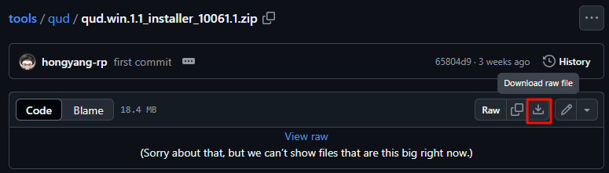

2.将 *qud.win.1.1\_installer\_10061.1.zip* 解压，运行 *setup.exe*，如下图，点击 **Next。**


3.再次点击 **Next。**


4.选择 **&#x20;I accept the terms in the license agreement&#x20;**（我接受协议内容）后，点击 **Next。**


5.点击 **Install。**


6.点击**&#x20;Finish**，完成驱动安装。


##### 1.3.1.1.2 安装Tflash

1.点击 https://github.com/rubikpi-ai/tools/blob/main/tflash/windows/TflashSetup_v1.2.0.4.exe ，下载安装包


2.打*TflashSetup_v1.2.0.4.exe* 进行安装，选择需要的语言，点击 **OK。**


3.选择要安装的位置，点击 **Next。**

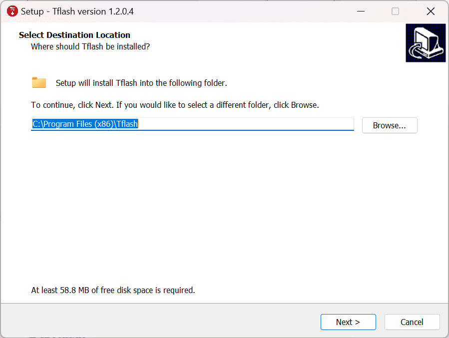

4.点击 **Next。**


5.勾选 **Create a desktop shortcut&#x20;**（创建桌面快捷方式），点击 **Next。**

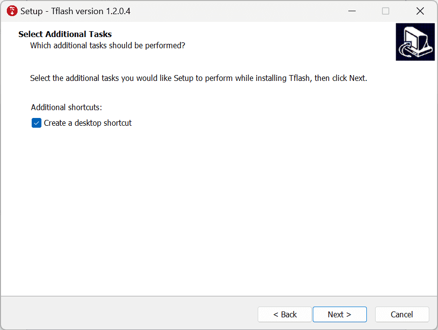

6.点击 **Install** 进行安装。


7.勾选 **Launch Tflash**，点击**&#x20;Finish** 完成安装。

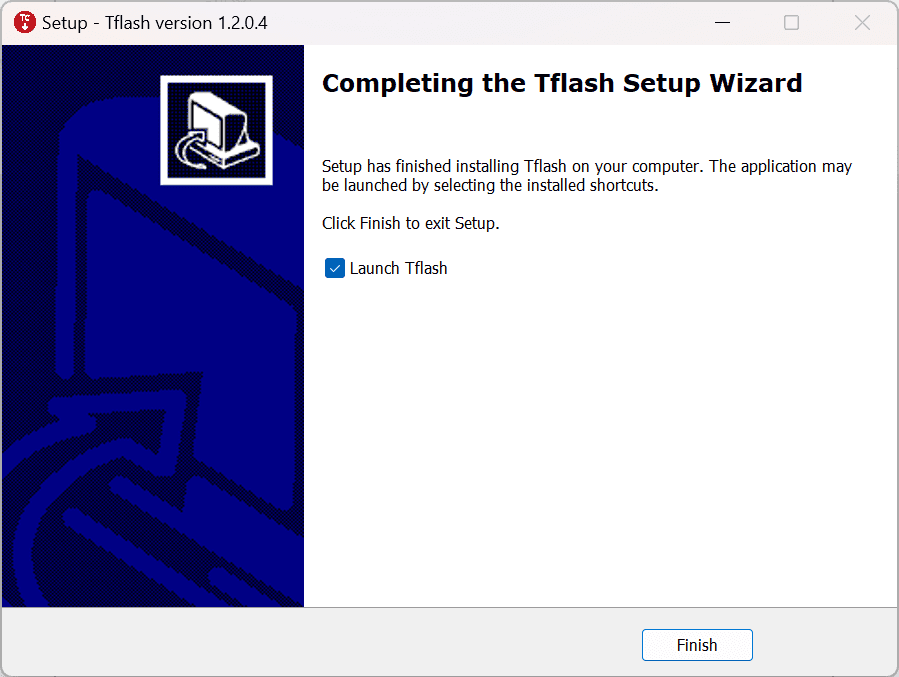

8.如果出现下面报错，点击 **是(Y)**，进行跳转，按照提示下载需要的安装包。


9.双击下载的安装包， 点击 **安装。**


10.点击**&#x20;关闭(C)**， 完成安装。


11.安装完成后，可在桌面和“开始”菜单中看到 Tflash 图标，如下图所示：

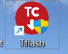

#### 1.3.1.2 Ubuntu 环境下驱动安装

##### 1.3.1.2.1 安装Tflash

1.点击 https://github.com/rubikpi-ai/tools/blob/main/tflash/ubuntu/Thundercomm-tflash-v1.0.0.deb ，下载安装包：


2.执行命令安装 Tflash。

```shell showLineNumbers
sudo dpkg -i Thundercomm-tflash-v1.0.0.deb
```

3.安装完成后，请在终端中执行 `tflash` 命令。如出现以下界面，表明 Tflash 已安装成功：


### 1.3.2 镜像下载

魔方派 3 出厂预装Linux镜像供您快速进行开箱操作体验，如需体验最新版本的Linux镜像，或其他操作系统镜像，请访问官方网站 https://www.thundercomm.com/zh/product/rubik-pi/ 进行下载。

如您需要Linux源码，请访问GitHub进行下载， [https://github.com/rubikpi-ai](https://github.com/rubikpi-ai)。

* Qualcomm Linux ：基于weston的桌面系统，系统较为精简，适合具备Linux开发经验，追求深度开发体验的开发者。


* Canonical Ubuntu For Qualcomm Platforms （开发中）：基于Ubuntu 24，系统完善，有更多的桌面应用，更好的使用体验，较多的开发资料，适合追求开发便捷的开发者。
* 安卓13：基于谷歌AOSP，系统完善，有更好的使用体验，适合想做安卓应用的开发者。


### 1.3.3 镜像烧录


* 首先进入烧录模式（9008模式）：

<Tabs>
  <TabItem value="methed1" label="方法1" default>
1.将供电线接入到上图 10。

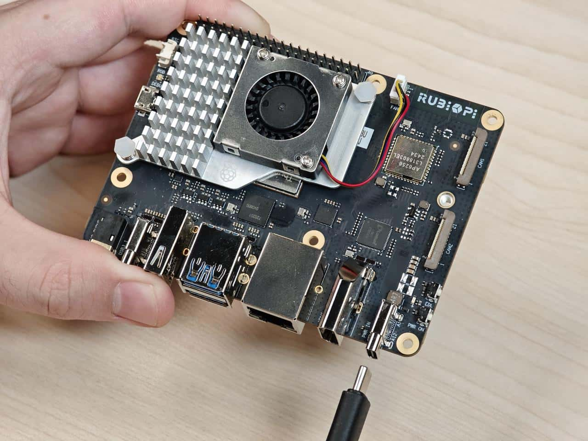

2.按住上图12的 EDL 按钮。


3.Type-C 数据线插入上图 5 等待3秒，进入9008模式。

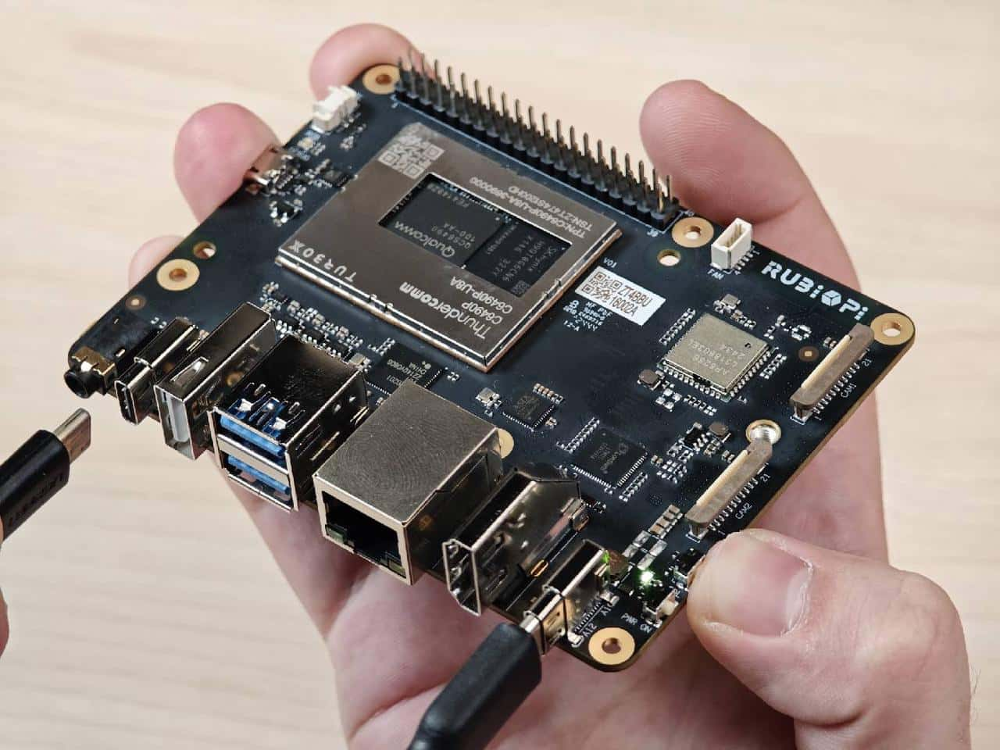
</TabItem>
<TabItem value="methed2" label="方法2">
1.将供电线接入到上图 10。


2.Type-C 数据线插入上图 5。


3.在魔方派 3开机后，输入如下命令，进入9008模式。

```shell showLineNumbers
adb shell reboot edl
```

</TabItem>
  <TabItem value="methed3" label="方法3">
1.将供电线接入到上图 10。


2.按住上图12的 EDL 按钮。


3.按住上图11的 PWR\_O&#x4E;**&#x20;**&#x6309;钮，等待3秒。

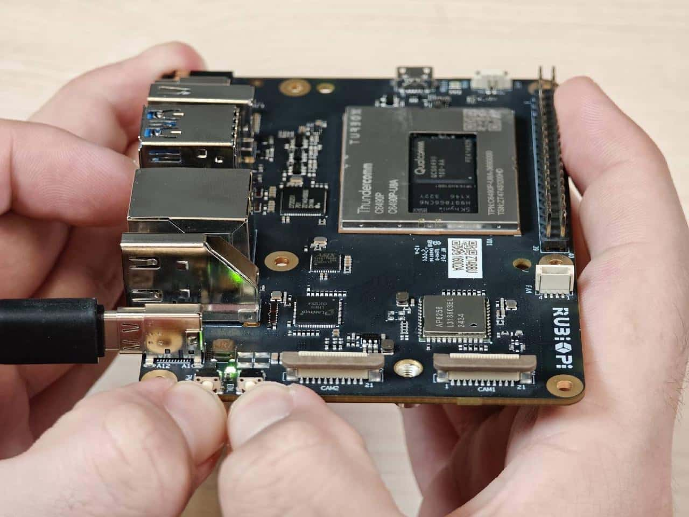

4.将 Type-C 数据线插入上图 5，进入9008模式。


</TabItem>
</Tabs>

#### 1.3.3.1 Windows 烧录方法

1.打开 Tflash 软件， 如下图，确定设备进入 9008 模式：


2.根据需要烧写设备的存储类型，选择正确的 **Storage Type&#x20;**，魔方派 3 为 **UFS**。


3.按需选择 **&#x20;Reset After Download&#x20;**&#x548C;**&#x20;Erase All Before Download**，请谨慎选择 **&#x20;Erase All Before Download**。


* Reset After Download：勾选后，烧写完成后设备将自动重启。
* Erase All Before Download：勾选后，烧写前会对魔方派 UFS各分区中的数据进行擦除。

:::warning

- Reset After Download 和 Erase All Before Download 并不是必选项，可以都不勾选。
- 如果烧写前后的UFS分区一致，勾选 Erase all Before Download 才会擦除数据。
  :::
  4.烧写 FlatBuild Image：

* 第1步. 点击**&#x20;Browse。**


* 第2步. 进入 FlatBuild 目录，选择 Programmer File，并选择 prog\_firehose\_ddr.elf。


* 第3步. 选择所有名称以“rawprogram”开头的 xml 文件。


* 第4步. 选择所有名称以“patch”开头的 xml 文件。


设置完成后，可从 Tflash 界面获取相关设置。


* 第5步. 点击**&#x20;Download&#x20;**开始刷机。


:::tip
烧写时间因个人电脑而异。在烧写过程中，可通过绿色进度条查看烧写进度。
:::

烧写成功后，界面会显示如下 log：


* 如已勾&#x9009;**&#x20;Reset After Download**，则开发板将在烧写完成后自动重启；
* 如未勾选**Reset AfterDownload**，断开电源线和 USB 线，使 魔方派 3 断电，再重连电源并按下 PWR ON 按钮启动开发板。

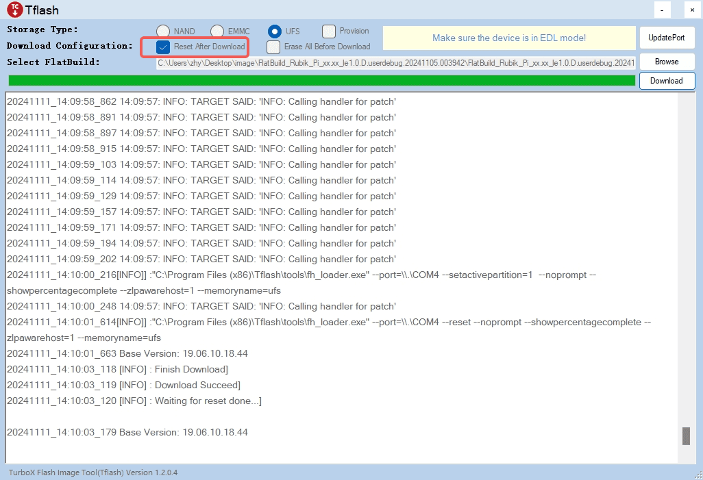

#### 1.3.3.2 Ubuntu 烧录方法

1.进入 FlatBuild 包目录。

2.执行 `tflash -r`。

:::tip
更多参数，可使用 `tflash -h`命令查看，这里 `-r`表示烧录完成后重启 魔方派 3。
:::

3.屏幕上出现提示“Stop the ModemManager on your host PC and press Enter on your keyboard to continue...”时，按 **Enter** 键进行刷机；


tflash 运行结束后，如显示以下界面，则说明烧写成功。

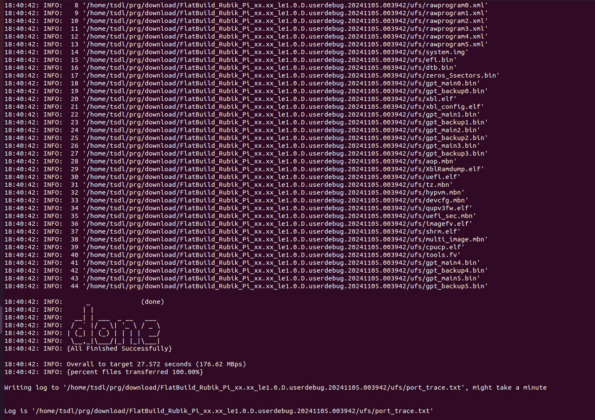

:::tip
在 PC 上执行 `tflash` 时，需根据提示输入个人电脑的登录密码。
:::

4.使用 `-r`参数烧写成功后，魔方派 3 自动重启。

## 1.4 开机

* 接入电源后按下电源 PWR ON 按键触发开机。


## 1.5 关机

* 输入命令`poweroff` 关机。

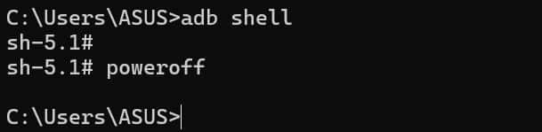

## 1.6 重启

* 输入命令`reboot` 重启。

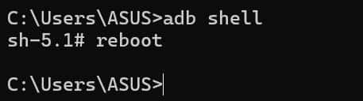

* 长按12秒电源 PWR ON 按键重启。


## 1.7 串口登录

### 1.7.1 Windows

1.连接下图2中的串口线到电脑。

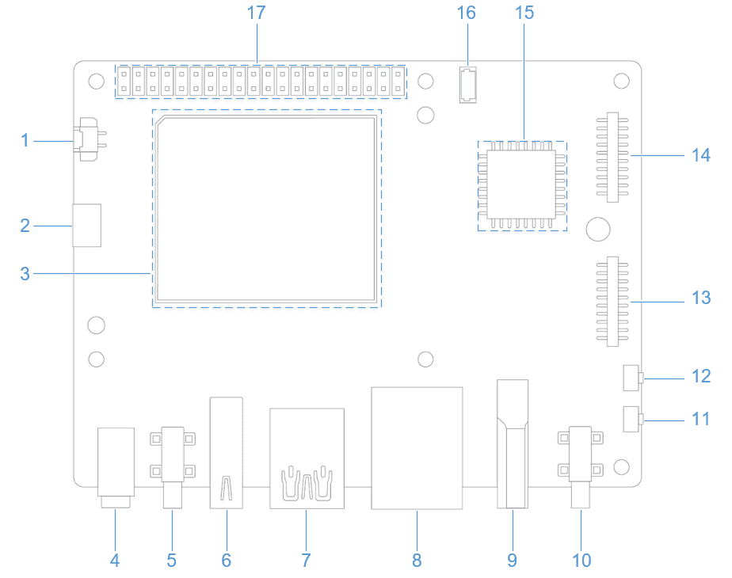

2.打开电脑设置，查看设备管理器对应的 COM 口并记录下来。


3.访问 https://mobaxterm.mobatek.net/ 下载 MobaXterm ，解压后即可使用。


4.打开 MobaXterm ，选择 **Session->Serial**，设置串口的波特率为115200。


5.点击 **OK**，按下回车，输入登录名和默认登录密码登录：

> **Qualcomm Linux**
>
> 登录帐号： root
>
> 登录密码： rubikpi

:::tip
可通过 `passwd` 命令修改默认的密码，如：

```shell showLineNumbers
passwd root
```
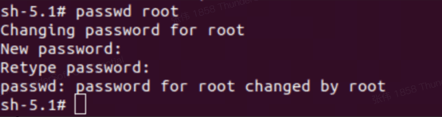

:::

### 1.7.2 Ubuntu

1.连接下图2中的串口线到电脑。


2.执行命令安装 minicom。

```shell showLineNumbers
sudo apt update
sudo apt install minicom
```

3.输入以下命令检查USB端口。

```shell showLineNumbers
ls /dev/ttyACM
```
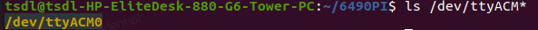

4.输入下面命令打开minicom， 按下回车，输入默认登录名和登录密码登录。

```shell showLineNumbers
sudo minicom -D /dev/ttyACM0 -b 115200
```

> **Qualcomm Linux**
>
> 登录帐号： root
>
> 登录密码： rubikpi


:::tip
可通过 `passwd` 命令修改默认的密码，如：

```shell showLineNumbers
passwd root
```

:::


## 1.8 ADB 登录

### 1.8.1 Windows

#### 1.8.1.1 准备

1.访问  https://developer.android.google.cn/tools/releases/platform-tools 下载 ADB和Fastboot 安装包并进行解压。

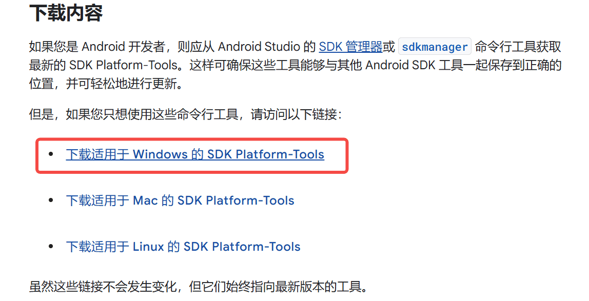

2.右键 **我的电脑属性**->**高级系统设置**->**环境变量**；

或右键 **我的电脑属性**->在搜索栏中输入**高级系统设置**->**环境变量**。


3.选择系统变量中的**Path**，点击**编辑。**


4.点击 **新建**，将 platform-tools 工具在步骤1解压的路径填写进去，点击 **确定&#x20;**&#x4FDD;存环境变量。

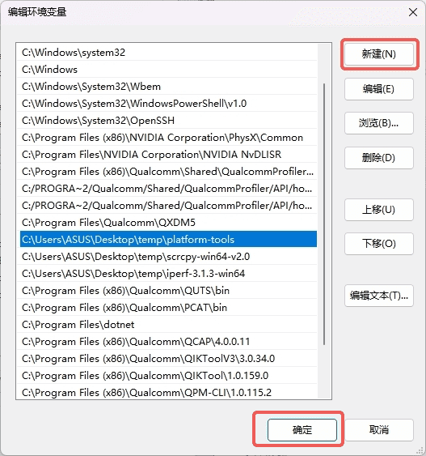

#### 1.8.1.2 ADB登录

按下 Win+R 输入CMD 打开 Windows 终端，在终端输入如下登录到 魔方派 3：

```shell showLineNumbers
adb devices # 查看是否有设备连接
adb root    # 以root用户登录
adb shell   # 打开adb终端
```


### 1.8.2 Ubuntu

#### 1.8.2.1 准备

1.输入如下命令安装 ADB 和 Fastboot 工具：

```shell showLineNumbers
sudo apt install git android-tools-adb android-tools-fastboot wget
```

2.更新 udev rules 文件

a.使用如下命令打开并修改 *51-qcom-usb.rules* 文件。

```shell showLineNumbers
sudo vi /etc/udev/rules.d/51-qcom-usb.rules
```

b.将如下内容，添加到文件中；若如下内容已经存在，可忽略这一步骤。

```shell showLineNumbers
SUBSYSTEMS=="usb", ATTRS{idVendor}=="05c6", ATTRS{idProduct}=="9008", MODE="0666", GROUP="plugdev"
```

c.使用下面命令，重启 `udev`。

```shell showLineNumbers
sudo systemctl restart udev
```

:::warning
如果 魔方派 3 已经通过 USB 连接到个人电脑，请插拔 USB 线，重新连接，以使更新的规则生效。
:::

#### 1.8.2.2 ADB登录

在终端输入如下命令登录到 魔方派 3：

```shell showLineNumbers
adb devices # 查看是否有设备连接
adb root    # 设置为root用户
adb shell   # 打开adb终端
```

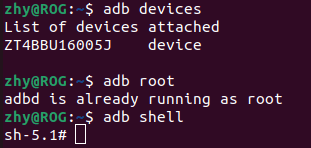

## 1.9 SSH 登录

### 1.9.1 Windows

* 获取IP地址

1.登录路由器后台或使用其他 IP 扫描软件获取 魔方派 的IP地址。

:::warning

IP地址会随网络环境变化而改变，魔方派 设备名称为 rubikpi

:::

2.按下 win+r 按键，在弹出的窗口中输入 cmd，点击 **确定。**


3.在终端中输入 ```ping <IP>``` 命令，若 魔方派 的 IP 为 10.9.5.59 如下所示，查看执行结果。

```shell showLineNumbers
ping 10.9.5.59
```

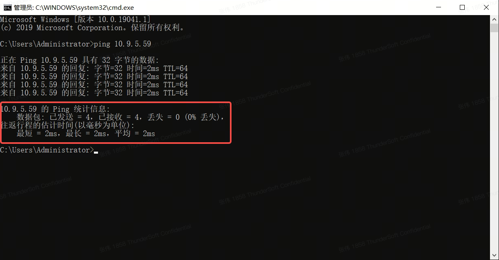


* 进行SSH登录

1.打开MobaXterm软件。


2.点击 **Session** ，在弹出的界面中选择 **SSH**。


3.输入要登录 魔方派 3 的 IP，点击 **OK。**

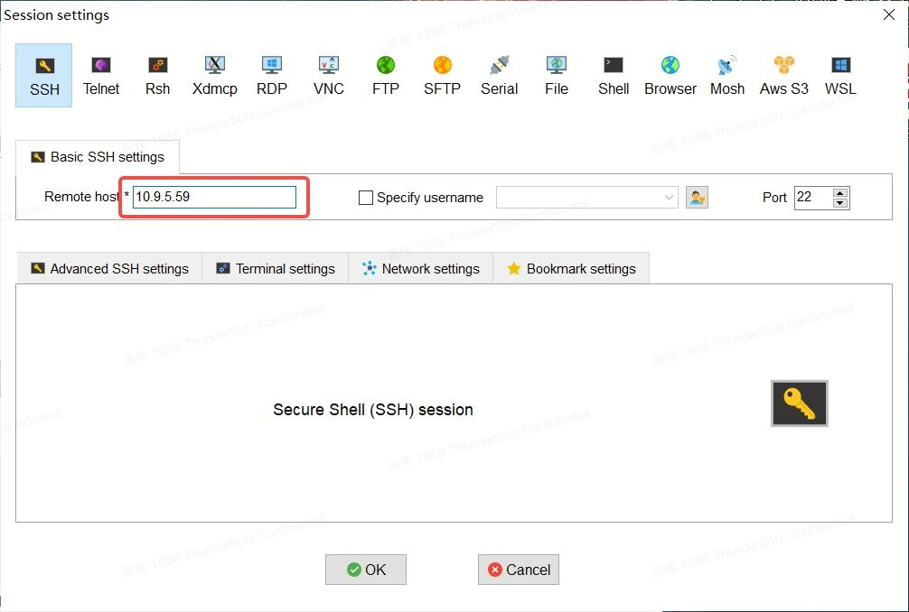


4.输入要登录的用户名回车后，再输入密码，再次回车登录 魔方派 3。


5.成功登录。


### 1.9.2 Ubuntu

* 确定连接状态

1.登录路由器后台或使用其他 IP 扫描软件获取 魔方派 的 IP 地址。

:::warning

IP地址会随网络环境变化而改变，魔方派 设备名称为 rubikpi

:::

2.在Ubuntu终端中输入 ```ping <IP>``` 命令，若 魔方派 的 IP 为 10.9.5.59 如下所示如下命令，查看执行结果。

```shell showLineNumbers
ping 10.9.5.59
```


* 进行 SSH 登录

1.在Ubuntu终端中输入```ssh <user>@<IP>```命令后回车，如下所示，其中root表示要登录的用户，10.9.5.59 表示 魔方派 3 的IP。

```shell showLineNumbers
ssh root@10.9.5.59
```

2.输入密码后回车，成功登录。

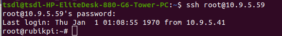

## 1.10 文件传输

### 1.10.1 ADB

* 在PC终端中使用下面命令，上传文件 test.txt 到 /opt目录。

  ```shell showLineNumbers
  adb push test.txt /opt
  ```
* 在PC终端中使用下面命令，下载文件 test.txt 到PC当前目录。

  ```shell showLineNumbers
  adb pull /opt/test.txt ./
  ```

### 1.10.2 SCP

SCP 传输需要 魔方派 3 正常联网，若 魔方派 3 的 IP 为 10.9.5.59， 在终端可输入下面命令：

:::tip
魔方派 3 的 IP 可通过在魔方派 3 中输入 `ifconfig`命令获取。


:::

* 在PC终端中使用下面命令，上传文件 test.txt 到 /opt目录。

```shell showLineNumbers
scp test.txt root@10.9.5.59:/opt
```

- 在PC终端中使用下面命令，下载文件到PC当前目录。

```shell showLineNumbers
scp root@10.9.5.59:/opt/test.txt ./
```

## 1.11 Ubuntu 开发环境搭建

### 1.11.1 软件安装

1.在 Ubuntu 终端中使用下面命令，安装软件。

```shell showLineNumbers
sudo apt update
sudo apt install repo gawk wget git diffstat unzip texinfo gcc build-essential chrpath socat cpio python3 python3-pip python3-pexpect xz-utils debianutils iputils-ping python3-git python3-jinja2 libegl1-mesa libsdl1.2-dev pylint xterm python3-subunit mesa-common-dev zstd liblz4-tool locales tar python-is-python3 file libxml-opml-simplegen-perl vim whiptail bc
sudo apt-get install lib32stdc++6 libncurses5 checkinstall libreadline-dev libncursesw5-dev libssl-dev libsqlite3-dev tk-dev libgdbm-dev libc6-dev libbz2-dev libffi-dev curl git-lfs
```

2.在 Ubuntu 终端中使用下面命令，安装 Python 3.10.2，在 Linux kernel 的打包过程中用到了 python 3.10 命令，如果已经有 Python 3.10.2 或更高版本，请跳过这个步骤。

```shell showLineNumbers
python --version
# Download it in a directory of your choice
wget https://www.python.org/ftp/python/3.10.2/Python-3.10.2.tgz
tar -xvf Python-3.10.2.tgz
cd Python-3.10.2
./configure --enable-optimizations
make
sudo make install
```

3.在 Ubuntu 终端中使用下面命令，安装 pefile。

```shell showLineNumbers
sudo pip3.10 install pefile
```

### 1.11.2 安装交叉编译工具

1.在 Ubuntu 终端中使用下面命令，下载 魔方派 3 的交叉编译工具链：

```shell showLineNumbers
git clone https://github.com/rubikpi-ai/toolchains.git
git lfs pull
```

2.在Ubuntu终端中使用下面命令，安装交叉编译工具链：

```shell showLineNumbers
cd toolchains
./qcom-wayland-x86_64-meta-toolchain-armv8-2a-qcm6490-toolchain-1.0.sh
```

3.按照提示安装交叉编译环境，如下输入安装目录的绝对路径回车后，输入 **Y** 行安装。


4.安装完成后到安装目录执行如下命令，设置交叉编译环境。

```shell showLineNumbers
source environment-setup-armv8-2a-qcom-linux
```

5.在 Ubuntu 终端中使用下面命令，查看 gcc 工具链版本，若输出如下内容说明交叉编译环境设置成功。

```shell showLineNumbers
aarch64-qcom-linux-gcc -v
```

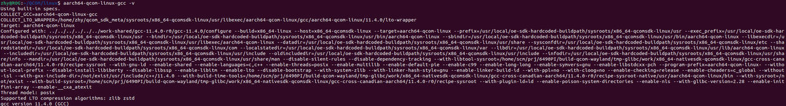

### 1.11.3 交叉编译工具使用方法

在1.11.2小节中，通过  `source environment-setup-armv8-2a-qcom-linux` 命令设置好交叉编译环境后，可以通过下面的方法，交叉编译 魔方派 3 的可执行程序。

#### 1.11.3.1 使用 Makefile 构建

交叉编译需要设置头文件路径（sysroot），可使用 `--sysroot=dir `参数指定。

```shell showLineNumbers
aarch64-qcom-linux-gcc --sysroot=/home/zhy/rubikpi/sdk/sysroots/armv8-2a-qcom-linux
```

:::warning
在上面命令中，是将交叉编译工具链安装在了 PC 机 /home/zhy/rubikpi/sdk 目录下，请按实际安装目录进行修改。
:::

#### 1.11.3.2 使用CMake构建项目

如下为 aarch64.cmake 的简单示例：

```CMake showLineNumbers
set(CMAKE_SYSTEM_NAME Linux)
set(CMAKE_SYSTEM_PROCESSOR arm64) #设置目标处理器架构

#设置sysroot
set(TOOLCHAIN_DIR /home/zhy/rubikpi/sdk/sysroots/armv8-2a-qcom-linux)
set(CMAKE_SYSROOT ${TOOLCHAIN_DIR}/sysroots/armv8-2a-qcom-linux)

#设置交叉编译器
SET(CMAKE_C_COMPILER ${TOOLCHAIN_DIR}/sysroots/x86_64-qcomsdk-linux/usr/bin/aarch64-qcom-linux/aarch64-qcom-linux-gcc)
SET(CMAKE_CXX_COMPILER ${TOOLCHAIN_DIR}/sysroots/x86_64-qcomsdk-linux/usr/bin/aarch64-qcom-linux/aarch64-qcom-linux-g++)

set(CMAKE_FIND_ROOT_PATH_MODE_PROGRAM NEVER)
set(CMAKE_FIND_ROOT_PATH_MODE_LIBRARY ONLY)
set(CMAKE_FIND_ROOT_PATH_MODE_INCLUDE ONLY)
```

在使用Cmake构建项目时，需要按项目情况创建 CMakeLists.txt，并执行如下命令，生成 Makefile 文件。

```shell showLineNumbers
cmake -DCMAKE_TOOLCHAIN_FILE=aarch64.cmake 
```

## 1.12 Linux kernel

推荐在 Ubuntu 18 及以上系统下进行 Linux kernel 相关的开发。

### 1.12.1 代码下载

```shell showLineNumbers
git clone https://github.com/rubikpi-ai/linux.git
```

### 1.12.2 代码编译

1.设置交叉编译环境，具体请参考 1.11.2 安装交叉编译工具小节。

```shell showLineNumbers
source <your toolchains directory>/environment-setup-armv8-2a-qcom-linux
```

:::warning
交叉编译环境只对当前终端有效。

若出现如下错误，可按提示输入 `unset LD_LIBRARY_PATH` 命令后，再次执行上面命令。


:::

2.进入内核目录，整编内核。

```shell showLineNumbers
./rubikpi_build.sh -a
```

:::warning

- 第一次编译的时间会比较长，时间因个人电脑配置而异，普遍在20分钟之内，当编译成功后，后面对代码修改只会编译修改的部分；

- 使用`make clean`命令可以清理内核目录，清理后所有的编译生成物和部分配置内容都会被删除掉。
  :::

3.进入内核目录，打包内核、设备树镜像。

```shell showLineNumbers
./rubikpi_build.sh -dp -ip  # 打包镜像
```


:::warning
如果打包镜像时报错：


执行下面命令编辑 `.mtoolsrc` 文件，并在其中添加 `mtools_skip_check=1`，然后再重新打包镜像。

```shell showLineNumbers
vim ~/.mtoolsrc
```

:::

* 进入内核目录，烧录内核、设备树镜像。

```shell showLineNumbers
./rubikpi_flash.sh -d -i -r    # 烧录
```

:::warning

烧录前，魔方派 3 需要进入 fastboot 模式，有下面两种进入方法：

a.在魔方派 3 终端输入：reboot bootloader，进入 fastboot 模式后，魔方派 3 上的蓝灯会亮起来。

b.按住电源按钮开机，直到 魔方派 3 上的蓝灯亮起。
:::

关于 `./rubikpi_build.sh` 和 `./rubikpi_flash.sh` 脚本的使用方法，可使用 `-h` 参数进行查看。

* 单独编译ko驱动模块

1.创建*Makefile*文件如下，修改 KDIR 为实际 kernel 源码在个人电脑上的目录。

```makefile showLineNumbers
obj-m += hello.o
KDIR:=/home/rubikpi/kernel-6.6
PWD?=$(shell pwd)
all:
        make -C $(KDIR) M=$(PWD) modules
        echo $(PWD)
clean:
        rm -f *.ko *.o *.mod *.mod.o *.mod.c *.symvers *.order

```

2.创建*hello.c*文件如下：

```C showLineNumbers
#include <linux/module.h>
#include <linux/init.h>

static int hello_init(void)
{
    printk("hello 魔方派!\n");
    return 0;
}

static void hello_exit(void)
{
    printk("bye 魔方派!\n");
}

module_init(hello_init);
module_exit(hello_exit);

MODULE_LICENSE("GPL");
MODULE_VERSION("V1.0");
MODULE_AUTHOR("魔方派");
```

3.执行命令编译ko模块：

```Bash showLineNumbers
export ARCH=arm64
export CROSS_COMPILE=aarch64-qcom-linux-
make
```

4.将 hello.ko 传到 魔方派 3 中，可以使用 ADB、SCP 等方式。

5.在魔方派 3 中执行命令进行验证：

```shell showLineNumbers
insmod hello.ko 
rmmod hello.ko 
dmesg | grep "魔方派"
```


### 1.12.3 内核配置

使用 menuconfig 对 linux 内核进行配置，执行如下命令：

```Bash showLineNumbers
cd kernel-6.6/
make ARCH=arm64 menuconfig
```

配置完成并执行如下命令将配置保存。

```shell showLineNumbers
make ARCH=arm64 savedefconfig
cp defconfig ./arch/arm64/configs/rubik_pi3_defconfig
```

### 1.12.4 目录分析

在 1.12.1 代码下载小节，执行完 `git clone`命令后，魔方派 3 linux 代码仓库的目录如下：


其中重要的文件夹或文件的含义如下：

| **名字** | **描述**               | **名字**    | **描述**                             |
| -------------- | ---------------------------- | ----------------- | ------------------------------------------ |
| arch           | 架构相关的目录               | security          | 安全架构相关的目录                         |
| block          | 块设备相关的目录             | sound             | 音频系统相关的目录                         |
| certs          | 认证和签名相关的目录         | tools             | 内核交互工具的目录                         |
| crypto         | 加密相关的目录               | usr               | 与 initramfs 相关的目录，用于生成initramfs |
| documentation  | 文档相关的目录               | virt              | 提供虚拟机技术（KVM）的目录                |
| drivers        | 驱动相关的目录               | rust              | Rust相关的目录                             |
| firmware       | 固件相关的目录               | rubikpi           | 魔方派 3 相关的目录，存放编译工具等      |
| fs             | 文件系统相关的目录           | techpack          | 高通平台相关的驱动                         |
| include        | 头文件相关目录               | .config           | 内核编译最终使用的配置文件                 |
| init           | 内核初始化相关的目录         | Makefile          | 编译内核的主要文件                         |
| ipc            | 进程间通信相关的目录         | Kbuild            | 配置内核设定的脚本                         |
| kernel         | 内核最核心部分代码的目录     | Kconfig           | 图形化配置界面的配置文件                   |
| lib            | 内核核心库代码的目录         | MAINTAINERS       | 维护者名单                                 |
| mm             | 内存管理相关代码的目录       | CREDITS           | Linux贡献者                                |
| net            | 网络协议相关的代码目录       | COPYING           | 版权声明                                   |
| samples        | 内核编程范例相关的目录       | rubikpi\_build.sh | 魔方派 3 提供的编译、打包脚本            |
| scripts        | 内核编译、配置相关脚本的目录 | rubikpi\_flash.sh | 魔方派 3 提供的烧录脚本                  |

#### 1.12.4.1 设备树

魔方派 3 的顶层设备树是 rubikpi3-c6490.dts，可以在 *arch/arm64/boot/dts/qcom* 目录下找到，对于设备树的所有修改，推荐在此文件上进行。

除此之外，在开发过程中，同级目录的 *sc7280.dtsi* 也可能会高频查看， sc7280.dtsi 中拥有 GPIO、SPI、I2C、UART、CPU、GPU 等开发过程中较为常用的节点。
