# 2. 外设与接口

## 2.1 硬件资源图


| 序号 | 接口                        | 序号 | 接口                       |
| ---- | --------------------------- | ---- | -------------------------- |
| 1    | RTC 电池接口                | 10   | Power Delivery over Type-C |
| 2    | Micro USB (UART 调试)       | 11   | Power on 按键              |
| 3    | QCS6490 模组                | 12   | EDL 按键                   |
| 4    | 3.5mm 耳机接口              | 13   | 摄像头接口 1               |
| 5    | USB Type-C with DP (USB3.1) | 14   | 摄像头接口 2               |
| 6    | USB Type-A (USB2.0)         | 15   | Wi-Fi/BT 模块              |
| 7    | 2 x USB Type- A (USB3.0)    | 16   | 风扇接口                   |
| 8    | 1000M 以太网                | 17   | 40-pin 连接器              |
| 9    | HDMI OUT                    | 18   | M.2 Key M 接口             |

## 2.2 40 pin 连接器

### 2.2.1 GPIO

#### 2.2.1.1 引脚分布

在用户空间使用 GPIO 时，通常需要使用 GPIO 的引脚编号，可以通过下表进行确认，下表中表明了 40 pin 连接器上的引脚功能，如13号引脚的引脚名称为 GPIO\_24, GPIO 子系统的引脚编号为559。


#### 2.2.1.2 使用shell命令控制

在魔方派 3 中执行下面的步骤控制 GPIO

* 进入 */sys/class/gpio* 目录：

```shell showLineNumbers
cd /sys/class/gpio
```

* 将要控制的 GPI O导出，如控制13号引脚 GPIO\_24：

```shell showLineNumbers
echo 559 > export
```

* 进入到 *gpio559*  目录设置 GPIO 属性：

```shell showLineNumbers
cd gpio559
ls
```


direction（方向）：

- 输入：in
- 输出：out

value（值）：

- 低电平：0
- 高电平：1

edge （中断边沿）：

- 上升沿触发：rising
- 下降沿触发：falling
- 双边沿触发：both
- 禁用中断：none

如设置13号引脚输出高电平：

```shell showLineNumbers
echo out > direction
echo 1 > value
```

* 取消导出13号引脚到用户空间：

```shell showLineNumbers
echo 559 > unexport
```

#### 2.2.1.3 使用Python程序控制

* 可使用 Python 的 periphery 库控制 GPIO，可在魔方派 3 中使用下面命令进行安装：

```shell showLineNumbers
pip3 install python-periphery 
```

* 下方截取代码是使用 periphery 库操作 GPIO 的示例，其中将13号引脚设置为输出，15号引脚设置为输入，循环检测15号引脚的电平状态。

```python showLineNumbers
from periphery import GPIO
import time

out_gpio = GPIO(559, "out")
in_gpio = GPIO(560, "in")

try:
    while True:
        try:
            out_gpio.write(True)
            pin_level = in_gpio.read()
            print(f"in_gpio level: {pin_level}")

            out_gpio.write(False)
            pin_level = in_gpio.read()
            print(f"in_gpio level: {pin_level}")

            time.sleep(1)

        except KeyboardInterrupt:
            out_gpio.write(False)
            break

except IOError:
    print("Error")

finally:
    out_gpio.close()
    in_gpio.close()
```

* 将 *gpio.py&#x20;* 传输到 魔方派 3 中，如使用 ADB 传输。

```shell showLineNumbers
adb push gpio.py /opt
```

* 将13和15号引脚使用杜邦线短接测试 GPIO 电平控制和电平读取情况，如下图所示：

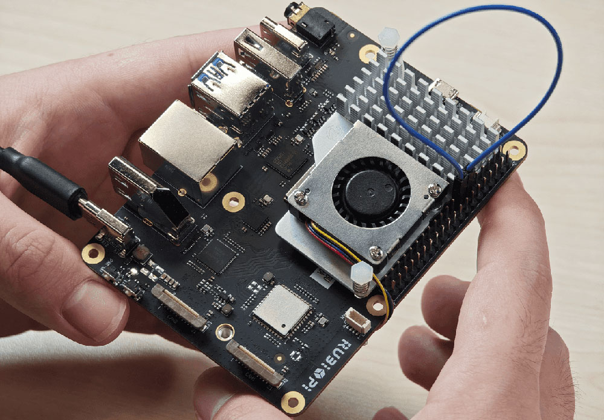

程序运行结果如下：

```shell showLineNumbers
cd /opt
python3 gpio.py
```


#### 2.2.1.4 使用C语言程序控制

* 以下代码示例，代码将13号引脚设置为输出15号引脚设置为输入，循环检测15号引脚的电平状态：

```C showLineNumbers
#include <stdio.h>
#include <stdlib.h>
#include <unistd.h>

int out_gpio = 559;
int in_gpio = 560;

int main() {
    char export_path[50] = {};
    char export_command[100] = {};
    snprintf(export_path, sizeof(export_path), "/sys/class/gpio/export");
    snprintf(export_command, sizeof(export_command), "echo %d > %s ", out_gpio, export_path);
    system(export_command);
    snprintf(export_command, sizeof(export_command), "echo %d > %s ", in_gpio, export_path);
    system(export_command);

    char direction_path[50] = {};
    snprintf(direction_path, sizeof(direction_path), "/sys/class/gpio/gpio%d/direction", out_gpio);
    FILE *direction_file = fopen(direction_path, "w");
    if (direction_file == NULL) {
        perror("Failed to open GPIO direction file");
        return -1;
    }
    fprintf(direction_file, "out");
    fclose(direction_file);

    snprintf(direction_path, sizeof(direction_path), "/sys/class/gpio/gpio%d/direction", in_gpio);
    direction_file = fopen(direction_path, "w");
    if (direction_file == NULL) {
        perror("Failed to open GPIO direction file");
        return -1;
    }
    fprintf(direction_file, "in");
    fclose(direction_file);

    char value_in_path[50] = {};
    char value_out_path[50] = {};
    char cat_command[100] = {};
    snprintf(value_out_path, sizeof(value_out_path), "/sys/class/gpio/gpio%d/value", out_gpio);
    snprintf(value_in_path, sizeof(value_in_path), "/sys/class/gpio/gpio%d/value", in_gpio);
    snprintf(cat_command, sizeof(cat_command), "cat %s", value_in_path);

    FILE *value_out_file = fopen(value_out_path, "w");
    if (value_out_file == NULL) {
        perror("Failed to open GPIO value file");
        return -1;
    }

    for (int i = 0; i < 5; i++) {
        fprintf(value_out_file, "1");
        fflush(value_out_file);

        system(cat_command);
        sleep(1);

        fprintf(value_out_file, "0");
        fflush(value_out_file);

        system(cat_command);
        sleep(1);
    }

    fclose(value_out_file);

    char unexport_path[50] = {};
    char unexport_command[100] = {};
    snprintf(unexport_path, sizeof(unexport_path), "/sys/class/gpio/unexport");
    snprintf(unexport_command, sizeof(unexport_command), "echo %d > %s ", out_gpio, unexport_path);
    system(unexport_command);
    snprintf(unexport_command, sizeof(unexport_command), "echo %d > %s ", in_gpio, unexport_path);
    system(unexport_command);

    return 0;
}

```

* 交叉编译程序，具体可参考 1.11.3 交叉编译工具使用方法章节：

```shell showLineNumbers
aarch64-qcom-linux-gcc gpio.c -o gpio --sysroot=/home/zhy/qcom_sdk_meta/sysroots/armv8-2a-qcom-linux/
```

* 将 *gpio* 传输到 魔方派 3 中，如使用 ADB 传输：

```shell showLineNumbers
adb push gpio /opt
```

* 将13和15号引脚使用杜邦线短接，测试 GPIO 电平控制和电平读取情况，如下图所示，程序运行结果如下：

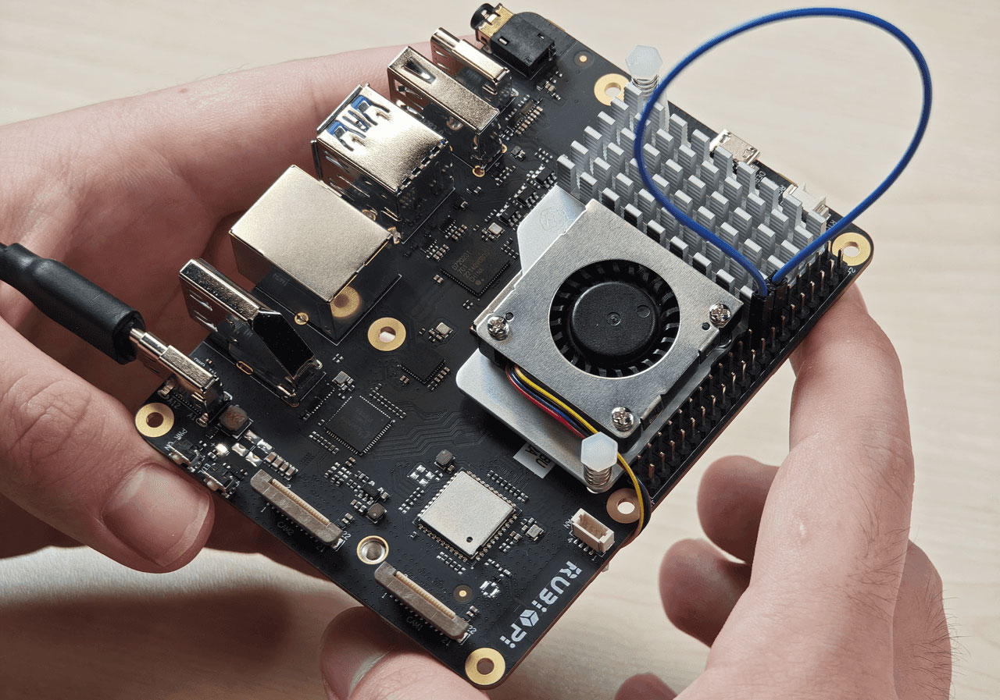

```shell showLineNumbers
cd /opt
./gpio
```

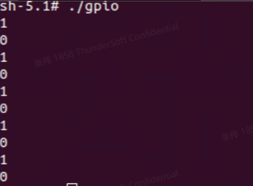


### 2.2.2 I2C

#### 2.2.2.1 引脚分布

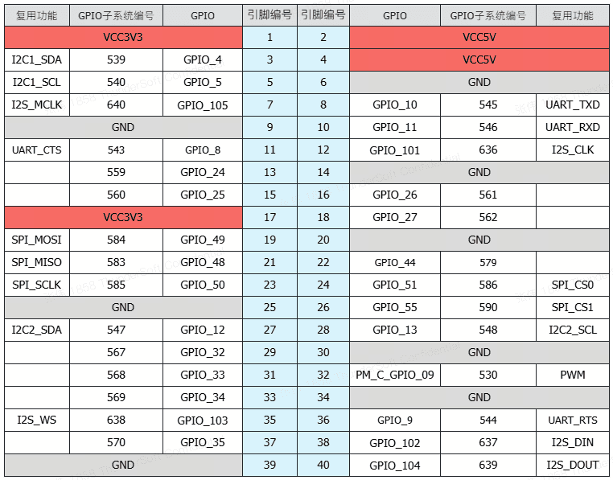

:::tip
3号引脚和5号引脚默认已设置配为 I2C1。
:::

#### 2.2.2.2 使用 shell 命令测试

在魔方派 3 中执行下面步骤控制 I2C 总线

* 查看I2C1接口上的设备：

```shell showLineNumbers
i2cdetect -a -y -r 1
```

* 读取地址为0x38设备的全部寄存器：

```shell showLineNumbers
i2cdump -f -y 3 0x38
```

* 向地址为0x38设备的0x01寄存器地址写入0xaa：

```shell showLineNumbers
i2cset -f -y 1 0x38 0x01 0xaa
```

* 读取地址为0x38的设备，寄存器地址为0x01处的数值：

```shell showLineNumbers
i2cget -f -y 1 0x38 0x01
```

#### 2.2.2.3 使用 Python 程序 I2C 通信

* 可使用 Python 的 smbus 库控制 I2C，可在魔方派 3 中使用下面命令进行安装：

```shell showLineNumbers
pip3 install smbus
```

* 以下代码示例，使用 I2C1 总线和地址为0x38的设备进行通信，向设备0x01地址处写入0xaa：

```python showLineNumbers
import smbus

def main():
    data = [0x01, 0xaa]

    try:
        i2c_bus = smbus.SMBus(1)  

        print("i2cdetect addr : ", end="")
        for address in range(0x7F):
            try:
                i2c_bus.write_i2c_block_data(address, 0, data)
                print("0x{:02X},".format(address), end="")
            except OSError:
                pass  

        print()

    except Exception as e:
        print(f"An error occurred: {e}")

    finally:
        if i2c_bus:
            i2c_bus.close()

if __name__ == "__main__":
    main()

```

* 将*i2c.py*传输到 魔方派 3 中，如果使用 adb 传输，命令如下：

```shell showLineNumbers
adb push i2c.py /opt
```

* 将3和5号引脚连接 I2C 传感器，验证 I2C 总线通信，如下图所示:

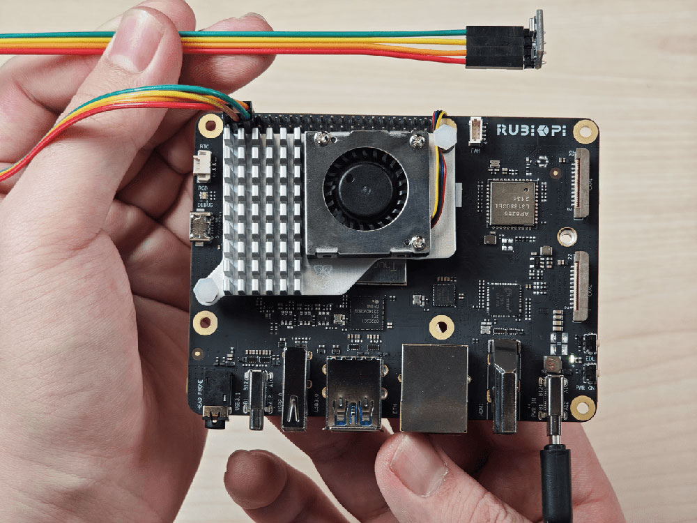


```shell showLineNumbers
cd /opt
python3 i2c.py 
```
程序运行结果如下：

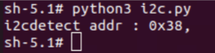


#### 2.2.2.4 使用C语言程序 I2C 通信

* 以下代码示例，I2C1 总线和地址为0x38的设备进行通信，向设备0x01地址处写入0xaa：

```C showLineNumbers
#include <stdio.h>
#include <stdlib.h>
#include <stdint.h>
#include <fcntl.h>
#include <unistd.h>
#include <linux/i2c-dev.h>
#include <sys/ioctl.h>

#define I2C_DEVICE_PATH "/dev/i2c-1"

int main() {
    uint8_t data[2] = {0x01,0xaa};
  
    const char *i2c_device = I2C_DEVICE_PATH;  
    int i2c_file;

    if ((i2c_file = open(i2c_device, O_RDWR)) < 0) {
        perror("Failed to open I2C device");
        return -1;
    }
  
    ioctl(i2c_file, I2C_TENBIT, 0);
    ioctl(i2c_file, I2C_RETRIES, 5);

    printf("i2cdetect addr : ");
    for (int x = 0; x < 0x7f; x++)
    {
        if (ioctl(i2c_file, I2C_SLAVE, x) < 0) {
            perror("Failed to set I2C slave address");
            close(i2c_file);
            return -1;
        }
    
        if (write(i2c_file, data, 2) == 2)
        {
            printf("0x%x,", x);
        }
    }
  
    close(i2c_file);
    printf("\r\n");

    return 0;
}
```

* 交叉编译程序，具体可参考1.11.3交叉编译工具使用方法章节：

```shell showLineNumbers
aarch64-qcom-linux-gcc i2c.c -o i2c --sysroot=/home/zhy/qcom_sdk_meta/sysroots/armv8-2a-qcom-linux/
```

* 将*i2c*传输到 魔方派 3 中，如果使用 ADB 传输，命令如下：

```shell showLineNumbers
adb push i2c /opt
```

* 将3和5号引脚连接 I2C 传感器，验证 I2C 总线通信，如下图所示:


```shell showLineNumbers
cd /opt
./i2c
```

程序运行结果如下：

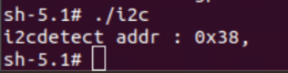


### 2.2.3 SPI

#### 2.2.3.1 引脚分布


:::tip
19号、21号、23号、24号 引脚默认已设置配为SPI。
:::

#### 2.2.3.2 使用 Python 程序 SPI 通信

* 可使用 Python 的 spidev 库进行SPI通信，spidev 库可在魔方派 3 中使用下面命令进行安装：

```shell showLineNumbers
pip3 install spidev
```

* 以下代码示例，代码使用 SPI 总线进行数据收发通信：

```python showLineNumbers
import spidev

def main():
    tx_buffer = [ord(char) for char in "hello world!"]
    rx_buffer = [0] * len(tx_buffer)

    try:
        spi = spidev.SpiDev()
        spi.open(12, 0)
        spi.max_speed_hz = 1000000  

        rx_buffer = spi.xfer2(tx_buffer[:])
        print("tx_buffer:\n\r", ''.join(map(chr, tx_buffer)))
        print("rx_buffer:\n\r", ''.join(map(chr, rx_buffer)))

    except Exception as e:
        print(f"An error occurred: {e}")

    finally:
        if spi:
            spi.close()

if __name__ == "__main__":
    main()
```

* 将*spi.py*传输到 魔方派 3 中，如果使用 ADB 传输，命令如下：

```shell showLineNumbers
adb push spi.py /opt
```

* 将19号引脚和21号引脚使用杜邦线短接，验证 SPI 总线通信，如下图所示：


```shell showLineNumbers
python3 spi.py 
```
程序运行结果如下：

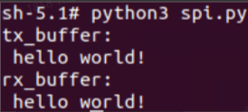


#### 2.2.3.3 使用C语言程序 SPI 通信

* 以下代码示例，代码使用 SPI 总线进行数据收发通信：

```C showLineNumbers
#include <stdio.h>
#include <stdlib.h>
#include <stdint.h>
#include <fcntl.h>
#include <unistd.h>
#include <linux/spi/spidev.h>
#include <sys/ioctl.h>

#define SPI_DEVICE_PATH "/dev/spidev12.0"

int main() {
    int spi_file;
    uint8_t tx_buffer[50] = "hello world!";
    uint8_t rx_buffer[50];

    // Open the SPI device
    if ((spi_file = open(SPI_DEVICE_PATH, O_RDWR)) < 0) {
        perror("Failed to open SPI device");
        return -1;
    }

    // Configure SPI mode and bits per word
    uint8_t mode = SPI_MODE_0;
    uint8_t bits = 8;
    if (ioctl(spi_file, SPI_IOC_WR_MODE, &mode) < 0) {
        perror("Failed to set SPI mode");
        close(spi_file);
        return -1;
    }
    if (ioctl(spi_file, SPI_IOC_WR_BITS_PER_WORD, &bits) < 0) {
        perror("Failed to set SPI bits per word");
        close(spi_file);
        return -1;
    }

    // Perform SPI transfer
    struct spi_ioc_transfer transfer = {
        .tx_buf = (unsigned long)tx_buffer,
        .rx_buf = (unsigned long)rx_buffer,
        .len = sizeof(tx_buffer),
        .delay_usecs = 0,
        .speed_hz = 1000000,  // SPI speed in Hz
        .bits_per_word = 8,
    };

    if (ioctl(spi_file, SPI_IOC_MESSAGE(1), &transfer) < 0) {
        perror("Failed to perform SPI transfer");
        close(spi_file);
        return -1;
    }

     /* Print tx_buffer and rx_buffer*/
    printf("\rtx_buffer: \n %s\n ", tx_buffer);
    printf("\rrx_buffer: \n %s\n ", rx_buffer);

    // Close the SPI device
    close(spi_file);

    return 0;
}
```

* 交叉编译程序，具体可参考1.11.3交叉编译工具使用方法章节：

```shell showLineNumbers
aarch64-qcom-linux-gcc spi.c -o spi --sysroot=/home/zhy/qcom_sdk_meta/sysroots/armv8-2a-qcom-linux/
```

* 将spi传输到 魔方派 3 中，如果使用 ADB 传输，命令如下：

```shell showLineNumbers
adb push spi /opt
```

* 将19号引脚和21号引脚使用杜邦线短接，验证 SPI 总线通信，如下图所示：


```shell showLineNumbers
cd /opt
./spi
```
程序执行结果如下：

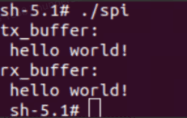


### 2.2.4 UART

#### 2.2.4.1 引脚分布

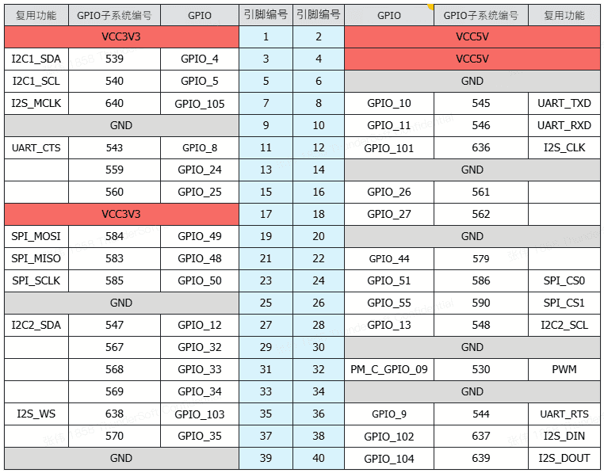

:::tip
8号和10号引脚默认已设置配为 UART，设备节点为 */dev/ttyHS3*。
:::

#### 2.2.4.2 使用shell命令测试

在魔方派 3 中 使用下面命令控制串口通信

* 使用 stty 工具配置串口，如下将串口的输入速率和输出速率都设置为115200，并关闭回显：

```shell showLineNumbers
stty -F /dev/ttyHS3 ispeed 115200 ospeed 115200
stty -F /dev/ttyHS3 -echo
```

* 在魔方派 3 上开启两个终端，将8号引脚和10号引脚使用杜邦线短接，分别执行下面命令，接收端会回显发送端的内容：

```shell showLineNumbers
echo "hello world!" > /dev/ttyHS3  #发送端
cat /dev/ttyHS3 #接收端
```


#### 2.2.4.3 使用 Python 程序 UART 通信

* 可使用 Python 的 serial 库进行 UART 通信，可在魔方派 3 中使用下面命令进行安装：

```shell showLineNumbers
pip3 install pyserial
```

* 以下代码示例，使用UART进行数据收发通信：

```python showLineNumbers
import serial
import time

with serial.Serial(
    "/dev/ttyHS3",
    baudrate=115200,
    bytesize=serial.EIGHTBITS,
    stopbits=serial.STOPBITS_ONE,
    parity=serial.PARITY_NONE,
    timeout=1,
) as uart3:
    uart3.write(b"Hello World!\n")
    buf = uart3.read(128)
    print("Raw data:\n", buf)
    data_strings = buf.decode("utf-8")
    print("Read {:d} bytes, printed as string:\n {:s}".format(len(buf), data_strings))
```

* 将*uart.py*传输到 魔方派 3 中，如果使用 ADB 传输，命令如下：

```shell showLineNumbers
adb push uart.py /opt
```

* 将8号引脚和10号引脚使用杜邦线短接，验证串口通信，如下图所示：

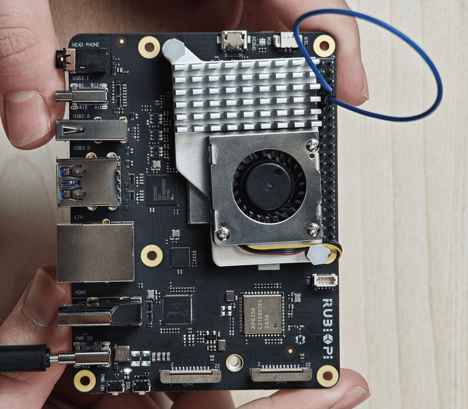

```shell showLineNumbers
python3 uart.py 
```
程序执行结果如下：


#### 2.2.4.4 使用C语言程序 UART 通信

* 以下代码示例，使用 UART 进行数据收发通信：

```C showLineNumbers
#include <stdio.h>
#include <stdlib.h>
#include <string.h>
#include <fcntl.h>
#include <termios.h>
#include <unistd.h>

int main() {
    int serial_port_num = 3;
    char serial_port[15];

    sprintf(serial_port,"/dev/ttyHS%d",serial_port_num);
    int serial_fd;

    serial_fd = open(serial_port, O_RDWR | O_NOCTTY);
    if (serial_fd == -1) {
        perror("Failed to open serial port");
        return 1;
    }

    struct termios tty;
    memset(&tty, 0, sizeof(tty));

    if (tcgetattr(serial_fd, &tty) != 0) {
        perror("Error from tcgetattr");
        return 1;
    }

    cfsetospeed(&tty, B9600);
    cfsetispeed(&tty, B9600);

    tty.c_cflag &= ~PARENB;
    tty.c_cflag &= ~CSTOPB;
    tty.c_cflag &= ~CSIZE;
    tty.c_cflag |= CS8;

    if (tcsetattr(serial_fd, TCSANOW, &tty) != 0) {
        perror("Error from tcsetattr");
        return 1;
    }

    char tx_buffer[] = "hello world!\n";
    ssize_t bytes_written = write(serial_fd, tx_buffer, sizeof(tx_buffer));
    if (bytes_written < 0) {
        perror("Error writing to serial port");
        close(serial_fd);
        return 1;
    }
    printf("\rtx_buffer: \n %s ", tx_buffer);

    char rx_buffer[256];
    int bytes_read = read(serial_fd, rx_buffer, sizeof(rx_buffer));
    if (bytes_read > 0) {
        rx_buffer[bytes_read] = '\0';
        printf("\rrx_buffer: \n %s ", rx_buffer);
    } else {
        printf("No data received.\n");
    }

    close(serial_fd);

    return 0;
}
```

* 交叉编译程序，具体可参考1.11.3交叉编译工具使用方法章节：

```shell showLineNumbers
aarch64-qcom-linux-gcc uart.c -o uart --sysroot=/home/zhy/qcom_sdk_meta/sysroots/armv8-2a-qcom-linux/
```

* 将*uart*传输到 魔方派 3 中，如果使用 ADB 传输，命令如下：

```shell showLineNumbers
adb push uart /opt
```

* 将8号引脚和10号引脚使用杜邦线短接，验证串口通信，如下图所示：


### 2.3.1 USB2.0 接口

USB2.0接口作为 device 模式时需要手动执行命令切换，如下为一种测试方式，在魔方派 3 中输入下面命令，将 魔方派 3 模拟为U盘：

```shell showLineNumbers
cd /sys/kernel/config/usb_gadget/  #在串口终端登录，执行下面命令
mkdir g1
cd g1
mkdir functions/mass_storage.0

dd if=/dev/zero of=/tmp/test.iso bs=1M count=2048  #创建大小为2G的U盘空间
mkfs.ext4 /tmp/test.iso 
echo "/tmp/test.iso" > functions/mass_storage.0/lun.0/file
mkdir configs/c.1
ln -s functions/mass_storage.0/ configs/c.1/f3
mount -t debugfs none /sys/kernel/debug/

echo device > /sys/kernel/debug/usb/8c00000.usb/qcom_usb2_0_mode  #将USB切换为device模式
echo 8c00000.usb > UDC #连接USB线，U盘被识别 可在U盘内写入和写出文件

echo host > /sys/kernel/debug/usb/8c00000.usb/qcom_usb2_0_mode  #拔掉USB线，切换为主机模式
```

### 2.3.2 Type-C 接口

Type-C 接口可自动完成主机和设备模式的切换。

* 当 Type-C 接入 PC 时自动切换为设备模式。

* 接入 OTG 线时自动切换为主机模式。

* 接入 DP 显示器时，自动输出 DP 视频信号。

## 2.4 CSI

目前 魔方派 3 已经支持以下三款摄像头：

* [High Quality Camera（IMX477/M12 Mount）](https://www.raspberrypi.com/products/raspberry-pi-high-quality-camera/)

:::note
在魔方派 3 QIM 官方演示中，IMX477 摄像头使用了 WS1053516 镜头.
:::

* [Camera Module 2 (IMX219)](https://www.raspberrypi.com/products/camera-module-v2/)

:::note
目前 魔方派 3 暂时只支持标准版 Module 2 摄像头，不支持广角（Wide）、夜光（NoIR）版本。
:::

* [Camera Module 3 (IMX708)](https://www.raspberrypi.com/products/camera-module-3/)

:::note
目前 魔方派 3 暂时只支持标准版 Module 3 摄像头，不支持广角（Wide）、夜光（NoIR）版本。当前软件版本暂不支持 Module 3 摄像头的AF自动对焦功能。
:::

### 2.4.1 [摄像头排线安装](https://www.raspberrypi.com/products/camera-cable/)

魔方派 3 支持的摄像头 FPC 为 22Pin，0.5mm 间距，厚度0.3±0.05mm。可以兼容其他大部分开源生态开发板同规格摄像头 FPC。

<!--  -->

1.向上拉开连接器的锁扣部分：


2.插入 FPC，注意接触面朝向板内：


3.按下锁扣，确认 FPC 稳定没有松动：

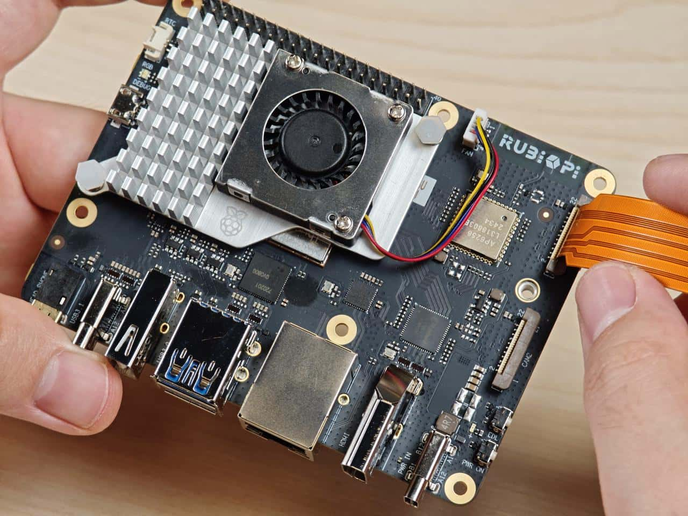

### 2.4.2 摄像头使用方法

在魔方派 3 中，可使用 `gstreamer` 命令对摄像头进行操作，操作前需输入下面命令对摄像头进行设置：

```shell showLineNumbers
mount -o remount,rw /
echo multiCameraLogicalXMLFile=kodiak_dc.xml > /var/cache/camera/camxoverridesettings.txt
echo enableNCSService=FALSE >> /var/cache/camera/camxoverridesettings.txt
```

可将摄像头插入，下图13和14处：


如下为实物连接图：


* 在魔方派 3 中使用下面命令测试单个摄像头全屏预览：

```shell showLineNumbers
export XDG_RUNTIME_DIR=/dev/socket/weston
export WAYLAND_DISPLAY=wayland-1
setprop persist.overlay.use_c2d_blit 2
gst-launch-1.0 -e qtiqmmfsrc camera=0 name=camsrc ! video/x-raw\(memory:GBM\),format=NV12,width=1920,height=1080,framerate=30/1,compression=ubwc ! queue ! waylandsink fullscreen=true async=true
```


* 在魔方派 3 中使用下面命令测试两摄像头并发预览：

```shell showLineNumbers
#终端1
export XDG_RUNTIME_DIR=/dev/socket/weston
export WAYLAND_DISPLAY=wayland-1
setprop persist.overlay.use_c2d_blit 2
gst-launch-1.0 -e qtiqmmfsrc camera=0 name=camsrc ! video/x-raw\(memory:GBM\),format=NV12,width=1920,height=1080,framerate=30/1,compression=ubwc ! queue ! waylandsink sync=false x=0 y=0 width=960 height=540 enable-last-sample=false

#终端2
export XDG_RUNTIME_DIR=/dev/socket/weston
export WAYLAND_DISPLAY=wayland-1
setprop persist.overlay.use_c2d_blit 2
gst-launch-1.0 -e qtiqmmfsrc camera=1 name=camsrc ! video/x-raw\(memory:GBM\),format=NV12,width=1920,height=1080,framerate=30/1,compression=ubwc ! queue ! waylandsink sync=false x=960 y=540 width=960 height=540 enable-last-sample=false
```


- 在魔方派 3 中使用下面命令测试两摄像头并发录像：

```shell showLineNumbers
#终端1：
echo multiCameraLogicalXMLFile=kodiak_dc.xml > /var/cache/camera/camxoverridesettings.txt
export XDG_RUNTIME_DIR=/dev/socket/weston
export WAYLAND_DISPLAY=wayland-1
setprop persist.overlay.use_c2d_blit 2
gst-launch-1.0 -e qtiqmmfsrc camera=0 name=camsrc video_0::type=preview ! video/x-raw\(memory:GBM\),format=NV12,width=1920,height=1080,framerate=30/1,compression=ubwc,interlace-mode=progressive,colorimetry=bt601 ! queue ! v4l2h264enc capture-io-mode=5 output-io-mode=5 ! queue ! h264parse ! mp4mux ! queue ! filesink location="/opt/mux0.mp4"

#终端2：
export XDG_RUNTIME_DIR=/dev/socket/weston
export WAYLAND_DISPLAY=wayland-1
setprop persist.overlay.use_c2d_blit 2
gst-launch-1.0 -e qtiqmmfsrc camera=1 name=camsrc video_0::type=preview ! video/x-raw\(memory:GBM\),format=NV12,width=1920,height=1080,framerate=30/1,compression=ubwc,interlace-mode=progressive,colorimetry=bt601 ! queue ! v4l2h264enc capture-io-mode=5 output-io-mode=5 ! queue ! h264parse ! mp4mux ! queue ! filesink location="/opt/mux1.mp4"
```

录制完成后在 /opt 目录下有录制的视频文件，如下图：


* 在魔方派 3 中使用下面命令测试两摄像头并发录像加预览

```shell showLineNumbers
#终端1
export XDG_RUNTIME_DIR=/dev/socket/weston
export WAYLAND_DISPLAY=wayland-1
setprop persist.overlay.use_c2d_blit 2
gst-launch-1.0 -e qtiqmmfsrc camera=0 name=camsrc video_0::type=preview ! video/x-raw\(memory:GBM\),format=NV12,width=1920,height=1080,framerate=30/1,compression=ubwc,interlace-mode=progressive,colorimetry=bt601 ! queue ! v4l2h264enc capture-io-mode=5 output-io-mode=5 ! queue ! h264parse ! mp4mux ! queue ! filesink location="/opt/mux0.mp4" camsrc. ! video/x-raw\(memory:GBM\),format=NV12,width=1920,height=1080,framerate=30/1,compression=ubwc ! waylandsink sync=false x=0 y=0 width=960 height=540 enable-last-sample=false

#终端2
export XDG_RUNTIME_DIR=/dev/socket/weston
export WAYLAND_DISPLAY=wayland-1
setprop persist.overlay.use_c2d_blit 2
gst-launch-1.0 -e qtiqmmfsrc camera=1 name=camsrc video_0::type=preview ! video/x-raw\(memory:GBM\),format=NV12,width=1920,height=1080,framerate=30/1,compression=ubwc,interlace-mode=progressive,colorimetry=bt601 ! queue ! v4l2h264enc capture-io-mode=5 output-io-mode=5 ! queue ! h264parse ! mp4mux ! queue ! filesink location="/opt/mux1.mp4" camsrc. ! video/x-raw\(memory:GBM\),format=NV12,width=1920,height=1080,framerate=30/1,compression=ubwc ! waylandsink sync=false x=960 y=540 width=960 height=540 enable-last-sample=false
```

录制完成后在 /opt 目录下有录制的视频文件：


预览结果如下：


## 2.5 HDMI OUT

HDMI 接口为下图9， 魔方派 3 支持 HDMI1.4，最高 4K 30Hz 输出，支持 CEC 功能，支持分辨率自适应功能（按屏幕支持的最高分辨率输出）和热插拔：


### 2.5.1 CEC

HDMI CEC（Consumer Electronics  Control，消费者电子控制）是 HDMI 标准中的一项功能，旨在通过单一的HDMI连接线实现多设备之间的互联与统一控制。具体来说，CEC 允许连接的设备通过专用的 CEC 引脚进行通信，从而实现例如通过一个遥控器控制多台设备的功能。

魔方派 3 集成了 cec-client 工具，将 HDMI 线连接到电视后，可使用下面命令查看电视是否支持 CEC：

```shell showLineNumbers
echo 'scan' | cec-client -s -d 1
```
若支持CEC将会有如下输出:
```text
opening a connection to the CEC adapter...
requesting CEC bus information ...
CEC bus information
===================
device #0: TV
address:       0.0.0.0
active source: no
vendor:        Sony
osd string:    TV
CEC version:   1.4
power status:  standby
language:      eng
 
  
device #1: Recorder 1
address:       1.0.0.0
active source: no
vendor:        Pulse Eight
osd string:    CECTester
CEC version:   1.4
power status:  on
language:      eng
 
  
device #4: Playback 1
address:       3.0.0.0
active source: no
vendor:        Sony
osd string:    PlayStation 4
CEC version:   1.3a
power status:  standby
language:      ???
```

若电视支持CEC功能，可在魔方派 3 中使用下面命令控制电视音量的加减：

```shell showLineNumbers
echo 'volup' | cec-client -t p -s
echo 'voldown' | cec-client -t p -s
```

更多 cec-client 使用方法，可使用 `-h` 参数进行查看：


### 2.5.2 HDMI OUT 触摸屏

魔方派 3 默认支持1024\*600P分辨率的HDMI OUT触摸屏，并支持触摸功能，如下图所示：

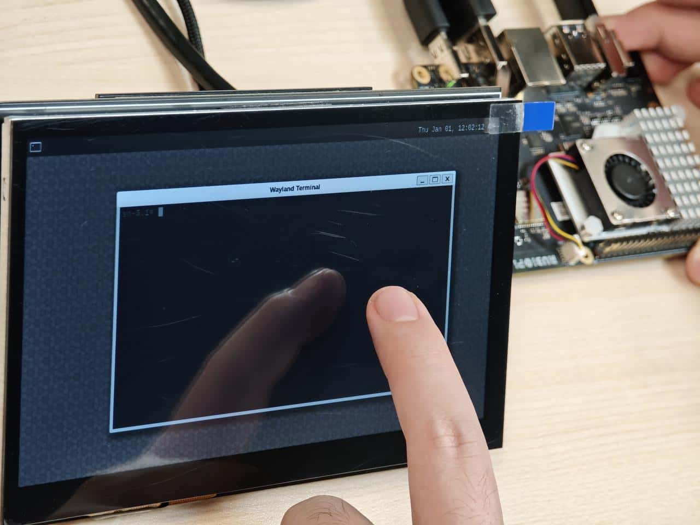

:::info
上图中使用的屏幕为7寸IPS高清触摸屏幕。

https://detail.tmall.com/item.htm?abbucket=12&id=683025543197&rn=92499216a472de3107f9541a1b160dc3&spm=a1z10.5-b-s.w4011-25285306736.152.50aa1c712FMfOS&skuId=5055110246880
:::

## 2.6 Wi-Fi & BT

魔方派 3 上搭载了 AP6256 Wi-Fi 模块，支持 Wi-Fi 5 和蓝牙5.2。

### 2.6.1 Wi-Fi

#### 2.6.1.1 STA模式

在STA模式（Station）下，设备可连接到一个已经存在的无线网络，以便访问网络资源或互联网，在魔方派 3 中输入如下面命令进行连接：

1.扫描附近Wi-Fi：

```shell showLineNumbers
iw wlan0 scan | grep SSID 
```

2.连接 Wi-Fi：

```shell showLineNumbers
wpa_passphrase <ssid> <passphrase> > /etc/wpa_supplicant.conf  #输入Wi-Fi账号和密码 

systemctl restart wifi  #连接Wi-Fi
```

3.连接好 Wi-Fi 后，下次开机会自动进行连接。

4.如想切换 Wi-Fi 可修改*/etc/wpa\_supplicant.conf*文件，如下是一种修改方式：

```shell showLineNumbers
ctrl_interface=/var/run/wpa_supplicant
update_config=1
pmf=1
network={
        ssid="RUBIKPi"
        psk="123456789"
}
```

* ssid为无线网络名称

* psk为无线网络密码

* 按实际情况对文件进行修改

修改完成后，输入下面命令进行连接：

```shell showLineNumbers
killall -9 wpa_supplicant
wpa_supplicant -Dnl80211 -iwlan0 -c/etc/wpa_supplicant.conf -B
```

#### 2.6.1.2 AP模式

AP模式（Access Point）即无线接入热点模式，是一个无线网络的创建者，是网络的中心节点，一般家庭或办公室使用的无线网络路由器就是一个AP，下面是AP的创建步骤：

* 开启AP

  * 创建或修改*/opt/hostapd.conf* 文件：

  ```shell showLineNumbers
  ctrl_interface=/var/run/hostapd
  driver=nl80211
  ieee80211n=1
  interface=wlan1
  hw_mode=a
  channel=36
  beacon_int=100
  dtim_period=1
  ssid=RUBIKPi
  auth_algs=1
  ap_isolate=0
  ignore_broadcast_ssid=0
  wpa=2
  wpa_key_mgmt=WPA-PSK
  rsn_pairwise=CCMP
  wpa_passphrase=123456789
  ```

  * 执行下面命令开启AP：

  ```shell showLineNumbers
  killall wpa_supplicant 
  killall dhcpcd
  ifconfig wlan1 down
  ifconfig wlan1 192.168.43.1 netmask 255.255.255.0 up
  pkill -9 dnsmasq
  dnsmasq -i wlan1 --dhcp-range=192.168.43.10,192.168.43.100
  hostapd /opt/hostapd.conf &
  ```
* 关闭AP：

```shell showLineNumbers
hostapd_cli disable
killall -9 hostapd
ifconfig wlan1 down
```

### 2.6.2 BT
在魔方派 3中使用下面命令测试BT功能
* 运行 app\_manager 程序进行配对：

  ```shell showLineNumbers
  cd /usr/src/rubikpi-bt-demo/
  ./app_manager
  ```

  

  a.在终端输入2回车后等待蓝牙扫描结果；

  b.在终端输入4回车后输入要配对的蓝牙设备 Dev 编号再次回车；

  c.根据提示在终端输入13回车接受配对， 对端蓝牙设备同时也要接受配对请求；

  d.app\_manager 需要一直运行，下面步骤使用 `adb shell` 命令创建新终端进行。

* 蓝牙发送

  以发送文件为例：

```shell showLineNumbers
cd /usr/src/rubikpi-bt-demo/
touch ./test_file.txt
echo RUBIKPi > test_file.txt
./app_opc
#输入4回车
#输入0回车
#输入设备编号回车
#手机接收文件
#输入9回车退出
```


* 蓝牙接收：

```shell showLineNumbers
cd /usr/src/rubikpi-bt-demo/
mkdir push
./app_ops
#输入1回车
#手机蓝牙发送文件
#传输完成后，输入9回车退出， 在./push 文件夹中查看传输的文件
```


* 其他Demo

在魔方派 3的 */usr/src/rubikpi-bt-demo/3rdparty/3rdparty/embedded/bsa\_examples/linux* 目录下，存放了所有 BT 相关的源码，可以按需要进行编译和查看，编译方法如下：

```shell showLineNumbers
cd /usr/src/rubikpi-bt-demo/3rdparty/3rdparty/embedded/bsa_examples/linux/<测试demo>/build/
export ARMGCC=gcc
make CPU=arm64
cp arm64/<demo可执行文件>  /usr/src/rubikpi-bt-demo/
cd /usr/src/rubikpi-bt-demo/
#运行demo程序
```

## 2.7 音频

魔方派 3 目前支持的音接口为：

* 3.5mm 耳机，下图4。

* HDMI OUT， 下图9。

* 蓝牙


### 2.7.1 查看声卡信息

* 在魔方派 3 中输入下面命令，查看声卡挂载情况：

```shell showLineNumbers
cat /proc/asound/cards 
```

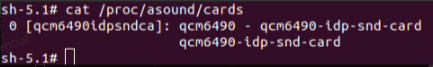

* 在魔方派 3 中输入下面命令，查看已分配的 pcm 流列表：

```shell showLineNumbers
cat /proc/asound/pcm
```

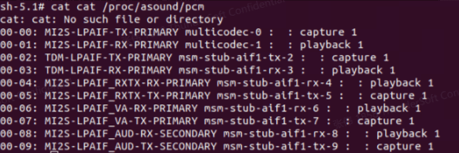

### 2.7.2 设置输出源

在魔方派 3 中输入下面命令，改变 gstreamer、paplay等命令的音频输出源头：

* 设置输出接口为3.5mm耳机接口

```shell showLineNumbers
pactl set-sink-port 0 headset
```

* 设置输出接口为 HDMI

```shell showLineNumbers
pactl set-sink-port 0 hdmi
```

### 2.7.3 播放

* 在魔方派 3 中输入下面命令测试耳机播放， 将测试音频放到*/opt*目录下，执行下面命令进行播放:

```shell showLineNumbers
gst-launch-1.0 filesrc location=/opt/test.mp3 ! mpegaudioparse ! mpg123audiodec ! pulsesink
```

* 在魔方派 3 中输入下面命令测试 HDMI OUT 播放，将测试音频放到*/opt*目录下，执行下面命令进行播放:

```shell showLineNumbers
systemctl stop pulseaudio
agmplay /opt/test.wav -D 100 -d 100 -r 48000 -b 16 -c 2 -i MI2S-LPAIF_RXTX-RX-PRIMARY
systemctl start pulseaudio
```

* 在魔方派 3 中输入下面命令测试蓝牙耳机播放，测试需要开启多个终端。

  * 终端一:

  ```shell showLineNumbers
  cd /usr/src/rubikpi-bt-demo/
  ./app_manager
  ```

  * 终端二:

  ```shell showLineNumbers
  cd /usr/src/rubikpi-bt-demo/
  ./app_av
  ```

  a.输入2回车，等待发现蓝牙耳机；

  b.输入6回车，开始建立连接；

  c.输入1回车，从最近的扫描结果中连接；

  d.输入要连接蓝牙设备的Dev号。

  

  * 返回终端一，输入13回车，接受配对。

  * 返回终端二，输入11回车后选择要播放的音乐编号回车播放音乐。

### 2.7.4 录制

在魔方派 3中输入下面命令测试录音功能

* 耳机录制:

```shell showLineNumbers
gst-launch-1.0 -v pulsesrc volume=10 ! audioconvert ! wavenc ! filesink location=/opt/test.wav
```

* 蓝牙耳机录制，测试需要开启多个终端：

  * 终端一:

  ```shell showLineNumbers
  cd /usr/src/rubikpi-bt-demo/
  ./app_manager
  ```

  * 终端二:

  ```shell showLineNumbers
  cd /usr/src/rubikpi-bt-demo/
  ./app_ag
  ```

  a.输入 1 回车，等待发现蓝牙耳机；

  b.输入 6 回车，连接蓝牙耳机；

  c.输入 1 回车，从最近的扫描结果中连接；

  d.输入要连接蓝牙设备的Dev号；

  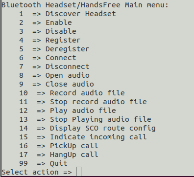

  e.返回终端一，输入13回车，接受配对；

  f.返回终端二，输入8 回车，打开 SCO 链路；

  g.输入10回车，开始录制蓝牙耳机麦克风音频；

  h.输入11回车停止录制；

  i.录制音频的保存路径为  */usr/src/rubikpi-bt-demo/test\_files/ag/sco\_ag\_in.wav*。

### 2.7.5 调节音量

* 耳机调节音量

可通过下面命令获取和设置音量:

```shell showLineNumbers
tinymix get "DAC Playback Volume"
tinymix set "DAC Playback Volume" 192 192
```

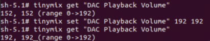

* 蓝牙调节音量

在播放蓝牙音频时，可在终端二输入 20 选择要连接编号回车后进行音量的调节，调节范围为0-100:


## 2.8 风扇

[魔方派 3支持的散热套件](https://www.raspberrypi.com/products/active-cooler/)

<!--  -->

:::warning
使用魔方派 3在运行一些高负载或高性能的场景下，需要使用散热措施来保证设备性能稳定，否则会因为cpu温度过高而带来降频等性能影响。
:::

### 2.8.1 风扇安装

1.将散热器背面所有导热硅脂移除，将下图标记的两块硅脂按 魔方派 3 的 SoC 及 uMCP 的形状裁下。


两块的表面尺寸约为14\*12mm和13\*11.5mm。


2.将裁剪好的两块导热硅脂贴在魔方派 3 上对应位置。


3. 安装散热器。


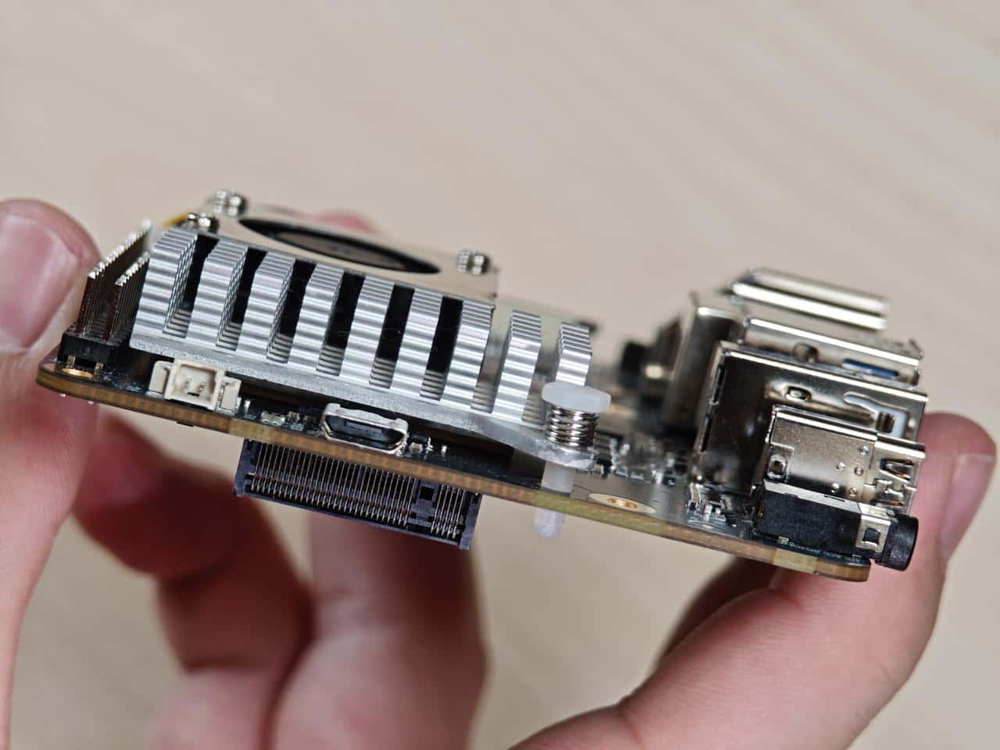

4.连接风扇排线。

<!-- 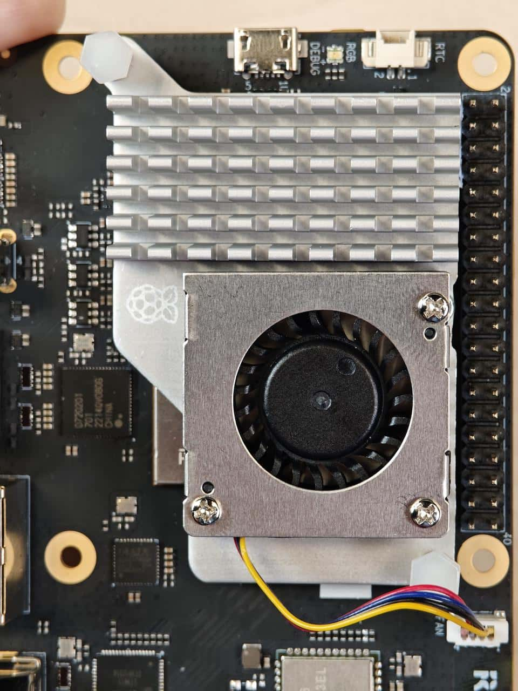 -->

:::danger
建议将风扇安装到 魔方派 3 上后不要将其取下。拆卸会导致风扇的推针和散热垫退化，并可能导致产品损坏。如果推针损坏或变形，或无法牢固夹住，请停止使用风扇。
:::

### 2.8.2 风扇控制方法

魔方派 3 风扇会根据当前的 CPU 温度自动调整转速，同时也可使用下面命令进行手动控制转速，0和255分别表示风扇的最高和最低速度。

```shell showLineNumbers
echo 100 >  /sys/class/hwmon/hwmon29/pwm1
echo 255 >  /sys/class/hwmon/hwmon29/pwm1
echo 0 >  /sys/class/hwmon/hwmon29/pwm1
```

## 2.9 以太网

以太网接口为下图8， 魔方派 3 支持千兆以太网：


<!-- 接入网线，如下图所示： -->

<!-- 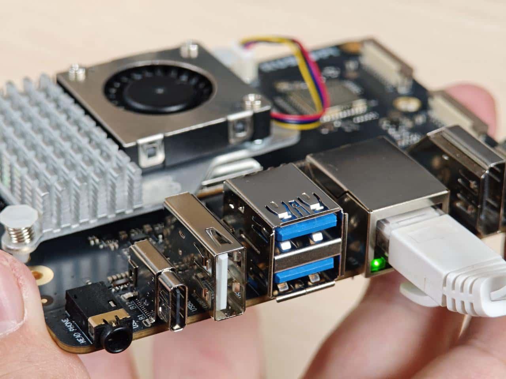 -->

可在魔方派 3 中使用下面命令查看网络连接情况，如下图所示，已经成功分配 IP，说明网络连接成功：

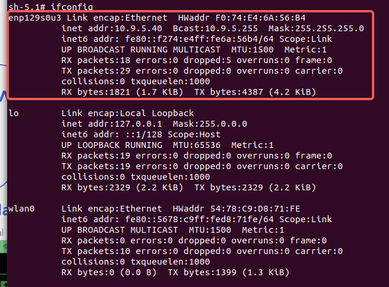

## 2.10 RTC电池接口

RTC(Real\_Time Clock) 电池接口为下图1。


接入 RTC 电池， 如下图所示，并将时间写入 魔方派 3 的系统硬件时钟，可在魔方派 3 完全断电后，仍对 魔方派 3 的系统时间进行保存。

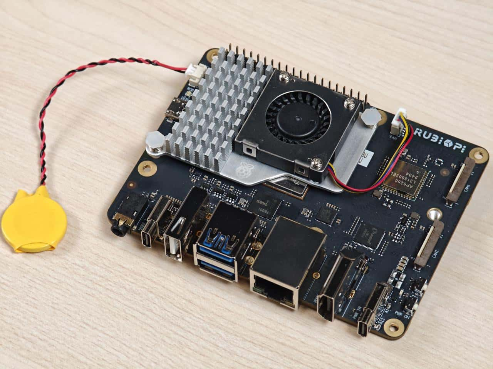

在魔方派 3 中将系统时间写入系统硬件时钟方法如下：

```shell showLineNumbers
date -s "08:00:00 20241201" # 将系统时间设置为2024年12月1日8时0分
hwclock -w # 将系统时间写入系统硬件时钟
```

## 2.11 M.2 Key M 接口

M.2 Key M 接口为下图18：


M.2 Key M 接口可以接入规格为2280的固态硬盘，如下图所示：


目前 魔方派 3暂未支持固态硬盘的自动挂载，可在魔方派 3 中执行下面命令对固态硬盘手动挂载

```shell showLineNumbers
mkdir /opt/ssd
mount /dev/nvme0n1 /opt/ssd
```


