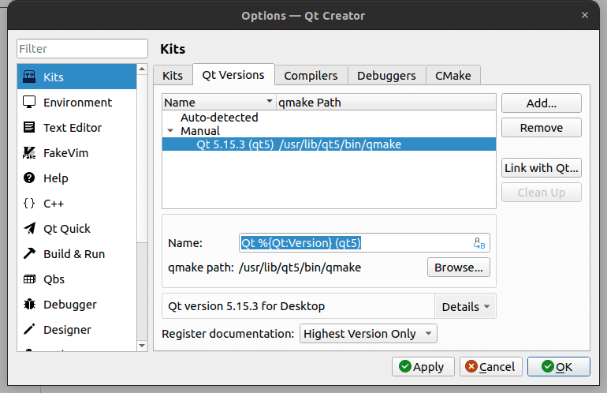
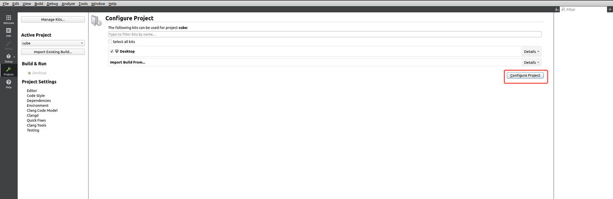
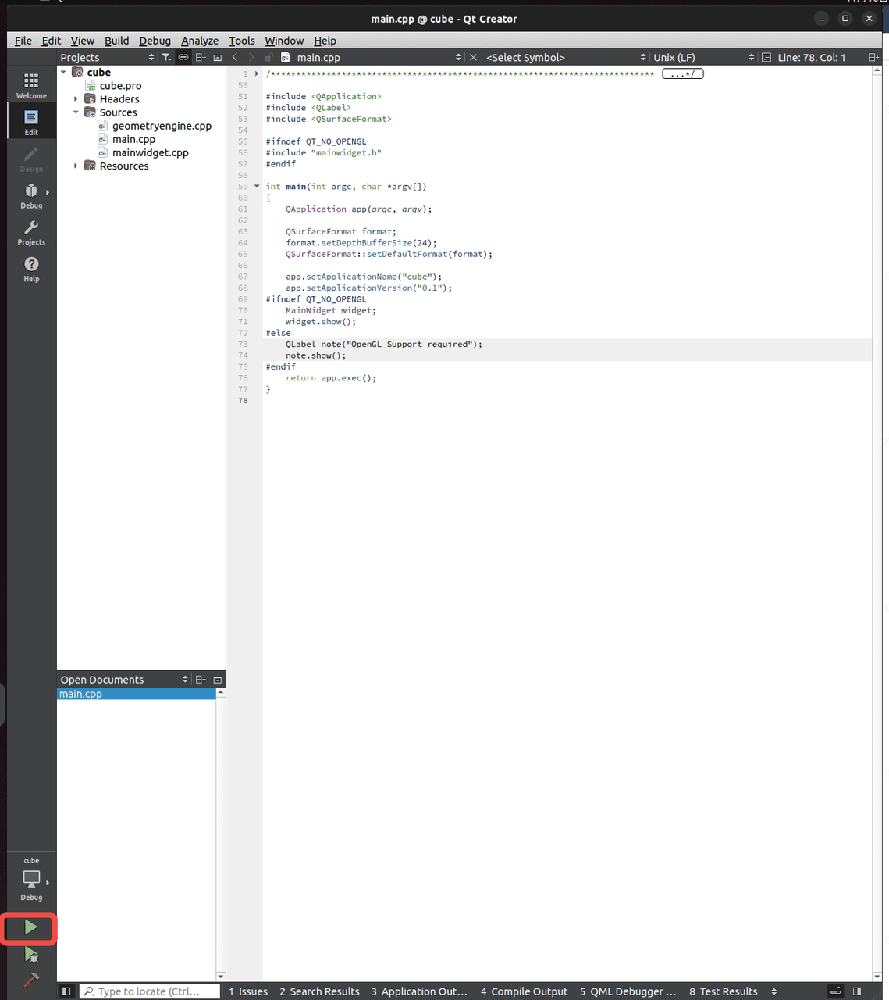
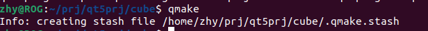
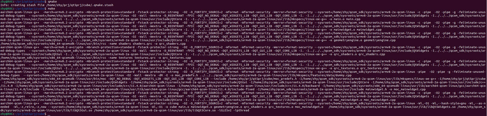
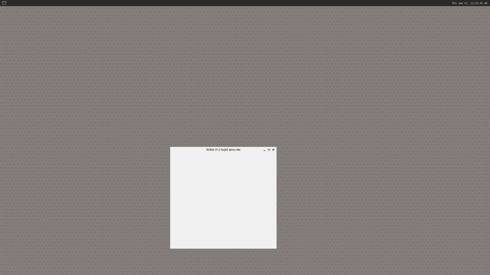

# 6. QT5 使用指南

## 6.1 安装 Qt Creator

以 Ubuntu 为例，说明安装方法:

* 安装 Build Essential 软件包

```shell showLineNumbers
sudo apt-get install build-essential
```

* 安装 Qt Creator

```shell showLineNumbers
sudo apt-get install qtcreator
```

* 安装 QT5 相关环境

```shell showLineNumbers
sudo apt-get install qtbase5-dev qtchooser qt5-qmake qtbase5-dev-tools qtbase5-examples qt5-doc qtbase5-doc-html
```

* 安装完成后显示如下应用图表


## 6.2 编译Qt程序

* 点击Qt Creator图标，进入应用。


* 点击**Tools -> Options**，在弹出的窗口中点击 **Qt Versions，点击 Add。**


* 选择 */usr/bin* 下的 *qmake*。




* 点击 **Kits**， 滑动窗口，将 Qt version 设置为 Qt5.15，点击 **OK。**


* 点击 **Examples**，在输入栏中输入 Cube， 点击**&#x20;Cube OpenGL ES 2.0 example**。


* 在弹出的窗口中，根据情况，选择 **Keep Project and Open&#x20;**&#x6216; **Copy Project and Open**。


* 点击 **Configure Project** 进入工程。



* 点击如下图标尝试运行程序。



* 运行成功， 下面进行交叉编译。


* 设置交叉编译环境，具体可参考 1.11.2 安装交叉编译工具小节：

```shell showLineNumbers
source <your toolchains directory>/environment-setup-armv8-2a-qcom-linux
```

* 进入到项目的源码目录，执行`qmke`生成*Makefile*文件：

```shell showLineNumbers
qmake
```



* 执行`make`命令行编译：



* 将编译生成物传输到 RUBIK Pi 3 中：


## 6.3 运行环境配置

一般 Qt 将根据平台选择一个默认的 QPA(Qt Platform Abstraction）插件， 也可以设置 QT\_QPA\_PLATFORM 环境变量或者 -platform 命令行参数选择不同的平台插件, 一般使用的平台插件后端有 LinuxFB、Wayland、EGLFS。

> **LinuxFB**
> 插件通过Linux的FBDEV (Framebuffer Device)驱动显示，不支持硬件渲染，显示性能可能会不好。

> **Wayland**
> 一种显示服务协议，不依赖客户端-服务器体系结构，旨在提供一个现代、 安全的的Linux和其他类Unix，取代X Window system，而Weston是Wayland开源显⽰协议的参考实现。

>**EGLFS**
> 是 Qt 自己实现的一个 GUI 系统，不支持多窗口，eglfs使用opengles/egl进行GPU渲染后，直接送给drm去显示。
> EGLFS is the recommended plugin for modern Embedded Linux devices that include a GPU。

* 使用 Wayland

```shell showLineNumbers
export XDG_RUNTIME_DIR=/dev/socket/weston
export WAYLAND_DISPLAY=wayland-1
export QT_QPA_PLATFORM='wayland'
cd /opt
./cube 
```


## 6.4 PyQt5

RUBIK Pi 3 支持 PyQt5，如下是一个 PyQt5 的 Demo

```python showLineNumbers
import sys
from PyQt5.QtWidgets import QApplication, QWidget

app = QApplication(sys.argv)

w = QWidget()
w.resize(550, 500)
w.move(600, 300)
w.setWindowTitle('RUBIK Pi 3 PyQt5 demo title')
w.show()
sys.exit(app.exec_())
```

将*pyqt5.py*传输到板子中，如果使用 ADB 进行传输，命令如下

```python showLineNumbers
adb push pyqt5.py /opt
```

使用如下命令运行demo程序，执行结果如下图所示

```shell showLineNumbers
export XDG_RUNTIME_DIR=/dev/socket/weston
export WAYLAND_DISPLAY=wayland-1
export QT_QPA_PLATFORM='wayland'
cd /opt
python3 pyqt5.py
```

