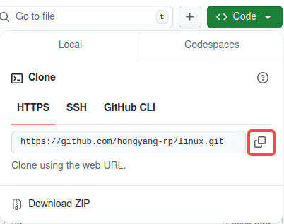
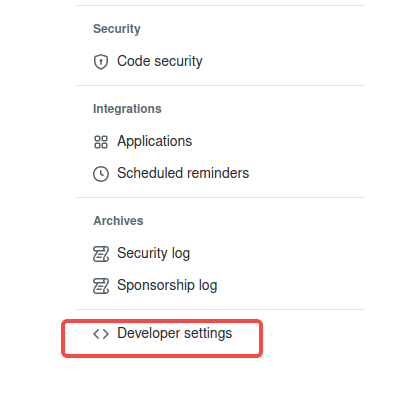
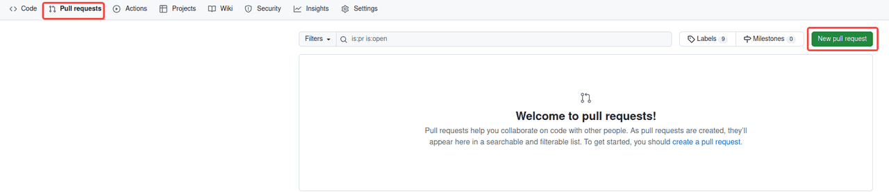
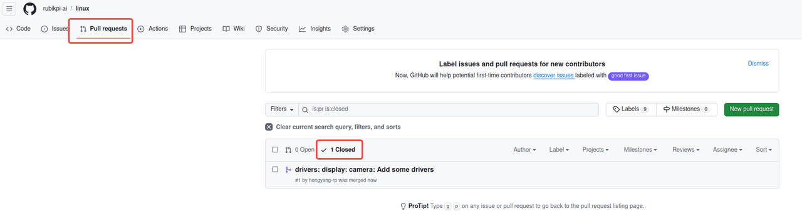
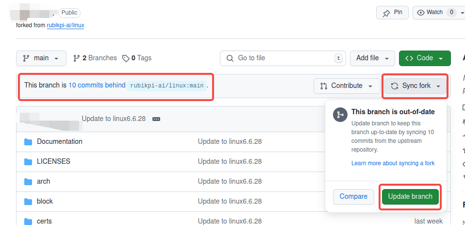
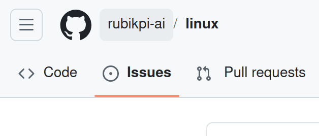
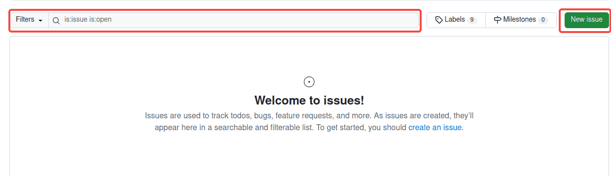

# 8. Github操作指南

## 8.1 向 RUBIK Pi 3 提交代码

可以通过提交 Pull Requset 像 RUBIK Pi 3 提交代码，经过审核后，您的代码有可能合入 RUBIK Pi 3 的主线，下面是向 RUBIK Pi 3 linux 主线分支提交 PR 的一种方式：

* 登录Github，访问RUBIK Pi 3仓库 https://github.com/rubikpi-ai/linux

* 点击 **fork** 按钮，按提示将仓库 fork 到自己仓库下。


* 将 fork 的仓库使用 git clone 命令克隆到本地。



:::tip
需使用自己仓库的网址
:::

```shell showLineNumbers
git clone https://github.com/hongyang-rp/linux.git
```

* 进入仓库，本地创建新分支 rpdev，在新分支下进行开发：

```shell showLineNumbers
cd linux 
git checkout -b rpdev
```


* 修改并提交代码：

```shell showLineNumbers
git add .   
git commit -s
```

* 使用 git push 命令将本地的分支推送到 GitHub 上 fork 仓库上：

```shell showLineNumbers
git push --set-upstream origin rpdev
```

* 若提交时出现下面报错，则需要使用个人令牌：


个人令牌获得方法：

1.点击 Github 个人头像，选择 **Settings。**


2.点击右侧&#x7684;**&#x20;Developer settings。**



3.选择**Personal access tokens**，点击**Tokens (classic)。**


4.点击**&#x20;Generate new token。**


5.配置token，设置一个名字，选择过期时间。


建议将全部内容都勾选，勾选后点击 **Generate token。**

6. 产生密钥，得到下面位置的token内容，保存起来避免遗忘。


7.执行 `git remote set-url` 命令，配置token。

```shell showLineNumbers
git remote set-url origin  https://<your_token>@github.com/<USERNAME>/<REPO>.git
```

\<your\_token> 换成得到的令牌;

\<USERNAME> 换成github的用户名称；

\<REPO> 换成仓库名称

然后再次执行 git push 操作，执行成功

* 浏览器访问GitHub上fork的仓库，会有如下提示，点击并按照提示创建PR。


或选择 Pull requests后点击New pull request创建PR



* 等待管理员对PR进行查看和回复，最后合入主分支，合入主分支的PR可点击Closed查看。



:::warning
若fork的仓库出现如下提示，则需要点击 **Sync fork->Update brach** 对github仓库进行更新，更新成功后可在本地仓库中执行 `git pull` 命令同步更新。
:::



## 8.2 创建 Issue

如开发过程中遇到问题、发现BUG、对RUBIK Pi 3的意见、想要的功能等，以创建 Issue 的方式提出。

* 登录Github，访问RUBIK Pi 3仓库，如 https://github.com/rubikpi-ai/linux。

* 点击左上角 **Issues**。



* 创建Issue时可以先进行搜索确定是否有人已经提出类似的Issue；点击 **New issue** 并按照提示创建。



* 创建完成后，请等待社区回复。
