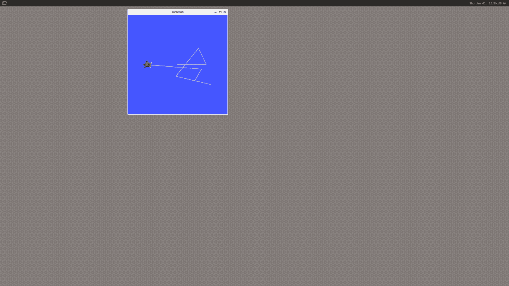

# 9. ROS 使用指南

* 魔方派 3 已经集成了 ROS2 humble 环境，测试前请先复制如下内容，粘贴到 魔方派 3 的终端中进行设置:

```shell showLineNumbers
export AMENT_PREFIX_PATH="/usr"
export DBUS_SESSION_BUS_ADDRESS="unix:path=/run/user/0/bus"
export EDITOR="vi"
export HOME="/home/root"
export HUSHLOGIN="FALSE"
export LANG="C"
export LD_LIBRARY_PATH="/usr/lib"
export LOGNAME="root"
export MAIL="/var/spool/mail/root"
export MOTD_SHOWN="pam"
export OLDPWD
export OPIEDIR
export PATH="/usr/local/bin:/usr/bin:/bin:/usr/local/sbin:/usr/sbin:/sbin"
export PS1="\\u@\\h:\\w\\\$ "
export PWD="/home/root"
export PYTHONPATH="/usr/lib/python3.10/site-packages"
export QPEDIR
export QTDIR
export QT_QPA_PLATFORM="wayland"
export ROS_DISTRO="humble"
export ROS_LOCALHOST_ONLY="0"
export ROS_PYTHON_VERSION="3"
export ROS_VERSION="2"
export SHELL="/bin/sh"
export SHLVL="1"
export TERM="linux"
export USER="root"
export WAYLAND_DISPLAY="wayland-1"
export XDG_RUNTIME_DIR="/dev/socket/weston"
export XDG_SESSION_CLASS="user"
export XDG_SESSION_ID="c1"
export XDG_SESSION_TYPE="tty"
```
:::tip
每个终端都要对环境变量进行设置。
:::

* 运行 `turtlesim`

1.将 魔方派 3 连接屏幕。

2.终端一：

```shell showLineNumbers
ros2 run turtlesim turtlesim_node
```

3.终端二：

```shell showLineNumbers
ros2 run turtlesim turtle_teleop_key
```

按下键盘上的方向按键控制小乌龟运动：

