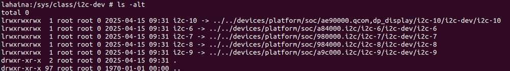
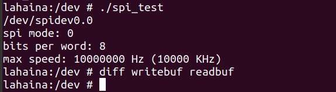

---
# Display h2 to h5 headings
toc_min_heading_level: 2
toc_max_heading_level: 4
---

# 外设与接口

## 硬件资源图


| 序号 | 接口                      | 序号 | 接口                |
|------|---------------------------|------|---------------------|
| 1    | RTC 电池接口              | 10   | 电源 Type-C 接口    |
| 2    | Micro USB (UART 调试)     | 11   | PWR 按键            |
| 3    | TurboX C6490P SOM         | 12   | EDL 按键            |
| 4    | 3.5mm 耳机接口            | 13   | 摄像头接口 2        |
| 5    | USB Type-C with DP (USB 3.1) | 14 | 摄像头接口 1        |
| 6    | USB Type-A (USB 2.0)      | 15   | Wi-Fi/蓝牙模块      |
| 7    | 2 x USB Type-A (USB 3.0)  | 16   | 风扇接口            |
| 8    | 1000M 以太网              | 17   | 40-pin 连接器       |
| 9    | HDMI OUT                  | 18   | M.2 Key M 接口      |

## 40 pin 连接器

### GPIO

#### 引脚分布

下图是 RUBIK Pi 3 40-pin 连接器的引脚默认功能，其中大部分引脚和开源开发板的40-pin连接器引脚的默认功能兼容。


下表是 40-pin连接器支持的所有功能，图中蓝色字体表明默认功能。


#### 使用 shell 命令控制

在 RUBIK Pi 3 中执行下面的步骤控制 GPIO。

GPIO 引脚通过 */sys/class/gpio* 目录进行管理。运行`ls -alt`命令可查看当前目录引脚信息。


GPIO 引脚并非随意分布，而是被组织成多个 GPIO Chip（引脚组），每个 Chip 管理一组连续的引脚，并有唯一的编号。例如上图中，gpiochip336 基地址为 336，管理从引脚 336 开始的引脚。

gpiochip336 由主控制器（pinctrl 控制器）管理，pinctrl 负责配置引脚功能（如 GPIO、SPI 等），适用于通用引脚，而其他 GPIO Chip 则由专用控制器管理，负责特定任务的引脚。

如果想要引用该组中的某个 GPIO 引脚，需要使用基地址加上偏移量（下表中的引脚编号）。


以控制 12 号引脚 GPIO\_101 为例，需进行如下操作：

* 进入 */sys/class/gpio&#x20;*&#x76EE;录：

  ```shell
  cd /sys/class/gpio
  ```

* 导出要控制的 GPIO。gpio336 基地址 336 + 偏移量 12（即引脚编号）= 348，运行以下命令：

  ```shell
  echo 348 > export
  ```

* 进入到 *gpio348* 目录设置 GPIO 属性：

  ```shell
  cd gpio 348
  ls -alt
  ```


* direction（方向）：

  * 输入：in

  * 输出：out

* value（值）：

  * 低电平：0

  * 高电平：1

* edge （中断边沿）：

  * 上升沿触发：rising

  * 下降沿触发：falling

  * 双边沿触发：both

  * 禁用中断：none

如设置 12 号引脚输出高电平：

```
echo out > direction
echo 1 > value
```

取消导出 12 号引脚到用户空间：

```
echo 348 > unexport
```


### I2C

I2C 是飞利浦公司在 20 世纪 80 年代开发的一种双向 2 线制总线，用于实现高效的 IC 间控制总线。总线上的每个设备都有其唯一的地址（由飞利浦公司领导的 I2C 总机构注册）。I2C 核心支持多控制器模式，以及 10 位目标地址和 10 位可扩展地址。关于 I2C 的更多信息，请参阅 https://www.i2c-bus.org/fileadmin/ftp/i2c_bus_specification_1995.pdf。

#### 引脚分布

下图是 RUBIK Pi 3 40-pin 连接器的引脚默认功能，其中大部分引脚和开源开发板的40-pin连接器引脚的默认功能兼容。


:::note
>
> 3 号引脚和 5 号引脚默认已设置配为 I2C1。
:::

下表是 40-pin 连接器支持的所有功能，图中蓝色字体表明默认功能。


#### 使用 shell 命令测试

在 RUBIK Pi 3 中执行下面步骤控制 I2C 总线。

* 找到要测试的 I2C 设备

  ```shell
  cd /sys/class/i2c-dev/
  ls -alt
  ```



* 使用 i2cdetect 工具，以下操作以i2c-8为例。

  * 查看 I2C8 接口上的设备：

    ```shell
    i2cdetect -a -y -r 8
    ```

    * 每个后缀的含义

      `-a`：扫描所有可能的 I2C 地址。

      `-y`：跳过交互式确认。

      `-r`：使用 SMBus 的 `receive byte` 命令进行检测。

      `8`：指定要扫描的 I2C 总线号。

  

  这里的 UU 代表内核中已经有了I2C8这个驱动，可以进行通信，表示成功使能。

### SPI

串行外设接口 (SPI) 是在全双工模式下工作的同步串行数据链路。SPI 又称为 4 线制串行总线。

#### 引脚分布

下图是 RUBIK Pi 3 40-pin 连接器的引脚默认功能，其中大部分引脚和开源开发板的40-pin连接器引脚的默认功能兼容。


:::note
>
> 19 号、21 号、23 号、24 号引脚默认已设置配为 SPI。
:::

下表是 40-pin 连接器支持的所有功能，图中蓝色字体表明默认功能。


#### 使用 C 语言程序 SPI 通信

* 以下代码示例，代码使用 SPI 总线进行数据收发通信：

  ```c
  #include <stdint.h>
  #include <unistd.h>
  #include <stdio.h>
  #include <stdlib.h>
  #include <getopt.h>
  #include <fcntl.h>
  #include <sys/ioctl.h>
  #include <linux/types.h>
  #include <linux/spi/spidev.h>
  #include <sys/time.h>
  #include <signal.h>
  #include <string.h>

  #define ARRAY_SIZE(a) (sizeof(a) / sizeof((a)[0]))

  static void pabort(const char *s)
  {
      perror(s);
      abort();
  }

  static const char *device = "/dev/spidev0.0"; /*spi controller device file*/
  static uint8_t mode;
  static uint8_t bits = 8;
  static uint32_t speed = 10000000; //5242880hz-->655360B/s-->5mbps
  static uint16_t delay;

  int flag = 1;

  void prompt_info(int signo)
  {
          flag = 0;
  }

  void init_sigaction(void)
  {
          struct sigaction tact;

          tact.sa_handler = prompt_info;
          tact.sa_flags = 0;

          sigemptyset(&tact.sa_mask);

          sigaction(SIGALRM, &tact, NULL);
  }

  void init_time()
  {
          struct itimerval value;

          value.it_value.tv_sec = 5; // Transmission time
          value.it_value.tv_usec = 0;

          value.it_interval = value.it_value;

          setitimer(ITIMER_REAL, &value, NULL);
  }

  static void transfer(int fd)
  {
      int ret;
      uint8_t temp[] = {
          'a', 'a', 'a', 'a', 'a', 'a',
          'n', 'o', 'p', 'q', 'r', 's',
          'a', 'a', 'a', 'a', 'a', 'a',
          'a', 'a', 'a', 'a', 'a', 'a',
          'a', 'a', 'a', 'a', 'a', 'a',
          'b', 'c', 'd', 'e', 'f', 'g',
          'b', 'c', 'd', 'e', 'f', 'g',
          'b', 'c', 'd', 'e', 'f', 'g',
          't', 'u',
          'a', 'a', 'a', 'a', 'a', 'a',
          'h', 'i', 'j', 'k', 'l', 'm',
          'a', 'a', 'a', 'a', 'a', 'a',
          'a', 'a', 'a', 'a', 'a', 'a',
          'a', 'a', 'a', 'a', 'a', 'a',
          'b', 'c', 'd', 'e', 'f', 'g',
          'b', 'c', 'd', 'e', 'f', 'g',
          'b', 'c', 'd', 'e', 'f', 'g',
          'v', 'w',
      };
      uint8_t tx[ARRAY_SIZE(temp)] = {0, }; //Array of data to be sent
      memcpy(tx, temp, ARRAY_SIZE(tx));
      uint8_t rx[ARRAY_SIZE(tx)] = {0, }; //Received data array
      struct spi_ioc_transfer tr = {
          .tx_buf = (unsigned long)tx,
          .rx_buf = (unsigned long)rx,
          .len = ARRAY_SIZE(tx),
          .delay_usecs = delay,
          .speed_hz = speed,
          .bits_per_word = bits,
      };

      unsigned long size = 0;
          init_sigaction();
          init_time();
      FILE *file_write = NULL, *file_read = NULL;
      file_write = fopen("writebuf","w+");
      file_read = fopen("readbuf","w+");
          while (flag)
          {
          ret = ioctl(fd, SPI_IOC_MESSAGE(1), tr);   //ioctl default operation, transfer data
          if (ret < 1)
              pabort("can't send spi message");
                  size++;
          fwrite(tx, 1, 100, file_write);
          fwrite(rx, 1, 100, file_read);
          memcpy(tx, temp, ARRAY_SIZE(tx));
          memset(rx, 0x00, ARRAY_SIZE(tx));
          }
      fclose(file_write);
      fclose(file_read);
  }

  static void print_usage(const char *prog)   //If the parameter is wrong, print the help information
  {
      printf("Usage: %s [-DsbdlHOLC3]\n", prog);
      puts("  -D --device   device to use (default /dev/spidev3.0)\n"
           "  -s --speed    max speed (Hz)\n"
           "  -d --delay    delay (usec)\n"
           "  -b --bpw      bits per word \n"
           "  -l --loop     loopback\n"
           "  -H --cpha     clock phase\n"
           "  -O --cpol     clock polarity\n"
           "  -L --lsb      least significant bit first\n"
           "  -C --cs-high  chip select active high\n"
           "  -3 --3wire    SI/SO signals shared\n");
      exit(1);
  }

  static void parse_opts(int argc, char *argv[])
  {
      while (1) {
          static const struct option lopts[] = {  //Parameter command table
              { "device",  1, 0, 'D' },
              { "speed",   1, 0, 's' },
              { "delay",   1, 0, 'd' },
              { "bpw",     1, 0, 'b' },
              { "loop",    0, 0, 'l' },
              { "cpha",    0, 0, 'H' },
              { "cpol",    0, 0, 'O' },
              { "lsb",     0, 0, 'L' },
              { "cs-high", 0, 0, 'C' },
              { "3wire",   0, 0, '3' },
              { "no-cs",   0, 0, 'N' },
              { "ready",   0, 0, 'R' },
              { NULL, 0, 0, 0 },
          };
          int c;
          c = getopt_long(argc, argv, "D:s:d:b:lHOLC3NR", lopts, NULL);

          if (c == -1)
              break;

          switch (c) {
          case 'D':
              device = optarg;
              break;
          case 's':
              speed = atoi(optarg);
              break;
          case 'd':
              delay = atoi(optarg);
              break;
          case 'b':
              bits = atoi(optarg);
              break;
          case 'l':
              mode |= SPI_LOOP;
              break;
          case 'H':
              mode |= SPI_CPHA;
              break;
          case 'O':
              mode |= SPI_CPOL;
              break;
          case 'L':
              mode |= SPI_LSB_FIRST;
              break;
          case 'C':
              mode |= SPI_CS_HIGH;
              break;
          case '3':
              mode |= SPI_3WIRE;
              break;
          case 'N':
              mode |= SPI_NO_CS;
              break;
          case 'R':
              mode |= SPI_READY;
              break;
          default:
              print_usage(argv[0]);
              break;
          }
      }
  }

  int main(int argc, char *argv[])
  {
      int ret = 0;
      int fd;

      parse_opts(argc, argv);
      fd = open(device, O_RDWR);
      puts(device);
      if (fd < 0)
          pabort("can't open device");

      /*
       * spi mode 
       */
      ret = ioctl(fd, SPI_IOC_WR_MODE, &mode);
      if (ret == -1)
          pabort("can't set spi mode");

      ret = ioctl(fd, SPI_IOC_RD_MODE, &mode);
      if (ret == -1)
          pabort("can't get spi mode");

      /*
       * bits per word 
       */
      ret = ioctl(fd, SPI_IOC_WR_BITS_PER_WORD, &bits);
      if (ret == -1)
          pabort("can't set bits per word");

      ret = ioctl(fd, SPI_IOC_RD_BITS_PER_WORD, &bits);
      if (ret == -1)
          pabort("can't get bits per word");

      /*
       * max speed hz
       */
      ret = ioctl(fd, SPI_IOC_WR_MAX_SPEED_HZ, &speed);
      if (ret == -1)
          pabort("can't set max speed hz");
         
      ret = ioctl(fd, SPI_IOC_RD_MAX_SPEED_HZ, &speed);
      if (ret == -1)
          pabort("can't get max speed hz");

      printf("spi mode: %d\n", mode);
      printf("bits per word: %d\n", bits);
      printf("max speed: %d Hz (%d KHz)\n", speed, speed/1000);
      transfer(fd);
      close(fd);
      return ret;
  }
  ```

* 编译程序：

  * 交叉编译

    ```shell
    aarch64-linux-gnu-gcc {filename} -o {输出filename} -static
    ```

  * 使用的交叉编译，需要将 spi 传输到 RUBIK Pi 3 中，如果使用 ADB 传输，命令如下：

    ```shell
    adb push spi /dev
    ```

* 将 19 号引脚和 21 号引脚使用杜邦线短接，验证 SPI 总线通信，如下图所示：

  

  1. **设备检查（确认 SPI 设备存在）​​**

     1. 进入设备终端：

     ```bash
     adb shell
     ```
     2. 切换到 root 权限：

     ```bash
     su
     ```

     3. 进入 /dev 目录并检查 SPI 设备文件：
     ```
     cd /dev
     ls | grep spidev
     ```

  预期结果：

  存在类似 spidev0.0 的设备节点（名称可能略有差异）。

  2. **测试文件推送与执行**

     1. 另开终端，推送测试程序：

     ```bash
     adb push spi_test /dev
     ```
     2. 回到设备终端，确认文件传输成功：

     ```bash
     ls
     ```

     应看到新文件 spi\_test（与 spidev0.0 区分）。


     3. 赋予 spi_test 执行权限并运行测试：
     ```bash
     chmod 777 spi_test
     ./spi_test
     ```

  预期结果：

  生成 writebuf（发送数据）和 readbuf（接收数据）文件。

  3. **验证数据传输**

    对比两个文件内容：

  ```bash
  diff writebuf readbuf
  ```

  预期结果：

  无输出（文件完全一致），表示 SPI 传输成功且无丢包。

  

### UART

#### 引脚分布

下图是 RUBIK Pi 3 40-pin 连接器的引脚默认功能，其中大部分引脚和开源开发板的40-pin连接器引脚的默认功能兼容。


:::note
>
> 8 号和 10 号引脚默认已设置配为 UART，设备节点为 */dev/ttyHS3*。
:::

下表是 40-pin 连接器支持的所有功能，图中蓝色字体表明默认功能。


#### 使用 C 语言程序 UART 通信

* 以下代码示例，使用 UART 进行数据收发通信：

  ```c
  #include <stdio.h>
  #include <stdlib.h>
  #include <unistd.h>
  #include <sys/types.h>
  #include <sys/stat.h>
  #include <fcntl.h>
  #include <termios.h>
  #include <errno.h>
  #include <pthread.h>
  #include <signal.h>
  #include <sys/ioctl.h>
  #include <getopt.h>
  #include <string.h>

  #define ARRAY_SIZE(a) (sizeof(a) / sizeof((a)[0]))
  #define MAX_SIZE 1024

  static int bps_speed = 115200;
  static const char *device = "/dev/ttyHS1";
  static int data_bits = 8;
  static int stop_bits = 1;
  static int g_parity = 'N';
  static char *type = "read";

  static void pabort(const char *s)
  {
      perror(s);
      abort();
  }

  int speed_arr[] = {B1152000, B1000000, B921600, B576000, B500000, B460800, B230400, B115200, B57600, B38400, B19200, B9600, B4800, B2400, B1200, B300};
  int name_arr[] = {  1152000,  1000000,  921600,  576000,  500000,  460800,  230400,  115200,  57600,  38400,  19200,  9600,  4800,  2400,  1200,  300};

  // 设置波特率
  void set_speed(int fd, int speed)
  {
      int i;
      int status;
      struct termios Opt;
      tcgetattr(fd, &Opt);

      for (i = 0; i < ARRAY_SIZE(speed_arr); i++)
      {
          if (speed == name_arr[i])
          {
              // 缓冲区里的数据都废弃
              tcflush(fd, TCIOFLUSH);

              /* 设置串口的波特率 */
              cfsetispeed(&Opt, speed_arr[i]);
              cfsetospeed(&Opt, speed_arr[i]);
              status = tcsetattr(fd, TCSANOW, &Opt);
              if (status != 0)
                  pabort("tcsetattr fd");
              return;
          }

          tcflush(fd, TCIOFLUSH);
      }
      pabort("error speed!");
  }

  int set_Parity(int fd, int databits, int stopbits, int parity)
  {
      char cmd_fileclear[40] = {0};
      // sprintf(cmd_fileclear, ": > %s", device);
      // system(cmd_fileclear);
      // memset(cmd_fileclear, 0, ARRAY_SIZE(cmd_fileclear));
      sprintf(cmd_fileclear, "stty -F %s -echo", device);
      system(cmd_fileclear);
      memset(cmd_fileclear, 0, ARRAY_SIZE(cmd_fileclear));
      // printf("%s\n", cmd_fileclear);

      struct termios options;

      if (tcgetattr(fd, &options) != 0)
      {
          pabort("SetupSerial 1");
      }

      options.c_cflag &= ~CSIZE;

      switch (databits) /*设置数据位数*/
      {
      case 7:
          options.c_cflag |= CS7;
          break;
      case 8:
          options.c_cflag |= CS8;
          break;
      default:
          pabort("Unsupported data sizen");
      }

      switch (parity)
      {
      case 'n':
      case 'N':
          options.c_cflag &= ~PARENB; /* Clear parity enable */
          options.c_iflag &= ~INPCK;  /* Enable parity checking */
          break;
      case 'o':
      case 'O':
          options.c_cflag |= (PARODD | PARENB); /* 设置为奇效验*/
          options.c_iflag |= INPCK;             /* Disnable parity checking */
          break;
      case 'e':
      case 'E':
          options.c_cflag |= PARENB;  /* Enable parity */
          options.c_cflag &= ~PARODD; /* 转换为偶效验*/
          options.c_iflag |= INPCK;   /* Disnable parity checking */
          break;
      case 'S':
      case 's': /*as no parity*/
          options.c_cflag &= ~PARENB;
          options.c_cflag &= ~CSTOPB;
          break;
      default:
          pabort("Unsupported parityn");
      }

      switch (stopbits)
      {
      case 1:
          options.c_cflag &= ~CSTOPB;
          break;
      case 2:
          options.c_cflag |= CSTOPB;
          break;
      default:
          pabort("Unsupported stop bits");
      }

      /* Set input parity option */
      if (parity != 'n' && parity != 'N')
          options.c_iflag |= INPCK;

      options.c_cc[VTIME] = 150; // 15 seconds
      options.c_cc[VMIN] = 0;

      tcflush(fd, TCIFLUSH); /* Update the options and do it NOW */
      if (tcsetattr(fd, TCSANOW, &options) != 0)
      {
          pabort("SetupSerial 3");
      }
      return 0;
  }

  static void print_usage(const char *prog) //If the parameter is wrong, print the help information
  {
      printf("Usage: %s [-DsbdlHOLC3t]\n", prog);
      puts("  -D --device     device to use (default /dev/ttyHS3)\n"
           "  -S --speed      bps\n"
           "  -d --databits   \n"
           "  -s --stopbits   \n"
           "  -p --parity     \n"
           "  -T --type       read or write\n");
      exit(1);
  }

  static void parse_opts(int argc, char *argv[])
  {
      while (1)
      {
          static const struct option lopts[] = {
              //Parameter command table
              {"device",   1, 0, 'D'},
              {"speed",    1, 0, 'S'},
              {"databits", 1, 0, 'd'},
              {"stopbits", 1, 0, 's'},
              {"parity",   1, 0, 'p'},
              {"type",     1, 0, 'T'},
              {NULL, 0, 0, 0},
          };
          int c;
          c = getopt_long(argc, argv, "D:S:d:s:p:T:", lopts, NULL);

          if (c == -1)
              break;

          switch (c)
          {
          case 'D':
              device = optarg;
              break;
          case 'S':
              bps_speed = atoi(optarg);
              break;
          case 'd':
              data_bits = atoi(optarg);
              break;
          case 's':
              stop_bits = atoi(optarg);
              break;
          case 'p':
              g_parity = atoi(optarg);
              break;
          case 'T':
              type = optarg;
              break;
          default:
              print_usage(argv[0]);
              break;
          }
      }
  }

  int main(int argc, char *argv[])
  {
      int ret = 0;
      int fd;
      char string1[] = "hello_world\n";
      char string2[] = "hello_world_abcdefghijklmnopqrstuvwxyz_abcdefghijklmnopqrstuvwxyz_abcdefghijklmnopqrstuvwxyz_abcdefghijklmnopqrstuvwxyz_abcdefghijklmnopqrstuvwxyz_abcdefghijklmnopqrstuvwxyz\n";
      char *string = string2;

      parse_opts(argc, argv);

      puts(device);
      fd = open(device, O_RDWR);
      if (fd < 0)
          pabort("can't open device");

      // 设置波特率
      set_speed(fd, bps_speed);
      set_Parity(fd, data_bits, stop_bits, g_parity);
      close(fd);
      fd = open(device, O_RDWR);

      int nread = 0,nwrite = 0;
      char buff[MAX_SIZE] = {0};
      int num = 0;
      char send_msg[200] = {0};

      printf("%d %d-%d-%c\n", bps_speed, data_bits, stop_bits, g_parity);
      printf("type:%s\n", strcmp(type, "read") == 0 ? "read" : "write");

      
      memset(send_msg, 0, ARRAY_SIZE(send_msg));
      
      FILE *read_file;

      while (1)
      {
          if (strcmp(type, "read") == 0)
          {

              // tcflush(fd, TCIOFLUSH);
              nread = read(fd, buff, MAX_SIZE - 2);
              if (nread > 1)
              {
                  printf("(Len %d):", nread);
                  buff[nread] = '\n';
                  buff[nread + 1] = '\0';
                  printf("read %s", buff);
                  if (nread < strlen(string))
                  {
                      read_file = fopen("read_file","aw+");
                      fwrite(buff, strlen(buff), 1, read_file);
                      fclose(read_file);
                  }
                  memset(buff, 0, ARRAY_SIZE(buff));
                  num++;
              }
              nread = 0;

          }
          else
          {
              
              sprintf(send_msg, "%d%s", num, string);
              nwrite = write(fd, send_msg, strlen(send_msg));
              printf("Send test data---%d---%s\n", nwrite, send_msg);
              num++;
              sleep(1);
          }

      }

      close(fd);

      return ret;
  }
  ```

* 编译程序：

  * 交叉编译

    ```shell
    aarch64-linux-gnu-gcc {filename} -o {输出filename} -static
    ```

  * 使用交叉编译，需要将编译出的产物 *uart&#x20;*&#x4F20;输到 RUBIK Pi 3 中，如果使用 ADB 传输，命令如下：

    ```shell
    adb push uart /opt
    ```

* 将 8 号引脚和 10 号引脚使用杜邦线短接，验证串口通信，如下图所示

  

  1. **测试读功能（接收数据）​​**

     1. 赋权并启动监听终端

     ```bash
     chmod 777 uart_test
     ./uart -D /dev/ttyHS1
     ```
    
     2. 另开终端发送数据

     ```bash
     ./uart -D /dev/ttyHS1 -T write
     ```

     3. 另开终端 B 监听数据

     ```
     ./uart -D /dev/ttyHS1
     ```


  验证：​​

  第一个终端会显示发送的数据，确认数据接收正常。


  2. **测试写功能（发送数据）​​**

     1. 在终端 A 发送数据

      ```bash
      ./uart -D /dev/ttyHS1 -T write
      ```
     2. 另开终端 B 监听数据

      ```bash
      ./uart -D /dev/ttyHS1
      ```

  验证：​​

  终端 B 会显示终端 A 发送的数据，确认数据发送正常。


## USB

RUBIK Pi 3 拥有 4 个 USB 口：

* 两个 USB 3.0 口，只能作为主机模式使用，如下图 7。

* 一个 USB 2.0 口，可以作为主机或设备模式使用，如下图 6。

* 一个 USB 3.1 Gen 1 口，可以作为主机或设备模式，以及 DP 显示使用，如下图 5。


### USB 2.0 Type-A 接口

本小节介绍如何通过 USB 2.0 Type-A接口，将 RUBIK Pi 3 配置为 USB 大容量设备（即模拟成 U 盘），来验证安卓 13 设备的 USB Gadget 功能。

:::warning
>
> **权限限制**：ADB shell 权限不足以配置 USB Gadget，需使用串口控制台执行所有操作。
:::

请使用 USB 数据线将设备与主机 PC 连接，然后进行以下步骤：

#### 设备模式验证

按以下步骤将设备配置为 USB 大容量存储设备：

1. 进入串口控制台：

2. 配置 USB Gadget：

   * 进入 USB Gadget 配置目录：

   ```bash
   cd /config/usb_gadget/g2
   ```

   * 创建大容量存储功能：

   ```bash
   mkdir functions/mass_storage.0
   ```

   * 在`/sdcard`创建 2GB ISO 文件：

   ```bash
   dd if=/dev/zero of=/sdcard/test.iso bs=1M count=2048
   mkfs.ext4 /sdcard/test.iso
   ```

   :::warning
   
    **ISO 文件位置**：
   
     ISO 文件**必须**创建在`/sdcard`目录下。其他目录会导致文件访问错误。
   
     **错误示例**（在非`/sdcard`目录创建）：
   
    * Ubuntu dmesg 日志显示多次读取错误：
    
    [881331.266781] sd 5:0:0:0: [sdd] tag#0 FAILED Result: hostbyte=DID_OK driverbyte=DRIVER_SENSE
    [881331.266782] sd 5:0:0:0: [sdd] tag#0 Sense Key : Medium Error [current]
    [881331.266783] sd 5:0:0:0: [sdd] tag#0 Add. Sense: Unrecovered read error
    [881331.287885] sdd: unable to read partition table
   
    * **原因**：USB Gadget 框架无法从非`/sdcard`目录读取 ISO 文件，可能是文件系统权限或 SELinux 限制。
   
    * **解决方法**：始终使用`/sdcard/test.iso`创建 ISO 文件。
   :::

   * 将 ISO 文件关联到大容量存储功能：

   ```bash
   echo "/sdcard/test.iso" > functions/mass_storage.0/lun.0/file
   ```

   * 通过创建符号链接，将 `mass_storage.0` 功能绑定到配置 `b.1` 中。当该配置被激活时，设备会通过 USB 向主机提供大容量存储服务。

   ```bash
   ln -s functions/mass_storage.0/ configs/b.1/f1
   ```

   * 启用 USB 设备控制器（UDC）：

   ```bash
   echo 8c00000.dwc3 > UDC
   ```

3. **切换到外设模式**：

   * 设置 USB 模式为外设：

   ```bash
   echo peripheral > /sys/devices/platform/soc/8c00000.hsusb/mode
   ```

4. **在主机 PC 上验证**：

   * 在主机 PC 上运行 `lsusb`命令， 确认设备已正确连接：

   * 预期输出：设备显示为`idVendor=0000`, `idProduct=0000`, `Manufacturer=QUALCOMM`, `Product=YUPIKP-IOT-IDP _SN:9F034665`。

   * 运行 `dmesg`命令，验证设备信息。预期输出如下：

     ```plain&#x20;text
     [881331.241987] sd 5:0:0:0: [sdd] 4194304 512-byte logical blocks: (2.15 GB/2.00 GiB)
     ```

     设备在主机 PC 上显示为 2.1 GB USB 磁盘，可访问和挂载（例如 Ubuntu 上的`/dev/sdd`）。

     :::warning
     >
     > 错误分析：
     >
     > * **症状**：主机 PC 检测到 USB 磁盘但无法读取，`dmesg` 显示`Medium Error`和`Unrecovered read error`。
     >
     > * **原因**：ISO文件创建在非`/sdcard`目录，导致 USB Gadget 框架无法访问。
     >
     > * **解决方法**：在`/sdcard`重新创建 ISO 文件并重复配置步骤。
     :::

#### 切换到主机模式

1. 从设备上拔下 USB 线。

2. 运行以下命令，设置 USB 控制器为主机模式：

   ```bash
   echo host > /sys/devices/platform/soc/8c00000.hsusb/mode
   ```

3. **验证**：

   * 将 USB 设备（例如 U 盘）连接到 USB 2.0 TypeA 端口。

   

   :::note
   >
   > USB 2.0 Type-A 端口开机默认为主机模式。请确保使用正确端口进行主机模式验证。
   :::

   * 运行以下命令，设备可检测连接到 USB Type-A 端口的外部 USB 设备（例如 U 盘）：

   ```bash
   ls /dev/sd*
   ```


### USB 3.1 Type-C 接口

Type-C 接口可自动完成主机和设备模式的切换。

* 当 Type-C 接入 PC 时自动切换为设备模式。

* 接入 OTG 线时自动切换为主机模式。

* 接入 DP 显示器时，自动输出 DP 视频信号。

### USB 调试

本节提供有关获取调试日志的各种方法的信息。调试方式有 `regdumps` 、调试 `ftraces` 、 `configfs` 节点等。在调试与进入/退出低功耗模式、SMMU 故障、无时钟访问相关的问题时，可通过上述日志查看事件和控制器状态的详细信息。

#### USB 跟踪

使用 `debugfs` 跟踪可以更加深入地了解 USB 线上发生的每一个事务。如需查看跟踪列表，可运行以下命令。

:::warning
>
> 确保已挂载 `debugfs`。
>
> 使用`mount | grep /sys/kernel/debug`检查是否已经挂载。
>
> 如果尚未挂载，可运行以下命令来挂载 `debugfs`:
>
> `mount -t debugfs none /sys/kernel/debug`
:::

```shell
ls /sys/kernel/debug/tracing/events/dwc3
```

以下是可用于验证 xHCI/gadget 协议栈/USB Type-C 连接器系统软件接口 (UCSI) 中的数据传输的跟踪。

```shell
dwc3_alloc_request  dwc3_event              dwc3_gadget_generic_cmd  enable
dwc3_complete_trb   dwc3_free_request       dwc3_gadget_giveback     filter
dwc3_ctrl_req       dwc3_gadget_ep_cmd      dwc3_prepare_trb
dwc3_ep_dequeue     dwc3_gadget_ep_disable  dwc3_readl
dwc3_ep_queue       dwc3_gadget_ep_enable   dwc3_writel
```

要列出 xHCI/主机控制器驱动程序 (HCD) 中的跟踪数据，请运行以下命令。

```shell
ls /sys/kernel/debug/tracing/events/xhci-hcd
```

以下是可用于验证 xHCI/HCD 中数据传输的跟踪。

```shell
enable                            xhci_handle_cmd_config_ep
filter                            xhci_handle_cmd_disable_slot
  xhci_add_endpoint                 xhci_handle_cmd_reset_dev
  xhci_address_ctrl_ctx             xhci_handle_cmd_reset_ep
  xhci_address_ctx                  xhci_handle_cmd_set_deq
  xhci_alloc_dev                    xhci_handle_cmd_set_deq_ep
  xhci_alloc_virt_device            xhci_handle_cmd_stop_ep
  xhci_configure_endpoint           xhci_handle_command
  xhci_configure_endpoint_ctrl_ctx  xhci_handle_event
  xhci_dbc_alloc_request            xhci_handle_port_status
  xhci_dbc_free_request             xhci_handle_transfer
  xhci_dbc_gadget_ep_queue          xhci_hub_status_data
  xhci_dbc_giveback_request         xhci_inc_deq
  xhci_dbc_handle_event             xhci_inc_enq
  xhci_dbc_handle_transfer          xhci_queue_trb
  xhci_dbc_queue_request            xhci_ring_alloc
  xhci_dbg_address                  xhci_ring_ep_doorbell
  xhci_dbg_cancel_urb               xhci_ring_expansion
  xhci_dbg_context_change           xhci_ring_free
  xhci_dbg_init                     xhci_ring_host_doorbell
  xhci_dbg_quirks                   xhci_setup_addressable_virt_device
  xhci_dbg_reset_ep                 xhci_setup_device
  xhci_dbg_ring_expansion           xhci_setup_device_slot
  xhci_discover_or_reset_device     xhci_stop_device
  xhci_free_dev                     xhci_urb_dequeue
  xhci_free_virt_device             xhci_urb_enqueue
  xhci_get_port_status              xhci_urb_giveback
  xhci_handle_cmd_addr_dev
```

请运行以下命令，以便列出 USB 视频类 (UVC) gadget 驱动程序的可用事件。

```shell
ls /sys/kernel/debug/tracing/events/gadget
```

随即显示以下输出。

```shell
enable                      usb_gadget_activate
  filter                      usb_gadget_clear_selfpowered
  usb_ep_alloc_request        usb_gadget_connect
  usb_ep_clear_halt           usb_gadget_deactivate
  usb_ep_dequeue              usb_gadget_disconnect
  usb_ep_disable              usb_gadget_frame_number
  usb_ep_enable               usb_gadget_giveback_request
  usb_ep_fifo_flush           usb_gadget_set_remote_wakeup
  usb_ep_fifo_status          usb_gadget_set_selfpowered
  usb_ep_free_request         usb_gadget_vbus_connect
  usb_ep_queue                usb_gadget_vbus_disconnect
  usb_ep_set_halt             usb_gadget_vbus_draw
  usb_ep_set_maxpacket_limit  usb_gadget_wakeup
  usb_ep_set_wedge
```

如需列出 UCSI 驱动程序中的可用事件，可运行以下命令。

```shell
ls /sys/kernel/debug/tracing/events/ucsi
```

随即显示以下输出。

```shell
enable  ucsi_connector_change  ucsi_register_port  ucsi_run_command
filter  ucsi_register_altmode  ucsi_reset_ppm
```

#### 主机 sysfs 查询

要查看总线详细信息，请运行以下命令。

```shell
lsusb
```

示例输出：

```shell
Bus 005 Device 001: ID 1d6b:0003  
Bus 003 Device 001: ID 1d6b:0003  
Bus 001 Device 001: ID 1d6b:0002  
Bus 006 Device 001: ID 1d6b:0002  
Bus 004 Device 001: ID 1d6b:0002  
Bus 007 Device 003: ID 0b95:1790  
Bus 002 Device 001: ID 1d6b:0002  
Bus 007 Device 001: ID 1d6b:0003  

```

请运行以下命令，以便列出当前目录的内容。

```shell
cd /sys/bus/usb/devices/
ls
```

示例输出：

```shell
1-0:1.0  3-0:1.0  5-0:1.0  7-0:1.0  7-3:1.0  usb2  usb4  usb6
2-0:1.0  4-0:1.0  6-0:1.0  7-3      usb1     usb3  usb5  usb7
```

要查看有关 USB 设备的详细信息，请运行以下命令。

```shell
cat /sys/kernel/debug/usb/devices
```

示例输出：

```shell
T:  Bus=01 Lev=00 Prnt=00 Port=00 Cnt=00 Dev#=  1 Spd=480  MxCh= 1
B:  Alloc=  0/800 us ( 0%), #Int=  0, #Iso=  0
D:  Ver= 2.00 Cls=09(hub  ) Sub=00 Prot=01 MxPS=64 #Cfgs=  1
P:  Vendor=1d6b ProdID=0002 Rev= 5.04
S:  Manufacturer=Linux 5.4.233-qgki-debug dummy_hcd
S:  Product=Dummy host controller
S:  SerialNumber=dummy_hcd.0
C:* #Ifs= 1 Cfg#= 1 Atr=e0 MxPwr=  0mA
I:* If#= 0 Alt= 0 #EPs= 1 Cls=09(hub  ) Sub=00 Prot=00 Driver=hub
E:  Ad=81(I) Atr=03(Int.) MxPS=   4 Ivl=256ms

T:  Bus=02 Lev=00 Prnt=00 Port=00 Cnt=00 Dev#=  1 Spd=480  MxCh= 1
B:  Alloc=  0/800 us ( 0%), #Int=  0, #Iso=  0
D:  Ver= 2.00 Cls=09(hub  ) Sub=00 Prot=01 MxPS=64 #Cfgs=  1
P:  Vendor=1d6b ProdID=0002 Rev= 5.04
S:  Manufacturer=Linux 5.4.233-qgki-debug xhci-hcd
S:  Product=xHCI Host Controller
S:  SerialNumber=xhci-hcd.2.auto
C:* #Ifs= 1 Cfg#= 1 Atr=e0 MxPwr=  0mA
I:* If#= 0 Alt= 0 #EPs= 1 Cls=09(hub  ) Sub=00 Prot=00 Driver=hub
E:  Ad=81(I) Atr=03(Int.) MxPS=   4 Ivl=256ms

T:  Bus=03 Lev=00 Prnt=00 Port=00 Cnt=00 Dev#=  1 Spd=5000 MxCh= 0
B:  Alloc=  0/800 us ( 0%), #Int=  0, #Iso=  0
D:  Ver= 3.00 Cls=09(hub  ) Sub=00 Prot=03 MxPS= 9 #Cfgs=  1
P:  Vendor=1d6b ProdID=0003 Rev= 5.04
S:  Manufacturer=Linux 5.4.233-qgki-debug xhci-hcd
S:  Product=xHCI Host Controller
S:  SerialNumber=xhci-hcd.2.auto
C:* #Ifs= 1 Cfg#= 1 Atr=e0 MxPwr=  0mA
I:* If#= 0 Alt= 0 #EPs= 1 Cls=09(hub  ) Sub=00 Prot=00 Driver=(none)
E:  Ad=81(I) Atr=03(Int.) MxPS=   4 Ivl=256ms

T:  Bus=04 Lev=00 Prnt=00 Port=00 Cnt=00 Dev#=  1 Spd=480  MxCh= 1
B:  Alloc=  0/800 us ( 0%), #Int=  0, #Iso=  0
D:  Ver= 2.00 Cls=09(hub  ) Sub=00 Prot=01 MxPS=64 #Cfgs=  1
P:  Vendor=1d6b ProdID=0002 Rev= 5.04
S:  Manufacturer=Linux 5.4.233-qgki-debug xhci-hcd
S:  Product=xHCI Host Controller
S:  SerialNumber=xhci-hcd.3.auto
C:* #Ifs= 1 Cfg#= 1 Atr=e0 MxPwr=  0mA
I:* If#= 0 Alt= 0 #EPs= 1 Cls=09(hub  ) Sub=00 Prot=00 Driver=hub
E:  Ad=81(I) Atr=03(Int.) MxPS=   4 Ivl=256ms

T:  Bus=05 Lev=00 Prnt=00 Port=00 Cnt=00 Dev#=  1 Spd=5000 MxCh= 1
B:  Alloc=  0/800 us ( 0%), #Int=  0, #Iso=  0
D:  Ver= 3.00 Cls=09(hub  ) Sub=00 Prot=03 MxPS= 9 #Cfgs=  1
P:  Vendor=1d6b ProdID=0003 Rev= 5.04
S:  Manufacturer=Linux 5.4.233-qgki-debug xhci-hcd
S:  Product=xHCI Host Controller
S:  SerialNumber=xhci-hcd.3.auto
C:* #Ifs= 1 Cfg#= 1 Atr=e0 MxPwr=  0mA
I:* If#= 0 Alt= 0 #EPs= 1 Cls=09(hub  ) Sub=00 Prot=00 Driver=hub
E:  Ad=81(I) Atr=03(Int.) MxPS=   4 Ivl=256ms

T:  Bus=06 Lev=00 Prnt=00 Port=00 Cnt=00 Dev#=  1 Spd=480  MxCh= 4
B:  Alloc=  0/800 us ( 0%), #Int=  0, #Iso=  0
D:  Ver= 2.00 Cls=09(hub  ) Sub=00 Prot=01 MxPS=64 #Cfgs=  1
P:  Vendor=1d6b ProdID=0002 Rev= 5.04
S:  Manufacturer=Linux 5.4.233-qgki-debug xhci-hcd
S:  Product=xHCI Host Controller
S:  SerialNumber=0000:01:00.0
C:* #Ifs= 1 Cfg#= 1 Atr=e0 MxPwr=  0mA
I:* If#= 0 Alt= 0 #EPs= 1 Cls=09(hub  ) Sub=00 Prot=00 Driver=hub
E:  Ad=81(I) Atr=03(Int.) MxPS=   4 Ivl=256ms

T:  Bus=07 Lev=00 Prnt=00 Port=00 Cnt=00 Dev#=  1 Spd=5000 MxCh= 4
B:  Alloc=  0/800 us ( 0%), #Int=  0, #Iso=  0
D:  Ver= 3.00 Cls=09(hub  ) Sub=00 Prot=03 MxPS= 9 #Cfgs=  1
P:  Vendor=1d6b ProdID=0003 Rev= 5.04
S:  Manufacturer=Linux 5.4.233-qgki-debug xhci-hcd
S:  Product=xHCI Host Controller
S:  SerialNumber=0000:01:00.0
C:* #Ifs= 1 Cfg#= 1 Atr=e0 MxPwr=  0mA
I:* If#= 0 Alt= 0 #EPs= 1 Cls=09(hub  ) Sub=00 Prot=00 Driver=hub
E:  Ad=81(I) Atr=03(Int.) MxPS=   4 Ivl=256ms

T:  Bus=07 Lev=01 Prnt=01 Port=02 Cnt=01 Dev#=  3 Spd=5000 MxCh= 0
D:  Ver= 3.20 Cls=ff(vend.) Sub=ff Prot=00 MxPS= 9 #Cfgs=  1
P:  Vendor=0b95 ProdID=1790 Rev= 2.00
S:  Manufacturer=ASIX
S:  Product=AX88179B
S:  SerialNumber=00536055
C:* #Ifs= 1 Cfg#= 1 Atr=a0 MxPwr=184mA
I:* If#= 0 Alt= 0 #EPs= 4 Cls=ff(vend.) Sub=ff Prot=00 Driver=ax_usb_nic
E:  Ad=81(I) Atr=03(Int.) MxPS=  16 Ivl=128ms
E:  Ad=82(I) Atr=02(Bulk) MxPS=1024 Ivl=0ms
E:  Ad=03(O) Atr=02(Bulk) MxPS=1024 Ivl=0ms
E:  Ad=05(O) Atr=02(Bulk) MxPS=1024 Ivl=0ms

```

## 相机串行接口 （CSI）

目前，RUBIK Pi 3与[外设兼容列表](https://www.thundercomm.com/rubik-pi-3/cn/docs/peripheral-compatibility-list)中列出的相机模块兼容。下表列出了每个相机模块支持的分辨率。

| 分辨率         | 宽高比  | IMX477 | IMX708 | IMX219 |
| ----------- | ---- | ------ | ------ | ------ |
| 4056 x 3040 | 4:3  | 是      | 否      | 否      |
| 4608 x 2592 | 16:9 | 否      | 是      | 否      |
| 3280 x 2464 | 4:3  | 否      | 否      | 是      |
| 1920 x 1080 | 16:9 | 是      | 否      | 否      |
| 1632 x 1224 | 4:3  | 否      | 否      | 是      |

* HQ Camera（IMX477/M12 Mount）

  

* Camera Module 2 (IMX219) 

  :::note
  >
  > 目前 RUBIK Pi 3 暂时只支持标准版 Module 2 摄像头，不支持广角（Wide）、夜光（NoIR）版本。
  :::

* Camera Module 3 (IMX708) 

  :::note
  >
  > 目前 RUBIK Pi 3 暂时只支持标准版 Module 3 摄像头，不支持广角（Wide）、夜光（NoIR）版本。当前软件版本暂不支持 Module 3 摄像头的 AF 自动对焦功能。
  :::

### 摄像头排线安装

:::warning
严禁在板子未断电的情况下插拔摄像头，否则非常容易烧坏摄像头模组。
:::

RUBIK Pi 3 支持的摄像头 FPC 为 22 pin，0.5mm 间距，厚度 0.3±0.05mm。兼容的附件请参考[外设兼容列表](https://www.thundercomm.com/rubik-pi-3/cn/docs/peripheral-compatibility-list)。


1. 向上拉开连接器的锁扣部分：

   

2. 插入 FPC，注意接触面朝向板内：

   

3. 按下锁扣，确认 FPC 稳定没有松动：

   

### 摄像头使用方法


打开骁龙相机app或者相机：


骁龙相机


普通相机

可将摄像头插入，下图 13 和 14 处


如下为实物连接图：


:::note
>
> 暂时无法支持两个 IMX708 4608x2592同时运行。
:::

预览结果如下图所示：


:::note
支持两摄像头并发预览
:::

## HDMI OUT

RUBIK Pi 3 的 HDMI 接口为下图 9。

RUBIK Pi 3 HDMI 参数信息：

* HDMI 1.4

* 3840 x 2160 分辨率 @ 30 fps

* DSI 0 to HDMI (LT9611)

* 支持 CEC

* 支持分辨率自适应

* 支持热插拔


:::note
>
> DP 和 HDMI 可同时接显示器，并发显示。
:::

### HDMI OUT 触摸屏

RUBIK Pi 3 默认支持 1024\*600P 分辨率的 HDMI OUT 触摸屏，如下图所示：


:::note
>
> 上图中使用的屏幕为 [7 寸 IPS 高清触摸屏幕](https://detail.tmall.com/item.htm?abbucket=12\&id=683025543197\&rn=92499216a472de3107f9541a1b160dc3\&spm=a1z10.5-b-s.w4011-25285306736.152.50aa1c712FMfOS\&skuId=5055110246880)。
:::

### HDMI OUT 调试

RUBIK Pi 3 使用的是 LT9611 这款 DSI-to-HDMI 桥接芯片。

下表列 HDMI 桥接芯片所需的配置。

| 说明 | DTSI 节点 |
|------|----------|
| 将 DSI-to-HDMI 桥接面板设置为 Primary | `&sde_dsi { qcom, dsi-default-panel = <&dsi_ext_bridge_1080p>;` |
| 为桥接芯片配置基准电源条目 | `&sde_dsi { vddio-supply = <&vreg_18c_ip62>; vdda-9p9-supply = <&vreg_11oc_9p88>; vdda-9p9-supply = <&vreg_11oc_9p88>;` |
| 为桥接芯片配置面板复位 GPIO | `lt9611: lt,lt9611 { reset-options = <&tlmm 21 0>;}` |
| 在外部桥接模式下配置 DSI 主机驱动程序以使用第三方 DSI-to-HDMI 桥接芯片 | `qcom,mdss-dsi-ext-bridge-mode;` |

#### 获取 LT9611 日志

要获取LT9611 日志，请运行以下命令：

```bash
dmesg | grep lt9611
```

查看 log，出现下面的字样代表 HDMI OUT 可以正常运行。

HDMI OUT能否正常运行取决于几个关键条件是否满足。以下是关键字样及其含义：

* **read edid succeeded**
  &#x20;表示成功读取显示器EDID，这是HDMI信号输出的基础条件。

* **HDMI pll locked**
  &#x20;表示PLL锁定，时钟信号稳定，是视频信号正常传输的关键。

* **bridge enable**
  &#x20;表示桥接功能启用，芯片开始处理和输出HDMI信号。

* **video check&#x20;**&#xA;&#x20;查看显示与设置是否一致，如h\_act\_a=1920, v\_act=1080，表示视频信号参数正确。

* **connector.status(2) hpd\_status(1)**
  &#x20;表示连接器检测到设备（HPD=1），状态正常。

* **\[name=HDMI-A-1]:\[status=connected]**
  &#x20;表示HDMI接口已连接到显示器。

#### 获取 DSI 日志

我们也可以通过输出的 DSI 信息进行调试，DSI 指的是 Display Serial Interface（显示串行接口），通常与移动设备或嵌入式系统的显示驱动（如 MIPI DSI）相关。

这个命令用来查看与显示接口（DSI）相关的内核日志，通常用于调试显示驱动或硬件问题。

```bash
dmesg | grep dsi
```

结合DSI log和之前的LT9611 log，DSI显示功能的正常运行需要以下条件：

* **DSI控制器和PHY初始化成功**：log中显示DSI PHY和控制器最终探测成功（Probe successful）。

* **PLL注册成功**：DSI PLL成功注册（Registered DSI PLL ndx=0），确保时钟信号正常。

* **外部桥接绑定成功**：DSI成功绑定到LT9611桥接（Successfully bind display panel）。

* **显示模式正确设置**：1920x1080@60Hz模式设置成功，且与LT9611的视频检查参数一致。

* **LT9611桥接正常工作**：从LT9611 log可知，EDID读取成功、PLL锁定、桥接启用、HDMI连接状态为connected。

#### 获取显示面板信息

若要查看选定的显示面板，请运行以下命令（以1080p为例）：

```plain&#x20;text
cat /sys/kernel/debug//sys/kernel/debug/qcom,mdss_dsi_ext_bridge_1080p/dump_info
```

示例输出

```shell
name = qcom,mdss_dsi_ext_bridge_1080p
        Resolution = 1920x1080
        CTRL_0:
                ctrl = dsi-ctrl-0
                phy = dsi-phy-0
        Panel = ext video mode dsi bridge
        Clock master = dsi-ctrl-0

```

#### 获取 DSI 时钟信息

若要检查 DSI 时钟信息(以1080p为例)，请运行以下命令：

```shell
cat /sys/kernel/debug/qcom,mdss_dsi_ext_bridge_1080p/dsi-ctrl-0/state_info
```

示例输出

```shell
Current State:
        CTRL_ENGINE = OFF
        VIDEO_ENGINE = OFF
        COMMAND_ENGINE = OFF

Clock Info:
        BYTE_CLK = 111375000, PIXEL_CLK = 148500000, ESC_CLK = 19200000

```

#### 获取调压器信息

要检查调压器状态和电压，请运行以下命令：

```shell
cat /sys/kernel/debug/regulator/regulator_summary
```

#### 获取接口信息

要检索调试 dump 输出（显示接口编号、VSync 计数、欠载计数和接口模式），请运行以下命令：

```shell
cat /sys/kernel/debug/dri/0/encoder*/status
```

示例输出

```shell
intf:1    vsync:  359036     underrun:       0    mode: video
intf:0    vsync:       0     underrun:       0    mode: video
```

#### 获取常规 DPU 调试信息

常见的 DPU 调试信息说明如下：

要检查 DPU 时钟速率，请运行以下命令：

```shell
cat /sys/kernel/debug/clk/clk_summary | grep disp_cc
```

将 DPU 设置为性能模式

```shell
cd /sys/kernel/debug/dri/0/debug/core_perf/
echo 1 > perf_mode
```

## DisplayPort

RUBIK Pi 3 拥有 1 个 USB Type-C (SST) 接口的 DisplayPort，如下图5。

DP 的参数如下：

* 3840 × 2160 分辨率 @ 60 fps

* 单流传输 (Single stream transport)

* DisplayPort 和 USB 3.0 的并发功能


:::note
>
> DP 和 HDMI 可同时接显示器，并发显示。
:::

### DP 调试

#### 获取 DP 日志

输入下面命令开启日志打印权限。

```bash
echo 8 > /proc/sys/kernel/printk 
echo ‘file dsi* +p’ > /sys/kernel/debug/dynamic_debug/control
```

:::note
>
> 第一条命令中的`8`表示日志级别。Linux 内核用 0 到 8 表示日志的优先级，数值越小，优先级越高：
>
> * 0 (KERN\_EMERG): 系统紧急情况（比如崩溃）。
>
> * 1 (KERN\_ALERT): 需要立即处理的问题。
>
> * 2 (KERN\_CRIT): 严重错误。
>
> * 3 (KERN\_ERR): 一般错误。
>
> * 4 (KERN\_WARNING): 警告。
>
> * 5 (KERN\_NOTICE): 正常但值得注意的事件。
>
> * 6 (KERN\_INFO): 信息性消息。
>
> * 7 (KERN\_DEBUG): 调试信息。
>
> * 8: 比调试还低的级别，可以打出全部级别。
:::

而`echo ‘file dsi* +p’ > /sys/kernel/debug/dynamic_debug/control`则会显示内核中所有文件名以 *dsi\** 开头的源文件（通常是 DSI 显示驱动相关的代码）里的调试信息。这些调试信息会输出到内核日志，可以通过 `dmesg` 查看。通过下面的命令输出来调试 DP：

```bash
mount -t debugfs none /sys/kernel/debug
echo 'file dp_display.c +p' > /sys/kernel/debug/dynamic_debug/control
echo 'file dp_aux.c +p' > /sys/kernel/debug/dynamic_debug/control
echo 'file dp_link.c +p' > /sys/kernel/debug/dynamic_debug/control
echo 'file dp_power.c +p' > /sys/kernel/debug/dynamic_debug/control
echo 'file dp_ctrl.c +p' > /sys/kernel/debug/dynamic_debug/control
echo 'file dp_parser.c +p' > /sys/kernel/debug/dynamic_debug/control
```

打开全部的限制等级之后，关于 DP 功能是否正常运行的判断需要以下条件：

* **DP控制器初始化成功**：DP 组件绑定到DRM框架，主机初始化完成。

* **PLL和时钟配置正常**：PLL 初始化成功，时钟资源可用。

* **链路训练成功**：DP 链路训练完成，确保物理层通信正常。

* **HPD检测到连接**：显示器连接状态为 connected，触发 HPD 事件。

* **分辨率和模式设置正确**：分辨率、分辨率参数与显示器能力匹配。

关键字样及其含义：

* **msm\_drm ... bound ... qcom,dp\_display**：表示 DP 控制器成功绑定到 DRM 框架。

* **dp\_display\_host\_init ... \[OK]** 和 **dp\_display\_host\_ready ... \[OK]**：表示 DP 主机初始化和准备完成。

* **dp\_ctrl\_link\_train ... successful**：表示链路训练成功，物理层通信正常。

* **\[name=DP-1]:\[status=connected]**：表示 DP 接口检测到显示器连接。

* **dp\_panel\_resolution\_info ... 1920x1080@60fps**：表示分辨率设置正确。

## Wi-Fi & 蓝牙

RUBIK Pi 3 上搭载了AP6256 Wi-Fi 模块，支持 Wi-Fi 5 和蓝牙 5.2。

### Wi-Fi

Wi-Fi 是一种使用 IEEE 802.11 协议的无线网络技术。它允许智能手机、可穿戴设备、笔记本电脑、台式机和其他消费电子产品等电子设备在没有物理电缆的情况下连接到互联网。

#### 工作频段

&#x20;AP6256 Wi-Fi 模块支持 2.4 GHz、5 GHz 工作频段。

#### 工作模式

Wi-Fi 软件在以下模式下运行：

| 模式       | 说明 |
|------------|------|
| STA 模式   | 在 STA 模式下，设备连接到 Wi-Fi 网络中的接入点，并与网络中的其他设备进行通信。此模式是 Wi-Fi 连接中的无线设备的标准模式。 |
| 热点模式   | 热点模式使设备能够使用蜂窝链路 (LTE) 向 Wi-Fi 客户端提供回程 (Internet) 连接。该设备通过其轻量级热点接口建立此连接。在热点模式下，设备可以与连接到同一热点的其他 Wi-Fi 客户端通信，与热点设备通信，共享设备的 WAN 连接。 |

##### STA 模式

在 STA 模式（Station）下，设备可连接到一个已经存在的无线网络，以便访问网络资源或互联网，在 RUBIK Pi 3 中进行如下操作：

1. 打开设置。


2. 进入网络设置。


3. 选取适合的网络进行连接。


##### 无线模式

1. 打开网络设置。


2. 进入热点设置。


3. 选择 Wi-Fi 热点。功能


4.  打开热点，并设置下面属性。


### 蓝牙

蓝牙® 无线技术是一种短距离通信系统，可实现设备之间的无线数据交换。蓝牙技术的主要优势如下：

* 替代便携式和固定式电子设备的线缆

* 提供稳健、节能且经济高效的解决方案

* 促进解决方案及其应用的灵活性。

在 RUBIK Pi 3 中使用下面命令测试蓝牙功能

1. 设置中搜索 Bluetooth


2\. 进入到功能界面


3. 进入配对模式连接


配对成功就可以正常使用蓝牙功能了。

## 音频

RUBIK Pi 3 目前支持的音接口为：

* 3.5mm 耳机，下图4。

* HDMI OUT， 下图9。

* 蓝牙


### 查看声卡信息

* 在 RUBIK Pi 3 中输入下面命令，查看声卡挂载情况：

  ```shell
  cat /proc/asound/cards
  ```

  

* 在 RUBIK Pi 3 中输入下面命令，查看已分配的 pcm 流列表：

  ```shell
  cat /proc/asound/pcm
  ```

  


### 录制

* 在 RUBIK Pi 3 中进行如下操作测试耳机录制。&#x20;

  :::note
  >
  > 仅支持外接的 3.5mm 耳机的 mic 进行收音。
  :::

  1. 使用录音软件录音。

  

  2. 开始录音。

  

  3. 生成录音文件。

  

  4. 同样，在录制视频的时候，也可以插上耳机测试录音。

  

### 播放

在 RUBIK Pi 3 中进行以下操作测试播放功能。

1. 使用上一小节的录音文件。


2. 佩戴耳机查看录音效果。

3. 保证录音正常收听的前提下，打开 gallery。

4. 能够正常播放视频并且声音正确。


### 调节音量

直接操作设置中的媒体播放器


### 抓取日志

* 内核音频驱动程序日志

  * &#x20;内核日志

    ```shell
    dmesg
    ```

  * 禁用特定文件中的内核日志：

    ```shell
    echo –n “file <filename> -p” > /sys/kernel/debug/dynamic_debug/control

    ```

## 风扇

与RUBIK Pi 3兼容的风扇请参考[外设兼容列表](https://www.thundercomm.com/rubik-pi-3/cn/docs/peripheral-compatibility-list)。

:::warning
>
> 使用 RUBIK Pi 3 在运行一些高负载或高性能的场景下，需要使用散热措施来保证设备性能稳定，否则会因为 CPU 温度过高而带来降频等性能影响。
:::

### 风扇安装

1. **将散热器背面所有导热硅脂移除**，将下图标记的两块硅脂按 RUBIK Pi 3 的 SoC 及 uMCP 的形状裁下。


两块的表面尺寸约为14\*12mm和13\*11.5mm。


2. 将裁剪好的两块导热硅脂贴在 RUBIK Pi 3 上对应位置。


3. 安装散热器，连接风扇排线。

  

  :::warning
  >
  > 建议将风扇安装到 RUBIK Pi 3 上后不要将其取下。拆卸会导致风扇的推针和散热垫退化，并可能导致产品损坏。如果推针损坏或变形，或无法牢固夹住，请停止使用风扇。
  :::

### 风扇控制方法

RUBIK Pi 3 风扇会根据当前的 CPU 温度自动调整转速，同时也可在 RUBIK Pi 3 中使用下面命令进行手动控制转速，0 和 255 分别表示风扇的最高和最低速度。

```shell
echo 100 >  /sys/class/hwmon/hwmon0/pwm1
echo 255 >  /sys/class/hwmon/hwmon0/pwm1
echo 0 >  /sys/class/hwmon/hwmon0/pwm1
```

## LED

RUBIK Pi 3 上有一个由 PMIC 驱动的 RGB 的三色灯，默认情况下其中的绿色灯被设置为了心跳灯用来反馈系统的运行情况和 CPU 负载情况（CPU 负载大时，心跳灯闪烁频率也跟着变大）。

* 关闭心跳灯

  ```shell
  echo none > /sys/class/leds/green/trigger 
  ```

* 开启心跳灯

  ```shell
  echo heartbeat > /sys/class/leds/green/trigger
  ```

* 设置绿灯的亮度（亮度 0 - 511，如下为设置亮度为100）

  ```shell
  echo 100 >  /sys/class/leds/green/brightness
  ```

* 设置红灯的亮度（亮度 0 - 511，如下为设置亮度为100）


  ```shell
  echo 100 >  /sys/class/leds/red/brightness
  ```

* 设置蓝灯的亮度（亮度 0 - 511，如下为设置亮度为100）


  ```shell
  echo 100 >  /sys/class/leds/blue/brightness
  ```

## 以太网

以太网技术旨在使用有线技术以不同的链路速度传输数据。它使用线缆在网络模型（例如局域网 (LAN) 和广域网 (WAN)）中传输数据，实现可靠、安全和更出色的网络连接。

以太网连接集成到 IoT 设备和传感器，使它们能够将数据传输到网络。它根据 IEEE 802.3 标准定义，可为这些设备提供用于与网关通信的标准化接口。

以太网接口为下图 8， RUBIK Pi 3 支持千兆以太网：


接入网线，如下图所示：


可在 RUBIK Pi 3 中使用下面命令查看网络连接情况，如下图所示，已经成功分配 IP，说明网络连接成功：


## RTC 电池接口

RTC (Real\_Time Clock) 电池接口为下图 1。


接入 RTC 电池， 如下图所示，并将时间写入 RUBIK Pi 3 的系统硬件时钟，可在 RUBIK Pi 3 完全断电后，仍对 RUBIK Pi 3 的系统时间进行保存。


在 RUBIK Pi 3 中可以手动修改时间：


## M.2 Key M 接口

RUBIK Pi 3 提供一个标准 M.2 插槽，用于连接 NVMe 存储，可安装 2280 规格（22\*80mm）M.2 SSD 硬盘。M.2 插槽最大支持 PCIe Gen 3 x 2。M.2 接口最大对外输出能力为 3.3V 2A，可单独控制开关。

M.2 Key M 接口使用了 QCS6490 的 PCIe1 总线，设备路径为：*/sys/bus/pci/devices/0001:00:00.0*

M.2 Key M 接口为下图 18：


M.2 Key M 接口可以接入规格为2280的固态硬盘，如下图所示：


目前 RUBIK Pi 3 暂未支持固态硬盘的自动挂载，可在 RUBIK Pi 3 中执行下面命令对固态硬盘手动挂载

```shell
mkdir /opt/ssd
mount /dev/nvme0n1 /opt/ssd
```


### PCIe 功耗优化

PCIe 定义了两种功耗管理方法。

* 功耗管理软件，用于确定每个设备的功耗管理功能并分别对各个设备进行管理

* 不需要软件干预的系统，例如主动状态功耗管理 (ASPM)

当链路上未传输任何数据包时，设备会将链路置于节能状态。

#### PCIe L0 链路状态

PCIe 功耗管理定义下了 L0 链路状态：

* L0：工作状态

* L0s：具有低恢复延迟的 ASPM 状态（节能待机状态）

#### PCIe 设备状态

PCIe 功耗管理定义了以下设备状态：

* D0（必选）: 设备处于完全 ON 状态，此时存在两个子状态

  * D0(uninitialized)：当设备退出复位状态后等待枚举和配置时，该功能处于 D0(uninitialized) 状态

  * D0(active)

    * 当完成枚举和配置过程后，该功能处于 D0(active) 状态

    * 当系统软件启用一个或多个（任意组合）功能参数（如内存空间启用、I/O 空间启用、总线主启用（BME）位）时，该功能进入 D0(active) 状态

* D1（可选）：轻度休眠状态

  * 该功能只能发出 PME 消息，无法发出其他 TLP

  * 该功能只能充当配置事务的目标，无法充当其他事务的目标

  * 该功能通过发出设定 PM 控制和状态寄存器的软件命令来进入 D1 状态

* D2（可选）：深度休眠状态

  * 该功能只能发出 PME 消息，无法发出其他 TLP

  * 该功能只能充当配置事务的目标，无法充当其他事务的目标

  * 该功能通过发出设定 PM 控制和状态寄存器的软件命令来进入 D2 状态

* D3（必选）：设备处于最低功耗状态，此时该功能必须支持两种 D3 状态

* D3(hot)

  * 该功能只能发出 PME 消息，无法发出其他 TLP

  * 该功能只能充当配置事务的目标，无法充当其他事务的目标

  * 该功能通过设定功耗状态位域发出软件命令来进入 D3(hot) 状态

* D3(cold)：设备进入 D3(cold) 状态并断电；当恢复供电时，设备进入 D0(uninitialized) 状态

### PCIe 调试

M.2 Key M 接口使用了 QCS6490 的 PCIe1 总线，设备路径为：*/sys/bus/pci/devices/0001:00:00.0*

`lspci` 和 `setpci` 命令为 Linux 发行版的本机命令。这两条命令提供多种级别的输出，并且还可用于在某个时间点查看 PCI 总线上训练的不同组件的功能和状态。这些功能大多反映的是 PCIe 基本规范所需的配置空间寄存器。更多详细信息，可访问 https://pcisig.com/specifications 
如需查看使用说明，可运行以下命令。

```shell
lspci --help
```

以下功能有助于解决 PCIe 问题。

* 显示设备信息

  ```shell
  lspci
  ```

  示例输出

  ```shell
  0000:00:00.0 PCI bridge: Qualcomm Device 010b
  0000:01:00.0 USB controller: Renesas Technology Corp. uPD720201 USB 3.0 Host Controller (rev 03)
  0001:00:00.0 PCI bridge: Qualcomm Device 010b
  ```

* 显示设备控制寄存器中的 PCIe 设备和厂商 ID。

  ```shell
  lspci -nvmm
  ```

  示例输出

  ```shell
  Slot:        00:00.0
  Class:        0604
  Vendor:        17cb
  Device:        010b
  IOMMUGroup:        6

  Slot:        01:00.0
  Class:        0c03
  Vendor:        1912
  Device:        0014
  Rev:        03
  ProgIf:        30
  IOMMUGroup:        6

  Slot:        0001:00:00.0
  Class:        0604
  Vendor:        17cb
  Device:        010b
  DTNode:        /sys/firmware/devicetree/base/soc@0/pci@1c08000/pcie@1
  IOMMUGroup:        7

  ```