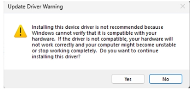
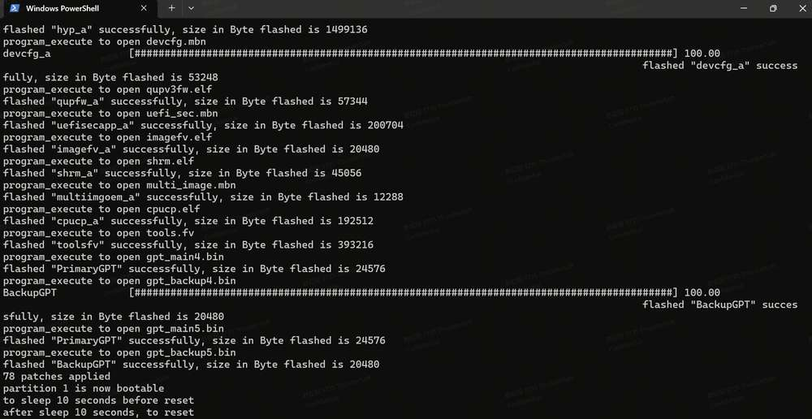
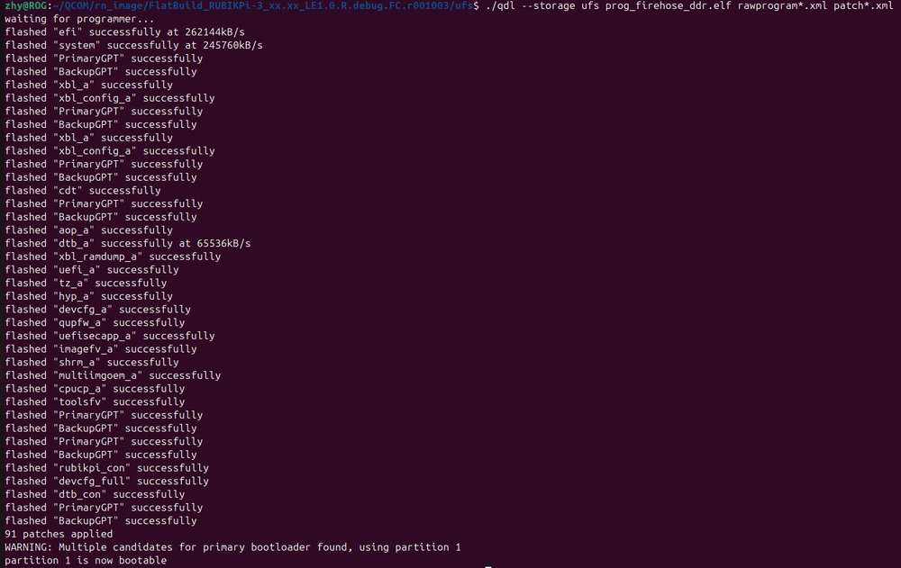
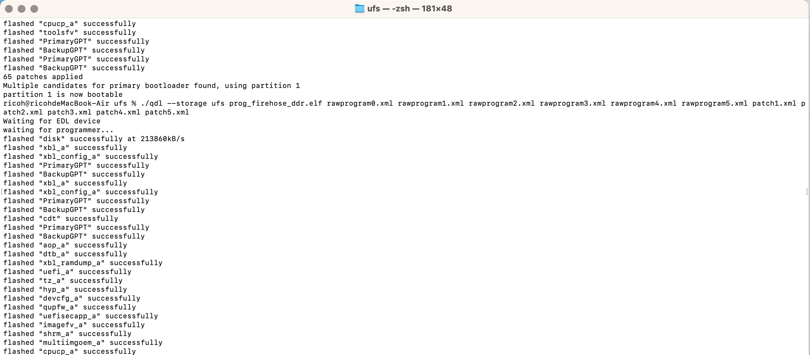
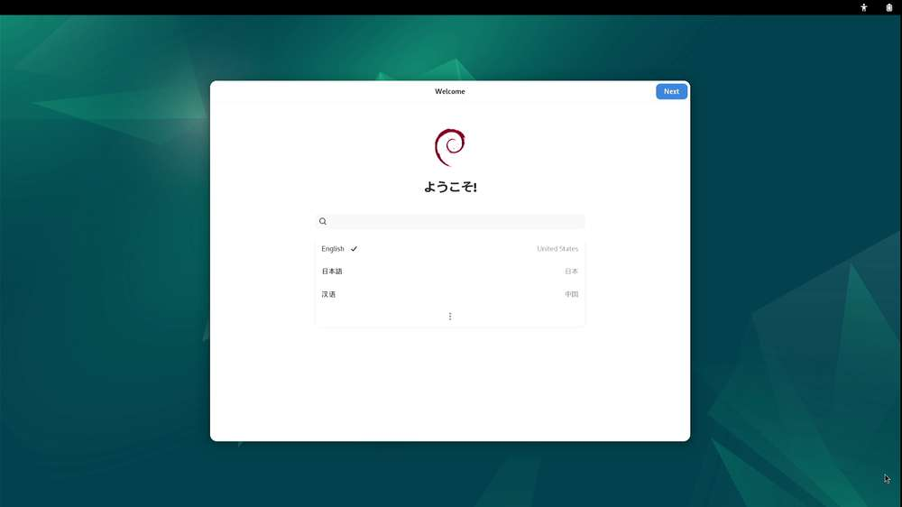
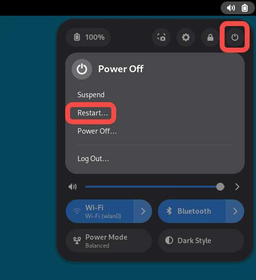
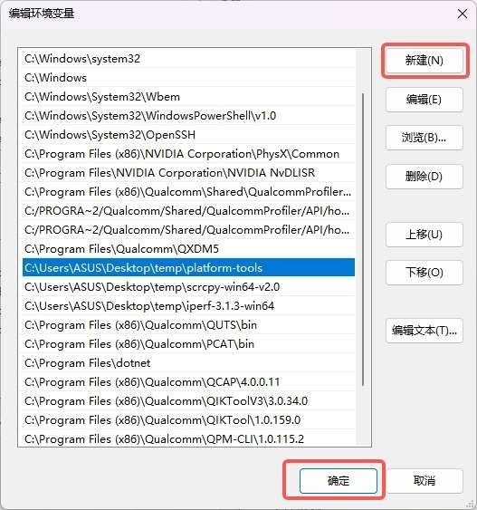
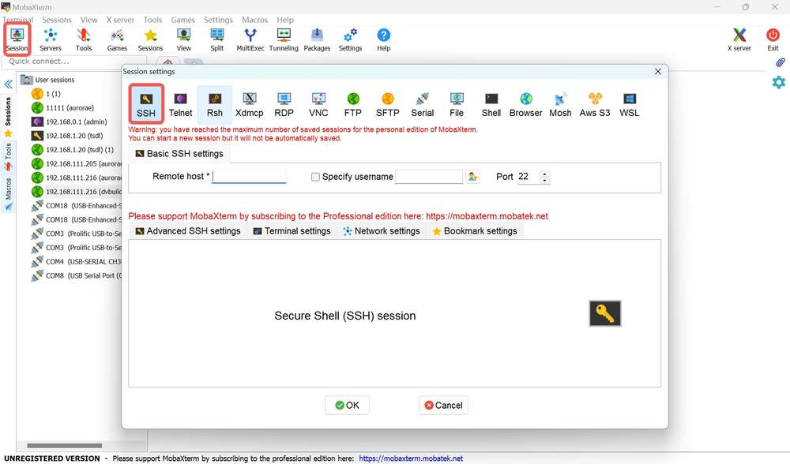
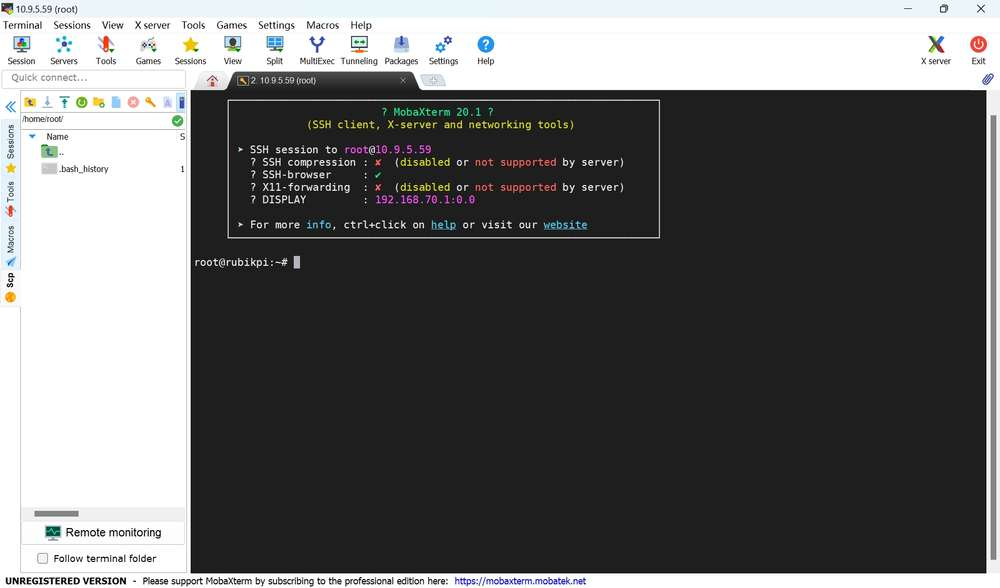

---
# Display h2 to h5 headings
toc_min_heading_level: 2
toc_max_heading_level: 4
custom_edit_url: https://github.com/rubikpi-ai/documentation/blob/main/docs-cn/docs/rubik-pi-3-user-manual/1.0.1-d/1.get-started.md
---

# 快速开始

## 介绍

魔方派 3 基于高通 QCS6490 芯片，采用  Qualcomm® Kryo™ 670 CPU 和融合 AI 加速器架构的 Qualcomm® Hexagon™ 处理器，具备 12 TOPS 的卓越 AI 性能，适用于各种机器学习和人工智能应用场景。

魔方派 3 具有丰富的接口和功能设计，支持 USB、Camera、DP、HDMI、ETH、3.5mm 耳机、Wi-Fi、蓝牙、M.2 连接器、Fan、RTC、40 pin 排针连接器等，满足多样化的开发需求，方便开发者快速开发和调试。

魔方派 3 同样也支持多种系统，如 Qualcomm Linux、Debian 13、Canonical Ubuntu for Qualcomm Platforms\*、Android 13 等，灵活满足开发者特定应用要求。

\*Canonical Ubuntu for Qualcomm Platforms：计划中


## 参数

|            | **魔方派 3**                                                                |
| ---------- | ----------------------------------------------------------------------------- |
| 芯片         | QCS6490                                                                       |
| 处理器        | <p>1 x Cortex-A78 2.7GHz</p><p>3 x Cortex-A78 2.4GHz</p><p>4 x Cortex-A55 1.9GHz</p>  |
| GPU        | Adreno 643 GPU @ Up to 812 MHz                                                |
| VPU        | Adreno 633 VPU                                                                |
| NPU        | 12 TOPS                                                                       |
| ISP        | Spectra ISP，可以做端侧的机器学习和机器处理                                                   |
| 内存         | 8 GB LPDDR4x                                                                  |
| ROM        | 128 GB UFS 2.2                                                                |
| Wi-Fi & 蓝牙 | Wi-Fi 5 和蓝牙 5.2                                                               |
| 摄像头接口      | 2 x 4-lane MIPI CSI D-PHY                                                     |
| USB        | <p>1 x USB Type-C (USB 3.1 Gen1)</p><p>2 x USB Type-A (USB 3.0)</p><p>1 x USB Type-A (USB 2.0)</p> |
| GPIO       | 28个 GPIO 引脚                                                                   |
| 网口         | 1000M                                                                         |
| M.2 接口     | M.2 Key M  2280（2-lane PCIe 3.0）                                              |
| 音频接口       | 3.5mm 耳机接口                                                                    |

## 准备

* 装有 Windows 10 以上 或 Ubuntu18 - Ubuntu22 系统的电脑

* 魔方派 3

* USB Type-A to Type-C 数据线

* USB Type-A to Micro USB 数据线

* 电源（12V 3A Type-C）

:::danger[警告：]

- 请勿使用台式机或笔记本电脑为 魔方派 3 供电。这样可能导致电脑和 魔方派 3 损坏。
- 魔方派 使用的任何外置电源必须符合所在国家/地区的相关法律法规与标准。
- 使用**额定电流 ≥ 3 A 的 12 V 直流电源**。电源应具有过流、过压和浪涌保护功能。
:::

### 镜像下载

魔方派 3 出厂预装 Linux 镜像供您快速进行开箱操作体验（非最新版本），如需体验最新版本的 Linux 镜像，或其他操作系统镜像，请访问 [魔方派 3 官方网站](https://www.thundercomm.com/rubik-pi-3/cn/docs/image/) 进行下载。

如您需要 Linux 源码，请访问 [GitHub](https://github.com/rubikpi-ai) 进行下载。

* Qualcomm Linux ：基于weston的桌面系统，系统较为精简，适合具备 Linux 开发经验，追求深度开发体验的开发者。

  

* Debian 13：基于GNOME 48 桌面系统，系统功能完善，丰富的软件包资源，有更多的桌面应用，更好的使用体验，较多的开发资料，适合追求开发便捷的开发者。

  

* 安卓 13：基于谷歌 AOSP，系统完善，有更好的使用体验，适合想做安卓应用的开发者。

   

### 下载 QDL

QDL 是一款烧录工具，通过 QDL 可向魔方派中烧录镜像。

[点击此处下载](https://softwarecenter.qualcomm.com/api/download/software/tools/Qualcomm_Device_Loader/All/2.3.4/Qualcomm_Device_Loader.Core.2.3.4.All-AnyCPU-qdl_2.3.4.zip)
QDL，下载完成后解压，文件内容如下所示，QDL 支持多平台多架构，可通过查看 *QDL_User_Guide.pdf* 了解 QDL 的使用方法。


### 镜像烧录


镜像烧录前，首先进入烧录模式（9008模式）：

:::warning
>
> * 请勿徒手接触 PCB 板载元件及金属触点
>
> * 操作前需通过接地设备（如防静电工作台/腕带）释放静电
>
> * 禁止将电路板直接置于导电表面（金属台面/未接地机箱等）
:::

方法1：

1. 按住上图 12 的 EDL 按钮。

   

2. 将供电线接入到上图 10。

   

3. Type-C 数据线插入上图 5 等待 3 秒，进入 9008 模式。

   

方法2：

1. 将供电线接入到上图 10。

   

2. Type-C 数据线插入上图 5。

   

3. 在魔方派 3 开机后，输入如下命令，进入 9008 模式。

   ```shell
   adb shell reboot edl
   ```

#### Windows 烧录方法

<a id="flashwin"></a>

1. 安装 WinUSB 驱动（若已经安装可忽略该步骤）

   1. 卸载该设备的其他驱动程序。确保未安装 Qualcomm USB 驱动程序等驱动程序。

      * 您不应该在设备管理器的 COM 端口下看到魔方派设备，如下所示，如果您在 COM 端口下看到该设备，请右键该设备，选择删除设备。

      

      * 确保已选中“删除此设备的驱动程序软件”。

      
   2. 设备断电，重新进入烧录模式，使用以下说明/屏幕截图安装 Microsoft WinUSB。

      * 在设备管理器中右键 魔方派 的 USB 端口，选择更新驱动程序。

      

      * 在弹出的窗口中选择下方的，浏览我的电脑以查找驱动程序。

      

      * 在通用串行总线设备中，选择 "WinUsb Device"。

      

      * 点 “是”，完成驱动更新。

      
2. 在终端中使用以下命令根据主机架构运行 *QDL_Win_x64* 或 *QDL_Win_ARM64* 目录中的 QDL 可执行文件, 进行镜像烧录,
   烧录完成后会自动重启。

:::note

> 程序文件名不支持通配符。命令中必须列出每个镜像文件。
>
> 将 `<pathToQDL>` 更换为 *QDL_Win_x64* 或 *QDL_Win_ARM64* 目录的实际位置。
:::

```shell
<pathToQDL>\QDL.exe prog_firehose_ddr.elf rawprogram0.xml rawprogram1.xml rawprogram2.xml rawprogram3.xml rawprogram4.xml rawprogram5.xml rawprogram6.xml patch0.xml patch1.xml patch2.xml patch3.xml patch4.xml patch5.xml patch6.xml
```



3. 或烧录后无法启动，可尝试进入 FlatBuild 包中的 provision 目录执行下面命令重新对 UFS 进行配置（provision）。
   
:::warning

> 进行 provision 后，UFS 中存储的一些信息会丢失，如 SN号、以太网MAC地址等。
>
> 将 `<pathToQDL>` 更换为 *QDL_Win_ARM64* 或 *QDL_Win_x64* 目录的实际位置。
:::

```shell
<pathToQDL>\QDL.exe prog_firehose_ddr.elf provision_ufs_1_3.xml
```


:::warning

> Provision 刷机完成之后，需要手动插拔电源线和 USB 线重启设备重新进行镜像烧录。
:::

#### Ubuntu 烧录方法

1. 执行下面命令安装 libusb 和 libxml2（若已经安装，可忽略该步骤）。

```shell
sudo apt-get install libxml2-dev libudev-dev libusb-1.0-0-dev
```

2. 进入 FlatBuild 包的 *ufs* 目录。
3. 根据主机架构将 *QDL_Linux_x64* 或 *QDL_Linux_ARM* 目录下的 qdl 拷贝到 *ufs* 目录。
4. 执行下面命令进行烧录。

```shell
./qdl --storage ufs prog_firehose_ddr.elf rawprogram*.xml patch*.xml
```



5. 或烧录后无法启动，可尝试进入 FlatBuild 包中的 provision 目录执行下面命令重新对 UFS 进行配置（provision）。
   
:::warning

> 进行 provision 后，UFS 中存储的一些信息会丢失，如 SN号、以太网MAC地址等。
>
> 配置前，根据主机架构将 *QDL_Linux_x64* 或 *QDL_Linux_ARM* 目录下的 qdl 拷贝到 *provision* 目录
:::

```shell
./qdl prog_firehose_ddr.elf provision_ufs_1_3.xml
```


:::warning

> Provision 刷机完成之后，需要手动插拔电源线和 USB 线重启设备重新进行镜像烧录。
:::

#### Mac 烧录方法

1. 使用以下方式安装 homebrew (若已经安装，可忽略该步骤)。

```shell
/bin/bash -c "$(curl -fsSL https://raw.githubusercontent.com/Homebrew/install/HEAD/install.sh)"
```

2. 执行下面命令安装 libusb 和 libxml2。

```shell
brew install libusb
brew install libxml2
```

3. 进入 FlatBuild 包的 *ufs* 目录。
4. 根据主机的架构将 *QDL_Mac_x64* 或 *QDL_Mac_ARM* 目录下的内容拷贝到 *ufs* 目录。
5. 执行下面命令进行烧录。

```shell
./qdl --storage ufs prog_firehose_ddr.elf rawprogram*.xml patch*.xml
```



6. 或烧录后无法启动，可尝试进入 FlatBuild 包中的 provision 目录执行下面命令重新对 UFS 进行配置（provision）。

:::warning

> 进行 provision 后，UFS 中存储的一些信息会丢失，如 SN 号、以太网 MAC 地址等。
>
> 配置前，根据主机架构将 *QDL_Mac_x64* 或 *QDL_Mac_ARM* 目录下的 qdl 拷贝到 *provision* 目录
:::

```shell
./qdl prog_firehose_ddr.elf provision_ufs_1_3.xml
```


:::warning

> Provision 刷机完成之后，需要手动插拔电源线和 USB 线重启设备重新进行镜像烧录。
:::

## 开机

对于旧版本的 魔方派 3 开发板，接入电源并按下 PWR 按键开机。对于 V02 及后续版本的开发板，接入电源后自动触发开机。


## 登录
<a id="login"></a>

连接 HDMI 显示器开机，并接入鼠标键盘；首次开机时会运行初始化程序，如下所示。




按照指引完成语言、时区、Wi-Fi、帐号的注册，即可登录到 GNOME 桌面。


:::note
  在 Debian 13 镜像中，默认已经注册了 root 用户，也可使用如下命令，在未使用图形引导程序时登录 root 用户。
>
> ```shell
> adb shell
> su
> ```
:::

## 关机

* 点击桌面右上角图标后，点击下图位置关机。


* 或在终端中输入 `poweroff` 命令关机。

## 重启

选择如下一种方法重启：

* 点击桌面右上角图标后，点击下图位置重启。

  

* 或在终端中输入 `sudo reboot` 命令重启。

* 或长按 12 秒电源 PWR 按键重启。

  

## 串口登录

### Windows

1. 将下图 2 号接口使用串口线连接到电脑。

   

2. 打开电脑设置，查看设备管理器对应的 COM 口并记录下来。

   

3. 访问 https://mobaxterm.mobatek.net/ 下载 MobaXterm ，解压后即可使用。

   

4. 打开 MobaXterm ，选择 **Session&#x20;**> **Serial**，设置串口的波特率为 115200。

   

   

5. 点击 **OK**，按下回车，输入在 [登录](#login)小节中注册的用户名和对应的密码登录

   

    root 用户登录：

    帐号：root

    密码：root

### Ubuntu

1. 连接下图 2 中的串口线到电脑。

   

2. 执行命令安装 minicom。

   ```shell
   sudo apt update
   sudo apt install minicom
   ```

3. 输入以下命令检查 USB 端口。

   ```shell
   ls /dev/ttyACM*
   ```

   

* 输入下面命令打开 minicom， 按下回车，输入在 [登录](#login)小节中注册的用户名和对应的密码登录。

  ```shell
  sudo minicom -D /dev/ttyACM0 -b 115200
  ```

  

  root 用户登录：

  帐号：root

  密码：root

## ADB 登录

### Windows

#### 准备

1. 访问  https://developer.android.google.cn/tools/releases/platform-tools 下载 ADB 和 Fastboot 安装包并进行解压。

   

2. 右键 **我的电脑&#x20;**>**&#x20;属性&#x20;**> **高级系统设置&#x20;**> **环境变量**；或右键 **我的电脑&#x20;**>**&#x20;属性，** 在搜索栏中输入**高级系统设置&#x20;**> **环境变量**。

   

3. 选择**系统变量**中的 **Path**，点击**编辑。**

   

4. 点击 **新建**，将 platform-tools 工具在步骤 1 解压的路径填写进去，点击 **确定&#x20;**&#x4FDD;存环境变量。

   

#### ADB 登录

按下 **Win**+**R** 输入`cmd` 打开 Windows 终端，在终端输入如下登录到 魔方派 3：

```shell
adb devices # 查看是否有设备连接
adb shell   # 打开adb终端
su # 切换到 root 用户，开启命令补全
```


### Ubuntu

#### 准备

1. 输入如下命令安装 ADB 和 Fastboot 工具：

   ```shell
   sudo apt install git android-tools-adb android-tools-fastboot wget
   ```

2. 更新 udev rules 文件

   1. 使用如下命令打开并修改 *51-qcom-usb.rules* 文件。

      ```shell
      sudo vi /etc/udev/rules.d/51-qcom-usb.rules
      ```

   2. 将如下内容，添加到文件中；若如下内容已经存在，可忽略这一步骤。

      ```shell
      SUBSYSTEMS=="usb", ATTRS{idVendor}=="05c6", ATTRS{idProduct}=="9008", MODE="0666", GROUP="plugdev"
      ```

   3. 使用下面命令，重启 `udev`。

      ```shell
      sudo systemctl restart udev
      ```

   :::note
   >
   > 如果 魔方派 3 已经通过 USB 连接到个人电脑，请插拔 USB 线，重新连接，以使更新的规则生效。
   :::

#### ADB 登录

在终端输入如下命令登录到 魔方派 3：

```shell
adb devices # 查看是否有设备连接
adb shell   # 打开 adb 终端
su # 切换到 root 用户，开启命令补全
```


## SSH 登录

### Windows

1. 获取 IP 地址。

   1. 登录路由器后台或使用其他 IP 扫描软件获取 魔方派 3 的 IP 地址。

   2. ADB 登录到 魔方派 3 ，使用 `ifconfig` 命令获取 IP 地址。

   :::info
   >
   > IP 地址会随网络环境变化而改变，魔方派 3 设备名称为 rubikpi。
   :::

   3. 按下 **Win**+**R** 按键，在弹出的窗口中输入 cmd，点击 **确定。**

   

   4. 在终端中输入 `ping <IP>` 命令，若 魔方派 3 的 IP 为 10.9.5.59 ，如下所示，查看执行结果。

     ```
     ping 10.9.5.59
     ```
     

2. 进行 SSH 登录。

   1. 打开 MobaXterm 软件。

   

   2. 点击 Session ，在弹出的界面中选择 SSH。
       
   

   3. 输入要登录 魔方派 3 的 IP，点击 OK。

   

   4. 输入要登录的用户名回车后，再输入密码，再次回车登录 魔方派 3。

   

   5. 成功登录。
       
   


### Ubuntu

1. 确定连接状态

   1. 登录路由器后台或使用其他 IP 扫描软件获取 魔方派 3 的 IP 地址。

      :::warning
      >
      > IP 地址会随网络环境变化而改变，魔方派 3 设备名称为 rubikpi。
      >
      > IP 地址也可以 ADB 登录到 魔方派 3 ，使用 `ifconfig` 命令获取。
      :::


   2. 在 Ubuntu 终端中输入 `ping <IP>` 命令，若 魔方派 3 的 IP 为 10.9.5.59，执行如下命令，查看执行结果。

      ```shell
      ping 10.9.5.59
      ```

       

2. 进行 SSH 登录

    1. 在 Ubuntu 终端中输入`ssh <user>@<IP>`命令后回车，如下所示，其中 root 表示要登录的用户，10.9.5.59 表示 魔方派 3 的 IP。

     ```shell
     ssh root@10.9.5.59
     ```

    2. 输入密码后回车，成功登录。

    

## 文件传输

### ADB

* 在PC终端中使用下面命令，上传文件 *test.txt&#x20;*&#x5230; /opt目录。

  ```shell
  adb push test.txt /opt
  ```

* 在 PC 终端中使用下面命令，下载文&#x4EF6;*&#x20;test.txt* 到 PC 当前目录。

  ```shell
  adb pull /opt/test.txt ./
  ```

### SCP

SCP 传输需要 魔方派 3 正常联网，若 魔方派 3 的 IP 为 10.9.5.59， 在终端可输入下面命令：

:::note
>
> 魔方派 3 的 IP 可通过在魔方派 3 中输入`ifconfig`命令获取。
:::


* 在 PC 终端中使用下面命令，上传文&#x4EF6;*&#x20;test.txt* 到 /opt目录。

  ```shell
  scp test.txt root@10.9.5.59:/opt
  ```

* 在 PC 终端中使用下面命令，下载文件到 PC 当前目录。

  ```shell
  scp root@10.9.5.59:/opt/test.txt ./
  ```


## Linux kernel

:::note
Debian V1.0.0 版本镜像未提供 linux kernel 源码，linux kernel 源码将在后续发布的稳定版本中提供。
:::
