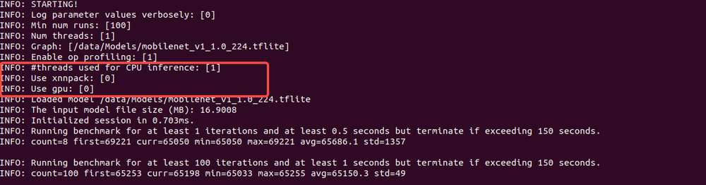

---
# Display h2 to h5 headings
toc_min_heading_level: 2
toc_max_heading_level: 4
---

# AI 处理器和 SDK 的测试方法

## TFlite 测试

点击[此处](https://thundercomm.s3.dualstack.ap-northeast-1.amazonaws.com/uploads/web/rubik-pi-3/demos/ai/tflite_test.zip)，下载 *tflite_test.zip*。

解压 *tflite\_test.zip*，然后执行：

```shell
adb root
adb shell mkdir -p /data/profiling
adb push ./tflite_test/Labels /data
adb push ./tflite_test/Models /data
```

### 用例 1

```shell
adb shell
label_image -l /data/Labels/labels.txt -i /data/Labels/grace_hopper.bmp -m /data/Models/mobilenet_v1_1.0_224.tflite -c 10 -j 1 -p 1
```

出现如下结果代表执行成功：


### 用例 2

#### CPU 和 XNNPACK（开源神经网络推理库）

```javascript
adb shell
benchmark_model --graph=/data/Models/mobilenet_v1_1.0_224.tflite --enable_op_profiling=true --use_gpu=false --num_threads=1 --num_runs=100
```

出现如下结果代表执行成功：


#### CPU only

```javascript
adb shell
benchmark_model --graph=/data/Models/mobilenet_v1_1.0_224.tflite --enable_op_profiling=true --use_gpu=false  --use_xnnpack=false --num_threads=1 --num_runs=100
```

出现如下结果代表执行成功：




## QNN 测试

访问 https://github.com/rubikpi-ai/demo 下载 *qnn_test.zip* 文件。

解压 *qnn\_test.zip*，然后执行其中的脚本 *6490\_PI\_QNN.sh*：

```shell
chmod -R 777 ./6490_PI_QNN.sh
./6490_PI_QNN.sh
```

出现如下结果代表执行成功：


## SNPE 测试

访问 https://github.com/rubikpi-ai/demo 下载 *snpe_test.zip* 文件。

解压 *snpe\_test.zip*，然后执行：

```javascript
adb push ./snpe_test/yolo* /opt
```

### 使用 CPU

```javascript
adb shell
snpe-throughput-net-run --container /opt/yolonas.dlc  --duration 100 --perf_profile "high_performance" --userbuffer_tf8 --userbuffer_float_output --use_cpu
```

出现如下结果代表执行成功：


### 使用 DSP

```javascript
adb shell
snpe-throughput-net-run --container /opt/yolov5s_v2.5_quantized_cache.dlc  --duration 100 --perf_profile burst --userbuffer_tf8 --userbuffer_float_output --use_dsp
```

出现如下结果代表执行成功：

