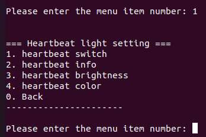

---
# Display h2 to h5 headings
toc_min_heading_level: 2
toc_max_heading_level: 4
---

# rubikpi_config 使用指南

rubikpi\_config 是一个运行在 RUBIK Pi 3 中的配置工具。

通过 `rubikpi_confg` 命令可以方便的配置 40-Pin、LED、风扇等接口。

rubikpi\_config 提供两种模式：

* 命令行模式

  * 使用 `rubikpi_config pin i2c1 enable` 等类似命令完成接口配置。

* 菜单模式

  * 使用 `rubikpi_config` 命令进入菜单，根据提示完成接口配置。

:::note
>
> 在官方发布的镜像中，rubikpi\_config 工具可能并非最新版本，若您在使用过程中发现了问题，可使用 `sudo apt install --only-upgrade package_name `命令更新工具，或访问 https://github.com/rubikpi-ai/tools/tree/rubikpi_config 根据 README 中的提示更新工具。
:::

## 命令行模式

使用 `rubikpi_config -h`   命令查看使用方法，命令执行结果：

```sql
This is the config tool for RUBIK Pi. 

Select working mode:
 rubikpi_config                        ---> When executed without arguments, enter the menu mode
 rubikpi_config [function] [args...]   ---> When executed with arguments, enter cmdline mode

CMDLINE MODE:

rubikpi_config [function] -h         View Help Information

function:
 pin                           40 pin header function control(e.g. i2c1, spi2)
 fan                           Fan status control
 temp                          Temperature information view
 res                           Resource information view(e.g. CPU usage, memory usage)
 led                           LED parameter settings
 thermal                       Thermal switch settings
 debug                         Debugging information printing
 display                       Display parameter settings(e.g. resolut)
 audio                         audio information view and parameter settings
 bt                            Switching protocol stack

OTHER

-h, --help                    Print help information
-v                            Print version information

```

### 40-Pin

* 查看使用方法

```shell
rubikpi_config pin -h
```

示例输出：

```shell
This is the config tool for RUBIK Pi. 
PIN
Use examples
rubikpi_config pin [operation port] [enable/disable]
operation port:
i2c1, i2c3, spi2, uart2_2w, uart2_4w, i2c2, spi6, uart6_2w, uart6_4w, i2c6, spi8, uart8_2w, uart8_4w, i2c8, spi12, uart12_2w, uart12_4w, i2c12, i2s2
```

* 部分命令示例：

   * 使能两线模式的串口 6

    ```shell
    rubikpi_config pin uart6_2w enable
    ```

    示例输出：

    ```shell
    Note: The update is complete and will take effect after restart.
    ```

    重启系统后会出现 `/dev/ttyHS6` 节点，可使用 [2.2.4 UART](./2.peripherals-and-interfaces.md#UART) 小节的方法测试串口 6。

   - 获取两线模式串口 6 的使能状态

  ```
  rubikpi_config pin uart6_2w        
  ```

  示例输出

  ```
  uart6_2w current status:enable
  ```

### Debug

* 查看使用方法

```shell
rubikpi_config debug -h
```

示例输出：

```shell
This is the config tool for RUBIK Pi. 
debug print
Use examples:
rubikpi_config debug uart                Get serial port printing status
rubikpi_config debug uart on             Enable serial port printing
rubikpi_config debug uart off            Close serial port printing
```

* 部分命令示例：

  * 关闭串口终端

  ```shell
  rubikpi_config debug uart off
  ```

   示例输出：

   ```
   Console status set success

   The modification will take effect after the system restarts.
   ```
   重启串口终端在进入 kernel 后将无打印信息

### Thermal

* 查看使用方法

```shell
rubikpi_config thermal -h
```

示例输出：

```shell
This is the config tool for RUBIK Pi. 
thermal
Use examples:
rubikpi_config thermal cpu [enabled/disabled]        cpu thermal on/off control
rubikpi_config thermal cpu                           cpu thermal status get
```

* 部分命令示例：

  * 获取当前 CPU 热管理状态

  ```shell
  rubikpi_config thermal cpu
  ```

  示例输出：

  ```shell
  current cpu thermal is:disabled
  ```

### Fan

* 查看使用方法

```shell
rubikpi_config fan -h
```

示例输出：

```shell
This is the config tool for RUBIK Pi. 
FAN
Use examples:
rubikpi_config fan speed [speed_value]
speed value:
speed value: 0-255, 0 is stop, 255 is max speed
```

* 部分命令示例：

  * 将风扇的转速设置为 255。

  ```shell
  rubikpi_config fan speed 255
  ```

:::note
 在将风扇转速设置为一个固定值前，需要使用 `rubikpi_config thermal disable` 命令将 CPU 热管理关掉。
:::

### LED

* 查看使用方法

```shell
rubikpi_config led -h
```

示例输出：

```bash
This is the config tool for RUBIK Pi. 
LED
Use examples:
rubikpi_config led heartbeat [on/off]             heartbeat led on/off control
rubikpi_config led heartbeat [blue/green/red]     heartbeat led Color selection
rubikpi_config led heartbeat                      heartbeat brightness and color get
rubikpi_config led brightness [0-511]             heartbeat brightness set
rubikpi_config led [blue/green/red] [0-511]       led brightness set
rubikpi_config led [blue/green/red]               led brightness get
rubikpi_config led off                            leds off
```

* 部分命令示例：

  * 关闭心跳灯

  ```shell
  rubikpi_config led heartbeat off
  ```

### Display

* 查看使用方法

```shell
rubikpi_config display -h
```

示例输出：

```shell
This is the config tool for RUBIK Pi. 
display
Use examples:
rubikpi_config display resolut [resolution_value]
resolution_value:
edidAdaptiveResolution 1280x720x60 1920x1080x60 2560x1440x60, 3840x2160x30
```

* 部分命令示例：

  * 将 HDMI OUT 分辨率固定为 1080P 显示

  ```shell
  rubikpi_config display resolut 1920x1080x60
  ```

  示例输出，重启系统后生效：

  ```shell
  The update is complete and will take effect after restart.
  ```

### 蓝牙

蓝牙® 无线技术是一种短距离通信系统，可实现设备之间的无线数据交换。蓝牙技术的主要优势如下：

* 替代便携式和固定式电子设备的线缆

* 提供稳健、节能且经济高效的解决方案

* 促进解决方案及其应用的灵活性。


查看使用方法

```shell
rubikpi_config bt -h
```

示例输出：

```shell
This is the config tool for RUBIK Pi. 
BT
Use examples:
rubikpi_config bt protocol             Retrieve the current protocol stack
rubikpi_config bt protocol bsa         Set the protocol stack to BSA
rubikpi_config bt protocol bluez       Set the protocol stack to BlueZ
```

* 部分命令示例：

  * 切换 BT 协议栈为 BSA（Bluetooth Simplified API）

  ```shell
  rubikpi_config bt protocol bsa
  ```

  示例输出：

  ```shell
  Setting successful 
  ```

### Audio

* 查看使用方法

```shell
rubikpi_config audio -h
```

示例输出：

```shell
AUDIO
Use examples:
rubikpi_config audio card                   audio card info
rubikpi_config audio pcm                    audio pcm info
rubikpi_config audio output [hdmi/headset]  audio output info view and setting
rubikpi_config audio volume [vol_val]       audio volume info view and setting
```

* 部分命令示例：

  * 设置输出音量为 180（设置范围 0 - 191）

  ```shell
  rubikpi_config volume 180
  ```

### Temperature

* 查看使用方法

```shell
rubikpi_config temp -h
```

示例输出：

```shell
This is the config tool for RUBIK Pi. 
TEMP
Use examples:
rubikpi_config temp all                all zone temperature
rubikpi_config temp zone [zone_num]    znoe temperature
```

* 部分命令示例：

  * 显示所有温区温度

  ```shell
  rubikpi_config temp all
  ```

  示例输出：

  ```shell
  Thermal zone 0 pm7325-thermal:37.00 °C
  Thermal zone 1 pm8350c-thermal:37.00 °C
  Thermal zone 2 pm8350c-bcl-lvl0:0.00 °C
  Thermal zone 3 pm8350c-bcl-lvl1:0.00 °C
  Thermal zone 4 pm8350c-bcl-lvl2:0.00 °C
  Thermal zone 5 aoss0-thermal:48.00 °C
  Thermal zone 6 cpu0-thermal:48.40 °C
  Thermal zone 7 cpu1-thermal:47.70 °C
  Thermal zone 8 cpu2-thermal:47.70 °C
  Thermal zone 9 cpu3-thermal:47.30 °C
  Thermal zone 10 cpuss0-thermal:47.70 °C
  Thermal zone 11 cpuss1-thermal:48.40 °C
  Thermal zone 12 cpu4-thermal:48.00 °C
  Thermal zone 13 cpu5-thermal:46.90 °C
  Thermal zone 14 cpu6-thermal:47.70 °C
  Thermal zone 15 cpu7-thermal:47.30 °C
  Thermal zone 16 cpu8-thermal:47.70 °C
  Thermal zone 17 cpu9-thermal:47.70 °C
  Thermal zone 18 cpu10-thermal:48.40 °C
  Thermal zone 19 cpu11-thermal:48.00 °C
  Thermal zone 20 aoss1-thermal:48.80 °C
  Thermal zone 21 gpuss0-thermal:48.00 °C
  Thermal zone 22 gpuss1-thermal:48.00 °C
  Thermal zone 23 nspss0-thermal:47.60 °C
  Thermal zone 24 nspss1-thermal:47.60 °C
  Thermal zone 25 video-thermal:48.00 °C
  Thermal zone 26 ddr-thermal:48.80 °C
  Thermal zone 27 mdmss0-thermal:48.00 °C
  Thermal zone 28 mdmss1-thermal:46.50 °C
  Thermal zone 29 mdmss2-thermal:46.90 °C
  Thermal zone 30 mdmss3-thermal:48.00 °C
  Thermal zone 31 camera0-thermal:48.80 °C
  Thermal zone 32 xo-thermal:43.82 °C
  Thermal zone 33 quiet-thermal:46.78 °C
  Thermal zone 34 sdm-skin-thermal:45.23 °C
  Thermal zone 35 qcom-battmgr-bat:25.00 °C
  ```

### Resource

* 查看使用方法

```shell
 rubikpi_config res -h
```

示例输出：

```shell
This is the config tool for RUBIK Pi. 
res
Use examples:
rubikpi_config res all    Display CPU, memory and disk information
rubikpi_config res mem    Display memory information
rubikpi_config res cpu    Display CPU information
rubikpi_config res disk   Display disk information
```

* 部分命令示例：

  * 显示 CPU 使用率

  ```shell
  rubikpi_config res cpu
  ```

  示例输出：

  ```shell
  CPU Usage: 0.25%
  ```

## 菜单模式

使用如下 `rubikpi_config` 命令进入菜单模式


根据提示，输入相应的数字或内容，回车确认。

如设置心跳灯的亮度为 20：

1. 输入 4 回车，进入 LED 配置


2. 输入 1 回车，进入心跳灯配置



3. 输入 3 回车，设置心跳灯亮度


4. 输入要设置的亮度 20，回车


5. 输入 Ctrl + C 按键退出配置工具