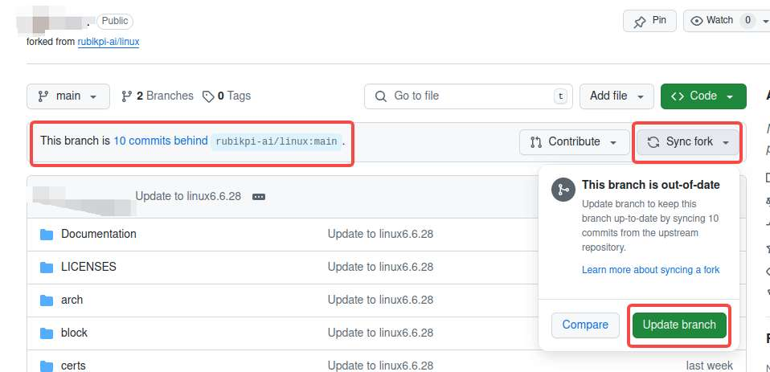

---
# Display h2 to h5 headings
toc_min_heading_level: 2
toc_max_heading_level: 4
---

# GitHub操作指南

## 向 RUBIK Pi 3 提交代码

可以通过提交 Pull Request 向 RUBIK Pi 3 提交代码，经过审核后，您的代码有可能合入 RUBIK Pi 3 的主线。以向 RUBIK Pi 3 linux 主线分支提交 PR 为例：

1. 登录 GitHub，访问 RUBIK Pi 3 仓库 [https://github.com/rubikpi-ai/linux.](https://github.com/rubikpi-ai/linux)

2. 点击 **Fork&#x20;**&#x6309;钮，按提示将仓库 fork 到自己仓库下。


3. 将 fork 的仓库使用 git clone 命令克隆到本地。

  

  :::note
  >
  > 需使用自己仓库的网址。
  :::

  ```shell
  git clone https://github.com/hongyang-rp/linux.git
  ```

4. 进入仓库，本地创建新分支 rpdev，在新分支下进行开发：

  ```shell
  cd linux 
  git checkout -b rpdev
  ```


5. 修改并提交代码：

  ```shell
  git add .   
  git commit -s
  ```

6. 使用 `git push` 命令将本地的分支推送到 GitHub 上 fork 仓库上：

  ```shell
  git push --set-upstream origin rpdev
  ```

若提交时出现下面报错，则需要使用个人令牌：


个人令牌获得方法：

1. 点击 GitHub 个人头像，选择 **Settings。**


2. 点击左侧&#x7684;**&#x20;Developer settings。**


3. 选择 **Personal access tokens**，点击 **Tokens (classic)。**


4. 点&#x51FB;**&#x20;Generate new token。**

  

5. 配置 token，设置一个名字，选择过期时间。

  

    建议将全部内容都勾选，勾选后点击 **Generate token。**

6. 产生密钥，得到下面位置的 token 内容，保存起来避免遗忘。

   

7. 执行 `git remote set-url` 命令，配置 token。

   ```shell
   git remote set-url origin  https://<your_token>@github.com/<USERNAME>/<REPO>.git
   ```

   * \<your\_token> 换成得到的令牌;

   * \<USERNAME> 换成GitHub 的用户名称；

   * \<REPO> 换成仓库名称

   然后再次执行 git push 操作，执行成功

8. 浏览器访问 GitHub 上 fork 的仓库，会有如下提示，点击并按照提示创建 PR。

   

   或选择 **Pull requests&#x20;**&#x540E;点击 **New pull request&#x20;**&#x521B;建PR。

   

9. 等待管理员对 PR 进行查看和回复，最后合入主分支，合入主分支的 PR 可点击 **Closed** 查看。

   

:::note
>
> 若 fork 的仓库出现如下提示，则需要点击 **Sync fork&#x20;**> **Update brach** 对 GitHub 仓库进行更新，更新成功后可在本地仓库中执行 `git pull` 命令同步更新。
:::



## 创建 Issue

如开发过程中遇到问题、发现 BUG、对 RUBIK Pi 3 的意见、想要的功能等，以创建 Issue 的方式提出。

1. 登录 GitHub，访问 RUBIK Pi 3 仓库 https://github.com/rubikpi-ai/linux

2. 点击左上&#x89D2;**&#x20;Issues**。

   

   创建 Issue 时可以先进行搜索确定是否有人已经提出类似的 Issue；点击 **New issue** 并按照提示创建。

   

3. 创建完成后，请等待社区回复。
