# 2. 外设与接口

## 2.1 硬件资源图

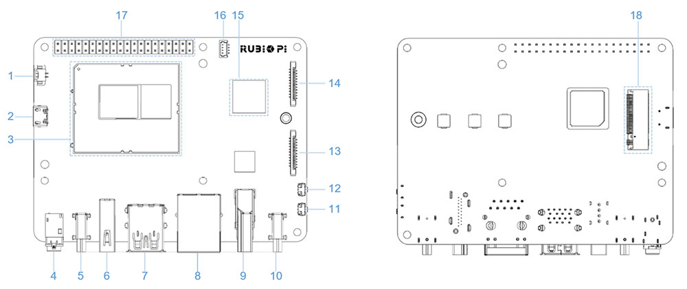

## 2.2 40 pin 连接器

### 2.2.1 GPIO

魔方派3适配了 WiringRP（基于高性能 GPIO 编程库 WiringPi），推荐使用 WiringRP 来控制 GPIO，和对 GPIO 编程。关于 WiringRP 详细信息可访问 https://github.com/rubikpi-ai/WiringRP 查看。

#### 2.2.1.1 引脚分布

下图是魔方派3 40-pin 连接器的引脚默认功能，其中大部分引脚和树梅派 40-pin 连接器引脚的默认功能兼容。

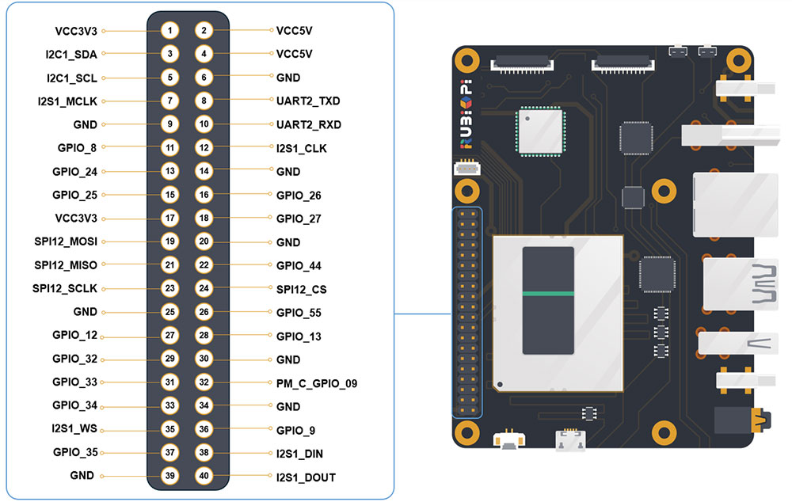

下表是 40-pin连接器支持的所有功能，图中蓝色字体表明默认功能。

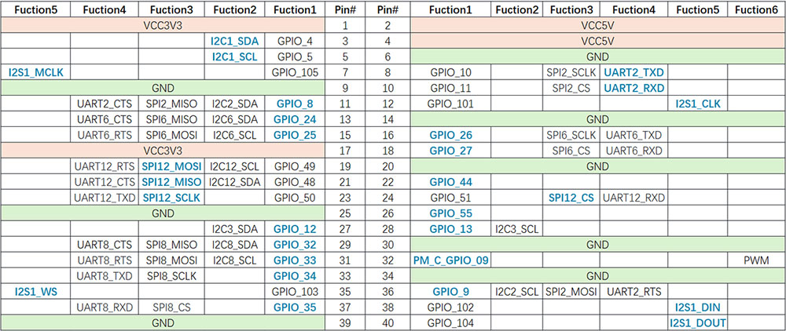

#### 2.2.1.2 使用 shell 命令控制

在魔方派3中执行下面的步骤控制 GPIO。

* 使用 WiringRP 相关命令

  * 查看 GPIO 状态

    ```shell showLineNumbers
    gpio readall
    ```

    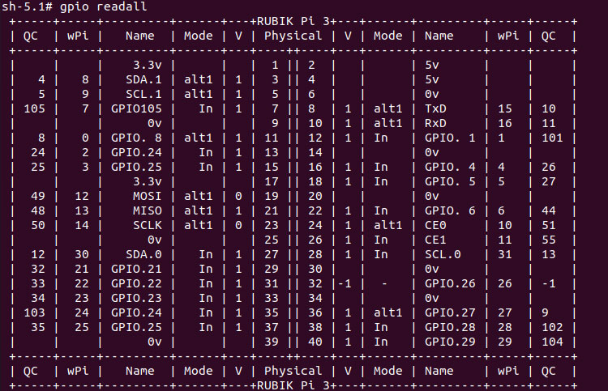
  * 设置 GPIO 模式

    ```shell showLineNumbers
    gpio mode 15 in             # 将15号引脚模式置为输入
    gpio pins                   # 查看更改之后的状态
    gpio mode 15 out            # 将15号引脚模式置为输出
    gpio pins                   # 查看更改之后的状态
    ```
  * 设置引脚电平

    ```shell showLineNumbers
    gpio write 15 1             # 将15号引脚置为高电平
    gpio read 15                # 读取更改后引脚状态
    gpio write 15 0             # 将15号引脚置为低电平
    gpio read 15                # 读取更改后引脚状态
    ```
* 操作 */sys/class/gpio* 下相关节点

  GPIO 子系统的编号如下表。

  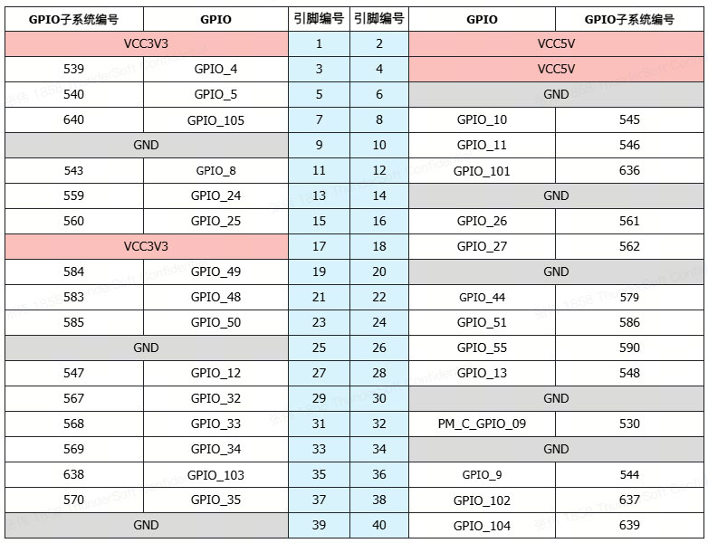
* 进入*/sys/class/gpio** * 目录：

  ```shell showLineNumbers
  cd /sys/class/gpio
  ```
* 将要控制的 GPIO 导出，如控制 13 号引脚 GPIO_24：

  ```shell showLineNumbers
  echo 559 > export
  ```
* 进入到*gpio559* 目录设置 GPIO 属性：

  ```shell showLineNumbers
  cd gpio559
  ls
  ```

  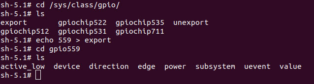
* direction（方向）：

  * 输入：in
  * 输出：out
* value（值）：

  * 低电平：0
  * 高电平：1
* edge （中断边沿）：

  * 上升沿触发：rising
  * 下降沿触发：falling
  * 双边沿触发：both
  * 禁用中断：none

  如设置 13 号引脚输出高电平：

  ```shell showLineNumbers
  echo out > direction
  echo 1 > value
  ```

  取消导出 13 号引脚到用户空间：

  ```shell showLineNumbers
  echo 559 > unexport
  ```

#### 2.2.1.3 使用 WiringRP (C) 控制

WiringRP 库中提供了一系列的 API 函数，用更少的逻辑实现控制。

* 以下代码示例，代码将 13 号引脚设置为输出， 15 号引脚设置为输入，循环检测 15 号引脚的电平状态：

```c showLineNumbers
#include <stdio.h>
#include <wiringPi.h>

int main (void)
{
  wiringPiSetup () ;
  pinMode (13, OUTPUT) ;
  pinMode (15, INPUT) ;

  for (;;)
  {
    digitalWrite (13, HIGH) ;        // On
    printf("%d\n", digitalRead (15));        // On
    delay (1000) ;                // mS
    digitalWrite (13, LOW) ;        // Off
    printf("%d\n", digitalRead (15));        // On
    delay (1900) ;
  }

  return 0 ;
}
```

* 编译程序

  * 在魔方派3中编译

  ```shell showLineNumbers
  adb push gpio.c /opt
  adb shell
  cd /opt
  gcc gpio.c -o gpio -lwiringPi
  ```
* 将 13 和 15 号引脚使用杜邦线短接，测试 GPIO 电平控制和电平读取情况，如下图所示：

  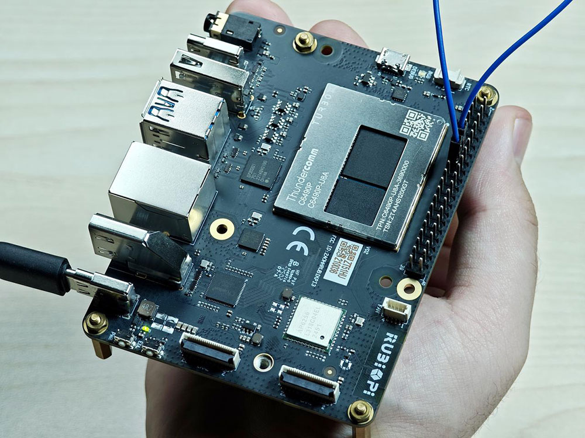

  运行如下命令：

  ```shell showLineNumbers
  cd /opt
  ./gpio
  ```

  程序运行结果如下：

  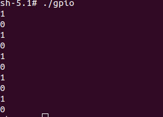

#### 2.2.1.4 使用 WiringRP-Python 控制

WiringRP 库中提供了一系列的 API 函数，用更少的逻辑实现控制。

* 下方截取代码是使用 WiringRP 库操作 GPIO 的示例，其中将 13 号引脚设置为输出，15 号引脚设置为输入，循环检测 15 号引脚的电平状态。

  ```python showLineNumbers
  import wiringpi
  import time

  wiringpi.wiringPiSetup()
  wiringpi.pinMode(13, 1)
  wiringpi.pinMode(15, 0)
  wiringpi.digitalRead(15)

  while True:
      wiringpi.digitalWrite(13,1)
      pin_level = wiringpi.digitalRead(15)
      print(f"in_gpio level: {pin_level}")

      time.sleep(1)

      wiringpi.digitalWrite(13,0)
      pin_level = wiringpi.digitalRead(15)
      print(f"in_gpio level: {pin_level}")

      time.sleep(1)
  ```
* 将 *gpio.py&#x20;*&#x4F20;输到魔方派3中，如使用 ADB 传输。

  ```shell showLineNumbers
  adb push gpio.py /opt
  ```
* 将 13 和 15 号引脚使用杜邦线短接，测试 GPIO 电平控制和电平读取情况，如下图所示

  

  运行如下命令：

  ```shell showLineNumbers
  cd /opt
  python3 gpio.py 
  ```

  程序运行结果如下：

  

#### 2.2.1.5 使用 Python 程序控制

* 可使用 Python 的 periphery 库控制 GPIO，可在魔方派3中使用下面命令进行安装：

  ```shell showLineNumbers
  pip3 install python-periphery 
  ```
* 下方截取代码是使用 periphery 库操作 GPIO 的示例，其中将 13 号引脚设置为输出，15 号引脚设置为输入，循环检测 15 号引脚的电平状态。

  ```python showLineNumbers
  from periphery import GPIO
  import time

  out_gpio = GPIO(559, "out")
  in_gpio = GPIO(560, "in")

  try:
      while True:
          try:
              out_gpio.write(True)
              pin_level = in_gpio.read()
              print(f"in_gpio level: {pin_level}")

              out_gpio.write(False)
              pin_level = in_gpio.read()
              print(f"in_gpio level: {pin_level}")

              time.sleep(1)

          except KeyboardInterrupt:
              out_gpio.write(False)
              break

  except IOError:
      print("Error")

  finally:
      out_gpio.close()
      in_gpio.close()
  ```
* 将 *gpio.py&#x20;*&#x4F20;输到魔方派3中，如使用 ADB 传输。

  ```shell showLineNumbers
  adb push gpio.py /opt
  ```
* 将 13 和 15 号引脚使用杜邦线短接测试 GPIO 电平控制和电平读取情况，如下图所示：

  

  运行如下命令：

  ```shell showLineNumbers
  cd /opt
  python3 gpio.py 
  ```

  程序运行结果如下：

  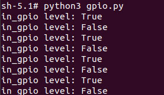

#### 2.2.1.6 使用 C 语言程序控制

* 以下代码示例，代码将 13 号引脚设置为输出， 15 号引脚设置为输入，循环检测 15 号引脚的电平状态：

  ```c showLineNumbers
  #include <stdio.h>
  #include <stdlib.h>
  #include <unistd.h>

  int out_gpio = 559;
  int in_gpio = 560;

  int main() {
      char export_path[50] = {};
      char export_command[100] = {};
      snprintf(export_path, sizeof(export_path), "/sys/class/gpio/export");
      snprintf(export_command, sizeof(export_command), "echo %d > %s ", out_gpio, export_path);
      system(export_command);
      snprintf(export_command, sizeof(export_command), "echo %d > %s ", in_gpio, export_path);
      system(export_command);

      char direction_path[50] = {};
      snprintf(direction_path, sizeof(direction_path), "/sys/class/gpio/gpio%d/direction", out_gpio);
      FILE *direction_file = fopen(direction_path, "w");
      if (direction_file == NULL) {
          perror("Failed to open GPIO direction file");
          return -1;
      }
      fprintf(direction_file, "out");
      fclose(direction_file);

      snprintf(direction_path, sizeof(direction_path), "/sys/class/gpio/gpio%d/direction", in_gpio);
      direction_file = fopen(direction_path, "w");
      if (direction_file == NULL) {
          perror("Failed to open GPIO direction file");
          return -1;
      }
      fprintf(direction_file, "in");
      fclose(direction_file);

      char value_in_path[50] = {};
      char value_out_path[50] = {};
      char cat_command[100] = {};
      snprintf(value_out_path, sizeof(value_out_path), "/sys/class/gpio/gpio%d/value", out_gpio);
      snprintf(value_in_path, sizeof(value_in_path), "/sys/class/gpio/gpio%d/value", in_gpio);
      snprintf(cat_command, sizeof(cat_command), "cat %s", value_in_path);

      FILE *value_out_file = fopen(value_out_path, "w");
      if (value_out_file == NULL) {
          perror("Failed to open GPIO value file");
          return -1;
      }

      for (int i = 0; i < 5; i++) {
          fprintf(value_out_file, "1");
          fflush(value_out_file);

          system(cat_command);
          sleep(1);

          fprintf(value_out_file, "0");
          fflush(value_out_file);

          system(cat_command);
          sleep(1);
      }

      fclose(value_out_file);

      char unexport_path[50] = {};
      char unexport_command[100] = {};
      snprintf(unexport_path, sizeof(unexport_path), "/sys/class/gpio/unexport");
      snprintf(unexport_command, sizeof(unexport_command), "echo %d > %s ", out_gpio, unexport_path);
      system(unexport_command);
      snprintf(unexport_command, sizeof(unexport_command), "echo %d > %s ", in_gpio, unexport_path);
      system(unexport_command);

      return 0;
  }

  ```
* 编译程序：

  * 交叉编译，具体可参考 [1.11.3 交叉编译工具](/rubik-pi-3/cn/docs/rubik-pi-3-user-manual/1.1.0/quick-start#1113-%E4%BA%A4%E5%8F%89%E7%BC%96%E8%AF%91%E5%B7%A5%E5%85%B7%E4%BD%BF%E7%94%A8%E6%96%B9%E6%B3%95)使用方法章节：

    ```shell showLineNumbers
    aarch64-qcom-linux-gcc gpio.c -o gpio --sysroot=/home/zhy/qcom_sdk_meta/sysroots/armv8-2a-qcom-linux/
    ```
  * 在魔方派3中编译：

    ```shell showLineNumbers
    adb push gpio.c /opt
    adb shell
    cd /opt
    gcc gpio.c -o gpio
    ```

    若使用了交叉编译，需将 gpio 传输到魔方派3中，如使用 ADB 传输：

    ```shell showLineNumbers
    adb push gpio /opt
    ```
* 将 13 和 15 号引脚使用杜邦线短接，测试 GPIO 电平控制和电平读取情况，如下图所示：

  

  运行如下命令：

  ```shell showLineNumbers
  cd /opt
  ./gpio
  ```

  程序运行结果如下：

  

### 2.2.2 I2C

魔方派3适配了 WiringRP（基于高性能 GPIO 编程库 WiringPi ） ，推荐使用 WiringRPi 来控制 I2C，和对 I2C 编程。关于 WiringRP 详细信息可访问 https://github.com/rubikpi-ai/WiringRP 查看。

#### 2.2.2.1 引脚分布

下图是魔方派3 40-pin 连接器的引脚默认功能，其中大部分引脚和树梅派 40-pin 连接器引脚的默认功能兼容。


:::note
3 号引脚和 5 号引脚默认已设置配为 I2C1。
:::

下表是 40-pin 连接器支持的所有功能，图中蓝色字体表明默认功能。


#### 2.2.2.2 使用 shell 命令测试

在魔方派3中执行下面步骤控制 I2C 总线。

* 使用 WiringRP 相关命令：

  ```shell showLineNumbers
  ./gpio -x ads1115:100:10 aread 100     #通过 I2C 总线读取 ADS1115 设备的模拟信号值
  ```
* 使用 i2cdetect 工具

  * 查看 I2C1 接口上的设备：

    ```shell showLineNumbers
    i2cdetect -a -y -r 1
    ```
  * 读取地址为 0x38 设备的全部寄存器：

    ```shell showLineNumbers
    i2cdump -f -y 1 0x38
    ```
  * 向地址为 0x38 设备的 0x01 寄存器地址写入 0xaa：

    ```shell showLineNumbers
    i2cset -f -y 1 0x38 0x01 0xaa
    ```
  * 读取地址为 0x38 的设备，寄存器地址为0x01处的数值：

    ```shell showLineNumbers
    i2cget -f -y 1 0x38 0x01
    ```

#### 2.2.2.3 使用 WiringRP (C) I2C 通信

WiringRP 库中提供了一系列的 API函数，用更少的逻辑实现控制。

* 以下代码示例，I2C1总线和地址为0x38的设备进行通信，向设备0x01地址处写入0xaa：

  ```python showLineNumbers
  #include <wiringPi.h>
  #include <stdio.h>
  #include <stdlib.h>

  #define I2C_ADDRESS 0x38

  int main(void) {
      int fd;

      if (wiringPiSetup() == -1) {
          exit(1);
      }

      fd = wiringPiI2CSetup(I2C_ADDRESS);
      if (fd == -1) {
          exit(1);
      }

      unsigned char data[2];
      if (read(fd, data, 2) != 2) {
          exit(1);
      }

      wiringPiI2CWriteReg8 (fd, 0x01, 0xaa) ;

      close(fd);
      return 0;

  ```
* 编译程序

  * 在魔方派3中编译

    ```shell showLineNumbers
    adb push gpio.c /opt
    adb shell
    cd /opt
    gcc i2c.c -o i2c -lwiringPi
    ```
* 将 3 和 5 号引脚连接 I2C 传感器，验证 I2C 总线通信，如下图所示

  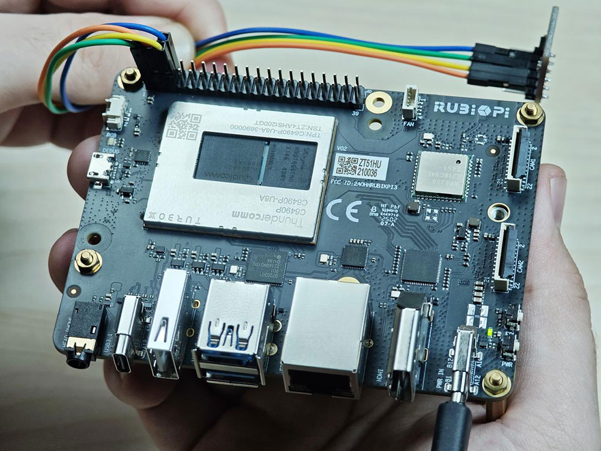

  运行如下命令运行程序：

  ```shell showLineNumbers
  cd /opt
  ./i2c
  ```

#### 2.2.2.4 使用 WiringRP-Python I2C 通信

WiringRP 库中提供了一系列的 API 函数，用更少的逻辑实现控制。

* 以下代码示例，使用 I2C1 总线和地址为 0x38 的设备进行通信，向设备 0x01 地址处写入 0xaa：

  ```bash showLineNumbers
  import wiringpi as wpi

  wpi.wiringPiSetup()
  fd=wpi.wiringPiI2CSetup(0x38, 1)
  wpi.wiringPiI2CWriteReg8 (fd, 0x01, 0xaa)
  ```
* &#x5C06;*&#x20;i2c.py&#x20;*&#x4F20;输到魔方派3中，如使用 ADB 传输。

  ```shell showLineNumbers
  adb push i2c.py /opt
  ```
* 将 3 和 5 号引脚连接 I2C 传感器，验证 I2C 总线通信，如下图所示，

  

  运行如下命令：

  ```shell showLineNumbers
  cd /opt
  python3 i2c.py 
  ```

#### 2.2.2.5 使用 Python 程序 I2C 通信

* 可使用 Python 的 smbus 库控制 I2C，可在魔方派3中使用下面命令进行安装：

  ```shell showLineNumbers
  pip3 install smbus
  ```
* 以下代码示例，使用 I2C1 总线和地址为 0x38 的设备进行通信，向设备 0x01 地址处写入 0xaa：

  ```python showLineNumbers
  import smbus

  def main():
      data = [0x01, 0xaa]

      try:
          i2c_bus = smbus.SMBus(1)  

          print("i2cdetect addr : ", end="")
          for address in range(0x7F):
              try:
                  i2c_bus.write_i2c_block_data(address, 0, data)
                  print("0x{:02X},".format(address), end="")
              except OSError:
                  pass  

          print()

      except Exception as e:
          print(f"An error occurred: {e}")

      finally:
          if i2c_bus:
              i2c_bus.close()

  if __name__ == "__main__":
      main()
  ```
* 将 *i2c.py&#x20;*&#x4F20;输到 RUBIK Pi 3中，如果使用 ADB 传输，命令如下：

  ```shell showLineNumbers
  adb push i2c.py /opt
  ```
* 将 3 和 5 号引脚连接 I2C 传感器，验证 I2C 总线通信，如下图所示：

  

  运行如下命令：

  ```shell showLineNumbers
  cd /opt
  python3 i2c.py 
  ```

  程序运行结果如下：

  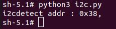

#### 2.2.2.6 使用 C 语言程序 I2C 通信

* 以下代码示例，I2C1 总线和地址为 0x38 的设备进行通信，向设备 0x01 地址处写入 0xaa：

  ```c showLineNumbers
  #include <stdio.h>
  #include <stdlib.h>
  #include <stdint.h>
  #include <fcntl.h>
  #include <unistd.h>
  #include <linux/i2c-dev.h>
  #include <sys/ioctl.h>

  #define I2C_DEVICE_PATH "/dev/i2c-1"

  int main() {
      uint8_t data[2] = {0x01,0xaa};

      const char *i2c_device = I2C_DEVICE_PATH;  
      int i2c_file;

      if ((i2c_file = open(i2c_device, O_RDWR)) < 0) {
          perror("Failed to open I2C device");
          return -1;
      }

      ioctl(i2c_file, I2C_TENBIT, 0);
      ioctl(i2c_file, I2C_RETRIES, 5);

      printf("i2cdetect addr : ");
      for (int x = 0; x < 0x7f; x++)
      {
          if (ioctl(i2c_file, I2C_SLAVE, x) < 0) {
              perror("Failed to set I2C slave address");
              close(i2c_file);
              return -1;
          }

          if (write(i2c_file, data, 2) == 2)
          {
              printf("0x%x,", x);
          }
      }

      close(i2c_file);
      printf("\r\n");

      return 0;
  }
  ```
* 编译程序：

  * 交叉编译，具体可参考 [1.11.3 交叉编译工具使用方法](/rubik-pi-3/cn/docs/rubik-pi-3-user-manual/1.1.0/quick-start#1113-交叉编译工具使用方法) 章节：

    ```shell showLineNumbers
    aarch64-qcom-linux-gcc i2c.c -o i2c --sysroot=/home/zhy/qcom_sdk_meta/sysroots/armv8-2a-qcom-linux/
    ```
  * 在魔方派3中编译

    ```shell showLineNumbers
    adb push i2c.c /opt
    adb shell
    cd /opt
    gcc i2c.c -o i2c
    ```

    若使用的交叉编译，需要将 *i2c&#x20;*&#x4F20;输到魔方派3中，如果使用 ADB 传输，命令如下：

    ```shell showLineNumbers
    adb push i2c /opt
    ```
* 将 3 和 5 号引脚连接 I2C 传感器，验证 I2C 总线通信，如下图所示，

  

  运行如下命令：

  ```shell showLineNumbers
  cd /opt
  ./i2c
  ```

  程序运行结果如下：

  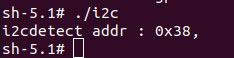

### 2.2.3 SPI

魔方派3适配了 WiringRP（基于高性能 GPIO 编程库 WiringPi），推荐使用 WiringRP 来控制 SPI，和对 SPI 编程。关于 WiringRP 详细信息可访问 https://github.com/rubikpi-ai/WiringRP  查看。

#### 2.2.3.1 引脚分布

下图是魔方派3 40-pin 连接器的引脚默认功能，其中大部分引脚和树梅派 40-pin 连接器引脚的默认功能兼容。


:::note
19 号、21 号、23 号、24 号引脚默认已设置配为 SPI。
:::

下表是 40-pin 连接器支持的所有功能，图中蓝色字体表明默认功能。


#### 2.2.3.2 使用 WiringRP (C) SPI 通信

WiringRP 库中提供了一系列的 API 函数，用更少的逻辑实现控制。

* 以下代码示例，代码使用 SPI 总线进行数据收发通信：

  ```c showLineNumbers
  #include <wiringPi.h>
  #include <stdio.h>
  #include <stdlib.h>

  int main(void)
  {
      int fd;
      unsigned char send_data[64] =  "hello world!";
      unsigned char read_data[64];

      if(wiringPiSetup() == -1)
          exit(1);

      fd = wiringPiSPISetup(0, 1000000);
      if(fd < 0)
          exit(2);

          printf("\rtx_buffer: \n %s\n ", send_data);
      // Send and receive data
      if(wiringPiSPIDataRW(0, send_data, sizeof(send_data)) < 0)
          exit(3);
          printf("\rtx_buffer: \n %s\n ", send_data);


      return 0;
  }
  ```
* 编译程序

  * 在魔方派3中编译

    ```shell showLineNumbers
    adb push spi.c /opt
    adb shell
    cd /opt
    gcc spi.c -o i2c -lwiringPi
    ```
* 将 19 号引脚和 21 号引脚使用杜邦线短接，验证 SPI 总线通信，如下图所示：

  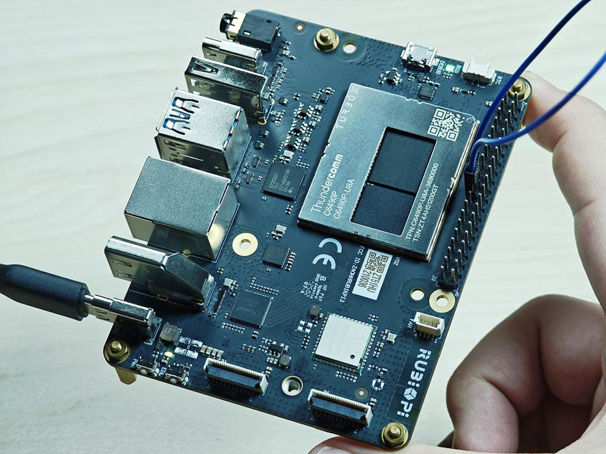

  运行如下命令：

  ```shell showLineNumbers
  cd /opt
  ./spi
  ```

  程序执行结果如下：

  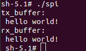

#### 2.2.3.3 使用 WiringRP-Python SPI通信

WiringRP 库中提供了一系列的 API 函数，用更少的逻辑实现控制。

* 以下代码示例，代码使用 SPI 总线进行数据收发通信：

  ```bash showLineNumbers
  import wiringpi as wpi                                                    

  wpi.wiringPiSetup()                                                       

  wpi.wiringPiSPISetup(0, 8000000)                                          

  tx_buffer = bytes([72, 101, 108, 108, 111])                               
  print("tx_buffer:\n\r ", tx_buffer)                                       
  retlen, rx_buffer = wpi.wiringPiSPIDataRW(0, tx_buffer)                   
  print("rx_buffer:\n\r ", rx_buffer)                                       

  ```
* &#x5C06;*&#x20;spi.py&#x20;*&#x4F20;输到魔方派3中，如使用 ADB 传输。

  ```shell showLineNumbers
  adb push spi.py /opt
  ```
* 将 19 号引脚和 21 号引脚使用杜邦线短接，验证 SPI 总线通信，如下图所示：

  

  运行如下命令：

  ```shell showLineNumbers
   python3 spi.py 
  ```

  程序执行结果如下：

  

#### 2.2.3.4 使用 Python 程序 SPI 通信

* 可使用 Python 的 spidev 库进行 SPI 通信，spidev 库可在魔方派3中使用下面命令进行安装：

  ```shell showLineNumbers
  pip3 install spidev
  ```
* 以下代码示例，代码使用 SPI 总线进行数据收发通信：

  ```python showLineNumbers
  import spidev

  def main():
      tx_buffer = [ord(char) for char in "hello world!"]
      rx_buffer = [0] * len(tx_buffer)

      try:
          spi = spidev.SpiDev()
          spi.open(12, 0)
          spi.max_speed_hz = 1000000  

          rx_buffer = spi.xfer2(tx_buffer[:])
          print("tx_buffer:\n\r", ''.join(map(chr, tx_buffer)))
          print("rx_buffer:\n\r", ''.join(map(chr, rx_buffer)))

      except Exception as e:
          print(f"An error occurred: {e}")

      finally:
          if spi:
              spi.close()

  if __name__ == "__main__":
      main()
  ```
* 将 *spi.py&#x20;*&#x4F20;输到魔方派3中，如果使用 ADB 传输，命令如下：

  ```shell showLineNumbers
  adb push spi.py /opt
  ```
* 将 19 号引脚和 21 号引脚使用杜邦线短接，验证 SPI 总线通信，如下图所示：

  

  运行如下命令：

  ```shell showLineNumbers
   python3 spi.py 
  ```

  程序执行结果如下：

  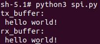

#### 2.2.3.5 使用 C 语言程序 SPI 通信

* 以下代码示例，代码使用 SPI 总线进行数据收发通信：

  ```c showLineNumbers
  #include <stdio.h>
  #include <stdlib.h>
  #include <stdint.h>
  #include <fcntl.h>
  #include <unistd.h>
  #include <linux/spi/spidev.h>
  #include <sys/ioctl.h>

  #define SPI_DEVICE_PATH "/dev/spidev12.0"

  int main() {
      int spi_file;
      uint8_t tx_buffer[50] = "hello world!";
      uint8_t rx_buffer[50];

      // Open the SPI device
      if ((spi_file = open(SPI_DEVICE_PATH, O_RDWR)) < 0) {
          perror("Failed to open SPI device");
          return -1;
      }

      // Configure SPI mode and bits per word
      uint8_t mode = SPI_MODE_0;
      uint8_t bits = 8;
      if (ioctl(spi_file, SPI_IOC_WR_MODE, &mode) < 0) {
          perror("Failed to set SPI mode");
          close(spi_file);
          return -1;
      }
      if (ioctl(spi_file, SPI_IOC_WR_BITS_PER_WORD, &bits) < 0) {
          perror("Failed to set SPI bits per word");
          close(spi_file);
          return -1;
      }

      // Perform SPI transfer
      struct spi_ioc_transfer transfer = {
          .tx_buf = (unsigned long)tx_buffer,
          .rx_buf = (unsigned long)rx_buffer,
          .len = sizeof(tx_buffer),
          .delay_usecs = 0,
          .speed_hz = 1000000,  // SPI speed in Hz
          .bits_per_word = 8,
      };

      if (ioctl(spi_file, SPI_IOC_MESSAGE(1), &transfer) < 0) {
          perror("Failed to perform SPI transfer");
          close(spi_file);
          return -1;
      }

       /* Print tx_buffer and rx_buffer*/
      printf("\rtx_buffer: \n %s\n ", tx_buffer);
      printf("\rrx_buffer: \n %s\n ", rx_buffer);

      // Close the SPI device
      close(spi_file);

      return 0;
  }
  ```
* 编译程序：

  * 交叉编译，具体可参考 [1.11.3 交叉编译工具使用方法](/rubik-pi-3/cn/docs/rubik-pi-3-user-manual/1.1.0/quick-start#1113-交叉编译工具使用方法)章节：

    ```shell showLineNumbers
    aarch64-qcom-linux-gcc spi.c -o spi --sysroot=/home/zhy/qcom_sdk_meta/sysroots/armv8-2a-qcom-linux/
    ```
  * 在魔方派3中编译

    ```c showLineNumbers
    adb push spi.c /opt
    adb shell
    cd /opt
    gcc spi.c -o spi
    ```
  * 若使用的交叉编译，需要将 spi 传输到魔方派3中，如果使用 ADB 传输，命令如下：

    ```shell showLineNumbers
    adb push spi /opt
    ```
* 将 19 号引脚和 21 号引脚使用杜邦线短接，验证 SPI 总线通信，如下图所示：

  

  运行如下命令：

  ```shell showLineNumbers
  cd /opt
  ./spi
  ```

  程序执行结果如下：

  

### 2.2.4 UART

魔方派3适配了 WiringRP（基于高性能 GPIO 编程库 WiringPi），推荐使用 WiringRP 来控制 UART，和对 UART 编程。关于 WiringRP 详细信息可访问 https://github.com/rubikpi-ai/WiringRP 查看。

#### 2.2.4.1 引脚分布

下图是魔方派3 40-pin 连接器的引脚默认功能，其中大部分引脚和树梅派 40-pin 连接器引脚的默认功能兼容。


:::note
8 号和 10 号引脚默认已设置配为 UART，设备节点为 */dev/ttyHS3*。
:::

下表是 40-pin 连接器支持的所有功能，图中蓝色字体表明默认功能。


#### 2.2.4.2 使用 shell 命令测试

在魔方派3中 使用下面命令控制串口通信

* 使用 stty 工具配置串口，如下将串口的输入速率和输出速率都设置为 115200，并关闭回显：

  ```shell showLineNumbers
  stty -F /dev/ttyHS3 ispeed 115200 ospeed 115200
  stty -F /dev/ttyHS3 -echo
  ```
* 在魔方派3上开启两个终端，将 8 号引脚和 10 号引脚使用杜邦线短接，分别执行下面命令，接收端会回显发送端的内容：

  ```shell showLineNumbers
  echo "hello world!" > /dev/ttyHS3  # 发送端
  cat /dev/ttyHS3 # 接收端
  ```

  

#### 2.2.4.3 使用 WiringRP (C) UART通信

WiringRP 库中提供了一系列的 API 函数，用更少的逻辑实现控制。

* 以下代码示例，使用UART进行数据收发通信：

  ```c showLineNumbers
  #include <stdio.h>
  #include <string.h>
  #include <errno.h>

  #include <wiringPi.h>
  #include <wiringSerial.h>

  int main ()
  {
    int fd ;
    int count ;
    unsigned int nextTime ;

    if ((fd = serialOpen ("/dev/ttyHS3", 115200)) < 0)
    {
      fprintf (stderr, "Unable to open serial device: %s\n", strerror (errno)) ;
      return 1 ;
    }

    if (wiringPiSetup () == -1)
    {
      fprintf (stdout, "Unable to start wiringPi: %s\n", strerror (errno)) ;
      return 1 ;
    }


    char tx_buffer[] = "hello world!\n";
    for (count = 0 ; count < sizeof(tx_buffer) ; count++)
    {
      serialPutchar (fd, tx_buffer[count]) ;
      delay (3) ;
      printf ("%c", serialGetchar (fd)) ;
    }
    printf ("\n") ;

    return 0 ;
  }
  ```
* 编译程序：

  * 在魔方派3中编译

    ```shell showLineNumbers
    adb push uart.c /opt
    adb shell
    cd /opt
    gcc uart.c -o uart
    ```
* 将 8 号引脚和 10 号引脚使用杜邦线短接，验证串口通信，如下图所示：

  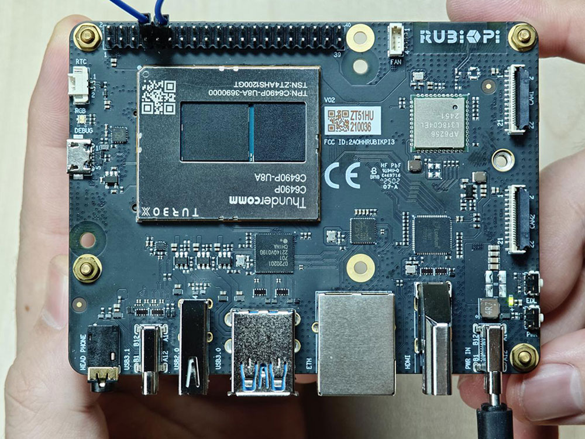

  运行如下命令：

  ```shell showLineNumbers
  cd /opt
  ./uart
  ```

  程序执行结果如下：

  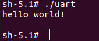

#### 2.2.4.4 使用 WiringRP-Python UART 通信

WiringRP 库中提供了一系列的 API 函数，用更少的逻辑实现控制。

* 以下代码示例，使用 UART 进行数据收发通信：

  ```bash showLineNumbers
  import wiringpi

  serial = wiringpi.serialOpen('/dev/ttyHS3', 115200)

  wiringpi.serialPuts(serial, "hello world")

  received_data = []
  c = wiringpi.serialGetchar(serial);
  received_data.append(chr(c))

  cnt = wiringpi.serialDataAvail(serial);
  for i in range(cnt):
      c = wiringpi.serialGetchar(serial);
      received_data.append(chr(c))

  print("Received:", received_data)

  wiringpi.serialClose(serial)

  ```
* 将 *uart.py&#x20;*&#x4F20;输到魔方派3中，如果使用 ADB 传输，命令如下：

  ```shell showLineNumbers
  adb push uart.py /opt
  ```
* 将 8 号引脚和 10 号引脚使用杜邦线短接，验证串口通信，如下图所示：

  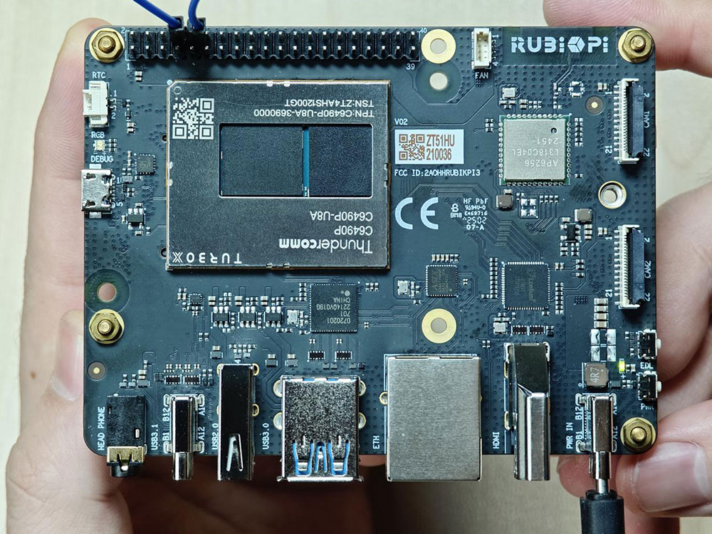

运行如下命令：

```shell showLineNumbers
cd /opt
python3 uart.py 
```

程序执行结果如下：

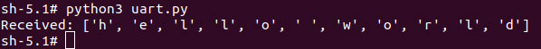

#### 2.2.4.5 使用 Python 程序 UART 通信

* 可使用 Python 的 serial 库进行 UART 通信，可在魔方派3中使用下面命令进行安装：

  ```shell showLineNumbers
  pip3 install pyserial
  ```
* 以下代码示例，使用 UART 进行数据收发通信：

  ```python showLineNumbers
  import serial
  import time

  with serial.Serial(
      "/dev/ttyHS3",
      baudrate=115200,
      bytesize=serial.EIGHTBITS,
      stopbits=serial.STOPBITS_ONE,
      parity=serial.PARITY_NONE,
      timeout=1,

  ) as uart3:
      uart3.write(b"Hello World!\n")
      buf = uart3.read(128)
      print("Raw data:\n", buf)
      data_strings = buf.decode("utf-8")
      print("Read {:d} bytes, printed as string:\n {:s}".format(len(buf), data_strings))
  ```
* 将 *uart.py&#x20;*&#x4F20;输到魔方派3中，如果使用 ADB 传输，命令如下：

  ```shell showLineNumbers
  adb push uart.py /opt
  ```
* 将 8 号引脚和 10 号引脚使用杜邦线短接，验证串口通信，如下图所示

  

运行如下命令：

```shell showLineNumbers
python3 uart.py 
```

程序执行结果如下：

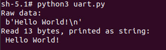

#### 2.2.4.6 使用 C 语言程序 UART 通信

* 以下代码示例，使用 UART 进行数据收发通信：

  ```c showLineNumbers
  #include <stdio.h>
  #include <stdlib.h>
  #include <string.h>
  #include <fcntl.h>
  #include <termios.h>
  #include <unistd.h>

  int main() {
      int serial_port_num = 3;
      char serial_port[15];

      sprintf(serial_port,"/dev/ttyHS%d",serial_port_num);
      int serial_fd;

      serial_fd = open(serial_port, O_RDWR | O_NOCTTY);
      if (serial_fd == -1) {
          perror("Failed to open serial port");
          return 1;
      }

      struct termios tty;
      memset(&tty, 0, sizeof(tty));

      if (tcgetattr(serial_fd, &tty) != 0) {
          perror("Error from tcgetattr");
          return 1;
      }

      cfsetospeed(&tty, B9600);
      cfsetispeed(&tty, B9600);

      tty.c_cflag &= ~PARENB;
      tty.c_cflag &= ~CSTOPB;
      tty.c_cflag &= ~CSIZE;
      tty.c_cflag |= CS8;

      if (tcsetattr(serial_fd, TCSANOW, &tty) != 0) {
          perror("Error from tcsetattr");
          return 1;
      }

      char tx_buffer[] = "hello world!\n";
      ssize_t bytes_written = write(serial_fd, tx_buffer, sizeof(tx_buffer));
      if (bytes_written < 0) {
          perror("Error writing to serial port");
          close(serial_fd);
          return 1;
      }
      printf("\rtx_buffer: \n %s ", tx_buffer);

      char rx_buffer[256];
      int bytes_read = read(serial_fd, rx_buffer, sizeof(rx_buffer));
      if (bytes_read > 0) {
          rx_buffer[bytes_read] = '\0';
          printf("\rrx_buffer: \n %s ", rx_buffer);
      } else {
          printf("No data received.\n");
      }

      close(serial_fd);

      return 0;
  }

  ```
* 编译程序：

  * 交叉编译，具体可参考[1.11.3交叉编译工具使用方法](/rubik-pi-3/cn/docs/rubik-pi-3-user-manual/1.1.0/quick-start#1113-交叉编译工具使用方法)章节：

    ```shell showLineNumbers
    aarch64-qcom-linux-gcc uart.c -o uart --sysroot=/home/zhy/qcom_sdk_meta/sysroots/armv8-2a-qcom-linux/
    ```
  * 在魔方派3中编译

    ```shell showLineNumbers
    adb push uart.c /opt
    adb shell
    cd /opt
    gcc uart.c -o uart
    ```

    若使用交叉编译，需要将 *uart&#x20;*&#x4F20;输到魔方派3中，如果使用 ADB 传输，命令如下：

    ```shell showLineNumbers
    adb push uart /opt
    ```
* 将 8 号引脚和 10 号引脚使用杜邦线短接，验证串口通信，如下图所示

  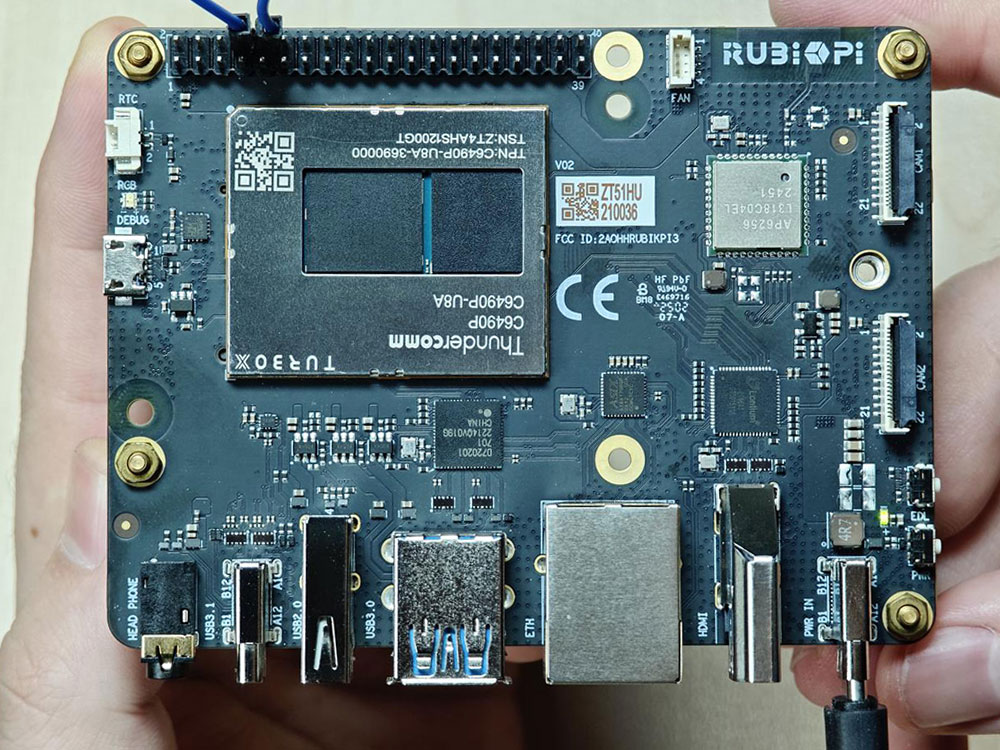

  运行如下命令：

  ```shell showLineNumbers

  cd /opt
  ./uart

  ```

  程序执行结果如下：

  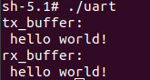

## 2.3 USB

魔方派3拥有 4 个 USB 口：

* 两个 USB 3.0 口，只能作为主机模式使用，如下图 7。
* 一个 USB 2.0 口，可以作为主机或设备模式使用，如下图 6。
* 一个 USB 3.1 Gen 1 口，可以作为主机或设备模式，以及 DP 显示使用，如下图 5。

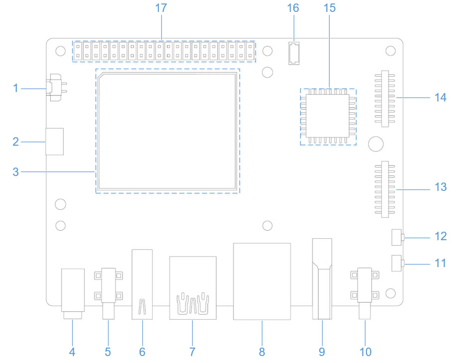

### 2.3.1 USB 2.0 Type-A 接口

USB 2.0 接口作为 device 模式时需要手动执行命令切换，如下为一种切换方式，在魔方派3中输入下面命令，将魔方派3模拟为 U 盘：

```shell showLineNumbers
cd /sys/kernel/config/usb_gadget/  #在串口终端登录，执行下面命令
mkdir g1
cd g1
mkdir functions/mass_storage.0
dd if=/dev/zero of=/tmp/test.iso bs=1M count=2048  #创建大小为2G的U盘空间
mkfs.ext4 /tmp/test.iso 
echo "/tmp/test.iso" > functions/mass_storage.0/lun.0/file
mkdir configs/c.1
ln -s functions/mass_storage.0/ configs/c.1/f3
mount -t debugfs none /sys/kernel/debug/

echo device > /sys/kernel/debug/usb/8c00000.usb/qcom_usb2_0_mode  #将USB切换为device模式
echo 8c00000.usb > UDC #连接USB线，U盘被识别 可在U盘内写入和写出文件


echo host > /sys/kernel/debug/usb/8c00000.usb/qcom_usb2_0_mode  #拔掉USB线，切换为主机模式
```

### 2.3.2 USB 3.1 Type-C 接口

Type-C 接口可自动完成主机和设备模式的切换。

* 当 Type-C 接入 PC 时自动切换为设备模式。
* 接入 OTG 线时自动切换为主机模式。
* 接入 DP 显示器时，自动输出 DP 视频信号。

### 2.3.3 USB 调试

本节提供有关获取调试日志的各种方法的信息。调试方式有 `regdumps` 、调试 `ftraces` 、 `configfs` 节点等。在调试与进入/退出低功耗模式、SMMU 故障、无时钟访问相关的问题时，可通过上述日志查看事件和控制器状态的详细信息。

* USB 2.0 Type-A 设备路径：*&#x20;/sys/devices/platform/soc@0/**8c00000**.usb/xhci-hcd.0.auto/usb1*
* USB 3.0 Type-A 设备路径：

  * */sys/devices/platform/soc@0/**1c00000**.pci/pci0000:00/0000:00:00.0/0000:**01:00.0**/usb2*
  * */sys/devices/platform/soc@0/**1c00000**.pci/pci0000:00/0000:00:00.0/0000:**01:00.0**/usb3*
* USB 3.1 Type-C 设备路径：*/sys/devices/platform/soc@0/**a600000**.usb*&#x20;

#### 2.3.3.1 USB 跟踪

使用 `debugfs` 跟踪可以更加深入地了解 USB 线上发生的每一个事务。如需查看跟踪列表，可运行以下命令。

:::warning
确保已挂载 `debugfs`。如果尚未挂载，可运行以下命令来挂载 `debugfs`:

`mount -t debugfs none /sys/kernel/debug`
:::

```shell showLineNumbers
ls /sys/kernel/debug/tracing/events/dwc3
```

以下是可用于验证 xHCI/gadget 协议栈/USB Type-C 连接器系统软件接口 (UCSI) 中的数据传输的跟踪。

```shell showLineNumbers
dwc3_alloc_request  dwc3_event              dwc3_gadget_generic_cmd  enable
dwc3_complete_trb   dwc3_free_request       dwc3_gadget_giveback     filter
dwc3_ctrl_req       dwc3_gadget_ep_cmd      dwc3_prepare_trb
dwc3_ep_dequeue     dwc3_gadget_ep_disable  dwc3_readl
dwc3_ep_queue       dwc3_gadget_ep_enable   dwc3_writel
```

要列出 xHCI/主机控制器驱动程序 (HCD) 中的跟踪数据，请运行以下命令。

```shell showLineNumbers
ls /sys/kernel/debug/tracing/events/xhci-hcd
```

以下是可用于验证 xHCI/HCD 中数据传输的跟踪。

```shell showLineNumbers
enable                            xhci_handle_cmd_config_ep
filter                            xhci_handle_cmd_disable_slot
  xhci_add_endpoint                 xhci_handle_cmd_reset_dev
  xhci_address_ctrl_ctx             xhci_handle_cmd_reset_ep
  xhci_address_ctx                  xhci_handle_cmd_set_deq
  xhci_alloc_dev                    xhci_handle_cmd_set_deq_ep
  xhci_alloc_virt_device            xhci_handle_cmd_stop_ep
  xhci_configure_endpoint           xhci_handle_command
  xhci_configure_endpoint_ctrl_ctx  xhci_handle_event
  xhci_dbc_alloc_request            xhci_handle_port_status
  xhci_dbc_free_request             xhci_handle_transfer
  xhci_dbc_gadget_ep_queue          xhci_hub_status_data
  xhci_dbc_giveback_request         xhci_inc_deq
  xhci_dbc_handle_event             xhci_inc_enq
  xhci_dbc_handle_transfer          xhci_queue_trb
  xhci_dbc_queue_request            xhci_ring_alloc
  xhci_dbg_address                  xhci_ring_ep_doorbell
  xhci_dbg_cancel_urb               xhci_ring_expansion
  xhci_dbg_context_change           xhci_ring_free
  xhci_dbg_init                     xhci_ring_host_doorbell
  xhci_dbg_quirks                   xhci_setup_addressable_virt_device
  xhci_dbg_reset_ep                 xhci_setup_device
  xhci_dbg_ring_expansion           xhci_setup_device_slot
  xhci_discover_or_reset_device     xhci_stop_device
  xhci_free_dev                     xhci_urb_dequeue
  xhci_free_virt_device             xhci_urb_enqueue
  xhci_get_port_status              xhci_urb_giveback
  xhci_handle_cmd_addr_dev
```

请运行以下命令，以便列出 USB 视频类 (UVC) gadget 驱动程序的可用事件。

```shell showLineNumbers
ls /sys/kernel/debug/tracing/events/gadget
```

随即显示以下输出。

```shell showLineNumbers
enable                      usb_gadget_activate
  filter                      usb_gadget_clear_selfpowered
  usb_ep_alloc_request        usb_gadget_connect
  usb_ep_clear_halt           usb_gadget_deactivate
  usb_ep_dequeue              usb_gadget_disconnect
  usb_ep_disable              usb_gadget_frame_number
  usb_ep_enable               usb_gadget_giveback_request
  usb_ep_fifo_flush           usb_gadget_set_remote_wakeup
  usb_ep_fifo_status          usb_gadget_set_selfpowered
  usb_ep_free_request         usb_gadget_vbus_connect
  usb_ep_queue                usb_gadget_vbus_disconnect
  usb_ep_set_halt             usb_gadget_vbus_draw
  usb_ep_set_maxpacket_limit  usb_gadget_wakeup
  usb_ep_set_wedge
```

如需列出 UCSI 驱动程序中的可用事件，可运行以下命令。

```shell showLineNumbers
ls /sys/kernel/debug/tracing/events/ucsi
```

随即显示以下输出。

```shell showLineNumbers
enable  ucsi_connector_change  ucsi_register_port  ucsi_run_command
filter  ucsi_register_altmode  ucsi_reset_ppm
```

#### 2.3.3.2 USB 寄存器打印

USB `debugfs` 提供以下信息，下面以 Type-C 接口为例。

* 工作模式

  ```shell showLineNumbers
  cat /sys/kernel/debug/usb/a600000.usb/mode # Type-C 接口
  ```

  :::note
  USB 2.0 Type-A 的工作模式 `cat /sys/kernel/debug/usb/8c00000.usb/qcom_usb2_0_mode`
  :::

  示例输出：

  ```shell showLineNumbers
  device
  ```
* 设备模式下所有端点的状态和传输环形缓冲区 (TRB) 队列。
* 当前链路状态。

  ```shell showLineNumbers
  cat /sys/kernel/debug/usb/a600000.usb/link_state
  ```

  示例输出&#x20;

  ```shell showLineNumbers
  Sleep
  ```
* 列出处理器 (LSP) dump。

  ```shell showLineNumbers
  cat /sys/kernel/debug/usb/a600000.usb/lsp_dump
  ```

  示例输出：

  ```shell showLineNumbers
  GDBGLSP[0] = 0x40000000
  GDBGLSP[1] = 0x00003a80
  GDBGLSP[2] = 0x38200000
  GDBGLSP[3] = 0x00802000
  GDBGLSP[4] = 0x126f1000
  GDBGLSP[5] = 0x3a800018
  GDBGLSP[6] = 0x00000a80
  GDBGLSP[7] = 0xfc03f14a
  GDBGLSP[8] = 0x0b803fff
  GDBGLSP[9] = 0x00000000
  GDBGLSP[10] = 0x000000f8
  GDBGLSP[11] = 0x000000f8
  GDBGLSP[12] = 0x000000f8
  GDBGLSP[13] = 0x000000f8
  GDBGLSP[14] = 0x000000f8
  GDBGLSP[15] = 0x000000f8
  ```

```shell showLineNumbers
ls /sys/kernel/debug/usb/a600000.usb
```

示例输出：

```shell showLineNumbers
ep0in    ep11out  ep14in   ep1out  ep4in   ep6out  ep9in       regdump
ep0out   ep12in   ep14out  ep2in   ep4out  ep7in   ep9out      testmode
ep10in   ep12out  ep15in   ep2out  ep5in   ep7out  link_state
ep10out  ep13in   ep15out  ep3in   ep5out  ep8in   lsp_dump
ep11in   ep13out  ep1in    ep3out  ep6in   ep8out  mode
```

`regdump` 命令提供以下寄存器的寄存器空间的当前状态：&#x20;

* 设备模式的寄存器，例如 DCTL、DSTS 和 DCFG
* 全局寄存器，例如 GCTL 和 GSTS

```shell showLineNumbers
cd /sys/kernel/debug/usb/a600000.usb
cat regdump
```

示例输出：

```shell showLineNumbers
GSBUSCFG0 = 0x2222000e
GSBUSCFG1 = 0x00001700
GTXTHRCFG = 0x00000000
GRXTHRCFG = 0x00000000
GCTL = 0x00102000
GEVTEN = 0x00000000
GSTS = 0x7e800000
GUCTL1 = 0x810c1802
GSNPSID = 0x5533330a
GGPIO = 0x00000000
GUID = 0x00060500
GUCTL = 0x0d00c010
GBUSERRADDR0 = 0x00000000
GBUSERRADDR1 = 0x00000000
GPRTBIMAP0 = 0x00000000
GPRTBIMAP1 = 0x00000000
GHWPARAMS0 = 0x4020400a
GDBGFIFOSPACE = 0x00420000
GDBGLTSSM = 0x41090658
GDBGBMU = 0x20300000
GPRTBIMAP_HS0 = 0x00000000
GPRTBIMAP_HS1 = 0x00000000
GPRTBIMAP_FS0 = 0x00000000
GPRTBIMAP_FS1 = 0x00000000
GUCTL2 = 0x0198440d
VER_NUMBER = 0x00000000
VER_TYPE = 0x00000000
GUSB2PHYCFG(0) = 0x00002400
GUSB2I2CCTL(0) = 0x00000000
GUSB2PHYACC(0) = 0x00000000
GUSB3PIPECTL(0) = 0x030e0002
GTXFIFOSIZ(0) = 0x00000042
GRXFIFOSIZ(0) = 0x00000305
GEVNTADRLO(0) = 0xfffff000
GEVNTADRHI(0) = 0x0000000f
GEVNTSIZ(0) = 0x00001000
GEVNTCOUNT(0) = 0x00000000
GHWPARAMS8 = 0x000007ea
GUCTL3 = 0x00010000
GFLADJ = 0x8c80c8a0
DCFG = 0x00cc08b4
DCTL = 0x8cf00a00
DEVTEN = 0x00000257
DSTS = 0x008a5200
DGCMDPAR = 0x00000000
DGCMD = 0x00000000
DALEPENA = 0x0000000f
DEPCMDPAR2(0) = 0x00000000
DEPCMDPAR1(0) = 0xffffe000
DEPCMDPAR0(0) = 0x0000000f
DEPCMD(0) = 0x00000006
OCFG = 0x00000000
OCTL = 0x00000000
OEVT = 0x00000000
OEVTEN = 0x00000000
OSTS = 0x00000000
```

#### 2.3.3.3 主机 sysfs 查询

要查看总线详细信息，请运行以下命令。

```shell showLineNumbers
lsub
```

示例输出：

```shell showLineNumbers
Bus 002 Device 001: ID 1d6b:0003 Linux Foundation 3.0 root hub
Bus 001 Device 002: ID 03f0:134a HP, Inc Optical Mouse
Bus 001 Device 001: ID 1d6b:0002 Linux Foundation 2.0 root hub
```

请运行以下命令，以便列出当前目录的内容。

```shell showLineNumbers
cd /sys/bus/usb/devices/
ls
```

示例输出：

```shell showLineNumbers
1-0:1.0  1-1  1-1:1.0  2-0:1.0  usb1  usb2
```

要查看有关 USB 设备的详细信息，请运行以下命令。

```shell showLineNumbers
cat /sys/kernel/debug/usb/devices
```

示例输出：

```shell showLineNumbers
T:  Bus=01 Lev=00 Prnt=00 Port=00 Cnt=00 Dev#=  1 Spd=480  MxCh= 1
B:  Alloc=  0/800 us ( 0%), #Int=  0, #Iso=  0
D:  Ver= 2.00 Cls=09(hub  ) Sub=00 Prot=01 MxPS=64 #Cfgs=  1
P:  Vendor=1d6b ProdID=0002 Rev= 6.05
S:  Manufacturer=Linux 6.5.0-rc4 xhci-hcd
S:  Product=xHCI Host Controller
S:  SerialNumber=xhci-hcd.0.auto
C:* #Ifs= 1 Cfg#= 1 Atr=e0 MxPwr=  0mA
I:* If#= 0 Alt= 0 #EPs= 1 Cls=09(hub  ) Sub=00 Prot=00 Driver=hub
E:  Ad=81(I) Atr=03(Int.) MxPS=   4 Ivl=256ms

T:  Bus=01 Lev=01 Prnt=01 Port=00 Cnt=01 Dev#=  2 Spd=1.5  MxCh= 0
D:  Ver= 2.00 Cls=00(>ifc ) Sub=00 Prot=00 MxPS= 8 #Cfgs=  1
P:  Vendor=03f0 ProdID=134a Rev= 1.00
S:  Manufacturer=PixArt
S:  Product=HP USB Optical Mouse
C:* #Ifs= 1 Cfg#= 1 Atr=a0 MxPwr=100mA
I:* If#= 0 Alt= 0 #EPs= 1 Cls=03(HID  ) Sub=01 Prot=02 Driver=usbhid
E:  Ad=81(I) Atr=03(Int.) MxPS=   4 Ivl=10ms

T:  Bus=02 Lev=00 Prnt=00 Port=00 Cnt=00 Dev#=  1 Spd=5000 MxCh= 1
B:  Alloc=  0/800 us ( 0%), #Int=  0, #Iso=  0
D:  Ver= 3.00 Cls=09(hub  ) Sub=00 Prot=03 MxPS= 9 #Cfgs=  1
P:  Vendor=1d6b ProdID=0003 Rev= 6.05
S:  Manufacturer=Linux 6.5.0-rc4 xhci-hcd
S:  Product=xHCI Host Controller
S:  SerialNumber=xhci-hcd.0.auto
C:* #Ifs= 1 Cfg#= 1 Atr=e0 MxPwr=  0mA
I:* If#= 0 Alt= 0 #EPs= 1 Cls=09(hub  ) Sub=00 Prot=00 Driver=hub
E:  Ad=81(I) Atr=03(Int.) MxPS=   4 Ivl=256ms
```

## 2.4 CSI

目前魔方派3已经兼容树莓派官方的三款摄像头。下表显示了每个摄像头模块支持的分辨率：

| 分辨率      | 宽高比 | IMX477 | IMX708 | IMX219 |
| ----------- | ------ | ------ | ------ | ------ |
| 4056 x 3040 | 4:3    | 是     | 否     | 否     |
| 4608 x 2592 | 16:9   | 否     | 是     | 否     |
| 3280 x 2464 | 4:3    | 否     | 否     | 是     |
| 1920 x 1080 | 16:9   | 是     | 否     | 否     |
| 1632 x 1224 | 4:3    | 否     | 否     | 是     |

* Raspberry Pi High Quality Camera（IMX477/M12 Mount）[购买链接](https://www.raspberrypi.com/products/raspberry-pi-high-quality-camera/)

  在 [魔方派3 QIM](/rubik-pi-3/cn/docs/rubik-pi-3-user-manual/1.1.0/qim.md) 官方演示中，IMX477 摄像头使用了 WS1053516 镜头。

  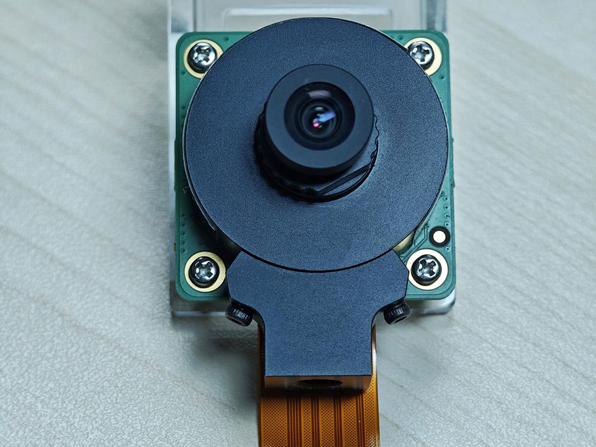
* Raspberry Pi Camera Module 2 (IMX219) [购买链接](https://www.raspberrypi.com/products/camera-module-v2/)

  :::note
  目前魔方派3暂时只支持标准版 Module 2 摄像头，不支持广角（Wide）、夜光（NoIR）版本。
  :::
* Raspberry Pi Camera Module 3 (IMX708) [购买链接](https://www.raspberrypi.com/products/camera-module-3/)

  :::note
  目前魔方派3暂时只支持标准版 Module 3 摄像头，不支持广角（Wide）、夜光（NoIR）版本。当前软件版本暂不支持 Module 3 摄像头的 AF 自动对焦功能。
  :::

### 2.4.1 摄像头排线安装

魔方派3支持的摄像头 FPC 为 22 pin，0.5mm 间距，厚度 0.3±0.05mm。可以兼容 [树莓派 5 同规格摄像头FPC](https://www.raspberrypi.com/products/camera-cable/)。


1. 向上拉开连接器的锁扣部分：

   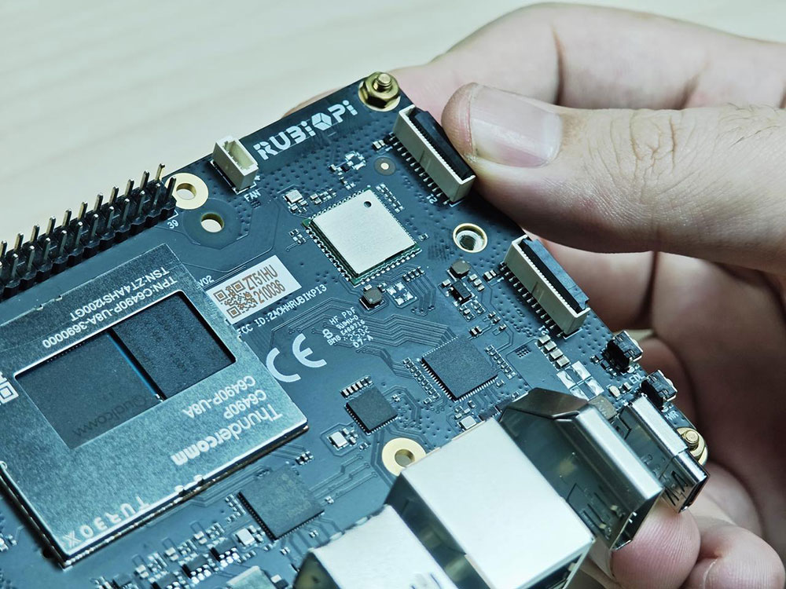
2. 插入 FPC，注意接触面朝向板内：

   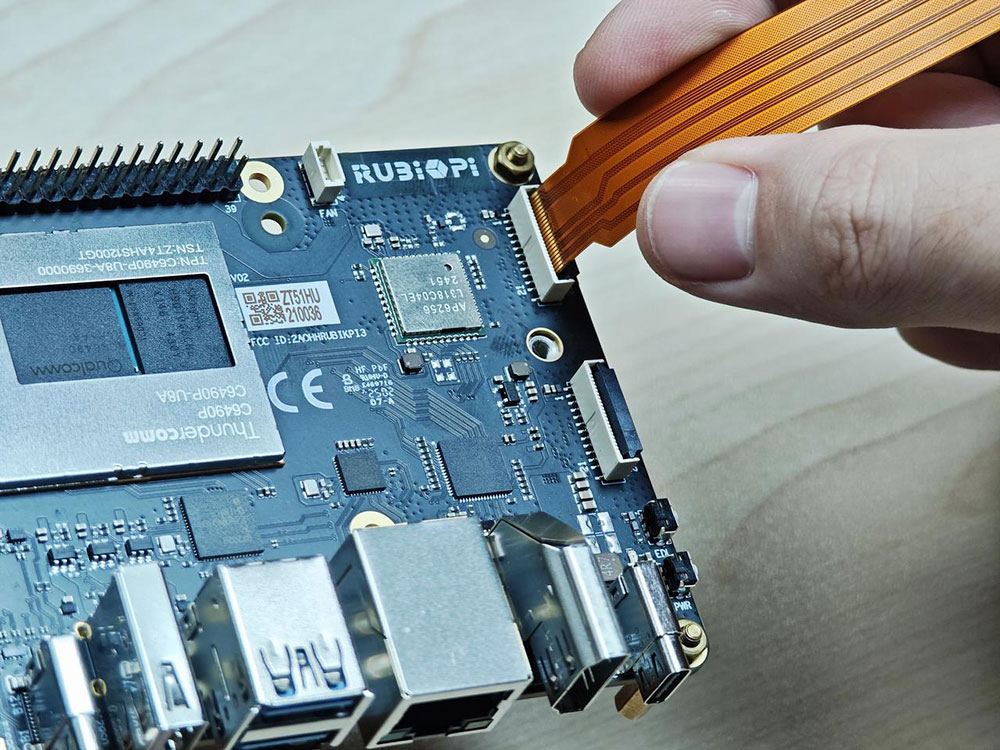
3. 按下锁扣，确认 FPC 稳定没有松动：

   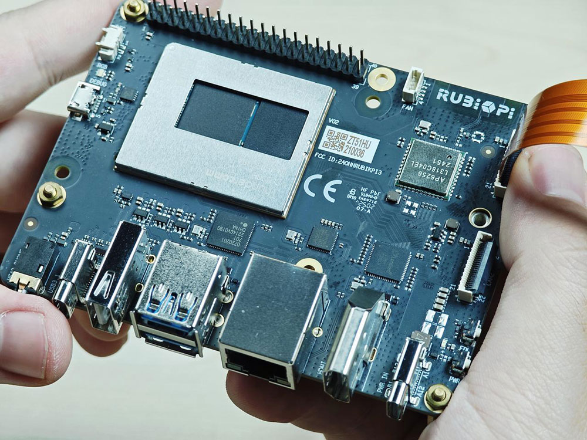

### 2.4.2 摄像头使用方法

在魔方派3中可使用 `gstreamer` 命令对摄像头进行操作，操作前需输入下面命令对摄像头进行设置：

```shell showLineNumbers
echo multiCameraLogicalXMLFile=kodiak_dc.xml > /var/cache/camera/camxoverridesettings.txt
echo enableNCSService=FALSE >> /var/cache/camera/camxoverridesettings.txt
```

可使用下面的命令关闭或打开摄像头相关的日志，执行完命令后重启设备生效

默认值：

* `logWarningMask:0xFFFFFFFFFFFFFFFF`
* `logCoreCfgMask:0xFFFFFFFFFFFFFFFF`

```shell showLineNumbers
echo logWarningMask=0x00 >> /var/cache/camera/camxoverridesettings.txt
echo logCoreCfgMask=0x00 >> /var/cache/camera/camxoverridesettings.txt
```

可将摄像头插入，下图 13 和 14 处


如下为实物连接图：

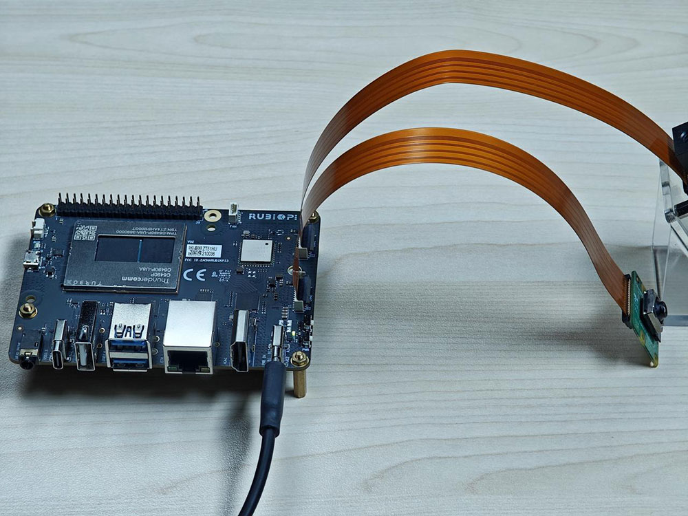

:::warning
暂时无法支持两个 IMX708 4608x2592同时运行。
:::

* 在魔方派3中使用下面命令测试单个摄像头全屏预览：

  ```shell showLineNumbers
  export XDG_RUNTIME_DIR=/dev/socket/weston
  export WAYLAND_DISPLAY=wayland-1
  setprop persist.overlay.use_c2d_blit 2
  gst-launch-1.0 -e qtiqmmfsrc camera=0 name=camsrc ! video/x-raw\(memory:GBM\),format=NV12,width=1920,height=1080,framerate=30/1,compression=ubwc ! queue ! waylandsink fullscreen=true async=true
  ```

预览结果如下图所示：


* 在魔方派3中使用下面命令测试两摄像头并发预览：

  ```shell showLineNumbers
  # 终端1
  export XDG_RUNTIME_DIR=/dev/socket/weston
  export WAYLAND_DISPLAY=wayland-1
  setprop persist.overlay.use_c2d_blit 2
  gst-launch-1.0 -e qtiqmmfsrc camera=0 name=camsrc ! video/x-raw\(memory:GBM\),format=NV12,width=1920,height=1080,framerate=30/1,compression=ubwc ! queue ! waylandsink sync=false x=0 y=0 width=960 height=540 enable-last-sample=false

  # 终端2
  export XDG_RUNTIME_DIR=/dev/socket/weston
  export WAYLAND_DISPLAY=wayland-1
  setprop persist.overlay.use_c2d_blit 2
  gst-launch-1.0 -e qtiqmmfsrc camera=1 name=camsrc ! video/x-raw\(memory:GBM\),format=NV12,width=1920,height=1080,framerate=30/1,compression=ubwc ! queue ! waylandsink sync=false x=960 y=540 width=960 height=540 enable-last-sample=false
  ```

  预览结果如下图所示：

  
* 在魔方派3中使用下面命令测试两摄像头并发录像：

  ```shell showLineNumbers
  # 终端1：
  echo multiCameraLogicalXMLFile=kodiak_dc.xml > /var/cache/camera/camxoverridesettings.txt
  export XDG_RUNTIME_DIR=/dev/socket/weston
  export WAYLAND_DISPLAY=wayland-1
  setprop persist.overlay.use_c2d_blit 2
  gst-launch-1.0 -e qtiqmmfsrc camera=0 name=camsrc video_0::type=preview ! video/x-raw\(memory:GBM\),format=NV12,width=1920,height=1080,framerate=30/1,compression=ubwc,interlace-mode=progressive,colorimetry=bt601 ! queue ! v4l2h264enc capture-io-mode=5 output-io-mode=5 ! queue ! h264parse ! mp4mux ! queue ! filesink location="/opt/mux0.mp4"
  # 终端2：
  export XDG_RUNTIME_DIR=/dev/socket/weston
  export WAYLAND_DISPLAY=wayland-1
  setprop persist.overlay.use_c2d_blit 2
  gst-launch-1.0 -e qtiqmmfsrc camera=1 name=camsrc video_0::type=preview ! video/x-raw\(memory:GBM\),format=NV12,width=1920,height=1080,framerate=30/1,compression=ubwc,interlace-mode=progressive,colorimetry=bt601 ! queue ! v4l2h264enc capture-io-mode=5 output-io-mode=5 ! queue ! h264parse ! mp4mux ! queue ! filesink location="/opt/mux1.mp4"
  ```

  录制完成后在 */opt&#x20;*&#x76EE;录下有录制的视频文件，如下图：

  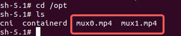
* 在魔方派3中使用下面命令测试两摄像头并发录像加预览：

  ```shell showLineNumbers
  # 终端1
  export XDG_RUNTIME_DIR=/dev/socket/weston
  export WAYLAND_DISPLAY=wayland-1
  setprop persist.overlay.use_c2d_blit 2
  gst-launch-1.0 -e qtiqmmfsrc camera=0 name=camsrc video_0::type=preview ! video/x-raw\(memory:GBM\),format=NV12,width=1920,height=1080,framerate=30/1,compression=ubwc,interlace-mode=progressive,colorimetry=bt601 ! queue ! v4l2h264enc capture-io-mode=5 output-io-mode=5 ! queue ! h264parse ! mp4mux ! queue ! filesink location="/opt/mux0.mp4" camsrc. ! video/x-raw\(memory:GBM\),format=NV12,width=1920,height=1080,framerate=30/1,compression=ubwc ! waylandsink sync=false x=0 y=0 width=960 height=540 enable-last-sample=false

  # 终端2
  export XDG_RUNTIME_DIR=/dev/socket/weston
  export WAYLAND_DISPLAY=wayland-1
  setprop persist.overlay.use_c2d_blit 2
  gst-launch-1.0 -e qtiqmmfsrc camera=1 name=camsrc video_0::type=preview ! video/x-raw\(memory:GBM\),format=NV12,width=1920,height=1080,framerate=30/1,compression=ubwc,interlace-mode=progressive,colorimetry=bt601 ! queue ! v4l2h264enc capture-io-mode=5 output-io-mode=5 ! queue ! h264parse ! mp4mux ! queue ! filesink location="/opt/mux1.mp4" camsrc. ! video/x-raw\(memory:GBM\),format=NV12,width=1920,height=1080,framerate=30/1,compression=ubwc ! waylandsink sync=false x=960 y=540 width=960 height=540 enable-last-sample=false
  ```

  录制完成后在 */opt* 目录下有录制的视频文件：

  

  预览结果如下：

  
* 在魔方派3中使用下面命令测试摄像头拍照：

  ```shell showLineNumbers
  export XDG_RUNTIME_DIR=/dev/socket/weston
  export WAYLAND_DISPLAY=wayland-1
  setprop persist.overlay.use_c2d_blit 2
  gst-pipeline-app -e qtiqmmfsrc name=camsrc camera=0  ! "image/jpeg,width=1920,height=1080,framerate=30/1" ! multifilesink location=/opt/0_frame%d.jpg max-files=1
  ```

  执行上述命令后，会在终端输出如下 MENU，在 MENU 中输入 3，并按下 Enter 执行拍照指令。

  ```shell showLineNumbers

  ##################################### MENU #####################################

   ============================== Pipeline Controls ==============================
     (0) NULL                     : Set the pipeline into NULL state
     (1) READY                    : Set the pipeline into READY state
     (2) PAUSED                   : Set the pipeline into PAUSED state
     (3) PLAYING                  : Set the pipeline into PLAYING state
   ==================================== Other ====================================
     (p) Plugin Mode              : Choose a plugin which to control
     (q) Quit                     : Exit the application


  Choose an option:

  # 按下CTRL+C结束拍照
  ```

  拍照完成后&#x5728;*&#x20;/opt* 目录下有对应的 jpg 文件：

  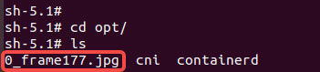

### 2.4.3 摄像头故障排除

如果摄像头无法显示或捕捉图像，请检查以下内容：

1. 检查摄像头模块连接

   请参阅 [2.4.1 摄像头排线安装](/rubik-pi-3/cn/docs/rubik-pi-3-user-manual/1.1.0/peripherals-and-interfaces#241-摄像头排线安装)。
2. 运行单流预览用例

   ```shell showLineNumbers
   export XDG_RUNTIME_DIR=/dev/socket/weston
   export WAYLAND_DISPLAY=wayland-1
   setprop persist.overlay.use_c2d_blit 2
   gst-launch-1.0 -e qtiqmmfsrc camera=0 name=camsrc ! video/x-raw\(memory:GBM\),format=NV12,width=1920,height=1080,framerate=30/1,compression=ubwc ! queue ! waylandsink sync=false x=1000 y=1000 width=960 height=540 enable-last-sample=false
   ```
3. &#x20;使用以下命令收集日志

   ```shell showLineNumbers
   journalctl -f > /opt/log.txt
   ```

   在日志中搜索 "probe success" 。Probe success 意味着摄像头模块已通电并响应 I2C 控制。如果特定传感器没有 "probe success" 日志，则可能是柔性电缆连接或摄像头模块的问题。

   以下日志指示探测到一个 IMX477：

   ```shell showLineNumbers
   [   80.645992] CAM_INFO: CAM-SENSOR: cam_sensor_driver_cmd: 939: Probe success,slot:7,slave_addr:0x34,sensor_id:0x477, is always on: 0
   ```
4. 检查摄像头传感器驱动程序命令

   使用 `journalctl -f > /opt/log.txt`命令收集日志并搜索 "cam\_sensor\_driver\_cmd" 。"CAM\_START\_DEV Success" 表示摄像头传感器流式传输开始。"CAM\_STOP\_DEV Success" 表示摄像头传感器流式传输停止。例如：

   ```shell showLineNumbers

   start:
   [   81.172814] CAM_INFO: CAM-SENSOR: cam_sensor_driver_cmd: 1129: CAM_START_DEV Success, sensor_id:0x477,sensor_slave_addr:0x34
   stop:
   [   88.905241] CAM_INFO: CAM-SENSOR: cam_sensor_driver_cmd: 1157: CAM_STOP_DEV Success, sensor_id:0x477,sensor_slave_addr:0x34
   ```
5. 检查传感器流式传输

   启用 CSID SOF/EOF IRQ 日志，随后执行摄像头出流命令

   ```shell showLineNumbers
   mount -o rw,remount /usr
   mount -t debugfs none /sys/kernel/debug/
   echo 0x8 > /sys/module/camera/parameters/debug_mdl
   echo 3 >/sys/kernel/debug/camera_ife/ife_csid_debug
   echo 1 > /sys/kernel/tracing/tracing_on
   echo 1 > /sys/kernel/tracing/events/camera/cam_log_debug/enable
   echo 2 > /sys/module/camera/parameters/debug_type
   cat /sys/kernel/tracing/trace_pipe > trace.txt

   ```

   捕获的日志有助于提供有关 SOF 和 EOF 的详细信息。在日志 "trace.txt" 中搜索 "irq\_status\_ipp"。BIT12(0x1000)表示 SOF 数据包，BIT9(0x200)表示 EOF 数据包。日志如下所示：

   ```shell showLineNumbers
   <idle>-0       [000] d.h1. 19287.546764: cam_log_debug:
   CAM_DBG: CAM-ISP: cam_ife_csid_irq: 4996: irq_status_ipp = 0x1110 cam-server-25604     [000] dNH.. 19287.561705: cam_log_debug:
   CAM_DBG: CAM-ISP: cam_ife_csid_irq: 4996: irq_status_ipp = 0xee8
   ```

## 2.5 HDMI OUT

魔方派3的 HDMI 接口为下图 9。

魔方派3 HDMI 参数信息：

* HDMI 1.4
* 3840 x 2160 分辨率 @ 30 fps
* DSI 0 to HDMI (lt9611)
* 支持 CEC
* 支持分辨率自适应
* 支持热插拔


:::note
DP 和 HDMI 可同时接显示器，并发显示。
:::

### 2.5.1 CEC

HDMI CEC（Consumer Electronics  Control，消费者电子控制）是 HDMI 标准中的一项功能，旨在通过单一的 HDMI 连接线实现多设备之间的互联与统一控制。具体来说，CEC 允许连接的设备通过专用的 CEC 引脚进行通信，从而实现例如通过一个遥控器控制多台设备的功能。

魔方派3集成了 cec-client 工具，将 HDMI 线连接到电视后，可使用下面命令查看电视是否支持 CEC：

```shell showLineNumbers
echo 'scan' | cec-client -s -d 1

```

若支持 CEC 将会有如下输出:

```plain showLineNumbers
opening a connection to the CEC adapter...
requesting CEC bus information ...
CEC bus information
===================
device #0: TV
address:       0.0.0.0
active source: no
vendor:        Sony
osd string:    TV
CEC version:   1.4
power status:  standby
language:      eng
 
 
device #1: Recorder 1
address:       1.0.0.0
active source: no
vendor:        Pulse Eight
osd string:    CECTester
CEC version:   1.4
power status:  on
language:      eng
 
 
device #4: Playback 1
address:       3.0.0.0
active source: no
vendor:        Sony
osd string:    PlayStation 4
CEC version:   1.3a
power status:  standby
language:      ???
```

若电视支持 CEC 功能，可在魔方派3中使用下面命令控制电视音量的加减：

```shell showLineNumbers
echo 'volup' | cec-client -t p -s
echo 'voldown' | cec-client -t p -s
```

更多 cec-client 使用方法，可使用 `-h` 参数进行查看：

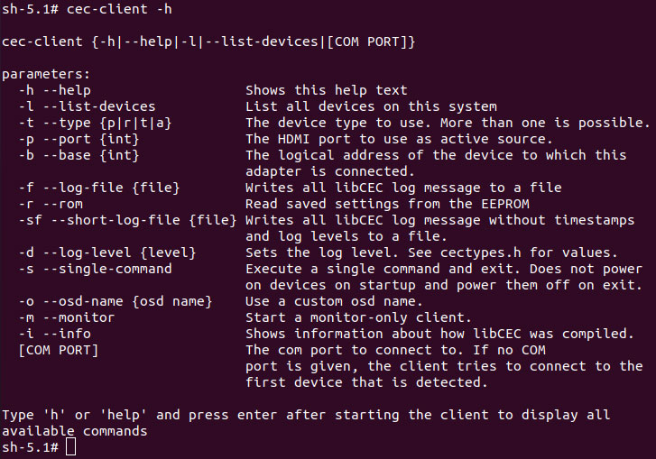

### 2.5.2 HDMI OUT 触摸屏

魔方派3默认支持 1024\*600P 分辨率的 HDMI OUT 触摸屏，如下图所示：

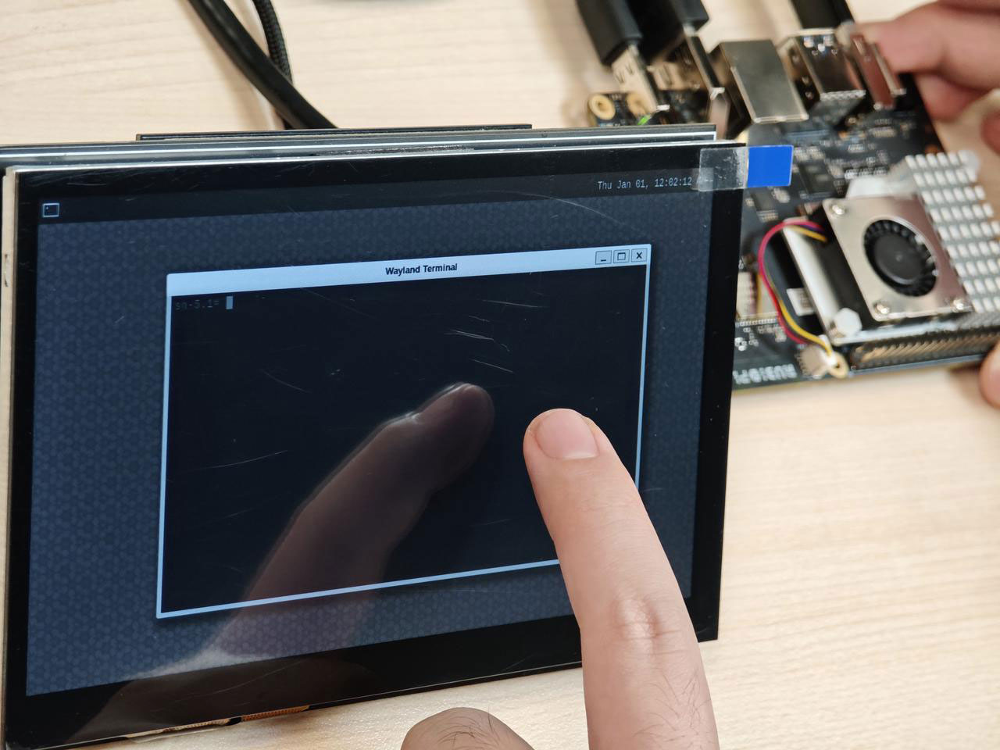

:::tip
上图中使用的屏幕为 [7 寸 IPS 高清触摸屏幕](https://detail.tmall.com/item.htm?abbucket=12\&id=683025543197\&rn=92499216a472de3107f9541a1b160dc3\&spm=a1z10.5-b-s.w4011-25285306736.152.50aa1c712FMfOS\&skuId=5055110246880)。
:::

### 2.5.3 HDMI OUT 调试

魔方派3使用的是 LT9611 这款 DSI-to-HDMI 桥接芯片。

下表列 HDMI 桥接芯片所需的配置。


#### 2.5.3.1 获取 lt9611 日志

要获取 lt9611 日志，请运行以下命令：

```bash showLineNumbers
dmesg | grep lt9611
```

查看 log，出现下面的字样代表 HDMI OUT 可以正常运行。

这段日志记录了 LT9611 芯片的初始化和 HDMI 连接过程，从固件版本检测到 CEC 初始化，芯片启动正常。

1. 芯片的固件版本是 0xe2.17.02。这表示芯片初始化时，驱动成功读取了版本信息。
2. LT9611 的 CEC（消费电子控制）功能适配器成功注册。
3. CEC 初始化完成，表明 LT9611 的 CEC 模块已经可以正常工作。
4. 芯片成功读取了 HPD（热插拔检测）状态，并且会有返回值，表示确认 HDMI 设备接入。
5. 芯片检测到视频信号参数：水平分辨率 1920（像素），垂直分辨率 1080（像素），像素时钟频率 148500 kHz（148.5 MHz）。这对应的是 1080p 分辨率（全高清），60Hz 刷新率的典型配置。

```bash showLineNumbers
[    5.492765] lt9611 9-0039: LT9611 revision: 0xe2.17.02
[    5.570258] lt9611 9-0039: CEC adapter registered
[    5.582944] lt9611 9-0039: CEC init success

[    8.233028] lt9611 9-0039: success to read hpd status: 13
[    8.233044] lt9611_device_connect_status_notify: send msg[Hdmi Connection] ret[32]
[    8.345015] lt9611 9-0039: hdisplay=1920, vdisplay=1080, clock=148500 
[    8.836662] lt9611 9-0039: video check: hactive_a=1920, hactive_b=1920, vactive=1080, v_total=1125, h_total_sysclk=401, mipi_video_format=170
```

#### 2.5.3.2 获取 DSI 日志

我们也可以通过输出的 DSI 信息进行调试，DSI 指的是 Display Serial Interface（显示串行接口），通常与移动设备或嵌入式系统的显示驱动（如 MIPI DSI）相关。

这个命令用来查看与显示接口（DSI）相关的内核日志，通常用于调试显示驱动或硬件问题。

```bash showLineNumbers
dmesg | grep dsi
```

输出结果示例：

```shell showLineNumbers

[    4.811430] i2c 9-0039: Fixed dependency cycle(s) with /soc@0/qcom,dsi-display-primary
[    4.941131] dsi_phy ae94400.qcom,mdss_dsi_phy0: supply gdsc not found, using dummy regulator
[    4.941385] [drm:dsi_pll_init [msm_drm]] [msm-dsi-info]: DSI_PLL_0: DSI pll label = dsi_pll_5nm
[    4.941466] [drm:dsi_pll_init [msm_drm]] [msm-dsi-info]: DSI_PLL_0: PLL SSC enabled
[    4.941513] dsi_pll_init: PLL base=00000000625eaee4
[    4.941658] [drm:dsi_pll_clock_register_5nm [msm_drm]] [msm-dsi-info]: DSI_PLL_0: Registered clocks successfully
[    4.941700] [drm:dsi_phy_driver_probe [msm_drm]] [msm-dsi-info]: DSI_0: Probe successful
[    4.973185] [drm:dsi_ctrl_dev_probe [msm_drm]] [msm-dsi-info]: dsi-ctrl-0: Probe successful

[    5.585113] [drm:dsi_display_bind [msm_drm]] [msm-dsi-info]: Successfully bind display panel 'qcom,mdss_dsi_ext_bridge_1080p '
[    5.585154] msm_drm ae00000.qcom,mdss_mdp0: bound soc@0:qcom,dsi-display-primary (ops dsi_display_comp_ops [msm_drm])
[    8.345467] [drm:dsi_display_set_mode [msm_drm]] [msm-dsi-info]: mdp_transfer_time=0, hactive=1920, vactive=1080, fps=60, clk_rate=0
[    8.345740] [drm:dsi_ctrl_isr_configure [msm_drm]] [msm-dsi-info]: dsi-ctrl-0: IRQ 249 registered
```

#### 2.5.3.3 获取显示面板信息

若要查看选定的显示面板，请运行以下命令：

```plain showLineNumbers
cat /sys/kernel/debug/qcom,mdss_dsi_ext_bridge_2k60/dump_info
```

示例输出

```shell showLineNumbers
name = qcom,mdss_dsi_ext_bridge_2k60
        Resolution = 2560(80|48|32|1)x1440(33|3|5|1)@60fps 0 Hz
        CTRL_0:
                ctrl = dsi-ctrl-0
                phy = dsi-phy-0
        Panel = ext video mode dsi bridge
        Clock master = dsi-ctrl-0
```

#### 2.5.3.4 获取 DSI 时钟信息

若要检查 DSI 时钟信息，请运行以下命令：

```shell showLineNumbers
cat /sys/kernel/debug/qcom,mdss_dsi_ext_bridge_2k60/dsi-ctrl-0/state_info
```

示例输出

```shell showLineNumbers
Current State:
        CTRL_ENGINE = ON
        VIDEO_ENGINE = ON
        COMMAND_ENGINE = OFF

Clock Info:
        BYTE_CLK = 181274400, PIXEL_CLK = 241699200, ESC_CLK = 19200000
```

#### 2.5.3.5 获取调压器信息

要检查调压器状态和电压，请运行以下命令：

```shell showLineNumbers
cat /sys/kernel/debug/regulator/regulator_summary
```

#### 2.5.3.6 获取接口信息

要检索调试 dump 输出（显示接口编号、VSync 计数、欠载计数和接口模式），请运行以下命令：

```shell showLineNumbers
cat /sys/kernel/debug/dri/0/encoder*/status
```

示例输出

```shell showLineNumbers
intf:1    vsync:  359036     underrun:       0    mode: video
intf:0    vsync:       0     underrun:       0    mode: video
```

#### 2.5.3.7 获取常规 DPU 调试信息

常见的 DPU 调试信息说明如下：

要检查 DPU 时钟速率，请运行以下命令：

```shell showLineNumbers
cat /sys/kernel/debug/clk/clk_summary | grep disp_cc
```

将 DPU 设置为性能模式

```shell showLineNumbers
cd /sys/kernel/debug/dri/0/debug/core_perf/
echo 1 > perf_mode
```

## 2.6 DP

魔方派3拥有1个 USB Type-C (SST) 接口的 DisplayPort，如下图5。

DP 的参数如下：

* 3840 × 2160 分辨率 @ 60 fps
* 单流传输 (Single stream transport)
* DisplayPort 和 USB 3.0 的并发功能


:::note
DP 和 HDMI 可同时接显示器，并发显示。
:::

### 2.6.1 DP 调试

#### 2.6.1.1 获取 DP 日志

输入下面命令开启日志打印权限。

```bash showLineNumbers
echo 8 > /proc/sys/kernel/printk 
echo ‘file dsi* +p’ > /sys/kernel/debug/dynamic_debug/control
```

:::tip
第一条命令中的 `8`表示日志级别。Linux 内核用 0 到 8 表示日志的优先级，数值越小，优先级越高：

* 0 (KERN\_EMERG): 系统紧急情况（比如崩溃）。
* 1 (KERN\_ALERT): 需要立即处理的问题。
* 2 (KERN\_CRIT): 严重错误。
* 3 (KERN\_ERR): 一般错误。
* 4 (KERN\_WARNING): 警告。
* 5 (KERN\_NOTICE): 正常但值得注意的事件。
* 6 (KERN\_INFO): 信息性消息。
* 7 (KERN\_DEBUG): 调试信息。
* 8: 比调试还低的级别，可以打出全部级别。
  :::

而 `echo ‘file dsi* +p’ > /sys/kernel/debug/dynamic_debug/control`则会显示内核中所有文件名以 *dsi\** 开头的源文件（通常是 DSI 显示驱动相关的代码）里的调试信息。这些调试信息会输出到内核日志，可以通过 `dmesg` 查看。通过下面的命令输出来调试 DP：

```bash showLineNumbers
mount -t debugfs none /sys/kernel/debug
echo 'file dp_display.c +p' > /sys/kernel/debug/dynamic_debug/control
echo 'file dp_aux.c +p' > /sys/kernel/debug/dynamic_debug/control
echo 'file dp_link.c +p' > /sys/kernel/debug/dynamic_debug/control
echo 'file dp_power.c +p' > /sys/kernel/debug/dynamic_debug/control
echo 'file dp_ctrl.c +p' > /sys/kernel/debug/dynamic_debug/control
echo 'file dp_parser.c +p' > /sys/kernel/debug/dynamic_debug/control
```

打开全部的限制等级之后，我们就可以筛选 DP 的日志来进行进一步的验证，以下是 DP 正常启动之后，正常启动全输出的日志：

```plain showLineNumbers
hub 4-0:1.0: USB hub found
hub 4-0:1.0: 1 port detected
usb usb5: We don't know the algorithms for LPM for this host, disabling LPM.
hub 5-0:1.0: USB hub found
hub 5-0:1.0: 1 port detected
[drm:dp_power_clk_enable][msm-dp-info][3216]core:on link:off strm0:off strm1:off
[drm:dp_display_host_init][msm-dp-info][3216][OK]
[drm:dp_display_host_ready][msm-dp-info][2912][OK]
[drm:dp_panel_read_sink_caps][msm-dp-info][2912]fec_en=0, dsc_en=0, widebus_en=0
[drm:dp_link_process_request][msm-dp-info][2912]event: DP_LINK_STATUS_UPDATED
[drm:dp_power_clk_enable][msm-dp-info][2912]core:on link:on strm0:off strm1:off
[drm:dp_catalog_ctrl_fec_config][msm-dp-err][2912]no link
[drm:dp_ctrl_link_train][msm-dp-info][2912]link training #1 successful
[drm:dp_ctrl_link_train][msm-dp-info][2912]link training #2 successful
[drm:dp_link_process_request][msm-dp-info][2912]event: DP_LINK_STATUS_UPDATED
[drm:dp_catalog_ctrl_fec_config][msm-dp-err][2912]no link
[drm:dp_ctrl_link_train][msm-dp-info][2912]link training #1 successful
[drm:dp_ctrl_link_train][msm-dp-info][2912]link training #2 successful
[drm:dp_display_send_hpd_event][msm-dp-info][2912][name=DP-1]:[status=connected] [bpp=0] [pattern=0]
[drm:dp_display_send_hpd_event][msm-dp-info][2912]uevent success: 0
lt9611 9-0039: success to read hpd status: 8
lt9611_device_connect_status_notify: send msg[Hdmi Disconnect] ret[32]
lt9611 9-0039: success to read hpd status: 8
lt9611_device_connect_status_notify: send msg[Hdmi Disconnect] ret[32]
[drm:dp_power_clk_enable][msm-dp-info][577 ]core:on link:on strm0:on strm1:off
[drm:dp_catalog_ctrl_fec_config][msm-dp-err][577 ]no link
[drm:dp_ctrl_link_train][msm-dp-info][577 ]link training #1 successful
[drm:dp_ctrl_link_train][msm-dp-info][577 ]link training #2 successful
[drm:dp_panel_resolution_info][msm-dp-info][577 ]DP RESOLUTION: active(back|front|width|low)
[drm:dp_panel_resolution_info][msm-dp-info][577 ]1920(148|88|44|0)x1080(36|4|5|0)@60fps 24bpp 148500Khz 10LR 2Ln
```

以上正常启动流程的日志总结如下：

1. USB 初始化: 系统启动时检测到两个单端口 USB HUB，禁用 USB 5 的 LPM。
2. DP 准备: DP 控制器初始化，读取显示器能力，准备建立连接。
3. DP 链接训练: 通过多次链接训练，DP 与显示器建立稳定连接。
4. DP 连接确认: 系统确认 DP-1 已连接，通知用户空间。
5. HDMI 断开: LT9611 检测到 HDMI 断开，可能是用户操作或接口切换。
6. DP 输出: HDMI 断开后，DP 启用视频流，输出 1080p@60Hz 的画面。

## 2.7 Wi-Fi & BT

魔方派3上搭载了AP6256 Wi-Fi 模块，支持 Wi-Fi 5 和蓝牙 5.2。

### 2.7.1 Wi-Fi

#### 2.7.1.1 工作频段

&#x20;AP6256 Wi-Fi 模块支持 2.4 GHz、5 GHz 工作频段。

#### 2.7.1.2 工作模式

Wi-Fi 软件在以下模式下运行：


| 模式 | 说明  |
| ---- | ---- |
| STA 模式 | 在 STA 模式下，设备连接到 Wi-Fi 网络中的接入点，并与网络中的其他设备进行通信。此模式是 Wi-Fi 连接中的无线设备的标准模式。|
| 热点模式 | 热点模式使设备能够使用蜂窝链路 (LTE) 向 Wi-Fi 客户端提供回程 (Internet) 连接。该设备通过其轻量级热点接口建立此连接。在热点模式下，设备可以：与连接到同一热点的其他 Wi-Fi 客户端通信。与热点设备通信。共享设备的 WAN 连接。 |

##### 2.7.1.2.1 STA 模式

在 STA 模式（Station）下，设备可连接到一个已经存在的无线网络，以便访问网络资源或互联网，在魔方派3中输入如下面命令进行连接：

1. 扫描附近 Wi-Fi：

   ```shell showLineNumbers
   iw wlan0 scan | grep SSID 
   ```
2. 连接 Wi-Fi：

   ```shell showLineNumbers
   wpa_passphrase <ssid> <passphrase> > /etc/wpa_supplicant.conf # 输入Wi-Fi账号和密码 
   systemctl restart wifi # 连接Wi-Fi
   ```

   连接好 Wi-Fi 后，下次开机会自动进行连接。
3. 如想切换 Wi-Fi 可修改 */etc/wpa\_supplicant.conf&#x20;*&#x6587;件，如下是一种修改方式：

   ```shell showLineNumbers
   ctrl_interface=/var/run/wpa_supplicant
   update_config=1
   pmf=1
   network={
           ssid="RUBIKPi"
           psk="123456789"
   }
   ```

   * ssid 为无线网络名称
   * psk 为无线网络密码

   按实际情况对文件进行修改。
4. 修改完成后，输入下面命令进行连接：

   ```shell showLineNumbers
   killall -9 wpa_supplicant
   wpa_supplicant -Dnl80211 -iwlan0 -c/etc/wpa_supplicant.conf -B
   ```

##### 2.7.1.2.2 无线模式

AP 模式（Access Point）即无线接入热点模式，是一个无线网络的创建者，是网络的中心节点，一般家庭或办公室使用的无线网络路由器就是一个 AP，下面是 AP 的创建步骤：

* 开启 AP

  a. 创建或修改 */opt/hostapd.conf* 文件：

    ```plain showLineNumbers
    ctrl_interface=/var/run/hostapd
    driver=nl80211
    ieee80211n=1
    interface=wlan1
    hw_mode=a
    channel=36
    beacon_int=100
    dtim_period=1
    ssid=RUBIKPi
    auth_algs=1
    ap_isolate=0
    ignore_broadcast_ssid=0
    wpa=2
    wpa_key_mgmt=WPA-PSK
    rsn_pairwise=CCMP
    wpa_passphrase=123456789
    ```
  b. 执行下面命令开启 AP：

    ```shell showLineNumbers
    hostapd -B /opt/hostapd.conf # 设置软件AP
    # 启动动态主机配置协议（DHCP）服务器
    brctl addbr br0
    brctl addif br0 wlan1
    ifconfig br0 192.168.225.1 netmask 255.255.255.0 up
    killall dnsmasq
    dnsmasq --conf-file=/etc/dnsmasq.conf --dhcp-leasefile=/var/run/dnsmasq.leases --addn-hosts=/data/hosts --pid-file=/var/run/dnsmasq.pid -i br0 -I lo -z --dhcp-range=br0,192.168.225.20,192.168.225.60,255.255.255.0,43200 --dhcp-hostsfile=/data/dhcp_hosts --dhcp-option-force=6,192.168.225.1 --dhcp-script=/bin/dnsmasq_script.sh
    ```
  c. 若要与 hostapd\_cli 建立连接，可使用下面命令

    ```shell showLineNumbers
    hostapd_cli -i wlan1 -p /var/run/hostapd
    ```

  在 `hostapd_cli` 控制台中监视 Wi-Fi STA 连接通知，例如 `AP-STA-CONNECTED`、 `EAPOL-4WAY-HS-COMPLETED`

  示例输出

  ```shell showLineNumbers
  root@rubikpi:~# hostapd_cli -i wlanl -p /var/run/hostapd
  hostapd_cli v2.11-devel
  Copyright (c) 2004-2022, Jouni Malinen <j@wl.fi> and contributors
  This software may be distributed under the terms of the BSD License. 
  See README for more details.

  Interactive mode
  > <3>AP-STA-CONNECTED aa: a4: fd: 8b: ec: 90
  <3>EAPOL-4WAY-HS-COMPLETED aa: a4: fd: 8b:ec:90

  > list_sta
  aa: a4: fd: 8b:ec:90
  ```

  :::tip
  若开启 AP 5G 模式时，未使用 STA 连接过 5G Wi-Fi，则需使用如下命令，查看环境中 5G channel 的配置
  ```shell showLineNumbers
  iw dev wlan0 scan
  ```
  在命令执行结果中通过，primary channel 字段确定当前已被激活 channel，如下所示，channel 字段为 36，将36 写入  /opt/hostapd.conf  文件中的 channel 字段即可
  ```yaml
  HT operation:
                  * primary channel: 36
                  * secondary channel offset: above
                  * STA channel width: any
                  * RIFS: 0
                  * HT protection: nonmember
                  * non-GF present: 0
                  * OBSS non-GF present: 0
                  * dual beacon: 0
                  * dual CTS protection: 0
                  * STBC beacon: 0
                  * L-SIG TXOP Prot: 0
                  * PCO active: 0
                  * PCO phase: 0
  ```
  :::


* 验证 AP

  要验证连接状态，请从其他设备连接到 AP。&#x20;

  例如，通过执行以下步骤从移动设备连接到 AP：

  a. 在移动设备上，转到 Wi-Fi settings。

  b. 等待 Wi-Fi STA 检测到 AP。

  c. 选择 AP 并输入在魔方派3设备上为 AP 配置的相应`wpa_passphrase`，然后进行连接。&#x20;

  ```shell showLineNumbers
  > status
  state=ENABLED
  phy=phyR freq=2412
  num_sta_non_erp=0
  num_sta_no_short_slot_time=0
  num_sta_no_short_preamble=0
  olbc=0
  num_sta_ht_no_gf=0 num_sta_no_ht=0
  num_sta_ht_20_mhz=0
  num_sta_ht40_intolerant=0
  olbc_ht=0
  ht_op_mode=0x0
  hw_mode=g
  country_code=US
  country3=0x20
  cac_time_seconds=0
  cac_time_left_seconds=N/A
  channel=1
  edmg_enable=0 edmg_channel=0
  secondary_channel=0
  ieee80211n=1
  ieee80211ac=0
  ieee80211ax=0
  ieee80211be=0
  beacon_int=100
  dtim_period=2
  ht_caps_info=000c
  ht_mcs_bitmask=ffff0000000000000000
  supported_rates-02 04 0b 16 Oc 12 18 24 30 48 60 6c
  max_txpower=30
  bss[0]=wlan1
  bssid[0]=00:03:7f:95:8e:8e
  ssid [0]=QSoftAP
  num_sta[0]=1
  > |
  ```

  要验证连接，在魔方派3设备的 `ssh shell` 中 ping 移动设备的 IP 地址。

  以下输出表示 Wi-Fi 连接已成功建立，数据传输已开始：&#x20;

  ```shell showLineNumbers
  sh-5.1# ping 192.168.1.42
  PING 192.168.1.42 (192.168.1.42): 56 data bytes
  64 bytes from 192.168.1.42: seq=0 ttl=64 time-11.175 ms
  64 bytes from 192.168.1.42: seq=1 ttl=64 time=14.528 ms
  64 bytes from 192.168.1.42: seq=2 ttl=64 time=29.735 ms
  64 bytes from 192.168.1.42: seq=3 ttl=64 time=223.822 ms
  64 bytes from 192.168.1.42: seq-4 ttl=64 time-23.675 ms
  ^C
  192.168.1.42 ping statistics ---
  7 packets transmitted, 5 packets received, 28% packet loss
  round-trip min/avg/max = 11.175/60.587/223.822 ms
  sh-5.1#
  ```

  也可以在连接设备的 Settings 中验证 Wi-Fi 连接状态。例如，要获取连接到魔方派3 AP 的移动设备的 IP 地址，执行以下步骤：

1. 导航至 Settings > Wi-Fi。
2. 验证 AP 的 SSID。

* 关闭 AP：

要停止 AP，在 SSH 中执行以下操作：

1. 通过执行以下步骤停止 hostapd：

   a. 要停止 hostapd 过程，可运行以下命令：

      ```plain showLineNumbers
      killall hostapd
      ```
   b. 要禁用接口，可运行以下命令：

      ```plain showLineNumbers
      ifconfig wlan1 down
      ```
2. 请运行以下命令，以便删除 `ctrl_interface`：

   ```plain showLineNumbers
   rm -rf /var/run/hostapd/wlan1
   ```

Wi-Fi 热点成功停止。

### 2.7.2 BT

在魔方派3中使用下面命令测试 BT 功能

* 运行 app\_manager 程序进行配对：

  ```shell showLineNumbers
  cd /usr/src/rubikpi-btapp/
  ./app_manager
  ```

  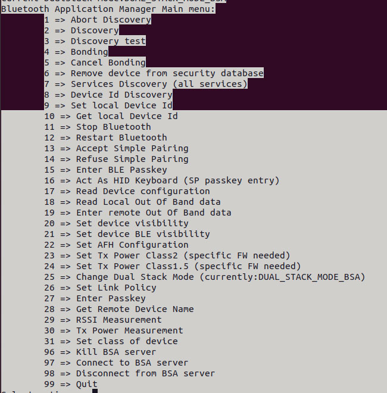

  a. 在终端输入 2 回车后等待蓝牙扫描结果。

  b. 在终端输入 4 回车后输入要配对的蓝牙设备 Dev 编号再次回车。

  c. 根据提示在终端输入 13 回车接受配对， 对端蓝牙设备同时也要接受配对请求。

  app\_manager 需要一直运行，下面步骤使用 `adb shell` 命令创建新终端进行。

* 蓝牙发送

  以发送文件为例：

  ```shell showLineNumbers
  cd /usr/src/rubikpi-btapp/
  touch ./test_file.txt
  echo RUBIKPi > test_file.txt
  ./app_opc
  # 输入4回车
  # 输入0回车
  # 输入设备编号回车
  # 手机接收文件
  # 输入9回车退出
  ```

  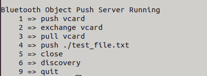

* 蓝牙接收：

  ```shell showLineNumbers
  cd /usr/src/rubikpi-btapp/
  mkdir push
  ./app_ops
  # 输入1回车
  # 手机蓝牙发送文件
  # 传输完成后，输入9回车退出， 在./push 文件夹中查看传输的文件
  ```

  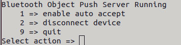

* 其他 Demo

  在魔方派3的 */usr/src/rubikpi-bt-demo/3rdparty/3rdparty/embedded/bsa\_examples/linux* 目录下，存放了所有 BT 相关的源码，可以按需要进行编译和查看，编译方法如下：

  ```shell showLineNumbers
  cd /usr/src/rubikpi-bt-demo/3rdparty/3rdparty/embedded/bsa_examples/linux/<测试demo>/build/
  export ARMGCC=gcc
  make CPU=arm64
  cp arm64/<demo可执行文件>  /usr/src/rubikpi-btapp/
  cd /usr/src/rubikpi-btapp/
  # 运行demo程序
  ```

## 2.8 音频

魔方派3目前支持的音接口为：

* 3.5mm 耳机，下图4。
* HDMI OUT， 下图9。
* 蓝牙


### 2.8.1 查看声卡信息

* 在魔方派3中输入下面命令，查看声卡挂载情况：

  ```shell showLineNumbers
  cat /proc/asound/cards
  ```

  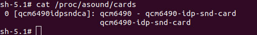

* 在魔方派3中输入下面命令，查看已分配的 pcm 流列表：

  ```shell showLineNumbers
  cat /proc/asound/pcm
  ```

  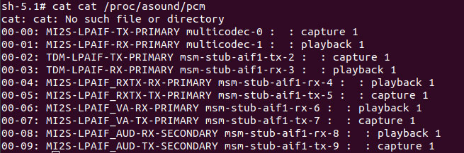

### 2.8.2 设置输出源

在魔方派3中输入下面命令，改变 gstreamer、paplay 等命令的音频输出源头：

* 设置输出接口为 3.5mm Headset

  ```shell showLineNumbers
  pactl set-sink-port low-latency0 headset
  ```
* 设置输出接口为 HDMI OUT

  ```shell showLineNumbers
  pactl set-sink-port low-latency0 hdmi
  ```

### 2.8.3 播放

* 在魔方派3中输入下面命令测试耳机播放。&#x20;

  :::warning
  运行命令前，务必将 MP3 测试文件 (`<FileName>.mp3`) 推送到 `/opt/` 目录下。
  :::

  ```shell showLineNumbers
  gst-launch-1.0 filesrc location=/opt/<FileName>.mp3 ! mpegaudioparse ! mpg123audiodec ! pulsesink
  ```
* 在魔方派3中输入下面命令测试 HDMI OUT 播放。

  :::warning
  运行命令前，务必将 PCM 测试文件 (`<FileName>.wav`) 推送到 `/opt/` 目录下。
  :::

  ```shell showLineNumbers
  systemctl stop pulseaudio
  agmplay /opt/<FileName>.wav -D 100 -d 100 -r 48000 -b 16 -c 2 -i MI2S-LPAIF_RXTX-RX-PRIMARY
  systemctl start pulseaudio
  ```
* 在魔方派3中输入下面命令测试蓝牙设备播放，测试需要开启多个终端。

  a. 终端一:

  ```shell showLineNumbers
  cd /usr/src/rubikpi-btapp/
  ./app_manager
  ```

  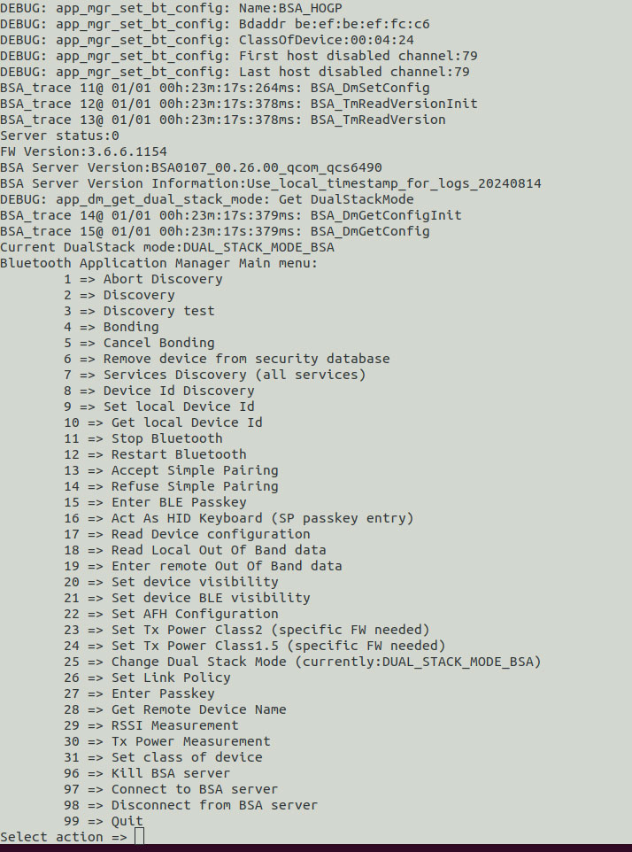

  b. 终端二:

  ```shell showLineNumbers
  cd /usr/src/rubikpi-btapp/
  ./app_av
  ```

  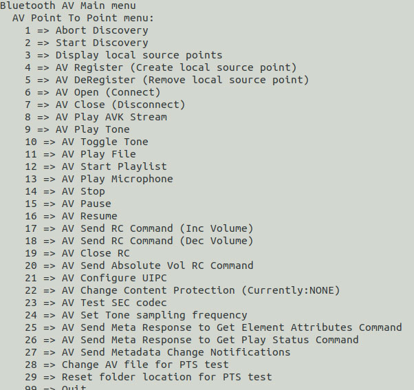

    1. 输入 2 回车，等待发现蓝牙设备。

    2. 输入 6 回车，开始建立连接。

    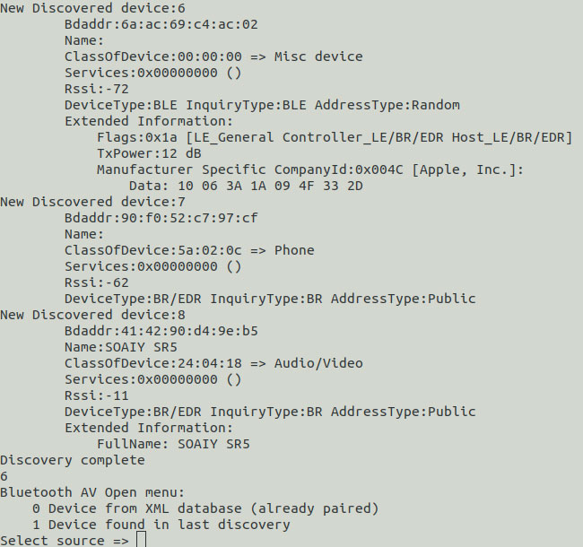

    3. 输入 1 回车，从最近的扫描结果中连接。

    4. 输入要连接蓝牙设备的 Dev 号。

c. 返回终端一，输入 13 回车，接受配对。

d. 返回终端二，输入 11 回车后选择要播放的音乐编号回车播放音乐。

### 2.8.4 录制

在魔方派3中输入下面命令测试录音功能

* 耳机录制:

  ```shell showLineNumbers
  gst-launch-1.0 -v pulsesrc volume=10 ! audioconvert ! wavenc ! filesink location=/opt/test.wav
  ```
* 蓝牙耳机录制，测试需要开启多个终端：

  a. 终端一:

  ```shell showLineNumbers
  cd /usr/src/rubikpi-btapp/
  ./app_manager
  ```

  

  b. 终端二:

  ```shell showLineNumbers
  cd /usr/src/rubikpi-btapp/
  ./app_ag
  ```

  

  c. 输入 1 回车，等待发现蓝牙耳机。

  d. 输入 6 回车，连接蓝牙耳机。

  

  e. 输入 1 回车，从最近的扫描结果中连接。

  f. 输入要连接蓝牙设备的Dev号。

  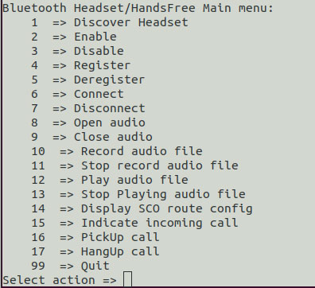

  g. 返回终端一，输入13 回车，接受配对。

  h. 返回终端二，输入 8 回车，打开 SCO 链路。

  i. 终端三:

  ```shell showLineNumbers
  systemctl stop pulseaudio

  #开始录制蓝牙耳机麦克风音频
  agmcap /home/root/my.wav -D 100 -d 101 -r 16000 -b 16 -c 1 -i MI2S-LPAIF_VA-TX-PRIMARY -dkv 0xA3000003 -p 120 -n 2

  #ctrl+c结束录制

  systemctl start pulseaudio
  ```

  录制音频的保存路径为&#x20;*&#x20;/home/root/my.wav*。

### 2.8.5 调节音量

* 耳机调节音量

  可通过下面命令获取和设置音量:

  ```shell showLineNumbers
  tinymix get "DAC Playback Volume"

  tinymix set "DAC Playback Volume" 192 192
  ```

  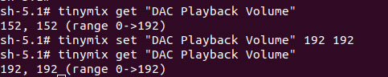

* 蓝牙调节音量

  在播放蓝牙音频时，可在终端二进行音量控制

  a. 输入 20

  b. 输入 0

  c. 输入音量（音量范围0到100）

  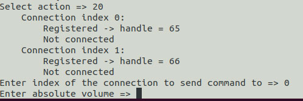

### 2.8.6 抓取日志

* 用户空间日志

  要抓取用户空间日志，请执行以下操作：

  ```shell showLineNumbers
  ssh root@ip-addr
  mount -o remount,rw /
  cat /var/log/user.log
  ```
* 内核音频驱动程序日志

  * &#x20;内核日志

    ```shell showLineNumbers
    dmesg
    ```
  * 禁用特定文件中的内核日志：

    ```shell showLineNumbers
    echo –n “file <filename> -p” > /sys/kernel/debug/dynamic_debug/control

    ```
  * 动态内核日志

    默认情况下，动态日志处于禁用状态。要将其启用，请添加 `CONFIG_DYNAMIC_DEBUG` 内核配置，重新编译并重新刷写设备。

    要启用音频动态内核日志，请执行以下操作：

    ```shell showLineNumbers
    ssh root@ip-addr
    mount -o rw,remount /
    mount -t debugfs none /sys/kernel/debug
    echo –n “file <filename> +p” > /sys/kernel/debug/dynamic_debug/control
    ```

### 2.8.7 分析抓取的日志

查看用户空间和内核音频驱动程序日志，了解播放和录制用例。

* 播放

  以下日志片段描述了为播放用例收集的信息。

  ```shell showLineNumbers
  //Open Low latency Playback stream. Details of each stream type can be found at sources/audio/opensource/arpal-lx/inc/PalDefs.h
  2022-04-28T18:02:08.748280+00:00 pulseaudio: pal_stream_open: 224: Enter, stream type:1

  //Verify the backend device, sample rate, bitwidth, channels etc
  2022-04-28T18:02:08.748627+00:00 pulseaudio: setDeviceMediaConfig: 1056: CODEC_DMA-LPAIF_WSA-RX-0 rate ch fmt data_fmt 48000 2 2 1

  //Start playback stream
  2022-04-28T18:02:08.751947+00:00 pulseaudio: pal_stream_start: 338: Enter. Stream handle 0xffff94001040K

  //Map the metadata with kvh2xml.h file for playback usecase details.
  2022-04-28T18:02:08.853157+00:00 pulseaudio: metadata_print: 82 key:0xa1000000, value:0xa100000e//PCM_LL_PLAYBACK
  2022-04-28T18:02:08.853395+00:00 pulseaudio: metadata_print: 82 key:0xab000000, value:0x1
  2022-04-28T18:02:08.853660+00:00 pulseaudio: metadata_print: 82 key:0xa2000000, value:0xa2000001//Speaker
  2022-04-28T18:02:08.853881+00:00 pulseaudio: metadata_print: 82 key:0xac000000, value:0xac000002//DEVICEPP_RX_AUDIO_MBDRC

  //Verify the graph opened for playback usecase
  2022-04-28T18:02:08.856934+00:00 pulseaudio: print_graph_alias: 2334 GKV Alias 142 | StreamRX_PCM_LL_Playback_DeviceRX_Speaker_Instance_Instance_1_DevicePP_Rx_Audio_MBDRC
  //graph_open called
  2022-04-28T18:02:08.859509+00:00 pulseaudio: graph_open: 709 graph_handle 0x47534c

  //Configure hardware endpoint module
  2022-04-28T18:02:08.864386+00:00 pulseaudio: configure_hw_ep_media_config: 636 entry mod tag c0000004 miid 43b1 mid 7001023
  2022-04-28T18:02:08.864495+00:00 pulseaudio: configure_hw_ep_media_config: 664 rate 48000 bw 16 ch 2, data_fmt 1
  2022-04-28T18:02:08.864603+00:00 pulseaudio: configure_hw_ep_media_config: 676 exit, ret 0

  //graph_start entry
  2022-04-28T18:02:08.867234+00:00 pulseaudio: graph_start: 899 entry graph_handle 0x47534c
  //Stream started
  2022-04-28T18:02:08.867864+00:00 pulseaudio: pal_stream_start: 387: Exit. status 0

  //graph_stop entry
  2022-04-28T18:02:25.037338+00:00 pulseaudio: graph_stop: 928 entry graph_handle 0x47534c
  //Stop the PAL stream once playback completes
  2022-04-28T18:02:25.039923+00:00 pulseaudio: pal_stream_stop: 441: Exit. status 0

  //graph_close entry
  2022-04-28T18:02:25.050944+00:00 pulseaudio: graph_close: 762 entry handle 0x47534c
  //Close the PAL stream
  2022-04-28T18:02:25.054510+00:00 pulseaudio: pal_stream_close: 322: Exit. status 0

  ```
* 录制

  以下日志片段描述了为录制用例收集的信息。

  ```shell showLineNumbers
  //Open Recording stream for PAL_STREAM_RAW. Details of stream type can be found at sources/audio/opensource/arpal-lx/inc/PalDefs.h
  Apr 29 09:23:11 pulseaudio[862]: pal_stream_open: 224: Enter, stream type:9

  //Verify the backend device, sample rate, bitwidth, channels etc
  Apr 29 09:23:11 pulseaudio[862]: setDeviceMediaConfig: 1056: CODEC_DMA-LPAIF_VA-TX-0 rate ch fmt data_fmt 48000 1 2 1

  //Start recording stream
  Apr 29 09:23:11 pulseaudio[862]: pal_stream_start: 338: Enter. Stream handle 0xffff6c001040K

  //graph_open entry
  Apr 29 09:23:11 pulseaudio[862]: graph_open: 709 graph_handle 0x47534c

  //Metadata details to identify the usecase
  Apr 29 09:23:11 pulseaudio[862]: metadata_print: 82 key:0xb1000000, value:0xb1000009//RAW_RECORD
  Apr 29 09:23:11 pulseaudio[862]: metadata_print: 82 key:0xa3000000, value:0xa3000004//HANDSETMIC

  //Verify the graph opened for recording usecase
  Apr 29 09:23:11 pulseaudio[862]: print_graph_alias: 2334 GKV Alias 29 | DeviceTX_Handset_Mic_StreamTX_RAW_Record

  //Configure hardware endpoint module
  Apr 29 09:23:11 pulseaudio[862]: configure_hw_ep_media_config: 636 entry mod tag c0000005 miid 43af mid 7001024
  Apr 29 09:23:11 pulseaudio[862]: configure_hw_ep_media_config: 664 rate 48000 bw 16 ch 1, data_fmt 1
  Apr 29 09:23:11 pulseaudio[862]: configure_hw_ep_media_config: 676 exit, ret 0

  //graph_start entry
  Apr 29 09:23:11 pulseaudio[862]: graph_start: 899 entry graph_handle 0x47534c
  //Stream recording started
  Apr 29 09:23:11 pulseaudio[862]: pal_stream_start: 387: Exit. status 0


  //graph_stop entry
  Apr 29 09:23:26 pulseaudio[862]: graph_stop: 928 entry graph_handle 0x47534c
  //Stop the PAL stream once user stops recording
  Apr 29 09:23:26 pulseaudio[862]: D: [regular2] pal-source.c: pal_stream_stop returned 0

  //Close the PAL stream
  Apr 29 09:23:26 pulseaudio[862]: pal_stream_close: 284: Enter. Stream handle :0xffff6c001040K
  //graph_close entry
  Apr 29 09:23:26 pulseaudio[862]: graph_close: 762 entry handle 0x47534c
  //Close the PAL stream
  Apr 29 09:23:26 pulseaudio[862]: pal_stream_close: 322: Exit. status 0

  ```

## 2.9 风扇

[魔方派3支持的散热套件](https://www.raspberrypi.com/products/active-cooler/):

:::warning
使用魔方派3在运行一些高负载或高性能的场景下，需要使用散热措施来保证设备性能稳定，否则会因为 CPU 温度过高而带来降频等性能影响。
:::

### 2.9.1 风扇安装

1. **将散热器背面所有导热硅脂移除**，将下图标记的两块硅脂按魔方派3的 SoC 及 uMCP 的形状裁下。

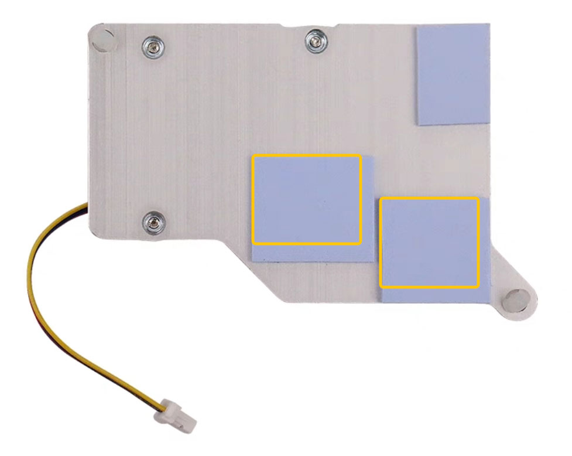

两块的表面尺寸约为14\*12mm和13\*11.5mm。

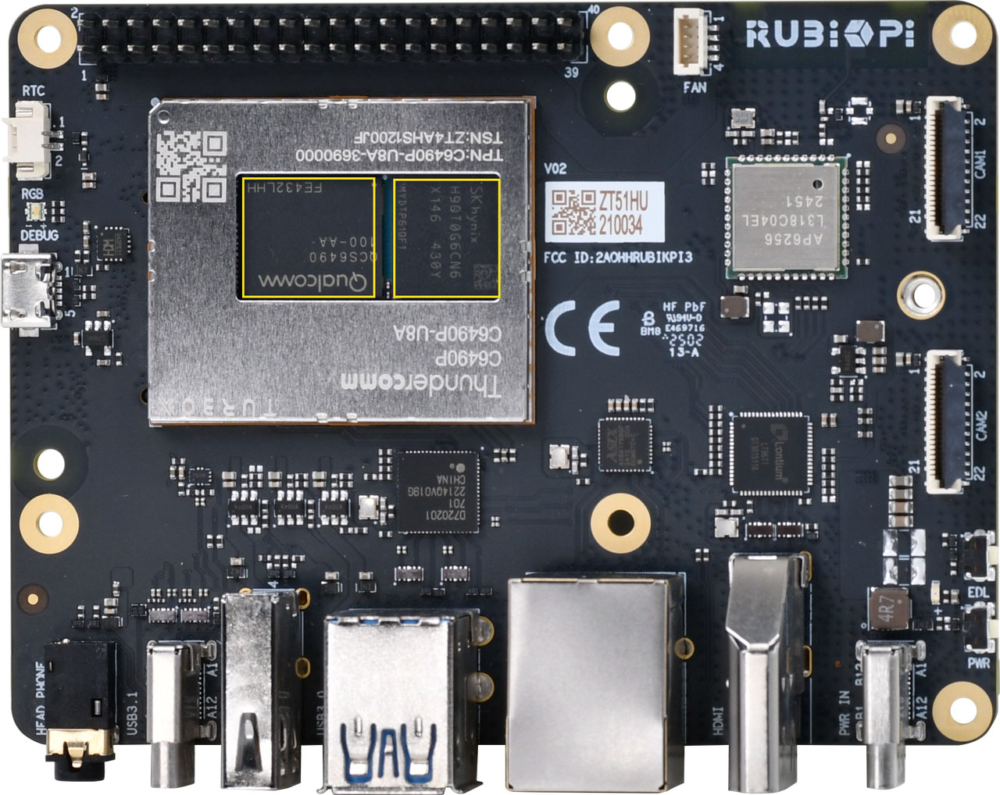

2. 将裁剪好的两块导热硅脂贴在魔方派3上对应位置。

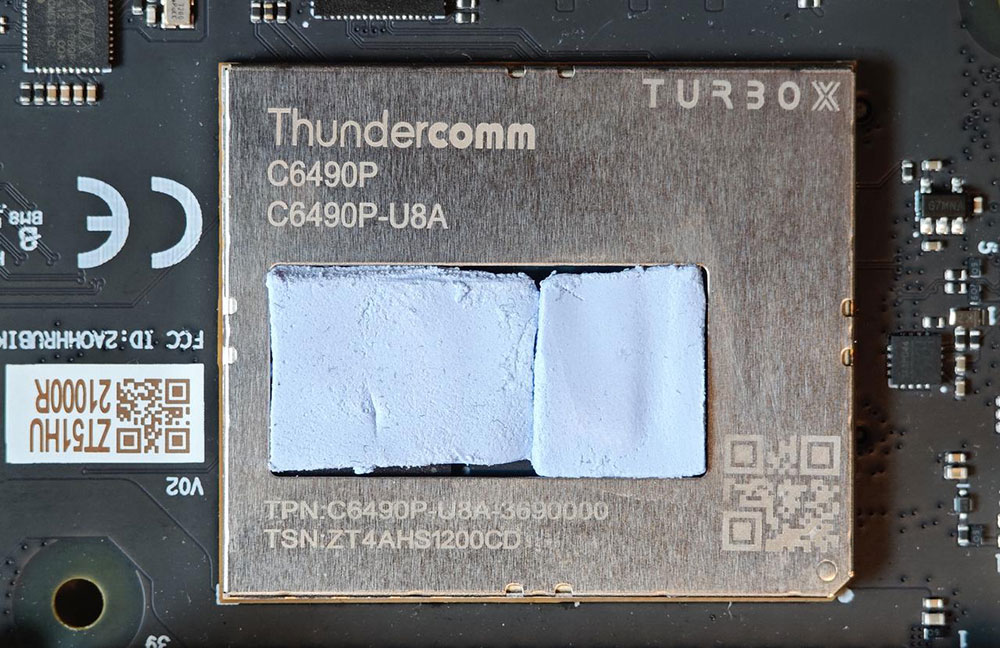

3. 安装散热器，连接风扇排线。

  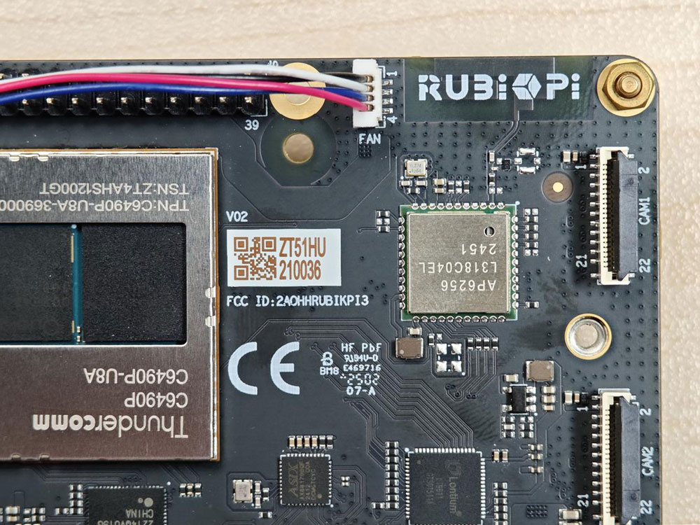

 :::warning
 建议将风扇安装到魔方派3上后不要将其取下。拆卸会导致风扇的推针和散热垫退化，并可能导致产品损坏。如果推针损坏或变形，或无法牢固夹住，请停止使用风扇。
 :::

### 2.9.2 风扇控制方法

魔方派3风扇会根据当前的 CPU 温度自动调整转速，同时也可在魔方派3中使用下面命令进行手动控制转速，0 和 255 分别表示风扇的最高和最低速度。

```shell showLineNumbers
echo 100 >  /sys/class/hwmon/hwmon29/pwm1
echo 255 >  /sys/class/hwmon/hwmon29/pwm1
echo 0 >  /sys/class/hwmon/hwmon29/pwm1
```

## 2.10 LED

魔方派3上有一个由 PMIC 驱动的 RGB 的三色灯，默认情况下其中的绿色灯被设置为了心跳灯用来反馈系统的运行情况和 CPU 负载情况（CPU 负载大时，心跳灯闪烁频率也跟着变大）。

* 关闭心跳灯

  ```shell showLineNumbers
  echo none > /sys/class/leds/green/trigger 
  ```
* 开启心跳灯

  ```shell showLineNumbers
  echo heartbeat > /sys/class/leds/green/trigger
  ```
* 设置绿灯的亮度（亮度 0 - 511，如下为设置亮度为100）

  ```shell showLineNumbers
  echo 100 >  /sys/class/leds/green/brightness
  ```
* 设置红灯的亮度（亮度 0 - 511，如下为设置亮度为100）

  ```shell showLineNumbers
  echo 100 >  /sys/class/leds/red/brightness
  ```
* 设置蓝灯的亮度（亮度 0 - 511，如下为设置亮度为100）

  ```shell showLineNumbers
  echo 100 >  /sys/class/leds/blue/brightness
  ```

## 2.11 以太网

以太网接口为下图 8，魔方派3支持千兆以太网：


接入网线，如下图所示：

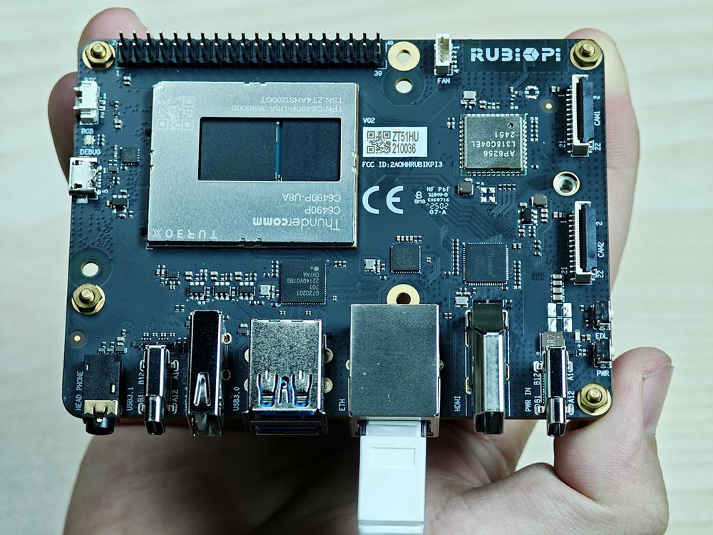

可在魔方派3中使用下面命令查看网络连接情况，如下图所示，已经成功分配 IP，说明网络连接成功：

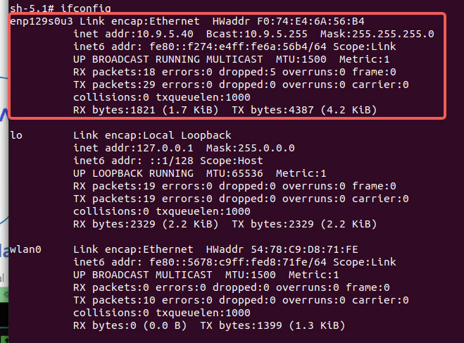

### 2.11.1 调试以太网

可以使用以下日志类型来记录和调试与以太网有关的问题。

* `dmesg`：调试与内核驱动程序相关的问题
* `tcpdump`： 验证数据包传输

要调试在以太网调通期间可能出现的问题，请执行以下操作：

1. 要收集 `dmesg` 日志并调试与内核驱动程序有关的问题，请运行以下命令：

   ```shell showLineNumbers
   dmesg > /var/log/dmesg_logs.txt
   ```
2. 要收集 `tcpdump` 日志并验证数据包传输，请运行以下命令。

   ```shell showLineNumbers
   tcpdump -i any -s 0 -w /var/log/tcpdump.pcap
   ```
3. 收集来自 ethtool、ifconfig、netstat 和 IP 路由表的输出以进行调试。

## 2.12 RTC 电池接口

RTC (Real\_Time Clock) 电池接口为下图 1。


接入 RTC 电池， 如下图所示，并将时间写入魔方派3的系统硬件时钟，可在魔方派3完全断电后，仍对魔方派3的系统时间进行保存。

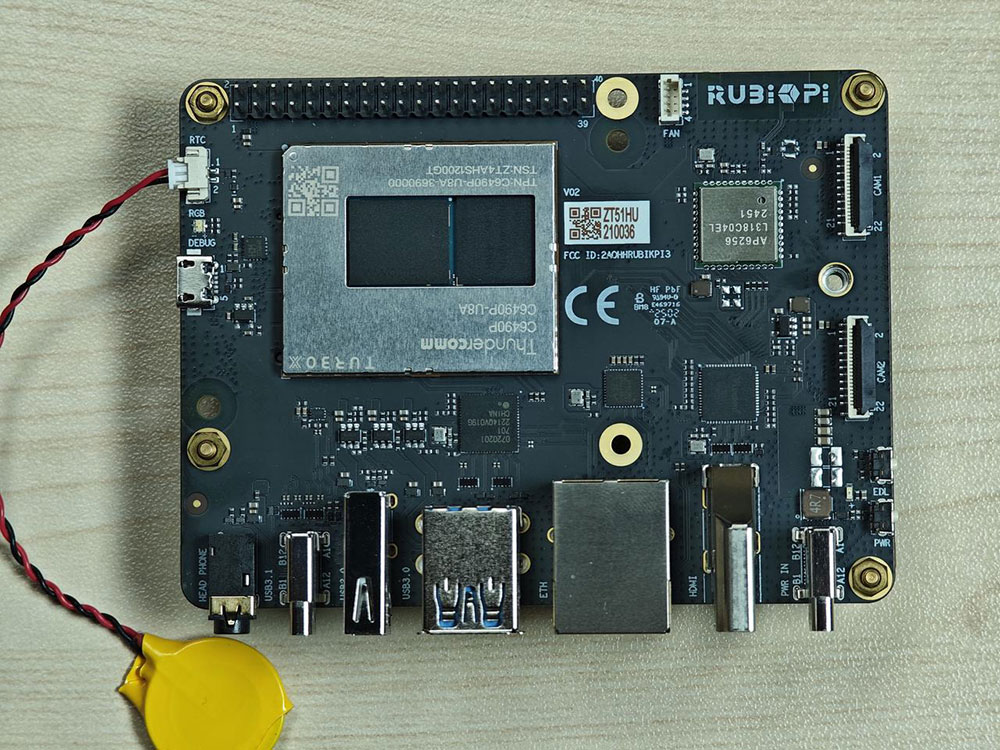

在魔方派3中将系统时间写入系统硬件时钟方法如下：

```shell showLineNumbers
date -s "08:00:00 20241201" # 将系统时间设置为2024年12月1日8时0分
hwclock -w # 将系统时间写入系统硬件时钟
```

## 2.13 M.2 Key M 接口

魔方派3提供一个标准 M.2 插槽，用于连接 NVMe 存储，可安装 2280 规格（22\*80mm）M.2 SSD 硬盘。M.2 插槽最大支持 PCIe Gen 3 x 2。M.2 接口最大对外输出能力为 3.3V 2A，可单独控制开关。

M.2 Key M 接口使用了 QCS6490 的 PCIe1 总线，设备路径为：*/sys/bus/pci/devices/0001:00:00.0*

M.2 Key M 接口为下图 18：

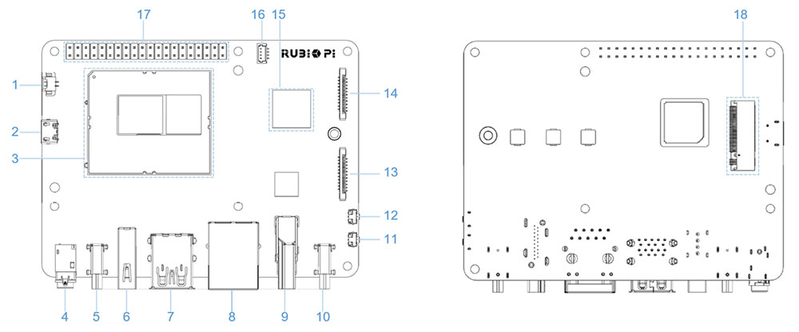

M.2 Key M 接口可以接入规格为2280的固态硬盘，如下图所示：

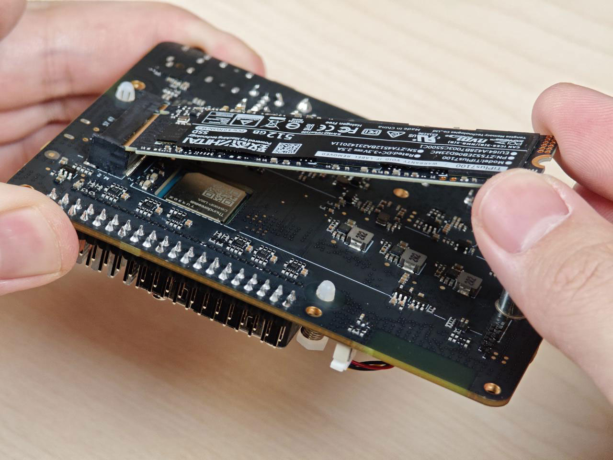

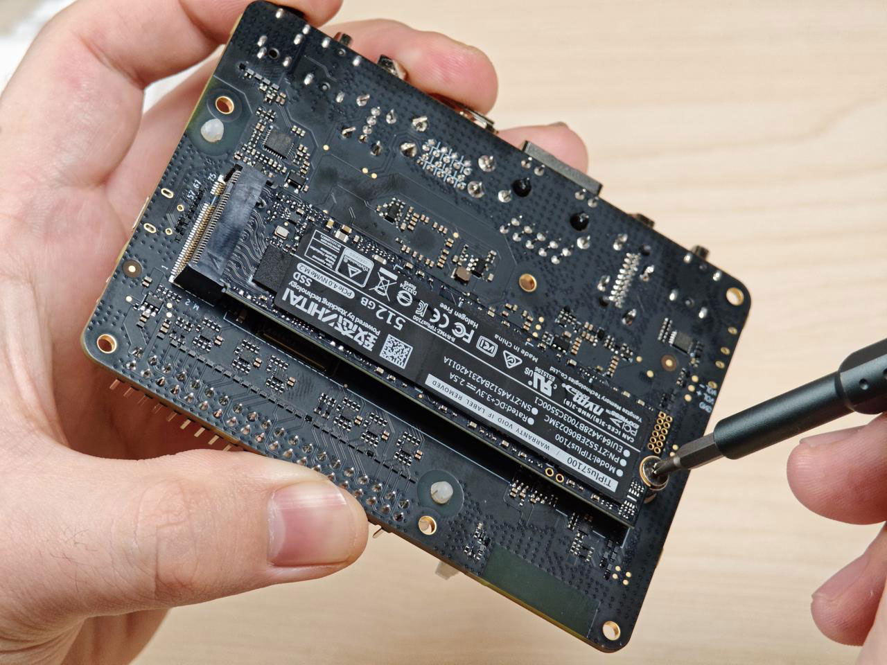

目前魔方派3暂未支持固态硬盘的自动挂载，可在魔方派3中执行下面命令对固态硬盘手动挂载

```shell showLineNumbers
mkdir /opt/ssd
mount /dev/nvme0n1 /opt/ssd
```

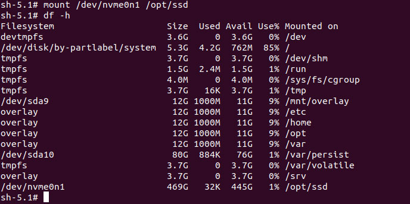

### 2.13.1 PCIe 功耗优化

PCIe 定义了两种功耗管理方法。

* 功耗管理软件，用于确定每个设备的功耗管理功能并分别对各个设备进行管理
* 不需要软件干预的系统，例如主动状态功耗管理 (ASPM)

当链路上未传输任何数据包时，设备会将链路置于节能状态。

#### 2.13.1.1 PCIe L0 链路状态

PCIe 功耗管理定义下了 L0 链路状态：

* L0：工作状态
* L0s：具有低恢复延迟的 ASPM 状态（节能待机状态）

#### 2.13.1.2 PCIe 设备状态

PCIe 功耗管理定义了以下设备状态：

* D0（必选）: 设备处于完全 ON 状态，此时存在两个子状态

  * D0(uninitialized)：当设备退出复位状态后等待枚举和配置时，该功能处于 D0(uninitialized) 状态
  * D0(active)

    * 当完成枚举和配置过程后，该功能处于 D0(active) 状态
    * 当系统软件启用一个或多个（任意组合）功能参数（如内存空间启用、I/O 空间启用、总线主启用（BME）位）时，该功能进入 D0(active) 状态
* D1（可选）：轻度休眠状态

  * 该功能只能发出 PME 消息，无法发出其他 TLP
  * 该功能只能充当配置事务的目标，无法充当其他事务的目标
  * 该功能通过发出设定 PM 控制和状态寄存器的软件命令来进入 D1 状态
* D2（可选）：深度休眠状态

  * 该功能只能发出 PME 消息，无法发出其他 TLP
  * 该功能只能充当配置事务的目标，无法充当其他事务的目标
  * 该功能通过发出设定 PM 控制和状态寄存器的软件命令来进入 D2 状态
* D3（必选）：设备处于最低功耗状态，此时该功能必须支持两种 D3 状态
* D3(hot)

  * 该功能只能发出 PME 消息，无法发出其他 TLP
  * 该功能只能充当配置事务的目标，无法充当其他事务的目标
  * 该功能通过设定功耗状态位域发出软件命令来进入 D3(hot) 状态
* D3(cold)：设备进入 D3(cold) 状态并断电；当恢复供电时，设备进入 D0(uninitialized) 状态

### 2.13.2 PCIe 调试

M.2 Key M 接口使用了 QCS6490 的 PCIe1 总线，设备路径为：*/sys/bus/pci/devices/0001:00:00.0*

`lspci` 和 `setpci` 命令为 Linux 发行版的本机命令。这两条命令提供多种级别的输出，并且还可用于在某个时间点查看 PCI 总线上训练的不同组件的功能和状态。这些功能大多反映的是 PCIe 基本规范所需的配置空间寄存器。更多详细信息，可访问 https://pcisig.com/specifications。如需查看使用说明，可运行以下命令。

```shell showLineNumbers
lspci --help
```

以下功能有助于解决 PCIe 问题。

* 显示设备信息

  ```shell showLineNumbers
  lspci
  ```
  示例输出

  ```shell showLineNumbers
  0000:00:00.0 PCI bridge: Qualcomm Device 010b
  0000:01:00.0 USB controller: Renesas Technology Corp. uPD720201 USB 3.0 Host Controller (rev 03)
  0001:00:00.0 PCI bridge: Qualcomm Device 010b
  ```
* 显示设备控制寄存器中的 PCIe 设备和厂商 ID。

  ```shell showLineNumbers
  lspci -nvmm
  ```
  示例输出

  ```shell showLineNumbers
  Slot:        00:00.0
  Class:        0604
  Vendor:        17cb
  Device:        010b
  IOMMUGroup:        6

  Slot:        01:00.0
  Class:        0c03
  Vendor:        1912
  Device:        0014
  Rev:        03
  ProgIf:        30
  IOMMUGroup:        6

  Slot:        0001:00:00.0
  Class:        0604
  Vendor:        17cb
  Device:        010b
  DTNode:        /sys/firmware/devicetree/base/soc@0/pci@1c08000/pcie@1
  IOMMUGroup:        7

  ```
