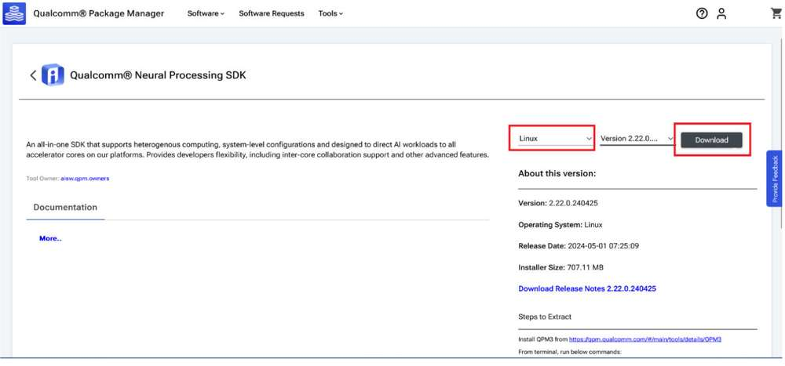
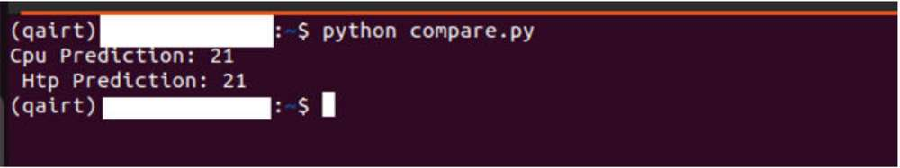
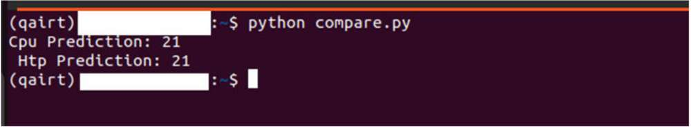

# AI 开发者工作流程

Qualcomm Linux 中的 AI/ML 开发人员工作流程主要分为两个步骤：
步骤 1：

编译并优化模型

- 编译并优化来自第三方 AI 框架的模型，以便在 RUBIK Pi 3 上高效运行。例如，可以将 TensorFlow 模型导出为 TFLite 模型。
- 或者，使用硬件特定的定制来量化、细调性能和精确度。

步骤 2：

编译应用程序，使用优化后的模型在设备上运行推理

- 将 AI 模型集成到用例 pipeline 中。
- 或者使用安卓的 native sdk 调用 Qualcomm AI SDKs。

## 概述


开发人员可以从 ONNX、PyTorch、TensorFlow 或 TFLite 引入模型，并使用 Qualcomm AI SDK 在 Qualcomm AI 硬件 - HTP (NPU)、GPU、CPU 上高效运行这些模型。


### AI 硬件

* Qualcomm Kryo™ CPU- 一流的 CPU，具有高性能和卓越的能效。

* Qualcomm Adreno GPU- 适合在需要平衡功耗与性能的情况下执行 AI 工作负载。AI 工作负载可以通过 OpenCL 内核进行加速。GPU 还可用于加速模型预处理/后处理。

* Qualcomm Hexagon 张量处理器 (HTP)- 又称 NPU/DSP/HMX，适合以低功耗、高性能执行AI 工作负载。为优化性能，需要对预训练模型进行量化，使其达到支持的任一种精度。

### AI 软件

AI 堆栈包含各种 SDK，以便利用 AI 硬件加速器的强大功能。开发人员可以使用自己选择的一种 SDK 来部署 AI 工作负载。预训练模型（TFLite 模型除外）在运行之前需要使用所选 SDK 将其转换为可执行格式。TFLite 模型可以使用 TFLite Delegate 直接运行。

* TFLite

TFLite 模型可以在使用以下 Delegate 进行加速的条件下在 Qualcomm 硬件本地执行。

| Delegate                                 | 加速             |
| ---------------------------------------- | -------------- |
| AI Engine Direct Delegate (QNN Delegate) | CPU, GPU 和 HTP |
| XNNPACK Delegate                         | CPU            |
| GPU Delegate                             | GPU            |

* Qualcomm 神经网络处理引擎 (SNPE) SDK

Qualcomm 神经网络处理引擎 (SNPE) 是一种用于执行深度神经网络的软件加速 runtime。SNPE 提供相关工具来对神经网络进行转换、量化，并在 CPU、GPU 和 HTP 等硬件加速器上对其进行加速。

* Qualcomm AI Engine Direct (QNN)

Qualcomm AI Engine Direct 是 Qualcomm 芯片组和 AI 加速核心中适用于 AI/ML 用例场景的一种软件架构。该架构旨在提供统一的 API，模块和可扩展的预加速库，从而基于这种可重用的结构打造全栈 AI 解决方案。它可为 Qualcomm 神经网络处理 SDK、TFLite AI Engine Direct Delegate 等 runtime 提供支持。

## 编译并优化模型

用户可以采用两种可用途径中的任一种来编译和优化他们的模型。

* AI Hub

* AI 软件堆栈

### AI Hub

为了在 Qualcomm AI 硬件上快速构建模型原型，AI Hub 提供了一种方法，帮助开发人员针对视觉、音频和语音用例在设备上对机器学习模型进行优化、验证和部署。


有关设置和入门指南，可参见[ AI Hub](https://app.aihub.qualcomm.com/docs/hub/getting_started.html#installation) 文档。

#### 环境配置

1. 配置 Python 环境。

在计算机上安装 [miniconda](https://docs.conda.io/projects/miniconda/en/latest/miniconda-install.html).

**Windows：**&#x5B89;装完成后，通过 Start 菜单打开 Anaconda 提示符窗口。

**macOS/Linux：**&#x5B89;装完成后，打开一个新的 shell 窗口。

为 Qualcomm(®) AI Hub 设置 Python 虚拟环境：

```cmake
source <path>/miniconda3/bin/activate
conda create python=3.8 -n qai_hub
conda activate qai_hub
```

2. 安装 AI Hub Python 客户端。

```cmake
pip3 install qai-hub
pip3 install "qai-hub[torch]"
```

3. 登录 AI Hub。

前往 [AI Hub](https://aihub.qualcomm.com/) 并使用 Qualcomm ID 登录，查看所创建作业的相关信息。

登录后，导航至 **Account***&#x20;*> **Settings** > **API Token**。此时应提供一个可用于配置客户端的 API 令牌。

4. 在终端，使用以下命令通过 API 令牌配置客户端。

```cmake
qai-hub configure --api_token <INSERT_API_TOKEN>
```

#### AI Hub 工作流程

##### 使用预优化模型

导航到[ AI Hub Model Zoo](https://aihub.qualcomm.com/iot/models)，访问适用于 RUBIK Pi 3 的模型.


点击下载按钮后开始模型下载。下载的模型已经过预先优化，可直接开发用户自己的应用程序。

##### 引入用户自己的模型

1. 选择 PyTorch 或 Onnx 格式的预训练模型。

2. 使用 Python API 将模型提交至 AI Hub 以进行编译或优化。

提交编译作业时，必须选择设备或芯片组以及目标 runtime 才能编译模型。RUBIK Pi 3 支持 TFLite runtime。

| 芯片组     | Runtime | CPU             | GPU       | HTP        |
| ------- | ------- | --------------- | --------- | ---------- |
| QCS6490 | TFLite  | INT8,FP16, FP32 | FP16,FP32 | INT8,INT16 |

提交后，AI Hub 会为该作业生成一个唯一的 ID。用户可以使用此作业 ID 查看作业详情。

* AI Hub 会根据选择的设备和 runtime 对模型进行优化。

或者，也可以提交作业以在源自设备集群且已经过配置的实际设备上对优化模型进行分析或推理（使用 Python API）。

* 性能分析：在已配置的设备上对模型进行基准测试并提供统计数据，包括层级的平均推理时间、runtime 配置等。

* 推理：在推理作业执行过程中，使用优化模型基于提交的数据进行推理，即在已配置的设备上运行该模型。

- 提交的每项作业都可以在 AI Hub 门户中进行审核。提交编译作业时，将提供优化模型的可下载链接。然后，该优化模型可以部署在 RUBIK Pi 3 等本地开发设备上。

下方所示为从 [AI Hub documentation](https://aihub.qualcomm.com/iot/models) 中获取的所述工作流程的示例。在本示例中，会将源自 PyTorch 的MobileNet V2 预训练模型上传到 AI Hub，并编译为优化的 TFLite 模型以便在 RUBIK Pi 3上运行。

```python
import qai_hub as hub
import torch
from torchvision.models import mobilenet_v2
import numpy as np
# Using pre-trained MobileNet
torch_model = mobilenet_v2(pretrained=True)
torch_model.eval()
# Trace model (for on-device deployment)
input_shape = (1, 3, 224, 224)
example_input = torch.rand(input_shape)
traced_torch_model = torch.jit.trace(torch_model, example_input)
# Compile and optimize the model for a specific device
compile_job = hub.submit_compile_job(
model=traced_torch_model,
device=hub.Device("QCS6490 (Proxy)"),
input_specs=dict(image=input_shape),
#compile_options="--target_runtime tflite",
)
# Profiling Job
profile_job = hub.submit_profile_job(
model=compile_job.get_target_model(),
device=hub.Device("QCS6490 (Proxy)"),
)
sample = np.random.random((1, 3, 224, 224)).astype(np.float32)
# Inference Job
inference_job = hub.submit_inference_job(
model=compile_job.get_target_model(),
device=hub.Device("QCS6490 (Proxy)"),
inputs=dict(image=[sample]),
)
# Download model
compile_job.download_target_model(filename="/tmp/mobilenetv2.tflite")
```

:::note
>
> 要停用先前激活的 qai\_hub 环境，可使用以下命令。
>
> `conda deactivate`
:::

模型下载完毕后，即可直接开发用户自己的应用程序。

有关 AI Hub 工作流程和 API 的更多详细信息，可参见 [AI Hub Documentation](https://app.aihub.qualcomm.com/docs/hub/index.html#examples).

### TFLite


TensorFlow Lite (TFLite) 是一个用于在设备上进行推理的开源深度学习框架。TFLite 可优化模型的延迟、模型尺寸、功耗等，帮助开发人员在移动、嵌入式和边缘平台上运行他们的模型。Qualcomm 支持通过下方列出的 TFLite Delegate 在 Qualcomm Linux 硬件本地执行 TFLite 模型。

| **Delegate**                             | **加速**       |
| ---------------------------------------- | ------------ |
| AI Engine Direct Delegate (QNN Delegate) | CPU, GPU，HTP |
| XNNPack Delegate                         | CPU          |
| GPU Delegate                             | GPU          |

| 参考指南                                                                                                | API 手册                                                                                                                                                        |
| --------------------------------------------------------------------------------------------------- | ------------------------------------------------------------------------------------------------------------------------------------------------------------- |
| [Reference Guide](https://docs.qualcomm.com/bundle/publicresource/topics/80-70014-54/overview.html) | [C/C++](https://www.tensorflow.org/lite/api_docs/cc?_gl=1*xotull*_ga*OTM5NzE4ODUwLjE2ODk2OTQ3MDI.*_ga_W0YLR4190T*MTcxNTM3NzQyMS4yNy4xLjE3MTUzNzc0MjEuMC4wLjA) |

### Qualcomm 神经网络处理引擎

Qualcomm 神经网络处理引擎（又称 Snapdragon 神经网络处理引擎或 SNPE）是一款一站式解决方案 SDK，用于移植 ML 模型以在 Qualcomm 硬件加速器上运行。SNPE 提供相关工具对在PyTorch 和 TensorFlow 中经过训练的模型进行转换和量化，并提供 runtime 以便在 CPU、GPU 和 HTP 上执行这些模型。想要了解有关 SNPE SDK 的详细信息，可点击[此处](https://docs.qualcomm.com/bundle/publicresource/topics/80-63442-2/introduction.html)。


| **环境配置**                                                                                                                                                                                                                                               | **定制**                                                                                                                                                                                                           | **Run Inference**                                                                                        | **API Reference**                                                                   |
| ------------------------------------------------------------------------------------------------------------------------------------------------------------------------------------------------------------------------------------------------------ | ---------------------------------------------------------------------------------------------------------------------------------------------------------------------------------------------------------------- | -------------------------------------------------------------------------------------------------------- | ----------------------------------------------------------------------------------- |
| [安装 Qualcomm 神经网络处理引擎 SDK](#installSDK)<p>[设置 Qualcomm 神经网络处理 SDK](#SetSDK)</p> | [模型转换](#modelconv)<p>[模型量化](#modelquant)</p> | [模型部署](#modeldeploy) | [C/C++](https://docs.qualcomm.com/bundle/publicresource/topics/80-63442-2/api.html) |

#### 安装 Qualcomm 神经网络处理引擎 SDK
<a id="installSDK"></a>

Qualcomm 神经网络处理引擎 SDK 需要在 Ubuntu 22.04 主机上运行。

:::note
>
> 如果主机运行的是 Windows 或 macOS 操作系统软件，须按照[此处](https://qualcomm.com/DCN/80-70014-41Y/overview.html?product=1601111740013095)提供的步骤安装虚拟机。后续步骤必须在运行 Ubuntu 22.04 LTS 的虚拟机中执行。
:::

Qualcomm 神经网络处理 SDK 工作流程已通过采用以下配置并运行于物理主机或虚拟机上的 Ubuntu 22.04 进行了验证。

:::note
>
> 不支持在基于 Arm 架构的 macOS 操作系统中的 VM 内运行 Ubuntu 22.04。
:::

| **下载方式**                                                                                                                     | **前提条件**                                         | **可用版本**             |
| ---------------------------------------------------------------------------------------------------------------------------- | ------------------------------------------------ | -------------------- |
| [直接下载](./4.ai-developer-workflow.md#diredown)                     | 无需任何前提条件即可下载                                     | v2.22.6（SDK 每季度更新一次） |
| [Qualcomm Package Manager](./4.ai-developer-workflow.md#Qpackmanager) | 需要拥有有效的 Qualcomm ID。Qualcomm Package Manager 工具。 | SDK 每月更新一次           |

##### 直接下载
<a id="diredown"></a>

Qualcomm 神经网络处理引擎 SDK 可从[此处](https://softwarecenter.qualcomm.com/api/download/software/qualcomm_neural_processing_sdk/v2.22.6.240515.zip)直接下载。下载后，提取或解压 SDK。

:::note
>
> 上述链接提供的 SDK 版本每季度更新一次。
:::

```cmake
unzip 2.22.6.240515.zip
cd qairt/2.22.6.240515/
export SNPE_ROOT=`pwd`
```

##### Qualcomm Package Manager
<a id="Qpackmanager"></a>

Qualcomm 神经网络处理引擎 SDK 也可以通过 Qualcomm Package Manager (QPM) 下载。本部分将演示如何使用 QPM 下载 Qualcomm 神经网络处理引擎 SDK。

:::note
>
> 如需使用 Qualcomm Package Manager 下载 Qualcomm 神经网络处理 SDK，应确保用户已经注册了 Qualcomm ID。如果用户没有 Qualcomm ID，系统将提示其注册。然后，按照下方说明下载并安装 SDK。 &#x20;**&#x20;       &#x20;**
:::

1. 前往 [Qualcomm Package Manager](https://qpm.qualcomm.com/#/main/) 并使用 Qualcomm ID 登录。

2. 导航至 **Tools&#x20;**&#x9009;项卡并在左侧窗格中搜索 "AI Stack"。在筛选结果中，点击 **Qualcomm® AI Stack&#x20;**&#x65C1;边的箭头，展开可用的 AI 软件 SDK 列表，然后从列表中选择 **Qualcomm Neural Processing SDK**。


3. 点击 **Qualcomm Neural Processing SDK**，导航至下一页。从下拉列表中选择 **Linux&#x20;**&#x548C; **Version 2.22.6.2405155**，然后点击 **Download&#x20;**&#x4E0B;载 Qualcomm 神经网络处理 SDK 安装程序。



:::note
>
> * 这些步骤基于版本 2.22.6.240515。
>
> * 如果使用 Qualcomm Package Manager 桌面工具，**Extract&#x20;**&#x5C06;取代下载按钮。点击该按钮会自动安装 SNPE SDK。
:::

* 安装使用 QPM CLI 工具下载的安装程序 (.qik)。

  1. 使用 QPM CLI 登录。

&#x20;           `qpm-cli --login <username> `        &#x20;


&#x20;         `qpm-cli --license-activate qualcomm_neural_processing_sdk`


&#x20;

&#x20;         `qpm-cli --extract <path to downloaded .qik file>`


Qualcomm 神经网络处理 SDK 将安装在以下路径：

*/opt/qcom/aistack/qairt/2.22.6.240515*

#### 设置 Qualcomm 神经网络处理 SDK
<a id="SetSDK"></a>

##### **前提条件**

1. 主机操作系统：Ubuntu22.04 LTS

:::note
>
> 如果主机运行的是 Windows 或 Mac OS 操作系统，须按照[此处](https://qualcomm.com/DCN/80-70014-41Y/overview.html?product=1601111740013095)提供的步骤安装虚拟机。后续步骤必须在运行 Ubuntu 22.04 LTS 的虚拟机中执行。
:::

2. 在 SELinux Permissive 模式下启用 SSH 以安全地登录主机设备。相关说明，可参见 [SSH 使用指南](https://docs.qualcomm.com/bundle/publicresource/topics/80-70014-254Y/how_to.html#-ssh-)。

3. 对于本文档的其余部分，环境变量 SNPE\_ROOT 表示 Qualcomm® 神经网络处理 SDK 根目录的完整路径。

如果通过直接下载的方式安装，$\{SNPE_ROOT\} 表示解压后的 SDK 所在路径。

```cmake
unzip v2.22.6.240515.zip
cd ~/qairt/2.22.6.240515
export SNPE_ROOT=`pwd`
```

如果通过 QPM 安装，则 SDK 安装在以下路径：*/opt/qcom/aistack/qairt/\<version>*

```cmake
export SNPE_ROOT=/opt/qcom/aistack/qairt/2.22.6.240515/
```

4. Python: v3.10

如果已安装 Python，确保环境路径已更新为 Python 3.10 的路径。如果系统中未安装 Python 3.10，可以使用以下命令进行安装：

```cmake
sudo apt-get update
sudo apt-get install python3.10 python3-distutils libpython3.10
```

5. 系统依赖项：

:::note
>
> 以管理员/root 身份运行以下命令，安装系统库。         &#x20;**&#x20;**
:::

```python
sudo bash ${SNPE_ROOT}/bin/check-linux-dependency.sh
```

6. 虚拟环境 (VENV)

:::note
>
> *\<venv\_path>&#x20;*&#x8868;表示新虚拟环境的路径。
:::

```cmake
sudo apt-get install python3.10-venv
python3.10 -m venv "<venv_path>"
source <venv_path>/bin/activate
```

运行以下脚本检查并安装缺少的依赖项：

```cmake
python3 -m pip install --upgrade pip
${SNPE_ROOT}/bin/check-python-dependency
```


##### **设置 ML 框架**

为了将在其他框架上训练的 ML 模型转换为 Qualcomm® 神经网络处理 SDK 可用的模型文件，可能需要将相应框架下载到主机上并进行安装。

此 Qualcomm® 神经网络处理 SDK 版本已经过验证，可与以下版本的 ML 训练框架配合使用：

| **框架**     | **版本**  |
| ---------- | ------- |
| TensorFlow | v2.10.1 |
| TFLite     | v2.3.0  |
| PyTorch    | V1.13.1 |
| ONNX       | V1.12.0 |

```cmake
# Install tensorflow
pip install tensorflow==2.10.1
# Install tflite
pip install tflite==2.3.0
# Install PyTorch
pip install torch==1.13.1+cpu torchvision==0.14.1+cpu torchaudio==0.13.1 --
extra-index-url https://download.pytorch.org/whl/cpu
# Install Onnx
pip install onnx==1.12.0 onnxruntime==1.17.1 onnxsim==0.4.36
```

##### **配置 SNPE SDK 环境**

导入 SNPE SDK 提供的环境配置脚本，确保所有必要的工具和库均已提供在 $PATH 中。

```shell
source ${SNPE_ROOT}/bin/envsetup.sh
```

#### 使用 SNPE 移植模型


##### 模型转换
<a id="modelconv"></a>

将源自 PyTorch、Onnx、TensorFlow 或 TFLite 的 32 位精度浮点型预训练模型输入到 SNPE 转换工具 (snpe-\<framework>-to-dlc)，将模型转换为 Qualcomm 特定的模型的模型文件，即深度学习容器 (DLC)。

除了来自源框架的输入模型之外，转换工具还需要有关输入模型的其他详细信息，例如输入节点名称、其对应的输入维度以及任何输出张量名称（对于具有多个输出的模型而言）。

可参考[转换工具](https://docs.qualcomm.com/bundle/publicresource/topics/80-63442-2/tools.html)部分，了解所有可用的可配置参数；也可以运行 `snpe-<framework>-to-dlc --help`，查看命令行帮助。

```plain&#x20;text
required arguments:
                    -d INPUT_NAME INPUT_DIM, --input_dim INPUT_NAME INPUT_DIM
                        The names and dimensions of the network input layers specified in the format
                        [input_name comma-separated-dimensions], for example:
                                   'data' 1,224,224,3
                        Note that the quotes should always be included in order to handle special
                       characters, spaces, etc.For multiple inputs specify multiple --input_dim on the command line
                        like:
                                   --input_dim 'data1' 1,224,224,3 --input_dim 'data2' 1,50,100,3
                    --out_node OUT_NAMES, --out_name OUT_NAMES
                        Name of the graph's output Tensor Names. Multiple output names should be provided separately                            like:
                                    --out_name out_1 --out_name out_2
                    --input_network INPUT_NETWORK, -i INPUT_NETWORK
                                    Path to the source framework model.
```

以下示例使用的是从 [ONNX Model Zoo ](https://github.com/onnx/models/blob/main/Computer_Vision/inception_v3_Opset16_timm/inception_v3_Opset16.onnx)下载的 ONNX 模型 (*inception\_v3\_opset16.onnx*)。将模型以 inception\_v3.onnx 另存到工作区中。在本示例中，我们将模型下载到 *\~/models* 目录。

运行以下命令，生成 inception\_v3.dl&#x63;**&#x20;**&#x6A21;型。

```shell
${SNPE_ROOT}/bin/x86_64-linux-clang/snpe-onnx-to-dlc --input_network ~/models/
inception_v3.onnx --output_path ~/models/inception_v3.dlc --input_dim 'x'
1,3,299,299
```


##### 模型量化
<a id="modelquant"></a>

如需在 Hexagon 张量处理器 (HTP) 上运行模型，转换后的 DLC 必须进行量化。SNPE 提供了一个量化工具 (snpe-dlc-quant)，可使用其自身的量化算法将 DLC 模型量化为 INT8/INT16 DLC。有关 SNPE 量化的更多信息，可从[此处](https://docs.qualcomm.com/bundle/publicresource/topics/80-63442-2/quantized_models.html)获取。

SNPE 中的量化过程分为两个步骤：

1. 模型内部权重和偏置的量化。

权重和偏置的量化是一个静态步骤，即无需用户额外输入数据。

2. 激活层（或没有权重的层）的量化。

* 对激活层进行量化时，需要将一组来自训练数据集的输入图像用作校准数据。

* 这些校准数据集图像采用 .raw 格式，以预处理图像文件列表形式输入。这些输入的 .raw 文件的文件大小必须与模型的输入大小相匹配。

`snpe-dlc-quant` 的输入包括一个转换后的 DLC 模型和一个包含校准数据集图像路径的纯文本文件。该输入列表包含以 NumPy 数组形式保存在 .raw 格式文件中的预处理图像的路径。预处理图像的大小必须与模型的输入分辨率相匹配。

`Snpe-dlc-quant `工具的输出是一个量化后的 DLC。

```plain&#x20;text
[ --input_dlc=<val> ]
                        Path to the dlc container
                        containing the model for which fixed-point encoding metadata should be generated.
                        This argument is required.
             [ --input_list=<val> ] Path to a file
                         specifying the trial inputs. This file should be a plain text file, containing one or more absolute file                            paths per line. These files will be taken to constitute the trial set. Each path is expected to point to                           a binary file containing one trial input in the 'raw' format, ready to be consumed by the tool                                        without any further modifications. This is similar to how input is provided to snpe-net-run                                          application.
             [ --output_dlc=<val> ]
                         Path at which the metadata-included quantized model container should be  written. If this                                          argument is omitted, the quantized model will be written at                                                                                                         <unquantized_model_name>_quantized.dlc.
```

:::note
>
> &#x20; 使用 [Netron ](https://github.com/lutzroeder/netron/releases/latest)图形可视化工具来识别模型的输入/输出层维度。     &#x20;
:::


为进行演示，我们可以使用随机输入文件来评估量化过程。可以使用下方所示的简单 Python 脚本生成 inception\_v3.onnx 模型的输入文件。将脚本以 *generate\_random\_input.py* 文件形式保存在工作区 *\~/models/* 中，并使用 *python \~/models/generate\_random\_input.py* 在主机上运行该脚本。

以下 Python 代码示例可创建一个 input\_list，其中包含用于量化模型的校准数据集图像的路径。

```python
import os
import numpy as np
input_path_list =[]
BASE_PATH = "/tmp/RandomInputsForInceptionV3"
if not os.path.exists(BASE_PATH):
    os.mkdir(BASE_PATH)
# generate 10 random inputs and save as raw
NUM_IMAGES = 10
#binary files
for img in range(NUM_IMAGES):
    filename = "input_{}.raw".format(img)
    randomTensor = np.random.random((1, 299, 299, 3)).astype(np.float32)
    filename = os.path.join(BASE_PATH, filename)
    randomTensor.tofile(filename)
    input_path_list.append(filename)
#for saving as input_list text
with open("input_list.txt", "w") as f:
    for path in input_path_list:
        f.write(path)
        f.write(‘\n’)
```

上述脚本会生成 10 个示例输入文件并保存在 */tmp/RandomInputsForInceptionV3* 目录，以及一个 *input\_list.txt&#x20;*&#x6587;件，其中包含所生成的每个示例的路径。

现在，snpe-dlc-quant 工具所需的所有输入均已准备好，现在可以对模型进行量化了。

```python
${SNPE_ROOT}/bin/x86_64-linux-clang/snpe-dlc-quant --input_dlc ~/models/
inception_v3.dlc --output_dlc ~/models/inception_v3_quantized.dlc --
input_list ~/models/input_list.txt
```

这会生成量化后的 inception\_v3 DLC 模型 (inception\_v3\_quantized.dlc)。默认情况下，对模型进行量化时采用 INT8 位宽。

开发人员可以指定 snpe-dlc-quant 工具的 \[--act\_bw 16] 和/或 \[--weight\_bw 16] 选项，将量化定制为使用 16 位位宽，而不用默认的 INT8 位宽。

可参见 [snpe-dlc-quant ](https://docs.qualcomm.com/bundle/publicresource/topics/80-63442-2/tools.html)工具文档或运行 `snpe-dlc-quant --help`，查看所有可用的定制选项，包括量化模式、优化等。


##### 模型优化

量化模型的 DLC 需要执行一个图形准备步骤，该步骤会对模型进行优化，以便在 HTP 上执行。为完成模型 DLC 的准备工作以便在 HTP 上执行，SNPE 提供了 snpe-dlc-graph- prepare 工具，工具的输入参数为量化模型和硬件特定细节，例如芯片型号。

:::note
>
> 对硬件（例如 HTP）的优化取决于芯片组上 HTP 的具体版本。为确保神经网络对执行图应用正确的优化指令集，从而优化 HTP 的利用率，务必向 snpe-dlc- graph-prepare 工具提供正确的芯片组 ID。
:::

该工具会根据 HTP 版本和芯片组 ID 创建一个缓存，其中存储在 HTP 硬件上执行模型 DLC 的执行策略。如果省去这一步，在网络初始化期间会产生额外的开销，因为 SNPE runtime 必须动态创建执行策略。

```python
${SNPE_ROOT}/bin/x86_64-linux-clang/snpe-dlc-graph-prepare --input_dlc ~/
models/inception_v3_quantized.dlc --output_dlc ~/models/
inception_v3_quantized_with_htp_cache.dlc --htp_socs qcs6490
```


##### HTP 缓存信息

snpe-dlc-graph-prepare 步骤完成后，会将 HTP 缓存记录添加到 DLC 中。缓存信息可以使用 snpe-dlc-info 工具查看。

```python
${SNPE_ROOT}/bin/x86_64-linux-clang/snpe-dlc-info -i ~/models/
inception_v3_quantized_with_htp_cache.dlc
```


##### 模型部署
<a id="modeldeploy"></a>

模型 DLC（量化或非量化）可以通过支持 SNPE 的应用程序（使用 SNPE C/C++ API 编写的应用程序）进行部署。SNPE 提供相关 API 来加载 DLC、选择 runtime，从而执行模型以及执行推理等。

SNPE 提供预编译的 [snpe-net-run ](https://docs.qualcomm.com/bundle/publicresource/topics/80-63442-2/tools.html#snpe-net-run)工具（使用 C API 编写的应用程序），该工具可以加载任意模型 DLC 并根据提供的输入进行执行。

* **模型文件**- 由 SNPE 转换工具或 snpe-dlc-graph-prepare 工具（如果在 HTP 上运行）生成的 DLC 模型文件。

* **输入列表**- 文本文件，与量化时使用&#x7684;*&#x20;input\_list.txt&#x20;*&#x6587;件类似，但此列表中的输入原始文件将用于推理。在本示例中，为简单起见，将量化时使用的同一输入列表重用于推理。

* **Runtime-&#x20;**&#x7528;户必须选择具体的 runtime 才能在目标设备上执行模型。可用的 runtime 选项包括 CPU、GPU 和 DSP (HTP)。

:::note
>
> 有关详细详细，可参见 `snpe-net-run --help`。
:::

**在 x86 主机上运行 SNPE DLC**

转换后的 SNPE DLC 可以使用 snpe-net-run 工具运行，该工具将 DLC 和 input\_list 用作参数。以下命令会生成输出文件并保存&#x5230;*&#x20;/output\_x86/&#x20;*&#x76EE;录下。在 x86 主机上运行 SNPE DLC 只是为了完成调试。

:::note
>
> SNPE 中的默认 runtime 是 CPU。使用 snpe-net-run 执行模型时，无需指定 CPU runtime。
:::

```python
${SNPE_ROOT}/bin/x86_64-linux-clang/snpe-net-run --container ~/models/
inception_v3.dlc --input_list ~/models/input_list.txt --output_dir ~/models/
output_x86
```

以上命令会加载模型 DLC 并在 x86 CPU 上执行该模型。模型执行后获得的输出将写入 *output\_x86* 目录。


**准备 SNPE 模型以在目标设备上运行**

如需在目标设备上运行模型，snpe-net-run 需要使用模型 DLC、SNPE runtime 库和输入列表来运行推理，从而生成输出。

:::note
>
> 在目标设备上运行之前，要确保 SNPE SDK 二进制文件和库已推送到目标设备中。
:::

对于 RUBIK Pi 3，使用路径 *$\{SNPE_ROOT\}/lib/aarch64-oe-linux-gcc11.2* 和 *$\{SNPE_ROOT\}/bin/aarch64-oe-linux-gcc11.2*.*&#x20;*&#x4E2D;的以下文件。

| **文件**                                         | **源位置**                                     |
| ---------------------------------------------- | ------------------------------------------- |
| snpe-net-run                                   | $\{SNPE_ROOT\}/bin/aarch64-oe-linux-gcc11.2  |
| libSNPE.so                                     | $\{SNPE_ROOT\}/lib/aarch64-oe-linux-gcc11.2/ |
| libSnpeHtpPrepare.so                           | $\{SNPE_ROOT\}/lib/aarch64-oe-linux-gcc11.2  |
| libSnpeHtpV68Stub.so                           | $\{SNPE_ROOT\}/lib/aarch64-oe-linux-gcc11.2  |
| libSnpeHtpV68Skel.so                           | $\{SNPE_ROOT\}/lib/hexagon-v68/unsigned      |
| Inception\_v3\_quantized\_with\_htp\_cache.dlc | \~/models                                   |
| Inception\_v3.dlc                              | \~/models                                   |
| input\_list.txt                                | \~/models                                   |
| Inception V3 sample input images               | /tmp/RandomInputsForInceptionV3             |

下列 scp 命令需要在主机上执行,以将 SNPE SDK 库和二进制文件复制到设备。

```bash
scp ${SNPE_ROOT}/bin/aarch64-oe-linux-gcc11.2/snpe-net-run root@[ipaddr]:/opt/
scp ${SNPE_ROOT}/lib/aarch64-oe-linux-gcc11.2/libSNPE.so root@[ip-addr]:/opt/
scp ${SNPE_ROOT}/lib/aarch64-oe-linux-gcc11.2/libSnpeHtpV68Stub.so root@[ip-addr]:/opt/
scp ${SNPE_ROOT}/lib/aarch64-oe-linux-gcc11.2/libSnpeHtpPrepare.so root@[ip-addr]:/opt/
scp ${SNPE_ROOT}/lib/hexagon-v68/unsigned/libSnpeHtpV68Skel.so root@[ip-addr]:/opt/

scp ~/models/inception_v3.dlc root@[ip- addr]:/opt/
scp ~/models/inception_v3_quantized_with_htp_cache.dlc root@[ip-addr]:/opt/
scp ~/models/input_list.txt root@[ip- addr]:/opt/
scp /tmp/RandomInputsForInceptionV3 root@[ip- addr]:/tmp/

ssh root@[ip-addr]

cd /opt
```

上述步骤为设备执行模型做好了准备。以下部分详细介绍如何在可用 runtime  中运行模型。

##### 在 Arm CPU 上运行 SNPE 模型

首先设置环境变量然后再执行模型，以确保在运行模型时 SNPE  二进制文件和库可以访问。

:::note
>
> SNPE 中的默认 runtime 是 CPU。使用 snpe-net-run 执行模型时，无需指定 CPU runtime。
:::

```python
export LD_LIBRARY_PATH=/opt:$LD_LIBRARY_PATH
export PATH=/opt/:$PATH
snpe-net-run --container inception_v3.dlc --input_list input_list.txt --
output_dir output_cpu
```


##### 在 GPU 上运行 SNPE 模型

如需在 GPU runtime 上运行模型，可使用 inception\_v3.dlc 并将输出保存在 *output\_gpu&#x20;*&#x76EE;录下。

:::note
>
> 如需在 GPU 上运行模型，可通过 `--use_gpu` 命令行参数指定 runtime。     &#x20;**&#x20;     &#x20;**
:::

```python
export LD_LIBRARY_PATH=/opt:$LD_LIBRARY_PATH
export PATH=/opt:$PATH
snpe-net-run --container inception_v3.dlc --input_list input_list.txt --
output_dir output_gpu --use_gpu
```

##### 在 HTP 上运行 SNPE 模型

如需在 HTP 后端运行模型，可使用 inception\_v3\_quantized\_with\_htp\_cache.dlc 模型 DLC 并将输出保存在 *output\_htp* 目录。

:::note
>
> 如需在 HTP 上运行模型，可通过 `--use_dsp` 命令行参数指定 runtime。             &#x20;
:::

```bash
export LD_LIBRARY_PATH=/opt:$LD_LIBRARY_PATH
export PATH=/opt:$PATH
export ADSP_LIBRARY_PATH="/opt;/usr/lib/rfsa/adsp;/dsp"
snpe-net-run --container inception_v3_quantized_with_htp_cache.dlc --
input_list input_list.txt --output_dir output_htp --use_dsp
```


##### 对输出进行验证

对于每个送入 snpe-net-run（通过 input\_list 文件）的输入原始文件，都会生成一个输出文件夹，其中存储以原始文件形式保存的输出张量，文件大小将与模型的输出层相匹配，如下图所示。

:::note
>
> [Netron ](https://netron.app/)工具用于对模型进行可视化。
:::


在示例 inception\_v3 中，输出原始文件是一个二进制文件，其中存储 1000 个分类类别的概率。

我们使用 Python 脚本将文件读取为 NumPy 数组，以执行后处理步骤，并对输出进行验证。下方示例用于检查 HTP 预测结果是否与 CPU 预测结果相同。

将输出文件从目标设备复制到主机，以便对输出进行验证。

```python
ssh root@[ip-addr]
cd /opt/
scp -r /opt/output_cpu user@host-ip:<path>
scp -r /opt/output_htp user@host-ip:<path>
```

:::note
>
> 在下方 (compare.py) Python 脚本中，须使用以上命令中的 *\<path>*。
:::

将设备上推理的输出复制到主机后，准备一个脚本来加载保存在 output\_htp 和 output\_cpu 中的输出张量以进行比较。在本示例中，需要将 output\_htp 和 output\_cpu 都复制到 *\~/ models* 目录。

下方示例展示了对特定输入如何比较输出结果。在本示例中，输出结果保存到主机上的 */opt&#x20;*&#x76EE;录。snpe-net-run 的输出结果可以使用 numpy.fromfile(…) API 加载成 NumPy 多维数组。

:::note
>
> 默认情况下，snpe-net-run 会将输出张量保存为 float3&#x32;**&#x20;**&#x683C;式的 NumPy 文件。
:::

```python
# python postprocessing script (compare.py)
import numpy as np
htp_output_file_path = "<path>/output_htp/Result_1/875.raw"
cpu_output_file_path = "<path>/output_cpu/Result_1/875.raw"
htp_output = np.fromfile(htp_output_file_path, dtype=np.float32)
htp_output = htp_output.reshape(1,1000)
cpu_output = np.fromfile(cpu_output_file_path, dtype=np.float32)
cpu_output = cpu_output.reshape(1,1000)
# np.argmax gives the cls_id with highest probability from tensor.
cls_id_htp = np.argmax(htp_output)
cls_id_cpu = np.argmax(cpu_output)
# Let's compare CPU output vs HTP output
print("Cpu prediction {} \n Htp Prediction {}".format(cls_id_cpu, cls_id_htp))
```

输出



**&#x20;使用 SNPE API 部署模型**

SNPE SDK 提供 C/C++ API，用于创建/开发应用程序，以在所选硬件（CPU、GPU 或 HTP）上加速运行模型。[此处](https://docs.qualcomm.com/bundle/publicresource/topics/80-63442-2/cplus_plus_tutorial.html)是一个使用 SNPE C/C++ API 开发的用于执行模型的示例程序。

### Qualcomm AI Engine Direct SDK

Qualcomm AI Engine Direct SDK（也称为 QNN SDK）提供 low-level API，用以在 Qualcomm 平台上实现 AI 的最佳性能。QNN SDK 支持来自 PyTorch、TensorFlow 和 Onnx 等框架的模型。QNN SDK 提供离线工具对模型进行转换、量化和优化，并在 Qualcomm AI 加速引擎上部署。


| **环境配置**                                                                                                                                                                                                                                                | **定制**                                                                                                                                                                                                              | **运行推理**                                                                                                 | **API 手册**                                                                           |
| ------------------------------------------------------------------------------------------------------------------------------------------------------------------------------------------------------------------------------------------------------- | ------------------------------------------------------------------------------------------------------------------------------------------------------------------------------------------------------------------- | -------------------------------------------------------------------------------------------------------- | ------------------------------------------------------------------------------------ |
| [安装 AI Engine Direct](./4.ai-developer-workflow.md#installAIdir)<p>[设置 Qualcomm AI Engine Direct](./4.ai-developer-workflow.md#setAIdire) </p>| [模型转化与量化](./4.ai-developer-workflow.md#modelconvquant)<p>[模型编译](./4.ai-developer-workflow.md#modelcompile) </p>| [部署模型](./4.ai-developer-workflow.md#deploymodel) | [C/C++](https://docs.qualcomm.com/bundle/publicresource/topics/80-63442-50/api.html) |

#### 安装 AI Engine Direct
<a id="installAIdir"></a>

Qualcomm AI Engine Direct SDK 需要在 Ubuntu 22.04 主机上运行。

:::note
>
> 如果主机运行的是 Windows 或 macOS 操作系统软件，须按照 [Windows 11 开发环境搭建](./1.get-started.md#setwin)、 [Mac 开发环境搭建（Arm64）](./1.get-started.md#setmac)、 [Mac 开发环境搭建（x86\_64）](./1.get-started.md#set86)提供的步骤安装虚拟机。后续步骤必须在运行 Ubuntu 22.04 LTS 的虚拟机中执行。       &#x20;**&#x20; &#x20;**
:::

Qualcomm AI Engine Direct SDK 工作流程已通过采用以下配置进行了验证：运行于物理主机或虚拟机上的 Ubuntu 22.04。

:::note
>
> 不支持在基于 Arm 架构的 macOS 操作系统中的 VM 内运行 Ubuntu 22.04。
:::

| **下载方式**                                                                                                                     | **前提条件**                                         | **可用版本**             |
| ---------------------------------------------------------------------------------------------------------------------------- | ------------------------------------------------ | -------------------- |
| [直接下载](./4.ai-developer-workflow.md#downdirec)                     | 无需任何前提条件即可下载。                                    | v2.22.6（SDK 每季度更新一次） |
| [Qualcomm Package Manager](./4.ai-developer-workflow.md#QuaMana) | 需要拥有有效的 Qualcomm ID。Qualcomm Package Manager 工具。 | SDK 每月更新一次。          |

##### 直接下载
<a id="downdirec"></a>

AI Engine Direct SDK 可从[此处](https://softwarecenter.qualcomm.com/api/download/software/qualcomm_neural_processing_sdk/v2.22.6.240515.zip)直接下载。下载后，解压软件包。

:::note
>
> 上述链接提供的 SDK 版本每季度更新一次。
:::

```shell
unzip 2.22.6.240515.zip
cd qairt/2.22.6.240515/
export SNPE_ROOT=`pwd`
```

##### Qualcomm Package Manager
<a id="QuaMana"></a>

AI Engine Direct SDK 也可以通过 Qualcomm Package Manager (QPM) 下载。本部分演示如何使用 QPM 下载 AI Engine Direct SDK。

:::note
>
> 为使用 Qualcomm Package Manager 下载 Qualcomm AI Engine Direct，须确保用户已经注册了 Qualcomm ID。如果用户没有 Qualcomm ID，系统将提示其注册。然后，按照下方说明下载并安装 SDK。
:::

1. 前往 [Qualcomm Package Manager ](https://qpm.qualcomm.com/%23/main/)并使用 Qualcomm ID 登录。


2. 点击 **AI Engine Direct SDK**，导航至下一页。从下拉列表中选择 **Linux&#x20;**&#x548C; **Version 2.22.6.240515**，然后点击 **Download&#x20;**&#x4E0B;载 AI Engine Direct SDK 安装程序。


:::note
>
> * 这些步骤基于版本 2.22.6.240515。
>
> * 如果使用 Qualcomm Package Manager 桌面工具，**Extract&#x20;**&#x5C06;取代下载按钮。点击该按钮会自动安装 QNN SDK。
:::

3. 安装使用 QPM CLI 工具下载的安装程序 (.qik)。

    1. 使用 QPM CLI 登录。

     ```shell
     qpm-cli --login <username>
     ```

     

    2. 激活 SDK 许可证。

     ```python
      qpm-cli --license-activate qualcomm_ai_engine_direct
     ```

     

     3. 提取并安装 SDK。

     ```python
     qpm-cli --extract <path to downloaded .qik file>
     ```

     

#### 设置 Qualcomm AI Engine Direct
<a id="setAIdire"></a>

**设置 SDK**

如需使用 AI Engine Direct SDK，应安装以下版本的 Ubuntu 操作系统和 Python：

* &#x20;Ubuntu 22.04

* &#x20;Python 3.10

有关详细的设置说明，可参见 [AI Engine Direct SDK 设置](https://docs.qualcomm.com/bundle/publicresource/topics/80-63442-50/setup.html)。

:::note
>
> *$\{QNN_SDK_ROOT\}&#x20;*&#x6307;向已安装 AI Engine Direct SDK 的根路径。
>
> * 如果通过直接下载方式下载，须将 *$\{QNN_SDK_ROOT\}&#x20;*&#x8BBE;置为下载并解压 SDK 的根目录。
>
> * 如果通过 QPM 安装，根目录路径为 */opt/qcom/aistack/qairt/\<version>*。本示例使用的是 2.22.6.240515 版本，因此路径为：*/opt/qcom/ aistack/qairt/2.22.6.240515*。
:::

SDK 设置步骤如下:

* 安装 [Linux 平台依赖项](https://docs.qualcomm.com/bundle/publicresource/topics/80-63442-50/setup.html#linux-platform-dependencies)

* 使用 `${QNN_SDK_ROOT}/bin/check-python-dependency` 安装 Python 依赖项

* 使用 `sudo bash ${QNN_SDK_ROOT}/bin/check-linux-dependency.sh` 安装 Ubuntu 软件包

* 安装模型所需的 ML 框架（PyTorch、TensorFlow、ONNX）。有关支持的框架版本，可参见下表。

| **框架**     | **版本**  |
| ---------- | ------- |
| TensorFlow | v2.10.1 |
| TFLite     | v2.3.0  |
| PyTorch    | v1.13.1 |
| ONNX       | v1.12.0 |

```shell
# Install tensorflow
pip install tensorflow==2.10.1
# Install tflite
pip install tflite==2.3.0
# Install PyTorch
pip install torch==1.13.1+cpu torchvision==0.14.1+cpu torchaudio==0.13.1 --
extra-index-url https://download.pytorch.org/whl/cpu
# Install Onnx
pip install onnx==1.12.0 onnxruntime==1.17.1 onnxsim==0.4.36
```

##### 配置环境

用 `source` 命令执行 QNN SDK 提供的环境配置脚本，确保所有工作流程中必需的工具和库均已在 $PATH 中。

```shell
source ${QNN_SDK_ROOT}/bin/envsetup.sh
```

#### QNN 模型移植

##### 模型转换与量化
<a id="modelconvquant"></a>

将源自 PyTorch、Onnx、TensorFlow 或 TFLite 的 FP32 预训练模型输入到 QNN 转换工具 qnn-\<framework>-converter 中，转换为 C++ 格式的可读的 high-level QNN 图。

如果在 HTP 加速器上加速模型，则必须对模型进行量化。模型量化可以与模型转换在同一步骤中完成。在执行此量化步骤时，必须提供校准数据集才能执行静态量化。

如需在转换时同时实现量化，可使用 --input\_list INPUT\_LIST 选项进行静态量化。有关详细信息，可参见[量化支持](https://docs.qualcomm.com/bundle/publicresource/topics/80-63442-50/quantization.html)文档。

以下示例使用的是从 [ONNX Model Zoo ](https://github.com/onnx/models/blob/main/Computer_Vision/inception_v3_Opset16_timm/inception_v3_Opset16.onnx)下载的 ONNX 模型 (*inception\_v3\_opset16.onnx*)。将模型

inception\_v3.onnx 下载到工作区中。在本示例中，我们将模型下载到 *\~/models&#x20;*&#x76EE;录。

#### 仅模型转换（对于 CPU 后端）

为转换模型到 x86/Arm CPU 上运行，可运行以下命令，生&#x6210;*&#x20;inception\_v3.cpp* 和 *inception\_v3.bin* 文件。

```shell
python ${QNN_SDK_ROOT}/bin/x86_64-linux-clang/qnn-onnx-converter --
input_network ~/models/inception_v3.onnx --output_path ~/models/
inception_v3.cpp --input_dim 'x' 1,3,299,299
```


*inception\_v3.cpp* 文件存储转换后模型的 high-level 图。*inception\_v3.bin* 文件存储模型的权重/偏置。

#### 模型转换和量化（对于 HTP 后端）

如需在 HTP 上运行模型，应对模型进行量化。对于 AI Engine Direct (QNN) SDK 中的量化，从训练数据集中抽取 50 到 200 张图像构成代表性数据集，提供给 QNN 转换工具作为校准数据集。校准数据集中的图像已经过预处理（调整大小、归一化等）并以 NumPy 数组形式保存在 .raw 格式文件中。这些输入的 .raw 文件的大小必须与模型的输入大小相匹配。

:::note
>
> 使用 Netron 模型可视化工具来识别模型的输入/输出层的维度。
:::


为进行演示，我们可以使用随机输入文件来评估量化过程。可以使用下方所示的 Python 脚本生成 inception\_v3.onnx 模型的输入文件。将脚本 *generate\_random\_input.py* 保存在 *\~/models* 中，并通过以下方式运行该脚本：*python \~/models/ generate\_random\_input.py*。

以下 Python 代码可创建一个 input\_list，以包含用于量化模型的校准数据集。

```python
import os
import numpy as np
input_path_list =[]
BASE_PATH = "/tmp/RandomInputsForInceptionV3"
if not os.path.exists(BASE_PATH):
    os.mkdir(BASE_PATH)
# generate 10 random inputs and save as raw
NUM_IMAGES = 10
#binary files
for img in range(NUM_IMAGES):
    filename = "input_{}.raw".format(img)
    randomTensor = np.random.random((1, 299, 299, 3)).astype(np.float32)
    filename = os.path.join(BASE_PATH, filename)
    randomTensor.tofile(filename)
    input_path_list.append(filename)
#for saving as input_list text
with open("~/models/input_list.txt", "w") as f:
    for path in input_path_list:
        f.write(path)
        f.write('\n')
```

现在，我们可以运行以下命令，对模型进行转换和量化。默认情况下，对模型进行量化时采用 INT8 位宽。开发人员可以使用 \[--act\_bw 16] 和/或 \[--weight\_bw 16]，指定 INT16 位宽进行量化。

```bash
${QNN_SDK_ROOT}/bin/x86_64-linux-clang/qnn-onnx-converter --input_network ~/
models/inception_v3.onnx --output_path ~/models/inception_v3_quantized.cpp --
input_list ~/models/input_list.txt --input_dim "x" 1,3,299,299
```

这会在 *\~/models* 目录中生成 *inception\_v3\_quantized.cpp* 和 *inception\_v3\_quantized.bin* 文件。

可参见 [qnn-\<framework>-converter ](https://docs.qualcomm.com/bundle/publicresource/topics/80-63442-50/tools.html)文档或运行 `qnn-<framework>-converter --help`， 查看量化所有可用的定制选项，包括量化模式、优化等。

#### 模型编译
<a id="modelcompile"></a>

转换/量化步骤完成后，使用 qnn-model-lib-generator 将生成的 C++ 图编译为 Linux 共享对象 (.so)，使应用程序能够动态加载模型，从而执行推理。

对于 x86 架构，可使用 Clang 编译工具链将 C++ 图编译为 .so 库。对于 RUBIK Pi 3 等 Linux 嵌入式设备，必须使用适当的编译工具链 (aarch64-oe-linux-gcc11.2)。

#### 编译在 x86 上运行的模型

使用以下命令生成一个可在基于 x86 架构的 Linux 机器上运行的 Linux 共享对象模型。该命令会使用 Clang-14 编译工具链生成 inception\_v3.so，将 C++ 图编译为与 x86 主机兼容的 QNN 模型 .so 库。

```shell
${QNN_SDK_ROOT}/bin/x86_64-linux-clang/qnn-model-lib-generator -c ~/models/
inception_v3.cpp -b ~/models/inception_v3.bin -o ~/models/libs/ -t x86_64-
linux-clang
```


#### 编译在目标设备上运行的模型

在编译用于在设备上执行的模型（aarch64 架构）时，务必要使用适合的交叉编译工具链，确保编译获得的 Linux 共享对象 (.so) 与设备操作系统兼容。

以下步骤用于安装将模型 cpp 文件编译为 .so 库所需的交叉编译工具链。

将以下更改应用到平台 eSDK，以确保 QNN 工具能够与 eSDK 一起正常工作。以下说明使用 ESDK\_ROOT 环境变量，该变量设置为平台 eSDK 安装路径。

1. &#x5C06;*&#x20;$ESDK\_ROOT/tmp/sysroots/qcm6490* 软链接到 *$ESDK\_ROOT/tmp/sysroots/armv8a-oe-linux*。

```shell
ln -s $ESDK_ROOT/tmp/sysroots/qcm6490 $ESDK_ROOT/tmp/sysroots/armv8a-oe-linux
```

2. &#x5C06;***&#x20;**$ESDK\_ROOT/tmp/sysroots/x86\_64* 软链接&#x5230;*&#x20;$ESDK\_ROOT/tmp/sysroots/x86\_64-qtisdk-linux。*

```shell
ln -s $ESDK_ROOT/tmp/sysroots/x86_64 $ESDK_ROOT/tmp/sysroots/x86_64-qtisdk-linux
```

* &#x5C06;**&#x20;***$ESDK\_ROOT/tmp/sysroots/x86\_64-qtisdk-linux/usr/bin/aarch64-qcom-inux* 软链接到 *$ESDK\_ROOT/tmp/sysroots/x86\_64-qtisdk-linux/usr/bin/aarch64-oe-linux。*

```bash
ln -s $ESDK_ROOT/tmp/sysroots/x86_64-qtisdk-linux/usr/bin/aarch64-qcom-
linux $ESDK_ROOT/tmp/sysroots/x86_64-qtisdk-linux/usr/bin/aarch64-oe-linux
```

4. 将交叉编译器 the cross-compiler $ESDK\_ROOT/tmp/sysroots/x86\_64-qtisdk-

linux/usr/bin/aarch64-oe-linux 创建软链接，具体如下：

```bash
ln -s $ESDK_ROOT/tmp/sysroots/x86_64-qtisdk-linux/usr/bin/aarch64-oe-linux/
aarch64-qcom-linux-g++ $ESDK_ROOT/tmp/sysroots/x86_64-qtisdk-linux/usr/bin/
aarch64-oe-linux/aarch64-oe-linux-g++
ln -s $ESDK_ROOT/tmp/sysroots/x86_64-qtisdk-linux/usr/bin/aarch64-oe-linux/
aarch64-qcom-linux-objdump $ESDK_ROOT/tmp/sysroots/x86_64-qtisdk-
linux/usr/bin/aarch64-oe-linux/aarch64-oe-linux-objdump
ln -s $ESDK_ROOT/tmp/sysroots/x86_64-qtisdk-linux/usr/bin/aarch64-oe-linux/
aarch64-qcom-linux-objcopy $ESDK_ROOT/tmp/sysroots/x86_64-qtisdk-
linux/usr/bin/aarch64-oe-linux/aarch64-oe-linux-objcopy
```

5. 导出以下环境变量，将 QNN 指向交叉编译器：

```shell
export QNN_AARCH64_LINUX_OE_GCC_112=$ESDK_ROOT/tmp/
```

#### 编译在 Arm CPU 上运行的模型

安装交叉编译器后，使用以下命令在 *\~/model/libs/aarch64-oe-linux-gcc11.2&#x20;*&#x8DEF;径生成 *libinception\_v3.so*。我们可以通过命令行参数将此位置提供给 qnn-model-lib-generator 工具。

:::note
>
> 此处使用的编译工具链是：\~/model/libs/aarch64-oe-linux-gcc11.2
:::

```shell
${QNN_SDK_ROOT}/bin/x86_64-linux-clang/qnn-model-lib-generator -c ~/models/
inception_v3.cpp -b ~/models/inception_v3.bin -o ~/models/libs -t aarch64-oe-
linux-gcc11.2
```

#### 编译在 HTP 上运行的模型

为在 HTP 上运行模型，使用以下命令在 *\~/models/libs/aarch64-oe-linux-gcc11.2&#x20;*&#x751F;成 *libinception\_v3\_quantized.so*。

:::note
>
> 此处使用的编译工具链是：aarch64-oe-linux-gcc11.2.
:::

```shell
${QNN_SDK_ROOT}/bin/x86_64-linux-clang/qnn-model-lib-generator -c ~/models/
inception_v3_quantized.cpp -b ~/models/inception_v3_quantized.bin -o ~/models/
libs/ -t aarch64-oe-linux-gcc11.2
```

#### 部署模型
<a id="deploymodel"></a>

模型 .so（量化或非量化）可以通过支持 QNN 的应用程序（使用 QNN C/C++ API 编写的应用程序）进行部署。QNN 提供 API 来动态加载模型 .so 并使用所选后端在硬件上运行该模型。

QNN 提供了一个预编译工具 ([qnn-net-run](https://docs.qualcomm.com/bundle/publicresource/topics/80-63442-50/tools.html#qnn-net-run))，该工具可以动态加载此模型 .so 并使用提供的输入在指定后端执行推理。

在 CPU、GPU 或 HTP 上执行时，qnn-net-run 需要使用三个参数：

* **模型文件 -&#x20;**&#x7531; qnn-model-lib-generator 生成的 .so 文件

* **后端文件&#x20;**- 目标后端所需的 .so 文件

  * libQnnCpu.so 适用于 CPU 后端。

  * libQnnGpu.so 适用于 GPU 后端。

  * libQnnHtp.so 适用于 HTP 后端。

* **输入列表 -** 文本文件，与量化时使用的 *input\_list.txt&#x20;*&#x6587;件类似，但此列表中的输入原始文件用于推理。在本示例中，为简单起见，将量化时使用的同一输入列表用于推理。

##### 在 x86 后端运行 QNN 模型

如需在 x86 CPU 上运行模型，qnn-net-run 需要使用模型 .so、后端库 .so 和输入列表来运行推理，从而生成输出。

例如，以下命令会加载 libinception\_v3.so 模型并在 x86 CPU 上运行该模型。执行完成后，qnn-net-run 工具会将输出文件写入 *\~/models/output\_x86*。

```bash
${QNN_SDK_ROOT}/bin/x86_64-linux-clang/qnn-net-run --model ~/models/libs/
x86_64-linux-clang/libinception_v3.so --backend ${QNN_SDK_ROOT}/lib/x86_64-
linux-clang/libQnnCpu.so --input_list input_list.txt --output_dir ~/models/
output_qnn_x86
```

##### 准备 QNN 模型以在设备上运行

在目标设备上运行模型之前，要确保 QNN 二进制文件和库连同模型和输入文件已推送到目标中。

对于 RUBIK Pi 3，使用路径 *$\{QNN_SDK_ROOT\}/bin/aarch64-oe-linux-gcc11.2* &#x548C;*$\{QNN_SDK_ROOT\}/lib/aarch64-oe-linux-gcc11.2.&#x20;*&#x4E2D;的文件。

| **文件**                         | **源位置**                                                       |
| ------------------------------ | ------------------------------------------------------------- |
| qnn-net-run                    | $\{QNN_SDK_ROOT\}/bin/aarch64-oe-linux-gcc11.2                |
| libQnnHtp.so                   | $\{QNN_SDK_ROOT\}/lib/aarch64-oe-linux-gcc11.2/ libQnnHtp.so  |
| libQnnCpu.so                   | $\{QNN_SDK_ROOT\}/lib/aarch64-oe-linux-gcc11.2/ libQnnCpu.so  |
| libQnnGpu.so                   |  $\{QNN_SDK_ROOT\}/lib/aarch64-oe-linux-gcc11.2/ libQnnGpu.so |
| libQnnHtpPrepare.so            | $\{QNN_SDK_ROOT\}/lib/aarch64-oe-linux-gcc11.2                |
| libQnnHtpV68Stub.so            | $\{QNN_SDK_ROOT\}/lib/aarch64-oe-linux-gcc11.2                |
| libinception\_v3\_quantized.so | \~/models/libs/aarch64-oe-linux-gcc11.2                       |
| libinception\_v3.so            | \~/models/libs/aarch64-oe-linux-gcc11.2                       |
| libQnnHtpV68Skel.so            | $\{QNN_SDK_ROOT\}/lib/hexagon-v68/unsigned                    |
| libqnnhtpv68.cat               | $\{QNN_SDK_ROOT\}/lib/hexagon-v68/unsigned                    |
| libQnnSaver.so                 | $\{QNN_SDK_ROOT\}/lib/hexagon-v68/unsigned                    |
| libQnnSystem.so                | $\{QNN_SDK_ROOT\}/lib/hexagon-v68/unsigned                    |

```bash
scp ${QNN_SDK_ROOT}/bin/aarch64-oe-linux-gcc11.2/qnn-* root@[ip-addr]:/opt/
scp ${QNN_SDK_ROOT}/lib/aarch64-oe-linux-gcc11.2/libQnn*.so root@[ip-addr]:/opt/
scp ${QNN_SDK_ROOT}/lib/hexagon-v68/unsigned/* root@[ip-addr]:/opt/
scp ~/models/libs/aarch64-oe-linux-gcc11.2/* root@[ip-addr]:/opt/
scp ~/models/input_list.txt root@[ip-addr]:/opt/
scp /tmp/RandomInputsForInceptionV3 root@[ip-addr]:/tmp/
ssh root@[ip-addr]
cd /opt/
```

##### 在 Arm CPU 上运行 QNN 模型

在基于 Arm 架构的 CPU 上执行模型时，qnn-net-run 需要使用模型 .so（对于 RUBIK Pi 3 目标设备，.so 必须使用 aarch64-oe-linux-gcc11.2 工具链进行交叉编译）、后端 .so 库和输入列表来运行推理，从而生成输出。

例如，以下命令会将输出文件写入 */opt/output\_cpu*。

```shell
export LD_LIBRARY_PATH=/opt/:$LD_LIBRARY_PATH
export PATH=/opt:$PATH
qnn-net-run --model libinception_v3.so --backend libQnnCpu.so --input_list
input_list.txt --output_dir output_cpu
```

##### 在 GPU 上运行 QNN 模型

在 Adreno GPU 上执行模型时，qnn-net-run 需要使用模型 .so、后端 .so 库 (libQnnGpu.so) 和输入列表来运行推理，从而生成输出。

例如，以下命令会将输出文件写&#x5165;*/opt/output\_gpu*。

```python
export LD_LIBRARY_PATH=/opt/:$LD_LIBRARY_PATH
export PATH=/opt:$PATH
qnn-net-run --model libinception_v3.so --backend libQnnGpu.so --input_list
input_list.txt --output_dir output_gpu
```

##### 在 HTP 后端运行 QNN 模型

如需在 HTP 后端运行模型，可使用 libquantized\_inception\_v3.so 库和 libQnnHtp.so 后端库，并将输出保存在 *output\_htp&#x20;*&#x76EE;录中。

```bash
export LD_LIBRARY_PATH=/opt/:$LD_LIBRARY_PATH
export PATH=/opt:$PATH
export ADSP_LIBRARY_PATH="/opt/;/usr/lib/rfsa/adsp;/dsp"
qnn-net-run --model libinception_v3_quantized.so --backend libQnnHtp.so --
input_list input_list.txt --output_dir output_htp
```

##### 对输出进行验证

对于每个送入 qnn-net-run（通过 input\_list 文件）的输入原始文件，都会生成一个输出文件夹，其中存储输出原始文件，文件大小将与模型的输出层相匹配，如下图所示。（[Netron ](https://netron.app/)是一种模型可视化工具）


对于本示例 inception\_v3，输出原始文件是一个二进制文件，其中存储 1000 个分类类别的概率。

我们使用 Python 脚本将文件读取为 NumPy 数组，以执行后处理步骤，并对输出进行验证。下方示例用于检查 HTP 预测结果是否与 CPU 预测结果相同。

```python
ssh root@[ip-addr]
cd /opt/
scp -r /opt/output_cpu user@host-ip:<path>
scp -r /opt/output_htp user@host-ip:<path>
```

:::note
>
> 在下方 Python 脚本中，使用以上命令中的 *\<path>*。
:::

将 qnn-net-run 工具的输出从设备复制到主机后，我们即可创建一个简单的 Python 脚本，用于加载在 CPU 和 HTP 上执行的输出，并使用 NumPy 对它们进行比较。

```python
#python postprocessing script (compare.py)
import numpy as np
htp_output_file_path = "<path>/output_htp/Result_1/875.raw"
cpu_output_file_path = "<path>/output_cpu/Result_1/875.raw"
htp_output = np.fromfile(htp_output_file_path, dtype=np.float32)
htp_output = htp_output.reshape(1,1000)
cpu_output = np.fromfile(cpu_output_file_path, dtype=np.float32)
cpu_output = cpu_output.reshape(1,1000)
cls_id_htp = np.argmax(htp_output)
cls_id_cpu = np.argmax(cpu_output)
# Let's compare CPU output vs HTP output
print("CPU prediction {} \n HTP prediction {}".format(cls_id_cpu, cls_id_htp))
```

输出



##### 使用 QNN API 部署模型

Qualcomm AI Engine Direct SDK 提供 C/C++ API，用于创建/开发应用程序，以加载已编译 .so 模型并在所选后端（CPU、GPU 或 HTP）上加速执行。[此处](https://docs.qualcomm.com/bundle/publicresource/topics/80-63442-50/sample_app.html)是一个使用 SNPE C/C++ API 开发的用于执行模型的示例程序。
