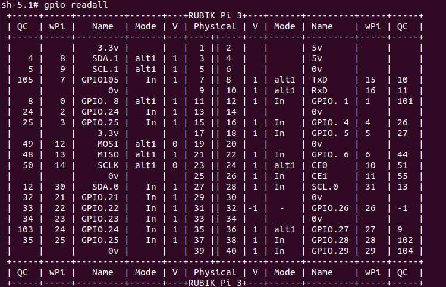
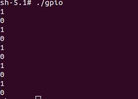
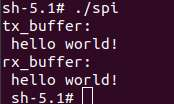
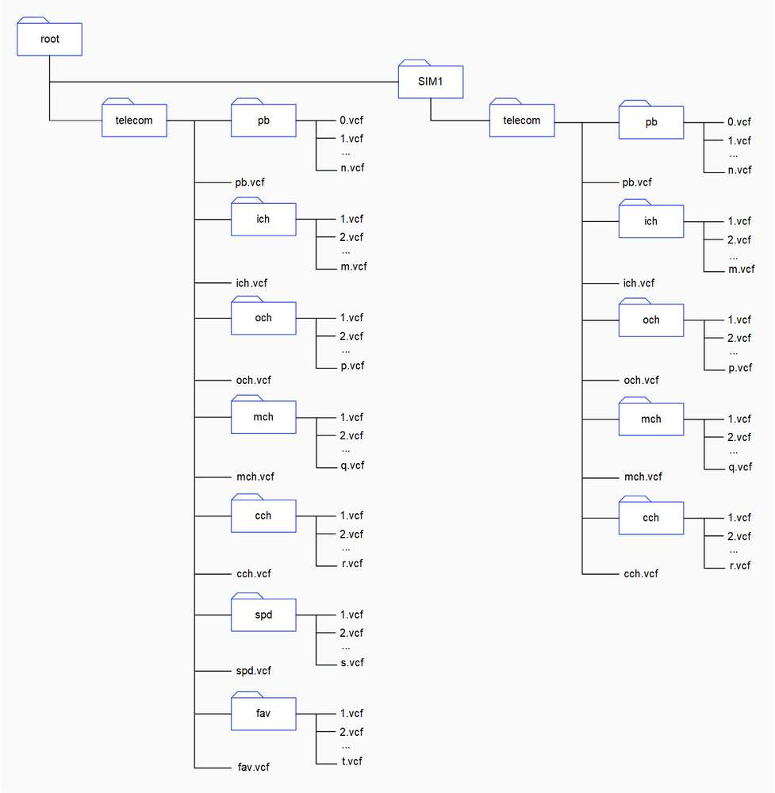
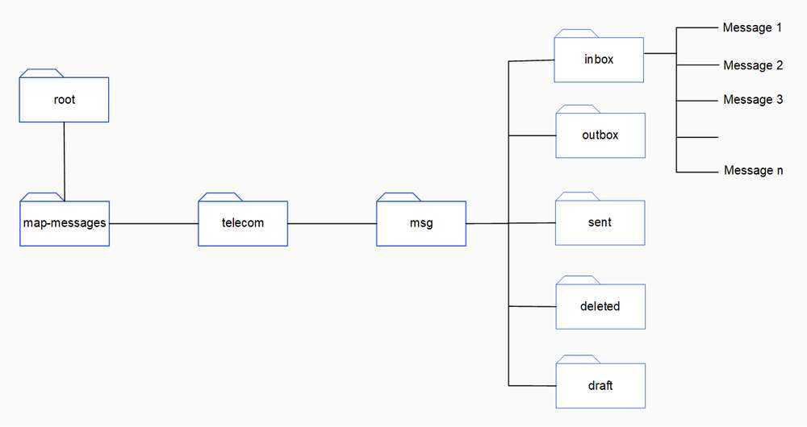
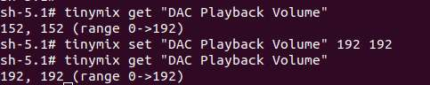
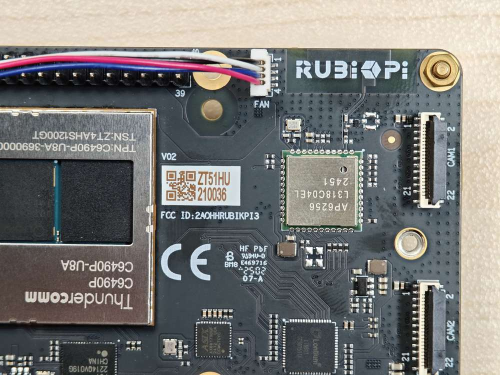

# 外设与接口

## 硬件资源图


| 序号 | 接口                      | 序号 | 接口                |
|------|---------------------------|------|---------------------|
| 1    | RTC 电池接口              | 10   | 电源 Type-C 接口    |
| 2    | Micro USB (UART 调试)     | 11   | PWR 按键            |
| 3    | TurboX C6490P SOM         | 12   | EDL 按键            |
| 4    | 3.5mm 耳机接口            | 13   | 摄像头接口 2        |
| 5    | USB Type-C with DP (USB 3.1) | 14 | 摄像头接口 1        |
| 6    | USB Type-A (USB 2.0)      | 15   | Wi-Fi/蓝牙模块      |
| 7    | 2 x USB Type-A (USB 3.0)  | 16   | 风扇接口            |
| 8    | 1000M 以太网              | 17   | 40-pin 连接器       |
| 9    | HDMI OUT                  | 18   | M.2 Key M 接口      |

## 40 pin 连接器

### GPIO

RUBIK Pi 3 适配了 WiringRP（基于高性能 GPIO 编程库 WiringPi），推荐使用 WiringRP 来对 GPIO 进行控制和编程。关于 WiringRP 详细信息可访问 https://github.com/rubikpi-ai/WiringRP 查看。

#### 引脚分布

下图是 RUBIK Pi 3 40-pin 连接器的引脚默认功能，其中大部分引脚和开源开发板的40-pin连接器引脚的默认功能兼容。


下表是 40-pin连接器支持的所有功能，图中蓝色字体表明默认功能。


#### 使用 shell 命令控制

在 RUBIK Pi 3 中执行下面的步骤控制 GPIO。

* 使用 WiringRP 相关命令

  * 查看 GPIO 状态

    ```shell
    gpio readall
    ```

  

  * 设置 GPIO 模式

    ```shell
    gpio mode 15 in             # 将15号引脚模式置为输入
    gpio pins                   # 查看更改之后的状态
    gpio mode 15 out            # 将15号引脚模式置为输出
    gpio pins                   # 查看更改之后的状态
    ```

  * 设置引脚电平

    ```shell
    gpio write 15 1             # 将15号引脚置为高电平
    gpio read 15                # 读取更改后引脚状态
    gpio write 15 0             # 将15号引脚置为低电平
    gpio read 15                # 读取更改后引脚状态
    ```

* 操作 */sys/class/gpio* 下相关节点

  GPIO 子系统的编号如下表。

   

       - 进入 /sys/class/gpio 目录：

       ```
       cd /sys/class/gpio
       ```
       - 将要控制的 GPIO 导出，如控制 13 号引脚 GPIO_24：

       ```
       echo 559 > export
       ```
       - 进入到 gpio559 目录设置 GPIO 属性：

       ```
       cd gpio559
       ls
       ```
       

    - direction（方向）：
      - 输入：in
      - 输出：out
    - value（值）：
      - 低电平：0
      - 高电平：1
    - edge （中断边沿）：
      - 上升沿触发：rising
      - 下降沿触发：falling
      - 双边沿触发：both
      - 禁用中断：none
    
    如设置 13 号引脚输出高电平：
     ```
     echo out > direction
     echo 1 > value
     ```

    取消导出 13 号引脚到用户空间：
    ```
    echo 559 > unexport
    ```

#### 使用 WiringRP (C) 控制

WiringRP 库中提供了一系列的 API 函数，用更少的逻辑实现控制。

* 以下代码示例，将 13 号引脚设置为输出， 15 号引脚设置为输入，循环检测 15 号引脚的电平状态：

```c
#include <stdio.h>
#include <wiringPi.h>

int main (void)
{
  wiringPiSetup () ;
  pinMode (13, OUTPUT) ;
  pinMode (15, INPUT) ;

  for (;;)
  {
    digitalWrite (13, HIGH) ;        // On
    printf("%d\n", digitalRead (15));        // On
    delay (1000) ;                // mS
    digitalWrite (13, LOW) ;        // Off
    printf("%d\n", digitalRead (15));        // On
    delay (1900) ;
  }

  return 0 ;
}
```

* 在 RUBIK Pi 3 中编译程序

  ```shell
  adb push gpio.c /opt
  adb shell
  cd /opt
  gcc gpio.c -o gpio -lwiringPi
  ```

* 将 13 和 15 号引脚使用杜邦线短接，测试 GPIO 电平控制和电平读取情况，如下图所示：

  :::warning
  >
  > 注意引脚顺序，请勿将电源和地引脚短接，否则可能会造成板子损坏。
  :::

  

  运行如下命令：

  ```shell
  cd /opt
  ./gpio
  ```

  程序运行结果如下：

   

#### 使用 WiringRP-Python 控制

WiringRP 库中提供了一系列的 API 函数，用更少的逻辑实现控制。

* 下方截取代码是使用 WiringRP 库操作 GPIO 的示例，其中将 13 号引脚设置为输出，15 号引脚设置为输入，循环检测 15 号引脚的电平状态。

  ```python
  import wiringpi
  import time

  wiringpi.wiringPiSetup()
  wiringpi.pinMode(13, 1)
  wiringpi.pinMode(15, 0)
  wiringpi.digitalRead(15)

  while True:
      wiringpi.digitalWrite(13,1)
      pin_level = wiringpi.digitalRead(15)
      print(f"in_gpio level: {pin_level}")

      time.sleep(1)

      wiringpi.digitalWrite(13,0)
      pin_level = wiringpi.digitalRead(15)
      print(f"in_gpio level: {pin_level}")

      time.sleep(1)
  ```

* 将 *gpio.py&#x20;*&#x4F20;输到 RUBIK Pi 3 中，如使用 ADB 传输。

  ```shell
  adb push gpio.py /opt
  ```

* 将 13 和 15 号引脚使用杜邦线短接，测试 GPIO 电平控制和电平读取情况，如下图所示

  :::warning
  >
  > 注意引脚顺序，请勿将电源和地引脚短接，否则可能会造成板子损坏。
  :::

  

  运行如下命令：

  ```shell
  cd /opt
  python3 gpio.py 
  ```

  程序运行结果如下：

   

#### 使用 Python 程序控制

* 使用 Python 的 periphery 库控制 GPIO，需先在 RUBIK Pi 3 中使用下面命令安装 python-periphery：

  ```shell
  pip3 install python-periphery 
  ```

* 下方截取代码是使用 periphery 库操作 GPIO 的示例，其中将 13 号引脚设置为输出，15 号引脚设置为输入，循环检测 15 号引脚的电平状态。

  ```python
  from periphery import GPIO
  import time

  out_gpio = GPIO(559, "out")
  in_gpio = GPIO(560, "in")

  try:
      while True:
          try:
              out_gpio.write(True)
              pin_level = in_gpio.read()
              print(f"in_gpio level: {pin_level}")

              out_gpio.write(False)
              pin_level = in_gpio.read()
              print(f"in_gpio level: {pin_level}")

              time.sleep(1)

          except KeyboardInterrupt:
              out_gpio.write(False)
              break

  except IOError:
      print("Error")

  finally:
      out_gpio.close()
      in_gpio.close()
  ```

* 将 *gpio.py&#x20;*&#x4F20;输到 RUBIK Pi 3 中，如使用 ADB 传输。

  ```shell
  adb push gpio.py /opt
  ```

* 将 13 和 15 号引脚使用杜邦线短接，测试 GPIO 电平控制和电平读取情况，如下图所示：

  :::warning
  >
  > 注意引脚顺序，请勿将电源和地引脚短接，否则可能会造成板子损坏。
  :::

  

  运行如下命令：

  ```shell

  cd /opt
  python3 gpio.py 

  ```

  程序运行结果如下：

   

#### 使用 C 语言程序控制

* 以下代码示例将 13 号引脚设置为输出，15 号引脚设置为输入，循环检测 15 号引脚的电平状态：

  ```c
  #include <stdio.h>
  #include <stdlib.h>
  #include <unistd.h>

  int out_gpio = 559;
  int in_gpio = 560;

  int main() {
      char export_path[50] = {};
      char export_command[100] = {};
      snprintf(export_path, sizeof(export_path), "/sys/class/gpio/export");
      snprintf(export_command, sizeof(export_command), "echo %d > %s ", out_gpio, export_path);
      system(export_command);
      snprintf(export_command, sizeof(export_command), "echo %d > %s ", in_gpio, export_path);
      system(export_command);

      char direction_path[50] = {};
      snprintf(direction_path, sizeof(direction_path), "/sys/class/gpio/gpio%d/direction", out_gpio);
      FILE *direction_file = fopen(direction_path, "w");
      if (direction_file == NULL) {
          perror("Failed to open GPIO direction file");
          return -1;
      }
      fprintf(direction_file, "out");
      fclose(direction_file);

      snprintf(direction_path, sizeof(direction_path), "/sys/class/gpio/gpio%d/direction", in_gpio);
      direction_file = fopen(direction_path, "w");
      if (direction_file == NULL) {
          perror("Failed to open GPIO direction file");
          return -1;
      }
      fprintf(direction_file, "in");
      fclose(direction_file);

      char value_in_path[50] = {};
      char value_out_path[50] = {};
      char cat_command[100] = {};
      snprintf(value_out_path, sizeof(value_out_path), "/sys/class/gpio/gpio%d/value", out_gpio);
      snprintf(value_in_path, sizeof(value_in_path), "/sys/class/gpio/gpio%d/value", in_gpio);
      snprintf(cat_command, sizeof(cat_command), "cat %s", value_in_path);

      FILE *value_out_file = fopen(value_out_path, "w");
      if (value_out_file == NULL) {
          perror("Failed to open GPIO value file");
          return -1;
      }

      for (int i = 0; i < 5; i++) {
          fprintf(value_out_file, "1");
          fflush(value_out_file);

          system(cat_command);
          sleep(1);

          fprintf(value_out_file, "0");
          fflush(value_out_file);

          system(cat_command);
          sleep(1);
      }

      fclose(value_out_file);

      char unexport_path[50] = {};
      char unexport_command[100] = {};
      snprintf(unexport_path, sizeof(unexport_path), "/sys/class/gpio/unexport");
      snprintf(unexport_command, sizeof(unexport_command), "echo %d > %s ", out_gpio, unexport_path);
      system(unexport_command);
      snprintf(unexport_command, sizeof(unexport_command), "echo %d > %s ", in_gpio, unexport_path);
      system(unexport_command);

      return 0;
  }

  ```

* 编译程序：

  * 交叉编译，具体可参考 [交叉编译工具使用方法](./1.get-started.md#usecrosstool)章节：

    ```shell
    aarch64-qcom-linux-gcc gpio.c -o gpio --sysroot=/home/zhy/qcom_sdk_meta/sysroots/armv8-2a-qcom-linux/
    ```

    若使用了交叉编译，需将 gpio 传输到 RUBIK Pi 3 中，如使用 ADB 传输：

    ```shell
    adb push gpio /opt
    ```

  * 在 RUBIK Pi 3 中编译：

    ```shell
    adb push gpio.c /opt
    adb shell
    cd /opt
    gcc gpio.c -o gpio
    ```

* 将 13 和 15 号引脚使用杜邦线短接，测试 GPIO 电平控制和电平读取情况，如下图所示：

  :::warning
  >
  > 注意引脚顺序，请勿将电源和地引脚短接，否则可能会造成板子损坏。
  :::

  

  运行如下命令：

  ```shell
  cd /opt
  ./gpio
  ```

  程序运行结果如下：

   

### I2C

I2C 是飞利浦公司在 20 世纪 80 年代开发的一种双向 2 线制总线，用于实现高效的 IC 间控制总线。总线上的每个设备都有其唯一的地址（由飞利浦公司领导的 I2C 总机构注册）。I2C 核心支持多控制器模式，以及 10 位目标地址和 10 位可扩展地址。关于 I2C 的更多信息，请参阅 https://www.i2c-bus.org/fileadmin/ftp/i2c_bus_specification_1995.pdf。

RUBIK Pi 3 适配了 WiringRP（基于高性能 GPIO 编程库 WiringPi ）。推荐使用 WiringRP 对 I2C 进行控制和编程。关于 WiringRP 详细信息可访问 https://github.com/rubikpi-ai/WiringRP 查看。

#### 引脚分布

下图是 RUBIK Pi 3 40-pin 连接器的引脚默认功能，其中大部分引脚和开源开发板的40-pin连接器引脚的默认功能兼容。


:::note

3 号引脚和 5 号引脚默认已设置配为 I2C1。
:::

下表是 40-pin 连接器支持的所有功能，图中蓝色字体表明默认功能。


#### 使用 shell 命令测试

在 RUBIK Pi 3 中执行下面步骤控制 I2C 总线。

* 使用 WiringRP 相关命令：

  ```shell
  ./gpio -x ads1115:100:10 aread 100     #通过 I2C 总线读取 ADS1115 设备的模拟信号值
  ```

* 使用 i2cdetect 工具

  * 查看 I2C1 接口上的设备：

    ```shell
    i2cdetect -a -y -r 1
    ```

  * 读取地址为 0x38 设备的全部寄存器：

    ```shell
    i2cdump -f -y 1 0x38
    ```

  * 向地址为 0x38 设备的 0x01 寄存器地址写入 0xaa：

    ```shell
    i2cset -f -y 1 0x38 0x01 0xaa
    ```

  * 读取地址为 0x38 的设备，寄存器地址为0x01处的数值：

    ```shell
    i2cget -f -y 1 0x38 0x01
    ```

#### 使用 WiringRP (C) I2C 通信

WiringRP 库中提供了一系列的 API 函数，用更少的逻辑实现控制。

* 以下代码示例，I2C1 总线和地址为 0x38 的设备进行通信，向设备 0x01 地址处写入 0xaa：

  ```c
  #include <wiringPi.h>
  #include <wiringPiI2C.h>
  #include <stdio.h>
  #include <stdlib.h>
  #include <unistd.h>

  #define I2C_ADDRESS 0x38

  int main(void)
  {
      int fd;

      if (wiringPiSetup() == -1) {
          exit(1);
      }

      fd = wiringPiI2CSetup(1, I2C_ADDRESS);
      if (fd == -1) {
          exit(1);
      }

      unsigned char data[2];
      if (read(fd, data, 2) != 2) {
          exit(1);
      }

      wiringPiI2CWriteReg8(fd, 0x01, 0xaa) ;

      close(fd);
      return 0;
  }


  ```

* 在 RUBIK Pi 3 中编译程序

  ```shell
  adb push gpio.c /opt
  adb shell
  cd /opt
  gcc i2c.c -o i2c -lwiringPi
  ```

* 将 3 和 5 号引脚连接 I2C 传感器，验证 I2C 总线通信，如下图所示

  :::warning
  >
  > 注意引脚顺序，请勿将电源和地引脚短接，否则可能会造成板子损坏。
  :::

  

  运行如下命令运行程序：

  ```shell
  cd /opt
  ./i2c
  ```

#### 使用 WiringRP-Python I2C 通信

WiringRP 库中提供了一系列的 API 函数，用更少的逻辑实现控制。

* 以下代码示例，使用 I2C1 总线和地址为 0x38 的设备进行通信，向设备 0x01 地址处写入 0xaa：

  ```bash
  import wiringpi as wpi

  wpi.wiringPiSetup()
  fd=wpi.wiringPiI2CSetup(0x38, 1)
  wpi.wiringPiI2CWriteReg8 (fd, 0x01, 0xaa)

  ```

* &#x5C06;*&#x20;i2c.py&#x20;*&#x4F20;输到 RUBIK Pi 3 中，如使用 ADB 传输。

  ```shell
  adb push i2c.py /opt
  ```

* 将 3 和 5 号引脚连接 I2C 传感器，验证 I2C 总线通信，如下图所示：

  :::warning
  >
  > 注意引脚顺序，请勿将电源和地引脚短接，否则可能会造成板子损坏。
  :::

  

  运行如下命令：

  ```shell
  cd /opt
  python3 i2c.py 
  ```

#### 使用 Python 程序 I2C 通信

* 使用 Python 的 smbus 库控制 I2C，需先在 RUBIK Pi 3 中使用下面命令安装 smbus 库：

  ```shell
  pip3 install smbus
  ```

* 以下代码示例，使用 I2C1 总线和地址为 0x38 的设备进行通信，向设备 0x01 地址处写入 0xaa：

  ```python
  import smbus

  def main():
      data = [0x01, 0xaa]

      try:
          i2c_bus = smbus.SMBus(1)  

          print("i2cdetect addr : ", end="")
          for address in range(0x7F):
              try:
                  i2c_bus.write_i2c_block_data(address, 0, data)
                  print("0x{:02X},".format(address), end="")
              except OSError:
                  pass  

          print()

      except Exception as e:
          print(f"An error occurred: {e}")

      finally:
          if i2c_bus:
              i2c_bus.close()

  if __name__ == "__main__":
      main()

  ```

* 将 *i2c.py&#x20;*&#x4F20;输到 RUBIK Pi 3中，如果使用 ADB 传输，命令如下：

  ```shell
  adb push i2c.py /opt
  ```

* 将 3 和 5 号引脚连接 I2C 传感器，验证 I2C 总线通信，如下图所示：

  :::warning
  >
  > 注意引脚顺序，请勿将电源和地引脚短接，否则可能会造成板子损坏。
  :::

  

  运行如下命令：

  ```shell
  cd /opt
  python3 i2c.py 
  ```

  程序运行结果如下：

   

#### 使用 C 语言程序 I2C 通信

* 以下代码示例，I2C1 总线和地址为 0x38 的设备进行通信，向设备 0x01 地址处写入 0xaa：

  ```c
  #include <stdio.h>
  #include <stdlib.h>
  #include <stdint.h>
  #include <fcntl.h>
  #include <unistd.h>
  #include <linux/i2c-dev.h>
  #include <sys/ioctl.h>

  #define I2C_DEVICE_PATH "/dev/i2c-1"

  int main() {
      uint8_t data[2] = {0x01,0xaa};
      
      const char *i2c_device = I2C_DEVICE_PATH;  
      int i2c_file;

      if ((i2c_file = open(i2c_device, O_RDWR)) < 0) {
          perror("Failed to open I2C device");
          return -1;
      }
      
      ioctl(i2c_file, I2C_TENBIT, 0);
      ioctl(i2c_file, I2C_RETRIES, 5);

      printf("i2cdetect addr : ");
      for (int x = 0; x < 0x7f; x++)
      {
          if (ioctl(i2c_file, I2C_SLAVE, x) < 0) {
              perror("Failed to set I2C slave address");
              close(i2c_file);
              return -1;
          }
          
          if (write(i2c_file, data, 2) == 2)
          {
              printf("0x%x,", x);
          }
      }
      
      close(i2c_file);
      printf("\r\n");

      return 0;
  }
  ```

* 编译程序：

  * 交叉编译，具体可参考 [交叉编译工具使用方法](./1.get-started.md#usecrosstool) 章节：

    ```shell
    aarch64-qcom-linux-gcc i2c.c -o i2c --sysroot=/home/zhy/qcom_sdk_meta/sysroots/armv8-2a-qcom-linux/
    ```

    若使用的交叉编译，需要将 *i2c&#x20;*&#x4F20;输到 RUBIK Pi 3 中，如果使用 ADB 传输，命令如下：

    ```shell
    adb push i2c /opt
    ```

  * 在 RUBIK Pi 3 中编译

    ```shell
    adb push i2c.c /opt
    adb shell
    cd /opt
    gcc i2c.c -o i2c
    ```

* 将 3 和 5 号引脚连接 I2C 传感器，验证 I2C 总线通信，如下图所示：

  :::warning
  >
  > 注意引脚顺序，请勿将电源和地引脚短接，否则可能会造成板子损坏。
  :::

  

  运行如下命令：

  ```shell
  cd /opt
  ./i2c
  ```

  程序运行结果如下：

   

### SPI

串行外设接口 (SPI) 是在全双工模式下工作的同步串行数据链路。SPI 又称为 4 线制串行总线。

RUBIK Pi 3 适配了 WiringRP（基于高性能 GPIO 编程库 WiringPi），推荐使用 WiringRP 对 SPI 进行控制和编程。关于 WiringRP 详细信息可访问 https://github.com/rubikpi-ai/WiringRP 查看。

#### 引脚分布

下图是 RUBIK Pi 3 40-pin 连接器的引脚默认功能，其中大部分引脚和开源开发板的40-pin连接器引脚的默认功能兼容。


:::note

19 号、21 号、23 号、24 号引脚默认已设置配为 SPI。
:::

下表是 40-pin 连接器支持的所有功能，图中蓝色字体表明默认功能。


#### 使用 WiringRP (C) SPI 通信

WiringRP 库中提供了一系列的 API 函数，用更少的逻辑实现控制。

* 以下代码示例使用 SPI 总线进行数据收发通信：

  ```c
  #include <wiringPi.h>
  #include <wiringPiSPI.h>
  #include <stdio.h>
  #include <stdlib.h>

  int main(void)
  {
      int fd;
      unsigned char send_data[64] =  "hello world!";
      unsigned char read_data[64];

      if(wiringPiSetup() == -1)
          exit(1);

      fd = wiringPiSPISetup(0, 1000000);
      if(fd < 0)
          exit(2);

          printf("\rtx_buffer: \n %s\n ", send_data);
      // Send and receive data
      if(wiringPiSPIDataRW(0, send_data, sizeof(send_data)) < 0)
          exit(3);
          printf("\rtx_buffer: \n %s\n ", send_data);


      return 0;
  }
  ```

* 在 RUBIK Pi 3 中编译程序

  ```shell
  adb push spi.c /opt
  adb shell
  cd /opt
  gcc spi.c -o spi -lwiringPi
  ```

* 将 19 号引脚和 21 号引脚使用杜邦线短接，验证 SPI 总线通信，如下图所示：

  :::warning
  >
  > 注意引脚顺序，请勿将电源和地引脚短接，否则可能会造成板子损坏。
  :::

  

  运行如下命令：

  ```shell
  cd /opt
  ./spi
  ```

  程序执行结果如下：

  

#### 使用 WiringRP-Python SPI通信

WiringRP 库中提供了一系列的 API 函数，用更少的逻辑实现控制。

* 以下代码示例使用 SPI 总线进行数据收发通信：

  ```bash
  import wiringpi as wpi                                                          
                                                
  wpi.wiringPiSetup()                                                             
                                                                          
  wpi.wiringPiSPISetup(0, 8000000)                                                
                                                                 
  tx_buffer = bytes([72, 101, 108, 108, 111])                                     
  print("tx_buffer:\n\r ", tx_buffer)                                             
  retlen, rx_buffer = wpi.wiringPiSPIDataRW(0, tx_buffer)                         
  print("rx_buffer:\n\r ", rx_buffer)                                             
                                        
  ```

* &#x5C06;*&#x20;spi.py&#x20;*&#x4F20;输到 RUBIK Pi 3 中，如使用 ADB 传输。

  ```shell
  adb push spi.py /opt
  ```

* 将 19 号引脚和 21 号引脚使用杜邦线短接，验证 SPI 总线通信，如下图所示：

  :::warning
  >
  > 注意引脚顺序，请勿将电源和地引脚短接，否则可能会造成板子损坏。
  :::

  

  运行如下命令：

  ```shell
   python3 spi.py 
  ```

  程序执行结果如下：

  

#### 使用 Python 程序 SPI 通信

* 使用 Python 的 spidev 库进行 SPI 通信，需先在 RUBIK Pi 3 中使用下面命令安装spidev 库：

  ```shell
  pip3 install spidev
  ```

* 以下代码示例使用 SPI 总线进行数据收发通信：

  ```python
  import spidev

  def main():
      tx_buffer = [ord(char) for char in "hello world!"]
      rx_buffer = [0] * len(tx_buffer)

      try:
          spi = spidev.SpiDev()
          spi.open(12, 0)
          spi.max_speed_hz = 1000000  

          rx_buffer = spi.xfer2(tx_buffer[:])
          print("tx_buffer:\n\r", ''.join(map(chr, tx_buffer)))
          print("rx_buffer:\n\r", ''.join(map(chr, rx_buffer)))

      except Exception as e:
          print(f"An error occurred: {e}")

      finally:
          if spi:
              spi.close()

  if __name__ == "__main__":
      main()
  ```

* 将 *spi.py&#x20;*&#x4F20;输到 RUBIK Pi 3 中，如果使用 ADB 传输，命令如下：

  ```shell
  adb push spi.py /opt
  ```

* 将 19 号引脚和 21 号引脚使用杜邦线短接，验证 SPI 总线通信，如下图所示：

  :::warning
  >
  > 注意引脚顺序，请勿将电源和地引脚短接，否则可能会造成板子损坏。
  :::

  

  运行如下命令：

  ```shell
   python3 spi.py 
  ```

  程序执行结果如下：

   

#### 使用 C 语言程序 SPI 通信

* 以下代码示例使用 SPI 总线进行数据收发通信：

  ```c
  #include <stdio.h>
  #include <stdlib.h>
  #include <stdint.h>
  #include <fcntl.h>
  #include <unistd.h>
  #include <linux/spi/spidev.h>
  #include <sys/ioctl.h>

  #define SPI_DEVICE_PATH "/dev/spidev12.0"

  int main() {
      int spi_file;
      uint8_t tx_buffer[50] = "hello world!";
      uint8_t rx_buffer[50];

      // Open the SPI device
      if ((spi_file = open(SPI_DEVICE_PATH, O_RDWR)) < 0) {
          perror("Failed to open SPI device");
          return -1;
      }

      // Configure SPI mode and bits per word
      uint8_t mode = SPI_MODE_0;
      uint8_t bits = 8;
      if (ioctl(spi_file, SPI_IOC_WR_MODE, &mode) < 0) {
          perror("Failed to set SPI mode");
          close(spi_file);
          return -1;
      }
      if (ioctl(spi_file, SPI_IOC_WR_BITS_PER_WORD, &bits) < 0) {
          perror("Failed to set SPI bits per word");
          close(spi_file);
          return -1;
      }

      // Perform SPI transfer
      struct spi_ioc_transfer transfer = {
          .tx_buf = (unsigned long)tx_buffer,
          .rx_buf = (unsigned long)rx_buffer,
          .len = sizeof(tx_buffer),
          .delay_usecs = 0,
          .speed_hz = 1000000,  // SPI speed in Hz
          .bits_per_word = 8,
      };

      if (ioctl(spi_file, SPI_IOC_MESSAGE(1), &transfer) < 0) {
          perror("Failed to perform SPI transfer");
          close(spi_file);
          return -1;
      }

       /* Print tx_buffer and rx_buffer*/
      printf("\rtx_buffer: \n %s\n ", tx_buffer);
      printf("\rrx_buffer: \n %s\n ", rx_buffer);

      // Close the SPI device
      close(spi_file);

      return 0;
  }
  ```

* 编译程序：

  * 交叉编译，具体可参考 [交叉编译工具使用方法](./1.get-started.md#usecrosstool)章节：

    ```shell
    aarch64-qcom-linux-gcc spi.c -o spi --sysroot=/home/zhy/qcom_sdk_meta/sysroots/armv8-2a-qcom-linux/
    ```

     若使用交叉编译，需要将 spi 传输到 RUBIK Pi 3 中，如果使用 ADB 传输，命令如下：

     ```
     adb push spi /opt
     ```

  * 在 RUBIK Pi 3 中编译

    ```c
    adb push spi.c /opt
    adb shell
    cd /opt
    gcc spi.c -o spi
    ```

* 将 19 号引脚和 21 号引脚使用杜邦线短接，验证 SPI 总线通信，如下图所示：

  :::warning
  >
  > 注意引脚顺序，请勿将电源和地引脚短接，否则可能会造成板子损坏。
  :::

  

  运行如下命令：

  ```shell
  cd /opt
  ./spi
  ```

  程序执行结果如下：

   

### UART
<a id="UART"></a>

RUBIK Pi 3 适配了 WiringRP（基于高性能 GPIO 编程库 WiringPi），推荐使用 WiringRP 对 UART 进行控制和编程。关于 WiringRP 详细信息可访问 https://github.com/rubikpi-ai/WiringRP 查看。

#### 引脚分布

下图是 RUBIK Pi 3 40-pin 连接器的引脚默认功能，其中大部分引脚和开源开发板的40-pin连接器引脚的默认功能兼容。


:::note

8 号和 10 号引脚默认已设置配为 UART，设备节点为 */dev/ttyHS2*。
:::

下表是 40-pin 连接器支持的所有功能，图中蓝色字体表明默认功能。


#### 使用 shell 命令测试

在 RUBIK Pi 3 中 使用下面命令控制串口通信

* 使用 stty 工具配置串口，如下将串口的输入速率和输出速率都设置为 115200，并关闭回显：

  ```shell
  stty -F /dev/ttyHS2 ispeed 115200 ospeed 115200
  stty -F /dev/ttyHS2 -echo
  ```

* 在 RUBIK Pi 3 上开启两个终端，将 8 号引脚和 10 号引脚使用杜邦线短接，分别执行下面命令，接收端会回显发送端的内容：

  :::warning
  >
  > 注意引脚顺序，请勿将电源和地引脚短接，否则可能会造成板子损坏。
  :::

  ```shell
  echo "hello world!" > /dev/ttyHS2  # 发送端
  cat /dev/ttyHS2 # 接收端
  ```

  

#### 使用 WiringRP (C) UART通信

WiringRP 库中提供了一系列的 API 函数，用更少的逻辑实现控制。

* 以下代码示例使用 UART 进行数据收发通信：

  ```c
  #include <stdio.h>
  #include <string.h>
  #include <errno.h>

  #include <wiringPi.h>
  #include <wiringSerial.h>

  int main ()
  {
    int fd ;
    int count ;
    unsigned int nextTime ;

    if ((fd = serialOpen ("/dev/ttyHS2", 115200)) < 0)
    {
      fprintf (stderr, "Unable to open serial device: %s\n", strerror (errno)) ;
      return 1 ;
    }

    if (wiringPiSetup () == -1)
    {
      fprintf (stdout, "Unable to start wiringPi: %s\n", strerror (errno)) ;
      return 1 ;
    }


    char tx_buffer[] = "hello world!\n";
    for (count = 0 ; count < sizeof(tx_buffer) ; count++)
    {
      serialPutchar (fd, tx_buffer[count]) ;
      delay (3) ;
      printf ("%c", serialGetchar (fd)) ;
    }
    printf ("\n") ;

    return 0 ;
  }
  ```

* 编译程序：

  * 在 RUBIK Pi 3 中编译

    ```shell
    adb push uart.c /opt
    adb shell
    cd /opt
    gcc uart.c -o uart
    ```

* 将 8 号引脚和 10 号引脚使用杜邦线短接，验证串口通信，如下图所示：

  :::warning
  >
  > 注意引脚顺序，请勿将电源和地引脚短接，否则可能会造成板子损坏。
  :::

   

  运行如下命令：

  ```shell
  cd /opt
  ./uart
  ```

  程序执行结果如下：

   

#### 使用 WiringRP-Python UART 通信

WiringRP 库中提供了一系列的 API 函数，用更少的逻辑实现控制。

* 以下代码示例使用 UART 进行数据收发通信：

  ```bash
  import wiringpi

  serial = wiringpi.serialOpen('/dev/ttyHS2', 115200)

  wiringpi.serialPuts(serial, "hello world")

  received_data = []
  c = wiringpi.serialGetchar(serial);
  received_data.append(chr(c))

  cnt = wiringpi.serialDataAvail(serial);
  for i in range(cnt):
      c = wiringpi.serialGetchar(serial);
      received_data.append(chr(c))

  print("Received:", received_data)

  wiringpi.serialClose(serial)

  ```

* 将 *uart.py&#x20;*&#x4F20;输到 RUBIK Pi 3 中，如果使用 ADB 传输，命令如下：

  ```shell
  adb push uart.py /opt
  ```

* 将 8 号引脚和 10 号引脚使用杜邦线短接，验证串口通信，如下图所示：

  :::warning
  >
  > 注意引脚顺序，请勿将电源和地引脚短接，否则可能会造成板子损坏。
  :::

  

运行如下命令：

```shell
cd /opt
python3 uart.py 
```

程序执行结果如下：


#### 使用 Python 程序 UART 通信

* 使用 Python 的 serial 库进行 UART 通信，需先在 RUBIK Pi 3 中使用下面命令安装 serial 库：

  ```shell
  pip3 install pyserial
  ```

* 以下代码示例使用 UART 进行数据收发通信：

  ```python
  import serial
  import time

  with serial.Serial(
      "/dev/ttyHS2",
      baudrate=115200,
      bytesize=serial.EIGHTBITS,
      stopbits=serial.STOPBITS_ONE,
      parity=serial.PARITY_NONE,
      timeout=1,

  ) as uart3:
      uart3.write(b"Hello World!\n")
      buf = uart3.read(128)
      print("Raw data:\n", buf)
      data_strings = buf.decode("utf-8")
      print("Read {:d} bytes, printed as string:\n {:s}".format(len(buf), data_strings))
  ```

* 将 *uart.py&#x20;*&#x4F20;输到  RUBIK Pi 3 中，如果使用 ADB 传输，命令如下：

  ```shell
  adb push uart.py /opt
  ```

* 将 8 号引脚和 10 号引脚使用杜邦线短接，验证串口通信，如下图所示

  :::warning
  >
  > 注意引脚顺序，请勿将电源和地引脚短接，否则可能会造成板子损坏。
  :::

  

运行如下命令：

```shell
python3 uart.py 
```

程序执行结果如下：


#### 使用 C 语言程序 UART 通信

* 以下代码示例使用 UART 进行数据收发通信：

  ```c
  #include <stdio.h>
  #include <stdlib.h>
  #include <string.h>
  #include <fcntl.h>
  #include <termios.h>
  #include <unistd.h>

  int main() {
      int serial_port_num = 2;
      char serial_port[15];

      sprintf(serial_port,"/dev/ttyHS%d",serial_port_num);
      int serial_fd;

      serial_fd = open(serial_port, O_RDWR | O_NOCTTY);
      if (serial_fd == -1) {
          perror("Failed to open serial port");
          return 1;
      }

      struct termios tty;
      memset(&tty, 0, sizeof(tty));

      if (tcgetattr(serial_fd, &tty) != 0) {
          perror("Error from tcgetattr");
          return 1;
      }

      cfsetospeed(&tty, B9600);
      cfsetispeed(&tty, B9600);

      tty.c_cflag &= ~PARENB;
      tty.c_cflag &= ~CSTOPB;
      tty.c_cflag &= ~CSIZE;
      tty.c_cflag |= CS8;

      if (tcsetattr(serial_fd, TCSANOW, &tty) != 0) {
          perror("Error from tcsetattr");
          return 1;
      }

      char tx_buffer[] = "hello world!\n";
      ssize_t bytes_written = write(serial_fd, tx_buffer, sizeof(tx_buffer));
      if (bytes_written < 0) {
          perror("Error writing to serial port");
          close(serial_fd);
          return 1;
      }
      printf("\rtx_buffer: \n %s ", tx_buffer);

      char rx_buffer[256];
      int bytes_read = read(serial_fd, rx_buffer, sizeof(rx_buffer));
      if (bytes_read > 0) {
          rx_buffer[bytes_read] = '\0';
          printf("\rrx_buffer: \n %s ", rx_buffer);
      } else {
          printf("No data received.\n");
      }

      close(serial_fd);

      return 0;
  }

  ```

* 编译程序：

  * 交叉编译，具体可参考[交叉编译工具使用方法](./1.get-started.md#usecrosstool)章节：

    ```shell
    aarch64-qcom-linux-gcc uart.c -o uart --sysroot=/home/zhy/qcom_sdk_meta/sysroots/armv8-2a-qcom-linux/
    ```

    若使用交叉编译，需要将 *uart&#x20;*&#x4F20;输到 RUBIK Pi 3 中，如果使用 ADB 传输，命令如下：

    ```shell
    adb push uart /opt
    ```

  * 在 RUBIK Pi 3 中编译

    ```shell
    adb push uart.c /opt
    adb shell
    cd /opt
    gcc uart.c -o uart
    ```

* 将 8 号引脚和 10 号引脚使用杜邦线短接，验证串口通信，如下图所示

  :::warning
  >
  > 注意引脚顺序，请勿将电源和地引脚短接，否则可能会造成板子损坏。
  :::

  

  运行如下命令：

  ```shell

  cd /opt
  ./uart

  ```

  程序执行结果如下：

   

## USB

RUBIK Pi 3 拥有 4 个 USB 口：

* 两个 USB 3.0 口，只能作为主机模式使用，如下图 7。

* 一个 USB 2.0 口，可以作为主机或设备模式使用，如下图 6。

* 一个 USB 3.1 Gen 1 口，可以作为主机或设备模式（ADB），以及 DP 显示使用，如下图 5。


### USB 2.0 Type-A 接口

USB 2.0 接口默认为主机模式，作为设备模式时需要手动执行命令切换，如下为一种切换方式，在 RUBIK Pi 3 中输入下面命令，将 RUBIK Pi 3 模拟为 U 盘：

```shell
cd /sys/kernel/config/usb_gadget/  #在串口终端登录，执行下面命令
mkdir g1
cd g1
mkdir functions/mass_storage.0
dd if=/dev/zero of=/tmp/test.iso bs=1M count=2048  #创建大小为2G的U盘空间
mkfs.ext4 /tmp/test.iso 
echo "/tmp/test.iso" > functions/mass_storage.0/lun.0/file
mkdir configs/c.1
ln -s functions/mass_storage.0/ configs/c.1/f3
mount -t debugfs none /sys/kernel/debug/

echo device > /sys/kernel/debug/usb/8c00000.usb/qcom_usb2_0_mode  #将USB切换为device模式
echo 8c00000.usb > UDC #连接USB线，U盘被识别 可在U盘内写入和写出文件


echo host > /sys/kernel/debug/usb/8c00000.usb/qcom_usb2_0_mode  #拔掉USB线，切换为主机模式
```

### USB 3.1 Type-C 接口

Type-C 接口可自动完成主机和设备模式的切换。

* 当 Type-C 接入 PC 时自动切换为设备模式。

* 接入 OTG 线时自动切换为主机模式。

* 接入 DP 显示器时，自动输出 DP 视频信号。

### USB 调试

本节提供有关获取调试日志的各种方法的信息。调试方式有 `regdumps` 、调试 `ftraces` 、 `configfs` 节点等。在调试与进入/退出低功耗模式、SMMU 故障、无时钟访问相关的问题时，可通过上述日志查看事件和控制器状态的详细信息。

* USB 2.0 Type-A 设备路径：*&#x20;/sys/devices/platform/soc@0/**8c00000**.usb/xhci-hcd.0.auto/usb1*

* USB 3.0 Type-A 设备路径：

  * */sys/devices/platform/soc@0/**1c00000**.pci/pci0000:00/0000:00:00.0/0000:**01:00.0**/usb2*

  * */sys/devices/platform/soc@0/**1c00000**.pci/pci0000:00/0000:00:00.0/0000:**01:00.0**/usb3*

* USB 3.1 Type-C 设备路径：*/sys/devices/platform/soc@0/**a600000**.usb*&#x20;

#### USB 跟踪

使用 `debugfs` 跟踪可以更加深入地了解 USB 线上发生的每一个事务。如需查看跟踪列表，可运行以下命令。

:::warning
>
> 确保已挂载 `debugfs`。如果尚未挂载，可运行以下命令来挂载 `debugfs`:
>
> `mount -t debugfs none /sys/kernel/debug`
:::

```shell
ls /sys/kernel/debug/tracing/events/dwc3
```

以下是可用于验证 xHCI/gadget 协议栈/USB Type-C 连接器系统软件接口 (UCSI) 中的数据传输的跟踪。

```shell
dwc3_alloc_request  dwc3_event              dwc3_gadget_generic_cmd  enable
dwc3_complete_trb   dwc3_free_request       dwc3_gadget_giveback     filter
dwc3_ctrl_req       dwc3_gadget_ep_cmd      dwc3_prepare_trb
dwc3_ep_dequeue     dwc3_gadget_ep_disable  dwc3_readl
dwc3_ep_queue       dwc3_gadget_ep_enable   dwc3_writel
```

要列出 xHCI/主机控制器驱动程序 (HCD) 中的跟踪数据，请运行以下命令。

```shell
ls /sys/kernel/debug/tracing/events/xhci-hcd
```

以下是可用于验证 xHCI/HCD 中数据传输的跟踪。

```shell
enable                            xhci_handle_cmd_config_ep
filter                            xhci_handle_cmd_disable_slot
  xhci_add_endpoint                 xhci_handle_cmd_reset_dev
  xhci_address_ctrl_ctx             xhci_handle_cmd_reset_ep
  xhci_address_ctx                  xhci_handle_cmd_set_deq
  xhci_alloc_dev                    xhci_handle_cmd_set_deq_ep
  xhci_alloc_virt_device            xhci_handle_cmd_stop_ep
  xhci_configure_endpoint           xhci_handle_command
  xhci_configure_endpoint_ctrl_ctx  xhci_handle_event
  xhci_dbc_alloc_request            xhci_handle_port_status
  xhci_dbc_free_request             xhci_handle_transfer
  xhci_dbc_gadget_ep_queue          xhci_hub_status_data
  xhci_dbc_giveback_request         xhci_inc_deq
  xhci_dbc_handle_event             xhci_inc_enq
  xhci_dbc_handle_transfer          xhci_queue_trb
  xhci_dbc_queue_request            xhci_ring_alloc
  xhci_dbg_address                  xhci_ring_ep_doorbell
  xhci_dbg_cancel_urb               xhci_ring_expansion
  xhci_dbg_context_change           xhci_ring_free
  xhci_dbg_init                     xhci_ring_host_doorbell
  xhci_dbg_quirks                   xhci_setup_addressable_virt_device
  xhci_dbg_reset_ep                 xhci_setup_device
  xhci_dbg_ring_expansion           xhci_setup_device_slot
  xhci_discover_or_reset_device     xhci_stop_device
  xhci_free_dev                     xhci_urb_dequeue
  xhci_free_virt_device             xhci_urb_enqueue
  xhci_get_port_status              xhci_urb_giveback
  xhci_handle_cmd_addr_dev
```

请运行以下命令，以便列出 USB 视频类 (UVC) gadget 驱动程序的可用事件。

```shell
ls /sys/kernel/debug/tracing/events/gadget
```

随即显示以下输出。

```shell
enable                      usb_gadget_activate
  filter                      usb_gadget_clear_selfpowered
  usb_ep_alloc_request        usb_gadget_connect
  usb_ep_clear_halt           usb_gadget_deactivate
  usb_ep_dequeue              usb_gadget_disconnect
  usb_ep_disable              usb_gadget_frame_number
  usb_ep_enable               usb_gadget_giveback_request
  usb_ep_fifo_flush           usb_gadget_set_remote_wakeup
  usb_ep_fifo_status          usb_gadget_set_selfpowered
  usb_ep_free_request         usb_gadget_vbus_connect
  usb_ep_queue                usb_gadget_vbus_disconnect
  usb_ep_set_halt             usb_gadget_vbus_draw
  usb_ep_set_maxpacket_limit  usb_gadget_wakeup
  usb_ep_set_wedge
```

如需列出 UCSI 驱动程序中的可用事件，可运行以下命令。

```shell
ls /sys/kernel/debug/tracing/events/ucsi
```

随即显示以下输出。

```shell
enable  ucsi_connector_change  ucsi_register_port  ucsi_run_command
filter  ucsi_register_altmode  ucsi_reset_ppm
```

#### USB 寄存器打印

USB `debugfs` 提供以下信息，下面以 Type-C 接口为例。

* 工作模式

  ```shell
  cat /sys/kernel/debug/usb/a600000.usb/mode # Type-C 接口
  ```

  :::note
  
  USB 2.0 Type-A 的工作模式`cat /sys/kernel/debug/usb/8c00000.usb/qcom_usb2_0_mode`
  :::

  示例输出：

  ```shell
  device
  ```

* 设备模式下所有端点的状态和传输环形缓冲区 (TRB) 队列。

* 当前链路状态。

  ```shell
  cat /sys/kernel/debug/usb/a600000.usb/link_state
  ```

  示例输出&#x20;

  ```shell
  Sleep
  ```

* 列出处理器 (LSP) dump。

  ```shell
  cat /sys/kernel/debug/usb/a600000.usb/lsp_dump
  ```

  示例输出：

  ```shell
  GDBGLSP[0] = 0x40000000
  GDBGLSP[1] = 0x00003a80
  GDBGLSP[2] = 0x38200000
  GDBGLSP[3] = 0x00802000
  GDBGLSP[4] = 0x126f1000
  GDBGLSP[5] = 0x3a800018
  GDBGLSP[6] = 0x00000a80
  GDBGLSP[7] = 0xfc03f14a
  GDBGLSP[8] = 0x0b803fff
  GDBGLSP[9] = 0x00000000
  GDBGLSP[10] = 0x000000f8
  GDBGLSP[11] = 0x000000f8
  GDBGLSP[12] = 0x000000f8
  GDBGLSP[13] = 0x000000f8
  GDBGLSP[14] = 0x000000f8
  GDBGLSP[15] = 0x000000f8
  ```

```shell
ls /sys/kernel/debug/usb/a600000.usb
```

示例输出：

```shell
ep0in    ep11out  ep14in   ep1out  ep4in   ep6out  ep9in       regdump
ep0out   ep12in   ep14out  ep2in   ep4out  ep7in   ep9out      testmode
ep10in   ep12out  ep15in   ep2out  ep5in   ep7out  link_state
ep10out  ep13in   ep15out  ep3in   ep5out  ep8in   lsp_dump
ep11in   ep13out  ep1in    ep3out  ep6in   ep8out  mode
```

`regdump` 命令提供以下寄存器的寄存器空间的当前状态：&#x20;

* 设备模式的寄存器，例如 DCTL、DSTS 和 DCFG

* 全局寄存器，例如 GCTL 和 GSTS

```shell
cd /sys/kernel/debug/usb/a600000.usb
cat regdump
```

示例输出：

```shell
GSBUSCFG0 = 0x2222000e
GSBUSCFG1 = 0x00001700
GTXTHRCFG = 0x00000000
GRXTHRCFG = 0x00000000
GCTL = 0x00102000
GEVTEN = 0x00000000
GSTS = 0x7e800000
GUCTL1 = 0x810c1802
GSNPSID = 0x5533330a
GGPIO = 0x00000000
GUID = 0x00060500
GUCTL = 0x0d00c010
GBUSERRADDR0 = 0x00000000
GBUSERRADDR1 = 0x00000000
GPRTBIMAP0 = 0x00000000
GPRTBIMAP1 = 0x00000000
GHWPARAMS0 = 0x4020400a
GDBGFIFOSPACE = 0x00420000
GDBGLTSSM = 0x41090658
GDBGBMU = 0x20300000
GPRTBIMAP_HS0 = 0x00000000
GPRTBIMAP_HS1 = 0x00000000
GPRTBIMAP_FS0 = 0x00000000
GPRTBIMAP_FS1 = 0x00000000
GUCTL2 = 0x0198440d
VER_NUMBER = 0x00000000
VER_TYPE = 0x00000000
GUSB2PHYCFG(0) = 0x00002400
GUSB2I2CCTL(0) = 0x00000000
GUSB2PHYACC(0) = 0x00000000
GUSB3PIPECTL(0) = 0x030e0002
GTXFIFOSIZ(0) = 0x00000042
GRXFIFOSIZ(0) = 0x00000305
GEVNTADRLO(0) = 0xfffff000
GEVNTADRHI(0) = 0x0000000f
GEVNTSIZ(0) = 0x00001000
GEVNTCOUNT(0) = 0x00000000
GHWPARAMS8 = 0x000007ea
GUCTL3 = 0x00010000
GFLADJ = 0x8c80c8a0
DCFG = 0x00cc08b4
DCTL = 0x8cf00a00
DEVTEN = 0x00000257
DSTS = 0x008a5200
DGCMDPAR = 0x00000000
DGCMD = 0x00000000
DALEPENA = 0x0000000f
DEPCMDPAR2(0) = 0x00000000
DEPCMDPAR1(0) = 0xffffe000
DEPCMDPAR0(0) = 0x0000000f
DEPCMD(0) = 0x00000006
OCFG = 0x00000000
OCTL = 0x00000000
OEVT = 0x00000000
OEVTEN = 0x00000000
OSTS = 0x00000000
```

#### 主机 sysfs 查询

要查看总线详细信息，请运行以下命令。

```shell
lsub
```

示例输出：

```shell
Bus 002 Device 001: ID 1d6b:0003 Linux Foundation 3.0 root hub
Bus 001 Device 002: ID 03f0:134a HP, Inc Optical Mouse
Bus 001 Device 001: ID 1d6b:0002 Linux Foundation 2.0 root hub
```

要列出当前目录的内容，请运行以下命令。

```shell
cd /sys/bus/usb/devices/
ls
```

示例输出：

```shell
1-0:1.0  1-1  1-1:1.0  2-0:1.0  usb1  usb2
```

要查看有关 USB 设备的详细信息，请运行以下命令。

```shell
cat /sys/kernel/debug/usb/devices
```

示例输出：

```shell
T:  Bus=01 Lev=00 Prnt=00 Port=00 Cnt=00 Dev#=  1 Spd=480  MxCh= 1
B:  Alloc=  0/800 us ( 0%), #Int=  0, #Iso=  0
D:  Ver= 2.00 Cls=09(hub  ) Sub=00 Prot=01 MxPS=64 #Cfgs=  1
P:  Vendor=1d6b ProdID=0002 Rev= 6.05
S:  Manufacturer=Linux 6.5.0-rc4 xhci-hcd
S:  Product=xHCI Host Controller
S:  SerialNumber=xhci-hcd.0.auto
C:* #Ifs= 1 Cfg#= 1 Atr=e0 MxPwr=  0mA
I:* If#= 0 Alt= 0 #EPs= 1 Cls=09(hub  ) Sub=00 Prot=00 Driver=hub
E:  Ad=81(I) Atr=03(Int.) MxPS=   4 Ivl=256ms

T:  Bus=01 Lev=01 Prnt=01 Port=00 Cnt=01 Dev#=  2 Spd=1.5  MxCh= 0
D:  Ver= 2.00 Cls=00(>ifc ) Sub=00 Prot=00 MxPS= 8 #Cfgs=  1
P:  Vendor=03f0 ProdID=134a Rev= 1.00
S:  Manufacturer=PixArt
S:  Product=HP USB Optical Mouse
C:* #Ifs= 1 Cfg#= 1 Atr=a0 MxPwr=100mA
I:* If#= 0 Alt= 0 #EPs= 1 Cls=03(HID  ) Sub=01 Prot=02 Driver=usbhid
E:  Ad=81(I) Atr=03(Int.) MxPS=   4 Ivl=10ms

T:  Bus=02 Lev=00 Prnt=00 Port=00 Cnt=00 Dev#=  1 Spd=5000 MxCh= 1
B:  Alloc=  0/800 us ( 0%), #Int=  0, #Iso=  0
D:  Ver= 3.00 Cls=09(hub  ) Sub=00 Prot=03 MxPS= 9 #Cfgs=  1
P:  Vendor=1d6b ProdID=0003 Rev= 6.05
S:  Manufacturer=Linux 6.5.0-rc4 xhci-hcd
S:  Product=xHCI Host Controller
S:  SerialNumber=xhci-hcd.0.auto
C:* #Ifs= 1 Cfg#= 1 Atr=e0 MxPwr=  0mA
I:* If#= 0 Alt= 0 #EPs= 1 Cls=09(hub  ) Sub=00 Prot=00 Driver=hub
E:  Ad=81(I) Atr=03(Int.) MxPS=   4 Ivl=256ms
```

## 相机串行接口（CSI）

目前，RUBIK Pi 3与[外设兼容列表](https://www.thundercomm.com/rubik-pi-3/cn/docs/peripheral-compatibility-list)中列出的相机模块兼容。下表列出了每个相机模块支持的分辨率。

| 分辨率         | 宽高比  | IMX477 | IMX708 | IMX219 |
| ----------- | ---- | ------ | ------ | ------ |
| 4056 x 3040 | 4:3  | 是      | 否      | 否      |
| 4608 x 2592 | 16:9 | 否      | 是      | 否      |
| 3280 x 2464 | 4:3  | 否      | 否      | 是      |
| 1920 x 1080 | 16:9 | 是      | 否      | 否      |
| 1632 x 1224 | 4:3  | 否      | 否      | 是      |

* HQ Camera（IMX477/M12 Mount）

  在 [RUBIK Pi 3 QIM](./5.qualcomm-im-sdk.md#ChapQIM) 官方演示中，IMX477 摄像头使用了 WS1053516 镜头。

  

* Camera Module 2 (IMX219) 

  :::note
  
  目前 RUBIK Pi 3 暂时只支持标准版 Module 2 摄像头，不支持广角（Wide）、夜光（NoIR）版本。
  :::

* Camera Module 3 (IMX708) 

  :::note
  
  目前 RUBIK Pi 3 暂时只支持标准版 Module 3 摄像头，不支持广角（Wide）、夜光（NoIR）版本。当前软件版本暂不支持 Module 3 摄像头的 AF 自动对焦功能。
  :::

### 摄像头排线安装
<a id="cameracable"></a>

RUBIK Pi 3 支持的摄像头 FPC 为 22 pin，0.5mm 间距，厚度 0.3±0.05mm。兼容的附件请参考[外设兼容列表](https://www.thundercomm.com/rubik-pi-3/cn/docs/peripheral-compatibility-list)。

:::warning
>
> 严禁在板子未断电的情况下插拔摄像头，否则非常容易烧坏摄像头模组。
:::


1. 向上拉开连接器的锁扣部分：

   

2. 插入 FPC，注意接触面朝向板内：

   

3. 按下锁扣，确认 FPC 稳定没有松动：

   

### 摄像头使用方法

在 RUBIK Pi 3 中可使用 `gstreamer` 命令对摄像头进行操作，操作前需输入下面命令对摄像头进行设置：

```shell
echo multiCameraLogicalXMLFile=kodiak_dc.xml > /var/cache/camera/camxoverridesettings.txt
echo enableNCSService=FALSE >> /var/cache/camera/camxoverridesettings.txt
```

可使用下面的命令关闭或打开摄像头相关的日志，执行完命令后重启设备生效。

默认值：

* `logWarningMask:0xFFFFFFFFFFFFFFFF`

* `logCoreCfgMask:0xFFFFFFFFFFFFFFFF`

```shell
echo logWarningMask=0x00 >> /var/cache/camera/camxoverridesettings.txt
echo logCoreCfgMask=0x00 >> /var/cache/camera/camxoverridesettings.txt
```

可将摄像头插入下图 13 和 14 处。


如下为实物连接图：


:::note

暂时无法支持两个 IMX708 4608x2592同时运行。
:::

* 在 RUBIK Pi 3 中使用下面命令测试单个摄像头全屏预览：

  ```shell
  export XDG_RUNTIME_DIR=/dev/socket/weston
  export WAYLAND_DISPLAY=wayland-1
  setprop persist.overlay.use_c2d_blit 2
  gst-launch-1.0 -e qtiqmmfsrc camera=0 name=camsrc ! video/x-raw\(memory:GBM\),format=NV12,width=1920,height=1080,framerate=30/1,compression=ubwc ! queue ! waylandsink fullscreen=true async=true
  ```

  预览结果如下图所示：

  

* 在 RUBIK Pi 3 中使用下面命令测试两摄像头并发预览：

  ```shell
  # 终端1
  export XDG_RUNTIME_DIR=/dev/socket/weston
  export WAYLAND_DISPLAY=wayland-1
  setprop persist.overlay.use_c2d_blit 2
  gst-launch-1.0 -e qtiqmmfsrc camera=0 name=camsrc ! video/x-raw\(memory:GBM\),format=NV12,width=1920,height=1080,framerate=30/1,compression=ubwc ! queue ! waylandsink sync=false x=0 y=0 width=960 height=540 enable-last-sample=false

  # 终端2
  export XDG_RUNTIME_DIR=/dev/socket/weston
  export WAYLAND_DISPLAY=wayland-1
  setprop persist.overlay.use_c2d_blit 2
  gst-launch-1.0 -e qtiqmmfsrc camera=1 name=camsrc ! video/x-raw\(memory:GBM\),format=NV12,width=1920,height=1080,framerate=30/1,compression=ubwc ! queue ! waylandsink sync=false x=960 y=540 width=960 height=540 enable-last-sample=false
  ```

  预览结果如下图所示：

  

* 在 RUBIK Pi 3 中使用下面命令测试两摄像头并发录像：

  ```shell
  # 终端1：
  echo multiCameraLogicalXMLFile=kodiak_dc.xml > /var/cache/camera/camxoverridesettings.txt
  export XDG_RUNTIME_DIR=/dev/socket/weston
  export WAYLAND_DISPLAY=wayland-1
  setprop persist.overlay.use_c2d_blit 2
  gst-launch-1.0 -e qtiqmmfsrc camera=0 name=camsrc video_0::type=preview ! video/x-raw\(memory:GBM\),format=NV12,width=1920,height=1080,framerate=30/1,compression=ubwc,interlace-mode=progressive,colorimetry=bt601 ! queue ! v4l2h264enc capture-io-mode=5 output-io-mode=5 ! queue ! h264parse ! mp4mux ! queue ! filesink location="/opt/mux0.mp4"
  # 终端2：
  export XDG_RUNTIME_DIR=/dev/socket/weston
  export WAYLAND_DISPLAY=wayland-1
  setprop persist.overlay.use_c2d_blit 2
  gst-launch-1.0 -e qtiqmmfsrc camera=1 name=camsrc video_0::type=preview ! video/x-raw\(memory:GBM\),format=NV12,width=1920,height=1080,framerate=30/1,compression=ubwc,interlace-mode=progressive,colorimetry=bt601 ! queue ! v4l2h264enc capture-io-mode=5 output-io-mode=5 ! queue ! h264parse ! mp4mux ! queue ! filesink location="/opt/mux1.mp4"
  ```

  录制完成后在 */opt&#x20;*&#x76EE;录下有录制的视频文件，如下图：

   

* 在 RUBIK Pi 3 中使用下面命令测试两摄像头并发录像加预览：

  ```shell
  # 终端1
  export XDG_RUNTIME_DIR=/dev/socket/weston
  export WAYLAND_DISPLAY=wayland-1
  setprop persist.overlay.use_c2d_blit 2
  gst-launch-1.0 -e qtiqmmfsrc camera=0 name=camsrc video_0::type=preview ! video/x-raw\(memory:GBM\),format=NV12,width=1920,height=1080,framerate=30/1,compression=ubwc,interlace-mode=progressive,colorimetry=bt601 ! queue ! v4l2h264enc capture-io-mode=5 output-io-mode=5 ! queue ! h264parse ! mp4mux ! queue ! filesink location="/opt/mux0.mp4" camsrc. ! video/x-raw\(memory:GBM\),format=NV12,width=1920,height=1080,framerate=30/1,compression=ubwc ! waylandsink sync=false x=0 y=0 width=960 height=540 enable-last-sample=false

  # 终端2
  export XDG_RUNTIME_DIR=/dev/socket/weston
  export WAYLAND_DISPLAY=wayland-1
  setprop persist.overlay.use_c2d_blit 2
  gst-launch-1.0 -e qtiqmmfsrc camera=1 name=camsrc video_0::type=preview ! video/x-raw\(memory:GBM\),format=NV12,width=1920,height=1080,framerate=30/1,compression=ubwc,interlace-mode=progressive,colorimetry=bt601 ! queue ! v4l2h264enc capture-io-mode=5 output-io-mode=5 ! queue ! h264parse ! mp4mux ! queue ! filesink location="/opt/mux1.mp4" camsrc. ! video/x-raw\(memory:GBM\),format=NV12,width=1920,height=1080,framerate=30/1,compression=ubwc ! waylandsink sync=false x=960 y=540 width=960 height=540 enable-last-sample=false
  ```

  录制完成后在 */opt* 目录下有录制的视频文件：

  

  预览结果如下：

  

* 在 RUBIK Pi 3 中使用下面命令测试摄像头拍照：

  ```shell
  export XDG_RUNTIME_DIR=/dev/socket/weston
  export WAYLAND_DISPLAY=wayland-1
  setprop persist.overlay.use_c2d_blit 2
  gst-pipeline-app -e qtiqmmfsrc name=camsrc camera=0  ! "image/jpeg,width=1920,height=1080,framerate=30/1" ! multifilesink location=/opt/0_frame%d.jpg max-files=1

  ```

  执行上述命令后，会在终端输出如下 MENU，在 MENU 中输入 3，并按下 **Enter&#x20;**&#x6267;行拍照指令。

  ```shell

  ##################################### MENU #####################################

   ============================== Pipeline Controls ==============================
     (0) NULL                     : Set the pipeline into NULL state
     (1) READY                    : Set the pipeline into READY state
     (2) PAUSED                   : Set the pipeline into PAUSED state
     (3) PLAYING                  : Set the pipeline into PLAYING state
   ==================================== Other ====================================
     (p) Plugin Mode              : Choose a plugin which to control
     (q) Quit                     : Exit the application


  Choose an option:

  # 按下CTRL+C结束拍照
  ```

  拍照完成后&#x5728;*&#x20;/opt* 目录下有对应的 jpg 文件：

   


### 摄像头故障排除

如果摄像头无法显示或捕捉图像，请检查以下内容：

1. 检查摄像头模块连接。

   请参阅 [摄像头排线安装](./2.peripherals-and-interfaces.md#cameracable)。

2. 运行单流预览用例。

   ```shell
   export XDG_RUNTIME_DIR=/dev/socket/weston
   export WAYLAND_DISPLAY=wayland-1
   setprop persist.overlay.use_c2d_blit 2
   gst-launch-1.0 -e qtiqmmfsrc camera=0 name=camsrc ! video/x-raw\(memory:GBM\),format=NV12,width=1920,height=1080,framerate=30/1,compression=ubwc ! queue ! waylandsink sync=false x=1000 y=1000 width=960 height=540 enable-last-sample=false
   ```

3. &#x20;使用以下命令收集日志。

   ```shell
   journalctl -f > /opt/log.txt
   ```

   在日志中搜索 "probe success" 。Probe success 意味着摄像头模块已通电并响应 I2C 控制。如果特定传感器没有 "probe success" 日志，则可能是柔性电缆连接或摄像头模块的问题。

   以下日志指示探测到一个 IMX477：

   ```shell
   [   80.645992] CAM_INFO: CAM-SENSOR: cam_sensor_driver_cmd: 939: Probe success,slot:7,slave_addr:0x34,sensor_id:0x477, is always on: 0
   ```

4. 检查摄像头传感器驱动程序命令

   使用 `journalctl -f > /opt/log.txt`命令收集日志并搜索 "cam\_sensor\_driver\_cmd"。 "CAM\_START\_DEV Success" 表示摄像头传感器流式传输开始。"CAM\_STOP\_DEV Success" 表示摄像头传感器流式传输停止。例如：

   ```shell

   start:
   [   81.172814] CAM_INFO: CAM-SENSOR: cam_sensor_driver_cmd: 1129: CAM_START_DEV Success, sensor_id:0x477,sensor_slave_addr:0x34
   stop:
   [   88.905241] CAM_INFO: CAM-SENSOR: cam_sensor_driver_cmd: 1157: CAM_STOP_DEV Success, sensor_id:0x477,sensor_slave_addr:0x34
   ```

5. 检查传感器流式传输。

   启用 CSID SOF/EOF IRQ 日志，随后执行摄像头出流命令。

   ```shell
   mount -o rw,remount /usr
   mount -t debugfs none /sys/kernel/debug/
   echo 0x8 > /sys/module/camera/parameters/debug_mdl
   echo 3 >/sys/kernel/debug/camera_ife/ife_csid_debug
   echo 1 > /sys/kernel/tracing/tracing_on
   echo 1 > /sys/kernel/tracing/events/camera/cam_log_debug/enable
   echo 2 > /sys/module/camera/parameters/debug_type
   cat /sys/kernel/tracing/trace_pipe > trace.txt

   ```

   捕获的日志有助于提供有关 SOF 和 EOF 的详细信息。在日志 *trace.txt* 中搜索 "irq\_status\_ipp"。BIT12(0x1000)表示 SOF 数据包，BIT9(0x200)表示 EOF 数据包。日志如下所示：

   ```shell
   <idle>-0       [000] d.h1. 19287.546764: cam_log_debug:
   CAM_DBG: CAM-ISP: cam_ife_csid_irq: 4996: irq_status_ipp = 0x1110 cam-server-25604     [000] dNH.. 19287.561705: cam_log_debug:
   CAM_DBG: CAM-ISP: cam_ife_csid_irq: 4996: irq_status_ipp = 0xee8
   ```

## HDMI OUT

RUBIK Pi 3 的 HDMI 接口为下图 9。

RUBIK Pi 3 HDMI 参数信息：

* HDMI 1.4

* 3840 x 2160 分辨率 @ 30 fps

* DSI 0 to HDMI (LT9611)

* 支持 CEC

* 支持分辨率自适应

* 支持热插拔


:::note

DP 和 HDMI 可同时接显示器，并发显示。
:::

### CEC

HDMI CEC（Consumer Electronics  Control，消费者电子控制）是 HDMI 标准中的一项功能，旨在通过单一的 HDMI 连接线实现多设备之间的互联与统一控制。具体来说，CEC 允许连接的设备通过专用的 CEC 引脚进行通信，从而实现例如通过一个遥控器控制多台设备的功能。

RUBIK Pi 3 集成了 cec-client 工具，将 HDMI 线连接到电视后，可使用下面命令查看电视是否支持 CEC：

```shell
echo 'scan' | cec-client -s -d 1

```

若支持 CEC 将会有如下输出:

```plain&#x20;text
opening a connection to the CEC adapter...
requesting CEC bus information ...
CEC bus information
===================
device #0: TV
address:       0.0.0.0
active source: no
vendor:        Sony
osd string:    TV
CEC version:   1.4
power status:  standby
language:      eng
 
 
device #1: Recorder 1
address:       1.0.0.0
active source: no
vendor:        Pulse Eight
osd string:    CECTester
CEC version:   1.4
power status:  on
language:      eng
 
 
device #4: Playback 1
address:       3.0.0.0
active source: no
vendor:        Sony
osd string:    PlayStation 4
CEC version:   1.3a
power status:  standby
language:      ???
```

若电视支持 CEC 功能，可在 RUBIK Pi 3 中使用下面命令控制电视音量的加减：

```shell
echo 'volup' | cec-client -t p -s
echo 'voldown' | cec-client -t p -s
```

更多 cec-client 使用方法，可使用 `-h` 参数进行查看：


### HDMI OUT 触摸屏

RUBIK Pi 3 默认支持 1024\*600P 分辨率的 HDMI OUT 触摸屏，如下图所示：


:::note

上图中使用的屏幕为 [7 寸 IPS 高清触摸屏幕](https://detail.tmall.com/item.htm?abbucket=12\&id=683025543197\&rn=92499216a472de3107f9541a1b160dc3\&spm=a1z10.5-b-s.w4011-25285306736.152.50aa1c712FMfOS\&skuId=5055110246880)。
:::

### HDMI OUT 调试

RUBIK Pi 3 使用的是 LT9611 这款 DSI-to-HDMI 桥接芯片。

下表列出 HDMI 桥接芯片所需的配置。

| 说明 | DTSI 节点 |
|------|----------|
| 将 DSI-to-HDMI 桥接面板设置为 Primary | `&sde_dsi { qcom, dsi-default-panel = <&dsi_ext_bridge_1080p>;` |
| 为桥接芯片配置基准电源条目 | `&sde_dsi { vddio-supply = <&vreg_18c_ip62>; vdda-9p9-supply = <&vreg_11oc_9p88>; vdda-9p9-supply = <&vreg_11oc_9p88>;` |
| 为桥接芯片配置面板复位 GPIO | `lt9611: lt,lt9611 { reset-options = <&tlmm 21 0>;}` |
| 在外部桥接模式下配置 DSI 主机驱动程序以使用第三方 DSI-to-HDMI 桥接芯片 | `qcom,mdss-dsi-ext-bridge-mode;` |

#### 获取 LT9611 日志

要获取 LT9611 日志，请运行以下命令：

```bash
dmesg | grep lt9611
```

查看 log，出现下面的字样代表 HDMI OUT 可以正常运行。

这段日志记录了 LT9611 芯片的初始化和 HDMI 连接过程，从固件版本检测到 CEC 初始化，芯片启动正常。

1. 芯片的固件版本是 0xe2.17.02。这表示芯片初始化时，驱动成功读取了版本信息。

2. LT9611 的 CEC（消费电子控制）功能适配器成功注册。

3. CEC 初始化完成，表明 LT9611 的 CEC 模块已经可以正常工作。

4. 芯片成功读取了 HPD（热插拔检测）状态，并且会有返回值，表示确认 HDMI 设备接入。

5. 芯片检测到视频信号参数：水平分辨率 1920（像素），垂直分辨率 1080（像素），像素时钟频率 148500 kHz（148.5 MHz）。这对应的是 1080p 分辨率（全高清），60Hz 刷新率的典型配置。

```bash
[    5.492765] lt9611 9-0039: LT9611 revision: 0xe2.17.02
[    5.570258] lt9611 9-0039: CEC adapter registered
[    5.582944] lt9611 9-0039: CEC init success

[    8.233028] lt9611 9-0039: success to read hpd status: 13
[    8.233044] lt9611_device_connect_status_notify: send msg[Hdmi Connection] ret[32]
[    8.345015] lt9611 9-0039: hdisplay=1920, vdisplay=1080, clock=148500 
[    8.836662] lt9611 9-0039: video check: hactive_a=1920, hactive_b=1920, vactive=1080, v_total=1125, h_total_sysclk=401, mipi_video_format=170
```

#### 获取 DSI 日志

我们也可以通过输出的 DSI 信息进行调试。DSI 指的是 Display Serial Interface（显示串行接口），通常与移动设备或嵌入式系统的显示驱动（如 MIPI DSI）相关。

这个命令用来查看与显示接口（DSI）相关的内核日志，通常用于调试显示驱动或硬件问题。

```bash
dmesg | grep dsi
```

输出结果示例：

```shell

[    4.811430] i2c 9-0039: Fixed dependency cycle(s) with /soc@0/qcom,dsi-display-primary
[    4.941131] dsi_phy ae94400.qcom,mdss_dsi_phy0: supply gdsc not found, using dummy regulator
[    4.941385] [drm:dsi_pll_init [msm_drm]] [msm-dsi-info]: DSI_PLL_0: DSI pll label = dsi_pll_5nm
[    4.941466] [drm:dsi_pll_init [msm_drm]] [msm-dsi-info]: DSI_PLL_0: PLL SSC enabled
[    4.941513] dsi_pll_init: PLL base=00000000625eaee4
[    4.941658] [drm:dsi_pll_clock_register_5nm [msm_drm]] [msm-dsi-info]: DSI_PLL_0: Registered clocks successfully
[    4.941700] [drm:dsi_phy_driver_probe [msm_drm]] [msm-dsi-info]: DSI_0: Probe successful
[    4.973185] [drm:dsi_ctrl_dev_probe [msm_drm]] [msm-dsi-info]: dsi-ctrl-0: Probe successful

[    5.585113] [drm:dsi_display_bind [msm_drm]] [msm-dsi-info]: Successfully bind display panel 'qcom,mdss_dsi_ext_bridge_1080p '
[    5.585154] msm_drm ae00000.qcom,mdss_mdp0: bound soc@0:qcom,dsi-display-primary (ops dsi_display_comp_ops [msm_drm])
[    8.345467] [drm:dsi_display_set_mode [msm_drm]] [msm-dsi-info]: mdp_transfer_time=0, hactive=1920, vactive=1080, fps=60, clk_rate=0
[    8.345740] [drm:dsi_ctrl_isr_configure [msm_drm]] [msm-dsi-info]: dsi-ctrl-0: IRQ 249 registered
```

#### 获取显示面板信息

若要查看选定的显示面板，请运行以下命令：

```plain&#x20;text
cat /sys/kernel/debug/qcom,mdss_dsi_ext_bridge_2k60/dump_info
```

示例输出

```shell
name = qcom,mdss_dsi_ext_bridge_2k60
        Resolution = 2560(80|48|32|1)x1440(33|3|5|1)@60fps 0 Hz
        CTRL_0:
                ctrl = dsi-ctrl-0
                phy = dsi-phy-0
        Panel = ext video mode dsi bridge
        Clock master = dsi-ctrl-0
```

#### 获取 DSI 时钟信息

若要检查 DSI 时钟信息，请运行以下命令：

```shell
cat /sys/kernel/debug/qcom,mdss_dsi_ext_bridge_2k60/dsi-ctrl-0/state_info
```

示例输出

```shell
Current State:
        CTRL_ENGINE = ON
        VIDEO_ENGINE = ON
        COMMAND_ENGINE = OFF

Clock Info:
        BYTE_CLK = 181274400, PIXEL_CLK = 241699200, ESC_CLK = 19200000
```

#### 获取调压器信息

要检查调压器状态和电压，请运行以下命令：

```shell
cat /sys/kernel/debug/regulator/regulator_summary
```

#### 获取接口信息

要检索调试 dump 输出（显示接口编号、VSync 计数、欠载计数和接口模式），请运行以下命令：

```shell
cat /sys/kernel/debug/dri/0/encoder*/status
```

示例输出

```shell
intf:1    vsync:  359036     underrun:       0    mode: video
intf:0    vsync:       0     underrun:       0    mode: video
```

#### 获取常规 DPU 调试信息

常见的 DPU 调试信息说明如下：

检查 DPU 时钟速率：

```shell
cat /sys/kernel/debug/clk/clk_summary | grep disp_cc
```

将 DPU 设置为性能模式：

```shell
cd /sys/kernel/debug/dri/0/debug/core_perf/
echo 1 > perf_mode
```

## DisplayPort

RUBIK Pi 3 拥有 1 个 USB Type-C 接口的 DisplayPort (DP)，如下图 5。

DP 的参数如下：

* 3840 × 2160 分辨率 @ 60 fps

* 单流传输 (Single stream transport)

* DisplayPort 和 USB 3.0 的并发功能


:::note

DP 和 HDMI 可同时接显示器，并发显示。
:::

### DP 调试

#### 获取 DP 日志

输入下面命令开启日志打印权限。

```bash
echo 8 > /proc/sys/kernel/printk 
echo ‘file dsi* +p’ > /sys/kernel/debug/dynamic_debug/control
```

:::note

> 第一条命令中的`8`表示日志级别。Linux 内核用 0 到 8 表示日志的优先级，数值越小，优先级越高：
>
> * 0 (KERN\_EMERG): 系统紧急情况（比如崩溃）。
>
> * 1 (KERN\_ALERT): 需要立即处理的问题。
>
> * 2 (KERN\_CRIT): 严重错误。
>
> * 3 (KERN\_ERR): 一般错误。
>
> * 4 (KERN\_WARNING): 警告。
>
> * 5 (KERN\_NOTICE): 正常但值得注意的事件。
>
> * 6 (KERN\_INFO): 信息性消息。
>
> * 7 (KERN\_DEBUG): 调试信息。
>
> * 8: 比调试还低的级别，可以打出全部级别。
:::

而`echo ‘file dsi* +p’ > /sys/kernel/debug/dynamic_debug/control`则会显示

内核中所有文件名以 *dsi\** 开头的源文件（通常是 DSI 显示驱动相关的代码）里的调试信息。

这些调试信息会输出到内核日志，可以通过 `dmesg` 查看。通过下面的命令输出来调试 DP：

```bash
mount -t debugfs none /sys/kernel/debug
echo 'file dp_display.c +p' > /sys/kernel/debug/dynamic_debug/control
echo 'file dp_aux.c +p' > /sys/kernel/debug/dynamic_debug/control
echo 'file dp_link.c +p' > /sys/kernel/debug/dynamic_debug/control
echo 'file dp_power.c +p' > /sys/kernel/debug/dynamic_debug/control
echo 'file dp_ctrl.c +p' > /sys/kernel/debug/dynamic_debug/control
echo 'file dp_parser.c +p' > /sys/kernel/debug/dynamic_debug/control
```

打开全部的限制等级之后，我们就可以筛选 DP 的日志来进行进一步的验证，以下是 DP 正常启动之后，输出的日志：

```plain&#x20;text
hub 4-0:1.0: USB hub found
hub 4-0:1.0: 1 port detected
usb usb5: We don't know the algorithms for LPM for this host, disabling LPM.
hub 5-0:1.0: USB hub found
hub 5-0:1.0: 1 port detected
[drm:dp_power_clk_enable][msm-dp-info][3216]core:on link:off strm0:off strm1:off
[drm:dp_display_host_init][msm-dp-info][3216][OK]
[drm:dp_display_host_ready][msm-dp-info][2912][OK]
[drm:dp_panel_read_sink_caps][msm-dp-info][2912]fec_en=0, dsc_en=0, widebus_en=0
[drm:dp_link_process_request][msm-dp-info][2912]event: DP_LINK_STATUS_UPDATED
[drm:dp_power_clk_enable][msm-dp-info][2912]core:on link:on strm0:off strm1:off
[drm:dp_catalog_ctrl_fec_config][msm-dp-err][2912]no link
[drm:dp_ctrl_link_train][msm-dp-info][2912]link training #1 successful
[drm:dp_ctrl_link_train][msm-dp-info][2912]link training #2 successful
[drm:dp_link_process_request][msm-dp-info][2912]event: DP_LINK_STATUS_UPDATED
[drm:dp_catalog_ctrl_fec_config][msm-dp-err][2912]no link
[drm:dp_ctrl_link_train][msm-dp-info][2912]link training #1 successful
[drm:dp_ctrl_link_train][msm-dp-info][2912]link training #2 successful
[drm:dp_display_send_hpd_event][msm-dp-info][2912][name=DP-1]:[status=connected] [bpp=0] [pattern=0]
[drm:dp_display_send_hpd_event][msm-dp-info][2912]uevent success: 0
lt9611 9-0039: success to read hpd status: 8
lt9611_device_connect_status_notify: send msg[Hdmi Disconnect] ret[32]
lt9611 9-0039: success to read hpd status: 8
lt9611_device_connect_status_notify: send msg[Hdmi Disconnect] ret[32]
[drm:dp_power_clk_enable][msm-dp-info][577 ]core:on link:on strm0:on strm1:off
[drm:dp_catalog_ctrl_fec_config][msm-dp-err][577 ]no link
[drm:dp_ctrl_link_train][msm-dp-info][577 ]link training #1 successful
[drm:dp_ctrl_link_train][msm-dp-info][577 ]link training #2 successful
[drm:dp_panel_resolution_info][msm-dp-info][577 ]DP RESOLUTION: active(back|front|width|low)
[drm:dp_panel_resolution_info][msm-dp-info][577 ]1920(148|88|44|0)x1080(36|4|5|0)@60fps 24bpp 148500Khz 10LR 2Ln
```

以上正常启动流程的日志总结如下：

1. USB 初始化: 系统启动时检测到两个单端口 USB HUB，禁用 USB 5 的 LPM。

2. DP 准备: DP 控制器初始化，读取显示器能力，准备建立连接。

3. DP 链接训练: 通过多次链接训练，DP 与显示器建立稳定连接。

4. DP 连接确认: 系统确认 DP-1 已连接，通知用户空间。

5. HDMI 断开: LT9611 检测到 HDMI 断开，可能是用户操作或接口切换。

6. DP 输出: HDMI 断开后，DP 启用视频流，输出 1080p@60Hz 的画面。

## Wi-Fi & 蓝牙

RUBIK Pi 3 上搭载了 AP6256 Wi-Fi 模块，支持 Wi-Fi 5 和蓝牙 5.2。

### Wi-Fi

Wi-Fi 是一种使用 IEEE 802.11 协议的无线网络技术。它允许智能手机、可穿戴设备、笔记本电脑、台式机和其他消费电子产品等电子设备在没有物理电缆的情况下连接到互联网。

#### 工作频段

&#x20;AP6256 Wi-Fi 模块支持 2.4 GHz、5 GHz 工作频段。

#### 工作模式

Wi-Fi 软件在以下模式下运行：

| 模式       | 说明 |
|------------|------|
| STA 模式   | 在 STA 模式下，设备连接到 Wi-Fi 网络中的接入点，并与网络中的其他设备进行通信。此模式是 Wi-Fi 连接中的无线设备的标准模式。 |
| 热点模式   | 热点模式使设备能够使用蜂窝链路 (LTE) 向 Wi-Fi 客户端提供回程 (Internet) 连接。该设备通过其轻量级热点接口建立此连接。在热点模式下，设备可以与连接到同一热点的其他 Wi-Fi 客户端通信，与热点设备通信，共享设备的 WAN 连接。 |

##### STA 模式

在 STA 模式（Station）下，设备可连接到一个已经存在的无线网络，以便访问网络资源或互联网。在 RUBIK Pi 3 中输入如下面命令进行连接：

1. 扫描附近 Wi-Fi：

   ```shell
   iw wlan0 scan | grep SSID 
   ```

2. 连接 Wi-Fi：

   ```shell
   wpa_passphrase <ssid> <passphrase> > /etc/wpa_supplicant.conf # 输入Wi-Fi账号和密码 
   systemctl restart wifi # 连接Wi-Fi
   ```

   连接好 Wi-Fi 后，下次开机会自动进行连接。

3. 如想切换 Wi-Fi 可修改 */etc/wpa\_supplicant.conf&#x20;*&#x6587;件，如下是一种修改方式：

   ```shell
   ctrl_interface=/var/run/wpa_supplicant
   update_config=1
   pmf=1
   network={
           ssid="RUBIKPi"
           psk="123456789"
   }
   ```

   * ssid 为无线网络名称

   * psk 为无线网络密码

   按实际情况对文件进行修改。

4. 修改完成后，输入下面命令进行连接：

   ```shell
   killall -9 wpa_supplicant
   wpa_supplicant -Dnl80211 -iwlan0 -c/etc/wpa_supplicant.conf -B
   ```

##### 热点模式

无线接入热点模式即 AP 模式（Access Point），是一个无线网络的创建者，是网络的中心节点，一般家庭或办公室使用的无线网络路由器就是一个 AP，下面是 AP 的创建步骤：

* 开启 AP

  * 创建或修改 */opt/hostapd.conf&#x20;*&#x20;文件：

    ```plain&#x20;text
    ctrl_interface=/var/run/hostapd
    driver=nl80211
    ieee80211n=1
    interface=wlan1
    hw_mode=a
    channel=36
    beacon_int=100
    dtim_period=1
    ssid=RUBIKPi
    auth_algs=1
    ap_isolate=0
    ignore_broadcast_ssid=0
    wpa=2
    wpa_key_mgmt=WPA-PSK
    rsn_pairwise=CCMP
    wpa_passphrase=123456789
    ```

  * 执行下面命令开启 AP：

    ```shell
    hostapd -B /opt/hostapd.conf # 设置软件AP
    # 启动动态主机配置协议（DHCP）服务器
    brctl addbr br0
    brctl addif br0 wlan1
    ifconfig br0 192.168.225.1 netmask 255.255.255.0 up
    killall dnsmasq
    dnsmasq --conf-file=/etc/dnsmasq.conf --dhcp-leasefile=/var/run/dnsmasq.leases --addn-hosts=/data/hosts --pid-file=/var/run/dnsmasq.pid -i br0 -I lo -z --dhcp-range=br0,192.168.225.20,192.168.225.60,255.255.255.0,43200 --dhcp-hostsfile=/data/dhcp_hosts --dhcp-option-force=6,192.168.225.1 --dhcp-script=/bin/dnsmasq_script.sh
    ```

  * 若要与 hostapd\_cli 建立连接，可使用下面命令：

    ```shell
    hostapd_cli -i wlan1 -p /var/run/hostapd
    ```

  在 `hostapd_cli` 控制台中监视 Wi-Fi STA 连接通知，例如 `AP-STA-CONNECTED`、 `EAPOL-4WAY-HS-COMPLETED`。

  示例输出

  ```shell
  root@rubikpi:~# hostapd_cli -i wlanl -p /var/run/hostapd
  hostapd_cli v2.11-devel
  Copyright (c) 2004-2022, Jouni Malinen <j@wl.fi> and contributors
  This software may be distributed under the terms of the BSD License. 
  See README for more details.

  Interactive mode
  > <3>AP-STA-CONNECTED aa: a4: fd: 8b: ec: 90
  <3>EAPOL-4WAY-HS-COMPLETED aa: a4: fd: 8b:ec:90

  > list_sta
  aa: a4: fd: 8b:ec:90
  ```

:::note 
若开启 AP 5G 模式前，未使用 STA 模式连接过 5G Wi-Fi，则需使用如下命令，查看环境中 5G channel 的配置。

```
iw dev wlan0 scan
```
在命令执行结果中通过 primary channel 字段确定当前已被激活 channel，如下所示，channel 字段为 36，将 36 写入 */opt/hostapd.conf*  文件中的 channel 字段即可

```
HT operation:
                 * primary channel: 36
                 * secondary channel offset: above
                 * STA channel width: any
                 * RIFS: 0
                 * HT protection: nonmember
                 * non-GF present: 0
                 * OBSS non-GF present: 0
                 * dual beacon: 0
                 * dual CTS protection: 0
                 * STBC beacon: 0
                 * L-SIG TXOP Prot: 0
                 * PCO active: 0
                 * PCO phase: 0
```

:::
>
>

* 验证 AP

  要验证连接状态，请从其他设备连接到 AP。&#x20;

  例如，通过执行以下步骤从移动设备连接到 AP：

  1. 在移动设备上，转到 Wi-Fi settings。

  2. 等待 Wi-Fi STA 检测到 AP。

  3. 选择 AP 并输入在 RUBIK Pi 3 设备上为 AP 配置的相应 `wpa_passphrase`，然后进行连接。&#x20;

  ```shell
  > status
  state=ENABLED
  phy=phyR freq=2412
  num_sta_non_erp=0
  num_sta_no_short_slot_time=0
  num_sta_no_short_preamble=0
  olbc=0
  num_sta_ht_no_gf=0 num_sta_no_ht=0
  num_sta_ht_20_mhz=0
  num_sta_ht40_intolerant=0
  olbc_ht=0
  ht_op_mode=0x0
  hw_mode=g
  country_code=US
  country3=0x20
  cac_time_seconds=0
  cac_time_left_seconds=N/A
  channel=1
  edmg_enable=0 edmg_channel=0
  secondary_channel=0
  ieee80211n=1
  ieee80211ac=0
  ieee80211ax=0
  ieee80211be=0
  beacon_int=100
  dtim_period=2
  ht_caps_info=000c
  ht_mcs_bitmask=ffff0000000000000000
  supported_rates-02 04 0b 16 Oc 12 18 24 30 48 60 6c
  max_txpower=30
  bss[0]=wlan1
  bssid[0]=00:03:7f:95:8e:8e
  ssid [0]=QSoftAP
  num_sta[0]=1
  > |
  ```

  4. 要验证连接，在 RUBIK Pi 3 设备的终端 中 ping 移动设备的 IP 地址。

    以下输出表示 Wi-Fi 连接已成功建立，数据传输已开始：&#x20;

  ```shell
  sh-5.1# ping 192.168.1.42
  PING 192.168.1.42 (192.168.1.42): 56 data bytes
  64 bytes from 192.168.1.42: seq=0 ttl=64 time-11.175 ms
  64 bytes from 192.168.1.42: seq=1 ttl=64 time=14.528 ms
  64 bytes from 192.168.1.42: seq=2 ttl=64 time=29.735 ms
  64 bytes from 192.168.1.42: seq=3 ttl=64 time=223.822 ms
  64 bytes from 192.168.1.42: seq-4 ttl=64 time-23.675 ms
  ^C
  192.168.1.42 ping statistics ---
  7 packets transmitted, 5 packets received, 28% packet loss
  round-trip min/avg/max = 11.175/60.587/223.822 ms
  sh-5.1#
  ```

  也可以在连接设备的 Settings 中验证 Wi-Fi 连接状态。例如，要获取连接到 RUBIK Pi 3 AP 的移动设备的 IP 地址，执行以下步骤：

  1. 导航至 Settings > Wi-Fi。

  2. 验证 AP 的 SSID。

* 关闭 AP：

  要停止 AP，在终端 中执行以下操作：

  1. 通过执行以下步骤停止 hostapd：

     * 要停止 hostapd 过程，可运行以下命令：

       ```plain&#x20;text
       killall hostapd
       ```

     * 要禁用接口，可运行以下命令：

       ```plain&#x20;text
       ifconfig wlan1 down
       ```

  2. 运行以下命令删除 `ctrl_interface`：

     ```plain&#x20;text
     rm -rf /var/run/hostapd/wlan1
     ```

  Wi-Fi 热点成功停止。

### 蓝牙

蓝牙® 无线技术是一种短距离通信系统，可实现设备之间的无线数据交换。蓝牙技术的主要优势如下：

* 替代便携式和固定式电子设备的线缆

* 提供稳健、节能且经济高效的解决方案

* 促进解决方案及其应用的灵活性。

在 RUBIK Pi 3 中使用下面命令测试蓝牙 功能。

#### BlueZ 协议栈

##### 通用访问配置文件（GAP）

通用访问配置文件(Generic Access Profile, GAP)，保证不同的 Bluetooth 产品可以互相发现对方并建立连接，是所有其它蓝牙应用规范的基础。

`bluetoothctl` 是 BlueZ 套件的一部分，BlueZ 是 Linux 上的官方蓝牙协议栈。通过 `bluetoothctl`，用户可以以交互式的方式管理蓝牙设备，适用于桌面和嵌入式系统。

* 在终端输入如下命令启动 `bluetoothctl`

  ```shell
  bluetoothctl
  ```

  示例输出

  ```shell
  sh-5.1# bluetoothctl
  Agent registered        uetoothd...
  [CHG] Controller 22:22:F1:C1:99:C0 Pairable: yes
  ```

  * 进入 `bluetoothctl` 交互模式后，提示符会变为 `[bluetooth]#`，表示可以输入命令进行管理。

* 输入 `help` 命令查看帮助信息

  ```shell
  [bluetooth]# help
  ```

输出示例：

```
Menu main:
Available commands:
-------------------
advertise                                         Advertise Options Submenu
monitor                                           Advertisement Monitor Options Submenu
scan                                              Scan Options Submenu
gatt                                              Generic Attribute Submenu
admin                                             Admin Policy Submenu
player                                            Media Player Submenu
endpoint                                          Media Endpoint Submenu
transport                                         Media Transport Submenu
list                                              List available controllers
show [ctrl]                                       Controller information
select <ctrl>                                     Select default controller
devices [Paired/Bonded/Trusted/Connected]         List available devices, with an optional property as the filter
system-alias <name>                               Set controller alias
reset-alias                                       Reset controller alias
power <on/off>                                    Set controller power
pairable <on/off>                                 Set controller pairable mode
discoverable <on/off>                             Set controller discoverable mode
discoverable-timeout [value]                      Set discoverable timeout
agent <on/off/capability>                         Enable/disable agent with given capability
default-agent                                     Set agent as the default one
advertise <on/off/type>                           Enable/disable advertising with given type
set-alias <alias>                                 Set device alias
scan <on/off/bredr/le>                            Scan for devices
info [dev]                                        Device information
pair [dev]                                        Pair with device
cancel-pairing [dev]                              Cancel pairing with device
trust [dev]                                       Trust device
untrust [dev]                                     Untrust device
block [dev]                                       Block device
unblock [dev]                                     Unblock device
remove <dev>                                      Remove device
connect <dev>                                     Connect device
disconnect [dev]                                  Disconnect device
menu <name>                                       Select submenu
version                                           Display version
quit                                              Quit program
exit                                              Quit program
help                                              Display help about this program
export                                            Print environment variables
```


* 输入 `show` 命令查看当前蓝牙控制器状态

  ```shell
  [bluetooth]# show
  ```

输出示例：

```
Controller 54:78:C9:D8:64:1F (public)
        Name: rubikpi
        Alias: rubikpi
        Class: 0x00000000
        Powered: no
        Discoverable: no
        DiscoverableTimeout: 0x000000b4
        Pairable: yes
        UUID: Message Notification Se.. (00001133-0000-1000-8000-00805f9b34fb)
        UUID: A/V Remote Control        (0000110e-0000-1000-8000-00805f9b34fb)
        UUID: OBEX Object Push          (00001105-0000-1000-8000-00805f9b34fb)
        UUID: Message Access Server     (00001132-0000-1000-8000-00805f9b34fb)
        UUID: PnP Information           (00001200-0000-1000-8000-00805f9b34fb)
        UUID: IrMC Sync                 (00001104-0000-1000-8000-00805f9b34fb)
        UUID: Headset                   (00001108-0000-1000-8000-00805f9b34fb)
        UUID: A/V Remote Control Target (0000110c-0000-1000-8000-00805f9b34fb)
        UUID: Generic Attribute Profile (00001801-0000-1000-8000-00805f9b34fb)
        UUID: Phonebook Access Server   (0000112f-0000-1000-8000-00805f9b34fb)
        UUID: Device Information        (0000180a-0000-1000-8000-00805f9b34fb)
        UUID: Audio Sink                (0000110b-0000-1000-8000-00805f9b34fb)
        UUID: Generic Access Profile    (00001800-0000-1000-8000-00805f9b34fb)
        UUID: Handsfree Audio Gateway   (0000111f-0000-1000-8000-00805f9b34fb)
        UUID: Audio Source              (0000110a-0000-1000-8000-00805f9b34fb)
        UUID: OBEX File Transfer        (00001106-0000-1000-8000-00805f9b34fb)
        UUID: Handsfree                 (0000111e-0000-1000-8000-00805f9b34fb)
        Modalias: usb:v1D6Bp0246d0541
        Discovering: no
        Roles: central
        Roles: peripheral
Advertising Features:
        ActiveInstances: 0x00 (0)
        SupportedInstances: 0x05 (5)
        SupportedIncludes: tx-power
        SupportedIncludes: appearance
        SupportedIncludes: local-name
```

* 打开蓝牙

```shell
[bluetooth]# power on
```

* 关闭蓝牙

```shell
[bluetooth]# power off 
```

* 开始扫描设备
<a id="startscan"></a>

```shell
[bluetooth]# scan on
```

* 停止扫描设备

```shell
[bluetooth]# scan off
```

* 配对设备
<a id="pairRMT"></a>

在配对远程设备之前，[运行蓝牙查询扫描](./2.peripherals-and-interfaces.md#startscan)以确保远程设备可用。

```shell
[bluetooth]# pair XX:XX:XX:XX:XX:XX
```

> 其中 `XX:XX:XX:XX:XX:XX` 为目标设备的 MAC 地址，目标设备 MAC 地址可通过 `scan on` 命令获取。

* 信任设备

信任设备后，系统会自动接受来自该设备的连接请求。

```shell
[bluetooth]# trust XX:XX:XX:XX:XX:XX
```

* 连接设备

```shell
[bluetooth]# connect XX:XX:XX:XX:XX:XX
```

* 断开设备

```shell
[bluetooth]# disconnect XX:XX:XX:XX:XX:XX
```

* 取消配对设备

```shell
[bluetooth]# remove XX:XX:XX:XX:XX:XX
```

* 列出已配对设备

```shell
[bluetooth]# devices
```

* 日至检查

如果遇到问题，可以查看系统日志以获取更多信息。

```shell
sudo journalctl -u bluetooth
```

##### 通用属性配置文件（GATT）

GATT 是一个服务框架，它使用 ATT 来发现服务，并在对等设备上读取和写入特征值。

要执行低功耗蓝牙 GATT 服务器或客户端功能，必须首先完成以下过程中的步骤。

1. **为低功耗蓝牙 GATT 功能设置设备**
<a id="SetforGATTDev"></a>

   1. 通过运行以下命令打开蓝牙测试应用程序

   ```shell
   bluetoothctl
   ```

   > 用户可以通过 **bluetoothctl** 的主菜单选项执行一些 GATT 功能，例如连接和扫描。

   示例输出

   ```shell
   sh-5.1# bluetoothctl
   Agent registered        uetoothd...
   [CHG] Controller 22:22:F1:C1:99:C0 Pairable: yes
   ```

   * 运行下面命令，启用蓝牙：

   ```shell
   power on
   ```

   * 运行以下命令转至 **GATT submenu**：

   ```shell
   menu gatt
   ```

   示例输出

   ```bash
   Menu gatt:
   Available commands:
   -------------------
   list-attributes [dev/local]                       List attributes
   select-attribute <attribute/UUID/local> [attribute/UUID] Select attribute
   attribute-info [attribute/UUID]                   Select attribute
   read [offset]                                     Read attribute value
   write <data=xx xx ...> [offset] [type]            Write attribute value
   acquire-write                                     Acquire Write file descriptor
   release-write                                     Release Write file descriptor
   acquire-notify                                    Acquire Notify file descriptor
   release-notify                                    Release Notify file descriptor
   notify <on/off>                                   Notify attribute value
   clone [dev/attribute/UUID]                        Clone a device or attribute
   register-application [UUID ...]                   Register profile to connect
   unregister-application                            Unregister profile
   register-service <UUID> [handle]                  Register application service.
   unregister-service <UUID/object>                  Unregister application service
   register-includes <UUID> [handle]                 Register as Included service in.
   unregister-includes <Service-UUID> <Inc-UUID>     Unregister Included service.
   register-characteristic <UUID> <Flags=read,write,notify...> [handle] Register application characteristic
   unregister-characteristic <UUID/object>           Unregister application characteristic
   register-descriptor <UUID> <Flags=read,write...> [handle] Register application descriptor
   unregister-descriptor <UUID/object>               Unregister application descriptor
   back                                              Return to main menu
   version                                           Display version
   quit                                              Quit program
   exit                                              Quit program
   help                                              Display help about this program
   export                                            Print environment variables
   ```

**2.** **执行低功耗蓝牙 GATT 服务器功能**

您可以使用 **GATT submenu** 选项和 `bluetoothctl` 命令执行低功耗蓝牙 GATT 服务器功能。

开始之前，请按照[为低功耗蓝牙 GATT 功能设置设备](./2.peripherals-and-interfaces.md#SetforGATTDev)中的说明设置设备。

**连接到远程设备**

要连接到远程设备，请从 `bluetoothctl` 菜单运行以下命令：

```shell
connect <bt_address>
```

参数

`<bt_address>` 是远程设备的蓝牙地址。

:::note
>
> 要获取远程设备的蓝牙地址，请运行[蓝牙低功耗 GATT 扫描](./2.peripherals-and-interfaces.md#startBTGATTscan)。
:::

示例

要使用 `<bt_address>` `6D:38:AF:C6:B5:62` 连接到客户端，请运行以下命令：

```shell
connect 6D:38:AF:C6:B5:62
```

**添加主要服务**
<a id="addprimary"></a>

要将主服务添加到 GATT 服务器，请从 `menu gatt` 菜单：运行以下命令

```shell
register-service <UUID> [handle]
```

示例

如果服务的 UUID 为 `FF01` 且句柄为 `30`，则运行以下命令：

```shell
register-service FF01 30
```

示例输出

```bash
[MyDeviceB:/service0001/char0008]# register-service FF01 30
[NEW] Primary Service (Handle 0x001e)
        /org/bluez/app/service0
        FF01
[/org/bluez/app/service0] Primary (yes/no): yes
```

**添加一个特征**

要向服务器的服务添加特征，请从 `menu gatt` 菜单运行以下命令：

```shell
register-characteristic <UUID> <Flags=read,write,notify...> [handle]
```

参数

`<Flags>` 是特征的标志值。有关具体值的信息，请参阅[标志值](./2.peripherals-and-interfaces.md#flagvalue)。

示例

服务的 UUID 为 `FF02`，标志为 `read,write,notify`，句柄为 `31`。要添加特征，请运行以下命令：

```shell
register-characteristic FF02 read,write,notify 31
```

示例输出

```shell
[MyDeviceB]# register-characteristic FF02 read,write,notify 31
[NEW] Characteristic (Handle 0x001f)
        /org/bluez/app/service0/chrc0
        FF02
<egister-characteristic FF02 read,write,notify 31[/org/bluez/app/service0/chrc0] Enter value: 20
```

**添加描述符号**

要将描述符添加到服务器中的特征，请从 `menu gatt` 菜单运行以下命令：

```shell
register-descriptor <UUID> <Flags=read,write...> [handle]
```

参数

`<Flags>` 是描述符的标志值。有关具体值的信息，请参阅[标志值](./2.peripherals-and-interfaces.md#flagvalue)。

示例

服务的 UUID 为 `FF03`，标志为 `read,write`，句柄为 `33`。要添加描述符，请运行以下命令：

```shell
register-descriptor FF03 read,write 33
```

示例输出

```bash
[MyDeviceB]# register-descriptor FF03 read,write 33
[NEW] Descriptor (Handle 0x0021)
    /org/bluez/app/service0/chrc0/desc0
    FF03
<egister-descriptor FF03 read,write 33[/org/bluez/app/service0/chrc0/desc0] Enter value: 21
```

**添加包含的服务**

开始之前，将所需服务添加为[主要服务](./2.peripherals-and-interfaces.md#addprimary)。

要将包含的服务添加到其他服务，请从 `menu gatt` 菜单运行以下命令：

```shell
register-includes <UUID> <UUID>
```

示例

考虑两个主要服务，其 UUID 分别为 `FF01` 和 `1112`。要将服务 `1112` 添加为服务 `FF01` 中包含的服务，请运行以下命令：

示例输出

```shell
[MyDeviceB]# register-includes FF01 1112
[NEW] Primary Service (Handle 0x001e)
        /org/bluez/app/service0
        FF01
[NEW] Primary Included Service (Handle 0x0000)
        /org/bluez/app/service1
        1112
        Unknown
```

**注册申请**

要发布可用或添加到服务器的服务，请从 `menu gatt` 菜单运行以下命令：

```shell
register-application [UUID]
```

示例

该服务的 UUID 是 `FF01`。要发布可用或添加到服务器的服务，请运行以下命令：

```shell
register-application FF01
```

示例输出

```yaml
[MyDeviceB]# register-application FF01
[CHG] Secondary Service (Handle 0x0015)
    /org/bluez/app/service2
    1112
    Unknown
[CHG] Controller 22:22:9B:2C:79:1E UUIDs: 0000110e-0000-1000-8000-00805f9b34fb
[CHG] Controller 22:22:9B:2C:79:1E UUIDs: 00001200-0000-1000-8000-00805f9b34fb
[CHG] Controller 22:22:9B:2C:79:1E UUIDs: 0000111f-0000-1000-8000-00805f9b34fb
[CHG] Controller 22:22:9B:2C:79:1E UUIDs: 0000110b-0000-1000-8000-00805f9b34fb
[CHG] Controller 22:22:9B:2C:79:1E UUIDs: 00001108-0000-1000-8000-00805f9b34fb
[CHG] Controller 22:22:9B:2C:79:1E UUIDs: 0000110c-0000-1000-8000-00805f9b34fb
[CHG] Controller 22:22:9B:2C:79:1E UUIDs: 00001800-0000-1000-8000-00805f9b34fb
[CHG] Controller 22:22:9B:2C:79:1E UUIDs: 0000110a-0000-1000-8000-00805f9b34fb
[CHG] Controller 22:22:9B:2C:79:1E UUIDs: 00001801-0000-1000-8000-00805f9b34fb
[CHG] Controller 22:22:9B:2C:79:1E UUIDs: 0000180a-0000-1000-8000-00805f9b34fb
[CHG] Controller 22:22:9B:2C:79:1E UUIDs: 0000111e-0000-1000-8000-00805f9b34fb
[CHG] Controller 22:22:9B:2C:79:1E UUIDs: 00001112-0000-1000-8000-00805f9b34fb
[CHG] Primary Service (Handle 0x0016)
    /org/bluez/app/service1    
    FF01
[CHG] Controller 22:22:9B:2C:79:1E UUIDs: 0000110e-0000-1000-8000-00805f9b34fb
[CHG] Controller 22:22:9B:2C:79:1E UUIDs: 00001200-0000-1000-8000-00805f9b34fb
[CHG] Controller 22:22:9B:2C:79:1E UUIDs: 0000111f-0000-1000-8000-00805f9b34fb
[CHG] Controller 22:22:9B:2C:79:1E UUIDs: 0000110b-0000-1000-8000-00805f9b34fb
[CHG] Controller 22:22:9B:2C:79:1E UUIDs: 00001108-0000-1000-8000-00805f9b34fb
[CHG] Controller 22:22:9B:2C:79:1E UUIDs: 0000110c-0000-1000-8000-00805f9b34fb
[CHG] Controller 22:22:9B:2C:79:1E UUIDs: 00001800-0000-1000-8000-00805f9b34fb
[CHG] Controller 22:22:9B:2C:79:1E UUIDs: 0000110a-0000-1000-8000-00805f9b34fb
[CHG] Controller 22:22:9B:2C:79:1E UUIDs: 00001801-0000-1000-8000-00805f9b34fb
[CHG] Controller 22:22:9B:2C:79:1E UUIDs: 0000180a-0000-1000-8000-00805f9b34fb
[CHG] Controller 22:22:9B:2C:79:1E UUIDs: 0000ff01-0000-1000-8000-00805f9b34fb
[CHG] Controller 22:22:9B:2C:79:1E UUIDs: 0000111e-0000-1000-8000-00805f9b34fb
[CHG] Controller 22:22:9B:2C:79:1E UUIDs: 00001112-0000-1000-8000-00805f9b34fb
Application registered
[CHG] Controller 22:22:9B:2C:79:1E UUIDs: 0000110e-0000-1000-8000-00805f9b34fb
[CHG] Controller 22:22:9B:2C:79:1E UUIDs: 00001200-0000-1000-8000-00805f9b34fb
[CHG] Controller 22:22:9B:2C:79:1E UUIDs: 0000111f-0000-1000-8000-00805f9b34fb
[CHG] Controller 22:22:9B:2C:79:1E UUIDs: 0000110b-0000-1000-8000-00805f9b34fb
[CHG] Controller 22:22:9B:2C:79:1E UUIDs: 00001108-0000-1000-8000-00805f9b34fb
[CHG] Controller 22:22:9B:2C:79:1E UUIDs: 0000110c-0000-1000-8000-00805f9b34fb
[CHG] Controller 22:22:9B:2C:79:1E UUIDs: 00001800-0000-1000-8000-00805f9b34fb
[CHG] Controller 22:22:9B:2C:79:1E UUIDs: 0000110a-0000-1000-8000-00805f9b34fb
[CHG] Controller 22:22:9B:2C:79:1E UUIDs: 00001801-0000-1000-8000-00805f9b34fb
[CHG] Controller 22:22:9B:2C:79:1E UUIDs: 0000180a-0000-1000-8000-00805f9b34fb
[CHG] Controller 22:22:9B:2C:79:1E UUIDs: 0000ff01-0000-1000-8000-00805f9b34fb
[CHG] Controller 22:22:9B:2C:79:1E UUIDs: 0000111e-0000-1000-8000-00805f9b34fb
```

**开始广播**

要启动 GATT 广播，请从 `bluetoothctl` 菜单运行以下命令：

```shell
advertise on
```

示例输出

```yaml
[MyDeviceB]# advertise on
[CHG] Controller 22:22:9B:2C:79:1E SupportedInstances: 0x0f (15)
[CHG] Controller 22:22:9B:2C:79:1E ActiveInstances: 0x01 (1)
Advertising object registered
Tx Power: off
Name: off
Appearance: off
Discoverable: on
```

**断开对端设备的连接**

要断开远程设备的连接，请从 `bluetoothctl` 菜单运行以下命令：

```shell
disconnect <bt_address>
```

参数

`<bt_address>` 是远程设备的蓝牙地址。

示例

要断开客户端与 `<bt_address>` `6D:38:AF:C6:B5:62` 的连接，请运行以下命令：

```shell
disconnect 6D:38:AF:C6:B5:62
```

**标志值**
<a id="flagvalue"></a>

`<Flags>` 的值可以为：

|                          |                                |                             |                                   |
|--------------------------|--------------------------------|-----------------------------|-----------------------------------|
| broadcast                | authenticated-signed-writes    | encrypt-authenticated-read  | encrypt-authenticated-notify      |
| read                     | extended-properties            | encrypt-authenticated-write | secure-notify                     |
| write                    | reliable-write                 | secure-read                 | encrypt-indicate                  |
| write-without-response   | writable-auxiliaries           | secure-write                | encrypt-authenticated-indicate    |
| notify                   | encrypt-read                   | authorize                   | secure-indicate                   |
| indicate                 | encrypt-write                  | encrypt-notify              |                                   |

3. **执行低功耗蓝牙 GATT 客户端功能**

您可以使用 **GATT submenu** 选项和 `bluetoothctl` 命令执行低功耗蓝牙 GATT 客户端功能。

**连接到远程设备**

要连接到远程设备，请从 `bluetoothctl` 菜单运行以下命令：

```shell
connect <bt_address>
```

参数

`<bt_address>` 是远程设备的蓝牙地址。

:::note
>
> 要获取远程设备的蓝牙地址，请运行[蓝牙低功耗 GATT 扫描 ](./2.peripherals-and-interfaces.md#startBTGATTscan)。
:::

示例

要使用 `<bt_address>` `6D:38:AF:C6:B5:62` 连接到服务器设备，请运行以下命令：

```shell
connect 6D:38:AF:C6:B5:62
```

示例输出

```bash
[bluetooth]# connect 6D:38:AF:C6:B5:62
Attempting to connect to 6D:38:AF:C6:B5:62
[CHG] Device 6D:38:AF:C6:B5:62 Connected: yes
Connection successful
[NEW] Primary Service (Handle 0x0000)
        /org/bluez/hci0/dev_6D_38_AF_C6_B5_62/service0001
        00001801-0000-1000-8000-00805f9b34fb
        Generic Attribute Profile
[NEW] Characteristic (Handle 0x0000)
        /org/bluez/hci0/dev_6D_38_AF_C6_B5_62/service0001/char0002
        00002a05-0000-1000-8000-00805f9b34fb
        Service Changed
[NEW] Characteristic (Handle 0x0000)
        /org/bluez/hci0/dev_6D_38_AF_C6_B5_62/service0001/char0004
        00002b3a-0000-1000-8000-00805f9b34fb
        Server Supported Features
[NEW] Characteristic (Handle 0x0000)
        /org/bluez/hci0/dev_6D_38_AF_C6_B5_62/service0001/char0006
        00002b29-0000-1000-8000-00805f9b34fb
        Client Supported Features
[NEW] Characteristic (Handle 0x0000)
        /org/bluez/hci0/dev_6D_38_AF_C6_B5_62/service0001/char0008
        00002b2a-0000-1000-8000-00805f9b34fb
        Database Hash
[CHG] Device 6D:38:AF:C6:B5:62 UUIDs: 00001800-0000-1000-8000-00805f9b34fb
[CHG] Device 6D:38:AF:C6:B5:62 UUIDs: 00001801-0000-1000-8000-00805f9b34fb
[CHG] Device 6D:38:AF:C6:B5:62 ServicesResolved: yes
```

**启动低功耗蓝牙 GATT 扫描**
<a id="startBTGATTscan"></a>

请从 `bluetoothctl` 菜单中运行以下命令，以便启动低功耗蓝牙 GATT 扫描：

```shell
scan le
```

:::note
>
> 要获取扫描结果，远程设备必须使用任何蓝牙低功耗应用程序进行公布。
:::

示例输出

```yaml
[MyDeviceB]# scan le
Discovery started
[CHG] Controller 22:22:9B:2C:79:1E Discovering: yes
[CHG] Device F8:7D:76:9D:9B:6B RSSI: -70
[NEW] Device A4:30:7A:EE:AF:EF [TV] MyDeviceA (43)
[NEW] Device 52:2F:07:6F:AA:93 52-2F-07-6F-AA-93
[CHG] Device A4:30:7A:EE:AF:EF ManufacturerData Key: 0x0075
[CHG] Device A4:30:7A:EE:AF:EF ManufacturerData Value:
 42 04 01 01 e7 a4 30 7a ee af ef a6 30 7a ee af B..... 0z....0z....
 ee 01 3b 00 00 00 00 00                          ......
[CHG] Device A4:30:7A:EE:AF:EF Modalias: bluetooth:v04E8p8080d0000
[CHG] Device A4:30:7A:EE:AF:EF UUIDs: 0000110a-0000-1000-8000-00805f9b34fb
[CHG] Device A4:30:7A:EE:AF:EF UUIDs: 0000110b-0000-1000-8000-00805f9b34fb
[CHG] Device A4:30:7A:EE:AF:EF UUIDs: 0000110c-0000-1000-8000-00805f9b34fb
[CHG] Device A4:30:7A:EE:AF:EF UUIDs: 0000110e-0000-1000-8000-00805f9b34fb
[CHG] Device A4:30:7A:EE:AF:EF UUIDs: 00001112-0000-1000-8000-00805f9b34fb
[CHG] Device A4:30:7A:EE:AF:EF UUIDs: 0000111f-0000-1000-8000-00805f9b34fb
[CHG] Device A4:30:7A:EE:AF:EF UUIDs: 00001200-0000-1000-8000-00805f9b34fb
[CHG] Device A4:30:7A:EE:AF:EF ManufacturerData Key: 0x0075
[CHG] Device A4:30:7A:EE:AF:EF ManufacturerData Value:
 42 04 01 01 e7 a4 30 7a ee af ef a6 30 7a ee af B..... 0z....0z....
 ee 01 3b 00 00 00 00 00                          ......
[CHG] Device A4:30:7A:EE:AF:EF ManufacturerData Key: 0xff19
[CHG] Device A4:30:7A:EE:AF:EF ManufacturerData Value:
 00 75 00 09 01 00 00 00 06 01 00 00 00 00 00 00 .u..................
 00 00 00 00 00 00 00 00                         ................
[CHG] Device F8:7D:76:9D:9B:6B RSSI: -60
[CHG] Device A4:30:7A:EE:AF:EF ManufacturerData Key: 0x0075
[CHG] Device A4:30:7A:EE:AF:EF ManufacturerData Value:
 42 04 01 20 e7 20 0d 00 02 01 2b 01 01 00 01 00 B .. ..... .......
 00 00 00 00 00 00 00 00                        ........
[CHG] Device A4:30:7A:EE:AF:EF ManufacturerData Key: 0xff19
[CHG] Device A4:30:7A:EE:AF:EF ManufacturerData Value:
 00 75 00 09 01 00 00 00 06 01 00 00 00 00 00 00  .u.............
 00 00 00 00 00 00 00 00                            .......
[NEW] Device 4A:04:87:DF:CB:35 4A-04-87-DF-CB-35
[DEL] Device 52:2F:07:6F:AA:93 52-2F-07-6F-AA-93
```

**停止蓝牙低功耗 GATT 扫描**

请从 `bluetoothctl` 菜单中运行以下命令，以便停止蓝牙低功耗 GATT 扫描：

```shell
scan off
```

示例输出

```shell
[MyDeviceB]# scan off
Discovery stopped
[CHG] Device A4:30:7A:EE:AF:EF RSSI is nil
[CHG] Device F8:7D:76:9D:9B:6B RSSI is nil
[CHG] Controller 22:22:9B:2C:79:1E Discovering: no
```

**获取属性列表**

要获取远程设备的属性列表，请从 `menu gatt` 菜单运行以下命令：

```shell
list-attributes <bt_address>
```

参数

`<bt_address>` 是远程设备的地址。

示例

要列出地址为 `6D:38:AF:C6:B5:62` 的远程设备的属性，请运行以下命令：

```plain&#x20;text
list-attributes 6D:38:AF:C6:B5:62
```

示例输出

```bash
[MyDeviceB]# list-attributes 6D:38:AF:C6:B5:62
Primary Service (Handle 0x0000)
        /org/bluez/hci0/dev_6D_38_AF_C6_B5_62/service0001
        00001801-0000-1000-8000-00805f9b34fb
        Generic Attribute Profile
Characteristic (Handle 0x0000)
        /org/bluez/hci0/dev_6D_38_AF_C6_B5_62/service0001/char0002
        00002a05-0000-1000-8000-00805f9b34fb
        Service Changed
Characteristic (Handle 0x0000)
        /org/bluez/hci0/dev_6D_38_AF_C6_B5_62/service0001/char0004
        00002b3a-0000-1000-8000-00805f9b34fb
        Server Supported Features
Characteristic (Handle 0x0000)
        /org/bluez/hci0/dev_6D_38_AF_C6_B5_62/service0001/char0006
        00002b29-0000-1000-8000-00805f9b34fb
        Client Supported Features
Characteristic (Handle 0x0000)
        /org/bluez/hci0/dev_6D_38_AF_C6_B5_62/service0001/char0008
        00002b2a-0000-1000-8000-00805f9b34fb
        Database Hash
```

**获取属性信息**

要获取属性的信息，请从 `menu gatt` 菜单运行以下命令：

```plain&#x20;text
attribute-info <attribute/UUID>
```

参数

`<attribute/UUID>` UUID 或属性路径。

示例

要获取 UUID `00002b29-0000-1000-8000-00805f9b34fb` 的属性信息，请运行以下命令：

```plain&#x20;text
attribute-info 00002b29-0000-1000-8000-00805f9b34fb
```

示例输出

```shell
[MyDeviceB]# attribute-info 00002b29-0000-1000-8000-00805f9b34fb
Characteristic - Client Supported Features
        UUID: 00002b29-0000-1000-8000-00805f9b34fb
        Service: /org/bluez/hci0/dev_73_F4_3F_FA_0A_DF/service0001
        Flags: read
        Flags: write
        MTU: 0x0205
```

**选择一个属性**
<a id="selectattr"></a>

要使用 UUID 或路径选择属性，请从 `menu gatt` 菜单运行以下命令：

```plain&#x20;text
select-attribute <attribute/UUID>
```

参数

`<attribute/UUID>` UUID 或属性路径。

示例

* 要使用 UUID `00006677-0000-1000-8000-00805f9b34fb` 选择属性，请运行以下命令：

```plain&#x20;text
select-attribute 00006677-0000-1000-8000-00805f9b34fb
```

示例输出

```bash
Characteristic User Description
[MyDeviceB]# select-attribute 00006677-0000-1000-8000-00805f9b34fb
<lect-attribute 00006677-0000-1000-8000-00805f9b34fb[MyDeviceB:/service0028/char0029/desc002c]#
[MyDeviceB:/service0028/char0029/desc002c]#
```

要使用属性路径 */org/bluez/hci0/dev\_6C\_5F\_B9\_ED\_5B\_48/service0001/char0002* 选择属性，请运行以下命令：

```plain&#x20;text
select-attribute /org/bluez/hci0/dev_6C_5F_B9_ED_5B_48/service0001/char0002
```

示例输出

```shell
[MyDeviceB:/service0001/char0004]# ED_5B_48/service0001/char0002
[MyDeviceB:/service0001/char0002]#
```

**读取特征值**

要读取特征值，请从 `menu gatt` 菜单执行以下操作：

  1. [选择所需的属性](./2.peripherals-and-interfaces.md#selectattr)。
  2. 通过运行以下命令读取所选属性：
  ```
read 0
  ```
  示例输出

  ```
[MyDeviceB:/service0028/char0029]# read 0
Attempting to read /org/bluez/hci0/dev_64_8C_C7_03_C4_B0/service0028/char0029
[CHG] Attribute /org/bluez/hci0/dev_64_8C_C7_03_C4_B0/service0028/char0029 Value:
    11
    11
[MyDeviceB:/service0028/char0029]#
  ```

**写入特征值**

要写入特征值，请从 `menu gatt` 菜单执行以下操作：

  1. [选择所需的属性](./2.peripherals-and-interfaces.md#selectattr)。
  2. 通过运行以下命令将值写入所选属性：
  ```
write "<value>"
```

  参数

  `value` 为待写入值。

  示例

  要将属性值写入 0x11，请运行以下命令：
  ```
write "0x11"
```
  示例输出
  
  ```
[MyDeviceB:/service0028/char0029]# read 0b
Attempting to read /org/bluez/hci0/dev_64_8C_C7_03_C4_B0/service0028/char0029
[CHG] Attribute /org/bluez/hci0/dev_64_8C_C7_03_C4_B0/service0028/char0029 Value:
    22
    22
[MyDeviceB:/service0028/char0029]# write "0x11"
Attempting to write /org/bluez/hci0/dev_64_8C_C7_03_C4_B0/service0028/char0029
[MyDeviceB:/service0028/char0029]# read 0
Attempting to read /org/bluez/hci0/dev_64_8C_C7_03_C4_B0/service0028/char0029
[CHG] Attribute /org/bluez/hci0/dev_64_8C_C7_03_C4_B0/service0028/char0029 Value:
    11    
    11
[MyDeviceB:/service0028/char0029]#
```

**读取描述符值**

要读取描述符值，请从 `menu gatt` 菜单执行以下操作：

  1. [选择所需的属性](./2.peripherals-and-interfaces.md#selectattr)。
  2. 通过运行以下命令读取所选属性：

  ```
read 0
```
  示例输出

  ```
[MyDeviceB]# select-attribute 00006677-0000-1000-8000-00805f9b34fb
<lect-attribute 00006677-0000-1000-8000-00805f9b34fb[MyDeviceB:/service0028/char0029/desc002c]#
[MyDeviceB:/service0028/char0029/desc002c]#
[MyDeviceB:/service0028/char0029/desc002c]# read 0
Attempting to read /org/bluez/hci0/dev_55_B1_D2_67_7C_CD/service0028/char0029/desc002c
[CHG] Attribute /org/bluez/hci0/dev_55_B1_D2_67_7C_CD/service0028/char0029/desc002c Value:
    00
    00
[MyDeviceB:/service0028/char0029/desc002c]# write "0x11"
Attempting to write /org/bluez/hci0/dev_55_B1_D2_67_7C_CD/service0028/char0029/desc002c
[MyDeviceB:/service0028/char0829/desc002c]# read 0
Attempting to read /org/bluez/hci0/dev_55_B1_D2_67_7C_CD/service0028/char0029/desc002c
[CHG] Attribute /org/bluez/hci0/dev_55_B1_D2_67_7C_CD/service0028/char0029/desc002c Value:
    11
    11
[MyDeviceB:/service0028/char0029/desc002c]#
```

**写入描述符值**

  要写入描述符值，请从 menu gatt 菜单执行以下操作：
  1. [选择所需的属性](./2.peripherals-and-interfaces.md#selectattr)。
  2. 通过运行以下命令将值写入所选属性：

  ```
write "<value>"
```
  参数

  `value` 为待写入值。

  示例

  要将属性值写入 0x11，请运行以下命令：
  ```
write "0x11"
```

  示例输出
  ```
[MyDeviceB]# select-attribute 00006677-0000-1000-8000-00805f9b34fb
<lect-attribute 00006677-0000-1000-8000-00805f9b34fb[MyDeviceB:/service0028/char0029/desc002c]#
[MyDeviceB:/service0028/char0029/desc002c]#
[MyDeviceB:/service0028/char0029/desc002c]# read 0
Attempting to read /org/bluez/hci0/dev_55_B1_D2_67_7C_CD/service0028/char0029/desc002c
[CHG] Attribute /org/bluez/hci0/dev_55_B1_D2_67_7C_CD/service0028/char0029/desc002c Value:
    00
    00
[MyDeviceB:/service0028/char0029/desc002c]# write "0x11"
Attempting to write /org/bluez/hci0/dev_55_B1_D2_67_7C_CD/service0028/char0029/desc002c
[MyDeviceB:/service0028/char0829/desc002c]# read 0
Attempting to read /org/bluez/hci0/dev_55_B1_D2_67_7C_CD/service0028/char0029/desc002c
[CHG] Attribute /org/bluez/hci0/dev_55_B1_D2_67_7C_CD/service0028/char0029/desc002c Value:
    11
    11
[MyDeviceB:/service0028/char0029/desc002c]#
```

**读取加密的特征值**

要读取加密的特征值，请从 `menu gatt` 菜单执行以下操作：

  1. [选择所需的属性](./2.peripherals-and-interfaces.md#selectattr)。
  2. 通过运行以下命令读取所选属性：

  ```
read 0
```

  3. 当提示确认读数时，输入 yes。

  示例输出
  ```
[MyDeviceB:/service0028/char0029]# read 0
Attempting to read /org/bluez/hci0/dev_4F_A4_EC_0D_D2_F2/service0028/char0029
[DEL] Device 60:A3:37:5A:35:5F 60-A3-37-5A-35-5F
[NEW] Device 60:A3:37:5A:35:5F 60-A3-37-5A-35-5F
Request confirmation
[agent] Confirm passkey 161326 (yes/no): yes
[CHG] Attribute /org/bluez/hci0/dev_4F_A4_EC_0D_D2_F2/service0028/char0029 Value:
    00
[CHG] Device D4:8A:39:78:27:41 Address: D4:8A:39:78:27:41
[CHG] Device D4:8A:39:78:27:41 AddressType: public
    00
[CHG] Device D4:8A:39:78:27:41 Bonded: yes
[CHG] Device D4:8A:39:78:27:41 Paired: yes
[CHG] Device D4:8A:39:78:27:41 Class: 0x005a020c
[CHG] Device D4:8A:39:78:27:41 Icon: phone
```


**写入加密的特征值**

  1. [选择所需的属性](./2.peripherals-and-interfaces.md#selectattr)。
  2. 通过运行以下命令将值写入所选属性：

  ```
write "<value>"
```

  参数

  `value` 为待写入值。

  示例

  要将属性值写入 0x11，请运行以下命令：
  ```
write "0x11"
```

  3. 当提示确认写入时，输入 yes。

**打开属性通知**

要打开某个属性的通知，请从 `menu gatt` 菜单执行以下操作：

  1. [选择所需的属性](./2.peripherals-and-interfaces.md#selectattr)。
  2. 通过运行以下命令启用属性通知：
  ```
notify on
```

  如果属性发生任何更改，所有用户均会收到通知。

  示例输出

  ```
[MyDeviceB:/service0028/char0029]# notify on
[CHG] Attribute /org/bluez/hci0/dev_44_38_FB_67_B2_E2/service0028/char0029 Notifying: yes
Notify started
[CHG] Attribute /org/bluez/hci0/dev_44_38_FB_67_B2_E2/service0028/char0029 Value:
    55                                            U
[CHG] Attribute /org/bluez/hci0/dev_44_38_FB_67_B2_E2/service0028/char0029 Value:
    88                                            .
[CHG] Attribute /org/bluez/hci0/dev_44_38_FB_67_B2_E2/service0028/char0029 Value:
    55 55                                         UU
[CHG] Device D4:8A:39:78:27:41 RSSI: -74
[CHG] Attribute /org/bluez/hci0/dev_44_38_FB_67_B2_E2/service0028/char0029 Value:
    55                                            U
[CHG] Attribute /org/bluez/hci0/dev_44_38_FB_67_B2_E2/service0028/char0029 Value:
    11                                            U
[CHG] Attribute /org/bluez/hci0/dev_44_38_FB_67_B2_E2/service0028/char0029 Value:
    66                                            f
  ```

**关闭属性通知**

要关闭某个属性的通知，请从 `menu gatt` 菜单执行以下操作：

  1. [选择所需的属性](./2.peripherals-and-interfaces.md#selectattr)。
  2. 通过运行以下命令禁用该属性的通知：
  ```
notify off
```
  示例输出

  ```
[MyDeviceB:/service0028/char0029]# notify off
[CHG] Attribute /org/bluez/hci0/dev_44_38_FB_67_B2_E2/service0028/char0029 Notifying: no
Notify stopped
```

##### 基于 GATT 配置文件的 Human Interface Device

HOGP(HID over GATT)是由 Bluetooth SIG 维护的蓝牙配置文件规范，通过低功耗蓝牙实现 HID 的配置文件并作为与计算器之间的接口，消除 HID 中对电线或物理连接的需求。

HOGP 定义低功耗蓝牙无线通信设备如何使用 GATT 通过低功耗蓝牙协议栈支持 HID 服务。

1. **设置 HOGP 功能的设备**

   * **前提条件**

     * 将 DUT 和远程设备放置在蓝牙附近。

   * 步骤

   1. 在终端通过运行以下命令打开蓝牙测试应用程序：

   ```shell
   bluetoothctl
   ```

   用户可以通过 bluetoothctl 的主菜单选项执行一些 GATT 功能，例如连接和扫描。

   示例输出

   ```shell
   sh-5.1# bluetoothctl
   Agent registered        uetoothd...
   [CHG] Controller 22:22:F1:C1:99:C0 Pairable: yes
   ```

   2. 运行以下命令，启用蓝牙：

   ```shell
   power on
   ```

示例输出

```
[bluetooth]# power on
[CHG] Controller 22:22:F1:C1:99:C0 Class: 0x007c0000
Changing power on succeeded
[CHG] Controller 22:22:F1:C1:99:C0 Powered: yes
```

关于 HOGP 功能，请参阅[执行蓝牙 HOGP 功能](./2.peripherals-and-interfaces.md#performBTHOGP)。

2. **执行蓝牙 HOGP 功能**
<a id="performBTHOGP"></a>


可以使用 `bluetoothctl` 选项和 evtest 工具执行 HOGP 功能。

**连接远程设备**
<a id="conenctRMT"></a>

要连接远程设备，请从 `bluetoothctl` 菜单运行以下命令：

```shell
connect <bt_address>
```

**参数**

`<bt_address>` 是远程设备的蓝牙地址。

**示例**

要使用 `<bt_address>` `30:73:00:41:22:49` 连接到已配对的远程设备，请运行以下命令：

```shell
connect 30:73:00:41:22:49
```

**示例输出**

```yaml
[bluetooth]# connect 30:73:00:41:22:49
Attempting to connect to 30:73:00:41:22:49
[CHG] Device 30:73:00:41:22:49 Connected: yes
[CHG] Device 30:73:00:41:22:49 Modalias: usb:v04E8p7021d0001
[CHG] Device 30:73:00:41:22:49 UUIDs: 00001000-0000-1000-8000-00805f9b34fb
[CHG] Device 30:73:00:41:22:49 UUIDs: 00001124-0000-1000-8000-00805f9b34fb
[CHG] Device 30:73:00:41:22:49 UUIDs: 00001200-0000-1000-8000-00805f9b34fb
[CHG] Device 30:73:00:41:22:49 ServicesResolved: yes
[CHG] Device 30:73:00:41:22:49 WakeAllowed: yes
Connection successful
```

**验证 HOGP 功能**

evtest 工具是一个用于验证 HOGP 功能的开源工具。它监视和查询输入设备（例如鼠标或键盘）的设备事件。

:::note
>
> evtest 工具在用户编译时不可用。要验证 HOGP 功能，请从开源编译该工具并将其推送到 DUT（被测设备）。
:::

示例：

要验证蓝牙无线鼠标的功能，请执行以下操作：

1. 打开蓝牙无线鼠标。

2. 在蓝牙无线鼠标的 DUT 上运行[低能耗扫描 ](./2.peripherals-and-interfaces.md#startBTGATTscan)。

3. [将 DUT 连接](./2.peripherals-and-interfaces.md#conenctRMT)至蓝牙无线鼠标。

4. 在 SSH 中运行 evtest 工具。

5. 从屏幕上显示的已连接输入设备列表中选择蓝牙无线鼠标。

6. 使用鼠标执行不同的操作，例如单击、滚动、拖动和移动。

7. 验证屏幕上打印的每个操作的事件。

**断开对端设备的连接**

要断开远程设备的连接，请从 `bluetoothctl` 菜单运行以下命令：

```shell
disconnect <bt_address>
```

**参数**

`<bt_address>` 是远程设备的蓝牙地址。

**示例**

要断开与 `<bt_address>` `30:73:00:41:22:49` 配对的远程设备，请运行以下命令：

```shell
disconnect 30:73:00:41:22:49
```

**示例输出**

```bash
[bluetooth]# connect 17:1A:35:8D:A2:A4
Attempting to connect to 17:1A:35:8D:A2:A4
[CHG] Device 17:1A:35:8D:A2:A4 Connected: yes
[CHG] Device 17:1A:35:8D:A2:A4 UUIDs: 0000110b-0000-1000-8000-00805f9b34fb
[CHG] Device 17:1A:35:8D:A2:A4 UUIDs: 0000110c-0000-1000-8000-00805f9b34fb
[CHG] Device 17:1A:35:8D:A2:A4 UUIDs: 0000110e-0000-1000-8000-00805f9b34fb
[CHG] Device 17:1A:35:8D:A2:A4 ServicesResolved: yes
[CHG] Device 17:1A:35:8D:A2:A4 Bonded: yes
[CHG] Device 17:1A:35:8D:A2:A4 Paired: yes
[NEW] Endpoint /org/bluez/hci0/dev_17_1A_35_8D_A2_A4/sep1
[NEW] Endpoint /org/bluez/hci0/dev_17_1A_35_8D_A2_A4/sep2
[NEW] Transport /org/bluez/hci0/dev_17_1A_35_8D_A2_A4/sep1/fd0
Connection successful
[CHG] Transport /org/bluez/hci0/dev_17_1A_35_8D_A2_A4/sep1/fd0 State: active
[CHG] Transport /org/bluez/hci0/dev_17_1A_35_8D_A2_A4/sep1/fd0 Volume: 0x0040 (64)
[CHG] Transport /org/bluez/hci0/dev_17_1A_35_8D_A2_A4/sep1/fd0 State: idle
[CHG] Transport /org/bluez/hci0/dev_17_1A_35_8D_A2_A4/sep1/fd0 Volume: 0x0044 (68)
[CHG] Transport /org/bluez/hci0/dev_17_1A_35_8D_A2_A4/sep1/fd0 Volume: 0x0040 (64)
[MySoundbar]#
```

##### 高级音频分发配置文件

A2DP 定义了如何通过蓝牙连接将多媒体音频从一台设备传输至另一台设备。这种机制也称为蓝牙音频流。

要执行 A2DP 的发送或接收功能，必须首先完成以下过程中的步骤。

1. **设置设备的 A2DP 功能**
<a id="SetA2DP"></a>

前提条件

* 将 DUT 和远程设备放置在蓝牙附近。

步骤

  1. 通过运行以下命令打开蓝牙测试应用程序：

  ```
bluetoothctl
```

  示例输出

  ```
sh-5.1# bluetoothctl
Agent registered        uetoothd...
[CHG] Controller 22:22:F1:C1:99:C0 Pairable: yes
```

  2. 根据需要转至 Transport submenu 或 Player submenu。
  - 请从 `bluetoothctl` 运行以下命令，以便转至 Transport submenu。

  ```
menu transport
```

示例输出

```
[bluetooth]# menu transport
Menu transport:
Available commands:
-------------------
list                                              List available transports
show <transport>                                  Transport information
acquire <transport>                               Acquire Transport
release <transport>                               Release Transport
send <transport> <filename>                       Send contents of a file
receive <transport> [filename]                    Get/Set file to receive
volume <transport> [value]                        Get/Set transport volume
back                                              Return to main menu
version                                           Display version
quit                                              Quit program
exit                                              Quit program
help                                              Display help about this program
export                                            Print environment variables
```

  要在源中执行 **Transport submenu** 功能，请参阅[执行蓝牙 A2DP 发送功能](./2.peripherals-and-interfaces.md#BTADPsource)。
  要在接收端中执行 **Transport submenu** 功能，请参阅[执行蓝牙 A2DP 接收端功能](./2.peripherals-and-interfaces.md#BTADPsink)。
  - 请从 bluetoothctl 运行以下命令，以便转至 Player submenu。
  ```
menu player
```

示例输出

```
[bluetooth]# menu player
Menu player:
Available commands:
-------------------
list                                              List available players
show [player]                                     Player information
select <player>                                   Select default player
play [item]                                       Start playback
pause                                             Pause playback
stop                                              Stop playback
next                                              Jump to next item
previous                                          Jump to previous item
fast-forward                                      Fast forward playback
rewind                                            Rewind playback
equalizer <on/off>                                Enable/Disable equalizer
repeat <singletrack/alltrack/group/off>           Set repeat mode
shuffle <alltracks/group/off>                     Set shuffle mode
scan <alltracks/group/off>                        Set scan mode
change-folder <item>                              Change current folder
list-items [start] [end]                          List items of current folder
search <string>                                   Search items containing string
queue <item>                                      Add item to playlist queue
show-item <item>                                  Show item information
back                                              Return to main menu
version                                           Display version
quit                                              Quit program
exit                                              Quit program
help                                              Display help about this program
export                                            Print environment variables
```

要在接收端中执行 **Player submenu** 功能，请参阅[执行蓝牙 A2DP 接收端功能](./2.peripherals-and-interfaces.md#BTADPsink)。

* [执行蓝牙 A2DP 发送功能](./2.peripherals-and-interfaces.md#BTADPsource)
  用户可以使用 `bluetoothctl` 菜单、 `menu transport` 子菜单和 `paplay` 命令执行蓝牙 A2DP 发送功能。

* [执行蓝牙 A2DP 接收端功能](./2.peripherals-and-interfaces.md#BTADPsink)
  用户可以使用 `bluetoothctl` 菜单、 `menu transport` 子菜单和 `menu player` 子菜单执行蓝牙 A2DP 接收端功能。

2. **执行蓝牙 A2DP 发送功能**
<a id="BTADPsource"></a>

用户可以使用 `bluetoothctl` 菜单、 `menu transport` 子菜单和 `paplay` 命令执行蓝牙 A2DP 发送功能。

开始之前，请设置设备并转至[设置设备的 A2DP 功能](./2.peripherals-and-interfaces.md#SetA2DP)中所述的所需菜单。

**连接远程设备**

要以 A2DP 发送端角色连接远程设备，请从 `bluetoothctl` 菜单运行以下命令：

```plain&#x20;text
connect <bt_address>
```

参数

`<bt_address>` 是远程设备的蓝牙地址。

示例

要使用 `<bt_address>` `17:1A:35:8D:A2:A4` 连接到已配对的远程设备，请运行以下命令：

```plain&#x20;text
connect 17:1A:35:8D:A2:A4
```

示例输出

```bash
[bluetooth]# connect 17:1A:35:8D:A2:A4
Attempting to connect to 17:1A:35:8D:A2:A4
[CHG] Device 17:1A:35:8D:A2:A4 Connected: yes
[CHG] Device 17:1A:35:8D:A2:A4 UUIDs: 0000110b-0000-1000-8000-00805f9b34fb
[CHG] Device 17:1A:35:8D:A2:A4 UUIDs: 0000110c-0000-1000-8000-00805f9b34fb
[CHG] Device 17:1A:35:8D:A2:A4 UUIDs: 0000110e-0000-1000-8000-00805f9b34fb
[CHG] Device 17:1A:35:8D:A2:A4 ServicesResolved: yes
[CHG] Device 17:1A:35:8D:A2:A4 Bonded: yes
[CHG] Device 17:1A:35:8D:A2:A4 Paired: yes
[NEW] Endpoint /org/bluez/hci0/dev_17_1A_35_8D_A2_A4/sep1
[NEW] Endpoint /org/bluez/hci0/dev_17_1A_35_8D_A2_A4/sep2
[NEW] Transport /org/bluez/hci0/dev_17_1A_35_8D_A2_A4/sep1/fd0
Connection successful
[CHG] Transport /org/bluez/hci0/dev_17_1A_35_8D_A2_A4/sep1/fd0 State: active
[CHG] Transport /org/bluez/hci0/dev_17_1A_35_8D_A2_A4/sep1/fd0 Volume: 0x0040 (64)
[CHG] Transport /org/bluez/hci0/dev_17_1A_35_8D_A2_A4/sep1/fd0 State: idle
[CHG] Transport /org/bluez/hci0/dev_17_1A_35_8D_A2_A4/sep1/fd0 Volume: 0x0044 (68)
[CHG] Transport /org/bluez/hci0/dev_17_1A_35_8D_A2_A4/sep1/fd0 Volume: 0x0040 (64)
[MySoundbar]#
```

**列出可用的传输**

要列出可用的传输，请从 `menu transport` 子菜单运行以下命令：

```shell
list
```

示例输出

```shell
[MySoundbar]# list
Transport /org/bluez/hci0/dev_17_1A_35_8D_A2_A4/sep1/fd0
```

**获取有关 Codec 功能的信息**

要获取有关传输 codec 功能的信息，请从 `menu transport` 子菜单运行以下命令：

```shell
show <transport>
```

参数

`<transport>` 为传输路径。

示例

要获取有关 `<transport>` `/org/bluez/hci0/dev_17_1A_35_8D_A2_A4/sep1/fd0` codec 功能的信息，请运行以下命令：

```shell
show /org/bluez/hci0/dev_17_1A_35_8D_A2_A4/sep1/fd0
```

示例输出

```yaml
[MySoundbar]# show /org/bluez/hci0/dev_17_1A_35_8D_A2_A4/sep1/fd0
Transport /org/bluez/hci0/dev_17_1A_35_8D_A2_A4/sep1/fd0
        UUID: 0000110a-0000-1000-8000-00805f9b34fb
        Codec: 0x00 (0)
        Configuration: 0x21 (33)
        Configuration: 0x15 (21)
        Configuration: 0x02 (2)
        Configuration: 0x35 (53)
        Device: /org/bluez/hci0/dev_17_1A_35_8D_A2_A4
        State: idle
        Volume: 0x0040 (64)
```

**设置绝对音量**

:::note
>
> 确保 DUT 和远程设备支持 `setabsvolume` 功能。
:::

要设置传输的绝对音量，请从 `menu transport` 子菜单运行以下命令：

```shell
volume <transport> [value]
```

参数

* `<transport>` 为传输路径。

* `[value]` 是音量大小。

示例

要将 `<transport>` `/org/bluez/hci0/dev_17_1A_35_8D_A2_A4/sep1/fd0` 的绝对音量设置为 `50`，可运行以下命令：

```plain&#x20;text
volume /org/bluez/hci0/dev_17_1A_35_8D_A2_A4/sep1/fd0 50
```

示例输出

```shell
[MySoundbar]# volume /org/bluez/hci0/dev_17_1A_35_8D_A2_A4/sep1/fd0 50
Changing Volume succeeded
[CHG] Transport /org/bluez/hci0/dev_17_1A_35_8D_A2_A4/sep1/fd0 Volume: 0x0032 (50)
[MySoundbar]# volume /org/bluez/hci0/dev_17_1A_35_8D_A2_A4/sep1/fd0 10
Changing Volume succeeded
```

**播放音频文件**

:::note
>
> * DUT 不支持音频播放器。使用 `paplay` 命令播放音乐。
>
> * 仅支持 PCM 音频样本。
:::

要播放 DUT 中的歌曲，请执行以下操作：

1. 运行 SSH。

2. 通过运行以下命令播放 WAV 文件：

```plain&#x20;text
paplay <audio_filepath> -v
```

参数

`<audio_filepath>` 是 WAV 文件的文件路径。

示例

要播放 */tmp/pcmtest.wav* 处的 WAV 文件，请运行以下命令：

```plain&#x20;text
paplay /tmp/pcmtest.wav -v
```

示例输出

```python
sh-5.1# paplay /tmp/pcmtest.wav -v
Opening a playback stream with sample specification 's16le 2ch 44100Hz' and channel map 'front-left,front-right'.
Connection established.
Strean successfully created.
Buffer metrics: maxlength=4194304, tlength=352800, prebuf=349276, minreq=3528
Using sample spec 's16le 2ch 44100Hz', channel map 'front-left,front-right'.
Connected to device bluez_sink.20_19_D8_36_90_40.a2dp_sink (index: 4, suspended: no).
Stream started.
Time: 4.427 sec; Latency: 2042656 usec.
```

**获取接收端列表**

要在连接多个设备时获取接收端列表，请在 SSH中运行以下命令：

```shell
pactl list sinks short
```

示例输出

```shell
sh-5.1# pactl list sinks short
0 low-latency0    module-pal-card.c    s16le 2ch 48000Hz    SUSPENDED
1 deep-buffer0    module-pal-card.c    s16le 2ch 48000Hz    SUSPENDED
2 offload0        module-pal-card.c    s16le 2ch 48000Hz    SUSPENDED
3 voip-rx0        module-pal-card.c    s16le 2ch 48000Hz    SUSPENDED
4 bluez_sink.20_19_D8_36_90_40.a2dp_sink    module-bluez5-device.c    s16le 2ch 44100Hz    SUSPENDED
```

**在特定接收端上播放音频**

要在连接多个设备时在特定接收端上播放音频，请在 SSH中运行以下命令：

```plain&#x20;text
paplay <audio_filepath> --device=<device_name> -v
```

参数

* `<audio_filepath>` 是 WAV 文件的文件路径。

* `<device_name>` 是接收端名称。

示例

要在 `bluez_sink.20_19_D8_36_90_40.a2dp_sink` 接收端上播放 *pcmtest.wav*，请运行以下命令：

```plain&#x20;text
paplay pcmtest.wav --device=bluez_sink.20_19_D8_36_90_40.a2dp_sink -v
```

示例输出

```sql
sh-5.1# paplay pcmtest.wav --device=bluez_sink.20_19_D8_36_90_40.a2dp_sink -v
Opening a playback stream with sample specification 's16le 2ch 44100Hz' and channel map 'front-left,front-right'.
Connection established.
Stream successfully created.
Buffer metrics: maxlength=4194304, tlength=352800, prebuf=349276, minreq=3528
Using sample spec 's16le 2ch 44100Hz', channel map 'front-left,front-right'.
Connected to device bluez_sink.20_19_D8_36_90_40.a2dp_sink (index: 4, suspended: no).
Stream started.
Time: 2.925 sec; Latency: 2062081 usec.
```

**断开对端设备的连接**

要断开远程设备的连接，请从 `bluetoothctl` 菜单运行以下命令：

```shell
disconnect <bt_address>
```

参数

`<bt_address>` 是远程设备的蓝牙地址。

示例

要断开与 `<bt_address>` `17:1A:35:8D:A2:A4` 配对的远程设备，请运行以下命令：

```plain&#x20;text
disconnect 17:1A:35:8D:A2:A4
```

示例输出

```bash
[MySoundbar]# disconnect 17:1A:35:8D:A2:A4
Attempting to disconnect from 17:1A:35:8D:A2:A4
[DEL] Transport /org/bluez/hci0/dev_17_1A_35_8D_A2_A4/sep1/fd2
[DEL] Endpoint /org/bluez/hci0/dev_17_1A_35_8D_A2_A4/sep1
[DEL] Endpoint /org/bluez/hci0/dev_17_1A_35_8D_A2_A4/sep2
[CHG] Device 17:1A:35:8D:A2:A4 ServicesResolved: no
Successful disconnected
[CHG] Device 17:1A:35:8D:A2:A4 Connected: no
```

* 执行蓝牙 A2DP 接收端功能
<a id="BTADPsink"></a>

用户可以使用 `bluetoothctl` 菜单、 `menu transport` 子菜单和 `menu player` 子菜单执行蓝牙 A2DP 接收端功能。

开始之前，请设置设备并转至[设置设备的 A2DP 功能](./2.peripherals-and-interfaces.md#SetA2DP)中所述的所需菜单。

**连接远程设备**

要连接远程设备，请从 `bluetoothctl` 菜单运行以下命令：

```plain&#x20;text
connect <bt_address>
```

参数

`<bt_address>` 是远程设备的蓝牙地址。

示例

要使用 `<bt_address>` `D4:8A:39:78:27:41` 连接到已配对的远程设备，请运行以下命令：

```plain&#x20;text
connect D4:8A:39:78:27:41
```

示例输出

```bash
[bluetooth]# connect D4:8A:39:78:27:41
Attempting to connect to D4:8A:39:78:27:41
[CHG] Device D4:8A:39:78:27:41 Connected: yes
[NEW] Endpoint /org/bluez/hci0/dev_D4_8A_39_78_27_41/sep1
[NEW] Endpoint /org/bluez/hci0/dev_D4_8A_39_78_27_41/sep2
[NEW] Endpoint /org/bluez/hci0/dev_D4_8A_39_78_27_41/sep3
[NEW] Endpoint /org/bluez/hci0/dev_D4_8A_39_78_27_41/sep4
[NEW] Endpoint /org/bluez/hci0/dev_D4_8A_39_78_27_41/sep5
[NEW] Transport /org/bluez/hci0/dev_D4_8A_39_78_27_41/sep1/fd2
Connection successful
[NEW] Player /org/bluez/hci0/dev_D4_8A_39_78_27_41/player0 [default]
[CHG] Device D4:8A:39:78:27:41 ServicesResolved: yes
[CHG] Player /org/bluez/hci0/dev_D4_8A_39_78_27_41/player0 Repeat: off
[CHG] Player /org/bluez/hci0/dev_D4_8A_39_78_27_41/player0 Shuffle: off
[CHG] Player /org/bluez/hci0/dev_D4_8A_39_78_27_41/player0 Status: stopped
[CHG] Player /org/bluez/hci0/dev_D4_8A_39_78_27_41/player0 Title: Not Provided
[CHG] Player /org/bluez/hci0/dev_D4_8A_39_78_27_41/player0 TrackNumber: 0x00000001 (1)
[CHG] Player /org/bluez/hci0/dev_D4_8A_39_78_27_41/player0 NumberOfTracks: 0x00000001 (1)
[CHG] Player /org/bluez/hci0/dev_D4_8A_39_78_27_41/player0 Duration: 0x00000000 (0)
[CHG] Player /org/bluez/hci0/dev_D4_8A_39_78_27_41/player0 Album:
[CHG] Player /org/bluez/hci0/dev_D4_8A_39_78_27_41/player0 Artist:
[CHG] Player /org/bluez/hci0/dev_D4_8A_39_78_27_41/player0 Genre:
[CHG] Player /org/bluez/hci0/dev_D4_8A_39_78_27_41/player0 Position: 0x00000000 (0)
[CHG] Player /org/bluez/hci0/dev_D4_8A_39_78_27_41/player0 Position: 0x00000000 (0)
[CHG] Transport /org/bluez/hci0/dev_D4_8A_39_78_27_41/sep1/fd2 Volume: 0x004d (77)
[CHG] Transport /org/bluez/hci0/dev_D4_8A_39_78_27_41/sep1/fd2 State: pending
[CHG] Transport /org/bluez/hci0/dev_D4_8A_39_78_27_41/sep1/fd2 State: active
[CHG] Player /org/bluez/hci0/dev_D4_8A_39_78_27_41/player0 Status: playing
[CHG] Player /org/bluez/hci0/dev_D4_8A_39_78_27_41/player0 Position: 0x00000000 (0)
[CHG] Transport /org/bluez/hci0/dev_D4_8A_39_78_27_41/sep1/fd2 State: idle
[CHG] Player /org/bluez/hci0/dev_D4_8A_39_78_27_41/player0 Position: 0x00000000 (0)
[CHG] Player /org/bluez/hci0/dev_D4_8A_39_78_27_41/player0 Status: stopped
[CHG] Player /org/bluez/hci0/dev_D4_8A_39_78_27_41/player0 Position: 0x00000000 (0)
[MyDeviceB]#
```

**列出可用的传输**

要列出可用的传输，请从 `menu transport` 子菜单运行以下命令：

```plain&#x20;text
list
```

示例输出

```shell
[MyDeviceB]# list
Transport /org/bluez/hci0/dev_D4_8A_39_78_27_41/sep1/fd2
```

**获取有关 codec 功能的信息**

要获取有关传输 codec 功能的信息，请从 `menu transport` 子菜单运行以下命令：

```plain&#x20;text
show <transport>
```

参数

`<transport>` 为传输路径。

示例

要获取有关 `<transport>` `/org/bluez/hci0/dev_D4_8A_39_78_27_41/sep1/fd2` codec 功能的信息，请运行以下命令：

```plain&#x20;text
show /org/bluez/hci0/dev_D4_8A_39_78_27_41/sep1/fd2
```

示例输出

```yaml
[MyDeviceB]# show /org/bluez/hci0/dev_D4_8A_39_78_27_41/sep1/fd2
Transport /org/bluez/hci0/dev_D4_8A_39_78_27_41/sep1/fd2
    UUID: 0000110b-0000-1000-8000-00805f9b34fb
    Codec: 0x00 (0)
    Configuration: 0x21 (33)
    Configuration: 0x15 (21)
    Configuration: 0x02 (2)
    Configuration: 0x35 (53)
    Device: /org/bluez/hci0/dev_D4_8A_39_78_27_41
    State: active
    Volume: 0x007f (127)
```

**设置绝对音量**

:::note
>
> 确保 DUT 和远程设备支持 `setabsvolume` 功能。
:::

要设置传输的绝对音量，请从 `menu transport` 子菜单运行以下命令：

```plain&#x20;text
volume <transport> [value]
```

参数

* `<transport>` 为传输路径。

* `[value]` 是音量大小。

示例

要将 `<transport>` `/org/bluez/hci0/dev_D4_8A_39_78_27_41/sep1/fd2` 的绝对音量设置为 `0`，可运行以下命令：

```plain&#x20;text
volume /org/bluez/hci0/dev_D4_8A_39_78_27_41/sep1/fd2 0
```

示例输出

```bash
<me /org/bluez/hci0/dev_D4_8A_39_78_27_41/sep1/fd2 0
Changing Volume succeeded
[CHG] Transport /org/bluez/hci0/dev_D4_8A_39_78_27_41/sep1/fd2 Volume: 0x0000 (0)
<me /org/bluez/hci0/dev_D4_8A_39_78_27_41/sep1/fd2 100
Changing Volume succeeded
[CHG] Transport /org/bluez/hci0/dev_D4_8A_39_78_27_41/sep1/fd2 Volume: 0x0064 (100)
< /org/bluez/hci0/dev_D4_8A_39_78_27_41/sep1/fd2 50
Changing Volume succeeded
```

**播放音频文件**

要播放音频文件，请从 `menu player` 子菜单运行以下命令：

```plain&#x20;text
play [item]
```

示例输出

```bash
[MyDeviceB]# play
Attempting to play
Play successful
[CHG] Transport /org/bluez/hci0/dev_D4_8A_39_78_27_41/sep1/fd2 State: pending
[CHG] Transport /org/bluez/hci0/dev_D4_8A_39_78_27_41/sep1/fd2 State: active
[CHG] Player /org/bluez/hci0/dev_D4_8A_39_78_27_41/player0 Position: 0x000cc8b9 (837817)
[CHG] Player /org/bluez/hci0/dev_D4_8A_39_78_27_41/player0 Status: playing
[CHG] Player /org/bluez/hci0/dev_D4_8A_39_78_27_41/player0 Position: 0x000cc932 (837938)
[MyDeviceB]#
```

**暂停播放**

请从 `menu player` 子菜单运行以下命令，以便暂停播放：

```plain&#x20;text
pause
```

示例输出

```bash
[MyDeviceB]# pause
Attempting to pause
Pause successful
[CHG] Player /org/bluez/hci0/dev_D4_8A_39_78_27_41/player0 Position: 0x000cc888 (837768)
[CHG] Player /org/bluez/hci0/dev_D4_8A_39_78_27_41/player0 Status: paused
[CHG] Player /org/bluez/hci0/dev_D4_8A_39_78_27_41/player0 Position: 0x000cc888 (837768)
[CHG] Transport /org/bluez/hci0/dev_D4_8A_39_78_27_41/sep1/fd2 State: idle
[MyDeviceB]#
```

**停止播放**

请从 `menu player` 子菜单中运行以下命令，以便停止播放：

```plain&#x20;text
stop
```

示例输出

```bash
[MyDeviceB]# stop
Attempting to stop
Stop successful
[CHG] Player /org/bluez/hci0/dev_D4_8A_39_78_27_41/player0 Position: 0x00000000 (0)
[CHG] Player /org/bluez/hci0/dev_D4_8A_39_78_27_41/player0 Status: stopped
[CHG] Player /org/bluez/hci0/dev_D4_8A_39_78_27_41/player0 Position: 0x00000000 (0)
[CHG] Transport /org/bluez/hci0/dev_D4_8A_39_78_27_41/sep1/fd2 State: idle
```

**播放下一个音频文件**

要播放下一个音频文件，请从 `menu player` 子菜单运行以下命令：

```plain&#x20;text
next
```

示例输出

```shell
[MyDeviceB]# next
Attempting to jump to next
Next successful
```

**播放上一个音频文件**

要播放上一个音频文件，请从 `menu player` 子菜单运行以下命令：

```plain&#x20;text
previous
```

示例输出

```shell
[MyDeviceB]# previous
Attempting to jump to previous
Previous successful
```

**快进播放**

要快进播放，请从 `menu player` 子菜单运行以下命令：

```plain&#x20;text
fast-forward
```

示例输出

```bash
[MyDeviceB]# fast-forward
Fast forward playback
FastForward successful
[CHG] Player /org/bluez/hci0/dev_D4_8A_39_78_27_41/player0 Status: forward-seek
[CHG] Player /org/bluez/hci0/dev_D4_8A_39_78_27_41/player0 Position: 0x00000000 (0)
```

**断开对端设备的连接**

要断开远程设备的连接，请从 `bluetoothctl` 菜单运行以下命令：

```plain&#x20;text
disconnect <bt_address>
```

参数

`<bt_address>` 是远程设备的蓝牙地址。

示例

要断开与 `<bt_address>` `D4:8A:39:78:27:41` 配对的远程设备，请运行以下命令：

```plain&#x20;text
disconnect D4:8A:39:78:27:41
```

示例输出

```bash
[MyDeviceB]# disconnect D4:8A:39:78:27:41
Attempting to disconnect from D4:8A:39:78:27:41
[DEL] Player /org/bluez/hci0/dev_D4_8A_39_78_27_41/player0 [default]
[DEL] Transport /org/bluez/hci0/dev_D4_8A_39_78_27_41/sep1/fd1
[DEL] Endpoint /org/bluez/hci0/dev_D4_8A_39_78_27_41/sep1
[DEL] Endpoint /org/bluez/hci0/dev_D4_8A_39_78_27_41/sep2
[DEL] Endpoint /org/bluez/hci0/dev_D4_8A_39_78_27_41/sep3
[DEL] Endpoint /org/bluez/hci0/dev_D4_8A_39_78_27_41/sep4
[DEL] Endpoint /org/bluez/hci0/dev_D4_8A_39_78_27_41/sep5
[CHG] Device D4:8A:39:78:27:41 ServicesResolved: no
Successful disconnected
[CHG] Device D4:8A:39:78:27:41 Connected: no
```

**其他播放器功能**

`menu player` 子菜单提供其他功能，使用户能够：

* 随机播放曲目

* 快退音频文件

* 重复播放单个曲目、所有曲目或播放列表

* 打开或关闭均衡器

* 搜索曲目

##### 免提配置文件

HFP 定义音频网关设备如何连接至免提设备以实现远程控制和音频连接等功能。

要执行 HFP 客户端或音频网关功能，用户必须首先完成以下过程中的步骤。

1. **设置设备的 HFP 功能**

<a id="HFPinit"></a>

前提条件

* 将 DUT 和远程设备放置在蓝牙附近。

根据需要配置 DUT 的 HFP [客户端](./2.peripherals-and-interfaces.md#configHFPclient)或[音频网关](./2.peripherals-and-interfaces.md#ConfigHFPgtw)功能。

**配置 DUT 的 HFP 客户端功能**
<a id="configHFPclient"></a>

在为 HFP 功能进行[初始设备设置](./2.peripherals-and-interfaces.md#HFPinit)后，请对 HFP 客户端执行以下操作：

  1. 通过在 SSH 中运行以下命令来验证 ofono 服务的状态：
  ```
   systemctl status ofono
   ```
  2. 在文本编辑器中打开 */etc/pulse/* 目录中的脉冲配置文件 *system.pa*。
  3. 将 headset=ofono 添加至文件中的以下行：
  ```
   Load module bluetooth discover
   load-module module-bluetooth-discover headset=ofono
   ```

  该文件必须如下所示：
  ```
   ### Load module bluetooth discover
   load-module module-bluetooth-discover headset=ofono

   ### Load module bluetooth policy
   load-module module-bluetooth-policy
   sh-5.1#
   ```
  4. 保存该文件。
  5. 通过运行以下命令重新加载守护进程：
  ```
   systemctl daemon-reload
   ```
  6. 通过运行以下命令重新启动 PulseAudio：
  ```
  systemctl restart pulseaudio
  ```
  7. 重新加载守护程序并重新启动 PulseAudio 后，*system.pa* 配置文件中的更改会在系统中反映。使用 DBUS 在 PulseAudio 和 ofono 之间建立连接。
  8. 通过在 SSH 中运行以下命令来运行 bluetoothctl：
  ```
  bluetoothctl
  ```
  9. 通过从 bluetoothctl 菜单运行以下命令来验证是否列出了免提客户端设备的 UUID：
  ```
  show
  ```

示例输出 
```
[bluetooth]# show
Controller 22:22:9B:2C:79:1E (public)
    Name: qcm6490
    Alias: qcm6490
    Class: 0x002c0000
    Powered: yes
    Discoverable: no
    DiscoverableTimeout: 0x000000b4
    Pairable: yes
    UUID: A/V Remote Control        (e000110e-0000-1000-8000-00805f9b34fb)
    UUID: PnP Information           (e0001200-0000-1000-8000-00805f9b34fb)
    UUID: Audio Source              (e000110a-0000-1000-8000-00805f9b34fb)
    UUID: Audio Sink                (e000110b-0000-1000-8000-00805f9b34fb)
    UUID: A/V Remote Control Target (0000110c-0000-1000-8000-00805f9b34fb)
    UUID: Generic Access Profile    (e0001800-0000-1000-8000-00805f9b34fb)
    UUID: Generic Attribute Profile (00001801-0000-1000-8000-00805f9b34fb)
    UUID: Device Information        (0000180a-0000-1000-8000-00805f9b34fb)
    UUID: Handsfree                 (e000111e-0000-1000-8000-00805f9b34fb)
    Modalias: usb:v1D6Bp0246d0541
    Discovering: no
    Roles: central
    Roles: peripheral
Advertising Features:
    ActiveInstances: 0x00 (0)
    SupportedInstances: 0x10 (16)
    SupportedIncludes: tx-power
    SupportedIncludes: appearance
    SupportedIncludes: local-name
    SupportedSecondaryChannels: 1M
    SupportedSecondaryChannels: 2M
    SupportedSecondaryChannels: Coded
[bluetooth]#
```

:::note
免提音频网关和耳机 UUID 未列出。仅列出从 PulseAudio 配置的免提客户端 UUID。
:::

  10. 在 SSH 中运行以下命令打开 *ofono/test* 菜单：
  ```
   ls -rt /usr/lib/ofono/test
   ```

:::note
ofono/test 应用程序仅在 `qcom-multimedia-test-image` 中可用。要在用户版本上运行 ofono/test 应用程序，用户必须对其进行编译。
:::

  示例输出
```
sh-5.1# ls -rt /usr/lib/ofono/test
unlock-pin                 set-ddr                     hangup-call
test-stk-menu              set-context-property        hangup-all
test-ss-control-cs         set-cbs-topics              hangup-active
test-ss-control-cf         set-call-forwarding         get-tech-preference
test-ss-control-cb         send-vcard                  get-serving-cell-info
test-ss                    send-vcal                   get-operators
test-sms                   send-ussd                   get-icon
test-smart-messaging       send-sms                    enter-pin
test-serving-cell-info     scan-for-operators          enable-throttling
test-push-notification     reset-pin                   enable-modem
test-phonebook             remove-contexts             enable-gprs
test-network-registration  release-and-swap            enable-cbs
test-modem                 release-and-answer          display-icon
test-message-waiting       reject-calls                disable-throttling
test-gnss                  register-operator           disable-modem
test-cbs                   register-auto               disable-gprs
test-call-settings         receive-sms                 disable-call-forwarding
test-call-forwarding       process-context-settings    dial-number
test-call-barring          private-chat                deactivate-context
test-advice-of-charge      online-modem                deactivate-all
swap-calls                 offline-modem               create-multiparty
set-use-sms-reports        monitor-ofono               create-mms-context
set-umts-band              lockdown-modem              create-internet-context
set-tty                    lock-pin                    change-pin
set-tech-preference        list-operators              cdma-set-credentials
set-speaker-volume         list-modems                 cdma-list-call
set-sms-smsc               list-messages               cdma-hangup
set-sms-bearer             list-contexts               cdma-dial-number
set-sms-alphabet           list-calls                  cdma-connman-enable
set-roaming-allowed        list-applications           cdma-connman-disable
set-msisdn                 list-allowed-access-points  cancel-ussd
set-mms-details            initiate-ussd               cancel-sms
set-mic-volume             ims-unregister              backtrace
set-lte-property           ims-register                answer-calls
set-gsm-band               hold-and-answer             activate-context
set-fast-dormancy          hangup-multiparty
sh-5.1#
```
关于 HFP 客户端功能，请参阅[执行蓝牙 HFP 客户端功能](./2.peripherals-and-interfaces.md#performHFPclient)。

**配置 DUT 的 HFP 音频网关功能**
<a id="ConfigHFPgtw"></a>

在为 HFP 功能进行[初始设备设置](./2.peripherals-and-interfaces.md#HFPinit)后，请对 HFP 音频网关执行以下操作：

  1. 通过在 SSH 中运行以下命令来运行 `bluetoothctl`:
  ```
  bluetoothctl
  ```

  2. 通过从 `bluetoothctl` 菜单运行以下命令来验证是否列出了免提音频网关和耳机的 UUID：
  ```
  show
  ```

  示例输出
  ```
[bluetooth]# show
Controller 22:22:9B:2C:79:1E (public)
    Name: qcm6490
    Alias: qcm6490
    Class: 0x006c0000
    Powered: yes
    Discoverable: no
    DiscoverableTimeout: 0x000000b4
    Pairable: yes
    UUID: A/V Remote Control        (0000110a-0000-1000-8000-00805f9b34fb)
    UUID: PnP Information           (00001200-0000-1000-8000-00805f9b34fb)
    UUID: Handsfree Audio Gateway   (0000111f-0000-1000-8000-00805f9b34fb)
    UUID: Audio Sink                (0000110b-0000-1000-8000-00805f9b34fb)
    UUID: Headset                   (00001108-0000-1000-8000-00805f9b34fb)
    UUID: A/V Remote Control Target (0000110c-0000-1000-8000-00805f9b34fb)
    UUID: Generic Access Profile    (00001800-0000-1000-8000-00805f9b34fb)
    UUID: Audio Source              (0000110a-0000-1000-8000-00805f9b34fb)
    UUID: Generic Attribute Profile (00001801-0000-1000-8000-00805f9b34fb)
    UUID: Device Information        (0000180a-0000-1000-8000-00805f9b34fb)
    UUID: Handsfree                 (0000111e-0000-1000-8000-00805f9b34fb)
    Modalias: usb:v1D6Bp0246d0541
    Discovering: no
    Roles: central
    Roles: peripheral
Advertising Features:
    ActiveInstances: 0x00 (0)
    SupportedInstances: 0x10 (16)
    SupportedIncludes: tx-power
    SupportedIncludes: appearance
    SupportedIncludes: local-name
    SupportedSecondaryChannels: 1M
    SupportedSecondaryChannels: 2M
    SupportedSecondaryChannels: Coded
[bluetooth]# |
```

关于 HFP 音频网关功能，请参阅[执行蓝牙 HFP 音频网关功能](./2.peripherals-and-interfaces.md#performHFPgtw)。

* [执行蓝牙 HFP 客户端功能](./2.peripherals-and-interfaces.md#performHFPclient)
  可以使用 `bluetoothctl` 菜单和 `ofono/test` 工具执行 HFP 客户端功能。

* [执行蓝牙 HFP 音频网关功能](./2.peripherals-and-interfaces.md#performHFPgtw)
  用户可以使用 `bluetoothctl` 菜单和 `paplay` 命令执行 HFP 音频网关功能。

2. **执行蓝牙 HFP 客户端功能**
<a id="performHFPclient"></a>

可以使用 `bluetoothctl` 菜单和 `ofono/test` 工具执行 HFP 客户端功能。

开始之前，请[设置您的设备](./2.peripherals-and-interfaces.md#HFPinit)，并且[配置 DUT 以实现 HFP 客户端功能](./2.peripherals-and-interfaces.md#configHFPclient)。

**连接远程设备**

要连接远程设备，请从 `bluetoothctl` 菜单运行以下命令：

```plain&#x20;text
connect <bt_address>
```

参数

`<bt_address>` 是远程设备的蓝牙地址。

示例

要使用 `<bt_address>` `F8:7D:76:9D:9B:6B` 连接到已配对的远程设备，请运行以下命令：

```plain&#x20;text
connect F8:7D:76:9D:9B:6B
```

示例输出

```bash
[bluetooth]# connect F8:7D:76:9D:9B:6B
Attempting to connect to F8:7D:76:9D:9B:6B
(CHG) Device F8:7D:76:9D:9B:6B Connected: yes
[NEW] Endpoint /org/bluez/hci0/dev_F8_7D_76_9D_9B_6B/sep3
[NEW] Endpoint /org/bluez/hci0/dev_F8_7D_76_9D_9B_6B/sep4
[NEW] Endpoint /org/bluez/hci0/dev_F8_7D_76_9D_9B_6B/sep5
[NEW] Endpoint /org/bluez/hci0/dev_F8_7D_76_9D_9B_6B/sep6
(NEW) Endpoint /org/bluez/hci0/dev_F8_7D_76_9D_9B_6B/sep1
(NEW) Endpoint /org/bluez/hci0/dev_F8_7D_76_9D_9B_6B/sep2
[NEW] Transport /org/bluez/hci0/dev_F8_7D_76_9D_9B_6B/sep1/fd0
Connection successful
[NEW] Player /org/bluez/hci0/dev_F8_7D_76_9D_9B_6B/player0 [default]
[NEW] Item /org/bluez/hci0/dev_F8_7D_76_9D_9B_6B/player0/Filesystem /Filesystem
[NEW) Item /org/bluez/hci0/dev_F8_7D_76_9D_9B_6B/player0/NowPlaying /NowPlaying
[CHG) Player /org/bluez/hci0/dev_F8_7D_76_9D_9B_6B/player0 Type: Audio
[CHG] Player /org/bluez/hci0/dev_F8_7D_76_9D_9B_6B/player0 Subtype: None
[CHG] Player /org/bluez/hci0/dev_F8_7D_76_9D_9B_6B/player0 Status: stopped
[CHG] Player /org/bluez/hci0/dev_F8_7D_76_9D_9B_6B/player0 Browsable: yes
[CHG] Player /org/bluez/hci0/dev_F8_7D_76_9D_9B_6B/player0 Searchable: yes
[CHG) Player /org/bluez/hci0/dev_F8_7D_76_9D_9B_6B/player0 Playlist: /org/bluez/hci0/dev_F8_7D_76_9D_9B_6B/player0/NowPlaying
(CHG) Player /org/bluez/hci0/dev_F8_7D_76_9D_9B_6B/player0 Name: Music
[CHG] Player /org/bluez/hci0/dev_F8_7D_76_9D_9B_6B/player0 Repeat: off
[CHG] Player /org/bluez/hci0/dev_F8_7D_76_9D_9B_6B/player0 Shuffle: off
[NEW] Folder /org/bluez/hci0/dev_F8_7D_76_9D_9B_6B/player0
[CHG] Device F8:7D:76:9D:9B:6B ServicesResolved: yes
(CHG) Player /org/bluez/hci0/dev_F8_7D_76_9D_9B_6B/player0 Duration: 0x00000000 (0)
(CHG) Player /org/bluez/hci0/dev_F8_7D_76_9D_9B_6B/player0 Genre:
[CHG] Player /org/blwez/hci0/dev_F8_7D_76_9D_9B_6B/player0 Title:
[CHG] Player /org/blwez/hci0/dev_F8_7D_76_9D_9B_6B/player0 Item: /org/bluez/hci0/dev_F8_7D_76_9D_9B_6B/player@/NowPlaying/item18446749073709551615
[CHG] Player /org/bluez/hci0/dev_F8_7D_76_9D_9B_6B/player0 TrackNumber: 0x00000000 (0)
[CHG] Player /org/bluez/hci0/dev_F8_7D_76_9D_9B_6B/player0 Artist:
(CHG) Player /org/bluez/hci0/dev_F8_7D_76_9D_9B_6B/player0 NumberOfTracks: 0x00000000 (0)
[CHG) Player /org/bluez/hci0/dev_F8_7D_76_9D_9B_6B/player0 Album:
[NEW] Item /org/bluez/hci0/dev_F8_7D_76_9D_9B_6B/player0/NowPlaying/item18446744073709551615 <unknown>
[CHG] Player /org/bluez/hci0/dev_F8_7D_76_9D_9B_6B/player0 Position: 0x00000000 (0)
[MyDeviceA]#
```

**拨打电话号码**

要拨打电话号码，请从 `ofono/test` 菜单运行以下命令：

```plain&#x20;text
./dial-number <phone_number>
```

参数

`<phone_number>` 是您打算拨打的电话号码。

示例输出

```bash
sh-5.1# ./dial-number 7123456789
Using modem /hfp/org/bluez/hci0/dev_F8_7D_76_9D_9B_6B
/hfp/org/bluez/hci0/dev_F8_7D_76_9D_9B_6B/voicecall01
sh-5.1#
```

**接听来电**

要接听来电，请从 `ofono/test` 菜单运行以下命令：

```plain&#x20;text
./answer-calls
```

示例输出

```bash
sh-5.1# ./answer-calls
[ /hfp/org/bluez/hci0/dev_F8_7D_76_9D_9B_6B ]
[ /hfp/org/bluez/hci0/dev_F8_7D_76_9D_9B_6B/voicecall01 ] incoming
sh-5.1# |
```

:::note
>
> 如果您正在通话，则会听到回声。这是在软件中存在并具有 BlueZ 堆栈的已知行为。
:::

**列出当前通话**

要列出当前通话，请从 `ofono/test` 菜单运行以下命令：

```plain&#x20;text
./list-calls
```

示例输出

```shell
sh-5.1# ./list-calls
[ /hfp/org/bluez/hci0/dev_F8_7D_76_9D_9B_6B ]
[ /hfp/org/bluez/hci0/dev_F8_7D_76_9D_9B_6B/voicecall01 ]
        State = incoming
        LineIdentification = +917123456789
        Name =
        Multiparty = 0
        RemoteHeld = 0
        RemoteMultiparty = 0
        Emergency = 0
```

**拒绝或挂断电话**

要拒绝或断开呼叫，请从 `ofono/test` 菜单运行以下命令：

```plain&#x20;text
./hangup-call <call_path>
```

参数

`<call_path>` 是当前呼叫的呼叫路径。

示例

要挂断路径 `/hfp/org/bluez/hci0/dev_F8_7D_76_9D_9B_6B/voicecall01` 的呼叫，请运行以下命令：

```plain&#x20;text
./hangup-call /hfp/org/bluez/hci0/dev_F8_7D_76_9D_9B_6B/voicecall01
```

**断开对端设备的连接**

要断开远程设备的连接，请从 `bluetoothctl` 菜单运行以下命令：

```plain&#x20;text
disconnect <bt_address>
```

参数

`<bt_address>` 是远程设备的蓝牙地址。

示例

要断开与 `<bt_address>` `F8:7D:76:9D:9B:6B` 配对的远程设备，请运行以下命令：

```plain&#x20;text
disconnect F8:7D:76:9D:9B:6B
```

示例输出

```shell
[MyDeviceA]# disconnect
Attempting to disconnect from F8:7D:76:9D:9B:6B
[CHG] Device F8:7D:76:9D:9B:6B ServicesResolved: no
Successful disconnected
[CHG] Device F8:7D:76:9D:9B:6B Connected: no
[bluetooth]#
```

3. **执行蓝牙 HFP 音频网关功能**
<a id="performHFPgtw"></a>

用户可以使用 `bluetoothctl` 菜单和 `paplay` 命令执行 HFP 音频网关功能。

开始之前，请[设置您的设备](./2.peripherals-and-interfaces.md#HFPinit)，并且[配置 DUT 以实现 HFP 音频网关功能](./2.peripherals-and-interfaces.md#ConfigHFPgtw)。

**连接远程设备**

要连接远程设备，请从 `bluetoothctl` 菜单运行以下命令：

```shell
connect <bt_address>
```

参数

`<bt_address>` 是远程设备的蓝牙地址。

示例

要使用 `<bt_address>` `20:19:D8:36:90:40` 连接到已配对的远程设备，请运行以下命令：

```plain&#x20;text
connect 20:19:D8:36:90:40
```

示例输出

```bash
[Test]# connect 20:19:D8:36:90:40
Attempting to connect to 20:19:D8:36:90:40
[CHG] Device 20:19:D8:36:90:40 Connected: yes
[CHG] Device 20:19:D8:36:90:40 UUIDs: 00001108-0000-1000-8000-00805f9b34fb
[CHG] Device 20:19:D8:36:90:40 UUIDs: 0000110b-0000-1000-8000-00805f9b34fb
[CHG] Device 20:19:D8:36:90:40 UUIDs: 0000110c-0000-1000-8000-00805f9b34fb
[CHG] Device 20:19:D8:36:90:40 UUIDs: 0000110e-0000-1000-8000-00805f9b34fb
[CHG] Device 20:19:D8:36:90:40 UUIDs: 0000111e-0000-1000-8000-00805f9b34fb
[CHG] Device 20:19:D8:36:90:40 ServicesResolved: yes
[CHG] Device 20:19:D8:36:90:40 Bonded: yes
[CHG] Device 20:19:D8:36:90:40 Paired: yes
[NEW] Endpoint /org/bluez/hci0/dev_20_19_D8_36_90_40/sep1
[NEW] Transport /org/bluez/hci0/dev_20_19_D8_36_90_40/sep1/fd1
Connection successful
[CHG] Transport /org/bluez/hci0/dev_20_19_D8_36_90_40/sep1/fdl State: active
[CHG] Transport /org/bluez/hci0/dev_20_19_D8_36_90_40/sep1/fd1 Volume: 0x0068 (104)
[CHG] Transport /org/bluez/hci0/dev_20_19_D8_36_90_40/sep1/fd1 State: idle
```

**验证音频网关功能**

要验证音频网关功能，请执行以下操作：

  1. 创建一个虚拟 SCO，如下所示：
     1. 运行 SSH。
     2. 通过运行以下命令播放 WAV 文件：
     ```
     paplay <file.wav> -v
     ```
    示例

    要播放 *AG_playback.wav* 文件，请运行以下命令：
    ```
    paplay AG_playback.wav -v
    ```

    示例输出

    ```
sh-5.1# paplay AG_playback.wav -v
Opening a playback stream with sample specification 's16le 2ch 8000Hz' and channel map 'front-left,front-right'
Connection established.
Stream successfully created.
Buffer metrics: maxlength=4194304, tlength=64000, prebuf=63364, minreq=640
Using sample spec 's16le 2ch 8000Hz', channel map 'front-left,front-right'.
Connected to device bluez_sink.20_19_D8_36_90_40.handsfree_head_unit (index: 7, suspended: no).
Stream started.
Time: 2.003 sec; Latency: 2042009 usec.
```

2. 通过运行以下命令从远程设备接收麦克风数据：

```
parec -v --rate=<rate> --format=<format> --channels=<channel_number> --file-format=<file_format audio_filepath> --device=<device_name>
```

参数

| 选项         | 参数                                   | 说明                                                                 | 关于                                   |
|--------------|----------------------------------------|----------------------------------------------------------------------|----------------------------------------|
| `--rate`     | `<rate>`                              | 播放音频文件的特定采样率。                                           | `16000`                               |
| `--format`   | `<format>`                            | 播放音频文件的特定样本格式。                                         | `s16le`                               |
| `--channels` | `<channel_number>`                    | 播放音频文件的具体通道数。                                           | `1`                                   |
| `--file-format` | `<file_format audio_filepath>`       | 用于播放目录中的音频文件的文件格式。                                 | `wav /data/rec1.wav`                 |
| `--device`   | `<device_name>`                       | 播放音频文件的发送端或接收端的设备名称。                             | `bluez_source.20_19_D8_36_90_40.handsfree_head_unit` |

  示例

  要从远程设备接收表中列出的示例值的麦克风数据，请运行以下命令：
```
parec -v --rate=16000 --format=s16le --channels=1 --file-format=wav /data/rec1.wav --device=bluez_source.20_19_D8_36_90_40.handsfree_head_unit
```
3. 播放录制的麦克风数据并验证音频是否清晰

**断开对端设备的连接**

要断开远程设备的连接，请从 `bluetoothctl` 菜单运行以下命令：

```plain&#x20;text
disconnect <bt_address>
```

参数

`<bt_address>` 是远程设备的蓝牙地址。

示例

要断开与 `<bt_address>` `20:19:D8:36:90:40` 配对的远程设备，请运行以下命令：

```plain&#x20;text
disconnect 20:19:D8:36:90:40
```

示例输出

```bash
[MyHeadset]# disconnect 20:19:D8:36:90:40
Attempting to disconnect from 20:19:D8:36:90:40
[DEL] Transport /org/bluez/hci0/dev_20_19_D8_36_90_40/sep1/fd2
[DEL] Endpoint /org/bluez/hci0/dev_20_19_D8_36_90_40/sep1
[CHG] Device 20:19:D8:36:90:40 ServicesResolved: no
Successful disconnected
[CHG] Device 20:19:D8:36:90:40 Connected: no
```

##### 对象推送配置文件

OPP 定义两个蓝牙设备如何交换对象，例如名片、图像、壁纸、铃声或视频。

要执行蓝牙 OPP 功能，用户必须首先完成以下过程中的步骤。

1. **设置设备的蓝牙 OPP 功能**
<a id="setOPP"></a>

前提条件

* 将 DUT 和远程设备放置在蓝牙附近。

通过运行以下命令打开蓝牙测试应用程序：

```plain&#x20;text
obexctl
```

要查看 OBEX 功能，请运行以下命令：

```plain&#x20;text
help
```

该命令提供 **obexctl** 的主菜单。要执行 OPP 服务器和客户端功能，请参阅[执行蓝牙 OPP 服务器功能](./2.peripherals-and-interfaces.md#perOPPclient)和[执行蓝牙 OPP 客户端功能](./2.peripherals-and-interfaces.md#perOPPserv)。

示例输出

```bash
sh-5.1# obexctl
[NEW] Client /org/bluez/obex
[obex]# help
Menu main:
Available commands:
-------------------
connect <dev> [uuid] [channel]                    Connect session
disconnect [session]                              Disconnect session
list                                              List available sessions
show [session]                                    Session information
select <session>                                  Select default session
info <object>                                     Object information
cancel <transfer>                                 Cancel transfer
suspend <transfer>                                Suspend transfer
resume <transfer>                                 Resume transfer
send <file>                                       Send file
pull <file>                                       Pull Vobject & stores in file
cd <path>                                         Change current folder
ls <options>                                      List current folder
cp <source file> <destination file>               Copy source file to destination file
mv <source file> <destination file>               Move source file to destination file
rm <file>                                         Delete file
mkdir <folder>                                    Create folder
version                                           Display version
quit                                              Quit program
exit                                              Quit program
help                                              Display help about this program
export                                            Print environment variables
[obex]#
```

* [执行蓝牙 OPP 服务器功能](./2.peripherals-and-interfaces.md#perOPPclient)
  用户可以使用 **obexctl** 主菜单中提供的命令来验证蓝牙 OPP 服务器功能。

* [执行蓝牙 OPP 客户端功能](./2.peripherals-and-interfaces.md#perOPPserv)
  用户可以使用 **obexctl** 主菜单中提供的命令来验证蓝牙 OPP 客户端功能。

2. **执行蓝牙 OPP 服务器功能**
<a id="perOPPclient"></a>

用户可以使用 **obexctl** 主菜单中提供的命令来验证蓝牙 OPP 服务器功能。

**以服务器角色接收文件**

要以服务器角色接收文件，执行以下操作：

  1. 配对 DUT 和远程设备。相关说明，可参见[与远程蓝牙设备配对](./2.peripherals-and-interfaces.md#pairRMT)。
  2. 从远程设备启动到 DUT 的连接。
  3. 通过蓝牙共享将任何文件从远程设备发送到 DUT。
    传输信息出现在 DUT 的 obexctl 屏幕中。文件将传输到 DUT 并存储在 */var/bluetooth* 中。
    
示例输出
```
[NEW] Session /org/bluez/obex/server/session6
[NEW] Transfer /org/bluez/obex/server/session6/transfer5
[CHG] Transfer /org/bluez/obex/server/session6/transfer5 Size: 36
[CHG] Transfer /org/bluez/obex/server/session6/transfer5 Status: active
[CHG] Transfer /org/bluez/obex/server/session6/transfer5 Transferred: 36 (@0KB/s 00:00)
[CHG] Transfer /org/bluez/obex/server/session6/transfer5 Status: complete
[DEL] Transfer /org/bluez/obex/server/session6/transfer5
[DEL] Session /org/bluez/obex/server/session6
[22:22:75:C2:D2:72]#
```

3. **执行蓝牙 OPP 客户端功能**
<a id="perOPPserv"></a>

用户可以使用 **obexctl** 主菜单中提供的命令来验证蓝牙 OPP 客户端功能。

**以客户端角色发送文件**

开始之前，请按照[设置设备的蓝牙 OPP 功能](./2.peripherals-and-interfaces.md#setOPP)中的说明设置设备。

以客户端角色发送文件，执行以下操作：

  1. 通过从 obexctl 菜单运行以下命令连接到远程设备：
  ```
connect <bt_address> <profile_name>
```
  参数

     `bt_address` 是远程设备的蓝牙地址。

     `profile_name` 是 opp.

  示例

  要使用 `<bt_address> 22:22:5A:A5:56:6B` 连接到远程设备，请运行以下命令：
  ```
connect 22:22:5A:A5:56:6B opp
```
  示例输出

  ```
[obex]# connect 22:22:5A:A5:56:6B opp
Attempting to connect to 22:22:5A:A5:56:6B
[NEW] Session /org/bluez/obex/client/session1 [default]
[NEW] ObjectPush /org/bluez/obex/client/session1
Connection successful
[22:22:5A:A5:56:6B]#
```

  2. 在 DUT 的本地目录中创建一个文本文件。
  3. 通过从 `obexctl` 菜单：运行以下命令将此文本文件发送至远程设备
  ```
send <filepath>
```

  参数

  `<filepath>` 是文本文件的文件路径。

  示例

  要发送文本文件 temp.txt /local/mnt/workspace/，可运行以下命令：
  
  ```
send /local/mnt/workspace/temp.txt
```

  示例输出

  ```
[22:22:5A:A5:56:6B]# send /local/mnt/workspace/temp.txt
Attempting to send /local/mnt/workspace/temp.txt to /org/bluez/obex/client/session1
[NEW] Transfer /org/bluez/obex/client/session1/transfer1
Transfer /org/bluez/obex/client/session1/transfer1
    Status: queued
    Name: temp.txt
    Size: 36
    Filename: /local/mnt/workspace/temp.txt
    Session: /org/bluez/obex/client/session1
[CHG] Transfer /org/bluez/obex/client/session1/transfer1 Status: complete
[DEL] Transfer /org/bluez/obex/client/session1/transfer1
[22:22:5A:A5:56:6B]#
```
  4. 在远程设备上，接受提示以接收文件。

  文件已成功发送至远程设备。

##### 文件传输协议

FTP 定义了两个蓝牙设备之间交换文件的要求。

要执行蓝牙 FTP 功能，用户必须首先完成以下过程中的步骤。

1. **设置设备的蓝牙 FTP 功能**
<a id="setFTP"></a>

前提条件

* 确保 DUT 和远程设备支持 BlueZ 堆栈。一台设备充当服务器，另一台设备充当客户端。

:::note
>
> 要测试或验证 FTP 服务器功能，无需测试应用程序。通过客户端连接来执行FTP功能。
:::

* 配对 DUT 和远程设备。相关说明，可参见[与远程蓝牙设备配对](./2.peripherals-and-interfaces.md#pairRMT)。

* 将 DUT 和远程设备放置在蓝牙附近。

步骤

  1. 通过运行以下命令打开蓝牙测试应用程序：
  ```
obexctl
```

  要查看 OBEX 功能，请运行以下命令：
  ```
help
```

  该命令提供 **obexctl** 的主菜单。

  示例输出

```
sh-5.1# obexctl
[NEW] Client /org/bluez/obex
[obex]# help
Menu main:
Available commands:
-------------------
connect <dev> [uuid] [channel]                    Connect session
disconnect [session]                              Disconnect session
list                                              List available sessions
show [session]                                    Session information
select <session>                                  Select default session
info <object>                                     Object information
cancel <transfer>                                 Cancel transfer
suspend <transfer>                                Suspend transfer
resume <transfer>                                 Resume transfer
send <file>                                       Send file
pull <file>                                       Pull Vobject & stores in file
cd <path>                                         Change current folder
ls <options>                                      List current folder
cp <source file> <destination file>               Copy source file to destination file
mv <source file> <destination file>               Move source file to destination file
rm <file>                                         Delete file
mkdir <folder>                                    Create folder
version                                           Display version
quit                                              Quit program
exit                                              Quit program
help                                              Display help about this program
export                                            Print environment variables
[obex]#
```

  2. 通过从 `obexctl` 菜单运行以下命令连接到远程设备：
   ```
   connect <bt_address> <profile_name>
   ```

  参数

  `bt_address` 是远程设备的蓝牙地址。

  `profile_name` 是 ftp.

  示例

  要使用 `<bt_address> E8:48:B8:C8:20:00` 连接到远程设备，请运行以下命令：

   ```
   connect E8:48:B8:C8:20:00 ftp
   ```

  示例输出

  ```
[E8:48:B8:C8:20:00]# connect E8:48:B8:C8:20:00 ftp
Attempting to connect to E8:48:B8:C8:20:00
[NEW] Session /org/bluez/obex/client/session7
[NEW] FileTransfer /org/bluez/obex/client/session7
Connection successful
```

要执行 FTP 客户端功能，请参阅[执行蓝牙 FTP 客户端功能](./2.peripherals-and-interfaces.md#perFTP)。

2. **执行蓝牙 FTP 客户端功能**
<a id="perFTP"></a>

用户可以使用 **obexctl** 主菜单中提供的命令验证蓝牙 FTP 客户端功能。

:::note
>
> 要测试或验证 FTP 服务器功能，无需测试应用程序。通过客户端连接来执行 FTP 功能。
:::

开始之前，请按照[设置设备的蓝牙 FTP 功能](./2.peripherals-and-interfaces.md#setFTP)中的说明设置设备。

**创建文件夹**

要在远程设备上创建文件夹，请从 `obexctl` 菜单运行以下命令：

```plain&#x20;text
mkdir <folder_name>
```

用户可以验证服务器上 */var/bluetooth* 目录中的文件夹创建情况。

参数

`<folder_name>` 是新文件夹名称。

示例

请运行以下命令，以便创建名为 *new\_dir* 的文件夹：

```plain&#x20;text
mkdir new_dir
```

示例输出

```yaml
#mkdir new_dir
Attempting to CreateFolder
CreateFolder successful
```

**更改当前文件夹**
<a id="changefolder"></a>

要更改远程设备的当前文件夹，请从 `obexctl` 菜单运行以下命令：

```plain&#x20;text
cd <folder_path>
```

参数

`<folder_path>` 是您打算切换至的文件夹。

示例

要将当前文件夹更改为 *new\_dir*，请运行以下命令：

```plain&#x20;text
cd new_dir
```

示例输出

```shell
#cd new_dir
Attempting to ChangeFolder to new_dir
ChangeFolder successful
```

**获取当前文件夹信息**

要获取有关当前文件夹的信息，请从 `obexctl` 菜单运行以下命令：

```shell
ls .
```

示例输出

```yaml
# ls .
Attempting to ListFolder
[NEW] Transfer /org/bluez/obex/client/session7/transfer4
[CHG] Transfer /org/bluez/obex/client/session7/transfer4 Size: 611
[CHG] Transfer /org/bluez/obex/client/session7/transfer4 Status: complete
      Type: folder
       Name: My_folder
       User-perm: RWD
       Group-perm: R
       Other-perm:
       Accessed: 20231214T123503Z
       Modified: 20231214T123502Z
       Created: 20231214T123502Z
       Type: folder
       Name: new_dir
       User-perm: RWD
       Group-perm: R
       Other-perm:
       Accessed: 20231215T093311Z
       Modified: 20231215T093245Z
       Created: 20231215T093245Z
```

**将文件复制至远程设备**

要将本地文件复制到远程设备，请从 `obexctl` 菜单运行以下命令：

```plain&#x20;text
cp :<source_file> <destination_file>
```

参数

* `<source_file>` 是本地文件。

* `<destination_file>` 是远程设备上的目标文件。

示例

要将 *Documents/ftp\_client.txt* 处的本地文件复制到远程设备上的 *ftp\_client.txt*，请运行以下命令：

```plain&#x20;text
cp :Documents/ftp_client.txt ftp_client.txt
```

示例输出

```shell
# cp :Documents/ftp_client.txt ftp_client.txt
Attempting to PutFile
[NEW] Transfer /org/bluez/obex/client/session7/transfer5
Transfer /org/bluez/obex/client/session7/transfer5
      Status: queued
       Name: ftp_client.txt
       Size: 10
       Filename: Documents/ftp_client.txt
       Session: /org/bluez/obex/client/session7
[CHG] Transfer /org/bluez/obex/client/session7/transfer5 Status: complete
[DEL] Transfer /org/bluez/obex/client/session7/transfer5
```

**从远程设备复制文件**

开始之前，[将当前文件夹](./2.peripherals-and-interfaces.md#changefolder)更改为所需文件的文件夹。

要将文件从远程设备复制到本地目录，请从 `obexctl` 菜单运行以下命令：

```plain&#x20;text
cp <destination_file> :<source_file>
```

参数

* `<source_file>` 是远程设备上的文件。

* `<destination_file>` 是本地设备上的目标文件。

示例

要将 *ftp\_client\_2.txt* 文件从远程设备复制到本地设备，请运行以下命令：

```plain&#x20;text
cp ftp_client_2.txt :ftp_client_2.txt
```

示例输出

```bash
# cp ftp_client_2.txt :ftp_client_2.txt
Attempting to GetFile
[NEW] Transfer /org/bluez/obex/client/session7/transfer21
Transfer /org/bluez/obex/client/session7/transfer21
       Status: queued
       Name: ftp_client_2.txt
       Size: 0
       Filename: ftp_client_2.txt
       Session: /org/bluez/obex/client/session7
[CHG] Transfer /org/bluez/obex/client/session7/transfer21 Size: 13
[CHG] Transfer /org/bluez/obex/client/session7/transfer21 Status: complete
[DEL] Transfer /org/bluez/obex/client/session7/transfer21
```

**在远程设备中复制文件**

要将文件从远程设备上的一个目录复制到另一个目录，请从 `obexctl` 菜单运行以下命令：

```plain&#x20;text
cp <source_file> <destination_file>
```

参数

* `<source_file>` 是待复制的文件。

* `<destination_file>` 为目标位置。

示例

要将 *ftp\_client.txt* 复制到 */new\_dir\_2/*，请运行以下命令：

```plain&#x20;text
cp ftp_client.txt ../new_dir_2/ftp_client.txt
```

示例输出

```shell
# cp ftp_client.txt ../new_dir_2/ftp_client.txt
Attempting to CopyFile
CopyFile successful
```

**移动文件**

要将文件从一个文件夹移动到另一个文件夹，请从 `obexctl` 菜单运行以下命令：

```plain&#x20;text
mv <source_file> <destination_file>
```

参数

* `<source_file>` 是待移动的文件。

* `<destination_file>` 为目标位置。

示例

要将 *ftp\_client\_2.txt* 文件移动到 */new\_dir\_2/*，请运行以下命令：

```plain&#x20;text
mv ftp_client_2.txt ../new_dir_2/ftp_client_2.txt
```

示例输出

```shell
#mv ftp_client_2.txt ../new_dir_2/ftp_client_2.txt
Attempting to MoveFile
MoveFile successful
```

**删除文件**

要删除文件，请从 `obexctl` 菜单运行以下命令：

```plain&#x20;text
rm <filename>
```

参数

`<filename>` 是待删除的文件。

示例

要删除 `ftp_client.txt` 文件，请运行以下命令：

```plain&#x20;text
rm ftp_client.txt
```

示例输出

```shell
# rm ftp_client.txt
Attempting to Delete
Delete successful
```

##### 电话薄访问配置文件

PBAP 是一种蓝牙配置文件，支持在远程设备和本地设备之间交换电话簿对象。

要执行蓝牙 PBAP 功能，用户必须首先完成以下过程中的步骤。

1. **设置设备的蓝牙 PBAP 功能**
<a id="setPBAP"></a>

前提条件

* 配对 DUT 和远程设备。相关说明，可参见[与远程蓝牙设备配对](./2.peripherals-and-interfaces.md#pairRMT)。

* 将 DUT 和远程设备放置在蓝牙附近。

通过运行以下命令打开蓝牙测试应用程序：

```plain&#x20;text
obexctl
```

要查看 OBEX 功能，请运行以下命令：

```plain&#x20;text
help
```

该命令提供 **obexctl** 的主菜单。要执行 PBAP 服务器和客户端功能，请参阅[执行蓝牙 PBAP 服务器功能](./2.peripherals-and-interfaces.md#perPBAPserv)和[执行蓝牙 PBAP 客户端功能](./2.peripherals-and-interfaces.md#perPBAPclient)。

示例输出

```bash
sh-5.1# obexctl
[NEW] Client /org/bluez/obex
[obex]# help
Menu main:
Available commands:
-------------------
connect <dev> [uuid] [channel]                    Connect session
disconnect [session]                              Disconnect session
list                                              List available sessions
show [session]                                    Session information
select <session>                                  Select default session
info <object>                                     Object information
cancel <transfer>                                 Cancel transfer
suspend <transfer>                                Suspend transfer
resume <transfer>                                 Resume transfer
send <file>                                       Send file
pull <file>                                       Pull Vobject & stores in file
cd <path>                                         Change current folder
ls <options>                                      List current folder
cp <source file> <destination file>               Copy source file to destination file
mv <source file> <destination file>               Move source file to destination file
rm <file>                                         Delete file
mkdir <folder>                                    Create folder
version                                           Display version
quit                                              Quit program
exit                                              Quit program
help                                              Display help about this program
export                                            Print environment variables
[obex]#
```

[执行蓝牙 PBAP 服务器功能](./2.peripherals-and-interfaces.md#perPBAPserv)
用户可以使用 **obexctl** 主菜单中提供的命令验证蓝牙 PBAP 服务器功能。

[执行蓝牙 PBAP 客户端功能](./2.peripherals-and-interfaces.md#perPBAPclient)
用户可以使用 **obexctl** 主菜单中提供的命令验证蓝牙 PBAP 客户端功能。

2. **执行蓝牙 PBAP 服务功能**
<a id="perPBAPserv"></a>

用户可以使用 **obexctl** 主菜单中提供的命令验证蓝牙 PBAP 服务器功能。

**从服务器拉取联系人**

在开始之前，请执行以下操作：

* 配对 DUT 和远程设备。相关说明，可参见[与远程蓝牙设备配对](./2.peripherals-and-interfaces.md#pairRMT)。

* 在服务器上创建 PBAP 目录。

:::note
>
> 在 BlueZ 堆栈中，无法直接测试或验证 PBAP 服务器功能，因为您无法在服务器上创建联系人。因此，您必须在 DUT 上创建 PBAP 目录。关于创建 PBAP 目录的更多信息，请参阅 [PBAP 目录示例](./2.peripherals-and-interfaces.md#PBAPdir)。
:::

要从服务器中提取联系人，请执行以下操作：

  1. 从远程设备启动到 DUT 的连接。
  2. 接受 DUT 上的连接请求，如下所示：
     1. 在 DUT 上运行 SSH。
     2. 通过运行以下命令打开 bluetoothctl 应用程序：

     ```
     bluetoothctl
     ```
     3. 验证连接请求。
  3. 将预期联系人从服务器拉取至客户端。
  4. 在客户端上打开并验证检索到的联系人。

**PBAP 目录示例**
<a id="PBAPdir"></a>

用户可以创建示例 PBAP 目录来验证 PBAP 服务器功能，如下所示：

  1. 运行 SSH。
  2. 通过运行以下命令，在 telecom 处为每个电话簿存储库创建一个 *root* 文件夹：

   ```
   mkdir telecom
   ```
  3. 通过运行以下命令将当前目录更改为 telecom：

   ```
   cd telecom
   ```

  4. 在 telecom 目录中，为不同的电话簿对象创建子文件夹。
  请运行以下命令，以便在 telecom 处创建子文件夹：
   ```
   mkdir <subfolder>
   ```

  参数

  subfolder 是子文件夹的名称。例如， pb。

  对电话簿对象使用以下文件夹名称：

  | 电话簿对象         | 文件夹名称 |
|--------------------|------------|
| 主电话簿           | pb         |
| 来电历史记录       | ich        |
| 拨出电话历史记录   | och        |
| 未接来电记录       | mch        |
| 合并通话记录       | cch        |
| 快速拨号联系人     | spd        |
| 收藏的联系人       | fav        |

  5. 在每个子文件夹中，创建示例 VCF 文件。

  下图展示了一个 PBAP 目录示例。它包含两个电话簿存储库的 *telecom* 目录。在 *telecom* 目录中，有不同电话簿对象的子文件夹。VCF 文件包含在这些子文件夹中。



3. **执行蓝牙 PBAP 客户端功能**
<a id="perPBAPclient"></a>

用户可以使用 **obexctl** 主菜单中提供的命令验证蓝牙 PBAP 客户端功能。

开始之前，请按照[设置设备的蓝牙 PBAP 功能](./2.peripherals-and-interfaces.md#setPBAP)中的说明设置设备。

**连接远程设备**
<a id="PBAPRMT"></a>

要在 PBAP 中连接远程设备，请从 `obexctl` 菜单运行以下命令：

```plain&#x20;text
connect <bt_address> <profile_name>
```

参数

* `<bt_address>` 是远程设备的蓝牙地址。

* `<profile_name>` 是 `pbap`.

示例

要使用 `<bt_address>` `F8:7D:76:9D:9B:6B` 连接到远程设备，请运行以下命令：

```plain&#x20;text
connect F8:7D:76:9D:9B:6B pbap
```

示例输出

```shell
[obex]# connect F8:7D:76:9D:9B:6B pbap
Attempting to connect to F8:7D:76:9D:9B:6B
[NEW] Session /org/bluez/obex/client/session1 [default]
[NEW] PhonebookAccess /org/bluez/obex/client/session1
Connection successful
[F8:7D:76:9D:9B:6B]#
```

**选择电话簿对象**
<a id="selectobj"></a>

要选择电话簿对象，请从 `obexctl` 菜单运行以下命令：

```plain&#x20;text
cd <phonebook_object>
```

参数

`<phonebook_object>` 可以是：

* `pb` 用于电话簿。

* `ich` 是来电历史记录。

* `och` 是去电历史记录。

* `mch` 是未接来电历史记录。

* `cch` 是来电、去电和未接来电历史记录。

* `spd` 用于快速拨号联系人。

* `fav` 用于收藏的联系人。

示例

要选择整个电话簿，请从 `obexctl` 菜单运行以下命令：

```plain&#x20;text
cd pb
```

示例输出

```shell
[F8:7D:76:9D:9B:6B]# cd pb
Attempting to Select to pb
Select successful
[F8:7D:76:9D:9B:6B]#
```

**提取电话簿**

要提取电话簿，请执行以下操作：

  1. [连接 DUT 和远程设备](./2.peripherals-and-interfaces.md#PBAPRMT)。
  2. [选择所需的电话簿](./2.peripherals-and-interfaces.md#selectobj)。
  3. 通过运行以下命令来提取所需的电话簿：

  ```
  cp <source file> <destination file>
  ```

  该文件存储在根目录或 */var/bluetooth/* 目录中。

  参数

    - `source file` 是被拉入的电话簿。

    - `destination file` 是必须将电话簿拉入其中的文件。

  示例

  要将 **.vcf* 拉至 *contact.vcf*，请运行以下命令：
  ```
  cp *.vcf contact.vcf
  ```

  示例输出
```
[F8:7D:76:9D:9B:6B]# cp *. vcf contact.vcf
Attempting to PullAll
[NEW] Transfer /org/bluez/obex/client/session2/transfer22
PullAll successful
[CHG] Transfer /org/bluez/obex/client/session2/transfer22 Status: active
[CHG] Transfer /org/bluez/obex/client/session2/transfer22 Transferred: 23976 (@23KB/s)
[CHG] Transfer /org/bluez/obex/client/session2/transfer22 Transferred: 79920 (@55KB/s)
[CHG] Transfer /org/bluez/obex/client/session2/transfer22 Transferred: 130536 (@50KB/s)
[CHG] Transfer /org/bluez/obex/client/session2/transfer22 Transferred: 175824 (@45KB/s)
[CHG] Transfer /org/bluez/obex/client/session2/transfer22 Transferred: 229184 (@53KB/s)
[CHG] Transfer /org/bluez/obex/client/session2/transfer22 Transferred: 281052 (@51KB/s)
[CHG] Transfer /org/bluez/obex/client/session2/transfer22 Transferred: 336330 (@55KB/s)
[CHG] Transfer /org/bluez/obex/client/session2/transfer22 Transferred: 382284 (@45KB/s)
[CHG] Transfer /org/bluez/obex/client/session2/transfer22 Transferred: 478188 (095KB/s)
[CHG] Transfer /org/bluez/obex/client/session2/transfer22 Transferred: 615384 (@137KB/s)
[CHG] Transfer /org/bluez/obex/client/session2/transfer22 Transferred: 691974 (@76KB/s)
[CHG] Transfer /org/bluez/obex/client/session2/transfer22 Transferred: 740592 (@48KB/s)
[CHG] Transfer /org/bluez/obex/client/session2/transfer22 Transferred: 786546 (@45KB/s)
[CHG] Transfer /org/bluez/obex/client/session2/transfer22 Transferred: 829836 (@43KB/s)
[CHG] Transfer /org/bluez/obex/client/session2/transfer22 Transferred: 877122 (047KB/s)
[CHG] Transfer /org/bluez/obex/client/session2/transfer22 Transferred: 925074 (047KB/s)
[CHG] Transfer /org/bluez/obex/client/session2/transfer22 Transferred: 972360 (@47KB/s)
[CHG] Transfer /org/bluez/obex/client/session2/transfer22 Transferred: 1082250 (@109KB/s)
[CHG] Transfer /org/bluez/obex/client/session2/transfer22 Transferred: 1206126 (@123KB/s)
[CHG] Transfer /org/bluez/obex/client/session2/transfer22 Transferred: 1337328 (@131KB/s)
[CHG] Transfer /org/bluez/obex/client/session2/transfer22 Transferred: 1347984 (@10KB/s)
[CHG] Transfer /org/bluez/obex/client/session2/transfer22 Status: complete
[DEL] Transfer /org/bluez/obex/client/session2/transfer22
[F8:7D:76:9D:9B:6B]#
```
  4. 打开并验证电话簿。
  
**获取电话簿大小**

  要获取电话簿的大小，请执行以下操作：

  1. [连接 DUT 和远程设备](./2.peripherals-and-interfaces.md#PBAPRMT)。
  2. [选择所需的电话簿](./2.peripherals-and-interfaces.md#selectobj)。
  3. 通过运行以下命令获取所需电话簿的大小：
  ```
  ls -l
  ```

  示例输出

```
Attempting to GetSize
          [NEW] Transfer /org/bluez/obex/client/session1/transfer4
          [CHG] Transfer /org/bluez/obex/client/session1/transfer4 Status: complete
                 Size: 0x0006
          Attempting to List
          [DEL] Transfer /org/bluez/obex/client/session1/transfer4
          [NEW] Transfer /org/bluez/obex/client/session1/transfer5
          [CHG] Transfer /org/bluez/obex/client/session1/transfer5 Status: complete
           0.vcf: MyContact1
          1.vcf: MyContact2
          2.vcf: MyContact3
          3.vcf: MyContact4
          4.vcf: MyContact5
          5.vcf: MyContact6
        [DEL] Transfer /org/bluez/obex/client/session1/transfer5
```

**搜索联系人**

要按姓名或电话号码搜索联系人，请执行以下操作：

  1. [连接 DUT 和远程设备](./2.peripherals-and-interfaces.md#PBAPRMT)。
  2. [选择所需的电话簿](./2.peripherals-and-interfaces.md#selectobj)。
  3. 通过运行以下命令搜索联系人：

   ```
   ls <name_or_number>
   ```
  出现联系人文件。

  参数

  `<name_or_number>` 是联系人姓名或电话号码。

  示例

  要在电话簿中搜索名为 BT 的联系人，请运行以下命令：
  ```
  ls BT
  ```

  示例输出

 ```
# ls BT
      Attempting to Search
     [NEW] Transfer /org/bluez/obex/client/session1/transfer7
     [CHG] Transfer /org/bluez/obex/client/session1/transfer7 Status: complete
        4.vcf: MyContact5
     [DEL] Transfer /org/bluez/obex/client/session1/transfer7
 ``` 

##### 消息访问配置文件

MAP 定义了交换消息对象的设备所使用的功能和过程。

要执行蓝牙 MAP 功能，用户必须首先完成以下过程中的步骤。

1. **设置设备的蓝牙 MAP 功能**
<a id="setBTMAP"></a>

前提条件

* 配对 DUT 和远程设备。相关说明，可参见[与远程蓝牙设备配对](./2.peripherals-and-interfaces.md#pairRMT)。

* 将 DUT 和远程设备放置在蓝牙附近。

通过运行以下命令打开蓝牙测试应用程序：

```plain&#x20;text
obexctl
```

要查看 OBEX 功能，请运行以下命令：

```plain&#x20;text
help
```

该命令提供 **obexctl** 的主菜单。要执行 MAP 服务器和客户端功能，请参阅[执行蓝牙 MAP 服务器功能](./2.peripherals-and-interfaces.md#perMAPserv)和[执行蓝牙 MAP 客户端功能](./2.peripherals-and-interfaces.md#perMAPclient)。

示例输出

```bash
sh-5.1# obexctl
[NEW] Client /org/bluez/obex
[obex]# help
Menu main:
Available commands:
-------------------
connect <dev> [uuid] [channel]                    Connect session
disconnect [session]                              Disconnect session
list                                              List available sessions
show [session]                                    Session information
select <session>                                  Select default session
info <object>                                     Object information
cancel <transfer>                                 Cancel transfer
suspend <transfer>                                Suspend transfer
resume <transfer>                                 Resume transfer
send <file>                                       Send file
pull <file>                                       Pull Vobject & stores in file
cd <path>                                         Change current folder
ls <options>                                      List current folder
cp <source file> <destination file>               Copy source file to destination file
mv <source file> <destination file>               Move source file to destination file
rm <file>                                         Delete file
mkdir <folder>                                    Create folder
version                                           Display version
quit                                              Quit program
exit                                              Quit program
help                                              Display help about this program
export                                            Print environment variables
[obex]#
```

* [执行蓝牙 MAP 服务器功能](./2.peripherals-and-interfaces.md#perMAPserv)
  用户可以使用 **obexctl** 主菜单中提供的命令验证蓝牙 MAP 服务器功能。

* [执行蓝牙 MAP 客户端功能](./2.peripherals-and-interfaces.md#perMAPclient)
  用户可以使用 **obexctl** 主菜单中提供的命令来验证蓝牙 MAP 客户端功能。

2. **执行蓝牙 MAP 服务器功能**
<a id="perMAPserv"></a>

用户可以使用 **obexctl** 主菜单中提供的命令验证蓝牙 MAP 服务器功能。

**拉取并阅读消息**

在开始之前，请执行以下操作：

* 配对 DUT 和远程设备。相关说明，可参见[与远程蓝牙设备配对](./2.peripherals-and-interfaces.md#pairRMT)。

* 在服务器上创建 MAP 目录。

:::note
>
> 在 BlueZ 堆栈中，无法直接测试或验证 MAP 服务器功能，因为您无法在设备上发送或接收蜂窝消息。因此，您必须在 DUT 上创建一个 MAP 目录。关于创建 MAP 目录的更多信息，请参阅[示例 MAP 目录](./2.peripherals-and-interfaces.md#sampleMAPdir)。
:::

要从服务器拉取并读取消息，请执行以下操作：

  1. 从远程设备启动到 DUT 的连接。
  2. 接受 DUT 上的连接请求，如下所示：
      1. 在 DUT 上运行 SSH。
      2. 通过运行以下命令打开 bluetoothctl 应用程序：
      ```
      bluetoothctl
      ```
     3. 验证连接请求。
  3. 将预期的消息从服务器拉取至客户端。
  4. 在客户端打开并验证检索到的消息。

**示例 MAP 目录**
<a id="sampleMAPdir"></a>

用户可以创建示例 MAP 目录来验证 MAP 服务器功能，如下所示：

  1. 运行 SSH。
  2. 通过按顺序运行以下命令创建消息目录 *map-messages/telecom/msg*：
```
mkdir map-messages
```
```
cd map-messages
```
```
mkdir telecom
```
```
cd map-messages/telecom
```
```
mkdir msg
```
```
cd telecom/msg
```
  3. 在 msg 目录中，创建以下子文件夹：
    - inbox
    - outbox
    - sent
    - deleted
    - draft
  要在 msg 处创建子文件夹，请运行以下命令：
   ```
   mkdir <subfolder>
   ```
  `subfolder` 是子文件夹的名称。例如， inbox。

  4. 在每个子文件夹中，创建消息文件。
  下图展示了一个示例 MAP 目录。在 */map-messages/telecom/msg/* 目录中，有用于不同类型消息的子文件夹。消息包含在这些子文件夹中。



3. **执行蓝牙 MAP 客户端功能**
<a id="perMAPclient"></a>

用户可以使用 **obexctl** 主菜单中提供的命令来验证蓝牙 MAP 客户端功能。

开始之前，请按照[设置设备的蓝牙 MAP 功能](./2.peripherals-and-interfaces.md#setBTMAP)中的说明设置设备。

**连接远程设备**
<a id="conrmt"></a>

要在 MAP 中连接远程设备，请从 `obexctl` 菜单运行以下命令：

```plain&#x20;text
connect <bt_address> <profile_name>
```

参数

* `<bt_address>` 是远程设备的蓝牙地址。

* `<profile_name>` 是 `map`.

示例

要使用 `<bt_address>` `22:22:23:DB:F2:4A` 连接到远程设备，请运行以下命令：

```plain&#x20;text
connect 22:22:23:DB:F2:4A map
```

示例输出

```shell
#connect 22:22:23:DB:F2:4A map
Attempting to connect to 22:22:23:DB:F2:4A
[NEW] Session /org/bluez/obex/client/session23 [default]
[NEW] MessageAccess /org/bluez/obex/client/session23
[NEW] Transfer /org/bluez/obex/client/session23/transfer149
Connection successful
```

**列出文件夹中的邮件**

要列出文件夹中的消息，请执行以下操作：

  1. [连接 DUT 和远程设备](./2.peripherals-and-interfaces.md#conrmt)。
  2. 将当前目录更改为预期目录。

  示例

  如果消息文件夹位于 *telecom/msg*，请从 `obexctl` 菜单运行以下命令：
  ```
   cd telecom/msg
   ```
  3. 通过运行以下命令列出目标文件夹中的消息：
  ```
   ls <folder_name>
   ```

  示例
  要列出 inbox 消息，请运行以下命令：
  ```
   ls inbox
   ```

  示例输出
```
[22:22:23:DB:F2:4A]# ls inbox
Attempting to ListMessages
[NEW] Transfer /org/bluez/obex/client/session22/transfer141
[CHG] Transfer /org/bluez/obex/client/session22/transfer141 Status: complete
[NEW] Message /org/bluez/obex/client/session22/message288230376151711846
[NEW] Message /org/bluez/obex/client/session22/message288230376151711844
[NEW] Message /org/bluez/obex/client/session22/message288230376151711842
```

**发送消息**

要发送消息，请执行以下操作：

  1. [连接 DUT 和远程设备](./2.peripherals-and-interfaces.md#conrmt)。
  2. 将当前目录更改为发件箱目录。

  示例

  要将目录更改为 *outbox*，请从 `obexctl` 菜单运行以下命令：
   ```
   cd outbox
   ```
  3. 确保该消息存在于 *outbox* 文件夹中。如果该消息不存在，请创建一条消息。

  示例

  可以创建一个名为 *map_file.msg* 的 BMSG 文件，其中包含以下内容：
```
BEGIN:BMSG
VERSION:1.0
STATUS:UNREAD
TYPE:SMS_GSM
FOLDER:outbox
NOTIFICATION:1
BEGIN:VCARD
VERSION:2.1
N:QCOM-BTD
END:VCARD
BEGIN:BENV
BEGIN:VCARD
VERSION:2.1
N:null;;;;
TEL:123-456-7890
END:VCARD
BEGIN:BBODY
CHARSET:UTF-8
LENGTH:50
BEGIN:MSG
Hello from client side
END:MSG
END:BBODY
END:BENV
END:BMSG
```
  4. 通过从 obexctl 菜单运行以下命令来发送消息：
```
send <message_filename>
```

  参数

  `message_filename` 是待发送消息的文件名。

  示例
  请运行以下命令，以便发送 *map_file.msg*：
```
send map_file.msg
```
  示例输出
```
[22:22:23:DB:F2:4A]# send map_file.msg
Attempting to send map_file.msg to /org/bluez/obex/client/session22
[NEW] Transfer /org/bluez/obex/client/session22/transfer147
Transfer /org/bluez/obex/client/session22/transfer147
    Status: queued
    Name :
    Size: 322
    Filename: map_file.msg
    Session: /org/bluez/obex/client/session22
[CHG] Transfer /org/bluez/obex/client/session22/transfer147 Status: complete
[DEL] Transfer /org/bluez/obex/client/session22/transfer147
```

#### BSA 协议栈

* 运行 app\_manager 程序进行配对：

  ```shell
  cd /usr/src/rubikpi-btapp/
  ./app_manager
  ```

  

  1. 在终端输入 2 回车后等待蓝牙扫描结果。

  2. 在终端输入 4 回车后输入要配对的蓝牙设备 Dev 编号再次回车。

  3. 根据提示在终端输入 13 回车接受配对， 对端蓝牙设备同时也要接受配对请求。

  app\_manager 需要一直运行，下面步骤使用 `adb shell` 命令创建新终端进行。

* 蓝牙发送

  以发送文件为例：

  ```shell
  cd /usr/src/rubikpi-btapp/
  touch ./test_file.txt
  echo RUBIKPi > test_file.txt
  ./app_opc
  # 输入4回车
  # 输入0回车
  # 输入设备编号回车
  # 手机接收文件
  # 输入9回车退出
  ```

   

* 蓝牙接收：

  ```shell
  cd /usr/src/rubikpi-btapp/
  mkdir push
  ./app_ops
  # 输入1回车
  # 手机蓝牙发送文件
  # 传输完成后，输入9回车退出， 在./push 文件夹中查看传输的文件
  ```

   

* 其他 Demo

  在 RUBIK Pi 3 的 */usr/src/rubikpi-bt-demo/3rdparty/3rdparty/embedded/bsa\_examples/linux* 目录下，存放了所有 蓝牙 相关的源码，可以按需要进行编译和查看，编译方法如下：

  ```shell
  cd /usr/src/rubikpi-bt-demo/3rdparty/3rdparty/embedded/bsa_examples/linux/<测试demo>/build/
  export ARMGCC=gcc
  make CPU=arm64
  cp arm64/<demo可执行文件>  /usr/src/rubikpi-btapp/
  cd /usr/src/rubikpi-btapp/
  # 运行demo程序
  ```

## 音频

RUBIK Pi 3 目前支持的音接口为：

* 3.5mm 耳机，下图4。

* HDMI OUT， 下图9。

* 蓝牙


### 查看声卡信息

* 在 RUBIK Pi 3 中输入下面命令，查看声卡挂载情况：

  ```shell
  cat /proc/asound/cards
  ```


* 在 RUBIK Pi 3 中输入下面命令，查看已分配的 PCM 流列表：

  ```shell
  cat /proc/asound/pcm
  ```


### 设置输出源

在 RUBIK Pi 3 中输入下面命令，改变 gstreamer、paplay 等命令的音频输出源头：

* 设置输出接口为 3.5mm Headset

  ```shell
  rubikpi_config audio output headset
  ```

  或

  ```shell
  pactl set-sink-port low-latency0 headset
  ```

* 设置输出接口为 HDMI OUT

  ```shell
  rubikpi_config audio output hdmi
  ```

  或

  ```shell
  pactl set-sink-port low-latency0 hdmi
  ```

### 播放

* 在 RUBIK Pi 3 中输入下面命令测试耳机播放。&#x20;

  :::note
  >
  > 运行命令前，务必将 MP3 测试文件 (`<FileName>.mp3`) 推送到 `/opt/` 目录下。
  :::

  ```shell
  gst-launch-1.0 filesrc location=/opt/<FileName>.mp3 ! mpegaudioparse ! mpg123audiodec ! pulsesink
  ```

* 在 RUBIK Pi 3 中输入下面命令测试 HDMI OUT 播放。

  :::note
  >
  > 运行命令前，务必将 PCM 测试文件 (`<FileName>.wav`) 推送到 `/opt/` 目录下。
  :::

  ```shell
  systemctl stop pulseaudio
  agmplay /opt/<FileName>.wav -D 100 -d 100 -r 48000 -b 16 -c 2 -i MI2S-LPAIF_RXTX-RX-PRIMARY
  systemctl start pulseaudio
  ```

* 在 RUBIK Pi 3 中输入下面命令测试蓝牙设备播放，测试需要开启多个终端。

1. 终端一:

  ```shell
  cd /usr/src/rubikpi-btapp/
  ./app_manager
  ```

  

2. 终端二:

  ```shell
  cd /usr/src/rubikpi-btapp/
  ./app_av
  ```
   

       a. 输入 2 回车，等待发现蓝牙设备。

       b. 输入 6 回车，开始建立连接。

        

       c. 输入 1 回车，从最近的扫描结果中连接。

       d. 输入要连接蓝牙设备的 Dev 号。


3. 返回终端一，输入 13 回车，接受配对。

4. 返回终端二，输入 11 回车后选择要播放的音频编号回车播放。

### 录制

在 RUBIK Pi 3 中输入下面命令测试录音功能

* 耳机录制:

  ```shell
  gst-launch-1.0 -v pulsesrc volume=10 ! audioconvert ! wavenc ! filesink location=/opt/test.wav
  ```

* 蓝牙耳机录制，测试需要开启多个终端：

  1. 终端一:

  ```shell
  cd /usr/src/rubikpi-btapp/
  ./app_manager
  ```

  

  2. 终端二:

    ```shell
    cd /usr/src/rubikpi-btapp/
    ./app_ag
    ```

    

      a. 输入 1 回车，等待发现蓝牙耳机。

      b. 输入 6 回车，连接蓝牙耳机。

    

      c. 输入 1 回车，从最近的扫描结果中连接。

      d. 输入要连接蓝牙设备的Dev号。

    

      e. 返回终端一，输入13 回车，接受配对。

      f. 返回终端二，输入 8 回车，打开 SCO 链路。

  3. 终端三:

  ```shell
  systemctl stop pulseaudio

  #开始录制蓝牙耳机麦克风音频
  agmcap /home/root/my.wav -D 100 -d 101 -r 16000 -b 16 -c 1 -i MI2S-LPAIF_VA-TX-PRIMARY -dkv 0xA3000003 -p 120 -n 2

  #ctrl+c结束录制

  systemctl start pulseaudio
  ```

  录制音频的保存路径为&#x20;*&#x20;/home/root/my.wav*。

### 调节音量

* 耳机调节音量

  可通过下面命令获取和设置音量:

  ```shell
  tinymix get "DAC Playback Volume"

  tinymix set "DAC Playback Volume" 192 192
  ```



* 蓝牙调节音量

  在播放蓝牙音频时，可在终端二进行音量控制

  1. 输入 20

  2. 输入 0

  3. 输入音量（音量范围0到100）


### 抓取日志

* 用户空间日志

  要抓取用户空间日志，请执行以下操作：

  ```shell

  cat /var/log/user.log
  ```

* 内核音频驱动程序日志

  要抓取内核日志，请执行以下操作：

  * &#x20;内核日志

    ```shell
    dmesg
    ```

  * 禁用特定文件中的内核日志：

    ```shell
    echo –n “file <filename> -p” > /sys/kernel/debug/dynamic_debug/control

    ```

  * 动态内核日志

    默认情况下，动态日志处于禁用状态。要将其启用，请添加 `CONFIG_DYNAMIC_DEBUG` 内核配置，重新编译并重新刷写设备。

    要启用音频动态内核日志，请执行以下操作：

    ```shell
    ssh root@ip-addr
    mount -o rw,remount /
    mount -t debugfs none /sys/kernel/debug
    echo –n “file <filename> +p” > /sys/kernel/debug/dynamic_debug/control
    ```

### 分析抓取的日志

查看用户空间日志和内核音频驱动程序日志，了解播放和录制用例。

* 播放

  以下日志片段描述了为播放用例收集的信息。

  ```shell
  //Open Low latency Playback stream. Details of each stream type can be found at sources/audio/opensource/arpal-lx/inc/PalDefs.h
  2022-04-28T18:02:08.748280+00:00 pulseaudio: pal_stream_open: 224: Enter, stream type:1

  //Verify the backend device, sample rate, bitwidth, channels etc
  2022-04-28T18:02:08.748627+00:00 pulseaudio: setDeviceMediaConfig: 1056: CODEC_DMA-LPAIF_WSA-RX-0 rate ch fmt data_fmt 48000 2 2 1

  //Start playback stream
  2022-04-28T18:02:08.751947+00:00 pulseaudio: pal_stream_start: 338: Enter. Stream handle 0xffff94001040K

  //Map the metadata with kvh2xml.h file for playback usecase details.
  2022-04-28T18:02:08.853157+00:00 pulseaudio: metadata_print: 82 key:0xa1000000, value:0xa100000e//PCM_LL_PLAYBACK
  2022-04-28T18:02:08.853395+00:00 pulseaudio: metadata_print: 82 key:0xab000000, value:0x1
  2022-04-28T18:02:08.853660+00:00 pulseaudio: metadata_print: 82 key:0xa2000000, value:0xa2000001//Speaker
  2022-04-28T18:02:08.853881+00:00 pulseaudio: metadata_print: 82 key:0xac000000, value:0xac000002//DEVICEPP_RX_AUDIO_MBDRC

  //Verify the graph opened for playback usecase
  2022-04-28T18:02:08.856934+00:00 pulseaudio: print_graph_alias: 2334 GKV Alias 142 | StreamRX_PCM_LL_Playback_DeviceRX_Speaker_Instance_Instance_1_DevicePP_Rx_Audio_MBDRC
  //graph_open called
  2022-04-28T18:02:08.859509+00:00 pulseaudio: graph_open: 709 graph_handle 0x47534c

  //Configure hardware endpoint module
  2022-04-28T18:02:08.864386+00:00 pulseaudio: configure_hw_ep_media_config: 636 entry mod tag c0000004 miid 43b1 mid 7001023
  2022-04-28T18:02:08.864495+00:00 pulseaudio: configure_hw_ep_media_config: 664 rate 48000 bw 16 ch 2, data_fmt 1
  2022-04-28T18:02:08.864603+00:00 pulseaudio: configure_hw_ep_media_config: 676 exit, ret 0

  //graph_start entry
  2022-04-28T18:02:08.867234+00:00 pulseaudio: graph_start: 899 entry graph_handle 0x47534c
  //Stream started
  2022-04-28T18:02:08.867864+00:00 pulseaudio: pal_stream_start: 387: Exit. status 0

  //graph_stop entry
  2022-04-28T18:02:25.037338+00:00 pulseaudio: graph_stop: 928 entry graph_handle 0x47534c
  //Stop the PAL stream once playback completes
  2022-04-28T18:02:25.039923+00:00 pulseaudio: pal_stream_stop: 441: Exit. status 0

  //graph_close entry
  2022-04-28T18:02:25.050944+00:00 pulseaudio: graph_close: 762 entry handle 0x47534c
  //Close the PAL stream
  2022-04-28T18:02:25.054510+00:00 pulseaudio: pal_stream_close: 322: Exit. status 0

  ```

* 录制

  以下日志片段描述了为录制用例收集的信息。

  ```shell
  //Open Recording stream for PAL_STREAM_RAW. Details of stream type can be found at sources/audio/opensource/arpal-lx/inc/PalDefs.h
  Apr 29 09:23:11 pulseaudio[862]: pal_stream_open: 224: Enter, stream type:9

  //Verify the backend device, sample rate, bitwidth, channels etc
  Apr 29 09:23:11 pulseaudio[862]: setDeviceMediaConfig: 1056: CODEC_DMA-LPAIF_VA-TX-0 rate ch fmt data_fmt 48000 1 2 1

  //Start recording stream
  Apr 29 09:23:11 pulseaudio[862]: pal_stream_start: 338: Enter. Stream handle 0xffff6c001040K

  //graph_open entry
  Apr 29 09:23:11 pulseaudio[862]: graph_open: 709 graph_handle 0x47534c

  //Metadata details to identify the usecase
  Apr 29 09:23:11 pulseaudio[862]: metadata_print: 82 key:0xb1000000, value:0xb1000009//RAW_RECORD
  Apr 29 09:23:11 pulseaudio[862]: metadata_print: 82 key:0xa3000000, value:0xa3000004//HANDSETMIC

  //Verify the graph opened for recording usecase
  Apr 29 09:23:11 pulseaudio[862]: print_graph_alias: 2334 GKV Alias 29 | DeviceTX_Handset_Mic_StreamTX_RAW_Record

  //Configure hardware endpoint module
  Apr 29 09:23:11 pulseaudio[862]: configure_hw_ep_media_config: 636 entry mod tag c0000005 miid 43af mid 7001024
  Apr 29 09:23:11 pulseaudio[862]: configure_hw_ep_media_config: 664 rate 48000 bw 16 ch 1, data_fmt 1
  Apr 29 09:23:11 pulseaudio[862]: configure_hw_ep_media_config: 676 exit, ret 0

  //graph_start entry
  Apr 29 09:23:11 pulseaudio[862]: graph_start: 899 entry graph_handle 0x47534c
  //Stream recording started
  Apr 29 09:23:11 pulseaudio[862]: pal_stream_start: 387: Exit. status 0


  //graph_stop entry
  Apr 29 09:23:26 pulseaudio[862]: graph_stop: 928 entry graph_handle 0x47534c
  //Stop the PAL stream once user stops recording
  Apr 29 09:23:26 pulseaudio[862]: D: [regular2] pal-source.c: pal_stream_stop returned 0

  //Close the PAL stream
  Apr 29 09:23:26 pulseaudio[862]: pal_stream_close: 284: Enter. Stream handle :0xffff6c001040K
  //graph_close entry
  Apr 29 09:23:26 pulseaudio[862]: graph_close: 762 entry handle 0x47534c
  //Close the PAL stream
  Apr 29 09:23:26 pulseaudio[862]: pal_stream_close: 322: Exit. status 0

  ```

## 风扇

与RUBIK Pi 3兼容的风扇请参考[外设兼容列表](https://www.thundercomm.com/rubik-pi-3/cn/docs/peripheral-compatibility-list)。

:::warning
>
> 在一些高负载或高性能的场景下使用 RUBIK Pi 3 ，需要使用散热措施来保证设备性能稳定，否则会因为 CPU 温度过高而带来降频等性能影响。
:::

### 风扇安装

1. **将散热器背面所有导热硅脂移除**，将下图标记的两块硅脂按 RUBIK Pi 3 的 SoC 及 uMCP 的形状裁下。


两块的表面尺寸约为14\*12mm和13\*11.5mm。


2. 将裁剪好的两块导热硅脂贴在 RUBIK Pi 3 上对应位置。


3. 安装散热器，连接风扇排线。

  

  :::warning
  >
  > 建议将风扇安装到 RUBIK Pi 3 上后不要将其取下。拆卸会导致风扇的推针和散热垫退化，并可能导致产品损坏。如果推针损坏或变形，或无法牢固夹住，请停止使用风扇。
  :::

### 风扇控制方法

RUBIK Pi 3 风扇会根据当前的 CPU 温度自动调整转速，同时也可在 RUBIK Pi 3 中使用下面命令进行手动控制转速，0 和 255 分别表示风扇的最低和最高速度。

```shell
rubikpi_config fan speed 100
rubikpi_config fan speed 255
rubikpi_config fan speed 0
```

或

```shell
echo 100 >  /sys/class/hwmon/hwmon29/pwm1
echo 255 >  /sys/class/hwmon/hwmon29/pwm1
echo 0 >  /sys/class/hwmon/hwmon29/pwm1
```

:::note 
在将风扇转速设置为一个固定值前时，需要使用 `rubikpi_config thermal disable` 命令将 CPU 热管理关掉。
:::

## LED

RUBIK Pi 3 上有一个由 PMIC (Power Management IC) 驱动的 RGB 的三色灯，默认情况下其中的绿色灯被设置为了心跳灯用来反馈系统的运行情况和 CPU 负载情况）。

如下是 LED 灯不同状态时，所指示的状态：

* 蓝灯长亮：fastboot 模式

* 绿色心跳：正常工作

* 红色心跳：低功耗电源插入（小于 12V  2.25A）

* 快速心跳： CPU 高负荷工作

* 停止心跳：

  * 系统死机

  * 进入睡眠

  * 正在开机中

可使用如下命令，操作 LED 灯：

* 关闭心跳灯

  ```shell
  rubikpi_config led heartbeat off
  ```

  或

  ```shell
  echo none > /sys/class/leds/green/trigger 
  ```

* 开启心跳灯

  ```shell
  rubikpi_config led heartbeat on
  ```

  或

  ```shell
  echo heartbeat > /sys/class/leds/green/trigger
  ```

* 设置绿灯的亮度（亮度 0 - 511，如下为设置亮度为100）

  ```shell
  rubikpi_config led green 100
  ```

  或

  ```shell
  echo 100 >  /sys/class/leds/green/brightness
  ```

* 设置红灯的亮度（亮度 0 - 511，如下为设置亮度为100）

  ```shell
  rubikpi_config led red 100
  ```

  或

  ```shell
  echo 100 >  /sys/class/leds/red/brightness
  ```

* 设置蓝灯的亮度（亮度 0 - 511，如下为设置亮度为100）

  ```shell
  rubikpi_config led blue 100
  ```

  或

  ```shell
  echo 100 >  /sys/class/leds/blue/brightness
  ```

## 以太网

以太网技术旨在使用有线技术以不同的链路速度传输数据。它使用线缆在网络模型（例如局域网 (LAN) 和广域网 (WAN)）中传输数据，实现可靠、安全和更出色的网络连接。

以太网连接集成到 IoT 设备和传感器，使它们能够将数据传输到网络。它根据 IEEE 802.3 标准定义，可为这些设备提供用于与网关通信的标准化接口。

以太网接口为下图 8， RUBIK Pi 3 支持千兆以太网：


接入网线，如下图所示：


可在 RUBIK Pi 3 中使用下面命令查看网络连接情况，如下图所示，已经成功分配 IP，说明网络连接成功：


### 调试以太网

可以使用以下日志类型来记录和调试与以太网有关的问题。

* `dmesg`：调试与内核驱动程序相关的问题

* `tcpdump`： 验证数据包传输

要调试在以太网调通期间可能出现的问题，请执行以下操作：

1. 要收集 `dmesg` 日志并调试与内核驱动程序有关的问题，请运行以下命令：

   ```shell
   dmesg > /var/log/dmesg_logs.txt
   ```

2. 要收集 `tcpdump` 日志并验证数据包传输，请运行以下命令。

   ```shell
   tcpdump -i any -s 0 -w /var/log/tcpdump.pcap
   ```

3. 收集来自 `ethtool`、`ifconfig`、`netstat` 和 IP 路由表的输出以进行调试。

## RTC 电池接口

RTC (Real-time Clock) 电池接口为下图 1。


接入 RTC 电池， 如下图所示，并将时间写入 RUBIK Pi 3 的系统硬件时钟，可在 RUBIK Pi 3 完全断电后，仍对 RUBIK Pi 3 的系统时间进行保存。


在 RUBIK Pi 3 中将系统时间写入系统硬件时钟方法如下：

```shell
date -s "08:00:00 20241201" # 将系统时间设置为2024年12月1日8时0分
hwclock -w # 将系统时间写入系统硬件时钟
```

## M.2 Key M 接口

RUBIK Pi 3 提供一个标准 M.2 插槽，用于连接 NVMe 存储，可安装 2280 规格（22\*80mm）M.2 SSD 硬盘。M.2 插槽最大支持 PCIe Gen 3 x 2。M.2 接口最大对外输出能力为 3.3V 2A，可单独控制开关。

M.2 Key M 接口使用了 QCS6490 的 PCIe1 总线，设备路径为：*/sys/bus/pci/devices/0001:00:00.0*

M.2 Key M 接口为下图 18：


M.2 Key M 接口可以接入规格为2280的固态硬盘，如下图所示：


目前 RUBIK Pi 3 暂未支持固态硬盘的自动挂载，可在 RUBIK Pi 3 中执行下面命令对固态硬盘手动挂载：

```shell
mkdir /opt/ssd
mount /dev/nvme0n1 /opt/ssd
```


### PCIe 功耗优化

PCIe 定义了两种功耗管理方法。

* 功耗管理软件，用于确定每个设备的功耗管理功能并分别对各个设备进行管理

* 不需要软件干预的系统，例如主动状态功耗管理 (ASPM)

当链路上未传输任何数据包时，设备会将链路置于节能状态。

#### PCIe L0 链路状态

PCIe 功耗管理定义下了 L0 链路状态：

* L0：工作状态

* L0s：具有低恢复延迟的 ASPM 状态（节能待机状态）

#### PCIe 设备状态

PCIe 功耗管理定义了以下设备状态：

* D0（必选）: 设备处于完全 ON 状态，此时存在两个子状态

  * D0(uninitialized)：当设备退出复位状态后等待枚举和配置时，该功能处于 D0(uninitialized) 状态

  * D0(active)

    * 当完成枚举和配置过程后，该功能处于 D0(active) 状态

    * 当系统软件启用一个或多个（任意组合）功能参数（如内存空间启用、I/O 空间启用、总线主启用（BME）位）时，该功能进入 D0(active) 状态

* D1（可选）：轻度休眠状态

  * 该功能只能发出 PME 消息，无法发出其他 TLP

  * 该功能只能充当配置事务的目标，无法充当其他事务的目标

  * 该功能通过发出设定 PM 控制和状态寄存器的软件命令来进入 D1 状态

* D2（可选）：深度休眠状态

  * 该功能只能发出 PME 消息，无法发出其他 TLP

  * 该功能只能充当配置事务的目标，无法充当其他事务的目标

  * 该功能通过发出设定 PM 控制和状态寄存器的软件命令来进入 D2 状态

* D3（必选）：设备处于最低功耗状态，此时该功能必须支持两种 D3 状态

* D3(hot)

  * 该功能只能发出 PME 消息，无法发出其他 TLP

  * 该功能只能充当配置事务的目标，无法充当其他事务的目标

  * 该功能通过设定功耗状态位域发出软件命令来进入 D3(hot) 状态

* D3(cold)：设备进入 D3(cold) 状态并断电；当恢复供电时，设备进入 D0(uninitialized) 状态

### PCIe 调试

M.2 Key M 接口使用了 QCS6490 的 PCIe1 总线，设备路径为：*/sys/bus/pci/devices/0001:00:00.0。*

`lspci` 和 `setpci` 命令为 Linux 发行版的本机命令。这两条命令提供多种级别的输出，并且还可用于在某个时间点查看 PCI 总线上训练的不同组件的功能和状态。这些功能大多反映的是 PCIe 基本规范所需的配置空间寄存器。更多详细信息，可访问 https://pcisig.com/specifications
如需查看使用说明，可运行以下命令。

```shell
lspci --help
```

以下功能有助于解决 PCIe 问题。

* 显示设备信息

  ```shell
  lspci
  ```

  示例输出

  ```shell
  0000:00:00.0 PCI bridge: Qualcomm Device 010b
  0000:01:00.0 USB controller: Renesas Technology Corp. uPD720201 USB 3.0 Host Controller (rev 03)
  0001:00:00.0 PCI bridge: Qualcomm Device 010b
  ```

* 显示设备控制寄存器中的 PCIe 设备和厂商 ID。

  ```shell
  lspci -nvmm
  ```

  示例输出

  ```shell
  Slot:        00:00.0
  Class:        0604
  Vendor:        17cb
  Device:        010b
  IOMMUGroup:        6

  Slot:        01:00.0
  Class:        0c03
  Vendor:        1912
  Device:        0014
  Rev:        03
  ProgIf:        30
  IOMMUGroup:        6

  Slot:        0001:00:00.0
  Class:        0604
  Vendor:        17cb
  Device:        010b
  DTNode:        /sys/firmware/devicetree/base/soc@0/pci@1c08000/pcie@1
  IOMMUGroup:        7

  ```

