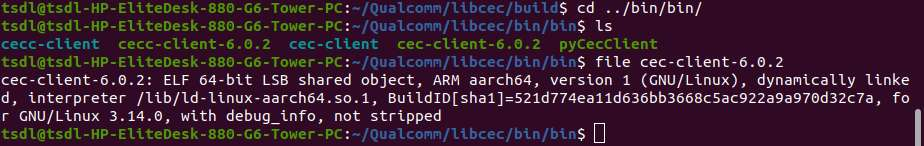

# 工具&库移植指南

RUBIK Pi 3 已经将集成常用的工具和库，若开发过程中使用的工具未集成，可参考 cec-client 移植方法进行移植：

## cec-client 移植

1. 首先设置交叉编译环境，具体步骤可参考 [安装交叉编译工具](./1.get-started.md#installcrosstool)小节：

   ```shell
   source <your toolchains directory>/environment-setup-armv8-2a-qcom-linux
   ```

2. 下载 libcec 源码：

   ```shell
   git clone https://github.com/Pulse-Eight/libcec
   ```

3. 进入 *cec-client&#x20;*&#x6E90;码目录执行：

   ```shell
   mkdir build
   cmake ..  -DCMAKE_INSTALL_PREFIX=../bin
   make
   ```

   `make`命令后会有如下报错，发现是没有 p8-platform 库：

   

为解决报错，交叉编译 p8-platform 库。

1. 下载 p8-platform 源码：

   ```shell
   git clone https://github.com/Pulse-Eight/platform
   ```

2. 进入 *platform* 文件夹执行：

   ```shell
   mkdir build
   cmake ..  -DCMAKE_INSTALL_PREFIX=../bin
   make
   ```

3. 到 *bin* 目录将编译生成物拷贝到交叉编译工具链的 *sysroot&#x20;*&#x76EE;录下，如下 */home/zhy/QCOM/sdk* 为交叉编译工具的安装路径，具体可参考 [代码编译](./1.get-started.md#codecompile)：

   ```shell
   cp libp8-platform.a /home/zhy/QCOM/sdk/sysroots/armv8-2a-qcom-linux/usr/lib/
   ```

4. 回到 *libcec&#x20;*&#x76EE;录，继续编译：

   ```shell
   cd libcec/build
   make 
   ```

5. 编译通过后执行下面命令，将生成物导出到 *bin&#x20;*&#x76EE;录：

   ```shell
   make install
   ```

6. 执行下面命令查看编译生成物，如下，cec-client 工具已经生成。因 RUBIK Pi 3 中已经集成了 libcec 的库，可以 将 cec-client 传输到 RUBIK Pi 3 中运行：

   :::note
   >
   > 传输文件可使用 ADB、SCP 等方式。
   :::

   ```shell
   cd ../bin/bin
   ls

   file cec-client-6.0.2

   ```

   