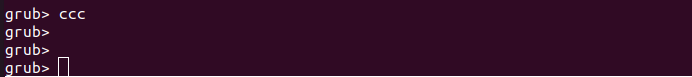

# Running Mainline Linux on RUBIK Pi 3

Created By: Hongyang Zhao

The following is my method for debugging the Linux mainline.

## 1. Flash the base version

Flash the Debian or Ubuntu system for RUBIK Pi (GRUB boot is supported. The general boot process is PBL → XBL → UEFI → GRUB → KERNEL → desktop system).

If you are using the QLI version, replace the kernel image within efi.bin and push the kernel ko files compiled from the mainline source to the */lib/firmware* directory.

I chose to flash the Debian 13 V1.1 image (available for download at rubikpi.ai) because the Debian system has ADB enabled by default, which makes debugging convenient.

The procedure for the Ubuntu system is the same as that of Debian, so you can choose either one.

For the flashing instructions, refer to the [relevant chapter](https://www.thundercomm.com/rubik-pi-3/en/docs/rubik-pi-3-user-manual/1.0.0-u/Update-Software/3.2.Flash-using-Qualcomm-Launcher/) in the user manual at rubikpi.ai.

## 2. Download the kernel

Use the following command to download the mainline kernel. Please note that this process may take several hours:

```
git clone git://git.kernel.org/pub/scm/linux/kernel/git/torvalds/linux.git
```

Alternatively, use the Google mirror, which will be significantly faster:

```
git clone https://kernel.googlesource.com/pub/scm/linux/kernel/git/torvalds/linux.git
```

Switch to the `master-next` branch for development.

```
git remote add linux-next https://git.kernel.org/pub/scm/linux/kernel/git/next/linux-next.git
git fetch linux-next
git fetch --tags linux-next
```

List `next-*` tags.

```
git tag -l "next-*" | tail
```

Create a development branch from the latest tag.

```
git checkout -b my_local_branch next-20251222
```

## 3. Compile the kernel

### 3.1 Install the cross-compilation toolchain

I am using `aarch64-linux-gnu-`. aarch64-linux-gnu-gcc is an ARM cross-compilation tool launched by Linaro based on GCC:

```
sudo apt install gcc-aarch64-linux-gnu
```

### 3.2 Modify defconfig

Change the configuration of CONFIG_SCSI_UFS_QCOM from `m` to `y`.

```
CONFIG_SCSI_UFS_QCOM=y
```

### 3.3 Compile all

```
export ARCH=arm64
export CROSS_COMPILE=aarch64-linux-gnu-

make defconfig

make -j`nproc`
```

### 3.4 Package the device tree and ko

The following `dtb.bin` is sourced from the flat package mentioned in Chapter 1. Flash the base version.

```
mkdir -p dtb_mnt
sudo mount dtb.bin dtb_mnt/
sudo cp arch/arm64/boot/dts/qcom/qcs6490-thundercomm-rubikpi3.dtb dtb_mnt/combined-dtb.dtb
sudo umount dtb_mnt
```

ko

```
mkdir modules
INSTALL_MOD_PATH=modules make modules_install
```

## 4. Prepare the operating conditions for the mainline kernel

### 4.1 Push ko to the board

```
adb push modules/lib/modules/6.17.0-rc6-g465ced7052f5/ /lib/modules
```

### 4.2 Push the kernel image to the board

```
adb push arch/arm64/boot/Image /boot/vmlinuz-mainline
```

### 4.3 Push the firmware to the board

* Push upstream firmware

```
git clone https://git.kernel.org/pub/scm/linux/kernel/git/firmware/linux-frimware

cd linux-firmware
mkdir tmp
sudo make install DESTDIR=tmp
adb push tmp/lib/firmware /root

adb shell

rm /lib/firmware -r
cp /root/firmware /lib/
```
* Push downstream firmware
  [Download downstream firmware](https://pan.thundersoft.com/web/share.html?hash=KchzIWzgSnU)

```
adb push renesas_usb_fw.mem /lib/firmware
adb push brcmfmac43456-sdio.* /lib/firmware/brcm/
adb push BCM4345C5.hcd /lib/firmware/brcm/
```

### 4.4 Create initramfs

1. Push the [*force-all-qcom-firmware file*](https://pan.thundersoft.com/web/share.html?hash=KchzIWzgSnU) to the */etc/initramfs-tools/ hooks* directory. This script is designed to forcibly package the firmware located in the *qcom* directory.

```
adb push force-all-qcom-firmware /etc/initramfs-tools/hooks
adb shell "chmod +x /etc/initramfs-tools/hooks/force-all-qcom-firmware"
```

2. Run the following commands. Modify `6.17.0-rc6-g465ced7052f5` as appropriate, or obtain the version from the ko path in Section 4.1 Push ko to the board.

```
adb push .config /boot/config-6.17.0-rc6-g465ced7052f5
adb shell "mkinitramfs -o /boot/initrd.img-mainline -k 6.17.0-rc6-g465ced7052f5"
```

### 4.5 Set the mainline kernel as the boot kernel

Use the following method to change the default loaded kernel and initrd.

```
adb shell
cd /boot
ln -sf vmlinuz-mainline vmlinuz
ln -sf initrd.img-mainline initrd.img​
update-grub
```

Alternatively, press **C** in the serial terminal during the GRUB boot stage to enter GRUB command-line mode (to change the kernel and initrd for the current boot only):

:::note
Note that you need to flash the device tree properly. If you want to switch back, you also need to flash the device tree back. root=UUID=..... is the cmd line, which can be modified as needed.

:::

```
linux /boot/vmlinuz-mainline root=UUID=131450ff-95bc-4791-b611-70855201b0cd rw  console=ttyMSM0,115200n8 pcie_pme=nomsi earlycon ignore_loglevel quiet  splash vt.handoff=7


initrd /boot/initrd.img-mainline

boot
```

### 4.6 Flash the device tree

The `dtb.bin` file is obtained from Section 3.3 Compile all.
Enter fastboot mode to flash:

```
reboot bootloader
fastboot flash dtb_a dtb.bin
fastboot reboot
```

Alternatively, use the `dd` command in the device terminal to flash:

```
sudo dd if=dtb.bin of=/dev/disk/by-partlabel/dtb_a bs=4M
```

## 5. Check the kernel

After booting, execute the following command to check the running kernel version.

```
uname -r
```