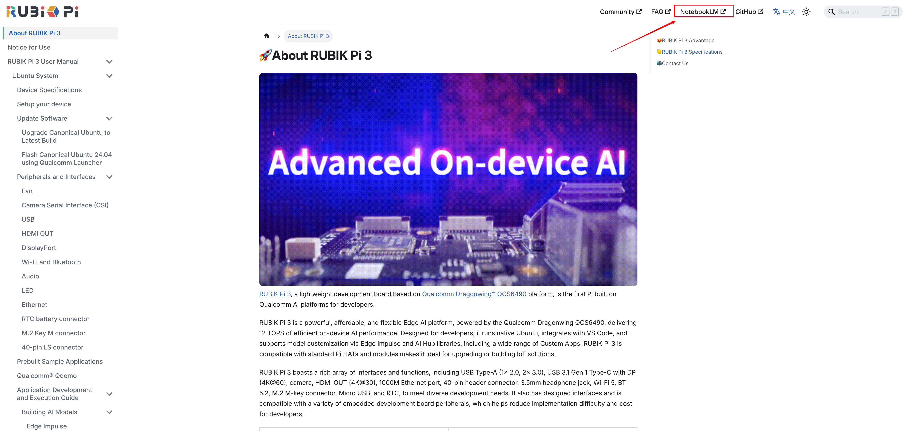
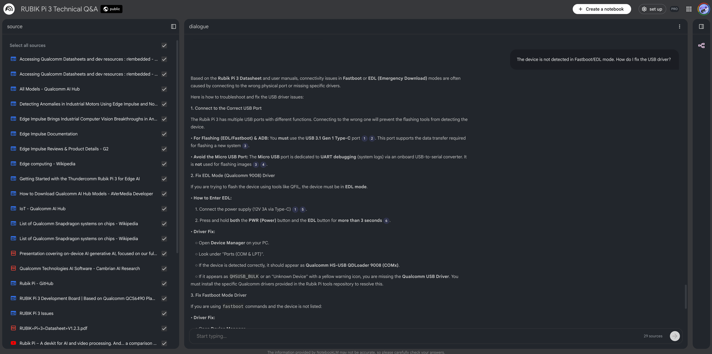

# Using the AI Assistant (NotebookLM)

## Overview

The RUBIK Pi documentation now integrates **Google NotebookLM** to enhance your development efficiency. This feature transforms our static technical library (datasheets, SDK guides, and FAQs) into an interactive knowledge base.
Instead of manually searching through multiple pages, you can query the documentation using natural language to obtain summaries, specific parameters, and code snippets.

## How to Use

Step 1: Access the Interface
Locate the Top Navigation Bar on the current page. Click the NotebookLM button to launch the AI assistant in a new window.

Step 2: Submit Your Query
In the NotebookLM interface, type your technical question into the chat box at the bottom. The system will analyze the full RUBIK Pi documentation set to generate an answer.

## Effective Prompting Guide

To get the most accurate results, we recommend using specific, context-rich prompts.

| Category | Suggested Query |
|----------|-----------------|
| Hardware | List the pin definitions for the 40-pin GPIO header on Rubik Pi 3. |
| Flashing | How do I flash the Linux image? Does it support booting from an SD card? |
| Debug | I get a 'command not found' error when using ADB. How do I fix this? |
| Drivers | The device is not detected in Fastboot/EDL mode. How do I fix the USB driver? |

## Key Features

- **Source Citations**: Every response includes numbered citations. Click a citation to view the source document and verify the information.
- **Context Awareness**: The AI is pre-trained on RUBIK Pi-specific hardware and software manuals.