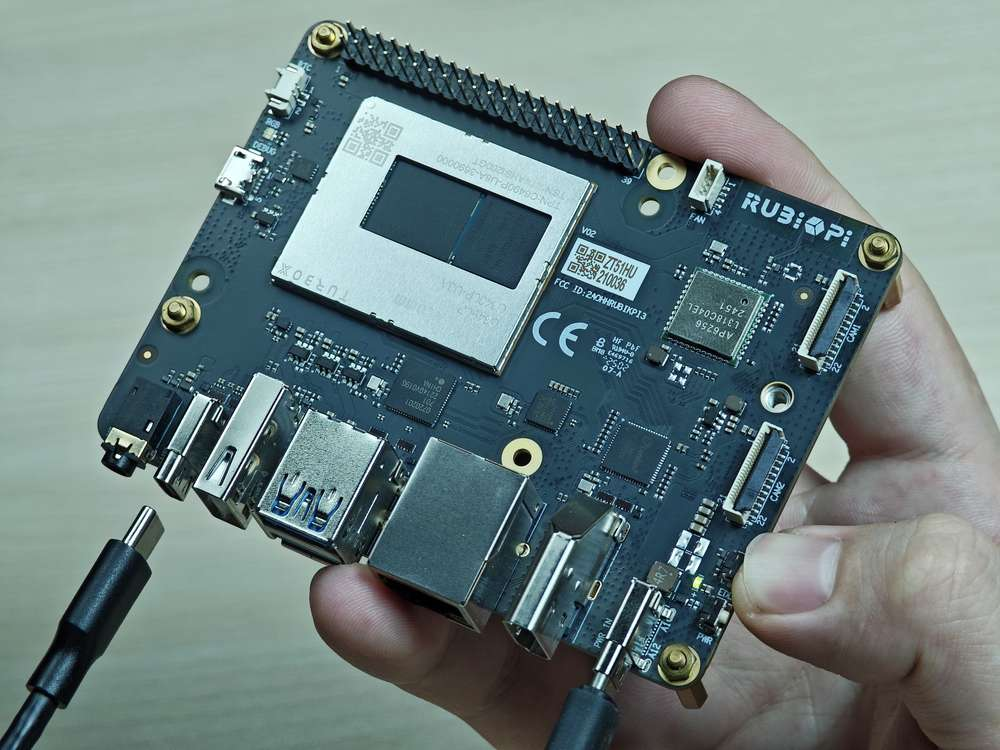
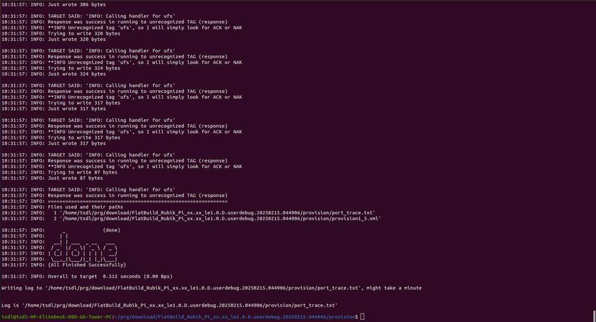
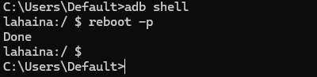
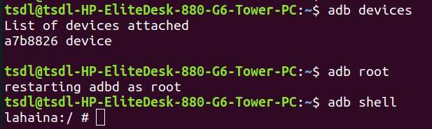

---
# Display h2 to h5 headings
toc_min_heading_level: 2
toc_max_heading_level: 4
---

# Get Started

## Introduction

RUBIK Pi 3 is developed based on the Qualcomm QCS6490 processor, which features the Qualcomm® Kryo™ 670 CPU and the Qualcomm® Hexagon™ Processor with fused AI-accelerator architecture. The processor provides exceptional AI performance of 12 TOPS and offers the capability for various machine learning and AI application scenarios.

RUBIK Pi 3 is designed with a wide range of interfaces and functions, such as USB, camera, DisplayPort, HDMI, Ethernet, 3.5mm headphone jack, Wi-Fi, Bluetooth, M.2 connector, fan, RTC, and 40-pin LS connector. These features cater to diverse development needs while facilitating rapid development and efficient debugging.&#x20;

RUBIK Pi 3 is compatible with various systems, such as Qualcomm Linux, Debian 13, Android 13, and Canonical Ubuntu for Qualcomm Platforms\*, providing developers with the flexibility to meet their specific application needs.

\*Canonical Ubuntu for Qualcomm Platforms is in the planning phase.


## Specifications

| **Category**      | **RUBIK Pi 3 Feature**                                                        |
| ----------------- | ----------------------------------------------------------------------------- |
| SoC               | QCS6490                                                                       |
| Processor         | <p>1 x Cortex-A78 2.7 GHz</p><p>3 x Cortex-A78 2.4 GHz</p><p>4 x Cortex-A55 1.9 GHz</p> |
| GPU               | Adreno 643 GPU @ up to 812 MHz                                                |
| VPU               | Adreno 633 VPU                                                                |
| NPU               | 12 TOPS                                                                       |
| ISP               | Spectra ISP capable of on-device machine learning and machine processing      |
| RAM               | 8 GB LPDDR4x                                                                  |
| ROM               | 128 GB UFS 2.2                                                                |
| Wi-Fi & Bluetooth | Wi-Fi 5 and Bluetooth 5.2                                                     |
| Camera            | 2 x 4-lane MIPI CSI D-PHY connector                                           |
| USB               | <p>1 x USB Type-C (USB 3.1 Gen1)</p><p>2 x USB Type-A (USB 3.0)</p><p>1 x USB Type-A (USB 2.0) </p>|
| GPIO              | 28 GPIO pins                                                                  |
| Ethernet          | 1000M                                                                         |
| M.2 connector     | M.2 Key M 2280 (2-lane PCIe 3.0)                                              |
| Audio             | 3.5mm headphone jack                                                          |

## Preparations

* Computer running Windows 10 and later, or Ubuntu 18 – Ubuntu 22

* RUBIK Pi 3

* USB Type-A to Type-C cable

* USB Type-A to Micro USB cable

* Power supply (12V 3A Type-C)

### Install drivers

#### Install drivers in a Windows environment

##### Install QUD

1. Click [here](https://thundercomm.s3-accelerate.amazonaws.com/uploads/web/rubik-pi-3/tools/qud/qud.win.1.1_installer_10061.1.zip) to download the Qualcomm USB driver (QUD).

2. Decompress *qud.win.1.1\_installer\_10061.1.zip*, run *setup.exe* as shown in the following figure, and click **Next**.

   

3. Click **Next**.

   

4. Select the **I accept the terms in the license agreement** option and click **Next**.

   

5. Click **Install**.

   

6. Click **Finish** to complete the driver installation.

   

##### Install Tflash

1. Click [here](https://thundercomm.s3-accelerate.amazonaws.com/uploads/web/rubik-pi-3/tools/tflash/windows/TflashSetup_v1.2.0.4.exe) to download the image flashing tool Tflash.

2. Run *TflashSetup\_v1.2.0.4.exe*. Select your desired language and click **OK**.

   

3. Select the location where you want to install Tflash and click **Next**.

   

4. Click **Next**.

   

5) Select the **Create a desktop shortcut** option and click **Next**.

   

6) Click **Install**.

   

7. Select the **Launch Tflash** option and click **Finish**.

   

8. If the following error message appears, click **Y**. Follow the instructions to download the required installation package.

   

9. Double-click the package you downloaded and click **Install**.

   

10. Click **Close** to complete the installation.

    

11) After the installation is completed, the following Tflash icon will appear on your desktop and in the Start menu.

   

#### Install drivers in an Ubuntu environment

##### Install Tflash

1. Click [here](https://thundercomm.s3-accelerate.amazonaws.com/uploads/web/rubik-pi-3/tools/tflash/ubuntu/Thundercomm-tflash-v1.0.0.deb) to download the image flashing tool Tflash.

2. Run the following command to install Tflash.

   ```shell
   sudo dpkg -i Thundercomm-tflash-v1.0.0.deb
   ```

3) After the installation is completed, run the `tflash` command in the terminal. If the following message appears, it indicates that Tflash has been successfully installed:

   

### Download images

RUBIK Pi 3 comes with a pre-installed Linux image (not the latest version) for a quick out-of-the-box experience. If you need the latest version of the Android image or other operating system images, visit the [RUBIK Pi 3 official website](https://www.thundercomm.com/rubik-pi-3/en/docs/image/).

* Qualcomm Linux is a simplified desktop system based on Weston. It is suitable for developers who have Linux development experience and seek an in-depth development experience.

  

* Debian 13: Based on GNOME 48, Debian 13 offers a complete set of system features, a rich software package library, more desktop applications, an enhanced user experience, and abundant development resources, making it ideal for developers who prioritize development convenience.

  

* Android 13 is an enhanced system based on Google AOSP, offering an improved experience for developers working on Android applications.

  RUBIK Pi 3 provides two Android image versions: user and userdebug. In the Android system, user and userdebug are different build types designed for distinct use cases.

  * The user version is a production build intended for end users, focusing on security and stability. It disables debugging features, restricts root access and advanced ADB commands, and minimizes log output to ensure smooth system performance and protect user privacy, delivering a reliable experience for daily use.

  * The userdebug version is a development build designed for developers and testers. It offers enhanced debugging support, including temporary root access, full ADB functionality, and detailed logging. This makes it ideal for tasks such as modifying system files, monitoring application behavior, or troubleshooting. However, due to its elevated permissions and additional resource usage, it is less secure and is recommended only for development and testing purposes.

  

### Flash images


Before flashing images, enter flash mode (9008 mode) using one of the following methods:

Method 1:

1. Press and hold the **\[EDL]** button (No. 12 in the figure above).

   

2. Connect the power supply into port 10, as shown in the figure below.&#x20;

   

3) Insert the Type-C cable into port 5 and wait three seconds to enter 9008 mode.

   

Method 2:

1. Connect the power supply into port 10.

   

2. Insert the Type-C cable into port 5.

   

3) After RUBIK Pi 3 boots up, run the following command to enter 9008 mode.

   ```shell
   adb shell reboot edl
   ```

#### Flash images on a Windows system

##### Operation procedure

1. Open the Tflash software. Make sure the device is in 9008 mode, as shown in the following figure:

   

2. Select the **Storage Type** of the device to be flashed. For RUBIK Pi 3, select **UFS** for **Storage Type**.

   

3) Select **Reset After Download** or **Erase All Before Download** as needed. Exercise caution when selecting **Erase All Before Download**.

   

   * Reset After Download: When this option is selected, the device will reboot automatically after image flashing is completed.

   * Erase All Before Download: When this option is selected, the data in each RUBIK Pi 3 UFS partition will be erased before flashing.

     :::note
     >
     > * The **Erase All Before Download** option takes effect only when the UFS partitions are the same before and after flashing.
     >
     > * Selecting **Reset After Download** or **Erase All Before Download** is not a mandatory action. You are not required to select one of them.
     :::

4) Flash the FlatBuild image.

   1. Click **Browse**.

      

   2. Go to the *FlatBuild* directory, select *Programmer File*, and select *prog\_firehose\_ddr.elf,* and click **Open**.

      

   3. Select all .xml files whose names start with "rawprogram", and click **Open**.

      

   4. Select all .xml files whose names start with "patch", and click **Open**.

      

      After the above settings, the related information will be displayed in the Tflash interface.

      

   5. Click **Download** to start flashing.

      

      :::note
      >
      > The flashing time varies from computer to computer. The green progress bar shows the flashing progress.
      :::

      After images are successfully flashed, the following logs will be displayed:

      

   * If you have selected **Reset After Download**, the board will reboot automatically after flashing.

   * If you have not selected **Reset After Download**, disconnect the power cable and USB cable to power off your RUBIK Pi 3, then reconnect the power cable and press the **\[PWR]** button to start your RUBIK Pi 3.

     

##### Fix boot failures after flashing

:::note
In the Android Alpha version, you need to [download this file](https://thundercomm.s3.dualstack.ap-northeast-1.amazonaws.com/uploads/web/rubik-pi-3/tools/RUBIKPI_LA_CDT.zip) and extract it to the *ufs* directory of the image package.

If you enter recovery mode as shown in the following figure after flashing, check **Erase All Before Download** before the flashing process.


:::

If you fail to flash images or your RUBIK Pi 3 fails to boot up after flashing (the heartbeat LED in the red box below does not blink), try provisioning UFS.


:::warning
>
> After provisioning, some information stored in the UFS, such as the SN and Ethernet MAC address, may be lost.
:::


The operations to provision UFS are as follows:

1. Enter 9008 mode.

   

2. Select **UFS** for **Storage Type** and select **Provision**.

   

3. Flash the provision file.

   1. Click **Browse**.

      

   2. Go to the *provision* directory in the image package, select *prog\_firehose\_ddr.elf*, and click **Open**.

      

   3. Select the *provision\_1\_3.xml* file and click **Open**.

      

   4. When "Load Image PATCH Successfully!" is displayed in the log, click **Download** to start provisioning.

      When the provisioning is completed, the following log is displayed.

      

      :::note
      >
      > After provisioning, remove and plug in the power supply and USB cable to restart your RUBIK Pi 3.
      :::

#### Flash images on an Ubuntu system

##### Operation procedure

1. Go to the FlatBuild package directory.

2. Run `tflash -r`.

   :::note
   >
   > Run the `tflash -h` command to view more parameters. `-r` in the above command indicates restarting your RUBIK Pi 3 after flashing is completed.
   :::

3. When "Stop the ModemManager on your host PC and press Enter on your keyboard to continue..." appears on the screen, press **Enter** to flash images.

   

   If the following information is displayed after the tflash operation, it indicates that flashing was successful.

   

:::note
>
> When running `tflash` on your PC, enter your PC login password.
:::

4. After successful image flashing by using the `-r` parameter, RUBIK Pi 3 automatically reboots.

##### Fix boot failures after flashing

:::note
In the Android Alpha version, you need to [download this file](https://thundercomm.s3.dualstack.ap-northeast-1.amazonaws.com/uploads/web/rubik-pi-3/tools/RUBIKPI_LA_CDT.zip) and extract it to the *ufs* directory of the image package.

If you enter recovery mode as shown in the following figure after flashing, add the `-e` parameter during the flashing process, such as `tflash -r -e`.


:::

If you fail to flash images or your RUBIK Pi 3 fails to boot up after flashing (the heartbeat LED in the red box below does not blink), try provisioning UFS.


:::warning
>
> After provisioning, some information stored in the UFS, such as the SN and Ethernet MAC address, may be lost.
:::

The operations to provision UFS are as follows:

1. Enter 9008 mode.

   

2. Go to the *provision* directory in the image package, run `tflash -E`, type "y" and press **Enter**.

   

3. When "Stop the ModemManager on your host PC and press Enter on your keyboard to continue..." appears on the screen, press **Enter** to flash images.

   

  If the following information is displayed after the tflash operation, it indicates that flashing was successful.

   

:::note
>
> After provisioning, remove and plug in the power supply and USB cable to restart your RUBIK Pi 3.
:::

## Power-on

For older board versions, connect the power supply and press the **\[PWR]** button to power on your RUBIK Pi 3. Board versions v02 and later support automatic power-on.


## Power-off

Run the `reboot -p` command to power off your RUBIK Pi 3.



## Reboot

Run the `reboot` command to reboot your RUBIK Pi 3.


Press and hold the **\[PWR]** button for 12 seconds to reboot your RUBIK Pi 3.

  

## UART login

### Windows

1. Connect port 2 in the following figure to a computer.

   

2. Open the computer settings page, check the corresponding COM port in Device Manager, and record the port.

   

3) Download MobaXterm at https://mobaxterm.mobatek.net/ and decompress it.

   

4) Open MobaXterm, select **Session** > **Serial**, and set the baud rate of the serial port to 115200.

   

   

5) Click **OK&#x20;**&#x74;o enter the terminal. Press **Enter** to log in to the device.

6) &#x20;Run the `su` command to switch to the root user.

   

### Ubuntu

1. Connect port 2 in the following figure to a computer.

   

2. Run the following commands to install minicom:

   ```shell
   sudo apt update  
   sudo apt install minicom
   ```

3) Run the following command to check the USB port:

   ```shell
   ls /dev/ttyACM*
   ```

   

4. Run the following command to open minicom. Press **Enter** and type the default login name and login password to log in:

   ```shell
   sudo minicom -D /dev/ttyACM0 -b 115200
   ```

   After a successful login, you will be directly connected to the serial console.

   

## ADB login

### Windows

#### Preparations

1. Download the ADB and Fastboot installation package at https://developer.android.google.cn/tools/releases/platform-tools and decompress the package.


2. Right-click **This PC** and choose **Properties**. Click **Advanced** and click **Environment Variables**. Alternatively, right-click **This PC** and choose **Properties**. In the search bar, type **Advanced system settings** and click **Environment Variables**.


3. Under **System variables**, select **Path** and click **Edit**.

  

4. Click **New** and type the path of decompressed platform-tools in Step 1. Click **OK** to save the environment variable.


#### ADB login

Press **Win**+**R** and type "cmd" to open the Windows terminal. Run the following commands to log in to your RUBIK Pi 3:

```shell
adb devices # Check if devices are connected  
adb root    # Log in as root user  
adb shell   # Open the adb terminal
```


### Ubuntu

#### Preparations

1. Run the following command to install the ADB and Fastboot tools:

   ```shell
   sudo apt install git android-tools-adb android-tools-fastboot wget
   ```

2. Update the udev rules file.

   1. Run the following command to open and modify the *51-qcom-usb.rules* file.

      ```shell
      sudo vi /etc/udev/rules.d/51-qcom-usb.rules
      ```

   2. Add the following content to the file. If the following content already exists, skip this step.

      ```shell
      SUBSYSTEMS=="usb", ATTRS{idVendor}=="05c6", ATTRS{idProduct}=="9008", MODE="0666", GROUP="plugdev"
      ```

   3. Run the following command to restart `udev`.

      ```shell
      sudo systemctl restart udev
      ```

   :::note
   >
   > If your RUBIK Pi 3 is already connected to the PC via USB, unplug and replug the USB cable so that the updated rules can take effect.
   :::

#### ADB login

Run the following commands in the terminal to log in to your RUBIK Pi 3:

```shell
adb devices # Check if devices are connected  
adb root    # Log in as root user  
adb shell   # Open the adb terminal
```



## File transfer

### ADB

* In the PC terminal, run the following command to upload the *test.txt* file to the */opt* directory:

  ```shell
  adb push test.txt /opt
  ```

* In the PC terminal, run the following command to download the *test.txt* file to your current directory:

  ```shell
  adb pull /opt/test.txt ./
  ```