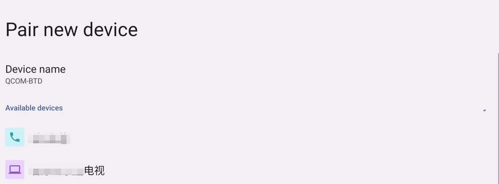
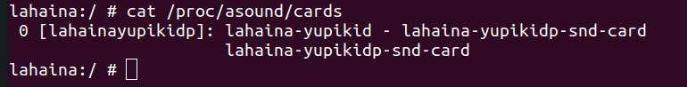
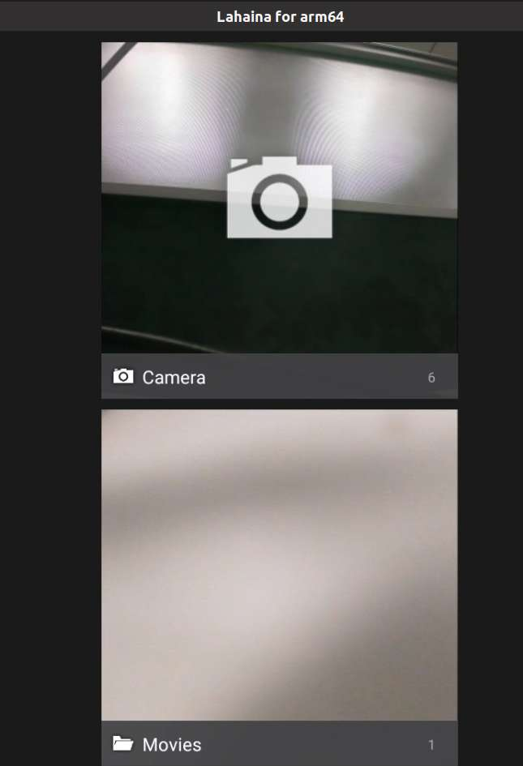
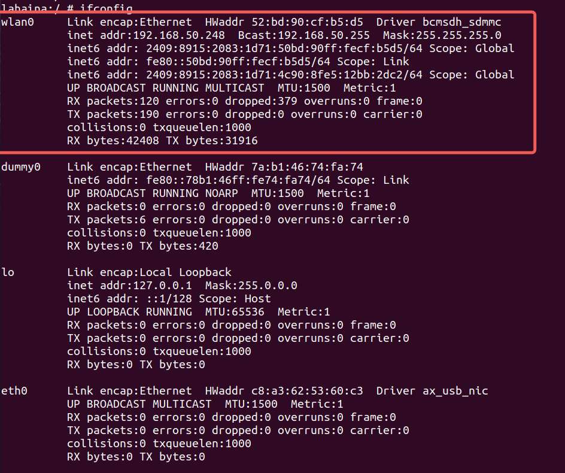

---
# Display h2 to h5 headings
toc_min_heading_level: 2
toc_max_heading_level: 4
---

# Peripherals and Interfaces

## Hardware resource diagram


| **No.** | **Interface**                | **No.** | **Interface**              |
| ------- | ---------------------------- | ------- | -------------------------- |
| **1**   | RTC battery connector        | **10**  | Power Delivery over Type-C |
| **2**   | Micro USB (UART debug)       | **11**  | PWR button                 |
| **3**   | TurboX C6490P SOM            | **12**  | EDL button                 |
| **4**   | 3.5mm headphone jack         | **13**  | Camera connector 2         |
| **5**   | USB Type-C with DP (USB 3.1) | **14**  | Camera connector 1         |
| **6**   | USB Type-A (USB 2.0)         | **15**  | Wi-Fi/BT module            |
| **7**   | 2 x USB Type-A (USB 3.0)     | **16**  | Fan connector              |
| **8**   | 1000M Ethernet               | **17**  | 40-pin LS connector        |
| **9**   | HDMI OUT                     | **18**  | M.2 Key M connector        |

## 40-pin LS connector

### GPIO

#### Pinout

The figure below shows the default functions of the RUBIK Pi 3 40-pin LS connector, most of which are compatible with the default functions of the Raspberry Pi 40-pin connector.


The following table lists all functions of the 40-pin LS connector. Blue bold functions are default functions.


#### Control GPIOs using shell commands

GPIO pins are managed through the */sys/class/gpio* directory. You can run the `ls -alt` command to view the current pin information in this directory.


GPIO pins are not randomly assigned but are organized into multiple GPIO chips (groups of pins). Each chip manages a set of consecutive pins and has a unique base number. For example, as shown above, `gpiochip336` has a base address of 336 and manages pins starting from 336.

`gpiochip336` is managed by the main controller (pinctrl controller), which is responsible for configuring pin functions (such as GPIO and SPI) and is typically used for general-purpose pins. Other GPIO chips are managed by dedicated controllers and are used for specific functions.

To reference a particular GPIO pin within a chip, use the base address plus the offset (i.e., the Pin No. in the table below).


To control pin No.12 (GPIO\_101), perform the following steps:

  - Go to the /sys/class/gpio directory:
   ```
   cd /sys/class/gpio
   ```

  - Export the GPIO you want to operate. 336 (the base address of gpio336) + offset 12 (the pin No.) = 348. Run the following command.
  ```
  echo 348 > export
  ```

  - Go to the gpio348 directory to set GPIO attributes:
  ```
  cd gpio348  
  ls -alt
  ```

  

The attributes are described as follows:

  - direction:
    - Input: in
    - Output: out
  - value:
    - Low level: 0
    - High level: 1
  - edge (interrupt edge):
    - Rising edge trigger: rising
    - Falling edge trigger: falling
    - Both-edge trigger: both
    - Disabling interrupts: none

For example, set pin 12 to output a high level:

```shell
echo out > direction  
echo 1 > value
```

Cancel the export of pin 12 to user space:

```shell
echo 348 > unexport
```

### I2C

Inter-Integrated circuit (I2C) is a bidirectional 2-wire bus for an efficient inter‑IC control bus developed by Philips in the 1980s. Every device on the bus has its own unique address (registered with the I2C general body headed by Philips). The I2C core supports a multicontroller mode and 10‑bit target address and 10‑bit extendable address. For more information on I2C, see https://www.i2c-bus.org/fileadmin/ftp/i2c_bus_specification_1995.pdf.

#### Pinout

The figure below shows the default functions of the RUBIK Pi 3 40-pin LS connector, most of which are compatible with the default functions of the Raspberry Pi 40-pin connector.


:::note
>
> Pin 3 and pin 5 are set to I2C1 by default.
:::

The following table lists all functions of the 40-pin LS connector. Blue bold functions are default functions.


#### I2C communication using shell commands

Run the following commands on RUBIK Pi 3 to control the I2C bus.

* Locate the I2C device you want to test.

  ```shell
  cd /sys/class/i2c-dev/
  ls -alt
  ```

  

* Use the i2cdetect tool. For example, i2c-8.

  * View devices connected to the I2C8 interface:

    ```shell
    i2cdetect -a -y -r 8
    ```

    Parameter description:

    * `a`: Scan all possible I2C addresses.

    * `y`: Skip interactive confirmation prompts.

    * `r`: Use the SMBus `receive byte` command for detection.

    * `8`: Specify the I2C bus number to scan.

    The output is as follows:

    

    "UU" in the output indicates that the driver I2C8 is already bound to the device in the kernel for communication, and the device is enabled.

### SPI

Serial Peripheral Interface (SPI) is a synchronous serial data link that operates in full-duplex mode. SPI is also known as a 4-wire serial bus.

#### Pinout

The figure below shows the default functions of the RUBIK Pi 3 40-pin LS connector, most of which are compatible with the default functions of the Raspberry Pi 40-pin connector.


:::note
>
> Pins 19, 21, 23, and 24 are set to SPI by default.
:::

The following table lists all functions of the 40-pin LS connector. Blue bold functions are default functions.


#### SPI communication using C programs

* The following code snippet uses the SPI bus to send and receive data.

  ```c
  #include <stdint.h>
  #include <unistd.h>
  #include <stdio.h>
  #include <stdlib.h>
  #include <getopt.h>
  #include <fcntl.h>
  #include <sys/ioctl.h>
  #include <linux/types.h>
  #include <linux/spi/spidev.h>
  #include <sys/time.h>
  #include <signal.h>
  #include <string.h>

  #define ARRAY_SIZE(a) (sizeof(a) / sizeof((a)[0]))

  static void pabort(const char *s)
  {
      perror(s);
      abort();
  }

  static const char *device = "/dev/spidev0.0"; /*spi controller device file*/
  static uint8_t mode;
  static uint8_t bits = 8;
  static uint32_t speed = 10000000; //5242880hz-->655360B/s-->5mbps
  static uint16_t delay;

  int flag = 1;

  void prompt_info(int signo)
  {
          flag = 0;
  }

  void init_sigaction(void)
  {
          struct sigaction tact;

          tact.sa_handler = prompt_info;
          tact.sa_flags = 0;

          sigemptyset(&tact.sa_mask);

          sigaction(SIGALRM, &tact, NULL);
  }

  void init_time()
  {
          struct itimerval value;

          value.it_value.tv_sec = 5; // Transmission time
          value.it_value.tv_usec = 0;

          value.it_interval = value.it_value;

          setitimer(ITIMER_REAL, &value, NULL);
  }

  static void transfer(int fd)
  {
      int ret;
      uint8_t temp[] = {
          'a', 'a', 'a', 'a', 'a', 'a',
          'n', 'o', 'p', 'q', 'r', 's',
          'a', 'a', 'a', 'a', 'a', 'a',
          'a', 'a', 'a', 'a', 'a', 'a',
          'a', 'a', 'a', 'a', 'a', 'a',
          'b', 'c', 'd', 'e', 'f', 'g',
          'b', 'c', 'd', 'e', 'f', 'g',
          'b', 'c', 'd', 'e', 'f', 'g',
          't', 'u',
          'a', 'a', 'a', 'a', 'a', 'a',
          'h', 'i', 'j', 'k', 'l', 'm',
          'a', 'a', 'a', 'a', 'a', 'a',
          'a', 'a', 'a', 'a', 'a', 'a',
          'a', 'a', 'a', 'a', 'a', 'a',
          'b', 'c', 'd', 'e', 'f', 'g',
          'b', 'c', 'd', 'e', 'f', 'g',
          'b', 'c', 'd', 'e', 'f', 'g',
          'v', 'w',
      };
      uint8_t tx[ARRAY_SIZE(temp)] = {0, }; //Array of data to be sent
      memcpy(tx, temp, ARRAY_SIZE(tx));
      uint8_t rx[ARRAY_SIZE(tx)] = {0, }; //Received data array
      struct spi_ioc_transfer tr = {
          .tx_buf = (unsigned long)tx,
          .rx_buf = (unsigned long)rx,
          .len = ARRAY_SIZE(tx),
          .delay_usecs = delay,
          .speed_hz = speed,
          .bits_per_word = bits,
      };

      unsigned long size = 0;
          init_sigaction();
          init_time();
      FILE *file_write = NULL, *file_read = NULL;
      file_write = fopen("writebuf","w+");
      file_read = fopen("readbuf","w+");
          while (flag)
          {
          ret = ioctl(fd, SPI_IOC_MESSAGE(1), tr);   //ioctl default operation, transfer data
          if (ret < 1)
              pabort("can't send spi message");
                  size++;
          fwrite(tx, 1, 100, file_write);
          fwrite(rx, 1, 100, file_read);
          memcpy(tx, temp, ARRAY_SIZE(tx));
          memset(rx, 0x00, ARRAY_SIZE(tx));
          }
      fclose(file_write);
      fclose(file_read);
  }

  static void print_usage(const char *prog)   //If the parameter is wrong, print the help information
  {
      printf("Usage: %s [-DsbdlHOLC3]\n", prog);
      puts("  -D --device   device to use (default /dev/spidev3.0)\n"
           "  -s --speed    max speed (Hz)\n"
           "  -d --delay    delay (usec)\n"
           "  -b --bpw      bits per word \n"
           "  -l --loop     loopback\n"
           "  -H --cpha     clock phase\n"
           "  -O --cpol     clock polarity\n"
           "  -L --lsb      least significant bit first\n"
           "  -C --cs-high  chip select active high\n"
           "  -3 --3wire    SI/SO signals shared\n");
      exit(1);
  }

  static void parse_opts(int argc, char *argv[])
  {
      while (1) {
          static const struct option lopts[] = {  //Parameter command table
              { "device",  1, 0, 'D' },
              { "speed",   1, 0, 's' },
              { "delay",   1, 0, 'd' },
              { "bpw",     1, 0, 'b' },
              { "loop",    0, 0, 'l' },
              { "cpha",    0, 0, 'H' },
              { "cpol",    0, 0, 'O' },
              { "lsb",     0, 0, 'L' },
              { "cs-high", 0, 0, 'C' },
              { "3wire",   0, 0, '3' },
              { "no-cs",   0, 0, 'N' },
              { "ready",   0, 0, 'R' },
              { NULL, 0, 0, 0 },
          };
          int c;
          c = getopt_long(argc, argv, "D:s:d:b:lHOLC3NR", lopts, NULL);

          if (c == -1)
              break;

          switch (c) {
          case 'D':
              device = optarg;
              break;
          case 's':
              speed = atoi(optarg);
              break;
          case 'd':
              delay = atoi(optarg);
              break;
          case 'b':
              bits = atoi(optarg);
              break;
          case 'l':
              mode |= SPI_LOOP;
              break;
          case 'H':
              mode |= SPI_CPHA;
              break;
          case 'O':
              mode |= SPI_CPOL;
              break;
          case 'L':
              mode |= SPI_LSB_FIRST;
              break;
          case 'C':
              mode |= SPI_CS_HIGH;
              break;
          case '3':
              mode |= SPI_3WIRE;
              break;
          case 'N':
              mode |= SPI_NO_CS;
              break;
          case 'R':
              mode |= SPI_READY;
              break;
          default:
              print_usage(argv[0]);
              break;
          }
      }
  }

  int main(int argc, char *argv[])
  {
      int ret = 0;
      int fd;

      parse_opts(argc, argv);
      fd = open(device, O_RDWR);
      puts(device);
      if (fd < 0)
          pabort("can't open device");

      /*
       * spi mode 
       */
      ret = ioctl(fd, SPI_IOC_WR_MODE, &mode);
      if (ret == -1)
          pabort("can't set spi mode");

      ret = ioctl(fd, SPI_IOC_RD_MODE, &mode);
      if (ret == -1)
          pabort("can't get spi mode");

      /*
       * bits per word 
       */
      ret = ioctl(fd, SPI_IOC_WR_BITS_PER_WORD, &bits);
      if (ret == -1)
          pabort("can't set bits per word");

      ret = ioctl(fd, SPI_IOC_RD_BITS_PER_WORD, &bits);
      if (ret == -1)
          pabort("can't get bits per word");

      /*
       * max speed hz
       */
      ret = ioctl(fd, SPI_IOC_WR_MAX_SPEED_HZ, &speed);
      if (ret == -1)
          pabort("can't set max speed hz");
         
      ret = ioctl(fd, SPI_IOC_RD_MAX_SPEED_HZ, &speed);
      if (ret == -1)
          pabort("can't get max speed hz");

      printf("spi mode: %d\n", mode);
      printf("bits per word: %d\n", bits);
      printf("max speed: %d Hz (%d KHz)\n", speed, speed/1000);
      transfer(fd);
      close(fd);
      return ret;
  }
  ```

* Compile programs:

  1. Cross-compile the program.

     ```shell
     aarch64-linux-gnu-gcc {filename} -o {output filename} -static
     ```

  2. Transfer *spi* to RUBIK Pi 3. For example, use the ADB method:

     ```shell
     adb push spi /dev
     ```

* Short pin 19 and pin 21 with a Dupont wire to test the SPI bus communication, as shown in the following figure.

  

  1. Check that the SPI device is properly connected.

     1. Enter the device terminal.

        ```shell
        adb shell
        ```

     2. Switch to root privileges:

        ```shell
        su
        ```

     3. Go to the `/dev` directory and check the SPI device file:

        ```bash
          cd /dev
          ls | grep spidev
        ```

     Expected result:

     A device node named in the format of `spidev0.0` is present.

  2. Test file push and execution.

     1. Open another terminal and push the test program:

        ```bash
        adb push spi_test /dev
        ```

     2. Return to the device terminal and confirm successful file transfer:

        ```bash
        ls
        ```

        The new file `spi_test`, whose name is different from `spidev0.0`, exists.

     3. Grant execution permission and run the test.

        ```bash
          chmod 777 spi_test
          ./spi_test
        ```

     Expected result:

     *writebuf* (for sending data) and *readbuf* (for receiving data) files are generated.

  3. Verify data transfer.

     Compare the content of the *writebuf&#x20;*&#x61;nd *readbuf&#x20;*&#x66;iles.

     ```bash
     diff writebuf readbuf
     ```

  Expected result:

  No output, which means that the two files are identical. This indicates that the transfer is successful and no data is lost.

  

### UART

#### Pinout

The figure below shows the default functions of the RUBIK Pi 3 40-pin LS connector, most of which are compatible with the default functions of the Raspberry Pi 40-pin connector.


:::note
>
> Pins 8 and 10 have been set to UART by default. The device node is */dev/ttyHS3*.
:::

The following table lists all functions of the 40-pin LS connector. Blue bold functions are default functions.


#### UART communication using C programs

* The following code snippet uses UART to send and receive data.

  ```c
  #include <stdio.h>
  #include <stdlib.h>
  #include <unistd.h>
  #include <sys/types.h>
  #include <sys/stat.h>
  #include <fcntl.h>
  #include <termios.h>
  #include <errno.h>
  #include <pthread.h>
  #include <signal.h>
  #include <sys/ioctl.h>
  #include <getopt.h>
  #include <string.h>

  #define ARRAY_SIZE(a) (sizeof(a) / sizeof((a)[0]))
  #define MAX_SIZE 1024

  static int bps_speed = 115200;
  static const char *device = "/dev/ttyHS1";
  static int data_bits = 8;
  static int stop_bits = 1;
  static int g_parity = 'N';
  static char *type = "read";

  static void pabort(const char *s)
  {
      perror(s);
      abort();
  }

  int speed_arr[] = {B1152000, B1000000, B921600, B576000, B500000, B460800, B230400, B115200, B57600, B38400, B19200, B9600, B4800, B2400, B1200, B300};
  int name_arr[] = {  1152000,  1000000,  921600,  576000,  500000,  460800,  230400,  115200,  57600,  38400,  19200,  9600,  4800,  2400,  1200,  300};

  // Set the baud rate
  void set_speed(int fd, int speed)
  {
      int i;
      int status;
      struct termios Opt;
      tcgetattr(fd, &Opt);

      for (i = 0; i < ARRAY_SIZE(speed_arr); i++)
      {
          if (speed == name_arr[i])
          {
              // Data in the buffer is cleared.
              tcflush(fd, TCIOFLUSH);

              /* Set the baud rate for the serial port */
              cfsetispeed(&Opt, speed_arr[i]);
              cfsetospeed(&Opt, speed_arr[i]);
              status = tcsetattr(fd, TCSANOW, &Opt);
              if (status != 0)
                  pabort("tcsetattr fd");
              return;
          }

          tcflush(fd, TCIOFLUSH);
      }
      pabort("error speed!");
  }

  int set_Parity(int fd, int databits, int stopbits, int parity)
  {
      char cmd_fileclear[40] = {0};
      // sprintf(cmd_fileclear, ": > %s", device);
      // system(cmd_fileclear);
      // memset(cmd_fileclear, 0, ARRAY_SIZE(cmd_fileclear));
      sprintf(cmd_fileclear, "stty -F %s -echo", device);
      system(cmd_fileclear);
      memset(cmd_fileclear, 0, ARRAY_SIZE(cmd_fileclear));
      // printf("%s\n", cmd_fileclear);

      struct termios options;

      if (tcgetattr(fd, &options) != 0)
      {
          pabort("SetupSerial 1");
      }

      options.c_cflag &= ~CSIZE;

      switch (databits) /*Set the number of data bits*/
      {
      case 7:
          options.c_cflag |= CS7;
          break;
      case 8:
          options.c_cflag |= CS8;
          break;
      default:
          pabort("Unsupported data sizen");
      }

      switch (parity)
      {
      case 'n':
      case 'N':
          options.c_cflag &= ~PARENB; /* Clear parity enable */
          options.c_iflag &= ~INPCK;  /* Enable parity checking */
          break;
      case 'o':
      case 'O':
          options.c_cflag |= (PARODD | PARENB); /* Set to odd parity check*/
          options.c_iflag |= INPCK;             /* Disnable parity checking */
          break;
      case 'e':
      case 'E':
          options.c_cflag |= PARENB;  /* Enable parity */
          options.c_cflag &= ~PARODD; /* Convert to even parity check*/
          options.c_iflag |= INPCK;   /* Disnable parity checking */
          break;
      case 'S':
      case 's': /*as no parity*/
          options.c_cflag &= ~PARENB;
          options.c_cflag &= ~CSTOPB;
          break;
      default:
          pabort("Unsupported parityn");
      }

      switch (stopbits)
      {
      case 1:
          options.c_cflag &= ~CSTOPB;
          break;
      case 2:
          options.c_cflag |= CSTOPB;
          break;
      default:
          pabort("Unsupported stop bits");
      }

      /* Set input parity option */
      if (parity != 'n' && parity != 'N')
          options.c_iflag |= INPCK;

      options.c_cc[VTIME] = 150; // 15 seconds
      options.c_cc[VMIN] = 0;

      tcflush(fd, TCIFLUSH); /* Update the options and do it NOW */
      if (tcsetattr(fd, TCSANOW, &options) != 0)
      {
          pabort("SetupSerial 3");
      }
      return 0;
  }

  static void print_usage(const char *prog) //If the parameter is wrong, print the help information
  {
      printf("Usage: %s [-DsbdlHOLC3t]\n", prog);
      puts("  -D --device     device to use (default /dev/ttyHS3)\n"
           "  -S --speed      bps\n"
           "  -d --databits   \n"
           "  -s --stopbits   \n"
           "  -p --parity     \n"
           "  -T --type       read or write\n");
      exit(1);
  }

  static void parse_opts(int argc, char *argv[])
  {
      while (1)
      {
          static const struct option lopts[] = {
              //Parameter command table
              {"device",   1, 0, 'D'},
              {"speed",    1, 0, 'S'},
              {"databits", 1, 0, 'd'},
              {"stopbits", 1, 0, 's'},
              {"parity",   1, 0, 'p'},
              {"type",     1, 0, 'T'},
              {NULL, 0, 0, 0},
          };
          int c;
          c = getopt_long(argc, argv, "D:S:d:s:p:T:", lopts, NULL);

          if (c == -1)
              break;

          switch (c)
          {
          case 'D':
              device = optarg;
              break;
          case 'S':
              bps_speed = atoi(optarg);
              break;
          case 'd':
              data_bits = atoi(optarg);
              break;
          case 's':
              stop_bits = atoi(optarg);
              break;
          case 'p':
              g_parity = atoi(optarg);
              break;
          case 'T':
              type = optarg;
              break;
          default:
              print_usage(argv[0]);
              break;
          }
      }
  }

  int main(int argc, char *argv[])
  {
      int ret = 0;
      int fd;
      char string1[] = "hello_world\n";
      char string2[] = "hello_world_abcdefghijklmnopqrstuvwxyz_abcdefghijklmnopqrstuvwxyz_abcdefghijklmnopqrstuvwxyz_abcdefghijklmnopqrstuvwxyz_abcdefghijklmnopqrstuvwxyz_abcdefghijklmnopqrstuvwxyz\n";
      char *string = string2;

      parse_opts(argc, argv);

      puts(device);
      fd = open(device, O_RDWR);
      if (fd < 0)
          pabort("can't open device");

      // Set the baud rate.
      set_speed(fd, bps_speed);
      set_Parity(fd, data_bits, stop_bits, g_parity);
      close(fd);
      fd = open(device, O_RDWR);

      int nread = 0,nwrite = 0;
      char buff[MAX_SIZE] = {0};
      int num = 0;
      char send_msg[200] = {0};

      printf("%d %d-%d-%c\n", bps_speed, data_bits, stop_bits, g_parity);
      printf("type:%s\n", strcmp(type, "read") == 0 ? "read" : "write");

      
      memset(send_msg, 0, ARRAY_SIZE(send_msg));
      
      FILE *read_file;

      while (1)
      {
          if (strcmp(type, "read") == 0)
          {

              // tcflush(fd, TCIOFLUSH);
              nread = read(fd, buff, MAX_SIZE - 2);
              if (nread > 1)
              {
                  printf("(Len %d):", nread);
                  buff[nread] = '\n';
                  buff[nread + 1] = '\0';
                  printf("read %s", buff);
                  if (nread < strlen(string))
                  {
                      read_file = fopen("read_file","aw+");
                      fwrite(buff, strlen(buff), 1, read_file);
                      fclose(read_file);
                  }
                  memset(buff, 0, ARRAY_SIZE(buff));
                  num++;
              }
              nread = 0;

          }
          else
          {
              
              sprintf(send_msg, "%d%s", num, string);
              nwrite = write(fd, send_msg, strlen(send_msg));
              printf("Send test data---%d---%s\n", nwrite, send_msg);
              num++;
              sleep(1);
          }

      }

      close(fd);

      return ret;
  }
  ```

* Compile the program:

  * Cross-compile the program.

    ```shell
    aarch64-linux-gnu-gcc {filename} -o {output filename} -static
    ```

  * Transfer the compiled product *uart* to RUBIK Pi 3. For example, use the ADB method. The command is as follows:

    ```shell
    adb push uart /opt
    ```

* Short pin 8 and pin 10 with a Dupont wire and test the UART communication, as shown in the following figure.

  

  1. Test the read functionality (receiving data)

     1. Grant permissions and start the listening terminal.

     ```bash
       chmod 777 uart_test
       ./uart -D /dev/ttyHS1
     ```

     2. Open another terminal and send data.

     ```bash
     ./uart -D /dev/ttyHS1 -T write
     ```

     3. Open another terminal B to listen to data.

     ```bash
     ./uart -D /dev/ttyHS1
     ```

     4. Verify the result.

       The sent data is displayed in the first terminal, which means that the data is received successfully.

  2. Test the write functionality (sending data)

     1. Send data in terminal A.

     ```bash
       ./uart -D /dev/ttyHS1 -T write
      
     ```

     2. Open terminal B to listen for data.&#x20;

     ```bash
       ./uart -D /dev/ttyHS1
     ```

     3. Verify the result.

       The data sent from terminal A is displayed in terminal B, which means that the data is sent successfully.

## USB

RUBIK Pi 3 provides four USB ports:

* 2 x USB 3.0, host mode only (No.7 in the following figure)

* 1 x USB 2.0, host or device mode (No. 6 in the following figure)

* 1 x USB 3.1 Gen 1, host or device mode, Type-C with DisplayPort v1.4 (No. 5 in the following figure)


### USB 2.0 Type-A

This section describes how to configure the RUBIK Pi 3 as a USB mass storage device (i.e., simulate a USB flash drive) via the USB 2.0 Type-A port to verify the USB Gadget functionality on an Android 13 device.

:::note
>
> **Permission limitation**: ADB shell does not provide sufficient privileges to configure the USB Gadget. All operations must be performed via the serial console.
:::

Use a USB data cable to connect the device to the host PC, then proceed with the following steps:

#### Verify the device mode

Perform the following steps to configure RUBIK Pi 3 as a USB mass storage device:

1. Enter the serial console.

2. Configure USB Gadget.

   * Go to the USB Gadget configuration directory:

   ```bash
   cd /config/usb_gadget/g2
   ```

   * Configure the mass storage function:

   ```bash
   mkdir functions/mass_storage.0
   ```

   * Create a 2 GB ISO file in `/sdcard`:&#x20;

   ```bash
   dd if=/dev/zero of=/sdcard/test.iso bs=1M count=2048
   mkfs.ext4 /sdcard/test.iso
   ```

   :::note
   **ISO file location:**

   The ISO file must be created in the */sdcard* directory. Creating it in other directories may result in file access errors.
   If you create the ISO outside of */sdcard*, Ubuntu dmesg logs show repeated read errors:

   ```
   [881331.266781] sd 5:0:0:0: [sdd] tag#0 FAILED Result: hostbyte=DID_OK driverbyte=DRIVER_SENSE
   [881331.266782] sd 5:0:0:0: [sdd] tag#0 Sense Key : Medium Error [current]
   [881331.266783] sd 5:0:0:0: [sdd] tag#0 Add. Sense: Unrecovered read error
   [881331.287885] sdd: unable to read partition table
   ```

    - **Cause**: The USB Gadget framework cannot read the ISO file from directories other than */sdcard*, possibly due to file system permissions or SELinux restrictions.
    - **Solution**: Create the ISO file at */sdcard/test.iso*.
   :::

   * Link the ISO file to the mass storage function:

   ```bash
   echo "/sdcard/test.iso" > functions/mass_storage.0/lun.0/file
   ```

   * Bind the `mass_storage.0` function to configuration `b.1` by creating a symbolic link. When this configuration is activated, the device will provide mass storage services to the host via USB.

   ```bash
   ln -s functions/mass_storage.0/ configs/b.1/f1
   ```

   * Enable the USB Device Controller (UDC):

   ```bash
   echo 8c00000.dwc3 > UDC
   ```

3. Set the USB mode to peripheral mode.

   ```bash
   echo peripheral > /sys/devices/platform/soc/8c00000.hsusb/mode
   ```

4. Run the `lsusb` command on the host PC to verify that RUBIK Pi 3 is properly connected.

   * Expected output: `idVendor=0000`, `idProduct=0000`, `Manufacturer=QUALCOMM`, `Product=YUPIKP-IOT-IDP _SN:9F034665`.

5. Run the `dmesg` command to check the device information. The expected output is as follows:

   ```bash
   [881331.241987] sd 5:0:0:0: [sdd] 4194304 512-byte logical blocks: (2.15 GB/2.00 GiB)
   ```

* The device appears as a 2.1 GB USB drive on the host PC and can be accessed and mounted. (For example, `/dev/sdd` on Ubuntu.)

:::note
>
> Error Analysis:
>
> * **Symptom**: The host PC detects the USB drive but cannot read from it. The output of `dmesg` shows `Medium Error` and `Unrecovered read error`.
>
> * **Cause**: The ISO file was created outside the */sdcard* directory, preventing the USB Gadget framework from accessing it.
>
> * **Solution**: Recreate the ISO file in the */sdcard* directory and repeat the configuration steps.
:::

#### Switch to host mode

1. Remove the USB cable from the device.

2. Run the following command to configure the USB controller to operate in host mode.

   ```bash
   echo host > /sys/devices/platform/soc/8c00000.hsusb/mode
   ```

3. &#x20;Perform the verification. Connect a USB device (such as a USB flash drive) to the USB 2.0 Type-A port.&#x20;

   

   :::note
   >
   > The USB 2.0 Type-A port defaults to host mode upon power-on. Please ensure you are using the correct port for host mode verification.
   :::

4. Run the following command to check that the USB device connected to the USB 2.0 Type-A port can be detected.

   ```bash
   ls /dev/sd*
   ```

### USB 3.1 Type-C

The Type-C port can automatically switch between host and device modes.

* Automatically switches to device mode when connected to PC

* Automatically switches to host mode when an OTG cable is connected

* Automatically outputs DP video signals when connected to a DP monitor

### USB debugging

This section provides the methods for obtaining debug logs. The debug methods include `regdumps`, debug `ftraces`, and `configfs` nodes. When debugging issues related to entering or exiting low-power modes, system memory management unit (SMMU), and unclocked accesses, you can check the event and controller status details through the logs obtained by using the above methods.

#### USB tracing

Use `debugfs` to deeply trace each transaction over the USB line. To view the trace list, run the following command.

:::note
>
> Before running the command, ensure that `debugfs` has been mounted.&#x20;
>
> Use the `mount | grep /sys/kernel/debug` command to check if it is already mounted.
>
> If it is not mounted, run the following command to mount `debugfs`:&#x20;
>
> `mount -t debugfs none /sys/kernel/debug`
:::

```shell
ls /sys/kernel/debug/tracing/events/dwc3
```

The following traces can be used to verify data transmission in the xHCI, gadget stack, or USB Type-C Connector System Software Interface (UCSI).

```shell
dwc3_alloc_request  dwc3_event              dwc3_gadget_generic_cmd  enable
dwc3_complete_trb   dwc3_free_request       dwc3_gadget_giveback     filter
dwc3_ctrl_req       dwc3_gadget_ep_cmd      dwc3_prepare_trb
dwc3_ep_dequeue     dwc3_gadget_ep_disable  dwc3_readl
dwc3_ep_queue       dwc3_gadget_ep_enable   dwc3_writel
```

To list the traces in the xHCI/Host Controller Driver (HCD), run the following command:

```shell
ls /sys/kernel/debug/tracing/events/xhci-hcd
```

The following traces can be used to verify data transmission in the xHCI/HCD.

```shell
enable                            xhci_handle_cmd_config_ep
filter                            xhci_handle_cmd_disable_slot
  xhci_add_endpoint                 xhci_handle_cmd_reset_dev
  xhci_address_ctrl_ctx             xhci_handle_cmd_reset_ep
  xhci_address_ctx                  xhci_handle_cmd_set_deq
  xhci_alloc_dev                    xhci_handle_cmd_set_deq_ep
  xhci_alloc_virt_device            xhci_handle_cmd_stop_ep
  xhci_configure_endpoint           xhci_handle_command
  xhci_configure_endpoint_ctrl_ctx  xhci_handle_event
  xhci_dbc_alloc_request            xhci_handle_port_status
  xhci_dbc_free_request             xhci_handle_transfer
  xhci_dbc_gadget_ep_queue          xhci_hub_status_data
  xhci_dbc_giveback_request         xhci_inc_deq
  xhci_dbc_handle_event             xhci_inc_enq
  xhci_dbc_handle_transfer          xhci_queue_trb
  xhci_dbc_queue_request            xhci_ring_alloc
  xhci_dbg_address                  xhci_ring_ep_doorbell
  xhci_dbg_cancel_urb               xhci_ring_expansion
  xhci_dbg_context_change           xhci_ring_free
  xhci_dbg_init                     xhci_ring_host_doorbell
  xhci_dbg_quirks                   xhci_setup_addressable_virt_device
  xhci_dbg_reset_ep                 xhci_setup_device
  xhci_dbg_ring_expansion           xhci_setup_device_slot
  xhci_discover_or_reset_device     xhci_stop_device
  xhci_free_dev                     xhci_urb_dequeue
  xhci_free_virt_device             xhci_urb_enqueue
  xhci_get_port_status              xhci_urb_giveback
  xhci_handle_cmd_addr_dev
```

To list the available events for the USB Video Class (UVC) gadget driver, run the following command:

```shell
ls /sys/kernel/debug/tracing/events/gadget
```

The output is as follows.

```shell
enable                      usb_gadget_activate
  filter                      usb_gadget_clear_selfpowered
  usb_ep_alloc_request        usb_gadget_connect
  usb_ep_clear_halt           usb_gadget_deactivate
  usb_ep_dequeue              usb_gadget_disconnect
  usb_ep_disable              usb_gadget_frame_number
  usb_ep_enable               usb_gadget_giveback_request
  usb_ep_fifo_flush           usb_gadget_set_remote_wakeup
  usb_ep_fifo_status          usb_gadget_set_selfpowered
  usb_ep_free_request         usb_gadget_vbus_connect
  usb_ep_queue                usb_gadget_vbus_disconnect
  usb_ep_set_halt             usb_gadget_vbus_draw
  usb_ep_set_maxpacket_limit  usb_gadget_wakeup
  usb_ep_set_wedge
```

To list the available events in the UCS&#x49;**&#x20;**&#x64;river, run the following command:

```shell
ls /sys/kernel/debug/tracing/events/ucsi
```

The output is as follows.

```shell
enable  ucsi_connector_change  ucsi_register_port  ucsi_run_command
filter  ucsi_register_altmode  ucsi_reset_ppm
```

#### Host mode sysfs lookup

To view the bus detailed information, run the following command:

```shell
lsusb
```

Sample output:

```shell
Bus 005 Device 001: ID 1d6b:0003  
Bus 003 Device 001: ID 1d6b:0003  
Bus 001 Device 001: ID 1d6b:0002  
Bus 006 Device 001: ID 1d6b:0002  
Bus 004 Device 001: ID 1d6b:0002  
Bus 007 Device 003: ID 0b95:1790  
Bus 002 Device 001: ID 1d6b:0002  
Bus 007 Device 001: ID 1d6b:0003  
```

To view the contents of the current directory, run the following commands:

```shell
cd /sys/bus/usb/devices/
ls
```

Sample output:

```shell
1-0:1.0  3-0:1.0  5-0:1.0  7-0:1.0  7-3:1.0  usb2  usb4  usb6
2-0:1.0  4-0:1.0  6-0:1.0  7-3      usb1     usb3  usb5  usb7
```

To view detailed information about USB devices, run the following command:

```shell
cat /sys/kernel/debug/usb/devices
```

Sample output:

```shell
T:  Bus=01 Lev=00 Prnt=00 Port=00 Cnt=00 Dev#=  1 Spd=480  MxCh= 1
B:  Alloc=  0/800 us ( 0%), #Int=  0, #Iso=  0
D:  Ver= 2.00 Cls=09(hub  ) Sub=00 Prot=01 MxPS=64 #Cfgs=  1
P:  Vendor=1d6b ProdID=0002 Rev= 5.04
S:  Manufacturer=Linux 5.4.233-qgki-debug dummy_hcd
S:  Product=Dummy host controller
S:  SerialNumber=dummy_hcd.0
C:* #Ifs= 1 Cfg#= 1 Atr=e0 MxPwr=  0mA
I:* If#= 0 Alt= 0 #EPs= 1 Cls=09(hub  ) Sub=00 Prot=00 Driver=hub
E:  Ad=81(I) Atr=03(Int.) MxPS=   4 Ivl=256ms

T:  Bus=02 Lev=00 Prnt=00 Port=00 Cnt=00 Dev#=  1 Spd=480  MxCh= 1
B:  Alloc=  0/800 us ( 0%), #Int=  0, #Iso=  0
D:  Ver= 2.00 Cls=09(hub  ) Sub=00 Prot=01 MxPS=64 #Cfgs=  1
P:  Vendor=1d6b ProdID=0002 Rev= 5.04
S:  Manufacturer=Linux 5.4.233-qgki-debug xhci-hcd
S:  Product=xHCI Host Controller
S:  SerialNumber=xhci-hcd.2.auto
C:* #Ifs= 1 Cfg#= 1 Atr=e0 MxPwr=  0mA
I:* If#= 0 Alt= 0 #EPs= 1 Cls=09(hub  ) Sub=00 Prot=00 Driver=hub
E:  Ad=81(I) Atr=03(Int.) MxPS=   4 Ivl=256ms

T:  Bus=03 Lev=00 Prnt=00 Port=00 Cnt=00 Dev#=  1 Spd=5000 MxCh= 0
B:  Alloc=  0/800 us ( 0%), #Int=  0, #Iso=  0
D:  Ver= 3.00 Cls=09(hub  ) Sub=00 Prot=03 MxPS= 9 #Cfgs=  1
P:  Vendor=1d6b ProdID=0003 Rev= 5.04
S:  Manufacturer=Linux 5.4.233-qgki-debug xhci-hcd
S:  Product=xHCI Host Controller
S:  SerialNumber=xhci-hcd.2.auto
C:* #Ifs= 1 Cfg#= 1 Atr=e0 MxPwr=  0mA
I:* If#= 0 Alt= 0 #EPs= 1 Cls=09(hub  ) Sub=00 Prot=00 Driver=(none)
E:  Ad=81(I) Atr=03(Int.) MxPS=   4 Ivl=256ms

T:  Bus=04 Lev=00 Prnt=00 Port=00 Cnt=00 Dev#=  1 Spd=480  MxCh= 1
B:  Alloc=  0/800 us ( 0%), #Int=  0, #Iso=  0
D:  Ver= 2.00 Cls=09(hub  ) Sub=00 Prot=01 MxPS=64 #Cfgs=  1
P:  Vendor=1d6b ProdID=0002 Rev= 5.04
S:  Manufacturer=Linux 5.4.233-qgki-debug xhci-hcd
S:  Product=xHCI Host Controller
S:  SerialNumber=xhci-hcd.3.auto
C:* #Ifs= 1 Cfg#= 1 Atr=e0 MxPwr=  0mA
I:* If#= 0 Alt= 0 #EPs= 1 Cls=09(hub  ) Sub=00 Prot=00 Driver=hub
E:  Ad=81(I) Atr=03(Int.) MxPS=   4 Ivl=256ms

T:  Bus=05 Lev=00 Prnt=00 Port=00 Cnt=00 Dev#=  1 Spd=5000 MxCh= 1
B:  Alloc=  0/800 us ( 0%), #Int=  0, #Iso=  0
D:  Ver= 3.00 Cls=09(hub  ) Sub=00 Prot=03 MxPS= 9 #Cfgs=  1
P:  Vendor=1d6b ProdID=0003 Rev= 5.04
S:  Manufacturer=Linux 5.4.233-qgki-debug xhci-hcd
S:  Product=xHCI Host Controller
S:  SerialNumber=xhci-hcd.3.auto
C:* #Ifs= 1 Cfg#= 1 Atr=e0 MxPwr=  0mA
I:* If#= 0 Alt= 0 #EPs= 1 Cls=09(hub  ) Sub=00 Prot=00 Driver=hub
E:  Ad=81(I) Atr=03(Int.) MxPS=   4 Ivl=256ms

T:  Bus=06 Lev=00 Prnt=00 Port=00 Cnt=00 Dev#=  1 Spd=480  MxCh= 4
B:  Alloc=  0/800 us ( 0%), #Int=  0, #Iso=  0
D:  Ver= 2.00 Cls=09(hub  ) Sub=00 Prot=01 MxPS=64 #Cfgs=  1
P:  Vendor=1d6b ProdID=0002 Rev= 5.04
S:  Manufacturer=Linux 5.4.233-qgki-debug xhci-hcd
S:  Product=xHCI Host Controller
S:  SerialNumber=0000:01:00.0
C:* #Ifs= 1 Cfg#= 1 Atr=e0 MxPwr=  0mA
I:* If#= 0 Alt= 0 #EPs= 1 Cls=09(hub  ) Sub=00 Prot=00 Driver=hub
E:  Ad=81(I) Atr=03(Int.) MxPS=   4 Ivl=256ms

T:  Bus=07 Lev=00 Prnt=00 Port=00 Cnt=00 Dev#=  1 Spd=5000 MxCh= 4
B:  Alloc=  0/800 us ( 0%), #Int=  0, #Iso=  0
D:  Ver= 3.00 Cls=09(hub  ) Sub=00 Prot=03 MxPS= 9 #Cfgs=  1
P:  Vendor=1d6b ProdID=0003 Rev= 5.04
S:  Manufacturer=Linux 5.4.233-qgki-debug xhci-hcd
S:  Product=xHCI Host Controller
S:  SerialNumber=0000:01:00.0
C:* #Ifs= 1 Cfg#= 1 Atr=e0 MxPwr=  0mA
I:* If#= 0 Alt= 0 #EPs= 1 Cls=09(hub  ) Sub=00 Prot=00 Driver=hub
E:  Ad=81(I) Atr=03(Int.) MxPS=   4 Ivl=256ms

T:  Bus=07 Lev=01 Prnt=01 Port=02 Cnt=01 Dev#=  3 Spd=5000 MxCh= 0
D:  Ver= 3.20 Cls=ff(vend.) Sub=ff Prot=00 MxPS= 9 #Cfgs=  1
P:  Vendor=0b95 ProdID=1790 Rev= 2.00
S:  Manufacturer=ASIX
S:  Product=AX88179B
S:  SerialNumber=00536055
C:* #Ifs= 1 Cfg#= 1 Atr=a0 MxPwr=184mA
I:* If#= 0 Alt= 0 #EPs= 4 Cls=ff(vend.) Sub=ff Prot=00 Driver=ax_usb_nic
E:  Ad=81(I) Atr=03(Int.) MxPS=  16 Ivl=128ms
E:  Ad=82(I) Atr=02(Bulk) MxPS=1024 Ivl=0ms
E:  Ad=03(O) Atr=02(Bulk) MxPS=1024 Ivl=0ms
E:  Ad=05(O) Atr=02(Bulk) MxPS=1024 Ivl=0ms
```

## Camera Serial Interface (CSI)

Currently, RUBIK Pi 3 is compatible with three Raspberry Pi cameras. The following table lists the supported resolutions for each camera module.

| Resolution  | Aspect Ratio | IMX477 | IMX708 | IMX219 |
| ----------- | ------------ | ------ | ------ | ------ |
| 4056 x 3040 | 4:3          | Yes    | No     | No     |
| 4608 x 2592 | 16:9         | No     | Yes    | No     |
| 3280 x 2464 | 4:3          | No     | No     | Yes    |
| 1920 x 1080 | 16:9         | Yes    | No     | No     |
| 1632 x 1224 | 4:3          | No     | No     | Yes    |

* Raspberry Pi High Quality Camera (IMX477/M12 Mount)  [Purchase link](https://www.raspberrypi.com/products/raspberry-pi-high-quality-camera/)

  

* Raspberry Pi Camera Module 2 (IMX219) [Purchase link](https://www.raspberrypi.com/products/camera-module-v2/)

  :::note
  >
  > Currently, RUBIK Pi 3 only supports the standard Camera Module 2 and does not support the wide-angle or NoIR versions.
  :::

* Raspberry Pi Camera Module 3 (IMX708) [Purchase link](https://www.raspberrypi.com/products/camera-module-3/)

  :::note
  >
  > Currently, RUBIK Pi 3 only supports the standard Camera Module 3 and does not support the wide-angle or NoIR versions. The current software version does not support the autofocus (AF) function of the Module 3 camera.
  :::

### Connect the camera cable

RUBIK Pi 3 supports the 22-pin FPC with a 0.5mm pitch and a 0.3±0.05mm thickness. It is compatible with the [Raspberry Pi 5 FPC](https://www.raspberrypi.com/products/camera-cable/) of the same specification.

:::warning
Never plug or unplug the camera module while the board is powered on, as this can easily damage the camera module.
:::


1. Pull up the lock of the connector.

   

2. Insert the FPC. Ensure that the contacts are toward the center of RUBIK Pi 3.

   

3) Press the lock down to ensure that the FPC is properly connected.

   

### Use cameras

Open the **Snapdragon Camera** or **Camera**:


Connect cameras to connectors 13 and 14 in the following figure.


The following picture shows the physical connection:


:::note
>
> Currently, running two IMX708 at 4608 x 2592 simultaneously is not supported.
:::

The following figure shows the preview result:


:::note
>
> Dual-camera concurrent preview is supported.
:::

## HDMI OUT

The HDMI connector is component No.9 in the following figure.&#x20;

RUBIK Pi 3 HDMI specifications are as follows:

* HDMI 1.4

* 3840 x 2160@30 fps

* DSI 0 to HDMI (LT9611)

* Supports CEC

* Supports resolution auto-adjustment

* Supports hot swapping


:::note
>
> DP and HDMI can be connected to a monitor simultaneously for concurrent display.
:::

### HDMI OUT touchscreen

RUBIK Pi 3 supports HDMI OUT touchscreen with 1024 x 600P resolution by default:


:::info
>
> The screen used in the picture above is a [7" IPS HD touch screen](https://a.co/d/cTl7rkN).
:::

### HDMI OUT debugging

RUBIK Pi 3 uses the LT9611 DSI-to-HDMI bridge chip.

The following table lists the configurations required for integrating the bridge.

| Description | DTSI Node |
|-------------|----------|
| Set the DSI-to-HDMI bridge panel as Primary | `&sde_dsi { qcom, dsi-default-panel = <&dsi_ext_bridge_1080p>;`|
| Configure reference power supply entries for the bridge chip | `&sde_dsi { vddio-supply = <&vreg_18c_ip62>; vdda-9p9-supply = <&vreg_11oc_9p88>; vdda-9p9-supply = <&vreg_11oc_9p88>; `|
| Configure panel reset GPIOs for the bridge chip |` lt9611: lt,lt9611 { reset-options = <&tlmm 21 0>;} `|
| Configure the DSI host driver in the external bridge mode to work with the third-party DSI-to-HDMI bridge chip | `qcom,mdss-dsi-ext-bridge-mode;` |

#### Obtain LT9611 logs

Run the following command to obtain LT9611 logs:

```bash
dmesg | grep lt9611
```

Check the logs. The following message indicates that HDMI OUT is functioning properly.

The proper functioning of HDMI OUT depends on whether several key conditions are met. Here are the keywords and their meanings:

* `read edid succeeded`: Indicates that the display's EDID was successfully read, which is a fundamental condition for HDMI signal output.

* `HDMI pll locked`: Indicates that the PLL is locked and the clock signal is stable, which is critical for normal video signal transmission.

* `bridge enable`: Indicates that the bridging function is enabled, and the chip has begun processing and outputting the HDMI signal.

* `video check parameters`: Parameters are the same as settings. For example, `h_act_a=1920, v_act=1080` indicates that the video signal parameters are correct.

* `connector.status(2) hpd_status(1)`: Indicates that the connector has detected a device (HPD=1), and the status is normal.

* `[name=HDMI-A-1]:[status=connected]`: Indicates that the HDMI interface is connected to the display.

#### Obtain DSI logs

The output DSI information can also be used for debugging. DSI stands for Display Serial Interface, which is typically related to display drivers for mobile devices or embedded systems (such as MIPI DSI).&#x20;

The following command is used to view kernel logs related to DSI for debugging display drivers or hardware issues.

```bash
dmesg | grep dsi
```

Based on the DSI log and the previous LT9611 log, the proper functioning of the DSI display requires the following conditions to be met:

* **DSI Controller and PHY Successfully Initialized**: The log shows that the DSI PHY and controller have been successfully probed (Probe successful), indicating that initialization was completed.

* **PLL Successfully Registered**: The DSI PLL is successfully registered (Registered DSI PLL ndx=0), ensuring a stable clock signal for display output.

* **External Bridge Bound Successfully**: The DSI is successfully bound to the LT9611 bridge (Successfully bind display panel).

* **Display Mode Configured Correctly**: The 1920 x 1080@60Hz display mode is correctly set and matches the video parameters detected by the LT9611.

* **LT9611 Bridge Operating Properly**: According to the LT9611 log, the following conditions must be met: EDID is read successfully, the PLL is locked, the bridge is enabled, and the HDMI connection status is connected.

#### View display panel information

Run the following command to view the information of the specified display panel. (Taking 1080p as an example)

```plain&#x20;text
cat /sys/kernel/debug//sys/kernel/debug/qcom,mdss_dsi_ext_bridge_1080p/dump_info
```

Sample output:

```shell
name = qcom,mdss_dsi_ext_bridge_1080p
        Resolution = 1920x1080
        CTRL_0:
                ctrl = dsi-ctrl-0
                phy = dsi-phy-0
        Panel = ext video mode dsi bridge
        Clock master = dsi-ctrl-0
```

#### View DSI clock information

Run the following command to view DSI clock information. (Taking 1080p as an example)

```shell
cat /sys/kernel/debug/qcom,mdss_dsi_ext_bridge_1080p/dsi-ctrl-0/state_info
```

Sample output:

```shell
Current State:
        CTRL_ENGINE = OFF
        VIDEO_ENGINE = OFF
        COMMAND_ENGINE = OFF

Clock Info:
        BYTE_CLK = 111375000, PIXEL_CLK = 148500000, ESC_CLK = 19200000
```

#### View regulator information

Run the following command to view the regulator status and voltage.

```shell
cat /sys/kernel/debug/regulator/regulator_summary
```

#### View interface information

To retrieve the debug dump output (display interface number, VSync count, underload count, and interface mode), run the following command:

```shell
cat /sys/kernel/debug/dri/0/encoder*/status
```

Sample output:

```shell
intf:1    vsync:  359036     underrun:       0    mode: video
intf:0    vsync:       0     underrun:       0    mode: video
```

#### Common DPU debug information

The common Display Processing Unit (DPU) debug information is explained as follows:

Run the following command to check the DPU clock rate:

```shell
cat /sys/kernel/debug/clk/clk_summary | grep disp_cc
```

Set the DPU to performance mode.

```shell
cd /sys/kernel/debug/dri/0/debug/core_perf/
echo 1 > perf_mode
```

## DisplayPort

RUBIK Pi 3 provides a USB Type-C that supports DisplayPort (DP) over Single-Stream Transport (SST), labeled as No. 5 in the following figure.

The DP specifications are as follows:

* 3840 × 2160@60 fps

* Single stream transport

* Simultaneous operation of DP and USB 3.0


:::note
>
> DP and HDMI can be connected to a monitor simultaneously for concurrent display.
:::

### DP debugging

#### Obtain DP logs

Run the following command to enable log printing.

```bash
echo 8 > /proc/sys/kernel/printk 
echo ‘file dsi* +p’ > /sys/kernel/debug/dynamic_debug/control
```

:::note
>
> `8` in the first command is the log level. In the Linux kernel, log levels are represented by numbers from 0 to 8. The smaller the number, the higher the priority. The levels are described as follows:
>
> * 0 (KERN\_EMERG): System emergency (e.g., crash).
>
> * 1 (KERN\_ALERT): Issues that require immediate attention.
>
> * 2 (KERN\_CRIT): Critical errors.
>
> * 3 (KERN\_ERR): General errors.
>
> * 4 (KERN\_WARNING): Warnings.
>
> * 5 (KERN\_NOTICE): Normal events that are noteworthy.
>
> * 6 (KERN\_INFO): Informational messages.
>
> * 7 (KERN\_DEBUG): Debugging information.
>
> * 8: A level lower than debugging, displaying all levels of logs.
:::

Running the `echo ‘file dsi* +p’ > /sys/kernel/debug/dynamic_debug/control` command will display the debug information from all kernel source files whose filenames start with *dsi\** (usually related to DSI display driver code). This debug information will be output to the kernel log, which can be viewed by running `dmesg`. The following command output can be used for DP debugging:

```bash
mount -t debugfs none /sys/kernel/debug
echo 'file dp_display.c +p' > /sys/kernel/debug/dynamic_debug/control
echo 'file dp_aux.c +p' > /sys/kernel/debug/dynamic_debug/control
echo 'file dp_link.c +p' > /sys/kernel/debug/dynamic_debug/control
echo 'file dp_power.c +p' > /sys/kernel/debug/dynamic_debug/control
echo 'file dp_ctrl.c +p' > /sys/kernel/debug/dynamic_debug/control
echo 'file dp_parser.c +p' > /sys/kernel/debug/dynamic_debug/control
```

After printing all levels of logs, determine whether the DP function is operating correctly based on the following conditions:

* **DP Controller Initialized Successfully**: The DP component is bound to the DRM framework, and the host initialization is complete.

* **PLL and Clock Configuration Normal**: PLL initialization is successful, and clock resources are available.

* **Link Training Successful**: DP link training completes successfully, ensuring that physical layer communication is normal.

* **HPD Connection Detected**: The monitor is detected as connected, and a Hot Plug Detect (HPD) event is triggered.

* **Resolution and Mode Configured Correctly**: The resolution and related parameters match the capabilities of the connected display.

Key log entries and their meanings:

* `msm_drm ... bound ... qcom,dp_display`: Indicates that the DP controller has been successfully bound to the DRM framework.

* `dp_display_host_init ... [OK]` and `dp_display_host_ready ... [OK]`: Indicate that the DP host has been initialized and is ready.

* `dp_ctrl_link_train ... successful`: Indicates successful link training, meaning that the physical layer is working correctly.

* `[name=DP-1]:[status=connected]`: Indicates that the DP interface has detected a connected display.

* `dp_panel_resolution_info ... 1920x1080@60fps`: Indicates that the resolution is set correctly.

## Wi-Fi and Bluetooth

RUBIK Pi 3 is equipped with the AP6256 Wi-Fi module and supports Wi-Fi 5 and Bluetooth 5.2.

### Wi-Fi

Wi-Fi is a wireless networking technology that uses the IEEE 802.11 protocol. It allows electronic devices like smartphones, wearables, laptops, desktops, and other consumer electronics to connect to the Internet without physical cables.

#### Operating bands

The AP6256 Wi-Fi chipset supports 2.4 GHz and 5 GHz operating bands.

#### Operating modes

The Wi-Fi software operates in the following modes.

| Mode          | Description |
|---------------|-------------|
| STA mode      | In STA mode, a device connects to an AP within a Wi-Fi network and communicates with other devices in the network. This mode is standard for wireless devices in a Wi-Fi connection. |
| Hotspot mode  | The hotspot mode enables a device to provide backhaul (Internet) connectivity to Wi-Fi clients using a cellular link (LTE). The device establishes this connection through its lightweight hotspot interface. In hotspot mode, the device can communicate with other Wi-Fi clients connected to the same hotspot, communicate with the hotspot device, and share the WAN connection of the device.|

##### STA mode

In Station (STA) mode, the device can be connected to an existing Wi-Fi network to access network resources or the Internet. Perform the following operations on RUBIK Pi 3:

1. Go to settings.


2. Go to network settings.


3. Select the network you want to connect to.


##### Wireless mode

1. Go to network settings.


2. Go to hotspot settings.


3. Select **Wi-Fi hotspot**.


4. Enable the hotspot and configure the following properties:


### BT

The Bluetooth® wireless technology is a short-range communications system that facilitates wireless exchange of data between devices. The key advantages of Bluetooth technology are as follows:

* Replaces the cables connecting portable and fixed electronic devices.

* Provides robust, power-efficient, and cost-effective solutions.

* Facilitates flexibility of solutions and their applications.

Run the following commands on RUBIK Pi 3 to test the Bluetooth function.

1. Search for **Bluetooth** in the settings.


2. Go to the function page.


3. Pair the device.



After the device is successfully paired, you can use the Bluetooth function.

## Audio

RUBIK Pi 3 currently supports the following audio interfaces:

* 3.5mm headphone (No. 4 in the following figure)

* HDMI OUT (No. 9 in the following figure)

* Bluetooth


### View the sound card information

* Run the following command on RUBIK Pi 3 to view the mounted sound cards:

  ```shell
  cat /proc/asound/cards
  ```

  

* Run the following command on RUBIK Pi 3 to view the list of allocated Pulse-Code Modulation (PCM) streams:

  ```shell
  cat /proc/asound/pcm
  ```

  

### Recording

* Perform the following steps on RUBIK Pi 3 to test headset recording.&#x20;

  :::note
  >
  > Only the microphone of an external 3.5mm headset is supported for audio input.
  :::

  1. Use a recording application to record audio.

   

  2. Start recording.

   

  3. Generate an audio recording file.

  

* Alternatively, record a video to test the headset recording.

  

### Playback

Perform the following steps on RUBIK Pi 3 to test the playback function.

1. Play the recording file generated in the previous step.

   

2. Listen to the audio using a headset. The audio can be played as expected.

3. Open the gallery. The video and the sound can be played as expected.

   

### Volume up/down

Locate the audio tuning feature in settings and adjust the volume.


### Capture logs

* Kernel audio driver logs

  * &#x20;Kernel logs

    ```shell
    dmesg
    ```

  * Disable kernel logs in a specific file:

    ```shell
    echo –n “file <filename> -p” > /sys/kernel/debug/dynamic_debug/control
    ```

## Fan

RUBIK Pi 3 is compatible with the [Raspberry Pi Active Cooler.](https://www.raspberrypi.com/products/active-cooler/)

:::warning
>
> When using RUBIK Pi 3 in high-load or high-performance scenarios, use cooling measures to ensure that the performance of the device is stable. Otherwise, performance may fluctuate due to high CPU temperatures.
:::

### Install the fan

1. **Remove all the thermal pads on the back of the cooler** and cut the following two pads in the shape of SoC and uMCP of RUBIK Pi 3.

   

The dimensions of the two pieces are about 14 x 12mm and 13 x 11.5mm.

   

2. Paste the two thermal pads to the corresponding positions on RUBIK Pi 3.

   

3. Install the cooler and connect the fan cable.

   

:::warning
>
> We recommend that you do not remove the fan after installing it on your RUBIK Pi 3. Removal will cause the fan's push pins and thermal pads to degrade and may result in product damage. If the push pins are damaged or deformed or if they do not clip securely, stop using the fan.
:::

### Control the fan

The fan of RUBIK Pi 3 controls the speed according to the CPU temperature. You can also run the following commands on RUBIK Pi 3 to control the fan speed. 0 and 255 indicate the maximum and minimum speed of the fan.

```shell
echo 100 > /sys/class/hwmon/hwmon0/pwm1
echo 255 > /sys/class/hwmon/hwmon0/pwm1
echo 0 > /sys/class/hwmon/hwmon0/pwm1
```

## LED

RUBIK Pi 3 features an RGB tri-color LED driven by the PMIC. By default, the green LED is set as a heartbeat indicator to reflect the system's operation status and CPU load.&#x20;

LED indicator descriptions:

* Blue LED (solid on): fastboot mode

* Green LED (heartbeat blinking): normal operation

* Red LED (heartbeat blinking): low-power mode (power input is less than 12V 2.25A).

* Rapid heartbeat: high CPU load

* No heartbeat:

  * System crash

  * Sleep mode

  * Booting up

Use the following commands to operate the LED:

* Turn off the heartbeat LED

  ```shell
  rubikpi_config led heartbeat off
  ```

  or

  ```shell
  echo none > /sys/class/leds/green/trigger 
  ```

* Turn on the heartbeat LED

  ```shell
  rubikpi_config led heartbeat on
  ```

  or

  ```shell
  echo heartbeat > /sys/class/leds/green/trigger
  ```

* Set the brightness of the green LED (from 0 to 511. The following example sets it to 100)

  ```shell
  rubikpi_config led green 100
  ```

  or

  ```shell
  echo 100 >  /sys/class/leds/green/brightness
  ```

* Set the brightness of the red LED (from 0 to 511. The following example sets it to 100)

  ```shell
  rubikpi_config led red 100
  ```

  or

  ```shell
  echo 100 >  /sys/class/leds/red/brightness
  ```

* Set the brightness of the blue LED (from 0 to 511. The following example sets it to 100)

  ```shell
  rubikpi_config led blue 100
  ```

  or

  ```shell
  echo 100 >  /sys/class/leds/blue/brightness
  ```

## Ethernet

Ethernet technology is designed to transmit data over a channel using wired technology at different link speeds. It uses cables to transmit data in network models, such as Local Area Network (LAN) and Wide Area Network (WAN) for a reliable, secure, and better network connectivity.

Ethernet connectivity is integrated into IoT devices and sensors, enabling them to transmit data to the network. It is defined under IEEE 802.3 standards and provides a standardized interface for these devices to communicate with gateways.

The Ethernet interface is port 8 in the following figure. RUBIK Pi 3 supports Gigabit Ethernet.


Connect the network cable, as shown in the following figure:


Run the following command on RUBIK Pi 3 to check the network connection. As shown in the following figure, the IP address has been successfully assigned, indicating that the network connection is successful:



## RTC battery connector

The real-time clock (RTC) battery connector is port 1 in the following figure.


Connect the RTC battery as shown in the following figure and write the time into the system hardware clock of RUBIK Pi 3. This way, the system time of RUBIK Pi 3 can be saved even if it is completely powered off.


Adjust the time on RUBIK Pi 3 as follows:


## M.2 Key M connector

RUBIK Pi 3 provides an M.2 slot for NVMe storage, which can be used to install a 2280 (22 x 80mm) SSD hard drive. The M.2 Key M slot supports PCIe Gen3 x 2 and can deliver an output of up to 3.3V 2A. The switch of the M.2 connector can be individually controlled.

The M.2 Key M connector uses the PCIe1 bus of the QCS6490. The device path is: */sys/bus/pci/devices/0001:00:00.0*.&#x20;

The M.2 Key M connector is connector 18 in the following figure:


The M.2 Key M connector is compatible with the 2280 SSD, as shown in the following figures:


At present, RUBIK Pi 3 does not support the automatic mounting of SSDs. Run the following commands on RUBIK Pi 3 to mount SSDs manually.

```shell
mkdir /opt/ssd
mount /dev/nvme0n1 /opt/ssd
```


### PCIe power management

PCIe defines two types of power management methods:

* Software power management, which determines the power management features for each device and manages them individually.

* Systems that do not require software intervention, such as Active State Power Management (ASPM).

When no data packets are being transmitted on the PCIe link, the device puts the PCIe link into a low-power state.

#### PCIe L0 link states

PCIe power management defines the following L0 link states:

* L0: working state

* L0s: ASPM state with low-resume latency (energy saving standby state)&#x20;

#### PCIe device states

PCIe power management defines the following device states:

* D0 (mandatory): The device is fully ON. There are two sub-states.

  * D0(uninitialized): The function is in D0 (uninitialized) state when waiting for enumeration and configuration after exiting the reset state.

  * D0(active)

    * The function enters the D0(active) state once the enumeration and configuration process is completed.

    * The function enters the D0(active) state when the system software enables one or more (in any combination) function parameters, such as memory space enable, I/O space enable, or BME bits.

* D1 (optional): light sleep state

  * The function can only initiate the PME message and cannot initiate other TLPs.

  * The function can only serve as the target for configuration transactions, not for other transactions.

  * The function enters the D1 state via a software command that sets the PM control and status registers.

* D2 (optional): deep sleep state

  * The function can only issue PME messages and cannot issue other TLPs.

  * The function can only serve as the target for configuration transactions, not for other transactions.

  * The function enters the D2 state via software commands that set the PM control and status registers.

* D3 (mandatory): The device is in the lowest power state, and this function must support two types of D3 states:

* D3(hot)

  * The function can only issue PME messages and cannot issue other TLPs.

  * The function can only serve as the target for configuration transactions, not for other transactions.

  * The function enters D3(hot) state by issuing a software command that sets the power state field.

* D3(cold): The device enters the D3(cold) state and is powered off. When power is restored, the device enters the D0(uninitialized) state.

### PCIe debugging

The M.2 Key M connector uses the PCIe1 bus of the QCS6490. The device path is: */sys/bus/pci/devices/0001:00:00.0*.&#x20;

The `lspci` and `setpci` commands are native to Linux distributions. These two commands provide multiple levels of output and can also be used to view the capabilities and states of different components trained on the PCI bus at a given time. Most of these capabilities reflect the configuration space registers required by the PCIe basic specification. For more detailed information, visit https://pcisig.com/specifications. To view the usage instructions, run the following command:

```shell
lspci --help
```

The following features help in debugging PCIe issues:

* Display device information.

  ```shell
  lspci
  ```

  Sample output:

  ```shell
  0000:00:00.0 PCI bridge: Qualcomm Device 010b
  0000:01:00.0 USB controller: Renesas Technology Corp. uPD720201 USB 3.0 Host Controller (rev 03)
  0001:00:00.0 PCI bridge: Qualcomm Device 010b
  ```

* Show PCIe device and vendor IDs in the device control registers.

  ```shell
  lspci -nvmm
  ```

  Sample output

  ```shell
  Slot:        00:00.0
  Class:        0604
  Vendor:        17cb
  Device:        010b
  IOMMUGroup:        6

  Slot:        01:00.0
  Class:        0c03
  Vendor:        1912
  Device:        0014
  Rev:        03
  ProgIf:        30
  IOMMUGroup:        6

  Slot:        0001:00:00.0
  Class:        0604
  Vendor:        17cb
  Device:        010b
  DTNode:        /sys/firmware/devicetree/base/soc@0/pci@1c08000/pcie@1
  IOMMUGroup:        7

  ```